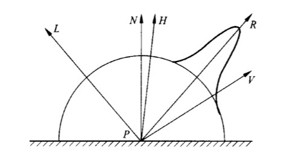
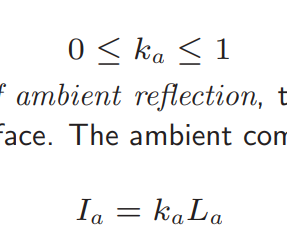
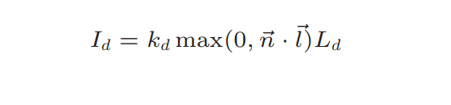
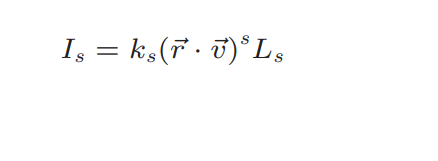
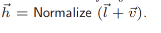
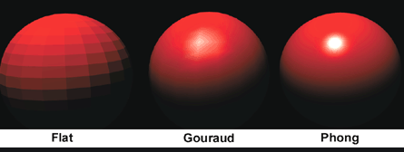

 

## 简介

**（Phong模型）标准光照模型只关心直接光，经过物体一次反射进入相机的光线。**


Phong著色法，三维电脑图像的绘图技巧之一，结合了多边形物体表面反射光的亮度，并以特定位置的表面法线作为像素参考值，以插值方式来估计其他位置像素的色值。

这个方法由美国越南裔学者裴祥风发明，于1973年的博士论文首度发表。

Phong著色法
与Gouraud著色法比较，Phong著色法的效果更逼真，能够提供更好的光滑曲面的近似值。Phong著色法假设一个平滑变化的曲面为一矢量。在对于有较小的高光曲线区的反射模型，例如PHONG模型时，Phong著色法比Gouraud著色法更优。但运算程序也比前者为复杂。Gouraud著色法在遇到在较大的多边形模型中央有高光曲线区时会产生严重的问题。因为这些高光曲线区在多边形的顶点处会产生缺失，而Gouraud著色法是基于顶点的颜色的，这些高光曲线区会从多边形的内部缺失。这个问题在Phong著色法中得到了解决。不同于通过多边形差值的Gouraud著色法，Phong著色法中一个矢量是从多边形顶点的法线到多边形表面进行差值的。为了或得到最后的像素颜色，面的法线被差值，应用于一个反射模型。由于Phong著色法需要逐像素点进行计算，因此运算量远大于Gouraud著色法。


Phong光照模型是真实图形学中提出的第一个有影响的光照明模型，该模型只考虑物体对直接光照的反射作用，认为环境光是常量，没有考虑物体之间相互的反射光，物体间的反射光只用环境光表示。Phong光照模型属于简单光照模型。


在3D计算机图形学中，**Phong**着色是计算机图形学先驱**Bui Tuong Phong**发明的一种用于表面着色的插值技术。也称为Phong插值或法向矢量插值阴影。它会在栅格化的多边形上内插表面法线，并根据内插法线和反射模型计算像素颜色。Phong阴影也可以指Phong插值和Phong反射模型的特定组合。


**历史：**

在1975年，由Phong提出，以他的名字冠名。是一种局部光照的模型，他认为一个光照模型可以用三种不同的部分组成，主要包括`ambient`,`diffuse`,`specular`(环境光，漫反射和高光)。


Phong著色法，三维电脑图像的绘图技巧之一，结合了多边形物体表面反射光的亮度，并以特定位置的表面法线作为像素参考值，以插值方式来估计其他位置像素的色值。

这个方法由美国越南裔学者裴祥风发明，于1973年的博士论文首度发表。

Phong著色法
与Gouraud著色法比较，Phong著色法的效果更逼真，能够提供更好的光滑曲面的近似值。Phong著色法假设一个平滑变化的曲面为一矢量。在对于有较小的高光曲线区的反射模型，例如PHONG模型时，Phong著色法比Gouraud著色法更优。但运算程序也比前者为复杂。Gouraud著色法在遇到在较大的多边形模型中央有高光曲线区时会产生严重的问题。因为这些高光曲线区在多边形的顶点处会产生缺失，而Gouraud著色法是基于顶点的颜色的，这些高光曲线区会从多边形的内部缺失。这个问题在Phong著色法中得到了解决。不同于通过多边形差值的Gouraud著色法，Phong著色法中一个矢量是从多边形顶点的法线到多边形表面进行差值的。为了或得到最后的像素颜色，面的法线被差值，应用于一个反射模型。由于Phong著色法需要逐像素点进行计算，因此运算量远大于Gouraud著色法。


Phong光照模型是真实图形学中提出的第一个有影响的光照明模型，该模型只考虑物体对直接光照的反射作用，认为环境光是常量，没有考虑物体之间相互的反射光，物体间的反射光只用环境光表示。Phong光照模型属于简单光照模型。



## 基本概念


Phong模型认为物体表面反射光线由三部分组成：

- 环境光（Ambient）：场景中的其他间接光照
- 漫反射（Diffuse）：散射部分（大但不光亮）
- 高光反射（Specular）：镜面反射部分（小而亮）


### ambient光照

环境光照是考虑到即使在不可见光源的地方，经过各种反射，总会带有微弱的光照。光线追踪的算法会更加准确，但是在这里采用一种简化的方法。就是将光源的颜色，乘以一个很小的系数，再乘以物体的颜色。

```GLSL
vec3 ambient = 0.1 * lightColor * objectColor;
```


### diffuse光照

漫反射光照是考虑到，离光源越近，直接受光源照射的片段，理应比其他片段更亮。这种概念可以用两个向量表示，分别是片段到光源的位移向量与片段表面的单位法向量，他们的向量积表示了一种衡量漫反射的强度的量。

```GLSL
vec3 lightDir = lightPos - FragPos;
float diffuse = dot(norm,lightDir)
```


### specular光照的计算

Phong光照模型在多数时候表现良好，然而在specular光照的计算时，当位移向量和反射光的向量大于90度时，该高光会丢失。表现出来会出现不正确的光线边界。


为了弥补这个缺陷，引入一个`half_way`向量作为新的度量，`halfway`向量是view向量与lightDir向量之和，它与法向量的叉积作为强度衡量，可确保永远不会大于90度。


此外还有一点，Phong的模型的反射光总是呈现一个圆斑，即使当视角平行于平面的时。而BlinnPhong会被拉伸成一个椭圆形，更符合真实情况。


## 推到过程

phong 模型相关向量


- 法向量（Normal vector）：$n$
- 视口向量（View vector）：$v$
- 光源向量（Light vector）：$l$
- 反射向量（Reflection vector）：$r$


法线计算

给定一个多边形上任意三个非共线的点，P0 P1 P2，该多边形的法线是通过叉乘得到的


公式
$$
\vec{n} = ( P _ { 1 } - P _ { 0 } ) \times ( P _ { 2 } - P _ { 0 } )
$$


反射向量


$$
\begin{array}{r}
\vec{n}^{\prime}=(\vec{n} \cdot \vec{l}) \vec{n} \\
\vec{u}=\vec{n}^{\prime}-\vec{l} \\
\vec{r}=\vec{l}+2 \vec{u}=\vec{l}+2\left(\vec{n}^{\prime}-\vec{l}\right)=2(\vec{n} \cdot \vec{l}) \vec{n}-\vec{l}
\end{array}
$$


## 环境光的计算




## 漫反射的计算

**漫反射亮度受****光线****入射方向I****与****单位表面的法线n夹角影响**





$$
0 \leq k _ { a } \leq 1
$$


# 反射光计算


第一



第二


半角向量 halfway vector




## Phong 模型的不足


## Phong模型照明方程


光源部分：

- `lights`：所有光源的集合，对于每盏光，可分为高光和漫反射两部分，如下：
- `i_s`：光源高光部分的强度（可以理解为就是RGB）
- `i_d`：光源漫反射部分的强度（可以理解为就是RGB）
- `i_a`：环境光部分的强度（可以理解为就是RGB）

场景中材质的参数：

- `k_s`：对入射光的高光反射常数
- `k_d`：对入射光的漫反射常数
- `k_a`：对环境光的反射常数
- `\alpha`：材质的光泽度，或叫反光度，也是常数。表面越光泽则`\alpha`越大，表面的亮点就越小。


公式
$$
I_p = k_a i_a + \sum_{m \in lights} (k_d(\hat{L_m} \cdot \hat{N})i_{m,d} + k_{s}(\hat{R_m} \cdot \hat{V})^\alpha i_{m,s})
$$

$$
\hat{R_m} = 2(\hat{L_m} \cdot \hat{N})\hat{N} - \hat{L_m}
$$


# 实现

## GLSL实现

单光源


多光源





## HLSL实现


## Unity shader实现

```glsl
Shader "Unlit/PhongLightModel"
{
    Properties
    {
        _MainTex ("Texture", 2D) = "white" {}//主贴图
        _MainColor ("Main Color", Color) = (1.0, 1.0, 1.0, 1.0)//主颜色，默认白色
        _SpecularColor ("Specular Color", Color) = (0, 0, 0, 1.0)//高光颜色，默认黑色
        _Shininess ("Gloss", Range(0.0, 10)) = 0.5//反光度
    }
    SubShader
    {
        Tags { "RenderType"="Opaque" }
        LOD 100

        Pass
        {
            Tags { "LightMode" = "ForwardBase" }

            CGPROGRAM

            #pragma vertex vert
            #pragma fragment frag
            
            #include "UnityCG.cginc"
            #include "Lighting.cginc" 

            struct a2v
            {
                float4 vertex : POSITION;//顶点
                float2 uv : TEXCOORD0;//uv
                float3 normal : NORMAL;//法线
            };

            struct v2f
            {
                float2 uv : TEXCOORD0;//顶点
                float3 worldLightDir:TEXCOORD1;//世界坐标系下的指向光源的矢量
                float3 worldNormal:TEXCOORD2;//世界坐标系下法线
                float3 worldViewDir :TEXCOORD3; //世界坐标系下的指向观察者的矢量
                float4 pos : SV_POSITION;//裁剪坐标下的顶点
            };

            sampler2D _MainTex;
            float4 _MainTex_ST;
            fixed4 _SpecularColor;
            fixed4 _MainColor;
            float _Shininess;
            
            v2f vert (a2v v)
            {
                v2f o;

                //使用UNITY_MATRIX_MVP矩阵做仿射变换，把模型空间下的顶点转到裁剪坐标下
                o.pos = mul(UNITY_MATRIX_MVP,v.vertex);
                
                //取得世界坐标系下的法线,UnityObjectToWorldNormal()在UnityCG.cginc被定义
                o.worldNormal = UnityObjectToWorldNormal(v.normal);

                //取得世界坐标系下的指向光源的矢量，WorldSpaceLightDir()在UnityCG.cginc被定义
                o.worldLightDir = WorldSpaceLightDir(v.vertex);

                //取得世界坐标系下的指向观察者的矢量，WorldSpaceLightDir()在UnityCG.cginc被定义
                o.worldViewDir = WorldSpaceViewDir(v.vertex);

                //uv采样
                o.uv = TRANSFORM_TEX(v.uv, _MainTex);
                return o;
            }
            
            fixed4 frag (v2f i) : SV_Target
            {
                //归一化
                fixed3 normalizedLightDir  = normalize(i.worldLightDir);
                fixed3 normalizedNormal = normalize(i.worldNormal);
                fixed3 normalizedViewDir = normalize(i.worldViewDir);

                //像素颜色采样
                fixed3 albedo = tex2D(_MainTex, i.uv);
                
                //计算环境光
                fixed3 ambient = UNITY_LIGHTMODEL_AMBIENT.xyz * albedo;

                //计算漫反射
                fixed3 diffuse = (_LightColor0.rgb * albedo) * saturate(dot(normalizedNormal,normalizedLightDir));

                //计算高光
                fixed3 halfDir = normalize(normalizedViewDir + normalizedLightDir);
                fixed3 specular = (_SpecularColor.rgb * _LightColor0.rgb) * pow(saturate(dot(halfDir,normalizedNormal )),_Shininess);

                return fixed4((ambient+diffuse+specular),1);
            }
            ENDCG
        }
    }
    FallBack  "Specular"
}
```


```
Shader "Custom/BlinnPhongLight"
{
	Properties
	{
		_MainTex("MainTex",2D) = "white"{}
		_Gloss("Gloss",Range(8.0,256)) = 20
	}
	SubShader
	{
		LOD 100
		Pass
		{
			Name "LambertLight"
			Tags{"LightMode" = "ForwardAdd"}
			CGPROGRAM
			#pragma vertex vert 
			#pragma fragment frag

			uniform float4 _LightColor0;
			struct a2v
			{
				float4 model_vertex : POSITION;
				float3 model_normal : NORMAL;
				float2 uv : TEXCOORD0;
			};

			struct v2f
			{
				float4 clip_pos : SV_POSITION;
				float2 uv : TEXCOORD0;
				float3 world_pos : TEXCOORD1;
				float3 world_normal : TEXCOORD2;
				float4 objPos : TEXCOORD3;
			};

			sampler2D _MainTex;
			fixed _Gloss;

			v2f vert(a2v v)
			{
				v2f o;
				o.uv = v.uv;
				o.clip_pos = UnityObjectToClipPos(v.model_vertex);
				o.world_normal = mul((float3x3)unity_ObjectToWorld, v.model_normal);  //UnityObjectToWorldNormal(v.model_normal);
				o.world_pos = mul(unity_ObjectToWorld, v.model_vertex).xyz;
				o.objPos = v.model_vertex;
				return o;
			}

			fixed4 frag(v2f i) : SV_Target
			{
				//顶点法线(世界空间)
				fixed3 world_normal = normalize(i.world_normal);
				//光入射方向(世界空间)
				fixed3 world_light = _WorldSpaceLightPos0.xyz - i.world_pos.xyz;
				fixed3 world_light_dir = normalize(world_light);
				//观察方向
				fixed3 world_view_dir = normalize(_WorldSpaceCameraPos.xyz - i.world_pos.xyz);
				//距离光源的位置
				float world_light_distance = length(world_light);
				//衰減系数
				float atten = 1 / pow(world_light_distance, 2);
				//环境光(固定系数)
				fixed3 ambientColor = UNITY_LIGHTMODEL_AMBIENT.rgb;
				//漫反射
				fixed3 diffuseColor = atten * _LightColor0.rgb * max(0, dot(world_normal, world_light_dir));
				//镜面反射
				fixed3 specularColor = atten * _LightColor0.rgb * pow(max(0, dot(world_normal, normalize(world_view_dir + world_light_dir)) ), _Gloss);
				//最终光颜色
				fixed3 lightColor = ambientColor + diffuseColor +specularColor;
				//贴图颜色
				fixed4 texture_color = tex2D(_MainTex, i.uv);
				//叠加光颜色
				fixed3 finalColor = texture_color.rgb * lightColor;
				return fixed4(finalColor, 1.0);
			}
			ENDCG
		}
	}
}
```


## 相关链接

[Phong+Shading pdf)](https://web.eecs.umich.edu/~sugih/courses/eecs487/lectures/16-Phong+Shading.pdf)

[Illumination I: The Phong Illumination Model pdf](https://www.cs.utexas.edu/~bajaj/graphics2012/cs354/lectures/lect14.pdf)

[一种改进的Phong光照模型及光线跟踪实现](http://gb.oversea.cnki.net/KCMS/detail/detail.aspx?filename=XTFZ200212021&dbcode=CJFD&dbname=cjfd2002)

[Phong wiki](https://en.wikipedia.org/wiki/Phong_reflection_model)

[Jim Blinn](https://en.wikipedia.org/wiki/Jim_Blinn)

[Bui Tuong Phong](https://en.wikipedia.org/wiki/Bui_Tuong_Phong)

[Phong reflection model](https://en.wikipedia.org/wiki/Phong_reflection_model)

Blinn–Phong GLSL多光源实现 [Blinn–Phong reflection model](https://en.wikipedia.org/wiki/Blinn%E2%80%93Phong_reflection_model)

**Blog**

[Phong和Blinn照明模型之间的关系](https://seblagarde.wordpress.com/2012/03/29/relationship-between-phong-and-blinn-lighting-model/)

[blinn-phong-shading](https://garykeen27.wixsite.com/portfolio/blinn-phong-shading)

[百度百科 镜面反射](https://baike.baidu.com/item/%E9%95%9C%E9%9D%A2%E5%8F%8D%E5%B0%84/805523)


国外大学课程

使用WebGL实现了一些效果 [CS315: Illumination 2](https://www.cs.uregina.ca/Links/class-info/315/WebGL/Lab7/)

代码实现

[OpenGL: Blinn-Phong model implemented in shaders give wrong result](https://stackoverflow.com/questions/50875639/opengl-blinn-phong-model-implemented-in-shaders-give-wrong-result)

[opengl高级光照-Blinn-Phong](https://www.jianshu.com/p/1587e2b96d76)

[DirectX10 Tutorial 8: Lighting Theory and HLSL](https://takinginitiative.wordpress.com/2010/08/30/directx-10-tutorial-8-lighting-theory-and-hlsl/)

[HLSL per-pixel point light using phong-blinn lighting model](https://brooknovak.wordpress.com/2008/11/13/hlsl-per-pixel-point-light-using-phong-blinn-lighting-model/)

[Lambert、Phong、BlinnPhong光照模型(逐顶点+逐像素计算)](https://zhuanlan.zhihu.com/p/85511319)

论文

Bui Tuong Phong published his illumination model in 1973: "[Illumination for Computer-Generated Images](http://portal.acm.org/citation.cfm?id=906584&dl=ACM&coll=&CFID=15151515&CFTOKEN=6184618)".


四大光照模型

> 
>
> ### Phong Shading Model
>
> Bui Tuong Phong published his illumination model in 1973: "[Illumination for Computer-Generated Images](http://portal.acm.org/citation.cfm?id=906584&dl=ACM&coll=&CFID=15151515&CFTOKEN=6184618)".
>
> ### Blinn-Phong Shading Model
>
> This model was introduces by Blinn, James F. [Models of Light Reflection for Computer Synthesized Pictures](http://portal.acm.org/citation.cfm?id=563893). Computer Graphics (SIGGRAPH 77 Proceedings) 11(2) July 1977, p. 192-198.
>
> ### Cook-Torrance Shading Model
>
> Robert L. Cook, Kenneth E. Torrance, [A reflectance model for computer graphics](http://portal.acm.org/citation.cfm?id=357293), 1982.
>
> ### Schlick Shading Model
>
> This lighting model was created by Christophe Schlick, [A Customizable Reflectance Model for Everyday Rendering](http://dept-info.labri.fr/~schlick/DOC/ewr3.html), Fourth Eurographics Workshop on Rendering, 1993.


## 数学基础

### 平面法线计算

给定一个多边形上任意三个非共线的点，P0 P1 P2，计算该平面的法线：


公式
$$
\vec{n} = ( P _ { 1 } - P _ { 0 } ) \times ( P _ { 2 } - P _ { 0 } )
$$


### 反射向量计算


$$
\begin{gather}
\vec{n}^{\prime}=(\vec{n} \cdot \vec{l}) \vec{n} \\
\vec{u}=\vec{n}^{\prime}-\vec{l} \\
\vec{r}=\vec{l}+2 \vec{u}=\vec{l}+2\left(\vec{n}^{\prime}-\vec{l}\right)=2(\vec{n} \cdot \vec{l}) \vec{n}-\vec{l}
\end{gather}
$$

### 半角向量计算

平均分割了一个角的向量


$$
H = \frac { L + V } { | | L + V | | }
$$


# 公式推导

光照最终结果=环境光照+漫反射光照+镜面反射光照


- 法向量（Normal vector）：$n$
- 视口向量（View vector）：$v$
- 光源向量（Light vector）：$l$
- 反射向量（Reflection vector）：$r$


## 环境光 ambient

环境光照是考虑到即使在不可见光源的地方，经过各种反射，总会带有微弱的光照。光线追踪的算法会更加准确，但是在这里采用一种简化的方法。就是将光源的颜色，乘以一个很小的系数，再乘以物体的颜色。

由于环境光计算过于复制，并难以计算。在Phong模型中环境光被简化为一个环境光反射系数和环境光光照强度的乘积：


-----

**计算方程:**
$$
0 \leq k _ { a } \leq 1\\\\
I _ { a } = k _ { a } L _ { a }
$$

- **环境光ambient=环境光反射系数*环境光光照强度**

## 漫反射 Diffuse

> **漫反射**（简称**漫射**，英语：diffuse reflection）是指当一束平行的入射光线射到粗糙的表面时，粗糙的表面会把光线向着各个方向反射的现象。虽然入射线互相平行，由于粗糙的表面上的各点的法线方向不一致，造成反射光线向不同的方向无规则地反射。这种反射的光称为漫射光。很多物体，如植物、墙壁、衣服等，其表面粗看起来似乎是平滑，但用放大镜仔细观察，就会看到其表面是凹凸不平的，所以本来是平行的太阳光被这些表面反射后，弥漫地射向不同方向。


、

**计算方程:**
$$
I _ { d } = k _ { d } m a x ( 0 , \vec{n} \cdot \vec{l} ) L _ { d }\\\\
0 \leq k _ { d } \leq 1
$$

- 漫反射亮度受光线入射方向$l$与单位表面的法线$n$夹角影响
- 受$l$和$n$的夹角的影响，夹角为0时光照最亮，夹角为90度时无光照
- 如果$ \vec{n} \cdot \vec{l} <0$ ，代表光照方向和法线方向相反，此时不做光照处理：$m a x ( 0 , \vec{n} \cdot l ) $ 

## 高光反射 Specular

镜面反射是指若反射面比较光滑，当平行入射的光线射到这个反射面时，仍会平行地向一个方向反射出来，这种反射就属于镜面反射

当一束平行光触及光滑物体表面时，光线则发生规律性反射，反射后的光线也相互平行，这种规律性反射称为光的单向反射或镜面反射。但物体的光滑程度是相对的，而一般物体的表面多粗糙不平，入射线虽然为平行光线，但反射后的光线则向各个方向分散，此种现象为光的漫反射。

-----

**计算方程：**
$$
I_{s}=k_{s}(\vec{r} \cdot \vec{v})^{s} L_{s}
$$

- 取反射方向和视口方向的夹角作为高光区域的判定
- 指数系数$s$: 如下图所示，控制高光区域的大小


-----

## Phong 经验模型

$$
\begin{aligned}
I &=I_{a}+I_{d}+I_{s} \\
&=k_{a} L_{a}+k_{d} \max (0, \vec{n} \cdot \vec{l}) L_{d}+k_{s}(\vec{r} \cdot \vec{v})^{s} L_{s}
\end{aligned}
$$


# 光照衰减系数

### 球型衰减系数


## Blinn-Phong光照模型

Blinn-Phong光照模型在物理上的正确性不必Phong高，但计算效率提高了很多。当观察向量与反射向量越接近，那么半角向量与法向量N越接近，观察者看到的镜面光成分越强。


## Blinn-Phong 计算方程

$$
\begin{aligned}
I &=I_{a}+I_{d}+I_{s} \\
&=k_{a} L_{a}+k_{d} \max (0, \vec{n} \cdot \vec{l}) L_{d}+k_{s}(\vec{n} \cdot \vec{h})^{s} L_{s}
\end{aligned}
$$


## Blinn-Phong和Phong对比


## GLSL实现


### Phong

```
#version 330 core
out vec4 FragColor;

in vec3 Normal;  
in vec3 FragPos;  
  
uniform vec3 lightPos; 
uniform vec3 viewPos; 
uniform vec3 lightColor;
uniform vec3 objectColor;

void main()
{
    // ambient
    float ambientStrength = 0.1;
    vec3 ambient = ambientStrength * lightColor;
  	
    // diffuse 
    vec3 norm = normalize(Normal);
    vec3 lightDir = normalize(lightPos - FragPos);
    float diff = max(dot(norm, lightDir), 0.0);
    vec3 diffuse = diff * lightColor;
    
    // specular
    float specularStrength = 0.5;
    vec3 viewDir = normalize(viewPos - FragPos);
    vec3 reflectDir = reflect(-lightDir, norm);  
    float spec = pow(max(dot(viewDir, reflectDir), 0.0), 32);
    vec3 specular = specularStrength * spec * lightColor;  
        
    vec3 result = (ambient + diffuse + specular) * objectColor;
    FragColor = vec4(result, 1.0);
} 
```


```
#version 330 core
layout (location = 0) in vec3 aPos;
layout (location = 1) in vec3 aNormal;

out vec3 FragPos;
out vec3 Normal;

uniform mat4 model;
uniform mat4 view;
uniform mat4 projection;

void main()
{
    FragPos = vec3(model * vec4(aPos, 1.0));
    Normal = mat3(transpose(inverse(model))) * aNormal;  
    
    gl_Position = projection * view * vec4(FragPos, 1.0);
}
```

### Blinn-Phong

```
#version 330 core
layout (location = 0) in vec3 aPos;
layout (location = 1) in vec3 aNormal;
layout (location = 2) in vec2 aTexCoords;

// declare an interface block; see 'Advanced GLSL' for what these are.
out VS_OUT {
    vec3 FragPos;
    vec3 Normal;
    vec2 TexCoords;
} vs_out;

uniform mat4 projection;
uniform mat4 view;

void main()
{
    vs_out.FragPos = aPos;
    vs_out.Normal = aNormal;
    vs_out.TexCoords = aTexCoords;
    gl_Position = projection * view * vec4(aPos, 1.0);
}
```


```
#version 330 core
out vec4 FragColor;

in VS_OUT {
    vec3 FragPos;
    vec3 Normal;
    vec2 TexCoords;
} fs_in;

uniform sampler2D floorTexture;
uniform vec3 lightPos;
uniform vec3 viewPos;
uniform bool blinn;

void main()
{           
    vec3 color = texture(floorTexture, fs_in.TexCoords).rgb;
    // ambient
    vec3 ambient = 0.05 * color;
    // diffuse
    vec3 lightDir = normalize(lightPos - fs_in.FragPos);
    vec3 normal = normalize(fs_in.Normal);
    float diff = max(dot(lightDir, normal), 0.0);
    vec3 diffuse = diff * color;
    // specular
    vec3 viewDir = normalize(viewPos - fs_in.FragPos);
    vec3 reflectDir = reflect(-lightDir, normal);
    float spec = 0.0;
    if(blinn)
    {
        vec3 halfwayDir = normalize(lightDir + viewDir);  
        spec = pow(max(dot(normal, halfwayDir), 0.0), 32.0);
    }
    else
    {
        vec3 reflectDir = reflect(-lightDir, normal);
        spec = pow(max(dot(viewDir, reflectDir), 0.0), 8.0);
    }
    vec3 specular = vec3(0.3) * spec; // assuming bright white light color
    FragColor = vec4(ambient + diffuse + specular, 1.0);
}
```

