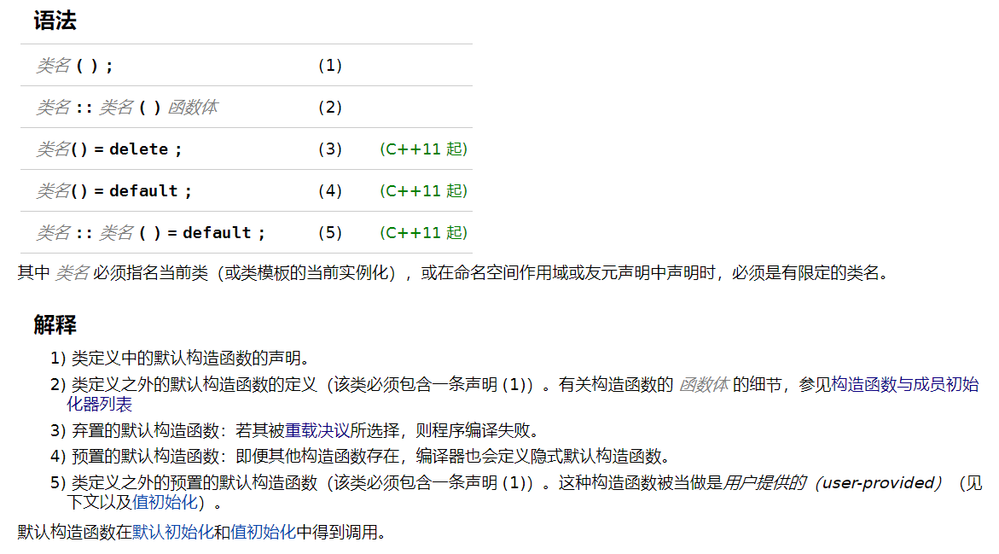

默认构造函数-析构函数

复制构造函数-复制赋值运算符

移动构造函数-移动复制运算符

转换构造函数-explicit 说明符

### C++ 特殊成员函数

### C++ 相关函数性质

| 函数类型     | 函数是否从基类中继承 | 能否为虚拟函数 | 能否有返回值 | 成员函数还是友元函数 | 如果用户不提供此函数，编译器能否生成 |
| ------------ | -------------------- | -------------- | ------------ | -------------------- | ------------------------------------ |
| 构造函数     | 否                   | 否             | **否**       | 成员函数             | 是                                   |
| 拷贝构造函数 | 否                   | 否             | **否**       | 成员函数             | 是                                   |
| 析构函数     | 否                   | 是             | **否**       | 成员函数             | 是                                   |
| 转换         | 是                   | 是             | **否**       | 成员函数             | 否                                   |
| 赋值(=)      | **否**               | 是             | 是           | 成员函数             | 是                                   |
| new          | 是                   | **否**         | void*        | 静态成员函数         | 否                                   |
| delete       | 是                   | **否**         | void         | **静态成员函数**     | 否                                   |
| 其它成员函数 | 是                   | 是             | 是           | 成员函数             | 否                                   |
| 友元函数     | **否**               | 否             | 是           | 友元函数             | 否                                   |

### 默认构造函数-析构函数

**默认构造函数**

默认构造函数是可以无实参调用的构造函数（以空参数列表定义，或为每个形参提供默认实参而定义）。拥有公开默认构造函数的类型是可默认构造 (DefaultConstructible) 的。

析构函数

## 复制构造函数-复制赋值运算符

## 移动构造函数-移动复制运算符

## 转换构造函数-explicit 说明符

## 示例

## 相关参考	

[https://zh.cppreference.com/w/cpp/language](https://zh.cppreference.com/w/cpp/language)