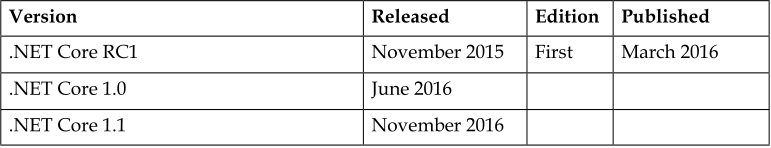
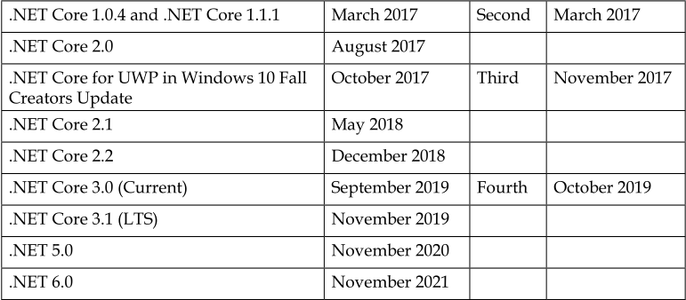
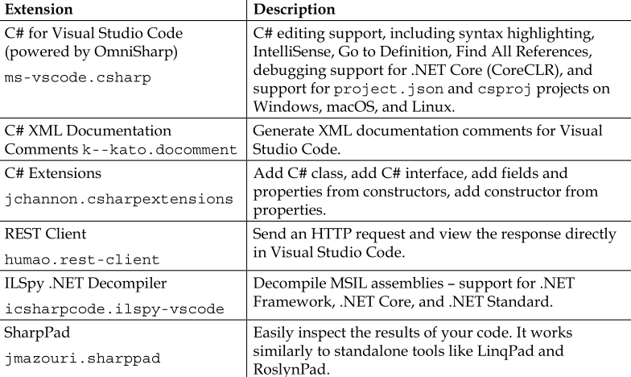
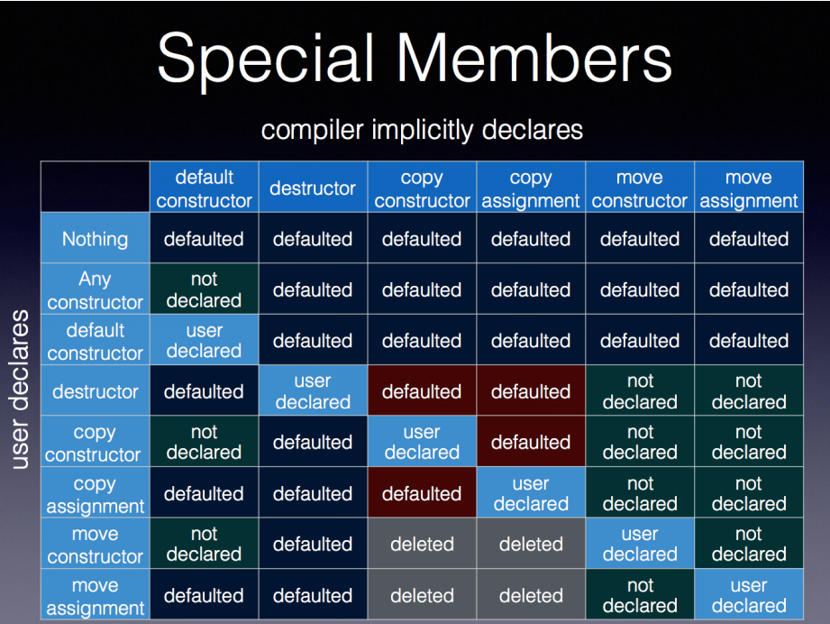

# Hexo init 卡死

https://github.com/hexojs/hexo/issues/3693


https://www.google.com.hk/search?q=hexo+%E5%AE%89%E8%A3%85&oq=hexo+%E5%AE%89%E8%A3%85&aqs=chrome..69i57j69i59l3j69i60j69i65j69i60l2.1629j0j1&sourceid=chrome&ie=UTF-8 | hexo 安装 - Google 搜索
https://www.jianshu.com/p/09b5e01e87f3 | Hexo的安装记录 - 简书
https://www.jianshu.com/go-wild?ac=2&url=https%3A%2F%2Fhexo.io%2Fzh-cn%2Fdocs%2Findex.html | 简书
https://www.jianshu.com/go-wild?ac=2&url=https%3A%2F%2Fhexo.io%2Fzh-cn%2Fdocs%2F | 简书
https://blog.csdn.net/xuezhisdc/article/details/53130328 | (16条消息) hexo教程系列——hexo安装教程_张学志の博客-CSDN博客
https://juejin.im/post/6844903651341762573 | Hexo 的安装与配置
https://zhuanlan.zhihu.com/p/26625249 | GitHub+Hexo 搭建个人网站详细教程 - 知乎
https://hexo.io/zh-cn/docs/ | 文档 | Hexo
https://www.google.com.hk/search?newwindow=1&safe=strict&ei=SPCzX9J1m_WHA7Cpmzg&q=hexo+init+%E5%8D%A1%E6%AD%BB&oq=hexo+init+%E5%8D%A1%E6%AD%BB&gs_lcp=CgZwc3ktYWIQAzIFCCEQoAE6BAgAEEc6BAgAEEM6AggAOgQIABAMOgQIABAeUJH_DliQng9gxZ8PaABwAngBgAHOBogBthuSAQsyLTYuMS4xLjEuMZgBAKABAaoBB2d3cy13aXrIAQjAAQE&sclient=psy-ab&ved=0ahUKEwjSuZup9ontAhWb-mEKHbDUBgcQ4dUDCA0&uact=5 | hexo init 卡死 - Google 搜索
http://freesouls.github.io/2015/06/06/fix-hexo/index.html | 解决Hexo安装node-gyp卡住等问题 | Freesouls
https://weilining.github.io/201021.html | 彻底解决 hexo init 卡顿问题 | Ln's Blog
https://blog.csdn.net/ibmall/article/details/81390639 | (16条消息) npm 安装 hexo 卡住问题解决_慢读慢写-CSDN博客_hexo init卡住
https://blog.csdn.net/NuanShuTT/article/details/107942899 | (16条消息) hexo init出错（解决方法）_NuanShuTT的博客-CSDN博客
https://github.com/hexojs/hexo/issues/3693 | 安装hexo博客时，hexo init blog这一步卡住了 · Issue #3693 · hexojs/hexo
https://segmentfault.com/q/1010000037428720 | hexo init 卡住 - SegmentFault 思否
https://www.v2ex.com/t/713817 | hexo init 卡住一直没动静 - V2EX

# Hexo 文章

[](https://zhuanlan.zhihu.com/p/35668237)

[安装](https://juejin.im/post/6844903651341762573)

**博客目录构成介绍**

从上图可以看出，博客的目录结构如下：

```text
- node_modules
- public
- scaffolds
- source
    - _posts
    - about
    - archive
    - img
    - tags
- themes
```

`node_modules`是node.js各种库的目录，`public`是生成的网页文件目录，`scaffolds`里面就三个文件，存储着新文章和新页面的初始设置，`source`是我们最常用到的一个目录，里面存放着文章、各类页面、图像等文件，`themes`存放着主题文件，一般也用不到。

我们平时写文章只需要关注`source/_posts`这个文件夹就行了。

网站图片都保存在`D:\study\program\blog\source\img`目录下，可以修改成自己的图片。

# Hexo 基础配置

**文章头设置**

> 首先为了新建文章方便，建议将`/scaffolds/post.md`修改为如下代码：
>
> ```json
> ---
> title: {{ title }}
> date: {{ date }}
> top: false
> cover: false
> password:
> toc: true
> mathjax: true
> summary:
> tags:
> categories:
> ---
> ```


# Hexo Cactus 配置

[GitHub](https://github.com/probberechts/hexo-theme-cactus)


文章

https://xuthus.cc/misc/cactus-chinese-support.html

# Hexo 部署

https://hexo.io/docs/one-command-deployment.html


# Hexo 命令


# Hexo 常用插件

hexo 引文支持 hexo-reference


hexo-math


hexo-tag-bilibili 插入b站视频


hexo-tag-hint 插入悬停提示

# hexo 博客目录结构


https://www.google.com.hk/search?q=hexo+%E8%87%AA%E5%8A%A8%E6%B7%BB%E5%8A%A0%E6%96%87%E7%AB%A0&oq=hexo+%E8%87%AA%E5%8A%A8%E6%B7%BB%E5%8A%A0%E6%96%87%E7%AB%A0&aqs=chrome..69i57j69i60.4082j0j1&sourceid=chrome&ie=UTF-8 | hexo 自动添加文章 - Google 搜索
http://r3es3e.coding-pages.com/posts/15009/ | hexo+matery主题目录结构详解 | 小苏の万事屋
https://www.dazhuanlan.com/2020/02/06/5e3b912a449ec/ | hexo目录结构 | 大专栏
https://dxsummer.gitee.io/posts/48b5ba15 | hexo的目录结构 - Dx
https://blog.csdn.net/abc_12366/article/details/87864623 | (16条消息) 【博客系统】Hexo的目录结构_清风阁-CSDN博客_hexo目录结构
https://blog.csdn.net/weixin_34224941/article/details/88591596 | (16条消息) 简单认识Hexo的目录结构_weixin_34224941的博客-CSDN博客
https://yuchen-lea.github.io/2016-01-18-hexo-dir-struct/ | hexo目录结构小探 | 跬步
http://syxiaqj.github.io/2014/02/18/structure-of-hexo/ | hexo的目录结构及作用 | 浪花一朵朵


# hexo 文章版权声明


# github 项目取名

https://zh.wikipedia.org/wiki/%E9%AD%94%E5%85%BD%E7%B3%BB%E5%88%97%E8%A7%92%E8%89%B2%E5%88%97%E8%A1%A8


# git remote


# 静态博客搭建

https://www.google.com.hk/search?q=%E9%9D%99%E6%80%81%E5%8D%9A%E5%AE%A2%E7%94%9F%E6%88%90%E6%96%B9%E6%A1%88&oq=%E9%9D%99%E6%80%81%E5%8D%9A%E5%AE%A2%E7%94%9F%E6%88%90%E6%96%B9%E6%A1%88&aqs=chrome..69i57j69i61.782j0j1&sourceid=chrome&ie=UTF-8 | 静态博客生成方案 - Google 搜索
https://sspai.com/post/58013 | 用 GitHub 搭建静态博客太繁琐？用这个小工具实现「傻瓜式」发布 - 少数派
https://www.readercache.com/q/zJ5kevowjKnZ2xN4vRQ0NxYPdGg87RVb | www.readercache.com | 502: Bad gateway
https://blog.ichr.me/post/automated-deployment-of-serverless-static-blog/ | 初探无后端静态博客自动化部署方案 | ChrAlpha's Blog
https://weiweitop.fun/2020/03/18/%E9%9D%99%E6%80%81%E5%8D%9A%E5%AE%A2%E7%9B%AE%E5%BD%95%E7%94%9F%E6%88%90%E6%96%B9%E6%A1%88%E9%80%89%E6%8B%A9/ | 静态博客目录生成方案选择 - 闲云野鹤
https://www.zhihu.com/question/35967131 | (1 封私信 / 80 条消息) 有哪些静态博客生成方案? - 知乎
https://www.google.com.hk/search?q=github+%E9%9D%99%E6%80%81%E5%8D%9A%E5%AE%A2%E6%96%B9%E6%A1%88&oq=github+%E9%9D%99%E6%80%81%E5%8D%9A%E5%AE%A2%E6%96%B9%E6%A1%88&aqs=chrome..69i57j69i64j69i61.6034j0j1&sourceid=chrome&ie=UTF-8 | github 静态博客方案 - Google 搜索
https://xie.infoq.cn/article/f295db90500890c80d68fdf7f | 如何搭建个人博客:新方案 blogdown + hugo + netlify + github - InfoQ 写作平台
https://emacs-china.org/t/topic/12514 | 请问有没有比较优秀的写技术博客的方案？ - 闲聊灌水 - Emacs China
https://manateelazycat.github.io/ | ManateeLazyCat
https://blog.ichr.me/post/automated-deployment-of-serverless-static-blog/ | 初探无后端静态博客自动化部署方案 | ChrAlpha's Blog
https://www.cnblogs.com/panchanggui/p/12483459.html | 个人博客搭建方案选择 - panchanggui - 博客园
https://arrfu.com/blog-build-jekyll-hexo-wordpress.html | 免费搭建个人博客的几种高效方案 - arrfu
https://cloud.tencent.com/developer/article/1544807 | 利用Github+Jeklly搭建个人博客网站 - 云+社区 - 腾讯云
https://zhuanlan.zhihu.com/p/91494657 | 利用Github+Jeklly搭建个人博客网站 - 知乎
https://link.zhihu.com/?target=http%3A//themes.jekyllrc.org/ | 知乎 - 安全中心
https://jekyllthemes.io/ | Jekyll Themes – a curated directory
http://jekyllthemes.org/themes/jekyll-rtd-theme/ | jekyll-rtd-theme


# 备忘

vulkan 规格

# Hexo 个性化大全


# hexo 性能优化

# Hexo 更改字体大小

https://www.google.com.hk/search?newwindow=1&safe=strict&ei=0NWzX6iOF9n7wAOahZawCQ&q=Hexo+%E8%B0%83%E6%95%B4%E5%AD%97%E4%BD%93%E5%A4%A7%E5%B0%8F&oq=Hexo+%E8%B0%83%E6%95%B4%E5%AD%97%E4%BD%93%E5%A4%A7%E5%B0%8F&gs_lcp=CgZwc3ktYWIQAzoFCCEQoAFQ4txCWIHmQmCU50JoAHAAeACAAZoFiAHBEJIBCTItMi4xLjAuMpgBAKABAaoBB2d3cy13aXrAAQE&sclient=psy-ab&ved=0ahUKEwiotquK3YntAhXZPXAKHZqCBZYQ4dUDCA0&uact=5 | Hexo 调整字体大小 - Google 搜索
https://starwindy.oschina.io/2015/05/06/Hexo%E4%B8%BB%E9%A2%98%E9%85%8D%E7%BD%AE%E4%B8%8E%E4%BC%98%E5%8C%96%EF%BC%88%E4%BA%8C%EF%BC%89/ | Hexo主题配置与优化（二）
https://github.com/iissnan/hexo-theme-next/issues/400 | 如何修改全局字体大小 · Issue #400 · iissnan/hexo-theme-next
https://asymptotic-freedom.xyz/posts/f4345ea0/ | https://asymptotic-freedom.xyz/posts/f4345ea0/
https://www.jianshu.com/p/02fbd409988c | Hexo 你的博客之修改字体大小 - 简书
https://mongolian.github.io/2018/07/16/Hexo%E7%BE%8E%E5%8C%96/ | hexo 个性化设置（大全） | lee
https://blog.csdn.net/dpdpdppp/article/details/102387532 | (16条消息) hexo(Next主题)修改文字大小_dpdpdppp的博客-CSDN博客
https://leay.net/2020/02/14/hexo-next-font/ | Hexo Next 主题字体相关配置 | 禾七博客

# hexo 能放多少文章


# GitHub 更改用户名

https://www.google.com.hk/search?q=GitHub+%E6%94%B9%E5%90%8D%E5%90%8E&oq=GitHub+%E6%94%B9%E5%90%8D%E5%90%8E&aqs=chrome..69i57j0l7.5761j0j1&sourceid=chrome&ie=UTF-8 | GitHub 改名后 - Google 搜索
https://www.zhihu.com/question/35666238 | github 如何更改用户名（不是Name）? 还是说注册之后用户名就无法再更改了 - 知乎
https://www.v2ex.com/t/359788 | github 的用户名更改后有影响吗？大家的各种账号用户名是统一吗？ - V2EX
https://cloud.tencent.com/developer/ask/79650 | 如何安全地更改GitHub帐户名？ - 问答 - 云+社区 - 腾讯云
https://blog.csdn.net/qq_43827595/article/details/104308706 | (16条消息) GitHub修改用户名和仓库名的方法和注意事项_ugirc-CSDN博客
https://docs.github.com/cn/free-pro-team@latest/github/setting-up-and-managing-your-github-user-account/changing-your-github-username | 更改 GitHub 用户名 - GitHub Docs
https://docs.github.com/cn/free-pro-team@latest/github/administering-a-repository/renaming-a-repository | 重命名仓库 - GitHub Docs

# Hexo Cactus 

https://github.com/probberechts/hexo-theme-cactus

# 静态博客生成方案


# CDN

CDN 全名是 Content Delivery Network，即内容分发网络。


# GitHub 自身就是一个优秀的带有 Web 界面的内容管理系统（CMS）？


# 静态博客生成器

 Jekyll 和 Hexo hugo


# Hugo

https://github.com/gohugoio/hugo


# 编程 demo 中的变量名称


# 写博客


# b站制作视频 资料

[B站视频制作教程推荐](https://www.bilibili.com/read/cv960192/)

[各位 B 站的 up 主们，你们一般用什么视频软件进行剪辑？](https://www.zhihu.com/question/48412892)

# 制作视频

数学

C++ 教程


opengl 进阶教程


vulkan 教程

cmake 教程


**安装教程**

godot


游戏引擎安装教程


访问谷歌 GitHub开源

# 开源游戏引擎

- defold

https://defold.com/

https://github.com/defold


https://github.com/scottcgi/Mojoc


文章

https://logicsimplified.com/newgames/best-game-development-platform-for-cross-game-development/

https://computools.com/the-best-10-mobile-game-engines-and-development-platforms-tools-in-2019/

# LibGDX


# 游戏引擎

unity

说到跨平台游戏引擎，开发者最先想到的就是Unity3D。他是让开发者可以轻松创建诸如三维视频游戏、建筑可视化、实时三维动画等类型互动内容的多平台的综合型游戏开发工具，是一个全面整合的专业游戏引擎。　主要特性：

- 渲染系统：AAA级的渲染效果。
- 地形系统：强大的地形编辑器。
- Shuriken：所见即所得的粒子特效编辑系统。
- Mecanim：可视、高效的动画编辑系统。 
- Lightmap烘焙系统：逼真的离线渲染。 
- 物理系统：高效、生动的物理模拟。 
- Audio Mixer：创建复杂动态的音效。 
- 脚本编辑器：支持C#、JavaScript、Boo。 
- 性能分析器：对各大模块详细实时的性能分析。 
- Asset Store：资源丰富的在线商店。 
- 一次开发，多平台同时发布。

　　相关链接：[Unity的mobilehub主页](http://mobilehub.io/products/unity)


**2. [App Game Kit](http://www.appgamekit.com/)**

　　App Game Kit是一个用于移动跨平台游戏开发引擎，解决了许多因移动设备碎片化而产生的问题。通过它，你可以一次编写而将游戏部署到不同平台上，支持BlackBerry、Android、iOS和Windows Phone。主要特性：

- 使用方便：使用自身的BASIC脚本语言，App Game Kit让编写游戏变成小事一桩。游戏设计师、艺术家和更多的初级游戏制造商都可以尝试创建自己的应用程序。
- 提升工作效率：在IDE中编译你的BASIC游戏，利用WiFi将它传至多个设备进行即时的测试。使用这一交叉开发模式创建游戏，当你目标是多个平台时，将会大大提升工作效率。
- 多渠道：将作品发布到多个应用商店，获得多个收入来源，从交叉推广中获益，最大化开发者的成功机会。
- AGK的核心是一组命令，用来控制游戏的所有方面，包括游戏界面、声音、物理效果和碰撞等。通过使用这些提供的功能，你可以使用熟悉的IDE如Visual Studio、Xcode和Qt行业标准C++来编写游戏。

　　相关链接：[App Game Kit的mobilehub主页](http://mobilehub.io/products/appgamekit)

　　**3. [Marmalade](https://www.madewithmarmalade.com/)**

　　Marmalade SDK是一个功能强大的跨平台工具，让开发人员可以从一个代码库中横跨多平台和设备来部署代码，Marmalade会为你解决平台之间差异问题从而减低跨平台开发的痛苦。其核心是C++ SDK，旨在为开发者提供最大的性能和灵活性。

　主要特性：

- 构建强大移动游戏，无需放弃最喜爱的编程语言：使用自己熟悉的C++及API，在Visual Studio或Xcode中就可开发，让跨平台开发无需额外成本。
- 在Windows上为iOS开发：Marmalade让你通过Windows来开发、测试、调试以及部署到iOS上。让开发者可以使用最喜爱的IDE工作，不需要花时间来掌握不熟悉的开发环境，大大节省了开发者的时间。

　　相关链接：[Marmalade的mobilehub主页](http://mobilehub.io/products/marmalade)

　　**4. [Havok Vision Engine](http://www.havoksimulation.com/?q=products/havok-vision-engine)**

　　Havok Vision Engine可提供强大且多样化的多平台运行技术，该技术不但能与各种游戏完美兼容，还能以平稳的帧速率渲染极其复杂的场景。该技术可提供设计完备且面向对象的清晰C++ API，其中包含了各种功能，帮助攻克技术障碍，可用于iOS、Android和大部分主要浏览器。

　主要特性：

- 构建强大移动游戏，无需放弃最喜爱的编程语言：使用自己熟悉的C++及API，在Visual Studio或Xcode中就可开发，让跨平台开发无需额外成本。
- 在Windows上为iOS开发：Marmalade让你通过Windows来开发、测试、调试以及部署到iOS上。让开发者可以使用最喜爱的IDE工作，不需要花时间来掌握不熟悉的开发环境，大大节省了开发者的时间。

　　相关链接：[Marmalade的mobilehub主页](http://mobilehub.io/products/marmalade)

　　**4. [Havok Vision Engine](http://www.havoksimulation.com/?q=products/havok-vision-engine)**

　　Havok Vision Engine可提供强大且多样化的多平台运行技术，该技术不但能与各种游戏完美兼容，还能以平稳的帧速率渲染极其复杂的场景。该技术可提供设计完备且面向对象的清晰C++ API，其中包含了各种功能，帮助攻克技术障碍，可用于iOS、Android和大部分主要浏览器。主要特性：

- 统一制作工具：通过ShiVa编辑器编译项目，为其支持的所有设备生成可执行应用。
- 引擎插件和扩展：通过附加类似PhysX physics引擎、Fmod sounds库以及ARToolkit插件来扩展引擎的功能。
- 原生C++汇编：直接使用C++或内置的Lua C++转换器来编写游戏，大大提高脚本性能。

　　相关链接：[ShiVa3D的mobilehub主页](http://mobilehub.io/products/ShiVa3D)

　　6. [Project Anarchy](http://www.projectanarchy.com/)

　　Project Anarchy是一个完整的端到端游戏引擎以及为移动打造的最先进的工具集，是面向iOS、Android和TiZen平台的一款免费移动游戏引擎。它包括Havok视觉引擎以及Havok物理引擎、Havok Animation Studio和Havok AI。 


　　主要特性：

- 基于可扩展的C++插件架构。
- 全面的游戏示例，包括完整的源艺术和源代码。
- 为附加的可用平台和产品、源和支持提供升级。
- 包括FMOD这一业内领先的音频工具。

　　相关链接：[Project Anarchy的mobilehub主页](http://mobilehub.io/products/ProjectAnarchy)

　　**7. [libGDX](http://libgdx.badlogicgames.com/)**

　　libGDX是一款跨平台的游戏开发框架，支持桌面、Android、iOS、BlackBerry和HTML5的Java游戏开发框架。它基于Apache 2.0许可协议开源，代码业已托管与Github上。


　　主要特性：

- 跨平台：一次编码，就可将游戏发布在Windows、Mac、Linux、Android、BlackBerry、iOS和HTML5平台上。
- 工具多样：包括Particle editor（粒子编辑器）、Texture packer（图片合成工具）和Bitmap font generator（文字生成工具）等。
- 省心：开发者只需专心编写2D或3D游戏，底层细节方面都由libGDX解决。
- 开源。

　　相关链接：[libGDX的mobilehub主页](http://mobilehub.io/products/libGDX)

　　**8. [Corona SDK](http://coronalabs.com/products/corona-sdk/)**

　　Corona是一款跨平台应用及游戏开发框架，支持iOS以及Android。无论你是构建游戏还是其他，它都是一个优先选择，全球大约有20万的开发者将其作为主要开发工具。


- Corona大量的API库大大减少了代码的编写，在Lua中进行开发，轻松学习脚本语言。
- Corona SDK让你旨在一个编码的基础上，将成品发布在iOS和Android上。
- Corona平台是建立在行业标准上的，包括OpenGL、OpenAL、Box2D、Facebook和SQLite等。

　　相关链接：[Corona的mobilehub主页](http://mobilehub.io/products/corona)

　　**9. [SIO2](http://sio2interactive.com/)**

　　SIO2是一款基于OpenGLES的跨平台2D及3D游戏引擎，支持iOS和Android，为你提供所有现代引擎功能。功能丰富，快速灵活，SIO2可以让你为最喜爱的移动平台创建AAA艺术状态的游戏，且不强迫你去使用特定地IDE代码或编写你的游戏。


　　主要特性：

- 采用标准的C和C++语言，为你的移动设备提供一个先进的便携式游戏引擎。
- SIO2使用LUA最快最灵活的脚本语言，在LUA接口中的所有SIO2的API都是可用的，SIO2脚本系统的灵活性让你通过使用SWIG去创建和整合自己的模块。
- 建立在OpenAL之上的SIO2声音系统原生支持OGG格式。

　　相关链接：[SIO2的mobilehub主页](http://mobilehub.io/products/SIO2)

　　**10. [Sirius2D](http://www.sirius2d.com/)**

　　以上说了那么多国外引擎，最后一个就是国内较为优秀的引擎，天狼星2D（Sirius2D）。它是国内第一款以WebGL为渲染核心的HTML5跨平台游戏引擎，其核心理念为“精于源，修于行，泽于众”。手把手地教会开发者掌握HTML5游戏开发这门手艺。


　　主要特性：

- 100%开源免费：天狼星2D引擎是一个基于MIT开源协议许可的永久免费的项目。
- 高效易用的渲染核心：天狼星2D的渲染模块参考了众多国外的框架，并针对JS语言特点加以改良，独创了很多效率优化的技巧，在保证代码规范的前提下，不断改进效率，使其高效迅捷。引擎将复杂的渲染模块进行了封装，方便使用，易于扩展。
- 简单+即时+跨平台：使用熟悉的JS编写完某功能后，可以在桌面设备或移动设备打开对应页面，方便快捷的检测结果是否正确，并测试效率与兼容问题。 不需任何第三方运行时插件，就可以在不同浏览器中得到几乎一致的游戏体验，真正实现“一次发布各平台同步”的目标。
- 完善的支持：除了引擎本身的文档与demo外，开发者还可以在社区中得到帮助，通过配套的网络教程与实体书籍，更细致更深入地进行学习。


# C++ 跨平台


# unity burst

https://docs.unity3d.com/Packages/com.unity.burst@1.3/manual/index.html

[csdn](https://blog.csdn.net/alph258/article/details/83997917)


# CIL Common Intermediate Language通用中间语言


# RHI


# JIT 和AOT


# Unity 跨平台


# .Net core awesome

https://github.com/jasonhua95/awesome-dotnet-core


https://zh.wikipedia.org/wiki/Xamarin

https://zh.wikipedia.org/zh-sg/.NET_Core

https://zh.wikipedia.org/zh-sg/.NET_Core


https://github.com/smack0007/GLFWDotNet

https://github.com/MikePopoloski/SharpBgfx


# .NET Core 支持

.NET Core has great support for the following types of applications on Windows,
macOS, and Linux:
•
ASP.NET Core MVC web applications.
•
ASP.NET Core Web API web services (REST/HTTP).
•
Console applications.
.NET Core has great support for the following types of applications on Windows:
•
Windows Forms applications.
•
Windows Presentation Foundation (WPF) applications.
•
Universal Windows Platform (UWP) applications.
.NET Core does not support the following types of legacy Microsoft applications and
many others:
•
ASP.NET Web Forms web applications.
•
Windows Communication Foundation services.
•
Silverlight applications.
Silverlight and ASP.NET Web Forms applications will never be able to be ported
to .NET Core, but existing Windows Forms and WPF applications could be ported
to .NET Core 3.0 on Windows in order to benefit from the new APIs and faster
performance. Existing ASP.NET MVC web applications and ASP.NET Web API web
services could be ported to .NET Core 3.0 on Windows, Linux, or macOS.


# Book  。net core


github 仓库

https://github.com/markjprice/cs8dotnetcore3

# Understanding .NET Native

More Information: You can read more about .NET Native at the
following link: https://github.com/dotnet/corert/blob/master/Documentation/intro-to-corert.md


# Understanding .NET Standard

More Information: .NET Standard versions and which .NET
platforms support them are listed at the following link:
https://github.com/dotnet/standard/blob/master/docs/versions.md.


# .net core 版本 历史




# 理解.net Understanding .NET


# vscode 快捷键 网址


Windows: https://code.visualstudio.com/shortcuts/keyboard-
shortcuts-windows.pdf
•
macOS: https://code.visualstudio.com/shortcuts/keyboard-
shortcuts-macos.pdf
•
Linux: https://code.visualstudio.com/shortcuts/keyboard-
shortcuts-linux.pdf

插件



# c++ 绑定C#


# C++ 如何绑定其他语言


# C++ 单元测试工具

[](https://github.com/catchorg/Catch2/blob/devel/docs/own-main.md)

[C++ 的单元测试工具 —— Catch](https://blog.csdn.net/huangyimo/article/details/81158290)

# Book Modern C++ (C++11/C++14) and its Standard Library

[](http://www.josuttis.de/trainings/cpp11_en.html)

# C++ 多线程 

https://docs.microsoft.com/zh-cn/cpp/standard-library/cpp-standard-library-header-files?view=msvc-160 | C + + 标准库头文件 | Microsoft Docs
https://docs.microsoft.com/zh-cn/cpp/standard-library/atomic?view=msvc-160 | <atomic> | Microsoft Docs
https://docs.microsoft.com/zh-cn/cpp/standard-library/thread?view=msvc-160 | <thread> | Microsoft Docs
https://docs.microsoft.com/zh-cn/cpp/standard-library/thread-safety-in-the-cpp-standard-library?view=msvc-160 | C++ 标准库中的线程安全 | Microsoft Docs
https://www.google.com.hk/search?newwindow=1&safe=strict&ei=fYmzX_uUKsHn-QaYgZuABA&q=c%2B%2B+thread&oq=c%2B%2B+thread&gs_lcp=CgZwc3ktYWIQAzIECAAQQzICCAAyAggAMgIIADICCAAyAggAMgIIADICCAAyAggAMgIIADoECAAQDFDcWViga2D8bWgAcAB4AYAB8QaIAfobkgENMC41LjAuMi4xLjEuMZgBAKABAaoBB2d3cy13aXrAAQE&sclient=psy-ab&ved=0ahUKEwi7x8illIntAhXBc94KHZjABkAQ4dUDCA0&uact=5 | c++ thread - Google 搜索
https://en.cppreference.com/w/cpp/thread/thread | std::thread - cppreference.com
http://www.cplusplus.com/reference/thread/thread/ | thread - C++ Reference
https://blog.csdn.net/ouyangfushu/article/details/80199140 | (16条消息) C++多线程类Thread（C++11）_ouyangfushu的博客-CSDN博客_c++11 thread
https://liam.page/2017/05/16/first-step-on-multithread-programming-of-cxx/ | 程序员的自我修养（五）：C++ 多线程编程初步 | 始终
https://www.cnblogs.com/wangguchangqing/p/6134635.html | C++ 11 多线程--线程管理 - Brook_icv - 博客园
https://www.runoob.com/w3cnote/cpp-multithread-demo.html | C++ 多线程 | 菜鸟教程
https://www.runoob.com/cplusplus/cpp-multithreading.html | C++ 多线程 | 菜鸟教程
https://www.google.com.hk/search?q=pthread.h&oq=pthread.h&aqs=chrome..69i57.420j0j4&sourceid=chrome&ie=UTF-8 | pthread.h - Google 搜索
https://pubs.opengroup.org/onlinepubs/009695399/basedefs/pthread.h.html | <pthread.h>
https://pubs.opengroup.org/onlinepubs/007908799/xsh/pthread.h.html | <pthread.h>


# 上传项目到 GitHub：如何用同一个 github 帐号在两台电脑上同步开发？/ 如何协同开发？

[文章](https://blog.csdn.net/zeqiao/article/details/75124532)


方式

pull 或者合并库

# Mingw 编译使用thread 库


# C++ 文章 

[C++笔记 · C++const](https://zhuanlan.zhihu.com/p/27919970)

[C++笔记 · C++类型转换](https://zhuanlan.zhihu.com/p/27966225)

# C++ 移动语言

https://stackoverflow.com/questions/3106110/what-is-move-semantics

https://mbevin.wordpress.com/2012/11/20/move-semantics/

# C++ Bit fields


# Book Beginning C++17 From Novice to Professional

[](https://www.pdfdrive.com/beginning-c17-from-novice-to-professional-e184792973.html)

# C++ 右值

• Rvalue references is a small technical extension to the C++ language

 • allow programmers to avoid logically unnecessary copying and to provide perfect forwarding functions 

• primarily meant to aid in the design of higher performance and more robust libraries. 

• a new category of reference variables for unnamed objects (temporaries) 

• typical examples of unnamed objects are return values of functions or type-casts


# eBook  C++ 移动语义

http://www.pvv.org/~oma/ModernCPPExplained_MoveSemantics_Feb2018.pdf

https://www.mitk.org/w/images/c/ca/MoveConstructor.pdf

https://wiki.ifs.hsr.ch/CppAdvanced/files/lecture_02_move_semantics.pdf

https://www.feabhas.com/sites/default/files/2016-06/Feabhas%20Overview%20of%20C++11%20Chapter%2002%20-%20Move%20semantics.pdf

http://ecee.colorado.edu/~siek/icooolps08-exception.pdf

# C++ 特殊成员函数声明



At the ACCU 2014 keynote, I seem to recall that Howard Hinnant admitted that he kept a copy of this particular table next to his workstation. (Howard was the lead designer and implementor of rvalue references and move semantics in the C++11 standard.)


At the ACCU 2014 keynote, I seem to recall that Howard Hinnant admitted that he kept a copy of this particular table next to his workstation. (Howard was the lead designer and implementor of rvalue references and move semantics in the C++11 standard.)


# C++ 默认移动构造函数? 浅拷贝


# C++ 隐式默认复制构造函数做了一个浅拷贝

隐式的默认复制构造函数对该对象做了一个浅拷贝，因此我们最终得到了两个指向同一内存对象的指针。当tmp和seq被销毁时，它们都会尝试释放相同的已分配资源。


# C++ 移动语义 内存泄露和二次free


# Book Modern C++ Explained : Move Semantics

http://www.cppmove.com/cppmove.html

[Amazon](http://www.amazon.com/dp/3967309002)

# C++ 矩阵库

http://met.sourceforge.net/

http://linal.sourceforge.net/LinAl/Doc/linal.html


https://sourceforge.net/projects/met/files/latest/download

C++ 教程网站

http://www.cpp4u.com/


http://www.buddydog.org/C++Builder/c++builder.html


https://www.thefreecountry.com/

https://www.thefreecountry.com/sourcecode/index.shtml


https://www.thefreecountry.com/sourcecode/cpp.shtml

# C++ 编译器


# C++ 在线编译


# C++ vector

| **Method**                        | **Description**                                              |
| --------------------------------- | ------------------------------------------------------------ |
| list()                            | Creates an empty list.                                       |
| list(size_type n)                 | Creates a list of n elements initialised to their default value. |
| list(size_type n, const T& value) | Creates a list of n elements initialised to value.           |
| T& back(void)                     | Returns a reference to the last element in the list.         |
| T& front(void)                    | Returns a reference to the first element in the list.        |
| void push_back(const T& value)    | Inserts a value to the end of the list.                      |
| void push_front(const T& value)   | Inserts a value to the beginning to the list.                |
| void pop_back(void)               | Deletes the last element of the list.                        |
| void pop_front(void)              | Deletes the first element of the list.                       |
| void remove(const T& value)       | Deletes all elements that match the value. Comparison is performed using the == operator. |
| void reverse(void)                | Reverses the order of elements in the list.                  |
| size_type size(void)              | Returns the number of entries contained in the list.         |
| void sort(void)                   | Sorts the entries contained in the list using the < operator. |


# C++ 书籍 lsit

[Jumping into C++](https://www.cprogramming.com/c++book/?inl=bc2)

[Practical C++ Programming](https://www.amazon.com/exec/obidos/ASIN/0596004192/cpnonsqueeze-20)

[Programming Pearls](https://www.amazon.com/exec/obidos/ASIN/0201657880/cpnonsqueeze-20)

[Effective C++ : 55 Specific Ways to Improve Your Programs and Designs](https://www.amazon.com/exec/obidos/redirect?path=ASIN/0321334876&link_code=as2&camp=1789&tag=cpnonsqueeze-20&creative=9325)

 [More Effective C++: 35 New Ways to Improve Your Programs and Designs](https://www.amazon.com/exec/obidos/redirect?path=ASIN/020163371X&link_code=as2&camp=1789&tag=cpnonsqueeze-20&creative=9325)

[The C++ Programming Language](https://www.amazon.com/exec/obidos/ASIN/0201889544/cpnonsqueeze-20)


# C++ 文章

[List of Free C and C++ Compilers](https://www.thoughtco.com/list-of-free-c-compilers-958190)


# C++ 网站

[C++  教程网站](https://www.cprogramming.com/begin.html?inl=nv)

http://www.codersource.net/c/

http://www-h.eng.cam.ac.uk/help/tpl/languages/C++.html


http://www.robertnz.net/


C++ 常见问题

http://www.parashift.com/c++-faq-lite/


# std move


# std pair


# Windows Mingw 离线安装包  下载

[](https://sourceforge.net/projects/mingw-w64/files/mingw-w64/mingw-w64-release/)

[](https://www.jianshu.com/p/d66c2f2e3537)

[](https://www.jb51.net/softs/696088.html#downintro2)

# C++ 类 分离式写法


# vs code 插件code runner