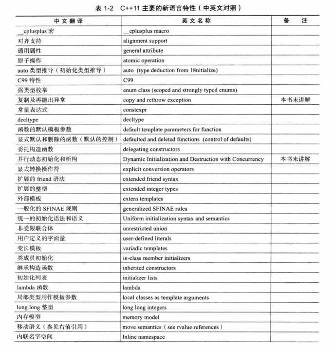
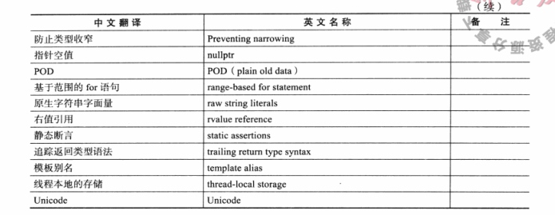
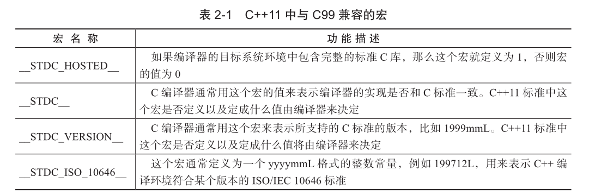

# 第一章 Java程序设计概述

## java 白皮书 关键术语

1 ) 简单性

2 ) 面向对象

3 ) 分布式

4 ) 健壮性

5 ) 安全性

6 ) 体系结构中立

7 ) 可移植性

8 ) 解释型

9 ) 高性能

10 ) 多线程

11 ) 动态性

## Java 发展历史

//TODO

# 第二章 Java程序设计环境

略

------

# 第三章 Java 的基本程序设计结构

## java hello world

```
public class FirstSample
{
   public static void main(String[] args)
   {
      System.out.println("We will not use 'Hello, World!'");
   }
}
```

## 3.3 数据类型

### 整型

### 浮点型

### char

特殊字符的转义序列

### Unicode 和char

### Boolean

## 3.4 变量

## 3.5 运算符

## 3.6 字符串

## 3.7 输入输出

## 3.8 控制流

## 3.9 大数值

## 3.10 数组

# 第四章 对象与类

## 4.1 面向对象程序设计概述

### 类

> 类 （ class ) 是构造对象的模板或蓝图 。 我们可以将类想象成制作小甜饼的切割机 ， 将对 象想象为小甜饼 。 由类构造 （ construct ) 对象的过程称为创建类的实例 （ instance ) .

### 对象

对象的三个主要特性 **对象的行为** （ behavior ) — 可以对对象施加哪些操作 ， 或可以对对象施加哪些方法 ？ **对象的状态** （ state ) — 当施加那些方法时 ， 对象如何响应 ？ **对象标识** （ identity ) — 如何辨别具有相同行为与状态的不同对象 ？

**对象的行为**是用可调用的方法定义的

**对象的状态**可能会随着时间而发生改变，但这种改变不会是自发的 。 对象状态的改变必须通过调用方法实现( 如果不经过方法调用就可以改变对象状态， 只能说明封装性遭到了破坏 ) 。

每个对象都有一个唯一的**身份 （ identity )** 因为 对象的状态并不能完全描述一个对象 。

### 识别类

识别类的简单规则是在分析问题的过程中寻找名词而方法对应着动词 。

### 类之间的关系

依赖（“uses-a”） 一个类的方法操纵另一个类的对象， 我们就说一个类依赖于另一个类 。 聚合（“has-a”） 聚合关系意味着类 A 的对象包含类 B 的对象 。 继承（“is-a”）继承 （ inheritance ) , 即 “ is - a ” 关系， 是一种用于表示特殊与一般关系的 。

## 4.2 使用预定义类

### 对象与对象变量

| 存储区域 | 存储内容                       | 优点                                               | 缺点                                                         | 回收                                                         |
| :------- | :----------------------------- | :------------------------------------------------- | :----------------------------------------------------------- | :----------------------------------------------------------- |
| 栈       | 基本类型的变量和对象的引用变量 | 存取速度比堆要快，仅次于寄存器，栈数据可以共享     | 存在栈中的数据大小与生存期必须是确定的，缺乏灵活性。栈中主要存放一些基本类型的变量 | 当超过变量的作用域后，Java会自动释放掉该变量,内存空间可以立即被另作他用 |
| 堆       | 由new等指令创建的对象和数组    | 可以动态地分配内存大小，生存期也不必事先告诉编译器 | 由于要在运行时动态分配内存，存取速度较慢                     | 由Java虚拟机的自动垃圾回收器来回收不再使用的数据             |

堆栈的存储特点决定了其中存储的数据类型。

注意，栈内存储的除了基本类型的变量（int 这种类型的变量）还会存储**对象的引用变量**。java中，引用变量实际上是一个指针，它指向的是堆内存中对象实例。

> 引用变量就相当于是为数组或对象起的一个名称，以后就可以在程序中使用栈中的引用变量来访问堆中的数组或对象。

**总结:**

- Java中，这里的“=”并不是赋值的意思，而是把对象的地址传递给变量；
- 对象创建出来，其实连名字都没有，因此必须通过引用变量来对其进行操作。

### Java 类库中的 LocalDate 类

LocalDate 类封装了实例域来维护所设置的日期 。

**日历实例**

```
import java.time.*;

public class CalendarTest
{
   public static void main(String[] args)
   {
      LocalDate date = LocalDate.now();
      int month = date.getMonthValue();
      int today = date.getDayOfMonth();

      date = date.minusDays(today - 1); // Set to start of month
      DayOfWeek weekday = date.getDayOfWeek();
      int value = weekday.getValue(); // 1 = Monday, ... 7 = Sunday

      System.out.println("Mon Tue Wed Thu Fri Sat Sun");
      for (int i = 1; i < value; i++)
         System.out.print("    ");
      while (date.getMonthValue() == month)
      {
         System.out.printf("%3d", date.getDayOfMonth());
         if (date.getDayOfMonth() == today)
            System.out.print("*");
         else
            System.out.print(" ");
         date = date.plusDays(1);
         if (date.getDayOfWeek().getValue() == 1) System.out.println();
      }
      if (date.getDayOfWeek().getValue() != 1) System.out.println();
   }
}
```

### 更改器方法与访问器方法

获取数据和更改数据的方法

## 4.3 用户自定义类

### Employee 类

```
import java.time.*;

public class EmployeeTest
{
   public static void main(String[] args)
   {
      // fill the staff array with three Employee objects
      Employee[] staff = new Employee[3];

      staff[0] = new Employee("Carl Cracker", 75000, 1987, 12, 15);
      staff[1] = new Employee("Harry Hacker", 50000, 1989, 10, 1);
      staff[2] = new Employee("Tony Tester", 40000, 1990, 3, 15);

      // raise everyone's salary by 5%
      for (Employee e : staff)
         e.raiseSalary(5);

      // print out information about all Employee objects
      for (Employee e : staff)
         System.out.println("name=" + e.getName() + ",salary=" + e.getSalary() + ",hireDay="
               + e.getHireDay());
   }
}

class Employee
{
   private String name;
   private double salary;
   private LocalDate hireDay;

   public Employee(String n, double s, int year, int month, int day)
   {
      name = n;
      salary = s;
      hireDay = LocalDate.of(year, month, day);
   }

   public String getName()
   {
      return name;
   }

   public double getSalary()
   {
      return salary;
   }

   public LocalDate getHireDay()
   {
      return hireDay;
   }

   public void raiseSalary(double byPercent)
   {
      double raise = salary * byPercent / 100;
      salary += raise;
   }
}
```

### 构造器

构造器与类同名 每个类可以有一个以上的构造器 构造器可以有0个、1个或多个参数 构造器没有返回值 构造器总是伴随着new操作一起调用

### 隐式参数和显示参数

在 Java 中 ， 所有的方法都必须在类的内部定义 ， 但并不表示它们是内联方法。 是否将某个方法设置为内联方法是 Java 虚拟机的任务。 即时编译器会监视调用那些简洁 、 经常被调用 、 没有被重载以及可优化的方法。

## 4.4 静态域和静态方法

```
public class StaticTest
{
   public static void main(String[] args)
   {
      // fill the staff array with three Employee objects
      Employee[] staff = new Employee[3];

      staff[0] = new Employee("Tom", 40000);
      staff[1] = new Employee("Dick", 60000);
      staff[2] = new Employee("Harry", 65000);

      // print out information about all Employee objects
      for (Employee e : staff)
      {
         e.setId();
         System.out.println("name=" + e.getName() + ",id=" + e.getId() + ",salary="
               + e.getSalary());
      }

      int n = Employee.getNextId(); // calls static method
      System.out.println("Next available id=" + n);
   }
}

class Employee
{
   private static int nextId = 1;

   private String name;
   private double salary;
   private int id;

   public Employee(String n, double s)
   {
      name = n;
      salary = s;
      id = 0;
   }

   public String getName()
   {
      return name;
   }

   public double getSalary()
   {
      return salary;
   }

   public int getId()
   {
      return id;
   }

   public void setId()
   {
      id = nextId; // set id to next available id
      nextId++;
   }

   public static int getNextId()
   {
      return nextId; // returns static field
   }

   public static void main(String[] args) // unit test
   {
      Employee e = new Employee("Harry", 50000);
      System.out.println(e.getName() + " " + e.getSalary());
   }
}
```

## 4.5 方法参数

总结一下 Java 中方法参数的使用情况 ： • 一个方法不能修改一个基本数据类型的参数 （ 即数值型或布尔型 ） 。 • 一个方法可以改变一个对象参数的状态 。 • 一个方法不能让对象参数引用一个新的对象。

```
public class ParamTest
{
   public static void main(String[] args)
   {
      /*
       * Test 1: Methods can't modify numeric parameters
       */
      System.out.println("Testing tripleValue:");
      double percent = 10;
      System.out.println("Before: percent=" + percent);
      tripleValue(percent);
      System.out.println("After: percent=" + percent);

      /*
       * Test 2: Methods can change the state of object parameters
       */
      System.out.println("\nTesting tripleSalary:");
      Employee harry = new Employee("Harry", 50000);
      System.out.println("Before: salary=" + harry.getSalary());
      tripleSalary(harry);
      System.out.println("After: salary=" + harry.getSalary());

      /*
       * Test 3: Methods can't attach new objects to object parameters
       */
      System.out.println("\nTesting swap:");
      Employee a = new Employee("Alice", 70000);
      Employee b = new Employee("Bob", 60000);
      System.out.println("Before: a=" + a.getName());
      System.out.println("Before: b=" + b.getName());
      swap(a, b);
      System.out.println("After: a=" + a.getName());
      System.out.println("After: b=" + b.getName());
   }

   public static void tripleValue(double x) // doesn't work
   {
      x = 3 * x;
      System.out.println("End of method: x=" + x);
   }

   public static void tripleSalary(Employee x) // works
   {
      x.raiseSalary(200);
      System.out.println("End of method: salary=" + x.getSalary());
   }

   public static void swap(Employee x, Employee y)
   {
      Employee temp = x;
      x = y;
      y = temp;
      System.out.println("End of method: x=" + x.getName());
      System.out.println("End of method: y=" + y.getName());
   }
}

class Employee // simplified Employee class
{
   private String name;
   private double salary;

   public Employee(String n, double s)
   {
      name = n;
      salary = s;
   }

   public String getName()
   {
      return name;
   }

   public double getSalary()
   {
      return salary;
   }

   public void raiseSalary(double byPercent)
   {
      double raise = salary * byPercent / 100;
      salary += raise;
   }
}
```

## 4.6 对象构造

```
import java.util.*;

public class ConstructorTest
{
   public static void main(String[] args)
   {
      // fill the staff array with three Employee objects
      Employee[] staff = new Employee[3];

      staff[0] = new Employee("Harry", 40000);
      staff[1] = new Employee(60000);
      staff[2] = new Employee();

      // print out information about all Employee objects
      for (Employee e : staff)
         System.out.println("name=" + e.getName() + ",id=" + e.getId() + ",salary="
               + e.getSalary());
   }
}

class Employee
{
   private static int nextId;

   private int id;
   private String name = ""; // instance field initialization
   private double salary;
  
   // static initialization block
   static
   {
      Random generator = new Random();
      // set nextId to a random number between 0 and 9999
      nextId = generator.nextInt(10000);
   }

   // object initialization block
   {
      id = nextId;
      nextId++;
   }

   // three overloaded constructors
   public Employee(String n, double s)
   {
      name = n;
      salary = s;
   }

   public Employee(double s)
   {
      // calls the Employee(String, double) constructor
      this("Employee #" + nextId, s);
   }

   // the default constructor
   public Employee()
   {
      // name initialized to ""--see above
      // salary not explicitly set--initialized to 0
      // id initialized in initialization block
   }

   public String getName()
   {
      return name;
   }

   public double getSalary()
   {
      return salary;
   }

   public int getId()
   {
      return id;
   }
}
```

## 4.7 包

为了更好地组织类，Java 提供了包机制，用于区别类名的命名空间。

Java 使用包（package）这种机制是为了防止命名冲突，访问控制，提供搜索和定位类（class）、接口、枚举（enumerations）和注释（annotation）等。

### 包的作用

- 1、把功能相似或相关的类或接口组织在同一个包中，方便类的查找和使用。
- 2、如同文件夹一样，包也采用了树形目录的存储方式。同一个包中的类名字是不同的，不同的包中的类的名字是可以相同的，当同时调用两个不同包中相同类名的类时，应该加上包名加以区别。因此，包可以避免名字冲突。
- 3、包也限定了访问权限，拥有包访问权限的类才能访问某个包中的类。

### 创建包

创建包的时候，你需要为这个包取一个合适的名字。之后，如果其他的一个源文件包含了这个包提供的类、接口、枚举或者注释类型的时候，都必须将这个包的声明放在这个源文件的开头。

包声明应该在源文件的第一行，每个源文件只能有一个包声明，这个文件中的每个类型都应用于它。

如果一个源文件中没有使用包声明，那么其中的类，函数，枚举，注释等将被放在一个无名的包（unnamed package）中。

### import 关键字

为了能够使用某一个包的成员，我们需要在 Java 程序中明确导入该包。使用 "import" 语句可完成此功能。

在 java 源文件中 import 语句应位于 package 语句之后，所有类的定义之前，可以没有，也可以有多条，其语法格式为：

```
import package1[.package2…].(classname|*);
```

如果在一个包中，一个类想要使用本包中的另一个类，那么该包名可以省略。

### package 的目录结构

类放在包中会有两种主要的结果：

- 包名成为类名的一部分，正如我们前面讨论的一样。
- 包名必须与相应的字节码所在的**目录结构**相吻合。

**java 系统常用包**

| 包                    | 说明                                                         |
| :-------------------- | :----------------------------------------------------------- |
| java.lang             | Java 的核心类库，包含运行 Java 程序必不可少的系统类，如基本数据类型、基本数学函数、 字符串处理、异常处理和线程类等，系统默认加载这个包 |
| java.io               | Java 语言的标准输入/输出类库，如基本输入/输出流、文件输入/输出、过滤输入/输出流等 |
| java.util             | 包含如处理时间的 Date 类，处理动态数组的 Vector 类，以及 Stack 和 HashTable 类 |
| java.awt              | 构建图形用户界面（GUI）的类库，低级绘图操作 Graphics 类、图形界面组件和布局管理 （如 Checkbox 类、Container 类、LayoutManger 接口等），以及用户界面交互控制和事 件响应（如 Event 类） |
| java.awt.image        | 处理和操纵来自网上的图片的 Java 工具类库                     |
| java.wat.peer         | 很少在程序中直接用到，使得同一个 Java 程序在不同的软硬件平台上运行 |
| java.net              | 实现网络功能的类库有 Socket 类、ServerSocket 类              |
| java.lang.reflect     | 提供用于反射对象的工具                                       |
| java.util.zip         | 实现文件压缩功能                                             |
| java.awt.datatransfer | 处理数据传输的工具类，包括剪贴板、字符串发送器等             |
| java.sql              | 实现 JDBC 的类库                                             |
| java.rmi              | 提供远程连接与载入的支持                                     |
| java. security        | 提供安全性方面的有关支持                                     |

参考: https://www.runoob.com/java/java-package.html

### 类的导入

静态导入

将类放入包中

包作用域

## 4.8 类路径

**系统变量 CLASSPATH 的作用:**

它的作用是指定类搜索路径，要使用已经编写好的类，JVM就是通过CLASSPATH来寻找 Java类的。

实际上，如果你安装的是1.5版本以上的JDK，完全是可以不用设置 环境变量CLASSPATH的。

### 设置类路径

## 4.9 文档注释

# 第五章 继承

**继承 （ inheritance )**。 利用继承 ， 人们可以基于已存在的类构造一个新类 。 继承已存在的类就 是复用 （ 继承 ） 这些类的方法和域。 在此基础上 ， 还可以添加一些新的方法和域 ，以满足新的需求。

**反射**是指在程序运行期间发现更多的类及其属性的能力。

## 5.1 类 超类 子类

### 定义子类

### 覆盖方法

### 子类构造器

### 继承层次

### 多态

### 理解方法调用

### 阻止继承

### 强制类型转换

### 抽象类

### 受保护访问

## 5.2 Object :所有类的超类

# 第六章 接口 lambda 表达式 内部类


# FreeNOS

**lib** -> 共享代码 　　1、libfs 文件系统（磁盘管理） 　　2、liballoc 内存分配和虚拟内存映射（内存管理） 　　3、libexec 程序代码和数据的处理及获取 　　4、libmpi 并发编程的一些通信接口 　　5、libipc 进程间通信接口 　　6、libnet 一些标准网络协议的实现（网络驱动） 　　7、libstd 算法和数据结构的模板 　　8、libtest 测试框架 　　9、libarch 与特定处理器相关的代码 　　10、libposix 给应用层提供的标准系统调用接口 　　11、libi2c 通信驱动（I/O设备） 　　12、libusb 通信驱动（I/O设备） 　　13、libspi 通信驱动（I/O设备）

**kernel** -> 内核代码，包含：进程调度，虚拟内存管理 　　1、API（系统调用的接口及接口的内核侧实现） 　　2、ARM、Intel 特定处理器下的内核代码（switching、bootupcode）

**bin** 　sh -> 命令行交互程序，用于执行外部程序和内置命令行；算是应用程序范畴

**server** -> 一些服务程序，作为操作系统的一些扩展组件。提供某些特定服务，设备驱动，文件系统等；

　　usb 　　video 　　...

**config**

　　应该是放一些配置文件的地方

**test**

　　测试相关

**support**

　支撑scons等开发工具相关的

## 其他

- bin文件夹：封装的是一些常用命令，如ls、cat等等，想让内核运行成功，再细看这些功能的实现。
- config文件夹：配置文件。
- kernel文件夹：重中之重，内核文件，从这里开始看。
- lib文件夹：标准库，分配器、仿真库、posix标准等等；知道文件实现了哪些功能，然后了解相关函数接口，有空回头详细看，由整体到部分的过程。
- server文件夹：提供相应的服务，网络、序列化、终端等等，还没仔细看…
- support文件夹：工具依赖，doxygen与scons。

１、Main.cpp：

- 初始化堆Kernel::heap()函数，启动内核调试串行控制台（生成IntelSerial对象，调用setMinimumLogLevel()函数），构造函数（constructors()），创建并运行内核（生成IntelKernel()对象，运行run()函数）

２、Kernel类（继承于单例类）：类API，分体式分配器，int控制器，计时器

- 数据结构：CPU状态
- 所包含的函数：中断处理程序，中断钩子处理，内核堆，获取物理内存分配器，获取进程管理，API，获取内存上下文，获取核心信息，获取计时器，执行run()，硬件中断处理，函数挂接处理硬件中断，执行中断处理程序，装载boot镜像，装载boot程序。

３、InterKernel类继承于Kernel类：

- 功能:X86兼容，Intel内核陷阱（trap），执行内核陷阱，CPU检测到故障时调用，系统时钟中断处理程序，实例PIT计时器，实例APIC，实例PIC。

４、Allocator类：（分配器）分配器地址对齐，子类：BitAllocator，BubbleAllocator，PageAllocator，PoolAllocator， SplitAllocator。

相关链接

https://www.cnblogs.com/grooovvve/p/11409113.html

# 计算机图形学几何工具算法详解

------

# 第一章 绪论

各章内容概括

二三四章 向量和矩阵代数的基本概念

五 二位对象定义

六 几何测量

七 相交问题

八 重要的杂项问题

九 三维对象定义

十 几何测量

十一 相交问题

十二 重要的杂项问题

十三 计算机几何学的大量材料

# 第二章 矩阵和线性系统

## 多元组

多元组泛指有限个元素所组成的序列。

长度为n的多元组通常称为n元组。二元组就是一个有序对。n可以是任意正整数，例如，四元数就可以被表示成一个四元组。

[多元组wiki](https://zh.wikipedia.org/zh-hans/多元组)

## 矩阵

### 矩阵运算

加减法

乘除法

### 矩阵算术运算的性质

### 多元组乘法

## 线性系统

**线性方程**

 线性系统的相关运算

 线性代数相关

矩阵行列式 逆矩阵

## 线性空间（向量空间）

### 定义和性质

### 线性空间子空间

### 线性组合和生成空间

### 线性无关 维数和基底

## 线性映射

映射组合

特殊类型映射

逆映射

线性映射的矩阵表示

克莱姆法则

## 特征向量和特征值

## 欧几里得空间

### 内积空间

范数长度和距离

正交和标准正交集

## 最小二乘法

# 第三章 向量代数

## 线性空间

生成空间

线性无关

、

基底子空间维数

方向

基地变化

线性变换

## 仿射空间

欧几里得几何

 数量积

 向量积

仿射变换

重心坐标

# 第四章 矩阵 向量代数和变换

各种线性运算

## 仿射变换的矩阵表示

## 基底变化/帧/坐标系统

向量变换

平移 旋转 反射 剪切

正投影

斜投影

透视投影

## 变换法线向量

# 第五章 二维几何图元

## 线形对象

## 三角形

## 矩形

## 折线和多边形

## 二次曲线

圆

椭圆

多项式曲线

贝塞尔曲线

B样条曲线

非均匀有理B样条曲线

# 第六章 二维距离

## 点到线性对象的距离

### 点到直线的距离

### 点到射线的距离

### 点到线段的距离

## 点到折线的距离

## 点到多边形的距离

### 点到三角形

# 第七章 二维相交


# Introduction to Multimedia

# 第一章 多媒体导论

> Introduction to Multimedia

------

## 什么是多媒体

> What is Multimedia?

### 多媒体的组成成分

> Components of Multimedia

**多媒体处理及编码 Multimedia processing and coding**

**多媒体系统支持和网络 Multimedia system support and networking**

### 多媒体的课题和研究项目

------

## 多媒体的历史

------

## 多媒体和超媒体

### 多媒体和Web html XML SMIL 的关系

------

## 多媒体软件工具介绍

**Music Sequencing and Notation**

Finale,Sibelius

Cakewalk Pro Audio

**Digital Audio**

Adobe Audition

Sound Forge

## 第一章 扩展链接

The complete Vannvar Bush article on the Memex system conception is online at

http://www.cs.sfu.ca/CC/365/mark/material/notes/Chap1/VBushArticle/

This article was and still is considered seminal. Although written over 50 years ago, it adumbrates many current developments, including fax machines and the associative memory model that underlies the development of the web.

See

http://www.w3.org/WhatIs.html

for an excellent set of definitions on hypertext and hypermedia.

Ted Nelson and the Xanadu project are outlined starting from the URL

http://jefferson.village.virginia.edu/elab/hfl0155.html

Nicholas Negroponte's work at the MIT Media Lab can be accessed at

http://web.media.mit.edu/~nicholas/

Douglas Engelbart, and the history of the "On-Line System" is detailed at this link

http://jefferson.village.virginia.edu/elab/hfl0035.html

An introduction to the history and essential workings of television can be found at this link

http://www.dvb.org/news/pdf/history-tv.pdf

Georgia Tech's Electronic Housecall system, and an explanation of ``Telemedical patient consultative encounters" can be found

[here](http://www.bitc.gatech.edu/bitcprojects/ehc/) and

[here.](http://www.media.mit.edu/)

Negroponte and Wiesner co-founded the MIT Media Lab, and that lab is still going strong -- it is arguably the most influential ideas factory in the world.

http://www.media.mit.edu/

The World Wide Web is of course very important. You can find all sorts of information regarding web standards, including XML, at this link

http://www.w3.org/

As well, the IETF (Internet Engineering Task Force) website is

[http://www.ietf.org/](http://www.ietf.org//)

Java and client-side execution started in 1995: to see ``Duke", the first JAVA Applet go to [Link to Duke](http://www.cs.sfu.ca/CC/365/mark/material/notes/Chap1/duke.html).

**Music Sequencing and Notation**

Cakewalk Express is available for download from the link

http://www.cakewalk.com/Products/XP/XP8.html

Cubase Score information is available from the URL

http://www.steinberg.net/

See URL

http://www.macromedia.com/support/soundedit/

for information on Macromedia Soundedit.

**Digital Audio**

A link to Digital Audio information for the Sound Forge tool may be accessed [here](https://www2.cs.sfu.ca/mmbook/examples/soundforge.html). This web page includes a link to the Sonic Foundry company and also a sample Sound Forge file and the resulting output WAV file. The example combines left and right channel information in a complex fashion. Very little effort is required to produce extremely sophisticated sounding special effects using this tool.

Digidesign is one firm offering high-end Macintosh software, which can even involve purchasing extra boards for specialized processing. Their Pro Tools Audio software description is linked from

http://www.digidesign.com/

Syntrillium offers the powerful software package Cool Edit, which emulates a professional sound studio on your computer. The website is

[http://www.syntrillium.com](http://www.syntrillium.com/)

**Graphics and Image Editing**

The URL

http://www.macromedia.com/software/freehand/

links to Macromedia Freehand information. For Macromedia Fireworks, for graphics specifically aimed at the web, take a look at

http://www.macromedia.com/software/fireworks/

Adobe Photoshop information can ve viewed at the URL

http://www.adobe.com/products/photoshop/

A free product tryout is available there.

**Video Editing**

Adobe Premiere information is available from the link

http://www.adobe.com/products/premiere/

Videoshop (now Strata DV) information is online at

http://www.strata.com/products/stratadv.html

**Animation**

SoftImage information for 3D animation is at

http://www.softimage.com/products/xsi/v2/default.asp

An Adobe LiveMotion link is at

http://www.adobe.com/products/livemotion/main.html

A very complete introduction to 3D Studio Max can be found at

http://www.discreet.com/products/3dsmax/

The official site for Java3D is

http://java.sun.com/products/java-media/3D/

**Multimedia Authoring**

See URL

http://www.macromedia.com/software/director/

for information on Macromedia Director.

Authorware, by Macromedia, has a web site

http://www.macromedia.com/software/authorware/

Information on the latest version of Quest may be found at

http://www.mentergy.com/products/authoring_design/quest/70/

# 第二章 A Taste of Multimedia

# 第三章 图形和图像数据表示

> Graphics and Image Data Representations

## 图形/图像数据类型

> Graphics/Image DataTypes

### 1-Bit Images 单色图像

 单色图像中每个像素点仅占一位，其值只有0或1,0 代表黑1代表白或相反。因为图像中的每个像素仅需l位信息，常把单色图像称为是1位图像 。单色图像具有比较简单，一般由黑色区域和白色区域组成。

### 8-Bit Gray-Level Images 灰度图像

**灰度图像具有如下特征：**

（1）灰度图像的存储文件带有图像颜色表，此颜色表共有256项，

图像颜色表中每一表项由红、绿、蓝颜色分量组成，并且红、绿、蓝颜色分量值都相等，即：

fred (x,y)=fgreen(x,y)=fblue(x,y)

（2）每个像素由8位组成，其值范围从0~255，表示 256 种不同的灰度级 。每个像素的像素值f(x,y）是图像颜色表的表项入口地址。

#### Dithering 抖动

### 24-Bit Color Images

具有全彩色照片表达能力的图像为24位彩色图像，24位真彩色图像存储文件中不带有图像颜色表，其具有如下特征 ：

（1）图像中每一像素由RGB三个分量组成，每个分量各占8 位，每个像素需24位。

（2）fred(x,y)、fgreen(x,y) 、fblue(x,y)取值范围为0~255。

由于24位真彩色图像所需的存储空间很大，处理速度较慢，当需要存储空间不大，并且要求实时快速处理图像时，一般都要利用相应的8位位图对其进行近似处理，因此8位位图是图像技术中涉及范围比较广泛的一种图像表示方法

### 8-Bit Color Images

伪彩色图像与灰度图像相似，其存储文件中也带有图像颜色表 ，伪彩色图像具有如下特征：

（1）图像颜色表中的红、绿、蓝颜色分量值不全相等，即：

fred (x,y)=fgreen(x,y)=fblue(x,y)

（2）整幅图像仅有256种颜色，要表示256种不同的颜色 ，像素必须由8位组成，每个像素值不是由每个基色分量的数值 直接决定，而是把像素值当作图像颜色表的表项入口地址。把具有256 色的图像称为8位彩色图像。把具有256色的图像称为8位彩色图像。

### Color LookupTables 颜色查找表

------

## Popular File Formats 常见图片文件格式

GIF

JPEG

PNG

TIFF

Windows BMP

Windows WMF

Netpbm Format

EXIF

PS and PDF

## 第三章相关链接

adobe 支持的文件格式

https://helpx.adobe.com/premiere-pro/using/supported-file-formats.html

彩色查找表

[https://baike.baidu.com/item/%E5%BD%A9%E8%89%B2%E6%9F%A5%E6%89%BE%E8%A1%A8](https://baike.baidu.com/item/彩色查找表)

https://www2.cs.sfu.ca/mmbook/furtherv2/node3.html

# 第四章 图像和视频中的颜色

> Color in Image and Video

## 颜色科学

> Color Science

[知乎：颜色的科学](https://zhuanlan.zhihu.com/p/80321112)

**伽马校正**

[图像处理之gamma校正](https://blog.csdn.net/wukery/article/details/77567933)

https://en.wikipedia.org/wiki/Gamma_correction

https://www.cambridgeincolour.com/tutorials/gamma-correction.htm

[https://learnopengl-cn.readthedocs.io/zh/latest/05%20Advanced%20Lighting/02%20Gamma%20Correction/](https://learnopengl-cn.readthedocs.io/zh/latest/05 Advanced Lighting/02 Gamma Correction/)

**色度图**

[百度百科：色度图](https://baike.baidu.com/item/色度图)

[CIE 色度图](http://read.pudn.com/downloads154/ebook/681541/cie%C9%AB%B6%C8%CD%BC.pdf)

**CRT**

## 图像中的颜色模型

> Color Models in Images

RGB

CMY

CMYK

相关链接

[深入理解color model(颜色模型)](https://www.jianshu.com/p/f03e9ac9c9ef)

http://en.academic.ru/dic.nsf/enwiki/157333

http://www.brucelindbloom.com/

http://www.handprint.com/HP/WCL/

http://www.couleur.org/

http://www.codeproject.com/Articles/19045/Manipulating-colors-in-NET-Part-1

http://www.iclcv.org/index.php?q=node/28

http://www.easyrgb.com/index.php?X=MATH

http://www.techmind.org/colour/

《色彩管理(Real World Color Management)》

## 视频中的颜色模型

> Color Models in Video.

YUV

YIQ

YCbCr

# 第五章 视频中的基本概念

> Fundamental Concepts in Video

## 视频信号的类型

分量视频

复合视频

S-Video

## 模拟视频

## 数字视频

# 第六章 数字音频基础

## 声音数字化

## MIDI ：乐器声音数字化

## 音频的量化和传输

------

# 多媒体数据压缩

------

# 第七章 无损数据压缩

------

# 第八章 有损压缩算法

# 第九章 图像压缩标准

# 第十章 基本数据压缩技术

# 第十一章 MPEG视频压缩编码

# 第十三章 音频压缩技术基础

# 第十四章 MPEG音频压缩

------

# 第三部分 多媒体通信和检索

------

# 第十五章 计算机网络相关

略

# 第十六章 多媒体网络通信和应用

# 第十八章 无线网络

# 其他相关链接

中文名 多媒体技术教程 多媒体基础

第一版官网 https://www.cs.sfu.ca/mmbook/

第二版官网 https://www.springer.com/gp/book/9783319052892

# 分割


# static关键字

> ## 1. 什么是static?
>
> static 是 C/C++ 中很常用的修饰符，它被用来控制变量的存储方式和可见性。
>
> ### 1.1 static 的引入
>
> 我们知道在函数内部定义的变量，当程序执行到它的定义处时，编译器为它在栈上分配空间，函数在栈上分配的空间在此函数执行结束时会释放掉，这样就产生了一个问题: 如果想将函数中此变量的值保存至下一次调用时，如何实现？ 最容易想到的方法是定义为全局的变量，但定义一个全局变量有许多缺点，最明显的缺点是破坏了此变量的访问范围（使得在此函数中定义的变量，不仅仅只受此函数控制）。static 关键字则可以很好的解决这个问题。
>
> 另外，在 C++ 中，需要一个数据对象为整个类而非某个对象服务,同时又力求不破坏类的封装性,即要求此成员隐藏在类的内部，对外不可见时，可将其定义为静态数据。
>
> ### 1.2 静态数据的存储
>
> **全局（静态）存储区**：分为 DATA 段和 BSS 段。DATA 段（全局初始化区）存放初始化的全局变量和静态变量；BSS 段（全局未初始化区）存放未初始化的全局变量和静态变量。程序运行结束时自动释放。其中BBS段在程序执行之前会被系统自动清0，所以未初始化的全局变量和静态变量在程序执行之前已经为0。存储在静态数据区的变量会在程序刚开始运行时就完成初始化，也是唯一的一次初始化。
>
> 在 C++ 中 static 的内部实现机制：静态数据成员要在程序一开始运行时就必须存在。因为函数在程序运行中被调用，所以静态数据成员不能在任何函数内分配空间和初始化。
>
> 这样，它的空间分配有三个可能的地方，一是作为类的外部接口的头文件，那里有类声明；二是类定义的内部实现，那里有类的成员函数定义；三是应用程序的 main() 函数前的全局数据声明和定义处。
>
> 静态数据成员要实际地分配空间，故不能在类的声明中定义（只能声明数据成员）。类声明只声明一个类的"尺寸和规格"，并不进行实际的内存分配，所以在类声明中写成定义是错误的。它也不能在头文件中类声明的外部定义，因为那会造成在多个使用该类的源文件中，对其重复定义。
>
> static 被引入以告知编译器，将变量存储在程序的静态存储区而非栈上空间，静态数据成员按定义出现的先后顺序依次初始化，注意静态成员嵌套时，要保证所嵌套的成员已经初始化了。消除时的顺序是初始化的反顺序。
>
> **优势：**可以节省内存，因为它是所有对象所公有的，因此，对多个对象来说，静态数据成员只存储一处，供所有对象共用。静态数据成员的值对每个对象都是一样，但它的值是可以更新的。只要对静态数据成员的值更新一次，保证所有对象存取更新后的相同的值，这样可以提高时间效率。

> ## 2. 在 C/C++ 中static的作用
>
> ### 2.1 总的来说
>
> - （1）在修饰变量的时候，static 修饰的静态局部变量只执行初始化一次，而且延长了局部变量的生命周期，直到程序运行结束以后才释放。
> - （2）static 修饰全局变量的时候，这个全局变量只能在本文件中访问，不能在其它文件中访问，即便是 extern 外部声明也不可以。
> - （3）static 修饰一个函数，则这个函数的只能在本文件中调用，不能被其他文件调用。static 修饰的变量存放在全局数据区的静态变量区，包括全局静态变量和局部静态变量，都在全局数据区分配内存。初始化的时候自动初始化为 0。
> - （4）不想被释放的时候，可以使用static修饰。比如修饰函数中存放在栈空间的数组。如果不想让这个数组在函数调用结束释放可以使用 static 修饰。
> - （5）考虑到数据安全性（当程序想要使用全局变量的时候应该先考虑使用 static）。
>
> ### 2.2 静态变量与普通变量
>
> **静态全局变量有以下特点：**
>
> - （1）静态变量都在全局数据区分配内存，包括后面将要提到的静态局部变量;
> - （2）未经初始化的静态全局变量会被程序自动初始化为0（在函数体内声明的自动变量的值是随机的，除非它被显式初始化，而在函数体外被声明的自动变量也会被初始化为 0）；
> - （3）静态全局变量在声明它的整个文件都是可见的，而在文件之外是不可见的。
>
> **优点：**静态全局变量不能被其它文件所用；其它文件中可以定义相同名字的变量，不会发生冲突。
>
> **（1）全局变量和全局静态变量的区别**
>
> - 1）全局变量是不显式用 static 修饰的全局变量，全局变量默认是有外部链接性的，作用域是整个工程，在一个文件内定义的全局变量，在另一个文件中，通过 extern 全局变量名的声明，就可以使用全局变量。
> - 2）全局静态变量是显式用 static 修饰的全局变量，作用域是声明此变量所在的文件，其他的文件即使用 extern 声明也不能使用。
>
> ### 2.3 静态局部变量有以下特点：
>
> - （1）该变量在全局数据区分配内存；
> - （2）静态局部变量在程序执行到该对象的声明处时被首次初始化，即以后的函数调用不再进行初始化；
> - （3）静态局部变量一般在声明处初始化，如果没有显式初始化，会被程序自动初始化为 0；
> - （4）它始终驻留在全局数据区，直到程序运行结束。但其作用域为局部作用域，当定义它的函数或语句块结束时，其作用域随之结束。
>
> 一般程序把新产生的动态数据存放在堆区，函数内部的自动变量存放在栈区。自动变量一般会随着函数的退出而释放空间，静态数据（即使是函数内部的静态局部变量）也存放在全局数据区。全局数据区的数据并不会因为函数的退出而释放空间。

static的作用主要有以下3个：

1、扩展生存期；

2、限制作用域；

3、唯一性；

用来控制变量的存储方式和可见性

# C语言中static的用法

## 1、静态局部变量

- 静态局部变量也存储在数据区(不在栈区)，程序执行之前就已分配内存，程序执行结束后才销毁
- 静态局部变量只在首次执行到声明处初始化一次，之后再执行该语句时不在初始化，若没有初始化则编译器会将其初始化为0

## 2、静态全局变量

- 静态全局变量在程序的数据区分配内存，若未初始化则默认初始化为0，直到程序结束才销毁
- 静态全局变量在该文件内可见，从变量定义处开始直到文件结束(普通全局变量在同一程序的其他文件中可见，默认是 external 属性，而静态全局变量是 internal 属性)， 而在其他文件中不可见

## 3、静态函数

- 函数的定义和生命在默认情况下都是extern的，但静态函数只是在声明他的文件当中可见，不能被其他文件所用

# C++ 中static的用法

在C++ 中 static 可以用来修饰静态数据成员和静态成员方法

## 1、静态数据成员

- 静态数据成员由所有该类对象共享
- 静态数据成员存储在全局数据区，在定义时分配存储空间，程序运行结束时销毁
- 类的静态成员变量必须先初始化再使用 ，静态数据成员不能再类中定义和初始化，只能在类中声明，在类外进行定义和初始化，默认初始化为0
- 
- 静态数据成员遵从 public private protected 访问规则
- 静态数据成员可以直接使用类名加作用域运算符(::)直接访问 <类名>::<变量名>(访问规则允许的情况下)
- 静态数据成员的初始化为 <类型名> <类名>::<变量名> = <值>

## 2、静态成员函数

- 在类外定义静态成员函数时，不用再加 static 关键字，只要在类中声明时加上即可
- 静态成员函数只能访问**静态数据成员和静态成员函数**，普通成员函数可以访问**静态成员函数和静态数据成员**
- 静态成员函数属于类，不属于任意一个类对象
- 可以使用 <类名>::<函数名> 访问，也可由类对象使用(./->)访问
- 静态成员函数没有 this 指针
- 静态成员函数不能是虚拟的
- 具有相同名称和名称参数类型列表的成员函数声明，如果其中任何一个都是静态成员函数声明，则不能重载
- 不能将静态成员函数声明为**const**，**volatile** 或 **const volatile**

**注：C ++不支持静态构造函数**

## 静态成员变量和成员函数 example

```
class Something
{
private:
    static int s_value;
 
};
 
int Something::s_value = 1; // initializer, this is okay even though s_value is private since it's a definition
 
int main()
{
    // how do we access Something::s_value since it is private?
}
class Something
{
private:
    static int s_value;
public:
    static int getValue() { return s_value; } // static member function
};
 
int Something::s_value = 1; // initializer
 
int main()
{
    std::cout << Something::getValue() << '\n';
}
class IDGenerator
{
private:
    static int s_nextID; // Here's the declaration for a static member
 
public:
     static int getNextID(); // Here's the declaration for a static function
};
 
// Here's the definition of the static member outside the class.  Note we don't use the static keyword here.
// We'll start generating IDs at 1
int IDGenerator::s_nextID = 1;
 
// Here's the definition of the static function outside of the class.  Note we don't use the static keyword here.
int IDGenerator::getNextID() { return s_nextID++; } 
 
int main()
{
    for (int count=0; count < 5; ++count)
        std::cout << "The next ID is: " << IDGenerator::getNextID() << '\n';
 
    return 0;
}
```

output：

```
The next ID is: 1
The next ID is: 2
The next ID is: 3
The next ID is: 4
The next ID is: 5
```

## 静态成员变量对类的实例进行计数 example

```
#include <iostream>
#include <string>
using namespace std;
class sample{
   int var;
   static int count;
  
   public:
   sample(int var):var(var){
      cout<<"Count = "<<count<<endl;
      count++;
   }
};
int sample::count = 0;                 //static variable initialisation
int main()
{
   sample s(2), s1(10),s3(1);
}
```

output：

```
Count = 0
Count = 1
Count = 2
```

## 静态类对象 example

```
#include <iostream>
using namespace std;
class xyz
{
   int i;
   public:
   xyz() {
      i=0;
      cout << "Constructor::xyz"<<endl;
   }
   ~xyz() {
      cout << "Destructor::xyz"<<endl;
   }
};
int main()
{
   int x=0;
   if(x==0){
      static xyz obj;
   }
   cout << "End Main"<<endl;
}
```

**output：**

```
Constructor::xyz
End Main
Destructor::xyz
```

通常应输出为

Constructor::xyz Destructor::xyz End Main

**静态函数的用途可以总结如下：**

- 当静态函数不依赖于对象进行调用和工作时，我们将使用静态函数。
- 使用静态函数的另一个目的是限制其使用。与全局函数不同，对静态函数的访问仅限于放置它们的文件。因此，为了限制对函数的访问，我们将其设为静态。
- 除了上述两个原因之外，当我们不想创建类的对象只是为了执行不引用任何类成员的函数时，就使用静态函数。

## 参考链接

https://www.softwaretestinghelp.com/static-in-cpp/

https://www.runoob.com/w3cnote/cpp-static-usage.html

https://www.geeksforgeeks.org/static-keyword-cpp/

https://www.geeksforgeeks.org/some-interesting-facts-about-static-member-functions-in-c/

https://blog.csdn.net/iteye_20025/article/details/82174170


**简介**

C++的虚函数主要作用是“运行时多态”，父类中提供虚函数的实现，为子类提供默认的函数实现。

子类可以重写父类的虚函数实现子类的特殊化。

# virtual 函数说明符

virtual 说明符指定非静态成员函数为虚函数并支持动态调用派发。

它只能在**非静态成员函数**的首个声明（即当它于类定义中声明时）的 **声明说明符序列** 中出现。

虚函数是可在派生类中覆盖其行为的成员函数。与非虚函数相反，即使没有关于该类实际类型的编译时信息，仍然保留被覆盖的行为。当使用到基类的指针或引用来处理派生类时，对被覆盖的虚函数的调用，将会调用定义于派生类中的行为。当使用有限定名字查找（即函数名出现在作用域解析运算符 :: 的右侧）时，此行为被抑制。

```
#include <iostream>
struct Base {
   virtual void f() {
       std::cout << "base\n";
   }
};
struct Derived : Base {
    void f() override { // 'override' 可选
        std::cout << "derived\n";
    }
};
int main()
{
    Base b;
    Derived d;
 
    // 通过引用调用虚函数
    Base& br = b; // br 的类型是 Base&
    Base& dr = d; // dr 的类型也是 Base&
    br.f(); // 打印 "base"
    dr.f(); // 打印 "derived"
 
    // 通过指针调用虚函数
    Base* bp = &b; // bp 的类型是 Base*
    Base* dp = &d; // dp 的类型也是 Base*
    bp->f(); // 打印 "base"
    dp->f(); // 打印 "derived"
 
    // 非虚函数调用
    br.Base::f(); // 打印 "base"
    dr.Base::f(); // 打印 "base"
}
```

# override 说明符

指定一个虚函数覆盖另一个虚函数。

在成员函数声明或定义中，override 确保该函数为虚函数并覆盖某个基类中的虚函数。

若此非真则程序非良构（生成编译错误）。

override 是在成员函数声明符之后使用时拥有特殊含义的标识符：其他情况下它不是保留的关键词。但是不建议使用其作为关键字

```
struct A
{
    virtual void foo();
    void bar();
};
 
struct B : A
{
    void foo() const override; // 错误：B::foo 不覆盖 A::foo
                               // （签名不匹配）
    void foo() override; // OK：B::foo 覆盖 A::foo
    void bar() override; // 错误：A::bar 非虚
};
```

# final 说明符

指定某个虚函数不能在子类中被覆盖，或者某个类不能被子类继承。

当在虚函数声明或定义中使用时，final 确保函数为虚并指定其不可被派生类覆盖。

若这么做则程序非良构（生成编译时错误）。

当在类定义中使用时，final 指定此类不可在另一类的定义中的 基类说明符列表 中出现（换言之，不能派生于它）。若这么做则程序非良构（生成编译时错误）。final 亦可用于联合体定义，此情况下它没有效果（除了 std::is_final 的输出结果），因为不能从联合体派生。

final 是在成员函数声明或类头部中使用时有特殊含义的标识符。其他语境中它未被保留，而且可用于命名对象或函数。

```
struct Base
{
    virtual void foo();
};
 
struct A : Base
{
    void foo() final; // Base::foo 被覆盖而 A::foo 是最终覆盖函数
    void bar() final; // 错误：非虚函数不能被覆盖或是 final
};
 
struct B final : A // struct B 为 final
{
    void foo() override; // 错误：foo 不能被覆盖，因为它在 A 中是 final
};
 
struct C : B // 错误：B 为 final
{
};
```

# Tips

## 虚函数覆盖判定

```
class B {
    virtual void do_f(); // 私有成员
 public:
    void f() { do_f(); } // 公开接口
};
struct D : public B {
    void do_f() override; // 覆盖 B::do_f
};
 
int main()
{
    D d;
    B* bp = &d;
    bp->f(); // 内部调用 D::do_f();
}
```

当**成员函数**在**基类**中被声明为 **virtual** 时,某个直接或者简介派生于该**基类**的**子类** 拥有一个下列几项与之相同的成员**函数声明** 则该函数也被认作**虚函数**并覆盖**基类**的函数

- 名字
- 形参列表（但非返回类型）
- cv 限定符
- 引用限定符

> 注:要覆盖父类的虚函数不需要**public** 可声明为 **private**，或 用私有继承继承

## 虚函数 最终覆盖函数

每个虚函数都有其*最终覆盖函数*，它是进行虚函数调用时所执行的函数。基类的**虚成员函数** `vf` 是最终覆盖函数，除非派生类声明或（通过多重继承）继承了覆盖 `vf` 的另一个函数。

```
struct A { virtual void f(); };     // A::f 是虚函数
struct B : A { void f(); };         // B::f 覆盖 A::f in B
struct C : virtual B { void f(); }; // C::f 覆盖 A::f in C
struct D : virtual B {}; // D 不引入覆盖函数，B::f 在 D 中为最终
struct E : C, D  {       // E 不引入覆盖函数，C::f 在 E 中为最C++终
    using A::f; // 非函数声明，仅令 A::f 能为查找所见
};
int main() {
   E e;
   e.f();    // 虚调用调用 C::f，e 中的最终覆盖函数
   e.E::f(); // 非虚调用调用 A::f，它在 E 中可见
}
```

## 若一个函数拥有多于一个最终覆盖函数，则程序非良构

```
struct A {
    virtual void f();
};
struct VB1 : virtual A {
    void f(); // 覆盖 A::f
};
struct VB2 : virtual A {
    void f(); // 覆盖 A::f
};
// struct Error : VB1, VB2 {
//     // 错误：A::f 在 Error 中拥有两个最终覆盖函数
// };
struct Okay : VB1, VB2 {
    void f(); // OK：这是 A::f 的最终覆盖函数
};
struct VB1a : virtual A {}; // 不声明覆盖函数
struct Da : VB1a, VB2 {
    // Da 中，A::f 的最终覆盖函数是 VB2::f
};
```

## 虚函数名字查找

具有相同名字但不同形参列表的函数并不覆盖同名的基类函数，但会*隐藏*它：在**无限定名字查找**检查派生类的作用域时，查找找到该声明而不再检查基类。

```
struct B {
    virtual void f();
};
struct D : B {
    void f(int); // D::f 隐藏 B::f（错误的形参列表）
};
struct D2 : D {
    void f(); // D2::f 覆盖 B::f（它不可见也不要紧）
};
 
int main()
{
    B b;   B& b_as_b   = b;
    D d;   B& d_as_b   = d;    D& d_as_d = d;
    D2 d2; B& d2_as_b  = d2;   D& d2_as_d = d2;
 
    b_as_b.f(); // 调用 B::f()
    d_as_b.f(); // 调用 B::f()
    d2_as_b.f(); // 调用 D2::f()
 
    d_as_d.f(); // 错误：D 中的查找只找到 f(int)
    d2_as_d.f(); // 错误：D 中的查找只找到 f(int)
}
```

## 协变返回类型 covariant

如果子类虚函数想覆盖父类虚函数 ,返回类型要么相同 ,要么协变 covariant

**类型协变要求:**

- 两个类型均为到类的指针或引用（左值或右值）。不允许多级指针或引用。
- **父类虚函数** 的返回类型中被引用/指向的类，必须是 **子类虚函数** 的返回类型中被**引用/指向**的类的无歧义且可访问的直接或间接基类。
- **父类虚函数**的返回类型必须有相对于**子类虚函数**的返回类型的相等或较少的 **cv 限定**。

**进行虚函数调用时，最终覆盖函数的返回类型被隐式转换成所调用的被覆盖函数的返回类型：**

```
class B {};
 
struct Base {
    virtual void vf1();
    virtual void vf2();
    virtual void vf3();
    virtual B* vf4();
    virtual B* vf5();
};
 
class D : private B {
    friend struct Derived; // Derived 中，B 是 D 的可访问基类
};
 
class A; // 前置声明的类是不完整类型
 
struct Derived : public Base {
    void vf1();    // 虚函数，覆盖 Base::vf1()
    void vf2(int); // 非虚函数，隐藏 Base::vf2()
//  char vf3();    // 错误：覆盖 Base::vf3，但具有不同且非协变的返回类型
    D* vf4();      // 覆盖 Base::vf4() 并具有协变的返回类型
//  A* vf5();      // 错误：A 是不完整类型
};
 
int main()
{
    Derived d;
    Base& br = d;
    Derived& dr = d;
 
    br.vf1(); // 调用 Derived::vf1()
    br.vf2(); // 调用 Base::vf2()
//  dr.vf2(); // 错误：vf2(int) 隐藏 vf2()
 
    B* p = br.vf4(); // 调用 Derived::vf4() 并将结果转换为 B*
    D* q = dr.vf4(); // 调用 Derived::vf4() 而不将结果转换为 B*
 
}
```

## 在构造和析构期间使用虚函数

当从构造函数或从析构函数中直接或间接调用虚函数（包括在类的非静态数据成员的构造或析构期间，例如在成员初始化器列表中），且对其实施调用的对象是正在构造或析构中的对象时，**所调用的函数是构造函数或析构函数的类中的最终覆盖函数，而非进一步的派生类中的覆盖函数。** 换言之，**在构造和析构期间，进一步的派生类并不存在。**

当构建具有多个分支的复杂类时，在属于一个分支的构造函数内，多态被限制到该类及其基类：若它获得了指向这个子层级之外的某个基类子对象的指针或引用，且试图进行虚函数调用（例如通过显式成员访问），则行为未定义：

```
struct V {
    virtual void f();
    virtual void g();
};
 
struct A : virtual V {
    virtual void f(); // A::f 是 V::f 在 A 中的最终覆盖函数
};
struct B : virtual V {
    virtual void g(); // B::g 是 V::g 在 B 中的最终覆盖函数
    B(V*, A*);
};
struct D : A, B {
    virtual void f(); // D::f 是 V::f 在 D 中的最终覆盖函数
    virtual void g(); // D::g 是 V::g 在 D 中的最终覆盖函数
 
    // 注意：A 在 B 之前初始化
    D() : B((A*)this, this) 
    {
    }
};
 
// B 的构造函数，从 D 的构造函数调用 
B::B(V* v, A* a)
{
    f(); // 对 V::f 的虚调用（尽管 D 拥有最终覆盖函数，D 也不存在）
    g(); // 对 B::g 的虚调用，在 B 中是最终覆盖函数
 
    v->g(); // v 的类型 V 是 B 的基类，虚调用如前调用 B::g
 
    a->f(); // a 的类型 A 不是 B 的基类，它属于层级中的不同分支。
            // 尝试通过这个分支进行虚调用导致未定义行为，
            // 即使此情况下 A 已完成构造
            // （它在 B 之前构造，因为它在 D 的基类列表中先于 B 出现）
            // 实践中，对 A::f 的虚调用会试图使用 B 的虚成员函数表，
            // 因为它在 B 的构造期间是活跃的
}
```

## 其他

**若函数以说明符 `override` 声明，但不覆盖任何虚函数，则程序非良构：**

```
struct B {
    virtual void f(int);
};
struct D : B {
    virtual void f(int) override; // OK，D::f(int) 覆盖 B::f(int)
    virtual void f(long) override; // 错误：f(long) 不覆盖 B::f(int)
};
```

**若函数以说明符 `final` 声明，而另一函数试图覆盖之，则程序非良构：**

```
struct B {
    virtual void f() const final;
};
struct D : B {
    void f() const; // 错误：D::f 试图覆盖 final B::f
};
```

**不能将全局或静态函数声明为虚拟函数**

**必须定义基类中的虚函数，除非它们是纯虚函数。**

# 虚析构函数

虽然析构函数是不继承的，但若基类声明其析构函数为 `virtual`，则派生的析构函数始终覆盖它。这使得可以通过指向基类的指针 delete 动态分配的多态类型对象

```
class Base {
 public:
    virtual ~Base() { /* 释放 Base 的资源 */ }
};
 
class Derived : public Base {
    ~Derived() { /* 释放 Derived 的资源 */ }
};
 
int main()
{
    Base* b = new Derived;
    delete b; // 进行对 Base::~Base() 的虚函数调用
              // 由于它是虚函数，故它调用的是 Derived::~Derived()，
              // 这就能释放派生类的资源，然后遵循通常的析构顺序
              // 调用 Base::~Base()
}
```

此外，若类是*多态的*（声明或继承了至少一个虚函数），且其析构函数非虚，则删除它是*未定义行为*，无论不调用派生的析构函数时是否会导致资源泄漏。

一条有用的方针是，任何基类的析构函数必须为**公开且虚，或受保护且非虚**

------

# 虚函数表

# 虚函数相关讨论

> 虚函数概念的引入可以解决这样的问题：
>
> 在面向对象程序设计中，派生类继承自基类。使用指针或引用访问派生类对象时，指针或引用本身所指向的类型可以是基类而不是派生类。如果派生类覆盖了基类中的方法，通过上述指针或引用调用该方法时，可以有两种结果：
>
>  调用到基类的方法：编译器根据指针或引用的类型决定，称作“早绑定”；  调用到派生类的方法：语言的运行时系统根据对象的实际类型决定，称作“迟绑定”。
>
> 虚函数的效果属于后者。如果问题中基类的函数是“虚”的，则调用到的都是最终派生类（英语：most-derived class）中的函数实现，与指针或引用的类型无关。反之，如果函数非“虚”，调用到的函数就在编译期根据指针或者引用所指向的类型决定。
>
> 有了虚函数，程序甚至能够调用编译期还不存在的函数。
>
> 在 C++ 中，在基类的成员函数声明前加上关键字 virtual 即可让该函数成为 虚函数，派生类中对此函数的不同实现都会继承这一修饰符，允许后续派生类覆盖，达到迟绑定的效果。即便是基类中的成员函数调用虚函数，也会调用到派生类中的版本。

## 虚函数 纯虚函数 抽象类

### 虚函数的作用

延迟绑定和动态链接 Late binding or Dynamic linkage

> 首先：强调一个概念 **定义一个函数为虚函数，不代表函数为不被实现的函数。** **定义他为虚函数是为了允许用基类的指针来调用子类的这个函数。** **定义一个函数为纯虚函数，才代表函数没有被实现。** **定义纯虚函数是为了实现一个接口，起到一个规范的作用，规范继承这个类的程序员必须实现这个函数。**

**虚函数只能借助于指针或者引用来达到多态的效果。**

虚函数是 C++ 实现**动态单分派子类型多态**（dynamic single-dispatch subtype polymorphism）的方式。

- 动态：在运行时决定的（相对的是静态，即在编译期决定，如函数重载、模板类的非虚函数调用）
- 单分派：基于一个类型去选择调用哪个函数（相对于多分派，即由多个类型去选择调用哪个函数）
- 子类型多态：以子类型－超类型关系实现多态（相对于用参数形式，如函数重载、模版参数）

虚函数是为了将方法和对象绑定在一起，而不是直接将方法和类型绑定在一起，从而可以实现运行时的多态

需要处理派生自同一基类的不同子类时，调用（子类）各自的成员函数实例。

------

### 纯虚函数

> 　　C++中包含纯虚函数的类，被称为是“抽象类”。抽象类不能使用new出对象，只有实现了这个纯虚函数的子类才能new出对象。
>
> 　　C++中的纯虚函数更像是“只提供申明，没有实现”，是对子类的约束，是“接口继承”。
>
> 　　C++中的纯虚函数也是一种“运行时多态”。

> 一、定义 　纯虚函数是在基类中声明的虚函数，它在基类中没有定义，但要求任何派生类都要定义自己的实现方法。在基类中实现纯虚函数的方法是在函数原型后加“=0” 　virtual void funtion1()=0 二、引入原因 　　1、为了方便使用多态特性，我们常常需要在基类中定义虚拟函数。 　　2、在很多情况下，基类本身生成对象是不合情理的。例如，动物作为一个基类可以派生出老虎、孔雀等子类，但动物本身生成对象明显不合常理。 　　为了解决上述问题，引入了纯虚函数的概念，将函数定义为纯虚函数（方法：virtual ReturnType Function()= 0;），则编译器要求在派生类中必须予以重写以实现多态性。同时含有纯虚拟函数的类称为抽象类，它不能生成对象。这样就很好地解决了上述两个问题。 声明了纯虚函数的类是一个抽象类。所以，用户不能创建类的实例，只能创建它的派生类的实例。 纯虚函数最显著的特征是：它们必须在继承类中重新声明函数（不要后面的＝0，否则该派生类也不能实例化），而且它们在抽象类中往往没有定义。 定义纯虚函数的目的在于，使派生类仅仅只是继承函数的接口。 纯虚函数的意义，让所有的类对象（主要是派生类对象）都可以执行纯虚函数的动作，但类无法为纯虚函数提供一个合理的缺省实现。所以类纯虚函数的声明就是在告诉子类的设计者，“你必须提供一个纯虚函数的实现，但我不知道你会怎样实现它”。

### 抽象类

> 抽象类是一种特殊的类，它是为了抽象和设计的目的为建立的，它处于继承层次结构的较上层。 **（1）抽象类的定义：** 称带有纯虚函数的类为抽象类。 **（2）抽象类的作用：** 抽象类的主要作用是将有关的操作作为结果接口组织在一个继承层次结构中，由它来为派生类提供一个公共的根，派生类将具体实现在其基类中作为接口的操作。所以派生类实际上刻画了一组子类的操作接口的通用语义，这些语义也传给子类，子类可以具体实现这些语义，也可以再将这些语义传给自己的子类。 （3）使用抽象类时注意： • 抽象类只能作为基类来使用，其纯虚函数的实现由派生类给出。如果派生类中没有重新定义纯虚函数，而只是继承基类的纯虚函数，则这个派生类仍然还是一个抽象类。如果派生类中给出了基类纯虚函数的实现，则该派生类就不再是抽象类了，它是一个可以建立对象的具体的类。 • 抽象类是不能定义对象的。
>
> **总结：** 1、纯虚函数声明如下： virtual void funtion1()=0; 纯虚函数一定没有定义，纯虚函数用来规范派生类的行为，即接口。包含纯虚函数的类是抽象类，抽象类不能定义实例，但可以声明指向实现该抽象类的具体类的指针或引用。 2、虚函数声明如下：virtual ReturnType FunctionName(Parameter)；虚函数必须实现，如果不实现，编译器将报错，错误提示为： error LNK****: unresolved external symbol "public: virtual void __thiscall ClassName::virtualFunctionName(void)" 3、对于虚函数来说，父类和子类都有各自的版本。由多态方式调用的时候动态绑定。 4、实现了纯虚函数的子类，该纯虚函数在子类中就编程了虚函数，子类的子类即孙子类可以覆盖该虚函数，由多态方式调用的时候动态绑定。 5、虚函数是C++中用于实现多态(polymorphism)的机制。核心理念就是通过基类访问派生类定义的函数。 6、在有动态分配堆上内存的时候，析构函数必须是虚函数，但没有必要是纯虚的。 7、友元不是成员函数，只有成员函数才可以是虚拟的，因此友元不能是虚拟函数。但可以通过让友元函数调用虚拟成员函数来解决友元的虚拟问题。 8、析构函数应当是虚函数，将调用相应对象类型的析构函数，因此，如果指针指向的是子类对象，将调用子类的析构函数，然后自动调用基类的析构函数。
>
> 有纯虚函数的类是抽象类，不能生成对象，只能派生。他派生的类的纯虚函数没有被改写，那么，它的派生类还是个抽象类。 定义纯虚函数就是为了让基类不可实例化化 因为实例化这样的抽象数据结构本身并没有意义。 或者给出实现也没有意义 实际上我个人认为纯虚函数的引入，是出于两个**目的** 1、为了安全，因为避免任何需要明确但是因为不小心而导致的未知的结果，提醒子类去做应做的实现。 2、为了效率，不是程序执行的效率，而是为了编码的效率。
>
> [1]

> **普通函数相关:**
>
> 　　普通函数是静态编译的，没有运行时多态，只会根据指针或引用的“字面值”类对象，调用自己的普通函数。
>
> 　　普通函数是父类为子类提供的“强制实现”。

# 其他 example

## 例说明在通过指针调用时虚函数和非虚函数的行为

[Microsoft](https://docs.microsoft.com/zh-cn/cpp/cpp/virtual-functions?view=vs-2019)

```
#include <iostream>
using namespace std;

class Base {
public:
   virtual void NameOf();   // Virtual function.
   void InvokingClass();   // Nonvirtual function.
};

// Implement the two functions.
void Base::NameOf() {
   cout << "Base::NameOf\n";
}

void Base::InvokingClass() {
   cout << "Invoked by Base\n";
}

class Derived : public Base {
public:
   void NameOf();   // Virtual function.
   void InvokingClass();   // Nonvirtual function.
};

// Implement the two functions.
void Derived::NameOf() {
   cout << "Derived::NameOf\n";
}

void Derived::InvokingClass() {
   cout << "Invoked by Derived\n";
}

int main() {
   // Declare an object of type Derived.
   Derived aDerived;

   // Declare two pointers, one of type Derived * and the other
   //  of type Base *, and initialize them to point to aDerived.
   Derived *pDerived = &aDerived;
   Base    *pBase    = &aDerived;

   // Call the functions.
   pBase->NameOf();           // Call virtual function.
   pBase->InvokingClass();    // Call nonvirtual function.
   pDerived->NameOf();        // Call virtual function.
   pDerived->InvokingClass(); // Call nonvirtual function.
}
```

**output:**

```
Derived::NameOf
Invoked by Base
Derived::NameOf
Invoked by Derived
```

# 参考链接

cpppreference

[[深入分析C++虚函数表](https://jocent.me/2017/08/07/virtual-table.html)](https://jocent.me/2017/08/07/virtual-table.html)

[c++虚函数的作用是什么？](https://www.zhihu.com/question/23971699)

[wiki](https://zh.wikipedia.org/zh-hans/虚函数)

[十个例子让你完全搞懂 C++ 的虚函数（不懂来找我）](https://www.cnblogs.com/bakari/archive/2012/08/12/2635369.html)

[C++ 虚函数表解析](https://coolshell.cn/articles/12165.html)

[虚函数和纯虚函数的区别](https://blog.csdn.net/hackbuteer1/article/details/7558868) [1]

[C++ 对象的内存布局](https://coolshell.cn/articles/12176.html)

[知乎 c++虚函数的作用是什么？](https://www.zhihu.com/question/23971699)

[[深入分析C++虚函数表](https://jocent.me/2017/08/07/virtual-table.html)](https://jocent.me/2017/08/07/virtual-table.html)

[C++ Virtual详解](https://blog.csdn.net/ring0hx/article/details/1605254)

 指出 高质量C++/C 编程指南 中的错误

http://www.vishalchovatiya.com/part-1-all-about-virtual-keyword-in-cpp-how-virtual-function-works-internally/

[stackoverflow why-do-we-need-virtual-functions-in-c++](https://stackoverflow.com/questions/2391679/why-do-we-need-virtual-functions-in-c)


**表达式:**

表达式是*运算符*和它们的*操作数*的序列，它指定一项计算。

每个 C++ 表达式（带有操作数的操作符、字面量、变量名等）可按照两种独立的特性加以辨别：*类型*和*值类别 (value category)*。每个表达式都具有某种非引用类型，且每个表达式只属于三种基本值类别中的一种：

*纯右值 (prvalue)*、*亡值 (xvalue)*、*左值 (lvalue)*。

> 字面值(literal)和变量(variable)是最简单的表达式，函数的返回值也被认为是表达式。

# C++ 值类型

img

gvalue:泛左值

lvalue:左值

rvalue: 右值

xvalue:亡值

prvalue:纯右值

# 泛左值

泛左值表达式包括**左值、亡值**。

性质：

- 泛左值可以通过左值到右值、数组到指针或函数到指针隐式转换转换成纯右值。
- 泛左值可以是多态的：其所标识的对象的动态类型不必是该表达式的静态类型。
- 泛左值可以具有不完整类型，只要表达式中容许。

# 右值

*右值表达式*包括纯右值、亡值。

性质：

- 右值不能被取地址：&int()、&i++、&42 及 &std::move(x) 是非法的。
- 右值不能用作内建赋值运算符及内建复合赋值运算符的左操作数。
- 右值可以用于初始化 const 左值引用，这种情况下该右值所标识的对象的生存期被延长到该引用的作用域结尾。

右值可以用于**初始化右值引用**，这种情况下该右值所标识的对象的生存期被延长到该引用的作用域结尾。

当被用作函数实参且该函数有两种重载可用，其中之一接受右值引用的形参而另一个接受 const 的左值引用的形参时，右值将被绑定到右值引用的重载之上

（从而，当复制与移动构造函数均可用时，以右值实参将调用其**移动构造函数**，**复制**和**移动赋值运算符**与此类似）。

# 左值

描述 **能够用&取地址的表达式是左值表达式。**

> 下列表达式是左值表达式：
>
> - 变量、函数、模板形参对象 (C++20 起)或数据成员之名，不论其类型，例如 std::cin 或 std::endl。即使变量的类型是右值引用，由其名字构成的表达式仍是**左值表达式**；
>
> - **返回类型为左值引用的函数调用或重载运算符表达式**，例如 std::getline(std::cin, str)、std::cout << 1、str1 = str2 或 ++it；
>
> - a = b，a += b，a %= b，以及所有其他**内建的赋值及复合赋值表达式**；
>
> - ++a 和 --a，**内建的前置自增与前置自减表达式**；
>
> - *p，**内建的间接寻址表达式**；
>
> - a[n] 和 n[a]，**内建的下标表达式**，但 a[n] 中的一个操作数应为**数组左值** (C++11 起)；
>
> - a.m，**对象成员表达式**，除了 m 为成员枚举项或非静态成员函数，或者 a 为右值而 m 为非引用类型的非静态数据成员的情况；
>
> - p->m，**内建的指针成员表达式**，除了 m 为成员枚举项或非静态成员函数的情况；
>
> - a.mp，**对象的成员指针表达式**，其中 a 是左值且 mp 是数据成员指针；
>
> - p->mp，**内建的指针的成员指针表达式**，其中 mp 是数据成员指针；
>
> - a, b，**内建的逗号表达式**，其中 b 是左值；
>
> - a ? b : c，**对某些 b 和 c 的三元条件表达式**（例如，当它们都是同类型左值时，但细节见其定义）；
>
> - **字符串字面量**，例如 "Hello, world!"；
>
> - **转换为左值引用类型的转型表达式**，例如 static_cast<int&>(x)；
>
> - **返回类型是到函数的右值引用的函数调用表达式或重载的运算符表达式；** 转换为函数的右值引用类型的转型表达式，如 static_cast<void (&&)(int)>(x)。(C++11 起)
>
>   **性质：**与泛左值相同（见下文）。 **可以取左值的地址：**&++i[1] 及 &std::endl 是合法表达式。 **可修改的左值可用作内建赋值和内建复合赋值运算符的左操作数。** **左值可用于初始化左值引用；**这会将一个新名字关联给该表达式所标识的对象。

# 纯右值

描述 满足下列条件之一： 1）字面值，如3、false； 2）不具名的临时对象。

举例：

- 除字符串字面值以外的字面值
- 返回非引用类型的函数调用
- 后置自增/自减运算符连接的表达式i++/i--
- 算术表达式（a+b、a&b、a<<b）
- 逻辑表达式（a&&b、a||b、~a）
- 比较表达式（a==b、a>=b、a<b）
- 取地址表达式（&a）

下列表达式是纯右值表达式：

（除了字符串字面量之外的）字面量，例如 42、true 或 nullptr； 返回类型是非引用的函数调用或重载运算符表达式，例如 str.substr(1, 2)、str1 + str2 或 it++； a++ 和 a--，内建的后置自增与后置自减表达式； a + b、a % b、a & b、a << b，以及其他所有内建的算术表达式； a && b、a || b、!a，内建的逻辑表达式； a < b、a == b、a >= b 以及其他所有内建的比较表达式； &a，内建的取地址表达式； a.m，对象成员表达式，其中 m 是成员枚举项或非静态成员函数[2]，或其中 a 为右值且 m 为非引用类型的非静态数据成员 (C++11 前)； p->m，内建的指针成员表达式，其中 m 为成员枚举项或非静态成员函数[2]； a.*mp，对象的成员指针表达式，其中 mp 是成员函数指针[2]，或其中 a 为右值且 mp 为数据成员指针 (C++11 前)； p->*mp，内建的指针的成员指针表达式，其中 mp 是成员函数指针[2]； a, b，内建的逗号表达式，其中 b 是右值； a ? b : c，对某些 b 和 c 的三元条件表达式（细节见其定义）； 转换为非引用类型的转型表达式，例如 static_cast(x)、std::string{} 或 (int)42； this 指针； 枚举项; 非类型模板形参，除非其类型为类或 (C++20 起)左值引用类型； lambda 表达式，例如 { return x * x; }； (C++11 起) requires 表达式，例如 requires (T i) { typename T::type; }； 概念的特化，例如 std::equality_comparable。

# 亡值 将亡值

> 描述 在C++11之前的右值和C++11中的纯右值是等价的。C++11中的将亡值是随着右值引用的引入而新引入的。换言之，“将亡值”概念的产生，是由右值引用的产生而引起的，将亡值与右值引用息息相关。

**将亡值表达式:**

- 返回右值引用的函数的调用表达式
- 转换为右值引用的转换函数的调用表达式

> 在C++11中，用左值去初始化一个对象或为一个已有对象赋值时，会调用拷贝构造函数或拷贝赋值运算符来拷贝资源，而当用一个右值（包括纯右值和将亡值）来初始化或赋值时，会调用移动构造函数或移动赋值运算符来移动资源，从而避免拷贝，提高效率。当该右值完成初始化或赋值的任务时，它的资源已经移动给了被初始化者或被赋值者，同时该右值也将会马上被销毁（析构）。也就是说，当一个右值准备完成初始化或赋值任务时，它已经“将亡”了。这种右值常用来完成移动构造或移动赋值的特殊任务，扮演着“将亡”的角色，所以C++11给这类右值起了一个新的名字——将亡值。

# 其他类型

### 未决成员函数调用

### void 表达式

### 位域

# Tips

## 具名的右值引用是左值，不具名的右值引用是右值

## 字符串字面值是左值，而非字符串的字面量是纯右值

## 具名的右值引用是左值，不具名的右值引用是右值。

## ++i是左值，i++是右值。

## 解引用表达式*p是左值，取地址表达式&a是纯右值。

## a+b、a&&b、a==b都是纯右值

## 相关链接

https://zh.cppreference.com/w/cpp/language/value_category


https://www.jianshu.com/p/4538483a1d8a


# 深入理解C++11新特性解析与应用

# 第一章 新标准的诞生

## C++11 语言变化的领域 主要的新语言特性

20200403213031622

image-20200403213047779

| 中文           | 英文            |
| :------------- | :-------------- |
| __cplusplus 宏 | cplusplus macro |
| 对齐支持       |                 |
| 通用属性       |                 |
| 原子操作       |                 |
|                |                 |

## 其他

- C++11/14 简介
  - 概述
  - 教程目录
  - 被弃用的特性
  - 与 C 的兼容性
- 语言可用性的强化
  - nullptr 与 constexpr
  - 类型推导
    - auto
    - decltype
    - 尾返回类型、auto 与 decltype 配合
  - 区间迭代
    - 基于范围的 for 循环
  - 初始化列表
    - std::initializer_list
    - 统一初始化语法
  - 模板增强
    - 外部模板
    - 尖括号 >
    - 类型别名模板
    - 变长参数模板
  - 面向对象增强
    - 委托构造
    - 继承构造
    - 显式虚函数重载
      - override
      - final
    - 显式禁用默认函数
  - 强类型枚举
- 语言运行期的强化
  - lambda 表达式
    - lambda 表达式基础
      - 值捕获
      - 引用捕获
      - 隐式捕获
      - 表达式捕获
    - 泛型 lambda
  - 函数对象包装器
    - std::function
    - std::bind/std::placeholder
  - 右值引用
    - 左值、右值的纯右值、将亡值、右值
    - 右值引用和左值引用
    - 移动语义
    - 完美转发
- 对标准库的扩充: 新增容器
  - std::array
  - std::forward_list
  - std::unordered_set
  - std::unordered_map
  - std::tuple
    - 基本操作
    - 运行期索引
    - 合并与迭代
- 对标准库的扩充: 智能指针和引用计数
  - 引用计数
  - std::shared_ptr
  - std::make_shared
  - std::unique_ptr
  - std::weak_ptr
- 对标准库的扩充: 正则表达式库
  - 正则表达式简介
    - 普通字符
    - 特殊字符
    - 限定符
  - std::regex 及其相关
    - std::regex
    - std::regex_match
    - std::match_results
- 对标准库的扩充: 语言级线程支持
  - std::thread
  - std::mutex
  - std::unique_lock
  - std::future
  - std::packaged_task
  - std::condition_variable
- 其他杂项
  - 新类型
    - long long int
  - noexcept 的修饰和操作
  - 字面量
    - 原始字符串字面量
    - 自定义字面量
- 扩展主题: C++17 简介
  - 主要入选特性
    - 非类型模板参数的 auto
    - std::variant<>
    - 结构化绑定(Structured bindings)
    - 变量声明的强化
  - 未入选特性
    - Concepts

## C++ 11的特性分类

## C++ 11 新关键字

C++11 的新关键字如下： alignas alignof decltype auto（重新定义） static_assert using（重新定义） noexcept export（弃用，不过未来可能留作他用） nullptr

constexpr thread_local

# 第二章 保证稳定性和兼容性

## 2.1 保持与C99兼容

### 2.1.1预定义宏

image-20200403214508175

```
#include <iostream>
using namespace std;

int main() {
    cout << "Standard Clib: " << __STDC_HOSTED__ << endl;   // Standard Clib: 1
    cout << "Standard C: " << __STDC__ << endl;             // Standard C: 1
    // cout << "C Stardard version: " << __STDC_VERSION__ << endl;
    cout << "ISO/IEC " << __STDC_ISO_10646__ << endl;       // ISO/IEC 200009
}
```

> 预定义宏对于多目标平台代码的编写通常具有重大意义。
>
> 通过以上的宏，程序员通过使用#ifdef/#endif等预处理指令，就可使得平台相关代码只在适合于当前平台的代码上编译，从而在同一套代码中完成对多平台的支持。
>
> 从这个意义上讲，平台信息相关的宏越丰富，代码的多平台支持越准确。
>
> 不过值得注意的是，与所有预定义宏相同的，如果用户重定义（#define）或#undef了预定义的宏，那么后果是“未定义”的。因此在代码编写中，程序员应该注意避免自定义宏与预定义宏同名的情况。

### 2.1.2`__func__`预定义标识符

`__func__` 预定义标识符功能，返回所在函数的名字。

```
#include <string>
#include <iostream>
using namespace std;

const char* hello() { return __func__; }
const char* world() { return __func__; }

int main(){ 
    cout << hello() << ", " << world() << endl; // hello, world
}
```

在结构体的构造函数中，初始化成员列表使用 `__func__` 预定 义标识符是可行的，其效果跟在函数中使用一样。

```
#include <iostream>
using namespace std;

struct TestStruct {
    TestStruct () : name(__func__) {}
    const char *name;
};

int main() {
    TestStruct ts;
    cout << ts.name << endl;    // TestStruct
}
```

不过将 `__fun__` 标识符作为函数参数的默认值是不允许的，如下例所示

```
void FuncFail( string func_name = __func__) {};
```

### 2.1.3 _Pragma 操作符

```
#pragma once
```

_Pragma 相关

### 2.1.4 变长参数的宏定义以及 **VA_ARGS**

在 C99 标准中，程序员可以使用变长参数的宏定义。变长参数的宏定义是指在宏定义中参数列表的最后一个参为省略号，而预定义宏 **VA_ARGS** 则可以在宏定义的实现部分替换省略号所代表的字符串。

```
#define PR(...) printf(__VA_ARGS__)
```

应用:

```
#include <stdio.h>

#define LOG(...)  {\
    fprintf(stderr,"%s: Line %d:\t", __FILE__, __LINE__);\
    fprintf(stderr, __VA_ARGS__);\
    fprintf(stderr,"\n");\
} 

int main() {
    int x = 3;
    // 一些代码...
    LOG("x = %d", x); // 2-1-5.cpp: Line 12:     x = 3
}
```

> 定义 LOG 宏用于记录代码位置中一些信息。程序员可以根据 stderr产生的日志追溯到代码中产生这些记录的位置。引入这样的特性，对于轻量级调试，简单的错误输出都是具有积极意义的。

### 2.1.5 宽窄字符串的连接

> 在之前的 C++ 标准中，将窄字符串（char）转换成宽字符串（wchar_t）是未定义的行 为。而在 C++11 标准中，在将窄字符串和宽字符串进行连接时，支持 C++11 标准的编译器 会将窄字符串转换成宽字符串，然后再与宽字符串进行连接。

## 2.2 long long 整型

**int, long, long long类型的范围**

| 类型               | 最小值               | 最大值                          |
| :----------------- | :------------------- | :------------------------------ |
| unsigned int       | 0                    | 4294967295 (2^32 - 1)           |
| int                | -2147483648          | 2147483647 (2^31 - 1)           |
| unsigned long      | 0                    | 4294967295 (2^32 - 1)           |
| long               | -2147483648          | 2147483647 (2^31 - 1)           |
| Unsigned long long | 0                    | 18446744073709551615 (2^64 - 1) |
| long long          | -9223372036854775808 | 9223372036854775807 (2^63 - 1)  |
| unsigned __int64   | 0                    | 18446744073709551615 (2^64 - 1) |
| __int64            | -9223372036854775808 | 9223372036854775807 (2^63 - 1)  |

> 同其他的整型一样，要了解平台上 long long 大小的方法就是查看 （或 <limits.h> 中 的 宏 ）。 与 long long 整 型 相 关 的 一 共 有 3 个 ：LLONG_MIN、LLONG_MAX 和ULLONG_MIN，它们分别代表了平台上最小的 long long 值、最大的 long long 值，以及最大的 unsigned long long 值。可以看看下面这例子:

```
#include <climits>
#include <cstdio>
using namespace std;

int main() {
    long long ll_min = LLONG_MIN;
    long long ll_max = LLONG_MAX;
    unsigned long long ull_max = ULLONG_MAX;

    printf("min of long long: %lld\n", ll_min); // min of long long: -9223372036854775808
    printf("max of long long: %lld\n", ll_max); // max of long long: 9223372036854775807
    printf("max of unsigned long long: %llu\n", ull_max);   // max of unsigned long long: 18446744073709551615
}
```

**output:**

## 2.3 扩展的整型

比如UINT、__int16、u64、int64_t等都是编译器的自行扩展，C++11一共只定义了5种标准的有符号整型：

- signed char
- short int
- int
- long int
- long long int

标准同时规定，每一种有符号整型都有一种对应的无符号整数版本，且有符号整型与其对应的无符号整型具有相同的存储空间大小。但是这5中基本的整型适用性有限，所以C++11标准允许编译器廓镇自有的所谓扩展整型，要求扩展的整型有符号类型和无符号类型占用同样的空间大小。

当运算、传参等类型不匹配的时候，整型间会发生隐式的转换，这种过程通常被称为整型的提升(Integer promotion)，比如

```
(int)a + (long long)b
```

a会被提升为long long类型后再进行运算。通常情况，有如下原则：

- 长度越大的整型等级越高，比如long long int的等级高于int。
- 长度相同的情况下，标准整型的等级高于扩展类型，比如long long int和_int64如果都是64位长度，则long long int类型的等级更高。
- 相同大小的有符号类型和无符号类型的等级相同，long long int和unsigned long long int等级相同。

而在进行隐式的转换的时候，一般是低级向高级转换，有符号向无符号转换。

## 2.4 宏 __cplusplus

**宏__cplusplus使用**

宏__cplusplus主要解决C/C++混合编程问题，一般用法如下：

```
#ifdef __cplusplus
extern "C" {
#endif
…
#ifdef __cplusplus
}
#endif
```

**extern “C”可以抑制C++对函数名、变量名进行名称重整**，故编译出的C目标文件和C++目标文件名的函数名、变量名都是相同的，链接器能可靠地对两种类型的目标文件进行链接。

使用上述定义的头文件可以在.c文件中编译，也可以在.cpp文件中编译，它是C/C++混用头文件的典型做法。

注意：__cplusplus是某一个被定义的值，具体如下：

```
C++03：__cplusplus = 199711L
C++11：__cplusplus = 201103L
所以编译是否使用C++11，可以进行如下定义：C++
#if __cplusplus < 201103L
    #error “Should use –std=c++11 option for compile
#endif
#if __cplusplus < 201103L
	#error "should use C++11 implementation"
#endif
```

> 这里，使用了预处理指令 #error，这使得不支持 C++1C++1 的代码编译立即报错并终止编译。读者可以使用 C++98 编译器和 C++11 的编译器分别实验一下其效果。

**扩展：extern “C”的作用如下：**

1. 核心作用：实现C和C++的混合编程。extern “C”提供一个链接交换指定符号，用于告诉C++这段函数是C函数，extern “C”后面的函数不使用C++的名字修饰，而是使用C。
2. C++支持函数重载，C不支持函数重载。函数被C++编译后在库中的名字与C语言不同。如void add(int a, int b)，该函数在C编译器编译后，库中名字为_add，而C++编译器则会生成add_int_int的名字。故C++提供C链接交换指定符号extern “C”来解决名字匹配问题。
3. 被extern “C”限定的函数或变量是extern类型，extern是C/C++语言中表明函数和全局变量作用范围（可见性）的关键字，此关键字告诉编译器，该声明的函数可以在本模块或其它模块使用。被extern “C”修饰的变量和函数按照C语言方式编译和链接。
4. 与extern对应的关键字是static，被static修饰的全局变量和函数只能在本模块中使用。如果一个函数或变量只能在本模块中使用时，不能用extern “C”修饰。

## 2.5 静态断言

> 断言（assertion）是一种编程中常用的手段。在通常情况下，断言就是将一个返回值总 是需要为真的判别式放在语句中，用于排除在设计的逻辑上不应该产生的情况。比如一个函 数总需要输入在一定的范围内的参数，那么程序员就可以对该参数使用断言，以迫使在该参 数发生异常的时候程序退出，从而避免程序陷入逻辑的混乱。

### 2.5.1　断言：运行时与预处理时

//TUDO

### 2.5.2　静态断言与 static_assert

## 2.6 noexcept 修饰符与noexcept 操作符


# 对象缓存

```
std::shared_ptr<widget> get_widget(int id) {
    static std::map<int, std::weak_ptr<widget>> cache;
    static std::mutex m;

    std::lock_guard<std::mutex> hold(m);
    auto sp = cache[id].lock();
    if (!sp)
        cache[id] = sp = load_widget(id);

    return sp;
}
```

这段代码是相当的巧妙，通过短短十行左右的代码就实现了一个带有引用计数、线程安全的对象缓存。

但这段代码并不是完美的，在后面追加的评论中，第一条评论就非常犀利：因为cache是一个map而不是vector，所以 `cache[id]` 查找操作的时间复杂度是 `O(logN)` ，而代码中有两次重复的 `cache[id]` 操作。所以，应该先用 `auto& wp = cache[id];`取出智能指针的引用，后续的操作使用这个引用即可。

当然，并不是这样这段代码就完美了，还有一个隐藏的问题：内存泄露。虽然缓存中的值是通过 `std::weak_ptr` 而不是 `std::shared_ptr` 保存，保证了在没有别的地方使用widget的时候，这个widget不会因为在cache中有一个强引用而迟迟不会被销毁，但是， `std::weak_ptr` 智能指针对象本身还是会越存越多，导致cache越来越大。虽然内存是被容器占用而不是彻底不能访问，但实际上这也算是一种内存泄露，毕竟一些个智能指针不会再被使用了，但是还存在于内存中。

解决办法：

1. 定时地扫描 `cache` ，清除失效的widget。这种办法最容易想到，但每次需要遍历整个cache，而且间隔的扫描时间不好控制；
2. 给 `std::shared_ptr` 定义一个deleter。 `std::shared_ptr` 的默认deleter只是简单地delete掉它所保存的对象。通过自定义一个deleter，在`std::shared_ptr` 析构，删除其保存对象的同时，将存在于 `cache` 中的无效智能指针给 `erase` 掉。这样描述可能太过抽象，但是讨论这个解决办法并不是本篇的主题，所以，有兴趣的朋友可以参看陈硕先生的[《当析构函数遇到多线程》](http://www.cnblogs.com/Solstice/archive/2010/02/10/dtor_meets_threads.html)，这篇文章写得相当好而且通俗易懂，有关这个问题解决办法的讨论在“对象池”一节。

# 位计数

```
unsigned int v;
unsigned int c;
for (c = 0; v; c++)
    v &= v - 1;
```

如果只给代码不给提示，很多人可能很长时间都不会明白这段代码在干什么。实际上，这代码代码在计算 `v` 中值为1的位的个数，统计结果保存于 `c` 中。我没有办法对这段代码正确性作出简洁的证明，只能通过归纳法大致推导出它是正确的。这段代码的好处在于，和常规的移位相与再判断相比，它的效率非常高，因为一次就可以跳过很多的0位，而移位操作一个循环只能判断一位。但正如在后面的评论中所指出的，如果不是对性能的要求特别高，不要用这段代码，因为它的可读性非常差。当然，在面试中也可以使用它，记得网上流传的微软面试题中，有一道就是计算二进制的9999中有多少个值为1的位，那这段代码就可以派上用场了。

## 其他

```
class EventCliContainer
{
public:
virtual void    Register(IEventClient* pEvtClient,int pEventType = 0);

virtual void    UnRegister(int pEventType = 0);

virtual void    BroadCastEvent(int pEventType = 0);

virtual void    BroadCastEventAll();

public:
static EventCliContainer* GetInstance();

public:
EventCliContainer();
virtual ~EventCliContainer();

public:
    EVTCLIMAP  m_EvtClimap;
};

class IEventClient
{
public:
virtual  void         EventOnChange(int pEventType = 0) = 0 ;

protected:
int   m_EventType;
EventCliContainer* m_pEvtCliSer;

public:
IEventClient(){}
virtual  ~IEventClient(){}

};
```

[原文地址](https://bbs.csdn.net/topics/340208779)

# 数学

线性代数

概论论

先验概率 后验概率

求和计法

角度 度 和弧度

三角函数

三角公式

。 代数表达式变换 代数运算法则，如结合律、分配律 函数和变量 基本的2D欧几里德几何知识:

坐标系

正交坐标系

几何和代数 之间的关系 笛卡尔坐标系的产生和发展

极坐标与笛卡尔坐标的转换公式

数学，含国际代码·包含学科

14 逻辑与基础 ▪ 1410:演绎逻辑学 ▪ 1420:证明论 ▪ 1430:递归论 ▪ 1440:模型论 ▪ 1450:公理集合论 ▪ 1460:数学基础 ▪ 1499:数理逻辑与数学基础其他学科

17 数论 ▪ 1710:初等数论 ▪ 1720:解析数论 ▪ 1730:代数数论 ▪ 1740:超越数论 ▪ 1750:丢番图逼近 ▪ 1760:数的几何 ▪ 1770:概率数论 ▪ 1780:计算数论 ▪ 1799:数论其他学科

21 代数学 ▪ 2110:线性代数 ▪ 2115:群论 ▪ 2120:域论 ▪ 2125:李群 ▪ 2130:李代数 ▪ 2135:Kac-Moody代数 ▪ 2140:环论 ▪ 2145:模论 ▪ 2150:格论 ▪ 2155:泛代数理论 ▪ 2160:范畴论 ▪ 2165:同调代数 ▪ 2170:代数K理论 ▪ 2175:微分代数 ▪ 2180:代数编码理论 ▪ 2199:代数学其他学科

27 几何学 ▪ 2710:几何学基础 ▪ 2715:欧氏几何学 ▪ 2720:非欧几何学 ▪ 2725:球面几何学 ▪ 2730:向量和张量分析 ▪ 2735:仿射几何学 ▪ 2750:分数维几何 ▪ 2740:射影几何学 ▪ 2745:微分几何学 ▪ 2755:计算几何学 ▪ 2799:几何学其他学科

31 拓扑学 ▪ 3110:点集拓扑学 ▪ 3115:代数拓扑学 ▪ 3120:同伦论 ▪ 3125:低维拓扑学 ▪ 3130:同调论 ▪ 3135:维数论 ▪ 3140:格上拓扑学 ▪ 3145:纤维丛论 ▪ 3150:几何拓扑学 ▪ 3155:奇点理论 ▪ 3160:微分拓扑学 ▪ 3199:拓扑学其他学科

34 数学分析 ▪ 3410:微分学 ▪ 3420:积分学 ▪ 3430:级数论 ▪ 3499:数学分析其他学科

41 函数论 ▪ 4110:实变函数论 ▪ 4120:单复变函数论 ▪ 4130:多复变函数论 ▪ 4140:函数逼近论 ▪ 4150:调和分析 ▪ 4160:复流形 ▪ 4170:特殊函数论 ▪ 4199:函数论其他学科

44 常微分方程 ▪ 4410:定性理论 ▪ 4420:稳定性理论 ▪ 4430:解析理论 ▪ 4499:常微分方程其他学科

47 偏微分方程 ▪ 4710:椭圆型偏微分方程 ▪ 4720:双曲型偏微分方程 ▪ 4730:抛物型偏微分方程 ▪ 4740:非线性偏微分方程 ▪ 4799:偏微分方程其他学科

51 动力系统 ▪ 5110:微分动力系统 ▪ 5120:拓扑动力系统 ▪ 5130:复动力系统 ▪ 5199:动力系统其他学科

57 泛函分析 ▪ 5710:线性算子理论 ▪ 5715:变分法 ▪ 5720:拓扑线性空间 ▪ 5725:希尔伯特空间 ▪ 5730:函数空间 ▪ 5735:巴拿赫空间 ▪ 5740:算子代数 ▪ 5745:测度与积分 ▪ 5750:广义函数论 ▪ 5755:非线性泛函分析 ▪ 5799:泛函分析其他学科

61 计算数学 ▪ 6110:插值法与逼近论 ▪ 6120:常微分方程数值解 ▪ 6130:偏微分方程数值解 ▪ 6140:积分方程数值解 ▪ 6150:数值代数 ▪ 6160:连续问题离散化方法 ▪ 6170:随机数值实验 ▪ 6180:误差分析 ▪ 6199:计算数学其他学科

64 概率论 ▪ 6410:几何概率 ▪ 6420:概率分布 ▪ 6430:极限理论 ▪ 6440:随机过程 ▪ 6450:马尔可夫过程 ▪ 6460:随机分析 ▪ 6470:鞅论 ▪ 6480:应用概率论 ▪ 6499:概率论其他学科

67 数理统计学 ▪ 6710:抽样理论 ▪ 6715:假设检验 ▪ 6720:非参数统计 ▪ 6725:方差分析 ▪ 6730:相关回归分析 ▪ 6735:统计推断 ▪ 6740:贝叶斯统计 ▪ 6745:试验设计 ▪ 6750:多元分析 ▪ 6755:统计判决理论 ▪ 6760:时间序列分析 ▪ 6799:数理统计学其他学科

71 应用统计数学 ▪ 7110:统计质量控制 ▪ 7120:可靠性数学 ▪ 7130:保险数学 ▪ 7140:统计模拟 ▪ 7199:应用统计数学其他学科

74 运筹学 ▪ 7410:线性规划 ▪ 7415:非线性规划 ▪ 7420:动态规划 ▪ 7425:组合最优化 ▪ 7430:参数规划 ▪ 7435:整数规划 ▪ 7440:随机规划 ▪ 7445:排队论 ▪ 7450:对策论 ▪ 7460:决策论 ▪ 7455:库存论 ▪ 7465:搜索论 ▪ 7470:图论 ▪ 7475:统筹论 ▪ 7480:最优化 ▪ 7499:运筹学其他学科

其他二级学科 ▪ 11:数学史 ▪ 24:代数几何学 ▪ 37:非标准分析 ▪ 54:积分方程 ▪ 77:组合数学 ▪ 81:离散数学 ▪ 84:模糊数学 ▪ 87:应用数学 ▪ 99:数学其他学科


# C语言 内存分区

**栈(stack)**：用来存放函数的形参和函数内的局部变量。由编译器分配空间，在函数执行完后由编译器自动释放。

**堆(heap)**：用来存放由动态分配函数（如malloc）分配的空间。是由程序员自己手动分配的，并且必须由程序员使用free释放。如果忘记用free释放，会导致所分配的空间一直占着不放，导致内存泄露。

**全局区/静态区**：用来存放全局变量和静态变量。程序结束时由系统释放，分为全局初始化区和全局未初始化区；存在于程序的整个运行期间，是由编译器分配和释放的。

**文字常量区**：常量字符串放于此，程序结束时由系统释放。例如char *c = “123456”；则”123456”为文字常量，存放于文字常量区。也由编译器控制分配和释放。

**程序代码区**：用来存放程序的二进制代码。

------

# C++ 内存分区

在C++中，内存分成5个区，他们分别是堆、栈、自由存储区、全局/静态存储区和常量存储区。 栈，就是那些由编译器在需要的时候分配，在不需要的时候自动清楚的变量的存储区。里面的变量通常是局部变量、函数参数等。

**堆**，就是那些由new分配的内存块，他们的释放编译器不去管，由我们的应用程序去控制，一般一个new就要对应一个delete。如果程序员没有释放掉，那么在程序结束后，操作系统会自动回收。

**自由存储区**，就是那些由malloc等分配的内存块，他和堆是十分相似的，不过它是用free来结束自己的生命的。

**全局/静态存储区**，全局变量和静态变量被分配到同一块内存中，在以前的C语言中，全局变量又分为初始化的和未初始化的，在C++里面没有这个区分了，他们共同占用同一块内存区。

**常量存储区**，这是一块比较特殊的存储区，他们里面存放的是常量，不允许修改（当然，你要通过非正当手段也可以修改，而且方法很多）

------

# 堆和栈

**管理方式：**

堆中资源由程序员控制（容易产生memory leak）。 栈资源由编译器自动管理，无需手工控制。

**系统响应：** 对于堆，应知道系统有一个记录空闲内存地址的链表，当系统收到程序申请时，遍历该链表，寻找第一个空间大于申请空间的堆结点，删除空闲结点链表中的该结点，并将该结点空间分配给程序（大多数系统会在这块内存空间首地址记录本次分配的大小，这样delete才能正确释放本内存空间，另外系统会将多余的部分重新放入空闲链表中）。 对于栈，只要栈的剩余空间大于所申请空间，系统为程序提供内存，否则报异常提示栈溢出。

**空间大小：** 堆大小受限于计算机系统中有效的虚拟内存（32bit系统理论上是4G），所以堆的空间比较灵活，比较大。 栈大小是操作系统/编译器预定好的。

**碎片问题：** 对于堆，频繁的new/delete会造成大量碎片，使程序效率降低。 对于栈，它是一个先进后出的队列，进出一一对应，不会产生碎片。

**生长方向：** 堆向上，向高地址方向增长。 栈向下，向低地址方向增长。

**分配方式：** 堆都是动态分配（没有静态分配的堆）。 栈有静态分配和动态分配，静态分配由编译器完成（如局部变量分配），动态分配由alloca函数分配，但栈的动态分配的资源由编译器进行释放，无需程序员实现。

**分配效率：** 堆由C/C++函数库提供，机制很复杂。所以堆的效率比栈低很多。 栈是极其系统提供的数据结构，计算机在底层对栈提供支持，分配专门寄存器存放栈地址，栈操作有专门指令。

**堆栈和堆分配之间的主要区别**

1. 在堆栈中，分配和释放是自动完成的，而在堆中，则需要程序员手动完成。
2. 处理堆框架比处理堆框架要贵。
3. 内存不足问题很可能在堆栈中发生，而堆内存中的主要问题是碎片。
4. 堆栈帧访问比堆栈帧更容易，因为堆栈具有较小的内存区域并且对缓存友好，但是在堆帧分散在整个内存中的情况下，则会导致更多的缓存未命中。
5. 堆栈不是灵活的，分配的内存大小不能更改，而堆是灵活的，可以更改分配的内存。
6. 堆占用时间的访问不仅仅是堆栈。

------

# C语言的内存布局

C程序的内存布局：Text，Data，BSS，Stack, Heap.

**Text**是程序的代码段。

**Data**是程序中初始化了的全局、静态数据变量。

**BSS**是程序中未初始化的全局、静态数据变量。即使全局、静态数据变量初始化为0仍然是属于BSS段。（未初始化的数据段）

**Stack**是程序中的局部变量，由高地址到低地址向下增长。

**Heap**是malloc调用动态分配的内存，由低地址到高地址向上增长。

**一些结论(未经考证)：** 1、 经过初始化的全局变量和静态变量保存在数据段中。 2、 未经初始化的全局变量和静态变量保存在BSS段。 3、 函数内部声明的局部变量保存在堆栈段(栈)中，函数调用相关信息也在栈中。 4、 const修饰的全局变量保存在文本段中，const修饰的局部变量保存在堆栈段中。 5、 字符串常量保存在文本段中。

------

# 其他相关问题

## 一个常见的错误：函数返回指向局部变量的指针

## 常量储存器的修改方法

------

# 参考

https://stackoverflow.com/questions/29158094/c-memory-spaces

https://stackoverflow.com/questions/3080375/how-is-the-memory-layout-of-a-c-c-program

https://cs.stanford.edu/people/eroberts/courses/cs106b/handouts/21-MemoryAndC++.pdf

https://cpp.tech-academy.co.uk/memory-layout/

https://www.geeksforgeeks.org/memory-layout-of-c-program/

http://www.firmcodes.com/memory-layout-c-program-2/

[数据段、代码段、堆栈段、BSS段的区别](https://ivanzz1001.github.io/records/post/cplusplus/2018/11/12/cpluscplus-segment)

[C++ 内存分区模型及其分配方式](https://blog.csdn.net/bobbymly/article/details/80230918)

https://www.bogotobogo.com/cplusplus/memoryallocation.php

[C++内存分配方式详解——堆、栈、自由存储区、全局/静态存储区和常量存储区](https://www.cnblogs.com/daocaoren/archive/2011/06/29/2092957.html)

http://smilejay.com/2013/12/memory-allocation-in-c-and-cpp/

http://17de.com/library/CPP/ls15.htm


# Hexo

# 简介

# hexo 渲染图片

# hexo 添加latex 公式渲染

## 更换渲染工具为 hexo-renderer-pandoc

1,首先要安装好pandoc

## 1. 更换渲染工具为 hexo-renderer-pandoc

- 首先需要安装 pandoc

对于 mac OS

```
brew install pandoc
```

对与windows 使用 scoop的用户

```
scoop install pandoc
```

其他用户自行安装

- 更换渲染工具为 hexo-renderer-pandoc

```
npm uninstall hexo-renderer-marked --save
npm install hexo-renderer-pandoc --save
```

## 2. 安装 hexo-math 插件以支持 latex 公式

- 安装hexo-math 插件

```
npm install hexo-math --save
```

- 在hexo 博客中的 _config.yml 中添加 hexo-math 插件

```
markdown:
  plugins:
    - markdown-it-footnote
    - markdown-it-sup
    - markdown-it-sub
    - markdown-it-abbr
    - markdown-it-emoji
    - hexo-math
```

## 3. 打开 主题 的 mathjax 开关

以目前最流行的 NeXT 为例, 打开 theme/next/_config.yml 文件，找到mathjax 位置, 设置为以下

```
# MathJax Support
mathjax:
  enable: true
```

## 4. 在每一个博客中都打开 mathjax 开关

```
---
title: A Title
date: 2020-02-08 10:39:55
tags:
categories:

mathjax: true
---
```

## 5. 重新编译以下

```
hexo clean
hexo generate
hexo s
```

参考:

[在 Hexo 博客中写出好看的Latex 公式](https://zhuanlan.zhihu.com/p/105986034)

# hexo 插件

# 如何设置页面文章的篇数？

https://theme-next.iissnan.com/faqs.html

待参考文章

[http://yearito.cn/posts/hexo-writing-skills.html#%E5%BC%80%E5%A7%8B%E5%86%99%E4%BD%9C](http://yearito.cn/posts/hexo-writing-skills.html#开始写作)