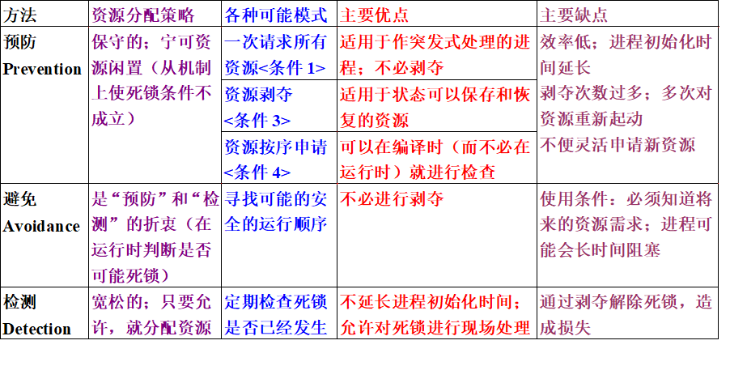

# 操作系统

计算机和计算机软件的诞生

计算机语言发展历程

计算机系统组成

硬件和软件的关系

操作系统的发展

# 操作系统的定义和作用

定义

操作系统是计算机系统中的一个系统软件，它是这样一些程序模块的集合-----它们管理和控制计算机系统中的软件及硬件资源，合理地组织计算机工作流程，以便有效地利用这些资源为用户提供一个功能强，使用方便的工作环境，从而在计算机与其用户之间起到接口的作用。

操作系统是一直运行在计算机上的程序（通常称为内核），其他程序则为系统程序和应用程序。 操作系统是管理系统资源、控制程序执行，改善人机界面，提供各种服务，合理组织计算机工作流程和为用户使用计算机提供良好运行环境的一种系统软件。 操作系统是计算机系统中的一个系统软件，它是这样一些程序模块的集合—它们管理和控制计算机系统中的硬件及软件资源，合理地组织计算机工作流程，以便有效地利用这些资源为用户提供一个功能强大、使用方便和可扩展的工作环境，从而在计算机与其用户之间起到接口的作用。

计算机系统的硬件资源包括中央处理机、存储器（包括主存与外存）和输入/输出设备等物理设备；计算机系统的软件资源是以文件形式保存在存储器上的程序和数据等信息。操作系统能有效地组织和管理系统中的各种软/硬件资源，合理地组织计算机系统工作流程，控制程序的执行，并且向用户提供一个良好的工作环境和友好的接口。 操作系统有如下两个重要的作用。

（1）通过资源管理提高计算机系统的效率。操作系统是计算机系统的资源管理者，它含有对系统软/硬件资源实施管理的一组程序。其首要作用就是通过CPU管理、存储管理、设备管理和文件管理对各种资源进行合理地分配，改善资源的共享和利用程度，最大限度地发挥计算机系统的工作效率，提高计算机系统在单位时间内处理工作的能力（称为系统的“吞吐量（throughput）”）。 （2）改善人机界面向用户提供友好的工作环境。如果不安装操作系统，用户将要面对的是0、1代码和一些难懂的机器指令，通过按钮或按键来操作计算机，这样即笨拙又费时。一旦安装操作系统后，用户面对的不再是笨拙的裸机，而是操作便利、服务周到的操作系统，从而明显地改善了用户界面，提高了用户的工作效率。

------

# 操作系统的特征与功能

现代操作系统的特点： 程序的并发性 系统资源共享 用户操作的随机性

问题：操作系统在多用户随机使用的环境下进行资源分配、资源共享和控制程序并发执行的基本单位是什么？ 进程刚好是这样一个基本单位

程序的并发执行

# 进程管理

§3.1 进程的概念 §3.2 进程的描述 §3.3 进程状态及其转换 §3.4 进程控制 §3.5 进程互斥 §3.6 进程同步 §3.7 进程通信 §3.8 死锁问题 §3.9 线程

## 进程的定义

进程是可以并行执行的计算部分 (Madnick, Donovan) 进程是一个独立的可以调度的活动（Cohen, Jofferson） 进程（有时称为任务）是一个程序与其数据一道通过处理机的执行所发生的活动。（Alan.C. Shaw) 进程是执行中的程序。（Ken Thompson and Dennis Ritchie ) 行为的一个规则叫做程序，程序在处理机上执行时所发生的活动称为进程（Dijkstra)。 教材上给出的进程的定义： 进程，即是一个具有一定独立功能的程序对某个数据集合在处理机上的执行过程和分配资源的基本单位。

### 进程与程序的区别

进程是动态的，程序是静态的：程序是有序代码的集合；进程是程序的执行。程序可以作为软件资料长期保存，而进程是有生命周期的。 如果把程序比作菜谱，那么进程则是按照菜谱炒菜的过程 进程具有并行特征，而程序没有：程序不反映执行过程，所以不具有并行特征。 进程是竞争系统资源的基本单位； 进程与程序的对应关系：通过多次执行，一个程序可对应多个进程；通过调用关系，一个进程可包括多个程序。

## 进程的描述

进程的静态描述： 进程控制块PCB： 进程控制块包含了进程的描述信息、控制信息及资源信息，是进程动态特征的集中反映。 有关程序段 描述进程所要完成的功能。 数据结构集 进程执行时必不可少的工作区和操作对象。

#### 进程控制块 PCB

> 进程控制块PCB的内容： 进程描述信息 进程控制信息 资源管理信息 CPU现场保护结构

进程描述信息： 进程名或进程标识符(process ID)，唯一，通常是一个整数； 用户标识符(user ID) ； 进程家族关系(process group)

进程控制信息： 当前状态；（就绪态、执行态、等待态） 优先级(priority)； 占有CPU时间； 进程优先级偏移； 占据内存时间； 代码执行入口地址、程序的外存地址； 计时信息（进程占有和利用资源的有关情况）； 进程间同步和通信；

资源占用信息：虚拟地址空间的现状、I/O信息、文件系统信息等； 占用内存大小及其管理用数据结构指针； 在复杂系统中，内存对换和覆盖用的有关信息； 共享程序段大小及其起始地址； I/O设备号、要传送的数据长度、缓冲区地址和长度、与设备相关的数据结构指针 指向文件系统的指针及有关标识。

CPU现场保护结构：寄存器值（通用、程序计数器PC、状态PSW，地址包括栈指针）

小结

进程控制块PCB是系统感知进程存在的唯一实体。 通过对PCB的操作，系统为有关进程分配资源从而使得有关进程得以被调度执行； 与进程有关的所有现场信息都保存在PCB中； 进程执行结束后，OS通过释放PCB释放进程占有的资源。 PCB就象是我们的户口

### 进程上下文

进程上下文是对进程执行活动全过程的静态描述。 进程上下文的构成： 与进程有关的各种寄存器（如通用寄存器、程序计数器PC、程序状态字PSW等） 程序段经过编译后形成的机器指令代码集（正文段） 数据集和各种堆栈值 PCB结构

用户级上下文：进程的用户地址空间（包括用户栈各层次），包括用户正文段、用户数据段和用户栈； 寄存器级上下文：程序寄存器、处理机状态寄存器、栈指针、通用寄存器的值； 系统级上下文： 静态部分（PCB结构和资源表格） 动态部分：核心栈（核心过程的栈结构，不同进程在调用相同核心过程时有不同核心栈）

### 进程空间

进程在执行时所拥有的地址空间称为进程空间； 进程空间的大小只与处理机的位数有关； 进程空间分为：用户空间和系统空间； 用户程序在用户空间内执行，操作系统内核程序在系统空间内执行； 进程在用户空间的执行模式称为用户态，在系统空间的执行模式称为系统态或核心态。

 核心态和用户态

用户态时不可直接访问受保护的OS代码； 核心态时执行OS代码，可以访问全部进程空间。

## 进程状态及其转换

一个进程的生命期可以划分为就绪状态、执行状态和等待状态（又称为阻塞状态）；

### 进程状态

运行状态(Running)：占用处理机资源；处于此状态的进程的数目小于等于CPU的数目。 在没有其他进程可以执行时（如所有进程都在等待状态），通常会自动执行系统的idle进程（相当于空操作）。 就绪状态(Ready)：进程已获得除处理机外的所需资源，等待分配处理机资源；只要分配CPU就可执行。 可以按多个优先级来划分队列，如：时间片用完－>低优，I/O完成－>中优，页面调入完成－>高优 等待状态(Wait)：由于进程等待某种条件（如I/O操作或进程同步），在条件满足之前无法继续执行。该事件发生前即使把处理机分配给该进程，也无法运行。如：等待I/O操作的完成。

就绪状态又可分为： 内存就绪状态 外存就绪状态 执行状态又可分为： 用户态：进程的用户程序段在执行 核心态：进程的系统程序段在执行

也有把进程状态分为5个状态和9个状态的说法

### 进程状态转换

## 进程控制

进程控制：系统使用一些具有特定功能的程序段来创建、撤消进程以及完成进程各状态间的转换，从而达到多进程高效率并发执行和协调、实现资源共享的目的。

### 原语

原语：把系统态下执行的某些具有特定功能的程序段称为原语。 原语分为： 指令级原语：在执行期间不允许中断； 功能级原语：不允许并发执行。

用于进程控制的原语有：创建原语、撤消原语、阻塞原语、唤醒原语。

### 进程的创建和撤销

进程的创建方式： 由系统程序模块统一创建 由系统统一创建的进程之间的关系是平等的，它们之间一般不存在资源继承关系。 由父进程创建 在父进程与子进程之间存在隶属关系，且互相构成树型结构的家族关系。属于某个家族的一个进程可以继承其父进程所拥有的资源。 无论以哪一种方式创建进程，在系统生成时，都必须由操作系统创建一部分承担系统资源分配和管理工作的系统进程。

### 进程的阻塞与唤醒

阻塞原语：将进程由执行状态变为阻塞状态（等待状态）； 唤醒原语：将进程由阻塞状态变为就绪状态。

阻塞原语在一个进程期待某一事件（例如键盘输入数据、写盘、其他进程发来的数据等）发生，但发生条件尚不具备时，被该进程自己调用来阻塞自己。

进程的阻塞与唤醒

## 进程互斥

进程间资源访问冲突 共享变量的修改冲突 操作顺序冲突 进程间的制约关系 间接制约：进行竞争－－独占分配到的部分或全部共享资源，“互斥” 直接制约：进行协作－－等待来自其他进程的信息，“同步”

### 临界区

不允许多个并发进程交叉执行的一段程序称为临界区（Critical Section or Critical Region）； 临界区是由属于不同并发进程的程序段共享公用数据或变量而引起的； 临界区不可能用增加硬件的方法来解决。因此，临界区也可以被称为访问公用数据的那段程序。

互斥：不允许两个以上的并发进程同时进入临界区称为互斥。 并发进程互斥执行必须满足： 不能假设各并发进程的相对执行速度； 某个进程不在临界区时，它不能阻止其他进程进入临界区； 若干个并发进程申请进入临界区时，只能有一个进程进入临界区； 申请进入临界区的进程应在有限时间内得以进入临界区

上述准则中，(1)(2)(3)是保证各并发进程享有平等的、独立竞争资源的权利，且保证每一时刻最多只有一个进程在临界区；(4)保证了并发进程不发生死锁。 死锁，指多个进程互不相让，都得不到足够的资源，只好一直处于等待状态； 饥饿，指一个进程一直得不到资源（其他进程可能轮流占用资源）。

### 互斥的加锁实现

使用临界区加锁的方法可以实现并发进程互斥地访问临界区：

>  当某个进程进入临界区之后，它将锁上临界区，直到它退出临界区时为止。其他并发进程在申请进入临界区时，首先测试该临界区是否是上锁的，如果该临界区已被锁住，则该进程要等到该临界区开锁之后才有可能获得临界区。

### 信号量和P、V原语

### 用P,V原语实现进程互斥

## 进程同步

同步：所谓同步就是并发进程在一些关键点上可能需要相互等待与互通消息，这样的相互制约关系称为进程同步。 互斥的概念来自于诸进程对独占使用资源（设备）的竞争，同步来源于多个进程的合作。在人类社会中竞争与合作是永恒的。

### 用P，V原语操作实现同步

### 生产者-消费者问题

## 进程通信

低级通信：只能传递状态和整数值（控制信息），包括进程互斥和同步所采用的信号量。优点是速度快。缺点是： 传送信息量小：效率低，每次通信传递的信息量固定，若传递较多信息则需要进行多次通信。 编程复杂：用户直接实现通信的细节，编程复杂，容易出错。 高级通信：能够传送任意数量的数据，包括三种方式：消息缓冲区、邮箱机制、管道。

在单机系统中，进程间的通信可以分为 主从式 会话式 消息或邮箱机制 共享存诸区方式

主从式（master/servant system）的特点： 主进程可以自由使用从进程的资源或数据 从进程的动作受主进程的控制 主进程和从进程的关系是固定的。 典型例子：终端控制进程和终端进程

会话（dialogue system）方式中，通信进程双方可分别称为使用进程和服务进程，使用进程调用服务进程提供的服务，特点如下： 使用进程在使用服务进程提供的服务进程之前，必须得到服务进程的许可 服务进程根据使用进程的要求提供服务，但对所提供服务的控制由服务进程自身完成 使用进程和服务进程在进程通信时有固定的连接关系 典型例子：用户进程与磁盘管理进程之间的通信

消息或邮箱机制的特点： 无论接收进程是否已准备好接收消息，发送进程都将把所要发送的消息送入缓冲区或邮箱。 发送进程和接收进程地位平等 只要存在空缓冲区或邮箱，发送进程就可以发送消息 发送进程和接收进程之间无直接的连接关系，接收进程可能在收到某个发送进程发来的消息之后，又转去接收另一个发送进程发来的消息； 发送进程和接收进程之间存在缓冲区或邮箱，用来存放消息 。

共享存储区方式： 不要求数据移动； 两个需要互相交换信息的进程通过对同一个共享数据区（shared memory）的操作来达到互相通信的目的； 共享数据区是每个互相通信进程的一个组成部分。

### 消息缓冲机制

1973年，Hansen首先提出了用消息缓冲作为进程通信的一种基本方式： 发送进程在发送消息前，先在自己的内存空间设置一个发送区，把欲发送的消息填入其中，然后再用发送过程将其发送出去； 接收进程在接收消息之前，在自己的内存空间设置相应的接收区，然后用接收过程接收消息。

由于消息缓冲机制中所使用的缓冲区为公用缓冲区，使用消息缓冲区传送数据时，两个进程必须满足： 发送进程和接收进程操作缓冲区时，禁止其他进程对缓冲区消息队列的访问； 当缓冲区中无消息时，接收进程不能收到任何消息。

设公用信号量mutex为控制对缓冲区访问的互斥信号量，其初值为1。 设SM为接收进程的私用信号量，表示等待接收的消息个数，其初值为0。 设发送进程调用过程send(m)将消息m送到缓冲区，接收进程调用过程receive(m)将消息从缓冲区读往自己的数据区。

### 邮箱通信

邮箱通信就是由发送进程申请建立一个与接收进程链接的邮箱。发送进程把消息送往邮箱，接收进程从邮箱中将消息取走，从而完成进程间的消息交换。 设置邮箱的最大好处是发送进程和接收进程之间没有处理时间上的限制。 邮箱可以视为发送进程与接收进程之间的大小固定的私有数据结构，它不象缓冲区那样被系统中所有进程共享。

## 死锁

本节要点 死锁的概念 死锁是如何发生的？ 如何解决死锁问题？ 银行家算法 哲学家就餐问题

定义

所谓死锁，是指各并发进程彼此互相等待对方所拥有的资源，且这些并发进程在得到对方的资源之前不会释放自己所拥有的资源，从而造成大家都想得到资源而又都得不到资源，各并发进程不能继续向前推进的状态。

两个进程发生死锁的情形：各拥有一部分资源，但又都得不到所需的全部资源。

死锁的形式描述： 有并发进程P1,P2,…,Pn，它们共享资源R1,R2,…,Rn(n>0,m>0,n>=m)，其中每个Pi (1≤i≤n)拥有资源Rj (1≤j≤m)，直到不再有剩余资源，同时，各Pi又在不释放Rj的前提下要求得到Rk（k≠j, 1≤k≤m ），从而造成资源的互相占有和互相等待。在没有外力驱动的情况下，该组并发进程停止向前推进，陷入永久等待状态。

### 死锁发生的原因

死锁的起因是并发进程的资源竞争

产生死锁的根本原因：系统提供的资源个数少于并发进程所要求的该类资源数。

可采用适当的资源分配方法避免死锁。

### 死锁发生的必要条件

互斥条件:一个资源一次只能被一个进程所使用； 非剥夺条件: 进程所获得的资源在未使用完毕前，不能被别的进程强行剥夺，只能由获得该资源的进程自己释放。 部分分配条件: 进程每次申请它所需要的一部分资源，在等待新资源的同时，继续占有已分配到的资源。 环路条件: 若干个进程构成环行请求链,链中每个进程已获得的资源同时被下一个进程请求。

### 死锁的排除方法

只要死锁产生的4个必要条件之一不满足，死锁就可以排除。 解决死锁的方法： 预防：限制并发进程对资源的请求(计划经济) 避免：在分配资源时，根据资源的使用情况做出预测（市场经济） 检测与恢复：当死锁发生时，通过外力破坏死锁发生的必要条件，从而使得并发进程从死锁状态中恢复出来。（完全自由的资本主义经济—经济危机与重建） 不理会死锁：死锁问题的发生是小概率事件（驼鸟政策）

### 死锁预防

1. 阻止互斥 破坏第一个条件，使资源可以同时访问而不是互斥使用，这是个简单的方法，但在进程并发执行的情况下往往有许多资源是不能同时访问的（写操作），所以这种做法不是都可行的。 只能对可共享的资源（如只读文件）这样做。 不适合非共享资源，例如，为写而打开的文件、打印机等。

2. 破坏“部分分配”条件 必须保证：当一个进程申请一个资源时，它不能占有其它资源。 采用资源的静态预分配策略，一次申请所有的资源。 优点： 简单安全，易于实施； 在进程的活动较单一时性能好； 无须抢占。 缺点： 资源利用率低； 启动进程慢，效率低； 有“饥饿”现象存在。

3. 破坏“非抢占”条件（允许抢占） 方法1：若拥有某种资源的进程在申请其他资源时遭到拒绝，则它必须释放其占用的资源，以后若有必要可再次申请上述资源。 方法2：当一进程申请的资源正被其他进程占用时，可通过操作系统抢占该资源，此方法在两个进程优先级相同时，不能防止死锁。

   优点： 对状态容易保留和恢复的资源较为方便。 缺点： 实现困难，恢复现场代价高； 导致过多的不必要抢占； 易导致循环重启。

4. 破坏“循环等待 ”条件 采用资源定序方法，将所有资源按类型线性排队，并按递增规则编号。进程只能以递增方式申请资源，因而不会导致循环等待。 如果进程申请一个资源，它首先必须释放所有比该资源编号大的资源。

   优点： 资源的申请与分配逐步进行，比预分配策略的资源利用率高； 易实现编译期间的检查； 无须执行时间，在系统设计阶段问题就已解决。 缺点： 严格限制资源的顺序性，不允许增加资源请求； 在使用资源的顺序与系统规定不一致时，资源利用率降低； 不能抢占。

预防死锁的两种主要策略（归纳）： 预先静态分配法：（针对死锁的第2个条件）预先分配所需全部资源，保证不等待资源； 降低了对资源的利用率，降低进程的并发程度； 有可能无法预先知道所需资源； 有序资源使用法：（针对死锁的第4个条件）把资源分类按顺序排列，保证不形成环路； 限制进程对资源的请求； 资源的排序占用系统开销；

### 死锁避免

死锁避免的要点：在分配资源时判断是否会出现死锁，如不会死锁，则分配资源。 死锁避免可视为动态预防。 基本模式：把进程分为多个步，其中每个步所使用的资源是固定的，且在一个步内，进程所保持的资源数不变。

#### 死锁避免---银行家算法

Dijkstra, 1965年提出银行家算法。 一个银行家把他的固定资金（capital）代给若干顾客。只要不出现一个顾客借走所有资金后还不够，银行家的资金应是安全的。银行家需一个算法保证借出去的资金在有限时间内可收回。

假定顾客分成若干次进行；并在第一次借款时，能说明他的最大借款额。 具体算法： 顾客的借款操作依次顺序进行，直到全部操作完成； 银行家对当前顾客的借款操作进行判断，以确定其安全性（能否支持顾客借款，直到全部归还）； 安全时，贷款；否则，暂不贷款。

#### 多种资源银行家算法

#### 银行家算法的特点

允许互斥、部分分配和不可抢占，可提高资源利用率； 要求事先说明最大资源要求，在现实中很困难；

### 死锁的检测

考虑因素： 死锁发生频度； 死锁影响进程。 1. 等待时检测： 发现早，恢复代价小，开销大（overhead)。 2. 定时检测： 3. 资源（eg. CPU）利用率下降时检测。

### 死锁恢复

### 解决死锁的方法比较

image-20200331151809516

### 哲学家就餐问题

## 线程

线程的概念 一个进程内的基本调度单位称为线程（Tread）或称为轻权进程(light weight process)，这个调度单位既可以由操作系统内核控制，也可以由用户程序控制。

### 线程与进程的比较

进程是资源分配的基本单位，线程与资源分配无关，它属于某一个进程，并与进程内的其他线程一起共享进程的资源。 进程是抢占CPU资源的调度单位，它拥有一个完整的虚拟地址空间。 当进程发生调度时，不同的进程拥有不同的虚拟地址空间，而同一进程内的不同线程共享同一地址空间。 线程只由相关堆栈、寄存器和线程控制表TCB组成。寄存器可被用来存储线程内的局部变量，但不能存储其他线程的相关变量。 进程切换时将涉及到有关资源指针的保存以及地址空间的变化等问题，线程切换时不会涉及到资源信息的保存和地址空间的变化问题，从而减少了OS的开销。 进程的调度与切换都是由OS内核完成，线程既可以由OS内核完成，也可由用户程序进行。

### 多线程与进程之间的关系

### 单线程进程和多线程进程

### 线程的适用范围

使用线程的最大好处是在有多个任务需要处理机处理时，减少处理机的切换时间；而且线程的创建和结束所需要的系统开销也比进程的创建和结束要小得多。 最适合使用线程的系统是多处理系统。在多处理机系统中，同一用户程序可以根据不同的功能划分为不同的线程，放在不同的处理机上执行。

### 线程在单处理机系统中的典型应用

服务器中的文件管理和通信控制 在局域网的文件服务器中，对文件的访问请求可被服务器进程派生出的线程进行处理。 前后台处理 所谓前后台处理就是把一个计算量较大或实时性要求不高的程序安排在CPU空闲时执行。对同一个进程中的程序而言，线程可用来减少CPU切换时间和提高执行速度。 异步处理 程序中的两部分如果没有执行上的顺序规定，则这两部分程序可用线程执行。

### 线程的执行特性

线程有三个基本状态：执行、就绪、阻塞 有5个基本操作来转换线程的状态： 派生(spawn)：线程在进程内派生出来，它既可由进程派生，也可由线程派生。 阻塞(Block)：如果一个线程在执行过程中需要等待某个事件发生，则被阻塞。 激活(Unblock)：如果阻塞线程的事件发生，则该线程被激活并进入就绪队列。 调度(Schedule):选择一个就绪线程进入执行状态。 结束(Finish)：如果一个线程执行结束，它的寄存器上下文以及堆栈内容等将被释放。

#### 线程的状态与操作

### 线程的分类

线程可分为： 用户级线程(User level threads) 系统级线程（核心级线程Kernel-level threads）； 有些操作系统只使用用户级线程，有些操作系统使用纯核心级进程，如Windows NT，有些操作系统使用混合模式，如Solaris。

#### 用户级线程

用户级线程的管理过程全部由用户程序完成，操作系统内核只对进程进程管理。 操作系统为用户级线程提供了一个在用户空间执行的线程库。该线程库提供创建、调度、撤消线程的功能以及线程间的通信、执行及存储线程上下文的功能。

#### 核心级线程

核心级线程由操作系统内核进程管理。 操作系统内核给应用程序提供相应的系统调用和应用程序接口API，这样用户程序可以创建、执行和撤消线程。 与用户线程不同，核心级线程既可以被调度到一个处理机上并发执行，也可以被调度到不同的处理机上并行执行。 操作系统内核既负责进程的调度，也负责进程内不同线程的调度。

#### 用户级线程与系统级线程的比较

# 处理机调度

4.1 分级调度 4.2 作业调度 4.3 进程调度 4.4 调度算法 4.5 算法评价 4.6 实时系统调度方法

## 分级调度

处理机调度问题实际上就是处理机的分配与管理。 处理机管理的工作是对CPU资源进行合理的分配使用，以提高处理机利用率，并使各用户公平地得到处理机资源。这里的主要问题是处理机调度算法和调度算法特征分析。

**并发所带来的效率提升**

### 面向用户的性能指标

周转时间：从作业提交给系统到返回结果所需时间； 平均周转时间T 平均带权周转时间（带权周转时间W是 T(周转)/T(CPU执行)〕 响应时间：用户输入一个请求（如击键）到系统给出首次响应（如屏幕显示）的时间－－分时系统

截止时间：开始截止时间和完成截止时间－－实时系统，与周转时间有些相似。

公平性：不因作业或进程本身的特性而使上述指标过分恶化。如长作业等待很长时间。

优先级：可以使关键任务达到更好的指标。

### 面向系统的性能指标

吞吐率：在给定时间内，一个计算机系统所完成的总工作量； 响应时间：用户向计算机发出一个命令到计算机将结果返回给用户所需的时间； 设备利用率：指I/O设备的使用情况。

### 面向算法的性能指标

实现难度：实现该算法是否容易 执行开销比：该算法是否消耗太多系统资源

作业调度-高级调度 交换调度-中级调度 进程调度-低级调度 线程调度

高级(Long-term)调度――作业调度 作业调度用于决定把外存输入井上处于作业后备队列上的那些作业调入内存，并为它们创建进程、分配必要的资源，然后再将新创建的进程排在就绪队列上，准备执行。在批处理系统中，作业是先驻留在外存的输入井上的，因此需要有作业调度。然而在分时系统中，通过键盘输入的命令和数据直接进入内存，无需作业调度。

中级(Medium-term)调度——交换调度 引入中级调度的目的是为了提高主存利用率和系统吞吐量。由于在进程并发执行过程中，为了充分发挥内存的效能，需将那些暂时不能运行的进程从内存调到外存盘交换区去等待，而将那些在盘交换区的等待事件已经发生急需调度运行的进程从盘交换区调入内存。在UNIX系统中中级调度就是存储管理中的交换，采用虚拟存储技术的分时系统往往设立中级调度。

低级(Short-term)调度――进程调度 进程调度决定就绪队列中哪个进程将获得处理机，然后由分派程序执行把处理机分配给该进程的操作。在确定了占用处理机的进程之后，系统必须进行进程上下文切换以建立与占用处理机进程相适应的执行环境。 进程调度是最基本的调度，任何操作系统都有进程调度。

线程调度 在多线程系统中，按照一定的策略和方法选取一个处于就绪队列中的线程占有处理机。

## 作业调度

### 作业与进程的关系

作业可被看作是用户向计算机提交任务的实体。如一次计算，一个控制过程等。 进程则是计算机为了完成用户任务实体而设置的执行实体，是系统分配资源的基本单位。 一个作业可以由一个或多个进程组成。而一个进程不可能对应多个作业。

作业的组成 作业由程序、数据、作业说明书三部分组成 程序是问题求解的算法描述 数据是程序加工的对象，但有些程序未必使用数据； 作业说明书是告诉操作系统本作业的程序和数据按什么样的控制要求使之执行。 作业步 一个作业的一次活动中若干相对独立的加工步骤 编译原程序 连接装配程序 运行程序

### 作业的状态

作业从进入到运行结束，一般需要经历“提交”、“后备”、“运行”和“完成”四个阶段。

1 提交状态 作业从输入设备进入外存储器时的状态 2 后备状态 作业的全部信息调入外存后,系统将其加入后备作业队列时的状态 系统将为每个作业建立一个作业控制表(JCT) 3 运行状态 作业被调度程序选中,并分配到它所需要的资源时调入内存运行时的状态 4 完成状态 作业正常运行结束或因发生错误而终止时,释放占有的所有资源,准备离开系统时的状态

### 作业控制块JCB

### 作业调度及其功能

作业调度是按照某种调度算法从后备作业队列中选择作业装入内存运行，并当作业运行结束后做后续处理。 选择作业 分配资源：分配内存和外设资源 建立作业的进程 建立其它相关表格 作业后续处理(收回资源/撤消PCB和JCB)

作业调度又称为宏观调度 在实时系统和分时系统中通常不配置作业调度

### 作业调度目标与性能衡量

作业调度目标： 对所有作业应该是公平合理的 应使设备有高的利用率 每天执行尽可能多的作业 有快的响应时间

作业调度性能衡量 平均周转时间 带权平均周转时间

#### 平均周转时间和平均带权周转时间

## 进程调度

进程调度的功能： 记录系统中所有进程的执行情况 进程管理模块在各进程的PCB表中记录系统各进程的执行情况和状态特征，并将各PCB表根据进程状态特征和资源要求排成相应的队列，并进行动态队列转换。

选择占有处理机进程 进程调度的主要功能是按照一定的策略（由它决定的调度算法），选择一个处于就绪态的进程，使其获得处理机执行。

进行进程上下文切换 进程上下文实际上是进程执行活动全过程的静态描述，一个进程的执行是在进程上下文中执行。当正在执行的进程由于某种原因要让出处理机时，系统要做上下文切换，以使另一个进程得以执行。

### 进程调度的时机

引起进程调度的原因有：

1. 正在执行的进程执行完毕；
2. 执行中的进程调用阻塞原语将自己阻塞起来进入睡眠状态；
3. 执行中的进程调用了P原语操作，从而因资源不足而被阻塞；或调用了V原语激活了等待资源的进程队列；
4. 执行中的进程提出I/O请求后被阻塞；
5. 执行中的进程在分时系统中的时间片已用完；
6. 系统程序返回用户进程时，可认为系统进程执行完毕，从而可调度选择一个新的用户进程执行；
7. 在剥夺方式下，就绪队列中的进程优先级高于执行中的进程，执行进程被剥夺处理机资源。

### 进程调度的方式

非剥夺（非抢占 Nonpreemptive mode ）方式： 采用这种调度方式时，一旦把处理机分配给某进程后，便让进程一直执行，直到该进程完成或发生某事件而被阻塞时，才把处理机分配给其它进程，决不允许某进程抢占已经分配出去的处理机。 这种调度方式的优点是实现简单、系统开销小，适用于大多数批处理系统环境。缺点是难以满足紧急任务的要求，不适用于实时、分时系统要求。

剥夺（抢占）方式（Preemptive mode） 这种调度方式，允许进程调度程序根据某个原则，去停止某个正在执行的进程，将已分配给进程的处理机，重新分配给另一个进程。抢占的原则有：

时间片原则。各进程按时间片运行，当一个时间片用完后，便停止该进程的执行而重新进行调度。这个原则适用于分时系统。 优先权原则。通常是对一些重要的和紧急的进程赋予较高的优先权。当这种进程进入就绪队列时，例如由阻塞态转换为就绪态，或从静止就绪态转为活动就绪态时，或新创建进入就绪态的进程进入就绪队列时，如果其优先权比正在执行的进程优先权高，便停止正在执行的进程，将处理机分配给优先权高的进程，使之执行。

### 进程上下文切换

进程上下文由正文段、数据段、硬件寄存器的内容和有关数据结构等组成。 进程上下文切换包括4个步骤： 1. 决定是否作上下文切换以及是否允许做上下文切换。包括对进程调度原因的检查分析，以及当前执行进程的资格和CPU执行方式的检查等； 2. 保存当前执行进程的上下文。

1. 按照某个进程调度算法，选择一个处于就绪状态的进程。
2. 恢复或装配所选进程的上下文，将CPU控制权交给所选进程。

### 进程调度性能评价

进程调度性能的衡量是操作系统设计的一个重要指标。 进程调度性能的定性衡量： 可靠性：如进程调度是否会破坏数据结构。 简洁性：调度程序不会太繁琐和复杂 进程调度性能的定量衡量： CPU利用率 进程等待-执行时间比 响应时间

## 调度算法

先来先服务(FCFS) 最短作业优先(shortest job first) 时间片轮转法(Round robin) 多级反馈轮转法(round robin with multiple feedback) 优先级法(Priority Scheduling) 最高响应比优先(highest response_ratio next)

**评价算法的各种指标**

周转时间：从作业提交给系统到返回结果所需时间； 平均周转时间T 平均带权周转时间（带权周转时间 W = T周转时间 / E 执行时间） 响应时间：用户输入一个请求（如击键）到系统给出首次响应（如屏幕显示）的时间－－分时系统 截止时间：开始截止时间和完成截止时间－－实时系统，与周转时间有些相似。 公平性：不因作业或进程本身的特性而使上述指标过分恶化。如长作业等待很长时间。 优先级(效率)：可以使关键任务达到更好的指标

吞吐率：在给定时间内，一个计算机系统所完成的总工作量； 设备利用率：指I/O设备的使用情况。

实现难度：实现该算法是否容易 执行开销比：该算法是否消耗太多系统资源

### 先来先服务(FCFS)

按照作业提交或进程变为就绪状态的先后次序，分派CPU； 当前进程占用CPU，直到执行完或阻塞，才出让CPU（非抢占方式）。 在进程唤醒后（如I/O完成），并不立即恢复执行，通常等到当前作业或进程出让CPU。

特点： 最简单的算法，表面上很公平； 比较有利于长作业，而不利于短作业。 有利于CPU繁忙的作业，而不利于I/O繁忙的作业。 影响： 可能会降低吞吐率 增加平均周转时间

### 最短作业优先 (SJF, Shortest Job First)

又称为“短进程优先”SPN(Shortest Process Next)；这是对FCFS算法的改进，其目标是提高吞吐率，减少平均周转时间。 对预计执行时间短的作业（进程）优先分派处理机。 通常后来的短作业不抢先正在执行的作业。(非剥夺)

非抢占式SJF调度例子 Example of Non-Preemptive SJF

抢占式SJF调度例子Example of Preemptive SJF

SJF算法的特点

优点： 比FCFS改善平均周转时间和平均带权周转时间，缩短作业的等待时间； 提高系统的吞吐量； 缺点： 对长作业非常不利，可能长时间得不到执行； 未能依据作业的紧迫程度来划分执行的优先级； 难以准确估计作业（进程）的执行时间，从而影响调度性能。

### 轮转法(Round Robin)

将系统中所有的就绪进程按照FCFS原则，排成一个队列。 每次调度时将CPU分派给队首进程，让其执行一个时间片。时间片的长度从几个ms到几百ms。 在一个时间片结束时，发生时钟中断。 调度程序据此暂停当前进程的执行，将其送到就绪队列的末尾，并通过上下文切换执行当前的队首进程。 进程可以未使用完一个时间片，就出让CPU（如阻塞）。

#### 轮转法(Round Robin)-时间片长度的确定

时间片长度变化的影响 过长－>退化为FCFS算法，进程在一个时间片内都执行完，响应时间长。 过短－>用户的一次请求需要多个时间片才能处理完，上下文切换次数增加，响应时间长。 对响应时间的要求： q(时间片) = R(响应时间) / Nmax(进程数目) 时间片长度的影响因素： 就绪进程的数目：数目越多，时间片越小（当响应时间一定时） 系统的处理能力：应当使用户输入通常在一个时间片内能处理完，否则使响应时间，平均周转时间和平均带权周转时间延长。

### 多级反馈轮转法

把就绪队列按照进程到达就绪队列的类型和进程被阻塞时的原因分成不同的就绪队列； 每个队列按FCFS方式排列，各队列之间的进程享有不同的优先级，但同一队列内优先级相同； 当一个进程在执行完它的时间片后，或从睡眠中被唤醒以及被创建之后，将进入不同的就绪队列。

**多级反馈轮转法的特点：**

多级反馈轮转法不必事先知道各种进程所需的执行时间，仍能基本满足短进程优先和I/O频繁的进程优先的需要，因而是目前公认的较好的一种进程调度算法。 在UNIX系统、WindowsNT、OS/2中都采用了类似的调度算法。

### 优先级法(Priority Scheduling)

按照进程的优先权大小来调度，使高优先权进程得到优先处理的调度策略称为优先权调度算法。

进程的优先权的设置可以是静态的，也可以是动态的。

#### 静态优先级

静态优先权在进程创建时确定，且的在整个生命期中保持不变。 确定进程优先权的依据有： 进程类型，通常系统进程（例如对换进程）的优先权高于一般用户态进程的优先权； 进程对资源的需求，如进程执行时间及内存需要省的进程应赋予较高的优先权； 根据用户要求，由用户的紧迫程度及用户所付费用的多少来确定进程的优先权。

#### 动态优先级

动态优先权是指在创建进程时所赋予的优先权，可以随进程的推进而改变，以便获得更好的调度性能。

改变优先权的因数，随系统不同而不同，最常考虑的因素是进程的等待时间，已使用处理机的时间，或者资源使用情况等。

**确定动态优先级的原则**

在就绪队列中，等待时间延长则优先级提高，从而使优先级较低的进程在等待足够的时间后，其优先级提高到可被调度执行； 进程每执行一个时间片，就降低其优先级，从而一个进程持续执行时，其优先级降低到出让CPU。

### 最高响应比优先(highest response_ratio next)

## 算法评价

## 实时系统调度方法

# 存储管理

5.1 存储管理的功能 5.2 分区存储管理 5.3 覆盖与交换技术 5.4 页式管理 5.5 段式与段页式管理 5.6 局部性原理和抖动问题

基本概念 --存储器的分类

内存储器（简称内存、主存、物理存储器） 处理机能直接访问的存储器。用来存放系统和用户的程序和数据，其特点是存取速度快，存储方式是以新换旧，断电信息丢失。 外存储器（简称外存、辅助存储器） 处理机不能直接访问的存储器。用来存放用户的各种信息，存取速度相对内存而言要慢得多，但它可用来长期保存用户信息。在文件系统中介绍。

基本概念 --内存的物理组织

物理地址： 把内存分成若干个大小相等的存储单元，每个单元给一个编号，这个编号称为内存地址（物理地址、绝对地址、实地址），存储单元占8位，称作字节（byte）。 物理地址空间： 物理地址的集合称为物理地址空间（主存地址空间），它是一个一维的线性空间。

基本概念 --程序的逻辑结构

程序地址：用户编程序时所用的地址（或称逻辑地址 、虚地址 ），基本单位可与内存的基本单位相同，也可以不相同。 程序地址空间（逻辑地址空间、虚地址空间）:用户的程序地址的集合称为逻辑地址空间，它的编址总是从0开始的，可以是一维线性空间，也可以是多维空间。

## 存储管理的功能

1. 虚拟存储器
2. 地址变换
3. 内外存数据传输的控制
4. 内存的分配与回收
5. 内存信息的共享与保护

### 虚拟存储器

1、问题的提出 物理存储器的结构是个一维的线性空间，容量是有限的。 用户程序结构： 一维空间 一个用户程序就是一个程序，并且程序和数据是不分离的； 二维空间 程序由主程序和若干个子程序（或函数）组成，并且程序与数据是分离的；
n维空间 即一个大型程序，由一个主模块和多个子模块组成，其中，各子模块又由主程序和子程序（或函数）组成。 用户程序的大小，可能比内存容量小，也可能比内存容量大，有时候要大得多。

 如何将与物理内存结构不同，且大于物理内存容量的用户程序装入运行？这就是提出研究虚拟存储器的原因，或称为虚拟存储技术发展的原动力。

虚拟存储器的实现基础： 实验证明，在一个进程的执行过程中，其大部分程序和数据并不经常被访问。 实现原理：把进程中那些不经常被访问的程序段和数据放入外存中，待需要访问它们时再将它们调入内存。

大程序：可在较小的可用内存中执行较大的用户程序； 大的用户空间：提供给用户可用的虚拟内存空间通常大于物理内存(real memory) 并发：可在内存中容纳更多程序并发执行； 易于开发：不会影响编程时的程序结构

将进程中的目标代码、数据等的虚拟地址（又称逻辑地址，相对地址）组成的虚拟空间称为虚拟存储器（Virtual memory）。

虚拟存储器不考虑物理存储器的大小和信息存放的实际位置，只规定每个进程中互相关联的信息的相对位置。

每个进程都有自己的虚拟存储器，通常是一个以0地址为始地址的一维（或多维）虚拟地址空间。 从虚拟地址空间到物理地址空间需要进行地址变换。

### 地址变换

物理地址空间是一维的，而虚拟地址空间可以是一维的，也可以是多维的。 当程序装入内存时, 操作系统要为该程序分配一个合适的内存空间，由于程序的逻辑地址与分配到内存物理地址不一致, 而CPU执行指令时，是按物理地址进行的，所以要进行地址转换。

地址映射：将用户程序中的逻辑地址转换为运行时由机器直接寻址的物理地址。 地址变换涉及两个问题： 虚拟空间的划分 地址重定位（地址映射） 地址重定位的方法： 静态地址重定位 动态地址重定位

#### 静态地址重定位

评价: 优点：实现简单，不要硬件的支持。 缺点: (1) 程序一旦装入内存，移动就比较困难。 (2) 有时间上的浪费。 (3) 在程序装入内存时要将所有访问内存的地址转换成物理地址。 (4) 无法实现虚拟存储器。

#### 动态地址重定位

动态地址重定位是在程序执行过程中，在CPU访问内存之前，将要访问的程序或数据地址转换成内存地址。 动态地址重定位依靠硬件地址变换机构完成： 地址重定位机构需要一个（或多个）基地址寄存器BR和一个（或多个）程序虚拟地址寄存器VR。内存地址MR与虚拟地址的关系为：MR=BR+VR。

#### 内外存数据传输的控制

#### 内存的分配与回收

#### 内存信息的共享与保护

在多道程序设计的环境下，系统中有系统程序和多个用户程序同时存在，并且可能共享程序和数据，如何保证用户程序不破坏系统程序，用户程序之间不相互干扰？这就是存储保护所要解决的问题。 常用的存储保护有三种： 硬件法：上下界保护法。 软件法：保护键法。 软件与硬件结合：界限寄存器与与CPU用户态或核心态工作方式结合。

## 分区存储管理

分区管理的基本原理： 分区管理是把内存划分成若干个大小不等的区域，以连续存储各进程的程序和数据，除操作系统占用一个区域之外，其余由多道环境下的各并发进程共享。 分区管理是多道程序设计下的一种最简单的存储管理方法。 分区管理的方法： 固定分区法 动态分区法

### 固定分区法

固定分区方法：把内存空间分成若干个大小不等的区域，称为分区。每个用户程序（作业、进程）调入内存后，占用其中一个分区，程序运行完成后释放该分区。操作系统占用其中一个分区。 特点：适用于多道程序系统和分时系统 支持多个程序并发执行 难以进行内存分区的共享。 问题：可能存在内碎片和外碎片。 内碎片：占用分区之内未被利用的空间 外碎片：占用分区之间难以利用的空闲分区（通常是小空闲分区）。

### 动态分区法

动态创建分区：在装入程序时按其初始要求分配，或在其执行过程中通过系统调用进行分配或改变分区大小。 优点：没有内碎片。 缺点：有外碎片；如果大小不是任意的，也可能出现内碎片。

### 分区的分配与回收

固定分区的分配与回收

分配：存储管理程序根据请求表查询分区说明表，从中找出一个满足要求的空闲分区，并将其分配给申请者。 回收：当进程执行完毕，不再需要内存资源时，管理程序将对应的分区状态置为未使用。

动态分区的分配与回收

主要解决三个问题： (1) 对于请求表中的要求内存长度，从可用表或自由链中寻找出合适的空闲区分配程序； (2) 分配空闲区之后，更新可用表或自由链； (3) 进程或作业释放内存资源时，和相邻的空闲区进行链接合并，更新可用表或自由链。

### 动态分区的分配算法

最先适应法（first fit algorithm） 最佳适应法（best fit algorithm） 最坏适应法（worst fit algorithm）

以上三种方法要求可用表或自由链按不同的方式排列。

## 覆盖与交换技术

覆盖技术主要用于早期的操作系统中； 交换技术仍用于今天的操作系统。

### 覆盖技术

引入：其目标是在较小的可用内存中运行较大的程序。常用于多道程序系统，与分区存储管理配合使用。 原理：一个程序的几个代码段或数据段，按照时间先后来占用公共的内存空间。 将程序的必要部分（常用功能）的代码和数据常驻内存； 可选部分（不常用功能）在其他程序模块中实现，平时存放在外存中（覆盖文件），在需要用到时才装入到内存； 不存在调用关系的模块不必同时装入到内存，从而可以相互覆盖。(即不同时用的模块可共用一个分区)

缺点： 编程时必须划分程序模块和确定程序模块之间的覆盖关系，增加编程复杂度。 从外存装入覆盖文件，以时间延长来换取空间节省。

### 交换技术

引入：多个程序并发执行，可以将暂时不能执行的程序送到外存中，从而获得空闲内存空间来装入新程序，或读入保存在外存中而目前到达就绪状态的进程。交换单位为整个进程的地址空间。常用于多道程序系统或小型分时系统中，与分区存储管理配合使用。又称作"对换"或"滚进/滚出(roll-in/roll-out)"； 程序暂时不能执行的可能原因：处于阻塞状态，低优先级（确保高优先级程序执行）；

原理：暂停内存中执行的进程，将整个进程的地址空间保存到外存的交换区中（换出swap out），而将外存中由阻塞变为就绪的进程的地址空间读入到内存中，并将该进程送到就绪队列（换入swap in）。

## 页式管理

提出页式管理的原因： （1）分区管理方式存在着严重的碎片问题使得内存的利用率不高。 （2）进程的大小仍受分区大小或内存可用空间的限制。 （3）分区管理不利于程序段和数据的共享。

各进程的虚拟地址空间被划分成若干个长度相等的页（page）。页长的划分和内存外存之间数据传输速度以及内存大小等有关，一般为1-4K。 物理内存空间也按页的大小划分为页面（page frame）。这些页面为系统中的任一进程所共享。 页式管理把页式虚拟地址与内存物理地址建立一一对应的页表，并用相应的硬件地址变换机构，来解决离散地址变换。 页式管理采用请求调页或预调页技术实现了内外存存储器的统一管理。

### 页式管理的基本原理

### 静态页面管理

### 请求页式管理

## 段式与段页式管理

## 局部性原理和抖动问题


# 国内开源镜像站点汇总

## 一、站点版

### （一）、企业站

1. 网易：https://mirrors.163.com/
2. 搜狐：http://mirrors.sohu.com/（Ubuntu旧发行版同步被冻结，不同步Ubuntu新发行版，Ubuntu源同步正常）
3. 阿里云：https://opsx.alibaba.com/mirror（部分镜像同步延迟超过1天）
4. 首都在线科技股份有限公司（英文名Capital Online Data Service）：http://mirrors.yun-idc.com/
5. 华为云：https://mirrors.huaweicloud.com/
6. 腾讯云：https://mirrors.cloud.tencent.com/
7. 平安云：https://mirrors.pinganyun.com/

### （二）、教育站

1. 中国科技大学：https://mirrors.ustc.edu.cn/（当前已用容量估计：21.32T）
2. 清华大学：https://mirrors.tuna.tsinghua.edu.cn/（当前已用容量估计：9.8T）
3. 北京交通大学：https://mirror.bjtu.edu.cn/
4. 北京理工大学：http://mirror.bit.edu.cn/web/
5. 兰州大学：http://mirror.lzu.edu.cn/
6. 上海交通大学：http://ftp.sjtu.edu.cn/，ftp://ftp.sjtu.edu.cn/（华东南地区教育网出口）
7. 大连东软信息学院：http://mirrors.neusoft.edu.cn/（当前已用容量估计：2.5T）
8. 东北大学：http://mirror.neu.edu.cn/（东北地区教育网出口）
9. 浙江大学：http://mirrors.zju.edu.cn/
10. 厦门大学：http://mirrors.xmu.edu.cn/
11. 中山大学：http://mirror.sysu.edu.cn/
12. 重庆大学：http://mirrors.cqu.edu.cn/（当前已用容量估计：3.93T）
13. 南阳理工学院：http://mirror.nyist.edu.cn/
14. 中科院高能物理研究所：http://mirror.ihep.ac.cn/，http://mir-cern.ihep.ac.cn/
15. 电子科技大学凝聚网络安全工作室：http://mirrors.cnssuestc.org/
16. 西北农林科技大学：http://mirrors.nwsuaf.edu.cn/
17. 郑州大学：https://mirrors.zzu.edu.cn/
18. 南京信息工程大学：http://mirrors.duohuo.org/
19. 华中科技大学：http://mirror.hust.edu.cn/（华中地区教育网出口，当前已用容量估计：4.83T）
20. 重庆邮电大学：http://mirrors.cqupt.edu.cn/（当前已用容量估计：1.68T）
21. 大连理工大学：http://mirror.dlut.edu.cn/（大连地区教育网出口）
22. 江苏开放大学：http://mirrors.jstvu.edu.cn/
23. 山东女子学院：http://mirrors.sdwu.edu.cn/
24. 西安交通大学：https://mirrors.xjtu.edu.cn/（西北地区教育网出口）
25. 西安电子科技大学：https://linux.xidian.edu.cn/mirrors/（镜像仅供校内使用）
26. 南开大学：http://ftp.nankai.edu.cn/（镜像仅供校内使用）
27. 天津大学：[http://mirror.tju.edu.cn](http://mirror.tju.edu.cn/)（镜像仅供校内使用，另一域名为zyrj.org）
28. 南京师范大学：http://mirrors.njnu.edu.cn/（镜像仅供校内使用）
29. 电子科技大学：http://ubuntu.uestc.edu.cn/（西南地区教育网出口西南，首页近一年无人维护，内容可访问）
30. 中央音乐学院：http://fundawang.lcuc.org.cn/（镜像仅供校内使用）
31. 云南大学：http://mirrors.ynuosa.org/index/（镜像站列表）,http://pypi.opensource.ynu.edu.cn/（收录pypi）
32. 上海科技大学：https://mirrors-wan.geekpie.org/
33. 南京信息职业技术学院：https://mirrors.njcit.cn/
34. 上海交通大学SJTUG：~~http://mirrors.sjtug.org/~~（已关闭） https://mirrors.sjtug.sjtu.edu.cn/
35. 南京邮电大学通达学院：http://mirrors.tdsast.cn/
36. 燕山大学：http://mirror.pret-page.com/
37. 南京邮电大学：http://mirrors.njupt.edu.cn/
38. 南京大学：http://mirrors.nju.edu.cn/
39. 上海大学：https://mirrors.shu.edu.cn/
40. 青岛科技大学：http://mirrors.qust.edu.cn/（镜像仅供校内使用）
41. 同济大学：https://mirrors.tongji.edu.cn/
42. 华南农业大学：https://mirrors.scau.edu.cn/

### （三）、其他

1. 中国电信天翼云：http://mirrors.ctyun.cn/
2. 常州贝特康姆软件技术有限公司(公云PubYun)：http://centos.bitcomm.cn/，http://mirrors.pubyun.com/（当前已用容量估计：2.3T）
3. 开源镜像文件搜索：http://mirrors.org.cn/（只能搜索和浏览，不能下载）
4. Linux运维派：https://mirrors.skyshe.cn/（使用阿里云服务器，界面使用浙江大学的模板，首页维护，内容可访问）
5. 北京鹏博士宽带：http://mirrors.btte.net/（只收录CentOS）
6. Fayea工作室：http://apache.fayea.com/（只收录Apache镜像，当前已用容量估计：120GB）
7. 豆瓣pypi：http://pypi.doubanio.com/，https://pypi.doubanio.com/
8. v2ex的pypi：http://pypi.v2ex.com/（首页有https异常NET::ERR_CERT_COMMON_NAME_INVALID）
9. 淘宝NPM：https://npm.taobao.org/
10. Ruby China的RubyGems：https://gems.ruby-china.org/
11. 淘宝TAEMaven仓库镜像：http://mvnrepo.tae.taobao.com/content/groups/public/
12. 阿里云Maven仓库镜像：http://maven.aliyun.com/nexus/content/groups/public
13. 阿里云Jcenter仓库镜像：http://maven.aliyun.com/nexus/content/repositories/jcenter/
14. LinuxEye：http://mirrors.linuxeye.com/
15. 移动云镜像站：http://mirrors.bclinux.org/
16. Cloud-Stack镜像站：http://mirrors.cloudstack-china.com/
17. cn99(常州贝特康姆旗下)：http://mirrors.cn99.com/
18. 龙芯开源社区：http://mirrors.loongnix.org/（只收录龙芯镜像）
19. 黔东南开源镜像站：https://mirrors.gzqdn.org/（https证书过期，没有设置定时更新脚本）
20. 联创团队：https://mirrors.hustunique.com/
21. 英荔教育：https://mirrors.eliteu.cn/

### （四）、确认关闭的镜像站

1. 北京航空航天大学：http://mirror.buaa.edu.cn/，http://mirror.buaabt.cn/（2012年建立，2014年关闭。镜像站关闭后不久，未来花园BT关闭。）
2. 青岛大学：http://mirror.qdu.edu.cn/，https://mirror.osqdu.org/（2009年建立，2012年关闭，OSQDU主要管理人员无法继续维护）
3. 炼数成金Apache镜像：http://apache.dataguru.cn/（2016年关闭）
4. 猫扑Apache镜像：http://labs.mop.com/apache-mirror/（2016年关闭）
5. 人人网Apache镜像：http://labs.renren.com/apache-mirror/（2016年关闭）
6. 开源中国社区：http://mirrors.oss.org.cn/，http://mirrors.oschina.net/（2015年关闭）
7. 希网网络cn99：http://ubuntu.cn99.com/（域名CNAME跳转到网易镜像,2016年9月重建）
8. ZMX - IT技术交流论坛：http://mirrors.itzmx.com/（域名跳转到清华镜像）
9. 中国科学院：http://www.opencas.org/mirrors/（2016年5月关闭）
10. 电子科技大学LUG镜像：http://mirrors.uestc.xyz/（2016年4月关闭）
11. 北京邮电大学：ftp://ftp.bupt.edu.cn/pub/mirror/（2016年9月关闭，清空FTP）
12. 西南大学：http://mirrors.linuxstory.org/，http://mirrors.swu.edu.cn/（2016年6月关闭）
13. 电子科技大学星辰工作室：http://mirrors.stuhome.net/（2016年8月关闭）
14. noc.im：http://mirrors.noc.im/（2016年8月关闭）
15. LUPA：http://mirror.lupaworld.com/（2016年停止同步，无实质内容）
16. 远景：http://mirror.pcbeta.com/（2016年6月关闭）
17. 山东理工大学：http://ruby.sdutlinux.org/（2016年9月关闭）
18. 新浪：http://mirrors.sina.cn/，http://mirrors.sina.com/（只收录CentOS，2015年3月上线，2016年10月关闭）
19. 哈尔滨工业大学：http://run.hit.edu.cn/html/（2016年10月关闭）
20. 中国地质大学：http://mirrors.cug.edu.cn/（2016年11月关闭）
21. 北京化工大学：http://ubuntu.buct.edu.cn/（2016年11月关闭）
22. 中国互联网络信息中心：http://mirrors.cnnic.cn/（只收录Apache镜像，2017年4月关闭，重定向到清华大学）
23. 腾讯Bugly：http://android-mirror.bugly.qq.com:8080/（只收录Apache镜像，2017年4月关闭）
24. 海波网络镜像：http://mirrors.hypo.cn/（2017年5月关闭）
25. 吉林大学：http://mirrors.jlu.edu.cn/（2017年10月关闭）

## 二、软件版

### （一）、操作系统类

1. Ubuntu

- 网易：http://mirrors.163.com/ubuntu-releases/
- 首都在线科技股份有限公司：http://mirrors.yun-idc.com/ubuntu-releases/
- 阿里云：http://mirrors.aliyun.com/ubuntu-releases/

1. Centos

- 网易：http://mirrors.163.com/centos/
- 搜狐：http://mirrors.sohu.com/centos/
- 阿里云：http://mirrors.aliyun.com/centos/

1. Centos-vault (Centos的旧发行版源)

- 阿里云：http://mirrors.aliyun.com/centos-vault/
- 清华大学：https://mirror.tuna.tsinghua.edu.cn/centos-vault/
- 南京大学：http://mirrors.nju.edu.cn/centos-vault/

1. 树莓派Raspbian

- 搜狐：http://mirrors.sohu.com/raspbian/
- 中国科技大学：http://mirrors.ustc.edu.cn/raspbian/
- 浙江大学：http://mirrors.zju.edu.cn/raspbian/
- 重庆大学：http://mirrors.cqu.edu.cn/raspbian/
- 郑州大学：http://mirrors.zzu.edu.cn/raspbian/
- 吉林大学：http://mirrors.jlu.edu.cn/raspbian/

### （二）、服务器类

1. Tomcat、Apache

- 清华大学：https://mirrors.tuna.tsinghua.edu.cn/apache/
- 北京理工大学：http://mirror.bit.edu.cn/apache/

1. Nginx

- 搜狐：http://mirrors.sohu.com/nginx/

1. MySQL

- 网易163：http://mirrors.163.com/mysql/Downloads/
- 搜狐：http://mirrors.sohu.com/mysql/
- USTC：http://mirrors.ustc.edu.cn/mysql-ftp/Downloads/
- 北京理工大学：http://mirror.bit.edu.cn/mysql/Downloads/
- 中国电信天翼云：http://mirrors.ctyun.cn/Mysql/

1. PostgreSQL

- 浙江大学：http://mirrors.zju.edu.cn/postgresql/

1. MariaDB

- 中国电信天翼云：http://mirrors.ctyun.cn/MariaDB/

1. mongodb

- 阿里云：http://mirrors.aliyun.com/mongodb/
- 清华大学：https://mirrors.tuna.tsinghua.edu.cn/mongodb/

1. VideoLAN

- 大连东软信息学院：http://mirrors.neusoft.edu.cn/videolan/
- 中国科技大学：http://mirrors.ustc.edu.cn/videolan-ftp/

### （三）、开发工具类

1. eclipse

- 大连东软信息学院：http://mirrors.neusoft.edu.cn/eclipse/technology/epp/downloads/release/（推荐，维护及时）
- 中国科技大学：http://mirrors.ustc.edu.cn/eclipse/technology/epp/downloads/release/
- 北京理工大学：http://mirror.bit.edu.cn/eclipse/technology/epp/downloads/release/
- 东北大学：http://mirror.neu.edu.cn/eclipse/technology/epp/downloads/release/（2016年1月停止更新）

1. 安卓SDK

- 大连东软信息学院：http://mirrors.neusoft.edu.cn/android/repository/
- 郑州大学：http://mirrors.zzu.edu.cn/android/repository/（2016年4月停止同步，2016年10月重新同步）
- 南阳理工学院：http://mirror.nyist.edu.cn/android/repository/（停止同步）

1. 安卓源码AOSP

- 清华大学：https://mirrors.tuna.tsinghua.edu.cn/help/AOSP/
- 中国科技大学：https://lug.ustc.edu.cn/wiki/mirrors/help/aosp
- 东北大学：http://mirror.neu.edu.cn/android/（东北大学采用旧版本的脚本抓AOSP，2016年1月之后不再同步，不推荐使用这个镜像）

1. Docker Hub

- 网易蜂巢：https://c.163.com/#/m/home/
- 灵雀云：https://hub.alauda.cn/
- DaoCloud：https://hub.daocloud.io/
- 时速云：https://hub.tenxcloud.com/
- 阿里云：https://dev.aliyun.com/search.html

1. GitLab-CE

- 清华大学：https://mirror.tuna.tsinghua.edu.cn/help/gitlab-ce/
- 浙江大学：http://www.lupaworld.com/article-257568-1.html

## 三、官方镜像列表状态地址

- CentOS：http://mirror-status.centos.org/#cn
- Archlinux：https://www.archlinux.org/mirrors/status/
- Gentoo：https://www.gentoo.org/downloads/mirrors/#CN
- Ubuntu CD：https://launchpad.net/ubuntu/+cdmirrors
- Ubuntu软件源：https://launchpad.net/ubuntu/+archivemirrors
- Debian：https://www.debian.org/mirror/list，https://www.debian.org/mirror/list.en.html，http://mirror.debian.org/status.html
- Linux Mint：https://linuxmint.com/mirrors.php
- Fedora Linux/Fedora EPEL：https://admin.fedoraproject.org/mirrormanager/mirrors
- openSUSE：http://mirrors.opensuse.org/
- PackMan：http://packman.links2linux.org/mirrors
- FreeBSD：https://www.freebsd.org/doc/handbook/mirrors-ftp.html#mirrors-cn-ftp
- Apache：http://www.apache.org/mirrors/#cn
- Cygwin：https://www.cygwin.com/mirrors.html
- CRAN：https://cran.r-project.org/mirrors.html
- CTAN：http://www.ctan.org/mirrors/，http://www.ctan.org/mirrors/mirmon#cn
- CPAN：http://www.cpan.org/SITES.html
- Ruby：https://www.ruby-lang.org/en/downloads/mirrors/
- 树莓派Raspbian：http://www.raspbian.org/RaspbianMirrors
- 深度操作系统deepin：https://www.deepin.org/mirrors/releases/
- Scientific Linux：https://www.scientificlinux.org/downloads/sl-mirrors/
- Sabayon Linux：http://www.sabayon.org/download/
- MySQL：http://dev.mysql.com/downloads/mirrors/
- KNOPPIX：http://www.knopper.net/knoppix-mirrors/
- QT：http://download.qt.io/static/mirrorlist/
- VideoLAN：http://www.videolan.org/videolan/mirrors.html
- eclipse：http://www.eclipse.org/downloads/download.php?file=/technology/epp/downloads/release/luna/SR2/eclipse-java-luna-SR2-win32.zip&format=xml
- PyPI：https://www.pypi-mirrors.org/
- repoforge：http://mirror-status.repoforge.org/#cn
- Jenkins：http://mirrors.jenkins-ci.org/status.html#CN
- MariaDB：http://spenntur.askmonty.org/#cn

## 四、几个官方cn子域解析

- FreeBSD：ftp://ftp.cn.freebsd.org/<-->ftp://www.freebsdchina.org/FreeBSD China
- Debian：http://ftp.cn.debian.org/<-->https://mirrors.ustc.edu.cn/debian/中国科学技术大学
- Debian：http://ftp2.cn.debian.org/<-->https://mirror.tuna.tsinghua.edu.cn/debian/清华大学

## 五、镜像站搭建参考

1. 清华大学镜像管理器脚本，https://github.com/tuna/tunasync
2. 搭建开源镜像站-FPs，http://fangpeishi.github.io/build_opensource_mirror.html
3. 科大开源软件镜像是怎样炼成的，https://ring0.me/2013/09/how-ustc-mirror-works/
4. 北京交通大学同步脚本，https://github.com/ideal/mirror
5. 中国科学院同步脚本，https://github.com/opencas/mirrors
6. 浙江大学同步脚本，https://github.com/zjulug，https://github.com/ZJU-NewMirrors
7. 重庆邮电大学同步脚本，https://github.com/CQUPTMirror
8. 兰州大学同步脚本，https://github.com/LZUOSS/Mirror
9. 教育网主干节点分布，http://www.cernet.com/aboutus/gyce_jgsz.htm
10. 教育网CERNET八大主干节点及地区节点，http://blog.csdn.net/gsls200808/article/details/75099728
11. 教育网41核心节点，http://www.cernet20.edu.cn/family.shtml

## 六、镜像站异动情况

- 2016-11-13:新浪镜像站全网无法访问，由[17ce](http://www.17ce.com/site/http/201611_026c9958e669fab697baa0520bbaf652.html) 提供测试结果
- 2016-11-13:北京交通大学镜像首页访问出现403Forbidden
- 2016-11-13:哈尔滨工业大学镜像目录被清空
- 2016-11-13:中国地质大学镜像站全网无法访问，由[17ce](http://www.17ce.com/site/http/201611_2efa53aec3a780c57af46371b02ffeab.html)提供测试结果
- 2016-11-13:北京化工大学镜像站全网无法访问，由[17ce](http://www.17ce.com/site/http/201611_39d1dd7415483b5256fc6dfe9481bcc5.html)提供测试结果
- 2016-11-13:云南大学pypi镜像地址无法访问
- 2016-11-13:Linux运维派镜像首页访问出现404
- 2016-11-26:新浪镜像站截至目前已经失联51天，移至关闭列表
- 2016-11-26:首都在线移至企业站列表，首都在线是国内的一家主机商，有国内节点和海外节点
- 2016-12-10:哈尔滨工业大学镜像目录截至目前已经超过一个月无法访问，移至关闭列表
- 2017-1-5:北京化工大学镜像截至目前已经超过两个月无法访问，移至关闭列表
- 2017-1-5:中国地质大学镜像截至目前已经超过两个月无法访问，移至关闭列表
- 2017-1-5:新增南京信息职业技术学院镜像，这个镜像在2016年11上线
- 2017-1-5:新增龙芯开源社区镜像，这个镜像应该是很早（2015年之前）就建立了只是不对外，目前只更新龙芯镜像
- 2017-1-6:新增上海交通大学SJTUG镜像，据v2ex上的消息，这个镜像于2016年上线用来替代原来的上海交通大学镜像，不过目前这个镜像的发展情况也不乐观
- 2017-5-17:cnnic镜像，腾讯bugly镜像于2017年4月关闭
- 2017-5-17:海波镜像于2017年5月关闭，新增南京邮电大学通达学院、燕山大学、黔东南开源镜像站3个镜像
- 2017-5-17:新增南京邮电大学镜像
- 2018-1-19:ubuntu的cn子域cn.archive.ubuntu.com不再指向阿里云，改为指向美国IP(91.189.91.26)（18号DNS切换，全网无法正确解析）
- 2018-5-16:更新上海交通大学SJTUG镜像，新地址已经包含了原先的ftp.sjtu.edu.cn大多数镜像，且新增了大量现代源

### 非教育网：

网易开源镜像站： [http://mirrors.163.com/](https://link.jianshu.com/?t=http://mirrors.163.com/)

阿里开源镜像站： [http://mirrors.aliyun.com/](https://link.jianshu.com/?t=http://mirrors.aliyun.com/)

搜狐开源镜像站： [http://mirrors.sohu.com/](https://link.jianshu.com/?t=http://mirrors.sohu.com/)

### 教育网：

北京理工大学开源软件镜像服务 [http://mirror.bit.edu.cn/web/](https://link.jianshu.com/?t=http://mirror.bit.edu.cn/web/)

清华大学开源软件镜像站 [https://mirrors.tuna.tsinghua.edu.cn/](https://link.jianshu.com/?t=https://mirrors.tuna.tsinghua.edu.cn/)

大连东软信息学院开源镜像站（该站有） [http://mirrors.neusoft.edu.cn](https://link.jianshu.com/?t=http://mirrors.neusoft.edu.cn)

东北大学 [http://mirror.neu.edu.cn](https://link.jianshu.com/?t=http://mirror.neu.edu.cn) IPv4 & IPv6 [http://mirror.neu6.edu.cn](https://link.jianshu.com/?t=http://mirror.neu6.edu.cn) IPv6

大连理工大学 [http://mirror.dlut.edu.cn](https://link.jianshu.com/?t=http://mirror.dlut.edu.cn) IPv4 & IPv6

大连东软信息学院 [http://mirrors.neusoft.edu.cn](https://link.jianshu.com/?t=http://mirrors.neusoft.edu.cn) IPv4 & IPv6

哈尔滨工业大学 [http://run.hit.edu.cn](https://link.jianshu.com/?t=http://run.hit.edu.cn) IPv4 & IPv6 [http://run.hit6.edu.cn](https://link.jianshu.com/?t=http://run.hit6.edu.cn) IPv6

清华大学 [http://mirrors.tuna.tsinghua.edu.cn](https://link.jianshu.com/?t=http://mirrors.tuna.tsinghua.edu.cn) IPv4 & IPv6 [http://mirrors.4.tuna.tsinghua.edu.cn](https://link.jianshu.com/?t=http://mirrors.4.tuna.tsinghua.edu.cn) IPv4 [http://mirrors.6.tuna.tsinghua.edu.cn](https://link.jianshu.com/?t=http://mirrors.6.tuna.tsinghua.edu.cn) IPv6

北京理工大学 [http://mirror.bit.edu.cn](https://link.jianshu.com/?t=http://mirror.bit.edu.cn) IPv4 [http://mirror.bit6.edu.cn](https://link.jianshu.com/?t=http://mirror.bit6.edu.cn) IPv6

北京交通大学 [http://mirror.bjtu.edu.cn](https://link.jianshu.com/?t=http://mirror.bjtu.edu.cn) IPv4 & IPv6

天津大学 [http://mirror.tju.edu.cn](https://link.jianshu.com/?t=http://mirror.tju.edu.cn) IPv4 [http://mirror.tju6.edu.cn](https://link.jianshu.com/?t=http://mirror.tju6.edu.cn) IPv6

中国科学技术大学 [http://mirrors.ustc.edu.cn](https://link.jianshu.com/?t=http://mirrors.ustc.edu.cn) IPv4 & IPv6 [http://mirrors4.ustc.edu.cn](https://link.jianshu.com/?t=http://mirrors4.ustc.edu.cn) IPv4 [http://mirrors6.ustc.edu.cn](https://link.jianshu.com/?t=http://mirrors6.ustc.edu.cn) IPv6

华中科技大学 [http://mirrors.hust.edu.cn](https://link.jianshu.com/?t=http://mirrors.hust.edu.cn) IPv4

中国地质大学 [http://mirrors.cug.edu.cn](https://link.jianshu.com/?t=http://mirrors.cug.edu.cn) IPv4 & IPv6 [http://mirrors.cug6.edu.cn](https://link.jianshu.com/?t=http://mirrors.cug6.edu.cn) IPv6

上海交通大学 [http://ftp.sjtu.edu.cn](https://link.jianshu.com/?t=http://ftp.sjtu.edu.cn) IPv4 [http://ftp6.sjtu.edu.cn](https://link.jianshu.com/?t=http://ftp6.sjtu.edu.cn) IPv6

浙江大学 [http://mirrors.zju.edu.cn](https://link.jianshu.com/?t=http://mirrors.zju.edu.cn) IPv4 & IPv6

厦门大学 [http://mirrors.xmu.edu.cn](https://link.jianshu.com/?t=http://mirrors.xmu.edu.cn) IPv4 & IPv6 [http://mirrors.xmu6.edu.cn](https://link.jianshu.com/?t=http://mirrors.xmu6.edu.cn) IPv6

中山大学 [http://mirror.sysu.edu.cn](https://link.jianshu.com/?t=http://mirror.sysu.edu.cn) IPv4

兰州大学 [http://mirror.lzu.edu.cn](https://link.jianshu.com/?t=http://mirror.lzu.edu.cn) IPv4 & IPv6

重庆大学 [http://mirrors.cqu.edu.cn](https://link.jianshu.com/?t=http://mirrors.cqu.edu.cn) IPv4

**企业开源站**

搜狐开源镜像站：[Welcome to Sohu.com Open Source Mirror Site](http://mirrors.sohu.com/)

网易开源镜像站：[欢迎访问网易开源镜像站](http://mirrors.163.com/)

阿里开源镜像站:[http://mirrors.aliyun.com/](http://http//mirrors.aliyun.com/)

首都在线镜像站：[Index of /](http://mirrors.yun-idc.com/)

贝特康姆镜像站：[Index of /](http://centos.bitcomm.cn/)

Centos官方镜像:[http://mirror-status.centos.org/](http://http//mirror-status.centos.org/)

**大学教学站**

中山大学镜像：[SYSU Mirror](http://mirror.sysu.edu.cn/)

山东理工大学：[sdutlinux.org - 这个网站可出售。 - 最佳的sdutlinux 来源和相关信息。](http://mirrors.sdutlinux.org/)

哈尔滨工业大学：http://run.hit.edu.cn/

中国地质大学：http://cugbteam.org/

大连理工大学：[Index of /](http://mirror.dlut.edu.cn/)

西南林业大学： [cs3教学服务器使用指南](http://cs3.swfu.edu.cn/cs3guide.html)

北京化工大学（仅教育网可以访问），包含 CentOS 镜像：http://ubuntu.buct.edu.cn/

天津大学：http://mirror.tju.edu.cn/

西南大学：http://linux.swu.edu.cn/swudownload/Distributions/

青岛大学：http://mirror.qdu.edu.cn/

南京师范大学：http://mirrors.njnu.edu.cn/

大连东软信息学院：[http://mirrors.neusoft.edu.cn/](http://http//mirrors.neusoft.edu.cn/)

浙江大学：[浙江大学开源镜像站](http://mirrors.zju.edu.cn/)

兰州大学：[兰州大学开源社区镜像站](http://mirror.lzu.edu.cn/)

厦门大学：[厦门大学信息与网络中心开源软件镜像](http://mirrors.xmu.edu.cn/)

北京理工大学：

[北京理工大学 开源软件镜像服务](http://mirror.bit.edu.cn/) (IPv4 only)

[http://mirror.bit6.edu.cn](http://mirror.bit6.edu.cn/) (IPv6 only)

北京交通大学：

[Index of /](http://mirror.bjtu.edu.cn/) (IPv4 only)

[http://mirror6.bjtu.edu.cn](http://mirror6.bjtu.edu.cn/) (IPv6 only)

[Index of /](http://debian.bjtu.edu.cn/) (IPv4+IPv6)

上海交通大学：

http://ftp.sjtu.edu.cn/ (IPv4 only)

[http://ftp6.sjtu.edu.cn](http://ftp6.sjtu.edu.cn/) (IPv6 only)

清华大学：

[Tsinghua Open Source Mirror](http://mirrors.tuna.tsinghua.edu.cn/) (IPv4+IPv6)

http://mirrors.6.tuna.tsinghua.edu.cn/ (IPv6 only)

[Tsinghua Open Source Mirror](http://mirrors.4.tuna.tsinghua.edu.cn/) (IPv4 only)

中国科学技术大学：

[USTC Open Source Software Mirror](http://mirrors.ustc.edu.cn/) (IPv4+IPv6)

[USTC Open Source Software Mirror](http://mirrors4.ustc.edu.cn/)

http://mirrors6.ustc.edu.cn/

东北大学：

[OpenSource Mirrors](http://mirror.neu.edu.cn/) (IPv4 only)

http://mirror.neu6.edu.cn/ (IPv6 only)

华中科技大学：

[华中科技大学开源镜像站 HUST Open Source Mirror Site](http://mirrors.hust.edu.cn/)

[Welcome to nginx!](http://mirrors.hustunique.com/)

电子科技大学：[提示页](http://ubuntu.uestc.edu.cn/)

电子科大凝聚工作室(Raspbian单一系统镜像) http://raspbian.cnssuestc.org/

电子科大星辰工作室(少数小众发布版镜像) http://mirrors.stuhome.net/

中国linux开源社团: [Index of /centos/](http://mirrors.skyshe.cn/centos/)

**HongKong**

China - Hong Kong Web Services Ltd：[Index of /pub/linux/centos/](http://mirror.vpshosting.com.hk/pub/linux/centos/)

Hong Kong 01LINK NETWORK SERVICES LIMITED：[Index of /](http://centos.01link.hk/)

Hong Kong CommuniLink Internet Limited：[Index of /](http://centos.communilink.net/)

Hong Kong i-System Technology Limited：[Index of /](http://centos.uhost.hk/)

Hong Kong SunnyVision Limited：[Index of /centos](http://mirror.sunnyvision.com/centos/)

Hong Kong The Chinese University of Hong Kong：[Index of /pub/Linux/centos](http://ftp.cuhk.edu.hk/pub/Linux/centos/)

Hong Kong UDomain Web Hosting Company Ltd：http://repo.virtualhosting.hk/centos/

**PyPi 镜像**

豆瓣：http://pypi.douban.com/

山东理工大学：[sdutlinux.org - 这个网站可出售。 - 最佳的sdutlinux 来源和相关信息。](http://pypi.sdutlinux.org/)

中山大学：[Index of /pypi/](http://mirror.sysu.edu.cn/pypi/)

V2EX：http://pypi.v2ex.com/simple/

**RubyGems 镜像**

中山大学：http://mirror.sysu.edu.cn/rubygems/

山东理工大学：http://ruby.sdutlinux.org/

淘宝网：[RubyGems 镜像 - 淘宝网](http://ruby.taobao.org/)

**npm 镜像**

cnpmjs：http://cnpmjs.org/

## 参考链接:

[国内开源镜像站汇总分享](https://zhuanlan.zhihu.com/p/25121647)

[国内开源镜像站](https://www.jianshu.com/p/9ae2253ad878)

[国内开源镜像站点汇总](https://gitee.com/gsls200808/chinese-opensource-mirror-site)


# C++ 类和对象

类提供了对象的蓝图，所以基本上，对象是根据类来创建的。声明类的对象，就像声明基本类型的变量一样。

# C++位域 Bit-fields

# 对象

C++ 程序可以创建、销毁、引用、访问并操作对象。

## 对象性质

- 大小（可以使用 sizeof 获取）；
- 对齐要求（可以使用 alignof 获取）；
- 存储期（自动、静态、动态、线程局部）；
- 生存期（与存储期绑定，或为临时的）
- 类型；
- 值（可能是不确定的，例如**默认初始化**的非类类型）；
- 名字（可选）。

以下实体都不是对象：

**值，引用，函数，枚举项，类型，类的非静态成员，位域，模板，类或函数模板的特化，命名空间，形参包，和 this。**

*变量*是由**声明**所引入的对象或不是非静态数据成员的引用。

对象是由定义，new 表达式，throw 表达式，改变联合体的活跃成员，以及需要**临时对象**的时候创建的。

# C++ 位域

# C++ 内存对齐

C++ POD 类型

# 作用域

# 生存期

# 参考

cpppreference

# 未整理

## C++ 对象 储存空间划分

C++用new和不用new创建类对象区别

new创建类对象特点：

new创建类对象需要指针接收，一处初始化，多处使用 new创建类对象使用完需delete销毁 new创建对象直接使用堆空间，而局部不用new定义类对象则使用栈空间 new对象指针用途广泛，比如作为函数返回值、函数参数等 频繁调用场合并不适合new，就像new申请和释放内存一样

1. C++：
2. C++ 如果直接定义类，如classA a; a 存在栈上（也意味着复制了对象a在栈中），如果classA a = new classA就存在堆中。

对象的引用是一个句柄,其中包含一对指针:一个指针指向该对象的方法表，一个指向该对象的数据

new出来的对象是直接放在堆上，而声明一个对象是放在栈中。

[C++ 对象和实例的区别，以及用new和不用new创建类对象区别](https://blog.csdn.net/tham_/article/details/44906571)

# C++关键字

Here is a list of all these reserved words:

| alignas (since C++11)     | double                 | reinterpret_cast            |
| :------------------------ | :--------------------- | :-------------------------- |
| alignof (since C++11)     | dynamic_cast           | requires (since C++20)      |
| and                       | else                   | return                      |
| and_eq                    | enum                   | short                       |
| asm                       | explicit               | signed                      |
| atomic_cancel (TM TS)     | export(1)              | sizeof(1)                   |
| atomic_commit (TM TS)     | extern(1)              | static                      |
| atomic_noexcept (TM TS)   | false                  | static_assert (since C++11) |
| auto(1)                   | float                  | static_cast                 |
| bitand                    | for                    | struct(1)                   |
| bitor                     | friend                 | switch                      |
| bool                      | goto                   | synchronized (TM TS)        |
| break                     | if                     | template                    |
| case                      | import (modules TS)    | this                        |
| catch                     | inline(1)              | thread_local (since C++11)  |
| char                      | int                    | throw                       |
| char16_t (since C++11)    | long                   | true                        |
| char32_t (since C++11)    | module (modules TS)    | try                         |
| class(1)                  | mutable(1)             | typedef                     |
| compl                     | namespace              | typeid                      |
| concept (since C++20)     | new                    | typename                    |
| const                     | noexcept (since C++11) | union                       |
| constexpr (since C++11)   | not                    | unsigned                    |
| const_cast                | not_eq                 | using(1)                    |
| continue                  | nullptr (since C++11)  | virtual                     |
| co_await (coroutines TS)  | operator               | void                        |
| co_return (coroutines TS) | or                     | volatile                    |
| co_yield (coroutines TS)  | or_eq                  | wchar_t                     |
| decltype (since C++11)    | private                | while                       |
| default(1)                | protected              | xor                         |
| delete(1)                 | public                 | xor_eq                      |
| do                        | register(2)            |                             |

# C++ Keywords

|                           Keyword                            |                         Description                          |
| :----------------------------------------------------------: | :----------------------------------------------------------: |
|                             and                              |                  alternative to && operator                  |
|                            and_eq                            |                  alternative to &= operator                  |
|                             asm                              |                insert an assembly instruction                |
| [auto](https://www.bogotobogo.com/cplusplus/cplusplus_keywords.php#auto) | declare a local variable, or we can let the compiler to deduce the type of the variable from the initialization. |
|                            bitand                            |              alternative to bitwise & operator               |
|                            bitor                             |                  alternative to \| operator                  |
|                             bool                             |                  declare a boolean variable                  |
|                            break                             |                     break out of a loop                      |
|                             case                             |            a block of code in a switch statement             |
| [catch](https://www.bogotobogo.com/cplusplus/exceptions.php#tryandcatch) |                handles exceptions from throw                 |
|                             char                             |                 declare a character variable                 |
|                            class                             |                       declare a class                        |
|                            compl                             |                  alternative to ~ operator                   |
| [const](https://www.bogotobogo.com/cplusplus/cplusplus_keywords.php#const) | declare immutable data or functions that do not change data  |
| [const_cast](https://www.bogotobogo.com/cplusplus/typecast.php#const_cast) |                  cast from const variables                   |
|                           continue                           |                 bypass iterations of a loop                  |
|                           default                            |             default handler in a case statement              |
| [#define](https://www.bogotobogo.com/cplusplus/cplusplus_keywords.php#define) | All header files should have #define guards to prevent multiple inclusion. |
|                            delete                            |                make dynamic memory available                 |
|                              do                              |                      looping construct                       |
|                            double                            |      declare a double precision floating-point variable      |
| [dynamic_cast](https://www.bogotobogo.com/cplusplus/dynamic_cast.php) |                    perform runtime casts                     |
|                             else                             |              alternate case for an if statement              |
| [enum](https://www.bogotobogo.com/cplusplus/cplusplus_keywords.php#enum) |                   create enumeration types                   |
| [exit()](http://www.bogotobogo.com/cplusplus/exceptions.php#exit) |                       ending a process                       |
| [explicit](https://www.bogotobogo.com/cplusplus/cplusplus_keywords.php#explicit) |        only use constructors when they exactly match         |
|                            export                            | allows template definitions to be separated from their declarations |
| [extern](https://www.bogotobogo.com/cplusplus/statics.php#externconstant) | declares a variable or function and specifies that it has external linkage |
| [extern "C"](http://www.bogotobogo.com/cplusplus/function_overloading.php#externC) |    enables C function call from C++ by forcing C-linkage     |
|                            false                             |       a constant representing the boolean false value        |
|                            float                             |              declare a floating-point variable               |
|                             for                              |                      looping construct                       |
|                            friend                            |       grant non-member function access to private data       |
|                             goto                             |           jump to a different part of the program            |
|                              if                              |          execute code based on the result of a test          |
| [inline](https://www.bogotobogo.com/cplusplus/cplusplus_keywords.php#inline) |              optimize calls to short functions               |
|                             int                              |                 declare an integer variable                  |
|                             long                             |               declare a long integer variable                |
| [mutable](https://www.bogotobogo.com/cplusplus/cplusplus_keywords.php#mutable) |                  override a const variable                   |
| [namespace](https://www.bogotobogo.com/cplusplus/cplusplus_keywords.php#namespace) |      partition the global namespace by defining a scope      |
|                             new                              |          allocate dynamic memory for a new variable          |
|                             not                              |                  alternative to ! operator                   |
|                            not_eq                            |                  alternative to != operator                  |
| [operator](https://www.bogotobogo.com/cplusplus/operatoroverloading.php) |             create overloaded operator functions             |
|                              or                              |                 alternative to \|\| operator                 |
|                            or_eq                             |                 alternative to \|= operator                  |
|                           private                            |              declare private members of a class              |
|                          protected                           |             declare protected members of a class             |
|                            public                            |              declare public members of a class               |
| [register](https://www.bogotobogo.com/cplusplus/cplusplus_keywords.php#register) |        request that a variable be optimized for speed        |
| [reinterpret_cast](https://www.bogotobogo.com/cplusplus/typecast.php#reinterpret_cast) |                change the type of a variable                 |
|                            short                             |               declare a short integer variable               |
|                            signed                            |              modify variable type declarations               |
|                            sizeof                            |            return the size of a variable or type             |
|  [static](https://www.bogotobogo.com/cplusplus/statics.php)  |           create permanent storage for a variable            |
| [static_cast](https://www.bogotobogo.com/cplusplus/typecast.php#static_cast) |                perform a nonpolymorphic cast                 |
| [struct](https://www.bogotobogo.com/cplusplus/cplusplus_keywords.php#struct) |                    define a new structure                    |
| [switch](https://www.bogotobogo.com/cplusplus/cplusplus_keywords.php#switch) | execute code based on different possible values for a variable |
| [template](https://www.bogotobogo.com/cplusplus/templates.php) |                   create generic functions                   |
| [this](https://www.bogotobogo.com/cplusplus/this_pointer.php) |               a pointer to the current object                |
| [throw](https://www.bogotobogo.com/cplusplus/exceptions.php#tryandcatch) |                     throws an exception                      |
|                             true                             |        a constant representing the boolean true value        |
| [try](https://www.bogotobogo.com/cplusplus/exceptions.php#tryandcatch) |           execute code that can throw an exception           |
| [typedef](https://www.bogotobogo.com/cplusplus/cplusplus_keywords.php#typedef) |         create a new type name from an existing type         |
| [typeid](https://www.bogotobogo.com/cplusplus/dynamic_cast.php#typeid) |                     describes an object                      |
| [typename](https://www.bogotobogo.com/cplusplus/templates.php) |              declare a class or undefined type               |
|                            union                             | a structure that assigns multiple variables to the same memory location |
|                           unsigned                           |             declare an unsigned integer variable             |
| [using](https://www.bogotobogo.com/cplusplus/cplusplus_keywords.php#using) | import complete or partial namespaces into the current scope |
| [virtual](https://www.bogotobogo.com/cplusplus/virtualfunctions.php) | create a function that can be overridden by a derived class  |
|                             void                             |    declare functions or data with no associated data type    |
| [volatile](https://www.bogotobogo.com/cplusplus/cplusplus_keywords.php#volatile) | warn the compiler about variables that can be modified unexpectedly |
|                             void                             |    declare functions or data with no associated data type    |
|                           wchar_t                            |              declare a wide-character variable               |
|                            while                             |                      looping construct                       |
|                             xor                              |                  alternative to ^ operator                   |
|                            xor_eq                            |                  alternative to ^= operator                  |

# C++ 关键字分类

1、数据类型关键字（14个） (1) char ：声明字符型变量或函数 （1个byte） (2) short ：声明短整型变量或函数 （2个byte） (3) int： 声明整型变量或函数 （4个byte） (4) long ：声明长整型变量或函数 （4个byte） (5) float：声明浮点型变量或函数 （4个byte） (6) double ：声明双精度变量或函数 （8个byte） (7) signed：声明有符号类型变量或函数 (8) unsigned：声明无符号类型变量或函数 (9) enum ：声明枚举类型 （不初始化第一个，默认为0） (10) struct：声明结构体变量或函数 (11) union：声明共用体（联合）数据类型 (12) void ：声明函数无返回值或无参数，声明无类型指针（主要的三个作用） (13)typedef [typeof]：给数据类型起别名（未定义新的数据类型）[按需求可变化为不同的数据类型（不能包含存储类关键字）] (14)sizeof：计算数据类型长度 2、控制语句关键字（12个） 循环语句 (1) for：循环语句的结构 (2) do ：循环语句的循环体 (3) while ：循环语句的循环条件 (4) break：跳出所在的所有循环 (5) continue：结束当前循环，开始下一轮循环 条件语句 (1)if: 条件语句 (2)else ：条件语句否定分支 (3)goto：无条件跳转语句 多分支条件语句 (1)switch :用于开关语句 (2)case：开关语句分支 (3)default：开关语句中的“其他”分支 返回语句 return ：子程序返回语句（可以带参数，也看不带参数） 3、存储类型关键字（8个） (1)auto ：声明自动变量（默认都为auto） (2)register：声明寄存器变量 （尽可能将变量存入内存，而不是通过内存访问寻址，以提高效率） (3)static ：声明静态变量（保存在全局存储区中，与全局变量的区别在：不可被别的程序extern，只在变量的作用访问可见） (4)const ：声明只读变量（保护变量，防止意外的变动） (5)volatile：说明变量在程序执行中可能在外部被改变，读取时重新读取变量的值，而不是寄存器里的备份。（多用于多线程） (6)extern：声明变量可以是在其他文件的声明（变量在工程中的源文件或DLL输出中，只可引用全局变量，但不可进行初始化和修改）

二、C语言控制语句（9个） 1、顺序（无） 2、选择（2个） if语句--条件判断 switch语句--多分支条件判断 3、循环（3个） while语句--标准的循环语句 do-while语句--先执行一次再判断的循环语句 for语句--可以在循环内初始化的循环语句 4、重定向（4个） continue--跳出单层循环 break--跳出所有循环 return--返回函数值 goto(标签：)--无条件跳至标签处

三、C语言运算符（34个） 简略版：+，-，*，/，%；>，<，=；&，|，！；（？；；）；（转义）；

## 数据类型

## 语句

条件 循环 分支 返回

## 储存类型

## C++ 关键字 使用

### auto

在C ++ 11中，我们可以使用**auto**声明可以从上下文推断出的类型，以便我们可以方便地遍历复杂的数据结构。它不再是用于将auto变量放入堆栈的存储说明符。但实际上，自从它被用作存储说明符以来就从未被广泛使用过。

```
for(vector<int>::iterator it = v.begin(); ...)
   cout << *it << '\t';
cout << endl;
for(auto it = v.begin(); ...)
```

**demo:**

```
#include <iostream>
#include <list>
using namespace std;
 
ostream& operator<< (ostream& os, const list<int>&lst;)
{
	for(auto elm: lst) {
		os << " " << elm;
	}
	return os;
}
 
int main ()
{
        list<int> listA;
        list<int> listB;

	for(int i = 1; i < 6; i++) listA.push_back(i);
	for(int i = 1; i < 6; i++) listB.push_back(i*100);

	cout << "listA: " << listA << endl;
	cout << "listB: " << listB << endl;

	auto iter = listA.begin();
	advance(iter, 3);

	/* 
	Moves all elements from listB into *this. 
	The elements are inserted before the element pointed by iter. 
	The container listB becomes empty after the operation. 
	*/
	listA.splice(iter, listB);

	cout << "listA: " << listA << endl;
	cout << "listB: " << listB << endl;

	/* 
	Moves the elements in the range [iter, listA.end()) from listA into *this. 
	The elements are inserted before the element pointed to by listB.begin(). 
	*/
	listB.splice(listB.begin(), listA, iter, listA.end());
	cout << "listA: " << listA << endl;
	cout << "listB: " << listB << endl;

	return 0;
}
```

> listA: 1 2 3 4 5 listB: 100 200 300 400 500 listA: 1 2 3 100 200 300 400 500 4 5 listB: listA: 1 2 3 100 200 300 400 500 listB: 4 5

### const

**const** 限定符允许我们要求编译器强制执行语义约束：不应修改特定的对象。它还允许我们告诉其他程序员，值应保持不变。创建常量的一般形式为：

```
const type name = value;
```

### const 和指针

对于**指针**，我们可以指定指针本身是**const**，还是指向指针的数据是**const**，或者两者都指定，或者都不指定：

```
char str [] =“ constantness”;
char * p = str; //指向非常量数据的非常量指针
const char * pc = str; //指向常量数据的非常量指针
char * const cp = str; //指向非常量数据的常量指针
const char * const cpc = str; //指向const数据的const指针
```

当**const**出现在*的左侧时，所指的是常量，如果**const**出现在*的右侧，则指针本身就是常量。如果**const**出现在两个大小上，则两个都是常量。

将**const**与指针一起使用具有一些细微的方面。让我们声明一个指向常量的指针：

```
int年= 2012；
const int * ptr =＆year;
* ptr = 2020; //不正确，因为ptr指向const int
```

下面的代码如何：

```
const int year = 2012;
int * p =＆year; // 不对
```

C ++不允许最后一行的原因很简单：如果我们可以将**year**的地址分配给**p**，那么我们可以作弊并使用**p**来修改**year**的值。这没有意义，因为**year** 被声明为**const**。C ++禁止我们分配的地址**常量**到一个**非const** 指针。

### const数组

使函数显示数组很简单。我们将数组的名称和元素的数量传递给函数。但是，有一些含义。我们需要保证显示内容不会更改原始数组。换句话说，我们需要防止它更改数组的值。这种保护是函数的普通参数自动提供的，因为C ++按值传递它们，并且该函数播放一个副本。但是使用数组的函数会与原始函数一起播放。为了防止函数意外修改数组的内容，我们可以使用关键字**const**：

```
void display_array（const int arr []，int sz）;
```

该声明说指针**arr**指向常量数据，这意味着我们不能使用 **ar**更改数据。

### const成员函数

类设计器通过将它们声明为**const**成员函数来指示哪些成员函数不修改类对象。例如：

```
class Testing
{
public:
	void foo() const {}
};
```

因此，在下面的示例中，我们将得到一个错误。对于VS，我们得到“错误：表达式（val）必须是可修改的左值”。

```
#include <iostream>
using namespace std;

class Testing
{
public:
	Testing(int n):val(n){}
	int getValue() const { return val; }
	void setValue(int n) const { val = n; }
private:
	int val;
};

int main()
{	
	Testing test1(10);
	return 0;
}
```

因为在成员函数**setValue（）**试图修改成员变量**val，**尽管该函数声明为**const**。因此，我们应该从**setValue（）**函数中删除**const**。

#### 成员函数指针

```
#include <iostream>
using namespace std;

class Testing
{
public:
	Testing(int n):val(n){}
	void foo1() const { foo2(); }
	void foo2() {}

private:
	int val;
};


int main()
{	
	Testing test1(10);
	return 0;
}
```

在这种情况下，成员函数**foo2（）**不执行任何操作。但是，编译器认为**foo2（）**不安全，因为它没有**const**声明。换句话说，编译器认为通过从const函数调用非常量函数，代码可以尝试更改类对象的值。

因此，由于**常量成员函数**无法修改其类的数据成员，因此**常量成员函数**无法调用**非常量函数**。

但是，该规则也有例外：

1. 常量成员函数可以更改**静态**数据成员。
2. 如果我们使用[mutable](https://www.bogotobogo.com/cplusplus/cplusplus_keywords.php#mutable)关键字限定数据成员，那么即使是常量成员函数也可以对其进行修改。

#### 成员函数针对const声明出现

```
#include <iostream>
using namespace std;

class Testing
{
public:
	Testing(int n):val(n){}
	int getVal() const { 
		cout << "getVal() const" << endl;
		return val; 
	}
	int getVal() { 
		cout << "getVal() non-const" << endl;
		return val; 
	}

private:
	int val;
};


int main()
{	
	const Testing ctest(10);
	Testing test(20);
	ctest.getVal();
	test.getVal();
	return 0;
}
```

> getVal() const getVal() non-const

#### 非const成员函数不能在const对象上调用

```
#include <iostream>

struct Foo
{
  Foo() {} 

  void go()
  {
    std::cout << "Foo" << std::endl;
  }
};

struct Bar : public Foo
{
  Bar() {}

  void go()
  {
    std::cout << "Bar" << std::endl;
  }
};

int main(int argc, char** argv) 
{ 
  Bar b;

  const Foo f = b;

  f.go();  // 'Foo::go' : cannot convert 'this' pointer from 'const Foo' to 'Foo &'

  return 0; 
}
```

#### const 使用说明

许多用户提出使用C的关键字**const**作为声明数据在程序空间中的方式的想法。这样做将滥用**const**关键字的预期含义。 **const**用来告诉编译器数据是**只读的**。它用于帮助编译器更轻松地进行某些转换，或帮助编译器检查这些变量的使用不正确。 例如，**const**关键字在许多函数中通常用作参数类型的修饰符。这告诉编译器该函数将仅将参数用作只读，而不会修改参数变量的内容。 **const**旨在用于此类用途，而不是用来标识应将数据存储在何处。如果将其用作定义数据存储的方法，则在其他情况下（例如在函数参数示例中），它将失去其正确含义（更改其语义）。

### enum (Enumerations)

一个**枚举**是一个非常简单的用户定义类型，指定其设定值作为符号常量。

```
#include <iostream>

enum Month {
	Jan = 1, Feb, Mar, Apr, May, June,
	Jul, Aug, Sep, Oct, Nov, Dec
};  

int main()
{
	using namespace std;

	Month f = Feb;
	Month j = Jul;

	cout << "f = " << f << endl;
//	f = 2;                  // error: cannot convert from 'int' to 'Month'
	int jj = j;             // allowed: can get the numeric value of a 'Month'
	Month jjj = Month(7);   // Convering int to 'Month'

	cout << "jj = " << jj << ", jjj = " << jjj << endl;
	return 0;
}
```

> f = 2 jj = 7, jjj = 7

```
#define NumArrays 10

class ArrayObj
{
private:
	int array[NumArrays];
};

int main()
{
	ArrayObj a;
	return 0;
}
```

在这里，# **define发挥**作用。但是，我们可以改用**const**。 **const** qualifier使我们可以显式指定**类型**，也可以使用 **作用域**规则将定义限制为特定的函数或文件。换句话说，由于**#define**不遵守作用域，因此无法使用**#define**创建特定于类的常量。

```
class ArrayObj
{
private:
	static const int NumArrays = 5;
	int array[NumArrays];
};
```

我们还可以使用**enum**作为数组大小：

```
class ArrayObj
{
private:
	enum {NumArrays = 5};
	int array[NumArrays];
};
```

#### enum 的运算符重载

```
#include <iostream>
using namespace std;

typedef enum days {SUN, MON, TUE, WED, THURS, FRI, SAT} days;

days operator+(days d) {
  return static_cast<days> ((static_cast<int>(d) + 1) % 7);
}

ostream& operator<<(ostream& os, days d) {
  switch (d)
  {
    case SUN:
      os << "SUN";
      break;
    case MON:
      os << "MON";
      break;
    case TUE:
      os << "TUE";
      break;
    case WED:
      os << "WED";
      break;
    case THURS:
      os << "THURS";
      break;
    case FRI:
      os << "FRI";
      break;
    case SAT:
      os << "SAT";
      break;
  }

  return os;
}
      
int main()
{
  days d, a;
  d = WED ;
  a = +d;
  cout << d << " " << a << endl;

  d = SAT ;
  a = +d;
  cout << d << " " << a << endl;

  return 0;
}
```

> WED THURS SAT SUN

### explicit

对于任何接受单个参数的构造函数，添加**显式方法**是一个好习惯。它用于防止在构造对象时隐式调用特定的构造函数。

### inline

1. **优点** 内联函数可以生成更有效的目标代码，只要内联函数很小即可。随意内联访问器和mutator，以及其他简短的，对性能至关重要的功能。
2. **缺点** 内联的过度使用实际上会使程序变慢。根据函数的大小，对其内联会导致代码大小增加或减少。内联非常小的访问器函数通常会减小代码大小，而内联非常大的函数则会大大增加代码大小。在现代处理器上，由于更好地使用了指令缓存，因此较小的代码通常可以更快地运行。
3. **决议** 好的经验法则是，如果函数长度超过10行，则不要内联函数。提防析构函数，由于隐式成员和基本析构函数调用，析构函数的时间通常比其长！ 另一个有用的经验法则：用循环或switch语句内联函数通常不划算（除非在通常情况下，永远不执行loop或switch语句）。 重要的是要知道，即使将函数声明为内联函数，也不一定总是内联。例如，虚拟和递归函数通常不内联。通常，递归函数不应内联。使虚拟函数内联的主要原因是为了方便起见或为了记录其行为（例如，为访问器和变异器）将其定义放在类中。

### mutable

为了允许即使类数据成员是**const**对象的数据成员，也可以对其进行修改 ，我们可以将数据成员声明为**mutable**。可变成员是永远不会**const**的成员，即使它是**const**对象的数据成员也是如此。即使在**const**成员函数中，可变成员也可以始终被更新。

```
struct account
{
     char name[50];
     mutable int id;
};

const account ac = {"Bush", 0, ....};
strcpy(ac.name, "Obama"}    // not allowed
ac.id++;
```

### namespace

### register

该**寄存器**关键字的提示，编译器，我们希望它提供给变量快速访问，比如用一个CPU寄存器而不是堆栈来处理特定的变量。与访问堆栈中的内存相比，CPU可以更快地访问其寄存器之一中的值。一些编译器可能会忽略该提示，而是使用寄存器分配算法来找出要放置在可用机器寄存器中的最佳候选对象。因为编译器知道运行程序的机器体系结构，所以在选择机器寄存器的内容时，它通常能够做出更明智的决定。

通常，可以使用关键字**register**声明在函数中大量使用的自动对象。如果可能，编译器会将对象加载到机器寄存器中。如果不能，则该对象保留在内存中。

为了声明一个寄存器变量，我们在类型的前面加上关键字**register**：

```
register int heavy_use;
```

循环内发生的数组索引和指针是寄存器对象的良好候选对象。

如果变量存储在寄存器中，则它没有内存地址。因此，我们不能将地址运算符应用于寄存器变量。因此，在下面的代码中，可以获取变量**xStack**的地址，而不是寄存器变量**xRegister的地址**：

```
void f(int *);
int main()
{
  int xStack;
  int register xRegister;
  f(&xStack;)     // ok
  f(&xRegister;)  // not ok
  ...
}
```

### struct

关键字**struct**引入了结构声明，该声明是用大括号括起来的声明的列表。

#### 数组初始化结构

Initialization of array struct

Suppose we have the struct as below:

```
typedef struct t
{
	int i;
	float f;
	t* ptr;
} T;
```

How can we initialize the array of that struct? Here is the answer:

```
T myStruct[10] = {{0}};
```

### switch

### typedef

### using

### volatile

# virtual final override

# class、 private、 public和protected。

### 参考

https://www.bogotobogo.com/cplusplus/cplusplus_keywords.php

http://www.nongnu.org/avr-libc/user-manual/pgmspace.html#pgmspace_const


# 字符串拼接

```
inline void build_string(std::ostream& o) {}

template<class First, class... Rest>
inline void build_string(std::ostream& o, const First& value, const Rest&... rest) {
    o << value;
    build_string(o, rest...);
}

template<class... T>
std::string concat_string(const T&... value) {
    std::ostringstream o;
    build_string(o, value...);
    return o.str();
}
```

**用法:**

```字符串拼接
std::string date_string = concat_string(year, '-', month, '-', day);
unlink(concat_string("/var/tmp/user-", getuid(), ".lock").c_str());
throw Error(concat_string("Unable to open ", path, ": ", errno));
```


# 优秀开源源码网站

## GitHub

http://github.com

## Krugle

Krugle 是一个为开发人员量身定做的代码搜索引擎，他们宣称可搜索超过25亿行的开放源代码，是互联网最大的源代码搜索引擎之一。和传统搜索引擎不同，Krugle 专门用来搜索代码，不管是压缩包文件，还是展示在 blog 、网页上的代码，只要是在网络开放的空间内， Krugle 都能找到，并且 Krugle 还可以自动生成某个特定代码的 API 报告 ( 尚处实验阶段 ) 。

Krugle 能提供和代码相关问题的解答。 允许开发人员对搜索结果进行评论，并通过创建 tag 的方式来帮助其他人更好的找到所需的代码，实现共享。Krugle 具有较快的搜索速度，能对和代码相关的例如各种技术主题、 API 、示例、文档进行快速搜索。

## Koders

Koders是一个专为开放代码的搜索引擎。目前可以搜索到424,227,372套程序代码，并提供了全站更新订阅。你还可以在你的网站上共享它的代码搜索服务。每天有30000多开发者在Koders上搜索766000000行的代码，包括高达30种编程语言和28种软件license。

## Codase

Huihong Luo 等人在硅谷创办一家名为 Codase.com 的程序源码搜索引擎，用户可以通过项目、类、方法及字段等来搜索程序源代码；最初只针对 Linux 平台的 C/C++ 开源项目源码搜索，目前已包含了 Windows 平台及 Java 语言相关的源码搜索，计划不久将提供对 C#、Visual Basic、Perl、PHP、Python、Ruby 等程序设计语言的支持；据 Codase 称现在已可搜索超过 250,000,000 行的源代码，并致力成为最为专业的源码搜索引擎。

## Snipplr

Snipplr是一个开放的源代码技巧分享社区，号称Code 2.0。和一般的源码分享网站不同，它针对的并不是大型网站源码，而是一些编程的代码技巧。比如针对IE的CSS代码Hack，javascript的隐藏和显示效果代码，CSS圆角效果代码等等。具有分类和Tag支持，以及搜索，评论和收藏等等功能。

## DZone Snippets

拥有超过13,000 用户提供的 5,000多代码摘录, DZone Snippets 是一个寻找代码示例的好地方.

## Google CodeSearch

http://www.hotscripts.com/

http://sourceforge.net/

http://www.scripts.com/

http://www.devscripts.com/

http://freshmeat.net/

http://www.scriptsearch.com/

## Php

http://www.php.net http://www.onlyphp.com http://www.phplistings.com http://php.resourceindex.com http://www.hotscripts.com/PHP http://phpbuilder.com/snippet http://php-scripts.com http://www.0php.com

## ASP

http://aspin.com http://www.hotscripts.com/ASP http://www.scriptnow.com/ASP/Scripts_and_Components http://www.dynu.com/dynuencrypt.asp http://www.webwizguide.info/asp/default.asp http://www.aspobjects.com/ASP_Scripts http://www.thecgisite.com/ASP http://www.aspwire.com http://www.script-index.com/asp.asp

## Perl & Cgi

http://www.hotscripts.com/Perl http://cgi.resourceindex.com http://www.onlycgi.com http://www.freescripts.com/scripts http://awsd.com/scripts http://www.mycgiscripts.com http://www.smarterscripts.com http://www.cgiscript.net http://www.cgidir.com http://www.perlmasters.com http://www.freescripts.com/scripts http://awsd.com/scripts http://www.dreamcatchersweb.com/scripts http://www.bignosebird.com http://www.dcscripts.com http://www.virtualville.com/library/scripts.html http://www.perlcoders.com http://www.cgiarchives.com http://www.icthus.net/CGI-City

## Remotely Hosted

http://www.bravenet.com http://www.cutandpastescripts.com http://www.authpro.com http://wwwtoolz.com/home http://www.bnsoft.net

## Java Scripts

http://www.a1javascripts.com http://www.javascriptcity.com/scripts http://www.java-scripts.net http://webdeveloper.earthweb.com/webjs http://www.javascriptkit.com/cutpastejava.shtml http://www.javafile.com http://javascript.com http://javascript.internet.com http://www.j-scripts.com

## 综合

http://www.thescripts.com http://www.onlyscripts.com http://www.hotscripts.com http://www.scriptz.com http://www.comscripts.com http://www.needscripts.com http://www.smesource.com/Scripts http://www.devscripts.com http://totalscripts.com/pages http://www.script-index.com http://www.scriptnow.com/index.html http://www.bigwebmaster.com

## 常去的网站：

www.codeproject.com 不过不太好注册

国外知名的源代码网站 http://www.hotscripts.com – ASP, C C++, CFML, flash, Java, Javascript, PHP, Perl, Python, Remote Hostsand XML scripts (>15000)

http://www.resourceindex.com – CGI and PHP (>10000)

http://www.scriptsearch.com – ASP, CFML, C and Cpp, Flash, Java, JavaScript, PHP, Perl, Python, RemotelyHosted, Visual Basic and XML scripts (>10000)

http://www.freshmeat.net – Everything

http://www.devscripts.com – ASP, Coldfusion, JavaScript, Perl, PHP

http://www.phpbank.net – PHP funnily enough

http://www.scriptz.com – Only small, but has PHP, JavaScript, Perl and ASP. There are spaces for CC++, CFML, Python and XML

http://sourceforge.net/ –free Open source, 国外最著名的开源组织，上面可以找到成千上万的开源项目，包括apache ,mysql ,php,phpbb,….

http://search.csdn.net/

CSDN搜索，CSDN还是有非常多的编程资源的，用它的搜索能搜出不少东西。代码类别也比较全面。

http://snippets.org/

简单实用的代码收集网站，强力推荐。比如你要找个DES加密，要找个数据压缩，找个INI文件操作的C代码等，均能手到擒来。

http://www.codase.com/index.html

它是一个代码搜索引擎，特别是搜索c/c++的开源代码，可以通过函数名、类名等搜索，很酷噢

http://sourceforge.net

有名的开源代码库，只要能想到的功能，上面都有对应的源码

http://www.tigris.org/

和上面的sourceforge一样的开源代码库，不过sourceforge用CVS，而这个用SVN版本管理。

http://cosoft.org.cn/

中文版的开源代码库，好像是由sourceforge直接翻译过来的。其同步性等尚未考察。

http://codeguru.com

http://codeproject.com

这两个站点比较类似，放一起吧。以WINDOWS下的Visualstudio编程代码、教程为主。在以前可是使用MFC的人的必经之地。

http://www.experts-exchange.com/Programming/

这是专家问答的网站，在编程方面能够解决不少问题。

http://www.koders.com/

也是一个代码搜索引擎，与codase差不多，并且能查找指定许可的代码

http://groups.google.com/

找代码，决不能忘记google的groups。一定要去噢。国内的兄弟可能访问时不稳定，就用代理吧。如果你用firefox，可以使用我开发的xyzproxy切换代理，很方便噢:)

http://www.thefreecountry.com/sourcecode/index.shtml

这也是个源码码网站。这个网站的资源还是很多的。

http://www.vckbase.com/

VC知识库，国内比较好的VC资源站

http://www.programmersheaven.com/

开发者天堂？ 有一些教程好像不错。

http://www.cprogramming.com/

收集C/C++编程方面资源的网站

http://csourcesearch.net

又一个代码搜索网站，大家试试？

http://www.netlib.org/

源代库索引，有很多数学方面的库，很好用。要找库，以此网站着手较好

另附一些其他的网站

## C/C++

C/C++是最主要的编程语言。这里列出了50名优秀网站和网页清单，这些网站提供c/c++源代码。这份清单提供了源代码的链接以及它们的小说明。我已尽力包括最佳的C/C++源代码的网站。这不是一个完整的清单，您有建议可以联系我，我将欢迎您的建议，以进一步加强这方面的清单。

1、http://snippets.dzone.com/tag/c/--数以千计的有用的C语言源代码片段

2、http://www.hotscripts.com/category/c-cpp/scripts-programs/Hotscripts--提供数以百计的C和C++脚本和程序。所有程序都分为不同的类别。

3、http://www.planetsourcecode.com/vb/default.asp?lngWId=3--超过万行C和C++免费的源代码

4、http://freshmeat.net/powse/164/--超过9000个C编写的项目。

5、http://www.daniweb.com/code/c.html--DANIWEB提供的实用代码段。

6、http://www.programmersheaven.com/tags/C/--programmersheaven.com上的C编程资源。

7、http://www.ddj.com/code/ddj.html--Dr.Dobb’s Journal的源代码。

8、http://www.cprogramming.com/cgi-bin/source/source.cgi--C和C + +编程资源。

9、http://private.codecogs.com/--CodeCogs是一项协作的开放源码库，C/C++的数值方面的组件。

10、http://www.google.com/codesearch?q=programming++lang:c&cs_r=lang:c--谷歌代码的C源代码。

11、http://www.codepedia.com/1/C--CodePedia是一个开放的关于系统编程和其他与电脑有关的议题。

12、http://www.cis.temple.edu/~ingargio/cis71/code/--为学生提供的一个简单的C语言程序的列表。

13、http://www.codeproject.com/?cat=2--codeproject提供的C/C++资源代码项目。

14、http://www.thefreecountry.com/sourcecode/cpp.shtml--以下是一些C和C++库的DLL，VCLs，源代码，元件，模块，应用程序框架，类库，源代码片段等，你可以在您的项目中使用而不需要支付费用和版税。

15、http://people.sc.fsu.edu/~burkardt/cpp_src/cpp_src.html--这是一个全面的关于C++的345个源代码清单。

16、http://www.cplusplus.com/src/--C++写的通用控制台程序和Windows程序代码清单。

17、http://users.cs.fiu.edu/~weiss/dsaa_c++/code/--C++语言数据结构与算法分析（第二版）的源代码。

18、http://c.snippets.org/--C源代码片段。

19、http://www.bbdsoft.com/downloads.html--C++源代码。

20、http://www.moshier.net/天文学和数值软件源代码

21、http://cplus.about.com/od/cgames/C_Games_with_Source_Code.htm--游戏有关的C++源代码。

22、http://cliodhna.cop.uop.edu/~hetrick/c-sources.html--免费的C/C++数值计算源代码。

23、http://www.mathtools.net/C_C__/Utilities/index.html--C/C++工具。

24、http://www.programmerworld.net/resources/c_lipary.htm--免费C++源代码和其它有用的工具。

25、http://www.cmcrossroads.com/padapp/links/cplusplus-links.html--布拉德阿普尔顿的C++链接-资源，项目，图书馆，教学和编码。

26、http://www.robertnz.net/cpp_site.html--这是一个收集了数C/C++网站链接列表的网页。

27、http://www.josuttis.com/libbook/examples.html--在这里，你可以看到并下载所有的本书的C++标准库例子 。

28、--C/C++用户杂志

29、--Windows开发者网络

30、http://www.einet.net/directory/65892/Developers.htm--C程序

31、http://www.daniweb.com/code/cplusplus.html--实用代码段。

32、http://snippets.dzone.com/tag/c--C++源代码

33、http://www.programmersheaven.com/tags/C--C++编程资源，programmersheaven.com

34、http://www.google.com/codesearch?hl=en&lr=&q=programming--谷歌代码搜索-C++编程语言

35、http://www.codepedia.com/1/Cpp--CodePedia是一个开放的关于系统编程和其他与电脑有关的议题的网站。

36、http://www.codebeach.com/index.asp?TabID=1&CategoryID=3--C++源代码，Codebeach提供

37、http://freshmeat.net/powse/165/--5000项目写的C++编程语言

38、http://cplus.about.com/od/codelipary/Code_Lipary_for_C_C_and_C.htm--代码库C、C + +和C＃。

39、http://www.c.happycodings.com/--VisualBasic、PHP、ASP技术、C、C++大全。

40、http://www.blueparrots.com/--Borland C游戏，图像和声音源代码范例。

41、http://www.java2s.com/Code/Cpp/CatalogCpp.htm--C++源代码。

42、http://www.yeohhs.com/modules/mydownloads/--C与C++电子书和源代码示例。

43、http://www.ppreiss.com/books/opus4/programs/index.htmlC++的数学方程和公式源代码。

44、http://users.cs.fiu.edu/C++。

45、http://www.josuttis.com/libbook/examples.html--C++标准库-教程和参考资料。

46、http://emr.cs.uiuc.edu/~reingold/calendars.shtmlEdwardM. Reingold's Calendar Book, Papers, and Code。

47、http://cpp.snippets.org/--c++源代码档案。

48、http://ubiety.uwaterloo.ca/~tveldhui/papers/techniques/--用C和C++的解决科学问题。

49、http://c.ittoolbox.com/topics/core-c/--C/C++的IT工具框。

50、http://www.le.ac.uk/cc/tutorials/c/ccccdbas.html--本文件中包含有大量的C示例程序