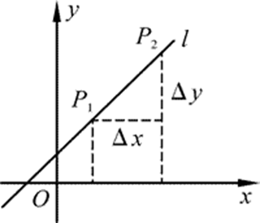

# 数据块接口

# 着色器子程序

## SPIR-V

# opengl 着色器数据传输

## 1. 着色器调数据传输方式

着色器的调用类似一个函数的调用，数据传输进来经过处理之后再传输出去。如下所示：

```
attribute vec4 position; 
attribute vec2 texCoord; 
uniform mat4 transformMatrix; 
varying vec2 texCoordVarying; 

void main() 
{ 
     gl_Position = position * transformMatrix; 
     texCoordVarying = texCoord; 
}
```

从上面的示例可以看出，每个着色器都是一个完整的c程序，它的输入点就是一个名为main() 的函数。但是与c不同的是，GLSL 的main() 没有任何参数，在某个着色阶段的输入、输出的所有数据都是通过着色器中的特殊全局变量来传递的。

## 2. 着色器变量

1）全局变量：着色曲所需的数据都是通过全局输入、输出变量来传输； 2）in 变量将数据拷贝到着色器中，out变量将着色器的内通拷贝出去；这些值需要在每次执行着色器的时候更新。比如处理的是顶点，则会为每个顶点传递新的值；处理的是片元，则为每个片元传递新的值。 3） uniform变量：直接从Opengl应用程序中接收数据。uniform变量不会随着顶点或者片元的变化而变化，它对于所有的几何图元的值都是一样的，除非应用程序对它进行了更新。

## 3. 变量

### 3.1 命名规则

GLSL是一种强类型语言，所有的变量都必须事先声明，并且要给出变量的类型。我们可以在使用之前的任何时候声明这些变量（这一点与c++一致，即变量声明需要放在一个代码块中靠前的语句里）。 变量名的命名规范和C语言相同：可以使用数字、字母、下划线字符（_）来组成变量的名字。但是只能用字母作为变量名字的第一个字符。并且变量名字不能包含连续的下划线（这些名称是GLSL保留使用的）。

### 3.2 变量的作用域

1）任何函数定义之外声明的变量拥有全局作用域，因此对着色器程序中的所有函数都是可见的； 2）在一组大括号之内（例如函数定义、虚幻或者if引领的代码块等）声明的变量，只能在大括号之内的范围内存在； 3）循环的迭代自变量，只能在循环体内起作用；

### 3.3 变量类型

#### 3.3.1 透明类型（基本数据类型）

其中uint-int,float-int uint,double-int uint float,这三组之间可以隐式转换，其他类型之间转换都会返回一个编译错误。向量与矩阵的元素都是可以单独访问和设置的，可以通过分量的名称或者数据下标方式进行访问。

|  类型  |            描述            | 2D向量 | 3D向量 | 4D向量 |                    矩阵类型                     |
| :----: | :------------------------: | :----: | :----: | :----: | :---------------------------------------------: |
| float  |      IEEE 32位浮点值       |  vec2  |  vec3  |  vec4  | mat2    mat3    mat4 mat2x2    mat2x3    mat2x4 |
| double |      IEEE 64位浮点值       | dvec2  | dvec3  | dvec4  |                                                 |
|  int   | 有符号二进制补码的32位整数 | ivec2  | ivec3  | ivec4  |                                                 |
|  uint  |      无符号的32位整数      | uvec2  | uvec3  | uvec4  |                                                 |
|  bool  |           布尔值           | bvec2  | bvec3  | bvec4  |                                                 |

向量分量的访问符

| 分量访问符 |       符号描述       |
| :--------- | :------------------: |
| (x,y,z,w)  |   与位置相关的分量   |
| (r,g,b,a)  |   与颜色相关的分量   |
| (s,t,p,q)  | 与纹理坐标相关的分量 |

比如： float red = color.r; float red = color[0];

#### 3.3.2 不透明类型

这些类型相当于定义一个不透明的句柄，用来读取纹理贴图、图像等数据。

| 类型           |    描述    |      |
| :------------- | :--------: | ---: |
| sampler        |   采样器   |      |
| image          |    图像    |      |
| atomic counter | 原子计数器 |      |

#### 3.3.3 存储限制符

| 类型修饰符 |                             描述                             |
| :--------- | :----------------------------------------------------------: |
| const      | 将一个变量定义为只读形式，如果它初始化时用的是一个编译时变量，那么它本身也会成为编译时常量 |
| in         |              设置这个变量为着色器阶段的输入变量              |
| out        |              设置这个变量为着色器阶段的输出变量              |
| uniform    | 设置这个变量为用户应用程序传递给着色器的数据，它对于给定的图元而言是一个常量 。在所有的着色阶段之间都是共享的，必须定义为全局变量。 除非我们重新链接着色器程序(glLinkProgram()),否则这里的返回值不会发生变化。GLSL编译器会在链接着色器程序时创建一个uniform变量列表，通过glGetUniformLocation()函数来获取在列表中的索引； |
| buffer     | 设置应用程序共享的一块可读写的内存。这块内存也作为着色器中的存储缓存(storage buffer)使用 |
| shared     | 设置变量是本地工作组(local work group) 中共享的。它只能用于计算着色器中 |

```
enum
{
    UNIFORM_Y,
    UNIFORM_UV,
    UNIFORM_COLOR_CONVERSION_MATRIX,
    UNIFORM_TRANSFORM_MATRIX,
    NUM_UNIFORMS
};
GLint uniforms[NUM_UNIFORMS];
glUniform1i(uniforms[UNIFORM_Y], 0);
uniforms[UNIFORM_Y] = glGetUniformLocation(self.shaderProgram, "SamplerY");
```

[opengl 着色器数据传输](https://www.jianshu.com/p/a62a69d5e9a1)

opengl buffer


# OpenGL 缓冲区对象 buffer object

缓冲区对象(buffer object)，允许应用程序地指定把哪些数据存储在图形服务器中。

VAO VBO EBO PBO 概述

VBO

> 顶点缓冲对象VBO是在显卡存储空间中开辟出的一块内存缓存区，用于存储顶点的各类属性信息，如顶点坐标，顶点法向量，顶点颜色数据等。在渲染时，可以直接从VBO中取出顶点的各类属性数据，由于VBO在显存而不是在内存中，不需要从CPU传输数据，处理效率更高。
>
> 所以可以理解为VBO就是显存中的一个存储区域，可以保持大量的顶点属性信息。并且可以开辟很多个VBO，每个VBO在OpenGL中有它的唯一标识ID，这个ID对应着具体的VBO的显存地址，通过这个ID可以对特定的VBO内的数据进行存取操作。

VAO

> VBO保存了一个模型的顶点属性信息，每次绘制模型之前需要绑定顶点的所有信息，当数据量很大时，重复这样的动作变得非常麻烦。VAO可以把这些所有的配置都存储在一个对象中，每次绘制模型时，只需要绑定这个VAO对象就可以了。
>
> VAO是一个保存了所有顶点数据属性的状态结合，它存储了顶点数据的格式以及顶点数据所需的VBO对象的引用。
>
> VAO本身并没有存储顶点的相关属性数据，这些信息是存储在VBO中的，VAO相当于是对很多个VBO的引用，把一些VBO组合在一起作为一个对象统一管理。

EBO

> 索引缓冲对象EBO相当于OpenGL中的顶点数组的概念，是为了解决同一个顶点多次重复调用的问题，可以减少内存空间浪费，提高执行效率。当需要使用重复的顶点时，通过顶点的位置索引来调用顶点，而不是对重复的顶点信息重复记录，重复调用。
>
> EBO中存储的内容就是顶点位置的索引indices，EBO跟VBO类似，也是在显存中的一块内存缓冲器，只不过EBO保存的是顶点的索引。

PBO

储存像素数据的缓冲区对象称为**Pixel Buffer Object (PBO)**。

------

# VBO

VBO是OpenGL提供的一种特性，主要是用于在非立即模式下（使用glBegin/glEnd这种方式）用来保存顶点数据（包括位置、纹理、颜色等），同时提供了更新这些数据的方法。 VBO相比较立即模式的渲染来说效率更高，这主要是因为VBO的数据一般会放在显存中而不是内存中。通俗点说VBO就好像是显卡中开辟的一块存储区域，用来把以前放在内存中的数据放在了显存中，便于更加方便的传输处理。 VBO特性是在OpenGL1.5版本引入的。

相关函数

| glGenBuffers    | 创建顶点缓冲区对象                                           |
| :-------------- | :----------------------------------------------------------- |
| glBindBuffer    | 将顶点缓冲区对象设置为当前数组缓冲区对象(array buffer object)或当前元素(索引）缓冲区对象(element buffer object) |
| glBufferData    | 为顶点缓冲区对象申请内存空间，并进行初始化(视传入的参数而定) |
| glBufferSubData | 初始化或更新顶点缓冲区对象                                   |
| glDeleteBuffers | 删除顶点缓冲区对象                                           |

## 创建缓冲区对象 Generate

```
void glGenBuffers(GLsizei n,GLuint *buffers);
```

> 在buffers数组中返回n个当前未使用的缓冲区对象标识。注意在buffers数组中返回的标识名称并不需要是连续的整数。0是一个保留的缓冲区对象名称，从来不会被glGenBuffers()作为缓冲区对象标识返回。

```
GLboolean glIsBuffer(GLuint buffer);
```

> 如果buffer是一个已经绑定的缓冲区对象的名称，而且还没有删除则返回GL_TRUE，否则返回GL_FALSE。

------

## 激活缓冲区对象 Bind

```
void glBindBuffer(GLenum target,GLuint buffer);
```

１. 当buffer是一个首次使用的非零无符号整数时，它就创建一个新的缓冲区对象，并把buffer分配给这个缓冲区对象，作为它的名称

２. 当绑定到一个以前创建的缓冲区对象时，这个缓冲区对象便成为活动的缓冲区对象

３. 当绑定到一个值为零的buffer时，OpenGL就会停止使用缓冲区对象

## 用数据分配和初始化缓冲区对象 Buffer Data

```
void glBufferData(GLenum target,GLsizeiptr size,const GLvoid *data,GLenum usage);
```

> **数据的读写模式**
>
> 流模式：缓冲区对象中的数据只被指定一次，并且使用这些数据的频率较低
>
> 静态模式：缓冲区对象的数据只指定一次，但是使用这些数据的频率很高
>
> 动态模式：缓冲区对象的数据不仅常常需要进行更新，而且使用频率也非常高
>
> 注意，如果请求分配的内存数量超过了服务器能够分配的内存，glBufferData()将返回GL_OUT_OF_MEMORY错误。如果usage并不是允许使用的值之一，则返回GL_INVALID_VALUE。

## 更新缓冲区对象的数据

**方法一、用提供的数据替换被绑定的缓冲区对象的一些数据子集**

```
void glBufferSubData(GLenum target,GLintptr ofsset,GLsizeiptr size,const GLvoid *data);
```

用data指向的数据更新与target相关联的当前绑定缓冲区对象中从offset(以字节为单位)开始的size个字节数据。target参数与glBufferData的target参数一致。

注意，如果size小于0或者size+offset大于缓冲区对象创建时所指定的大小，glBufferSubData()将产生一个GL_INVALID_VALUE错误。

方法二、选择绑定的缓冲区对象，然后根据需要来写入新值(或简单地读取数据，这取决于内存的访问权限)，就像对数组进行赋值一样

```
GLvoid * glMapBuffer(GLenum target,GLenum access);
```

返回一个指针，指向与target相关联的当前绑定缓冲区对象的数据存储。target参数与glBufferData的target参数一致。参数access必须是GL_READ_ONLY、GL_WRITE_ONLY或GL_READ_WRITE之一，表示客户可以对数据进行的操作。

注意，如果需要修改缓冲区中的大多数数据，这种方法很有用，但如果有一个很大的缓冲区并且只需要更新很小的一部分值，这种方法效率就很低。这时使用glMapBufferRange()效率更高。它允许只修改所需的范围内的数据值。

```
GLvoid * glMapBufferRange(GLenum target,GLintptr offset,GLsizeiptr length,GLbitfield access);
```

完成缓冲区对象的数据更新之后，可以调用glUnmapBuffer()取消对这个缓冲区的映射：

```
GLboolean glUnmapBuffer(GLenum target);
```

表示对当前绑定缓冲区对象的更新已经完成，并且这个缓冲区可以释放。

## 在缓冲区对象之间复制数据

**在OpenGL 3.1以前版本中，这个过程分两步：**

１. 把数据从缓冲区对象复制到应用程序的内存中。

２. 绑定到新的缓冲区对象，然后更新该缓冲区对象的数据。

**在OpenGL 3.1中**

glCopyBufferSubData()用于复制数据，而不需要迫使数据在应用程序的内存中做短暂停留。

```
void glCopyBufferSubData(GLenum readbuffer,GLenum writebuffer,GLintptr readoffset,GLintptr writeoffset,GLsizeiptr size);
复制代码
```

把数据从与readbuffer相关联的缓冲区对象复制到绑定到writebuffer的缓冲区对象。参数readbuffer和writebuffer与glBufferData的target参数一致。readoffset、writeoffset为偏移量，size为复制到数据的数量。

## 清除缓冲区对象

完成了对缓冲区对象的操作之后，可以释放它的资源，并使它的标识可以其他缓冲区对象使用。

```
void glDeleteBuffers(GLsizei n,const GLuint *buffers);
复制代码
```

删除n个缓冲区对象，它们的标识名称就是buffers数组的元素。

注意，如果试图删除不存在的缓冲区对象或标识为0的缓冲区对象，该操作将被忽略，并不会产生错误。

**示例：使用缓冲区对象存储顶点数组数据，并绘制**

```
#define BUFFER_OFFSET(bytes) ((GLubyte *)NULL+(bytes))
 
GLuint buffers[2];
 
GLfloat vertices[][3]={ //包含顶点数据
 
{-1.0, -1.0, -1.0},
 
{1.0, -1.0, -1.0},
 
{1.0, 1.0, -1.0},
 
{-1.0, 1.0, -1.0},
 
{-1.0, -1.0, 1.0},
 
{1.0, -1.0, 1.0},
 
{1.0, 1.0, 1.0},
 
{-1.0, 1.0, 1.0}
 
};
 
GLbyte indices[][4]={ //包含索引数据
 
{0,1,2,3},
 
{4,7,6,5},
 
{0,4,5,1},
 
{3,2,6,7},
 
{0,3,7,4},
 
{1,5,6,2}
 
};
 
glGenBuffers(2,buffers);                                                 //生成缓冲区对象标识符
 
glBindBuffer(GL_ARRAY_BUFFER,buffers[0]);                                //绑定顶点缓冲区对象
 
glBufferData(GL_ARRAY_BUFFER,sizeof(vertices), vertices,GL_STATIC_DRAW); //请求数据的存储空间并用指定数据进行初始化
 
glBindBuffer(GL_ELEMENT_ARRAY_BUFFER,buffers[1]);                        //绑定索引缓冲区对象
 
glBufferData(GL_ELEMENT_ARRAY_BUFFER,sizeof(indices), indices,GL_STATIC_DRAW);
 
glEnableClientState(GL_VERTEX_ARRAY);                                    //启用顶点数组
 
glVertexPointer(3,GL_FLOAT,0,BUFFER_OFFSET(0));                          //指定顶点数组数据
 
glDrawElements(GL_QUADS,24,GL_UNSIGNED_BYTE,BUFFER_OFFSET(0));           //根据索引绘图(注意：顶点数据和索引各自使用不同的缓冲区)
复制代码
```

若没有使用缓冲区对象，则上面这段代码传进的偏移量

```
glVertexPointer(3,GL_FLOAT,0,BUFFER_OFFSET(0)); 
 
glDrawElements(GL_QUADS,24,GL_UNSIGNED_BYTE,BUFFER_OFFSET(0)); 
复制代码
```

应该是这样改成实际的客户端数据指针

```
glVertexPointer(3,GL_FLOAT,0, vertices); 
 
glDrawElements(GL_QUADS,24, indices);
复制代码
```

使用缓冲区对象后，类似glVertexPointer()这种以指针为参数的OpenGL函数不再从指针所指位置取数据，函数会先把指针转化为整数，假设转化后的结果为k，则会从当前缓冲区的第k个字节开始取数据(NULL转化为整数后通常是0，即缓冲区最开始的位置)。

# VAO

VAO （ Vertex Array Object ）是OpenGL用来处理顶点数据的一个缓冲区对象，它不能单独使用，都是结合VBO来一起使用的。VAO是**OpenGL CoreProfile** 引入的一个特性。**事实上在CoreProfile中做顶点数据传入时，必须使用VAO方式。**

VAO对象中存储的内容包括： \1. VAO开启或者关闭的状态（`glEnableVertexAttribArray`和`glDisableVertexAttribArray`) \2. 使用`glVertexAttribPointer`对顶点属性进行的设置 \3. 存储顶点数据的VBO对象

VAO

**1.创建VAO**

创建VAO使用`glGenVertexArrays`参数与创建其他缓冲区对象的glGenBuffers类似

```
void glGenVertexArrays( GLsizei n,
    GLuint *arrays);12
```

**2.绑定并设置VAO**

在创建VAO之后，需要使用`glBindVertexArray`设置它为当前操作的VAO，之后我们所有关于顶点数据的设置（包括数据使用的VBO对象，顶点的属性设置的信息都会被存储在VAO之中），在设置完成之后一般会解绑VAO，然后在需要绘制的时候启用相应的VAO对象。具体的代码如下所示：

```
//创建VAO
GLuint VAO;
glGenVertexArrays(1, &VAO);
//设置当前VAO，之后所有操作(注意：这些操作必须是上文VAO中包含的内容所注明的调用，其他非VAO中存储的内容即使调用了也不会影响VAO）存储在该VAO中
glBindVertexArray(VAO);
   glBindBuffer(GL_ARRAY_BUFFER, VBO); //设置了VBO
   glBufferData(GL_ARRAY_BUFFER, sizeof(vertices), vertices, GL_STATIC_DRAW);//设置VBO中的数据
    glVertexAttribPointer(0, 3, GL_FLOAT, GL_FALSE, 3 * sizeof(GLfloat), (GLvoid*)0); //设置顶点属性（索引为0的属性，与shader中的内容有交互）
    glEnableVertexAttribArray(0); //设置开启顶点属性（索引为0的属性,与shader中的内容有交互）
glBindVertexArray(0); //解绑VAO（解绑主要是为了不影响后续VAO的设置，有点类似于C++中指针delete后置空，是个好习惯）12345678910
```

通过上面的代码就完成了对VAO的设置，当我们需要绘制的时候，使用的代码类似于：

```
glUseProgram(shaderProgram);
glBindVertexArray(VAO); //绑定我们需要的VAO，会导致上面所有VAO保存的设置自动设置完成
someOpenGLFunctionThatDrawsOurTriangle();   
glBindVertexArray(0);   //解绑VAO1234
```

另外需要注意的是，当我们使用EBO的时候，VAO中也会记录索引信息，因此完整的VAO所包含的内容图如下所示（添加了EBO）：

WholeVAO

# EBO

> 索引缓冲对象（Element Buffer Object，EBO）

索引缓冲对象EBO相当于OpenGL中的**顶点数组**的概念，是为了解决同一个顶点多次重复调用的问题，可以减少内存空间浪费，提高执行效率。**当需要使用重复的顶点时，通过顶点的位置索引来调用顶点，而不是对重复的顶点信息重复记录，重复调用。**

EBO中存储的内容就是**顶点位置的索引indices**，EBO跟VBO类似，也是在显存中的一块内存缓冲器，只不过EBO保存的是顶点的索引。

创建EBO并绑定，用glBufferData（以GL_ELEMENT_ARRAY_BUFFER为参数）把索引存储到EBO中：

```
GLuint EBO;  
glGenBuffers(1, &EBO);  
glBindBuffer(GL_ELEMENT_ARRAY_BUFFER, EBO);  
glBufferData(GL_ELEMENT_ARRAY_BUFFER, sizeof(indices), indices, GL_STATIC_DRAW);
```

当用EBO绑定顶点索引的方式绘制模型时，需要使用glDrawElements而不是glDrawArrays：

```
glDrawElements(GL_TRIANGLES, 6, GL_UNSIGNED_INT, 0);
```

- 第一个参数指定了要绘制的**模式**；
- 第二个参数指定要绘制的**顶点个数**；
- 第三个参数是**索引的数据类型**；
- 第四个参数是**可选的EBO中偏移量设定**。

------

# PBO

像素缓冲区对象 （PBO）

OpenGL ARB_pixel_buffer_object 扩展与ARB_vertex_buffer_object.很相似。为了缓冲区对象不仅能存储顶点数据，还能存储像素数据，它简单地扩展了 ARB_vertex_buffer_object extension。

储存像素数据的缓冲区对象称为**Pixel Buffer Object (PBO)**。

ARB_pixel_buffer_object extension借鉴了VBO所有的框架和API，而且还多了两个**"Target" 标签**。

这俩**Target**协助PBO储存管理器(OpenGL驱动)决定缓冲区对象的最佳位置：**系统内存、共享内存、显卡内存。**

 Target标志指明其上绑定的PBO的两种不同的用途：

 **GL_PIXEL_PACK_BUFFER_ARB ——传递像素数据到PBO中**

 **GL_PIXEL_UNPACK_BUFFER_ARB ——从PBO中传回数据。**

> 例如，glReadPixels()和glGetTexImage()是"pack"像素操作， glDrawPixels(), glTexImage2D() ，glTexSubImage2D() 是"unpack" 操作。
>
> 当一个PBO绑定的Target为GL_PIXEL_PACK_BUFFER_ARB时, glReadPixels()是从OpenGL的帧缓冲区（FBO）读取像素数据，并将数据写(pack)入PBO中。当一个PBO绑定的Target为GL_PIXEL_UNPACK_BUFFER_ARB时,glDrawPixels()是从PBO读取(unpack)像素数据并复制到OpenGL帧缓冲区（FBO）中。

**PBO的主要优点**是可以通过DMA (Direct Memory Access) 快速地在显卡上传递像素数据，而不影响CPU的时钟周期（中断）。另一个优势是它还具备异步DMA传输。让我们对比使用PBO前后的纹理传送方法。

左侧图是从图像文件或视频中加载纹理。首先，资源被加载到系统内存（Client）中，然后使用glTexImage2D()函数从系统内存复制到OpenGL纹理对象中(Client->Server)。这两次数据传输(加载和复制)完全由CPU执行。不使用PBO的纹理加载

Conventional texture loading

和上图相反，原图像可以直接加载到PBO中，而PBO是由OpenGL控制的。虽然CPU有参与加载纹理到PBO，但不涉及将像素数据从PBO传输到纹理对象的工作，而是由GPU(OpenGL驱动)来负责PBO到纹理对象的数据传输的，这也就意味着OpenGL执行DMA传输操作不会占用CPU的时钟周期。此外，OpenGL还可以安排稍后执行的异步DMA传输。所以glTexImage2D()可以立即返回，CPU也无需等待像素数据的传输了，可以继续其他工作。使用PBO的纹理加载

Texture loading with PBO

主要有两种优化像素数据传输性能的PBO方法：

[1.streaming texture update](http://www.songho.ca/opengl/gl_pbo.html#unpack)

[2.asynchronous read-back from the framebuffer.](http://www.songho.ca/opengl/gl_pbo.html#pack)

## 创建PBO

以前说到，Pixel Buffer Object使用VBO的所有API。不同的是多了两个针对PBO的额外标志：GL_PIXEL_PACK_BUFFER_ARB和GL_PIXEL_UNPACK_BUFFER_ARB. GL_PIXEL_PACK_BUFFER_ARB 从OpenGL传送像素数据到你的程序中， GL_PIXEL_UNPACK_BUFFER_ARB 将像素数据从程序传送到OpenGL中。OpenGL使用这些标志来决定PBO最佳的内存位置。例如，上传纹理数据到FBO(unpack)时，使用显卡内存。读帧缓冲区（FBO）时，使用系统内存。OpenGL 驱动会参照target标志来决定PBO所在的内存位置。

### 创建一个PBO需要三个步骤:

> 1. Generate a new buffer object with **glGenBuffers()**.
> 2. Bind the buffer object with **glBindBuffer()**.
> 3. Copy pixel data to the buffer object with **glBufferData()**.

1、使用`glGenBuffersARB()`新建一个缓冲区对象 2、使用`glBindBufferARB()`绑定一个缓冲区对象 3、使用`glBufferDataARB()`复制像素信息到缓冲区对象

**注：**

- 如果让glBufferDataARB的数据源数组接收的指针为空指针，那么PBO仅分配数据的大小的内存空间。
- glBufferDataARB方法最后一个参数对PBO具有指导作用，它告诉PBO如何使用些缓冲区对象。
- GL_STREAM_DRAW_ARB (unpack)是 streaming texture upload 。GL_STREAM_READ_ARB (pack)是异步的帧缓冲区read-back。

## PBO映射

PBO提供了一种内存映射机制，可以映射OpenGL控制的缓冲区对象到客户端的内存地址空间中。

客户端可以使用`glMapBufferARB()`, `glUnmapBufferARB()`函数修改全部或部分缓冲区对象。

```
void* glMapBufferARB(GLenum target, GLenum access)
GLboolean glUnmapBufferARB(GLenum target)
```

glMapBufferARB()返回一个指向缓冲区对象的指针，如果成功返回此指针，否则返回NULL。

Target参数是GL_PIXEL_PACK_BUFFER_ARB 或GL_PIXEL_UNPACK_BUFFER_ARB。

第二个参数，指定映射的缓冲区的访问方式：从PBO中读数据(GL_READ_ONLY_ARB)，写数据到PBO中(GL_WRITE_ONLY_ARB) 或读写PBO(GL_READ_WRITE_ARB)。

注意如果GPU仍使用此缓冲区对象，glMapBufferARB()不会返回，直到GPU完成了对相应缓冲区对象的操作。为了避免等待，在使用glMapBufferARB之前，使用glBufferDataARB，并传入参数NULL。然后，OpenGL将废弃旧的缓冲区，为缓冲区分配新的内存。

缓冲区对象必须取消映射,可使用glUnmapBufferARB()。如果成功，glUnmapBufferARB()返回GL_TRUE 否则返回GL_FALSE。

## 例子：两个PBO的Streaming texture上传

**源码下载:**[pboUnpack.zip](http://www.songho.ca/opengl/files/pboUnpack.zip).

这个例子使用PBO，上传(uppack)streaming textures到OpenGL texture object.你可以通过空格键切换不同的传送模式：单个PBO，两个PBOs ，无PBO)，并对比它们之间效率的差异。

在PBO模式下，每一帧都直接将源纹理写入映射的像素缓冲区（PBO）。然后，这些纹理数据使用glTexSubImage2D()函数，从PBO传送到纹理对象中。使用PBO，OpenGL可以在PBO和纹理对象之间执行异步DMA传输。这显著提高了纹理上传的性能。如果显卡支持异步的DMA操作，glTexSubImage2D()会立即返回。CPU无需等待纹理拷贝，便可以做其它事情

Streaming texture uploads with 2 PBOs

可以使用多个PBO来尽可能提升streaming传输性能。 图中表示同时使用两个PBO：glTexSubImage2D()从一个PBO中读取数据，同时将源纹理写入到另一个PBO当中。

第n帧，PBO1正被glTexSubImage2D()函数使用。而PBO2用于读取新的纹理。在第n+1帧时，2个PBO交换角色，并继续更新纹理。因为DMA传输的异步性，更新和复制可被同时执行。CPU将新纹理更新到一个PBO中，同时GPU从另一个PBO中复制纹理。

```
// "index" 用于从PBO中拷贝像素数据至texture object
// "nextIndex" 用于更新另一个PBO中的像素数据
index = (index + 1) % 2;
nextIndex = (index + 1) % 2;
 
// 绑定纹理
glBindTexture(GL_TEXTURE_2D, textureId);
// 绑定PBO
glBindBufferARB(GL_PIXEL_UNPACK_BUFFER_ARB, pboIds[index]);
// 从PBO中拷贝像素数据至texture object
// 使用offset替代ponter.glTexSubImage2D(GL_TEXTURE_2D, 0, 0, 0, WIDTH, HEIGHT,GL_BGRA, GL_UNSIGNED_BYTE, 0);
// 绑定另一个PBO，用texture source对它进行更新glBindBufferARB(GL_PIXEL_UNPACK_BUFFER_ARB, pboIds[nextIndex]);
// 注意：glMapBufferARB()会引起同步问题// 如果GPU正在使用这块buffer, glMapBufferARB()将会等待
// 直到GPU完成操作. 为了避免等待，你可以先调用
// glBufferDataARB() ，并传入NULL指针， 然后再调用glMapBufferARB()。
// 如果按照上面的方法调用的话, PBO之前存储的数据将会被丢弃，并且
// glMapBufferARB() 将会立即返回一个新分配的指针，
// 即使GPU仍然在使用之前的数据
glBufferDataARB(GL_PIXEL_UNPACK_BUFFER_ARB, DATA_SIZE, 0, GL_STREAM_DRAW_ARB);
// 映射buffer object（PBO）到客户端内存
GLubyte* ptr = (GLubyte*)glMapBufferARB(GL_PIXEL_UNPACK_BUFFER_ARB,GL_WRITE_ONLY_ARB);
if(ptr){ 
  // 直接更新映射的buffer 
  updatePixels(ptr, DATA_SIZE); 
  glUnmapBufferARB(GL_PIXEL_UNPACK_BUFFER_ARB); 
  // release the mapped buffer
}
// 在使用完PBO以后，通过ID 0 来释放PBO
// 一旦绑定到0，所有的像素操作都将被重置
glBindBufferARB(GL_PIXEL_UNPACK_BUFFER_ARB, 0);
```

## 例子：异步Read-back

这个例子从帧缓冲区(左侧图)读取像素数据到PBO中，之后在右侧窗体中画出来，并修改图像的亮度。你可以按空格键打开或关闭PBO，来测试glReadPixels()函数的性能差异。传统的glReadPixels()阻塞渲染管线，直到所有的像素传输完毕。然后，它把控制权交给程序。使用PBO的glReadPixels()可使用异步DMA传输，立即返回，无需等待。因此程序(CPU)可执行其它操作，当GPU传输数据时。

Asynchronous readback with 2 PBOs

此例子使用2个PBO。在第n帧时，程序使用glReadPixels()从OpenGL读取像素信息到PBO1中，在PBO2 中处理像素数据。读数据和处理数据是同时进行的。因为glReadPixels()在PBO1上立即返回，CPU可以在PBO2中处理数据而没有延迟。我们可以在每一帧中交换PBO1和PBO2。

```
// "index" 用于从FBO中读取像素到PBO
// "nextIndex" 用于更新另一个PBO中的像素
index = (index + 1) % 2;
nextIndex = (index + 1) % 2;
 
// 设置读取的目标framebuffer
glReadBuffer(GL_FRONT);
 
// 从FBO中读取像素至PBO
// glReadPixels()将会立刻返回
glBindBufferARB(GL_PIXEL_PACK_BUFFER_ARB, pboIds[index]);
glReadPixels(0, 0, WIDTH, HEIGHT, GL_BGRA, GL_UNSIGNED_BYTE, 0);
 
// 映射PBO到客户端，并通过CPU处理其数据
glBindBufferARB(GL_PIXEL_PACK_BUFFER_ARB, pboIds[nextIndex]);
GLubyte* ptr = (GLubyte*)glMapBufferARB(GL_PIXEL_PACK_BUFFER_ARB,
GL_READ_ONLY_ARB);
if(ptr)
{
  processPixels(ptr, ...);
  glUnmapBufferARB(GL_PIXEL_PACK_BUFFER_ARB);
}
 
// 重置PBO的像素操作
glBindBufferARB(GL_PIXEL_PACK_BUFFER_ARB, 0);
```

# FBO

OpenGL 默认把 framebuffer 当作渲染的目的地。它由窗口系统创建并管理。framebuffer Object 是个二维数组的集合，它包括 color buffers, depth buffer, stencil buffer。

OpenGL扩展，GL_ARB_framebuffer_object 提供了创建额外非可显示的 framebuffer object(FBO)的接口。FBO 称作应用程序可创建的 framebuffer 以区别默认的窗口系统提供的framebuffer。通过使用FBO，OpenGL 应用可以重定向渲染输出，让它输出到FBO而不是传统的窗口系统提供的 framebuffer.

与窗口系统提供的帧缓冲区类似，FBO包含一系列渲染目的地的集合；包括颜色，深度和模板缓冲区。 FBO中的这些逻辑缓冲区称为可附着的 frame buffer。

有两种类型的可附着的 framebuffer;纹理(Texture)和renderbuffer。如果纹理被附加到FBO，OpenGL将执行“渲染到纹理”。如果renderbuffer被附加到FBO，则OpenGL会执行“离屏渲染”。

顺便说一下，renderbuffer是在GL_ARB_framebuffer_object扩展中定义的一种新类型的存储对象。它在渲染过程中用作单个2D图像的渲染目的地。

下图显示了FBO，纹理和renderbuffer之间的连接。多个纹理对象或renderbuffer对象可以通过附着点附加到FBO上。

img

FBO中，

- 有多个颜色附加点（GL_COLOR_ATTACHMENT0，...，GL_COLOR_ATTACHMENTn），
- 一个深度附加点（GL_DEPTH_ATTACHMENT）
- 一个模板附加点（GL_STENCIL_ATTACHMENT）。

颜色附着点的数量取决于实现，但每个FBO必须至少具有一个颜色附加点。您可以使用GL_MAX_COLOR_ATTACHMENTS查询最大数量的颜色附加点，这些数据由显卡支持。

FBO具有多个颜色附加点的原因是允许在同一时间将颜色缓冲区渲染到多个目的地。这个“多个渲染目标”（MRT）可以由GL_ARB_draw_buffers扩展完成。请注意，FBO本身不存放数据，它只有多个附着点。这有点像数据结构中的指针，它只存放指针，而不存放数据。

FBO提供了一种高效的切换机制;从FBO中分离先前的帧缓冲区，并将一个新的可附着的帧缓冲图像附加到FBO中。切换可附着的帧缓冲图像比在FBO之间切换要快得多。 FBO提供glFramebufferTexture2D（）来切换2D纹理对象，并将glFramebufferRenderbuffer（）切换到renderbuffer对象。

## 创建FBO

**glGenFramebuffers()**

```
void glGenFramebuffers(GLsizei n, GLuint* ids)
void glDeleteFramebuffers(GLsizei n, const GLuint* ids)
```

glGenFramebuffers() 需要2个参数：

- 第一个是要创建的帧缓冲区的数量；
- 第二个参数是指向GLuint变量或数组以存储单个ID或多个ID的指针。
- 它返回未使用的framebuffer对象的ID。 ID 0表示默认的帧缓冲区，它是由窗口系统提供的帧缓冲区。
- 而，当FBO不再使用时，可以通过调用glDeleteFramebuffers()来删除。

**glBindFramebuffer()**

创建FBO之后，必须先绑定FBO。

```
void glBindFramebuffer(GLenum target, GLuint id)
```

- 第一个参数target为GL_FRAMEBUFFER;
- 第二个参数为framebuffer对象的ID。 FBO绑定后，所有的OpenGL操作都会影响到当前绑定的FBO。
- 对象ID，0保留给默认的窗口系统提供的帧缓冲区。因此，为了取消绑定当前帧缓冲区（FBO），请在glBindFramebuffer() 中使用ID 0。

## Renderbuffer

另外，renderBuffer对象是新引入的用于离屏渲染。它允许将场景直接渲染到renderbuffer对象，而不是渲染到纹理对象。

Renderbuffer只是一个包含可渲染内部格式的单个映像的数据存储对象。它用于存储没有相应纹理格式的OpenGL逻辑缓冲区，如模板或深度缓冲区。

**glGenRenderbuffers()**

```
void glGenRenderbuffers(GLsizei n, GLuint* ids)
void glDeleteRenderbuffers(GLsizei n, const Gluint* ids)
```

一旦创建了一个renderbuffer，它返回非零正整数。 ID 0为OpenGL保留。

**glBindRenderbuffer()**

```
void glBindRenderbuffer(GLenum target, GLuint id)
```

与其他OpenGL对象相同，您必须在引用之前绑定当前的renderbuffer对象。 renderbuffer对象的目标参数应为GL_RENDERBUFFER。

**glRenderbufferStorage()**

```
void glRenderbufferStorage(GLenum  target,
                           GLenum  internalFormat,
                           GLsizei width,
                           GLsizei height)
```

当创建一个renderbuffer对象时，它没有任何数据存储，所以我们必须为它分配一个内存空间。这可以通过使用glRenderbufferStorage()来完成。

- 第一个参数必须是GL_RENDERBUFFER;
- 第二个参数是可渲染颜色（GL_RGB，GL_RGBA等），可渲染深度（GL_DEPTH_COMPONENT）或可渲染模板（GL_STENCIL_INDEX）;
- width和height是以像素为单位的renderbuffer图像的尺寸。

宽度和高度应小于GL_MAX_RENDERBUFFER_SIZE，否则会生成GL_INVALID_VALUE错误。

**glGetRenderbufferParameteriv()**

```
void glGetRenderbufferParameteriv(GLenum target,
                                  GLenum param,
                                  GLint* value)
```

您还可以获取当前绑定的renderbuffer对象的各种参数。

- 目标应该是GL_RENDERBUFFER;
- 第二个参数是参数的名称;
- 最后一个是指向整数变量的指针，用于存储返回的值。

renderbuffer参数的可用名称为：

```
GL_RENDERBUFFER_WIDTH
GL_RENDERBUFFER_HEIGHT
GL_RENDERBUFFER_INTERNAL_FORMAT
GL_RENDERBUFFER_RED_SIZE
GL_RENDERBUFFER_GREEN_SIZE
GL_RENDERBUFFER_BLUE_SIZE
GL_RENDERBUFFER_ALPHA_SIZE
GL_RENDERBUFFER_DEPTH_SIZE
GL_RENDERBUFFER_STENCIL_SIZE
```

## 将图像附加到FBO

FBO本身不存放作何数据。相反，我们必须在FBO上附加可附加的framebuffer图像（纹理或renderbuffer对象）。该机制允许FBO快速切换（拆除和附加）FBO中的可附着的帧缓冲图像。切换可附加的帧缓冲区比在FBO之间切换要快得多。并且，它可以节省不必要的数据副本和内存消耗。例如，纹理可以附加到多个FBO，并且其图像可以由多个FBO共享。

**将2D纹理图像附加到FBO**

```
glFramebufferTexture2D(GLenum target,
                       GLenum attachmentPoint,
                       GLenum textureTarget,
                       GLuint textureId,
                       GLint  level)
```

glFramebufferTexture2D()是将2D纹理图像附加到FBO。

- 第一个参数必须是GL_FRAMEBUFFER;
- 第二个参数是连接纹理图像的连接点。 FBO具有多个颜色附加点（GL_COLOR_ATTACHMENT0，...，GL_COLOR_ATTACHMENTn），GL_DEPTH_ATTACHMENT和GL_STENCIL_ATTACHMENT;
- 第三个参数“textureTarget”在大多数情况下是GL_TEXTURE_2D;
- 第四个参数是纹理对象的标识符;
- 最后一个参数是要附加的纹理的mipmap级别。

如果textureId参数设置为0，则纹理图像将从FBO中分离。如果纹理对象被删除时仍然附着在FBO上，则纹理图像将自动从当前绑定的FBO中分离。但是，如果它附加到多个FBO并被删除，那么它将仅从绑定的FBO分离，但不会与任何其他无约束的FBO分离。

**附加到Renderbuffer图像到FBO**

```
void glFramebufferRenderbuffer(GLenum target,
                               GLenum attachmentPoint,
                               GLenum renderbufferTarget,
                               GLuint renderbufferId)
```

可以通过调用glFramebufferRenderbuffer()来附加renderbuffer。

- 第一和第二个参数与glFramebufferTexture2D()相同;
- 第三个参数必须是GL_RENDERBUFFER;
- 最后一个参数是renderbuffer对象的ID。

如果renderbufferId参数设置为0，则renderbuffer图像将从FBO中的附加点分离。如果renderbuffer对象被删除时，仍然附着在FBO上，那么它将自动从绑定的FBO中分离出来。但是，它不会与任何其他无约束的FBO分离。

## 检查FBO状态

一旦可连接的图像（纹理和renderbuffer）附加到FBO，并且在执行FBO操作之前，必须使用glCheckFramebufferStatus()验证FBO状态是否完整。如果FBO未完成，则任何绘图和读取命令（glBegin（），glCopyTexImage2D（）等）将失败。

```
GLenum glCheckFramebufferStatus(GLenum target)
```

glCheckFramebufferStatus()验证当前绑定的FBO上的所有附加图像和帧缓冲区参数。而且，这个函数不能在glBegin（）/ glEnd（）对中调用。目标参数应为GL_FRAMEBUFFER。在检查FBO后返回非零值。如果满足所有要求和规则，则返回GL_FRAMEBUFFER_COMPLETE。否则，它返回一个相关的错误值，它告诉什么规则被违反。

FBO完整性规则为：

- framebuffer可附加图像的宽度和高度必须不为零。
- 如果图像附加到颜色附着点，则图像必须具有可呈现颜色的内部格式。 （GL_RGBA，GL_DEPTH_COMPONENT，GL_LUMINANCE等）
- 如果图像附加到GL_DEPTH_ATTACHMENT，则图像必须具有深度可渲染内部格式。 （GL_DEPTH_COMPONENT，GL_DEPTH_COMPONENT24等）
- 如果图像附加到GL_STENCIL_ATTACHMENT，则图像必须具有模板可渲染内部格式。 （GL_STENCIL_INDEX，GL_STENCIL_INDEX8等）
- FBO必须至少安装一张图片。
- 附加FBO的所有图像必须具有相同的宽度和高度。
- 附加颜色附件点的所有图像必须具有相同的内部格式。

请注意，即使满足上述所有条件，OpenGL驱动程序也可能不支持某些内部格式和参数的组合。如果OpenGL驱动程序不支持特定的实现，那么glCheckFramebufferStatus()返回GL_FRAMEBUFFER_UNSUPPORTED。

## 例子

有时，需要动态生成动态纹理。最常见的示例是生成镜像/反射效果，动态多维数据集/环境映射和阴影贴图。动态纹理可以通过将场景渲染到纹理来实现。渲染到纹理的一种传统方法是像一般的draw缓冲区，然后使用glCopyTexSubImage2D（）将framebuffer图像复制到纹理。

使用FBO，我们可以将场景直接渲染到纹理，所以我们不必使用窗口系统提供的帧缓存。更进一步，我们可以消除额外的数据拷贝（从帧缓存到纹理）。

使用FBO还有另一个优势。在传统情况下，如果纹理分辨率大于渲染窗口的大小，则窗口区域中的区域将被剪切。然而，FBO并不受这类问题的影响。您可以创建一个大于显示窗口的framebuffer-renderable图像。

以下代码是在渲染循环开始之前设置FBO和可附加的可帧缓冲图像。请注意，不仅纹理图像附加到FBO，而且renderBuffer图像也附加到FBO的深度附着点上。我们实际上并没有使用这种深度缓冲区，但是FBO本身需要深度测试。如果我们不将此可渲染深度图像附加到FBO，则由于缺少深度测试，渲染输出将被损坏。如果在FBO渲染期间也需要模板测试，则附加的渲染缓存图像应附加到GL_STENCIL_ATTACHMENT。

```
...
// create a texture object
GLuint textureId;
glGenTextures(1, &textureId);
glBindTexture(GL_TEXTURE_2D, textureId);
glTexParameteri(GL_TEXTURE_2D, GL_TEXTURE_MAG_FILTER, GL_LINEAR);
glTexParameteri(GL_TEXTURE_2D, GL_TEXTURE_MIN_FILTER, GL_LINEAR_MIPMAP_LINEAR);
glTexParameteri(GL_TEXTURE_2D, GL_TEXTURE_WRAP_S, GL_CLAMP_TO_EDGE);
glTexParameteri(GL_TEXTURE_2D, GL_TEXTURE_WRAP_T, GL_CLAMP_TO_EDGE);
glTexParameteri(GL_TEXTURE_2D, GL_GENERATE_MIPMAP, GL_TRUE); // automatic mipmap
glTexImage2D(GL_TEXTURE_2D, 0, GL_RGBA8, TEXTURE_WIDTH, TEXTURE_HEIGHT, 0,
             GL_RGBA, GL_UNSIGNED_BYTE, 0);
glBindTexture(GL_TEXTURE_2D, 0);

// create a renderbuffer object to store depth info
GLuint rboId;
glGenRenderbuffers(1, &rboId);
glBindRenderbuffer(GL_RENDERBUFFER, rboId);
glRenderbufferStorage(GL_RENDERBUFFER, GL_DEPTH_COMPONENT,
                      TEXTURE_WIDTH, TEXTURE_HEIGHT);
glBindRenderbuffer(GL_RENDERBUFFER, 0);

// create a framebuffer object
GLuint fboId;
glGenFramebuffers(1, &fboId);
glBindFramebuffer(GL_FRAMEBUFFER, fboId);

// attach the texture to FBO color attachment point
glFramebufferTexture2D(GL_FRAMEBUFFER,        // 1. fbo target: GL_FRAMEBUFFER 
                       GL_COLOR_ATTACHMENT0,  // 2. attachment point
                       GL_TEXTURE_2D,         // 3. tex target: GL_TEXTURE_2D
                       textureId,             // 4. tex ID
                       0);                    // 5. mipmap level: 0(base)

// attach the renderbuffer to depth attachment point
glFramebufferRenderbuffer(GL_FRAMEBUFFER,      // 1. fbo target: GL_FRAMEBUFFER
                          GL_DEPTH_ATTACHMENT, // 2. attachment point
                          GL_RENDERBUFFER,     // 3. rbo target: GL_RENDERBUFFER
                          rboId);              // 4. rbo ID

// check FBO status
GLenum status = glCheckFramebufferStatus(GL_FRAMEBUFFER);
if(status != GL_FRAMEBUFFER_COMPLETE)
    fboUsed = false;

// switch back to window-system-provided framebuffer
glBindFramebuffer(GL_FRAMEBUFFER, 0);
...
```

渲染到纹理的渲染过程与普通绘图几乎相同。我们只需要将渲染目的地从窗口系统提供的framebuffer切换到FBO即可。

```
...
// set rendering destination to FBO
glBindFramebuffer(GL_FRAMEBUFFER, fboId);

// clear buffers
glClear(GL_COLOR_BUFFER_BIT | GL_DEPTH_BUFFER_BIT);

// draw a scene to a texture directly
draw();

// unbind FBO
glBindFramebuffer(GL_FRAMEBUFFER, 0);

// trigger mipmaps generation explicitly
// NOTE: If GL_GENERATE_MIPMAP is set to GL_TRUE, then glCopyTexSubImage2D()
// triggers mipmap generation automatically. However, the texture attached
// onto a FBO should generate mipmaps manually via glGenerateMipmap().
glBindTexture(GL_TEXTURE_2D, textureId);
glGenerateMipmap(GL_TEXTURE_2D);
glBindTexture(GL_TEXTURE_2D, 0);
...
```

请注意，glGenerateMipmap()也作为FBO扩展的一部分包含，以便在修改基本级别的纹理图像之后显式生成mipmap。如果GL_GENERATE_MIPMAP设置为GL_TRUE，则glTex {Sub} Image2D()和glCopyTex {Sub} Image2D()触发自动mipmap生成（在OpenGL 1.4或更高版本中）。但是，由于FBO不调用glCopyTex {Sub} Image2D（）来修改纹理，因此FBO操作不会自动生成基本层次的纹理。因此，必须显式地调用glGenerateMipmap（）来生成mipmap。

另外，如果您需要对纹理进行后处理，则可以与像素缓冲区对象（PBO）组合，以有效地修改纹理。

# Demo

//TODO

------

# 站内链接

# 相关链接

[OpenGL 缓冲区对象（*BO）](https://juejin.im/post/5d27056351882562e16010ee#heading-5)

[如何正确理解 opengl 的 vao ？](https://www.zhihu.com/question/30095978)

[VAO 与 VBO 的前世今生](http://www.photoneray.com/opengl-vao-vbo/)

[OpenGL顶点数据传输速度优化](https://blog.csdn.net/you_lan_hai/article/details/50994121)

[OpenGL图形渲染管线、VBO、VAO、EBO概念及用例](https://blog.csdn.net/dcrmg/article/details/53556664)

[pbo](http://www.songho.ca/opengl/gl_pbo.html)

[fbo](http://www.songho.ca/opengl/gl_fbo.html)

[OpenGL 之 FBO--视频美颜的基础](https://www.jianshu.com/p/c16c7e7cdf91)

[https://www.jianshu.com/p/c16c7e7cdf91](https://blog.csdn.net/xiajun07061225/article/details/7283929)

[帧缓冲](https://learnopengl-cn.readthedocs.io/zh/latest/04 Advanced OpenGL/05 Framebuffers/)

[Framebuffer Object](https://www.khronos.org/opengl/wiki/Framebuffer_Object)


# Latex 公式


求和 积分

- 行内公式与行间公式
- 数学结构的输入
- 数学符号的输入
- 多行公式排版

### 1.显示方法

- 嵌入文字显示：`$...$` eg: `$\sum^n_{i=1}x^i=1$` ==> ∑i=1nxi=1
- 单行显示： `$$...$$` eg: `$ $\sum^n_{i=1}x^i=1$ $` ==>∑i=1nxi=1
- 带序号显示：`\begin{equation}...\end{equation}` eg: `\begin{equation}\sum^n_{i=1}x^i=1\end{equation}` ==>(1)∑i=1nxi=1`\begin{equation}\x+y=z\end{equation}` ==>(2)x+y=z

### 2.通用显示规则

- `^` => 上标
- `_` => 下标
- `{}` => 包括
- `~` => 空格
- `\` => 转移符号

### 3.增强型显示规则

- 求根 eg: `$\sqrt{x+y}$`==> x+y eg: `$\sqrt[3]{x+y}$`==> x+y3
- 分数形式 eg: `$\frac{a+1}{b+2}$` ==> a+1b+2 eg: `${a+1}\over{b+2}$` ==> a+1b+2
- 求和 eg: `$\sum$`==> ∑
- 求积 eg: `$\prod^n_{i=1}i+1=1$` ==> ∏i=1ni+1=1
- 求积分 eg: `$\int x+1$` ==> ∫x+1
- 求积分 eg: `$\iint x+1$` ==> ∬x+1
- 并集 eg: `$A\bigcup B$` ==> A⋃B
- 并集 eg: `$A\cup B$` ==> A∪B
- 交集 eg: `$A\cap B$` ==> A∩B
- 交集 eg: `$A\bigcap B$` ==> A⋂B
- 箭头 eg: `$A\to B$` ==> A→B
- eg: `$\lim_{0\to 100}$` ==> lim0→100
- eg: `$\ln_{0\to 100}$` ==> ln0→100
- eg: `$\sin x$` ==> sin⁡x
- eg: `$\cos x$` ==> cos⁡x
- 8m空格
- 4m空格
- 乘号 eg: `$a \times b$`=a×b
- 除号 eg: `$a\div b$`=a÷b
- {} 花括号显示 eg: `$\\{ hello \\}$` ==> {hello} *注意：在这里我测试的Sublime Text3编写输出的结果， 如果在其他MarkDown编辑器可能要使用单反斜杠*
- 小括号增强 eg: `$\left( hello\right)$` ==> (hello)
- 中括号增强 eg: `$\left[hello\right]$` ==> [hello]
- 绝对值增强 eg: `$\left|hello\right|$` ==> |hello|
- 尖括号 eg: `$\langle hello\rangle$` ==> ⟨hello⟩
- 向上取整 eg: `$\lceil hello\rceil$` ==> ⌈hello⌉
- 向下取整 eg: `$\lfloor hllo\rfloor$` ==> ⌊hllo⌋

### 4.数学符号表一

| 符号 | 显示方法         | 符号 | 显示方法           | 符号 | 显示方法        |
| :--- | :--------------- | :--- | :----------------- | :--- | :-------------- |
| ±    | `\pm`            | ∓    | `\mp`              | ×    | `\times`        |
| ÷    | `\div`           | ∗    | `\ast`             | ⋆    | `\star`         |
| ∘    | `\circ`          | ∙    | `\bullet`          | ⋅    | `\cdot`         |
| ⊕    | `\oplus`         | ⊘    | `\oslash`          | †    | `\dagger`       |
| +    | `+`              | −    | `-`                | ∩    | `\cap`          |
| ∪    | `\cup`           | ‡    | `\ddagger`         | ⋄    | `\diamond`      |
| ⊎    | `\uplus`         | ⊓    | `\sqcap`           | ⊔    | `\sqcup`        |
| ∨    | `\vee`           | ∧    | `\wedge`           | ∖    | `\setminus`     |
| ≀    | `\wr`            | ⊖    | `\ominus`          | ⊙    | `\odot`         |
| △    | `\bigtriangleup` | ▽    | `\bigtriangledown` | ◃    | `\triangleleft` |
| ▹    | `\triangleright` | ⊲    | `\lhd`             | ⊳    | `\rhd`          |
| ⊴    | `\unlhd`         | ⊵    | `\unrhd`           | ⊗    | `\otimes`       |
| ◯    | `\bigcirc`       | ⨿    | `\amalg`           | ∑    | `\sum`          |
| ∏    | `\prod`          | ∐    | `\coprod`          | ∫    | `\int`          |
| ∮    | `\oint`          | ⋂    | `\bigcap`          | ⋃    | `\bigcup`       |
| ⨆    | `\bigsqcup`      | ⋁    | `\bigvee`          | ⋀    | `\bigwedge`     |
| ⨀    | `\bigodot`       | ⨂    | `\bigotimes`       | ⨁    | `\bigoplus`     |
| ⨄    | `\biguplus`      | ≤    | `\leq`             | ≥    | `\geq`          |
| ≡    | `\equiv`         | ≺    | `\prec`            | ≻    | `\cucc`         |
| ∼    | `\sim`           | ⪯    | `\preceq`          | ⪰    | `\succeq`       |
| ≃    | `\simeq`         | ≪    | `\ll`              | ≫    | `\gg`           |
| ≍    | `\asymp`         | ⊂    | `\subset`          | ⊃    | `\supset`       |
| ≈    | `\approx`        | ⊆    | `\subseteq`        | ⊇    | `\subseteq`     |
| ≅    | `\cong`          | ⊏    | `\sqsubset`        | ⊐    | `\sqsupset`     |
| ≠    | `\neq`           | ⊑    | `\sqsubseteq`      | ⊒    | `\sqsupseteq`   |
| ≐    | `\doteq`         | ∈    | `\in`              | ∋    | `\ni`           |
| ∉    | `\notin`         | ⊢    | `\vdash`           | ⊣    | `\dashv`        |
| :    | `:`              | ⊨    | `\models`          | ⊥    | `\perp`         |
| ∣    | `\mid`           | ∥    | `\parallel`        | ⋈    | `\bowtie`       |
| ⋈    | `\Join`          | ⌣    | `\smile`           | ⌢    | `\frown`        |
| ∝    | `\propto`        | <    | `<`                | >    | `>`             |

### 5.数学符号表二

| 符号   | 显示方法  | 符号    | 显示方法  | 符号    | 显示方法  |
| :----- | :-------- | :------ | :-------- | :------ | :-------- |
| arccos | `\arccos` | arcsin  | `\arcsin` | arctan  | `\arctan` |
| arg    | `\arg`    | cos     | `\cos`    | cosh    | `\cosh`   |
| cot    | `\cot`    | coth    | `\coth`   | csc     | `\csc`    |
| deg    | `\deg`    | det     | `\det`    | dim     | `\dim`    |
| exp    | `\exp`    | gcd     | `\gcd`    | hom     | `\hom`    |
| inf    | `\inf`    | ker     | `\ker`    | lg      | `\lg`     |
| lim    | `\lim`    | lim inf | `\liminf` | lim sup | `\limsup` |
| ln     | `\ln`     | log     | `\log`    | max     | `\max`    |
| min    | `\min`    | Pr      | `\pr`     | sec     | `\sec`    |
| sin    | `\sin`    | sinh    | `\sinh`   | sup     | `\sup`    |
| tan    | `\tan`    | tanh    | `\tanh`   | ——      | ——        |

### 5.箭头符号表

| 符号 | 显示方法              | 符号 | 显示方法            | 符号 | 显示方法              |
| :--- | :-------------------- | :--- | :------------------ | :--- | :-------------------- |
| ←    | `\leftarrow`          | ⟵    | `\longleftarrow`    | ⇐    | `\Leftarrow`          |
| ⟸    | `\Longleftarrow`      | →    | `\rightarrow`       | ⟶    | `\longrightarrow`     |
| ⇒    | `\Rightarrow`         | ⟹    | `\Longrightarrow`   | ↔    | `\leftrightarrow`     |
| ⟷    | `\longleftrightarrow` | ⇔    | `\Leftrightarrow`   | ⟺    | `\Longleftrightarrow` |
| ↦    | `\mapsto`             | ⟼    | `\longmapsto`       | ↩    | `\hookleftarrow`      |
| ↪    | `\hookrightarrow`     | ↼    | `\leftharpoonup`    | ⇀    | `\rightharpoonup`     |
| ↽    | `\leftharpoondown`    | ⇁    | `\rightharpoondown` | ⇌    | `\rightleftharpoons`  |
| ⇝    | `\leadsto`            | ↑    | `\uparrow`          | ↓    | `\downarrow`          |
| ⇑    | `\Uparrow`            | ⇓    | `\Downarrow`        | ↕    | `\updownarrow`        |
| ⇕    | `\Updownarrow`        | ↖    | `\nwarrow`          | ↗    | `\nearrow`            |
| ↙    | `\swarrow`            | ↘    | `\searrow`          | ——   | ——                    |

### 6.特殊符号表

| 符号 | 显示方法     | 符号 | 显示方法     | 符号  | 显示方法       |
| :--- | :----------- | :--- | :----------- | :---- | :------------- |
| §§   | `\S`         | ℵ    | `\aleph`     | LATEX | `\LaTeX`       |
| …    | `\ldots`     | ⋱    | `\ddots`     | ⋯     | `\cdots`       |
| ⋮    | `\vdots`     | ı    | `\imath`     | ȷ     | `\jmath`       |
| ℓ    | `\ell`       | ℘    | `\wp`        | ℜ     | `\Re`          |
| ℑ    | `\Im`        | ◊    | `\Diamond`   | ♢     | `\diamondsuit` |
| ′    | `\prime`     | ∅    | `\emptyset`  | ∇     | `\nabla`       |
| √    | `\surd`      | ⊤    | `\top`       | ⊥     | `\bot`         |
| ∖    | `\backslash` | ∂    | `\partial`   | ∞     | `\infty`       |
| △    | `\triangle`  | ♡    | `\heartsuit` | Ⓢ     | `\circledS`    |
| ℏ    | `\hbar`      | ∀    | `\forall`    | ∃     | `\exists`      |
| ¬    | `\neg`       | ♭    | `\flat`      | ♮     | `\natural`     |
| ♯    | `\sharp`     | ∠    | `\angle`     | ℧     | `\mho`         |
| ◻    | `\Box`       | ♣    | `\clubsuits` | ♠     | `\spadesuit`   |

### 7.希腊字母(Greek Letters)显示表

| 拉丁字母 | 小写显示方法 | 大写显示方法 | 大写字母 |
| :------- | :----------- | :----------- | :------- |
| α        | `\alpha`     | ——           | ——       |
| β        | `\beta`      | ——           | ——       |
| γ        | `\gamma`     | `\Gamma`     | Γ        |
| δ        | `\delta`     | `\Delta`     | Δ        |
| ϵ        | `\epsilon`   | ——           | ——       |
| ζ        | `\zeta`      | ——           | ——       |
| η        | `\eta`       | ——           | ——       |
| θ        | `\theta`     | `\Theta`     | Θ        |
| ι        | `\iota`      | ——           | ——       |
| κ        | `\kappa`     | ——           | ——       |
| λ        | `\lambda`    | `\lambda`    | λ        |
| μ        | `\mu`        | ——           | ——       |
| ν        | `\nu`        | ——           | ——       |
| ξ        | `\xi`        | `\Xi`        | Ξ        |
| ο        | `\omicron`   | ——           | ——       |
| π        | `\pi`        | `\Pi`        | Π        |
| ρ        | `\rho`       | ——           | ——       |
| σ        | `\sigma`     | `\Sigma`     | Σ        |
| τ        | `\tau`       | ——           | ——       |
| υ        | `\upsilon`   | `\Upsilon`   | Υ        |
| ϕ        | `\phi`       | `\Phi`       | Φ        |
| χ        | `\chi`       | ——           | ——       |
| ψ        | `\psi`       | `\Psi`       | Ψ        |
| ω        | `\omega`     | `\Omega`     | Ω        |

*注意：将小写字母的首字母大写表示为大写拉丁字母*

# 相关链接

https://lixingcong.github.io/2016/04/04/LaTex-intro/

[LaTeX 第五课：数学公式排版](https://zhuanlan.zhihu.com/p/24502400)

[LaTex 公式语法示例](https://www.jianshu.com/p/0d442af1541e)

[Latex数学公式表](https://blog.csdn.net/u011826404/article/details/70215074)

[MarkDown 插入数学公式实验大集合](https://juejin.im/post/5a6721bd518825733201c4a2#heading-17)

https://lixingcong.github.io/2016/04/04/LaTex-intro/

https://xjay.net/201902/latex-syntax-for-math-equation/

http://www.mohu.org/info/lshort-cn.pdf

http://mohu.org/info/symbols/symbols.htm

https://www.luogu.com.cn/blog/IowaBattleship/latex-gong-shi-tai-quan | LaTeX数学公式大全 - Iowa_BattleShip 的博客 - 洛谷博客 http://mohu.org/info/symbols/symbols.htm | mohu.org/info/symbols/symbols.htm http://www.mohu.org/info/lshort-cn.pdf | lshort-cn.pdf https://xjay.net/201902/latex-syntax-for-math-equation/ | LaTeX 数学公式语法 | Vault 101 https://lixingcong.github.io/2016/04/04/LaTex-intro/ | LaTex数学公式语法 | Lixingcong https://www.jianshu.com/p/0d442af1541e | LaTex 公式语法示例 - 简书 https://blog.csdn.net/u011826404/article/details/70215074 | Latex数学公式表_网络_VAY-长跑-CSDN博客 https://juejin.im/post/5a6721bd518825733201c4a2#heading-17 | MarkDown 插入数学公式实验大集合 - 掘金 https://www.cnblogs.com/houkai/p/3399646.html | LATEX数学公式基本语法 - 侯凯 - 博客园 https://pandoc.herokuapp.com/ | Markx https://hands133.github.io/2018/06/11/hexo-%E4%B8%AD%E6%B8%B2%E6%9F%93-LaTeX-%E6%95%B0%E5%AD%A6%E5%85%AC%E5%BC%8F/ | hexo 中渲染 LaTeX 数学公式 | 十兽鉴 (Mason)

https://www.jianshu.com/p/d7c4cf8dc62d

https://www.jianshu.com/p/9bf16599e220


https://www.jianshu.com/p/97ec8a3739f6


# 计算机视觉资源汇总(一)

模式识别和机器学习：

《Pattern Classification 》，第二版，Duda著，模式识别的奠基之作，但对SVM、Boosting几乎没提，有挂一漏万之嫌。 《Pattern Recognition and Machine Learning》,Bishop著，侧重概率模型，详细介绍了Bayesian方法、有向图、无向图理论等，体系完备。 《Kernel Methods for Pattern Analysis》,John Shawe-Taylor著，SVM等统计学的诸多工具里都用到了核方法，可以将将低维非线性空间映射到高维的线性空间中，但同时会引入高维数据的难题。 《Computer Vision: A Modern Approach》，第二版，Forsyth著，一本不错的计算机视觉教材，全书理论联系实际，并加入了计算机视觉领域的最新研究成果。 《Computer Vision: Algorithms and Applications》,Richard Szeliski的大作，《数字图像处理》课程老师推荐的一本书籍，这本书我还没有看完，书中对计算机视觉领域最新的一些算法进行了汇编，包括图像分割，特征检测和匹配，运动检测，图像缝合，3D重建，对象识别等图像处理的诸多方面，借助本书我们可以对最新主流图像处理算法有个全局把握。 《Image Processing, Analysis and Machine Vision》 Sonka 《Multiple View Geometry in Computer Vision》 第二版Harley等著，引用达一万多次的经典书籍。第二版到处都有电子版的。第一版曾出过中文版的，网上也可以找到电子版。

线性代数：

《Linear Algebra and Its Applications》Fourth Edition, Gilbert Strang的著作，本书详细介绍了向量空间、线性变换、本征值和本征向量等线性代数的重要基本概念，把抽象的线性空间形象地表达出来，适合初学者。

《Introduction to Probability Models》第10版，Ross著，一本书能够发行到第十版，你说是不是很经典呢？

离散数学：

《Discrete Mathematics and Its Applications》，第六版，Rosen著，本书囊括了离散数学推导、组合分析、算法及其应用、计算理论等多方面的内容，适合初学者。

矩阵数学：

《Matrix Analysis》,Horn著,本书无疑是矩阵论领域的经典著作了，风行几十年了。

概率论与数理统计：

《All Of Statistics》,Wasserman著，一本数理统计的简介读本。

《Introductionto Mathematical Statistics》，第六版，Hogg著，本书介绍了概率统计的基本概念以及各种分布，以及ML，Bayesian方法等内容。

《Statistical Learning Theory》Vapnik的大作，统计学界的权威，本书将理论上升到了哲学层面，他的另一本书《The Nature ofStatistical Learning Theory》也是统计学习研究不可多得的好书，但是这两本书都比较深入，适合有一定基础的读者。

《统计学习方法》，李航著，国内很多大学都在用这本书，本书从具体问题入手，由浅入深，简明地介绍了统计学习的主要方法，适合初学者而又想对统计学习理论有一个全局理解的学生。

《The Elements of Statistical Learning-Data Mining, Inference, and Prediction》,第二版，Trevor Hastie著，机器学习方面非常优秀的一本书，较PC和PRML,此书更加深入，对工程人员的价值也许更大一点。

《AnIntroduction to Probabilistic Graphical Models》,Jordan著，本书介绍了条件独立、分解、混合、条件混合等图模型中的基本概念，对隐变量（潜在变量）也做了详细介绍，相信大家在隐马尔科夫链和用Gaussian混合模型来实现EM算法时遇到过这个概念。

《Probabilistic Graphical Models-Principles and Techniques》，Koller著，一本很厚很全面的书，理论性很强，可以作为参考书使用。

最优化方法：

《Convex Optimization》，Boyd的经典书籍，被引用次数超过14000次，面向实际应用，并且有配套代码，是一本不可多得的好书，网址http://www.stanford.edu/~boyd/cvxbook/。

《Numerical Optimization》，第二版，Nocedal著，非常适合非数值专业的学生和工程师参考，算法流程清晰详细，原理清楚。

另外推荐几个博客和网站：

1. https://www.coursera.org/ 这是一个由世界顶级大学联合创办的网上在线视频公开课网站，里面有stanford, MIT, CMU等计算机科学一流大学提供的免费教学课程。
2. http://blog.pluskid.org/ 这是浙大学生张驰原的博客网站，现在他去了MIT，博客里面的很多资源都值得一看，博文的很大一部分都是关于机器学习的，加入了作者自己的理解，深入浅出。
3. http://blog.csdn.net/ffeng271/article/details/7164498 林达华推荐的基本数学书，转自MIT大牛博客。
4. http://blog.csdn.net/abcjennifer/ 张睿卿的博客，浙大的硕士，现在应该是去百度了，写的东西很细致
5. http://blog.csdn.net/zouxy09?viewmode=contents 甘苦人生，上面cv的资源挺多，写了100多篇博客
6. http://blog.csdn.net/sangni007/article/category/1106976 小熊不去实验室，东西很多，范围也很广
7. http://blog.csdn.net/carson2005/article/details/6601109 计算机视觉小鸟，一些常用的算法讲的挺清楚

# CPP笔记-new

 发表于 2020-04-07  分类于 [C++](https://ta-mei.gitee.io/blog/categories/C/) ， [C++笔记](https://ta-mei.gitee.io/blog/categories/C/C-笔记/)  Valine： [0](https://ta-mei.gitee.io/blog/2020/04/07/CPP笔记-new/#valine-comments)

# C++ new

# new 表达式

## 语法

```
::(可选) new (布置参数)(可选) ( 类型 ) 初始化器(可选)	(1)	
::(可选) new (布置参数)(可选) 类型 初始化器(可选)		(2)
```

1. 尝试创建类型标识 类型 所指代的类型的一个对象，它可以是数组类型，可以包含占位符类型说明符 (C++11 起)，或包含将由类模板实参推导推出的类模板名 (C++17 起)。
2. 同上，但 **类型** 不能包含括号：

demo

```
new int(*[10])(); // 错误：分析成 (new int) (*[10]) ()
new (int (*[10])()); // OK：分配 10 个函数指针的数组
new int + 1; // OK：分析成 (new int) + 1，增加 new int 所返回的指针
new int * 1; // 错误：分析成 (new int*) (1)
auto p = new auto('c');          // 创建单个 char 类型的对象。p 是一个 char*
double* p = new double[]{1,2,3}; // 创建 double[3] 类型的数组
throwing (1)	 void* operator new[] (std::size_t size);
nothrow (2)	
void* operator new[] (std::size_t size, const std::nothrow_t& nothrow_value) noexcept;
placement (3)	
void* operator new[] (std::size_t size, void* ptr) noexcept;
```

## operator new

## placement new

# new 用法示例

new int; //开辟一个存放整数的存储空间，返回一个指向该存储空间的地址(即指针) 　　 new int(100); //开辟一个存放整数的空间，并指定该整数的初值为100，返回一个指向该存储空间的地址 new char[10]; //开辟一个存放字符数组(包括10个元素)的空间，返回首元素的地址 　　 new int[5][4]; //开辟一个存放二维整型数组(大小为5*4)的空间，返回首元素的地址 　　 float* p=new float (3.14159); //开辟一个存放单精度数的空间，并指定该实数的初值为//3.14159，将返回的该空间的地址赋给指针变量p 　　

# new 加括号和不加括号

1. 加括号调用没有参数的构造函数，不加括号调用默认构造函数或唯一的构造函数，看需求
2. **C++在new时的初始化的规律可能为：对于有构造函数的类，不论有没有括号，都用构造函数进行初始化；如果没有构造函数，则不加括号的new只分配内存空间，不进行内存的初始化，而加了括号的new会在分配内存的同时初始化为0。**

由此可见，C++在new时的初始化的规律可能为：对于有构造函数的类，不论有没有括号，都用构造函数进行初始化；如果没有构造函数，则不加括号的new只分配内存空间，不进行内存的初始化，而加了括号的new会在分配内存的同时初始化为0。

# C++：在构造函数中使用new时应该注意的事项

- 如果在构造函数中使用了new初始化指针对象，那么应该在析构函数中使用delete释放对象。
- new和delete必须相互兼容，new对应于delete，new[]对应于delete[]。
- 如果有多个构造函数，则必须以相同的方式使用new。然而，可以在一个构造函数中使用new初始化指针，而在另一个构造函数中将其初始化为空(0、NULL、nullptr)，因为delete可以用于空指针。
- 应该定义一个复制构造函数，通过深度复制将一个对象初始化为另一个对象。具体地说，复制构造函数应该分配足够的内存空间来复制数据，而不仅仅是数据的地址。另外还应该更新所有受影响的静态成员。
- 应当定义一个赋值运算符，通过深度复制将一个对象复制给另一个对象。具体地说，该方法应该完成这样的操作：检查自我赋值情况，释放成员指针以前指向的内存(赋值运算符可以在类的生命周期任何时刻被调用，不仅仅是初始化)，复制数据而不仅仅是数据的地址。

**复制构造函数：**

- 分配足够空间存储复制的数据
- 复制数据，不仅仅地址
- 更新受到影响的静态类成员

**赋值构造函数:**

- 检查自我复制情况
- 释放成员指针之前指向内存
- 复制数据不仅仅地址
- 返回一个指向调用对象的引用

# 如果new 一个对象，用free去释放，会有什么问题？

[cpppreference](https://zh.cppreference.com/w/cpp/language/new)

[C++中的new用法总结](https://www.cnblogs.com/lustar/p/10717502.html)

[c++中，new的用法](https://blog.csdn.net/qq_40618238/article/details/80217960?depth_1-utm_source=distribute.pc_relevant.none-task-blog-BlogCommendFromBaidu-1&utm_source=distribute.pc_relevant.none-task-blog-BlogCommendFromBaidu-1)

[c++中new的三种用法详细解析](https://blog.csdn.net/zccracker/article/details/42741297)

[http://www.cplusplus.com/reference/new/operator%20new[]/](http://www.cplusplus.com/reference/new/operator new[]/)

[C++中malloc/free与new/delete的区别与联系](https://blog.csdn.net/u010510020/article/details/76266505)

# 直线的数学表示

### 直线的笛卡尔斜率截距方程

y=mx+b

### 给定两个端点(x0,y0),(x1,y1)可计算斜率m和截距b

m=y1−y0x1−x0b=y−mx=y1−mx1=x0y1−x1y0x1−x0

直线的增量方程，在x方向上，给定任意增量Δx，那么对应的在y方向上的增量为Δy ，即



# DDA算法

> 数值微分DDA(Digital Differential Analyzer)算法

- DDA算法是一种线段扫描转换算法（线段光栅化算法），它是在一个坐标轴上以单位间隔对线条取样，从而确定另一坐标轴上最靠近线段路径的对应整数值。

- 首先考虑斜率值m在（0, 1）之间的直线。

- 直线的图形定义为：

   起点、终点分别为(x0,y0),(x1,y1)

## DDA 算法思想

yi+1=mxi+1+b=mxi+b+mΔx=yi+mΔx

当Δx=1时, yi+1=yi+m

- 即：当x每递增1，y递增m（即直线斜率）
- 注意上述分析算法仅适用于|m|≤1的情形。在这种情况下，x每增加1，y最多增加1。
- 当|m|≤1 时，必须把x，y的位置互换，y每增加1，x相应的增加1/m。

**增量算法:** 在一个迭代算法中，如果每一步的x、y值是用前一步的值加上一个增量来获得，则称为增量算法。DDA算法就是一个增量算法。

**DDA算法的缺点：**在此算法中，y、m必须是float，且每一步都必须对y进行舍入取整，不利于硬件实现。

------

# Bresenham算法

- Bresenham算法是Bresenham提出的一种精确且有效的光栅生成算法。
- 它可用于显示线、圆和其它曲线的整数运算算法。
- 目前最有效的线段生成算法。


给定两个点起点P1(x1, y1), P2(x2, y2),如何画它们直连的直线，即是如何得到上图所示的蓝色的点。假设直线的斜率00,直线在第一象限，Bresenham算法的过程如下： 1.画起点(x1, y1). 2.准备画下一个点，X坐标加1，判断如果达到终点，则完成。否则找下一个点，由图可知要画的点要么为当前点的右邻接点，要么是当前点的右上邻接点。 　　2.1.如果线段ax+by+c=0与x=x1+1的交点y坐标大于(y+*y+1))/2则选右上那个点 　　2.2.否则选右下那个点。 3.画点 4.跳回第2步 5.结束

## 中点画线法

# 代码

## DDA

```
#include <GL/GLUT.H>
#include <iostream>
#include <math.h>

//数值微分法
using namespace std;
 
float xs = 0.0;
float ys = 0.0;
float xe = 0.0;
float ye = 0.0;
 
void LineDDA(int x0, int y0, int x1, int y1)
{
	float x = 0.0;
	float y = 0.0;
	float m = 0.0;
	float dx = x1 - x0;
	float dy = y1 - y0;
	if (dx != 0)
	{
		m = dy / dx;
		if (m <= 1 && m >= -1)
		{
			y = y0;
			for (x = x0; x <= x1; x++)
			{
				glVertex2i(x, int(y + 0.5));
				y += m;
			}
		}
		if (m>1 || m<-1)
		{
			m = 1 / m;
			x = x0;
			for (y = y0; y <= y1; y++)
			{
				glVertex2i(int(x + 0.5), y);
				x += m;
			}
		}
	}
	else
	{
		int x = x0;
		int y = 0;
		y = (y0 <= y1) ? y0 : y1;
		int d = fabs((double)(y0 - y1));
		while (d >= 0)
		{
			glVertex2i(x, y);
			y++;
			d--;
		}
	}
}
 
void lineSegment()
{
	glClear(GL_COLOR_BUFFER_BIT);
	glColor3f(0.0, 0.0, 0.0);
	glBegin(GL_POINTS);
	LineDDA(xs, ys, xe, ye);
	glEnd();
	glFlush();
}
 
int main(int argc, char *argv[])
{
	glutInit(&argc, argv);
	glutInitDisplayMode(GLUT_RGB | GLUT_SINGLE);
	cout << "输入线段起始和终点坐标（范围为 0 - 500, 0-500，空格隔开四个数）:";
	cin >> xs >> ys >> xe >> ye;
	glutInitWindowPosition(50, 100);
	glutInitWindowSize(500, 500);
	glutCreateWindow("DDA");
	glClearColor(1.0, 1.0, 1.0, 1.0);
	glMatrixMode(GL_PROJECTION);
	gluOrtho2D(0.0, 500, 0.0, 500.0);
	glutDisplayFunc(lineSegment);
	glutMainLoop();C++
 
	return 0;
}
```

## Bresenham画圆算法

```
#include<stdlib.h>
#include <GL/glut.h>
 
/* initialization: */
void myinit(void)
{
 
	/* attributes */
 
	glClearColor(1.0, 1.0, 1.0, 0.0); /* white background */
	glColor3f(1.0, 0.0, 0.0); /* draw in red */
 
	/* set up viewing: */
	/* 500 x 500 window with origin lower left */
 
	glMatrixMode(GL_PROJECTION);
	glLoadIdentity();
	gluOrtho2D(0.0, 500.0, 0.0, 500.0);
	glMatrixMode(GL_MODELVIEW);
}
void  plot_circle_points(int xc, int yc, int x, int y)
{
	glBegin(GL_POINTS);
	glVertex3f(xc + x, yc + y, 0);
	glVertex3f(xc - x, yc + y, 0);
	glVertex3f(xc + x, yc - y, 0);
	glVertex3f(xc - x, yc - y, 0);
	glVertex3f(xc + y, yc + x, 0);
	glVertex3f(xc - y, yc + x, 0);
	glVertex3f(xc + y, yc - x, 0);
	glVertex3f(xc - y, yc - x, 0);
	glEnd();
}
void drawcircle(int xc, int yc, int radius)
{
	int x, y, p;
	x = 0;
	y = radius;
	p = 3 - 2 * radius;
	glClear(GL_COLOR_BUFFER_BIT);
	glBegin(GL_POINTS);
	while (x<y)
	{
		plot_circle_points(xc, yc, x, y);
		if (p<0)
			p = p + 4 * x + 6;
		else
		{
			p = p + 4 * (x - y) + 10;
			y -= 1;
		}
		x += 1;
	}
	if (x == y)
		plot_circle_points(xc, yc, x, y);
}
 
 
/* the display callback: */
void display(void)
{
	glClear(GL_COLOR_BUFFER_BIT);  /*clear the window */
 
	/*----------------------------------------*/
	/*  viewport stuff                        */
	/*----------------------------------------*/
	/* set up a viewport in the screen window */
	/* args to glViewport are left, bottom, width, height */
	glViewport(0, 0, 500, 500);
	/* NB: default viewport has same coords as in myinit, */
	/* so this could be omitted: */
 
 
	drawcircle(200, 200, 100);
 
	/* and flush that buffer to the screen */
	glFlush();
}
 
int main(int argc, char** argv)
{
 
	/* Standard GLUT initialization */
 
	glutInit(&argc, argv);
	glutInitDisplayMode(GLUT_SINGLE | GLUT_RGB); /* default, not needed */
	glutInitWindowSize(500, 500); /* 500 x 500 pixel window */
	glutInitWindowPosition(0, 0); /* place window top left on display */
	glutCreateWindow("Bresenham  circile"); /* window title */
	glutDisplayFunc(display); /* display callback invoked when window opened */
	myinit(); /* set attributes */
	glutMainLoop(); /* enter event loop */
}
```


# OpenGL-GLSL语言基础

# 基础语法

**注释**

> 单行注释：// 多行注释：/* */

**变量命名**

GLSL的变量命名方式与C语言类似。变量的名称可以使用字母，数字以及下划线，但变量名不能以数字开头，还有变量名不能以gl_作为前缀，这个是GLSL保留的前缀，用于GLSL的内部变量。当然还有一些GLSL保留的名称是不能够作为变量的名称的。

# 基本类型

**1、基本数据类型**

|   类型    |                             描述                             |
| :-------: | :----------------------------------------------------------: |
| **void**  | 跟 **C** 语言的 **void** 类似，表示空类型。作为函数的返回类型，表示这个函数不返回值。 |
| **bool**  | **布尔类型**，**true** 或 **false**，以及可以产生布尔型的表达式。 |
|  **int**  |                        **有符号整型**                        |
| **uint**  |                        **无符号整形**                        |
| **float** |                          **浮点型**                          |

**2、特殊类型--纹理采样类型**

|        类型         |                             描述                             |
| :-----------------: | :----------------------------------------------------------: |
|    **sampler1D**    | 用于内建的纹理函数中引用指定的 **1D纹理的句柄**。只可以作为一致变量或者函数参数使用 |
|    **sampler2D**    |                       **二维纹理句柄**                       |
|    **sampler3D**    |                       **三维纹理句柄**                       |
|   **samplerCube**   |                    **cube map 纹理句柄**                     |
| **sampler1DShadow** |                     **一维深度纹理句柄**                     |
| **sampler2DShadow** |                     **二维深度纹理句柄**                     |

**3、聚合类型（向量和矩阵类型）**

**（1）向量类型**

|       类型        |               描述                |
| :---------------: | :-------------------------------: |
|  vec2,vec3,vec4   |    2分量、3分量和4分量浮点向量    |
| ivec2,ivec3,ivec4 |    2分量、3分量和4分量整数向量    |
| uvec2,uvec3,uvec4 | 2分量、3分量和4分量无符号整数向量 |
| bvec2,vbec3,bvec4 |    2分量、3分量和4分量布尔向量    |

 **A、向量声明--4分量的float 类型向量**

```
vec4 V1;
```

 **B、声明向量并对其进行构造**

```
vec4 V2 = vec4(1,2,3,4);
```

 **C、向量运算**

```
vec4 v;
vec4 vOldPos = vec4(1,2,3,4);
vec4 vOffset = vec4(1,2,3,4);
//注意：接下来假设所有参与运算的变量已定义并赋值。
v = vOldPos + vOffset;
v = vNewPos;
v += vec4(10,10,10,10);
v = vOldPos * vOffset;
v *= 5;
```

 **D、向量元素的获取（成分选择）**

向量中单独的成分可以通过 **{x,y,z,w}, {r,g,b,a}** 或者 **{s,t,p,q}** 的记法来表示。这些不同的记法用于 **顶点**，**颜色**，**纹理坐标**。在成分选择中，你不可以混合使用这些记法。其中 **{s,t,p,q}** 中的 **p** 替换了**纹理**的 **r** 坐标，因为与颜色 **r** 重复了。下面是用法举例： 例如有向量 **v1** 和 **v2**:

```
vec3 v1 = {0.5, 0.35, 0.7};
vec4 v2 = {0.1, 0.2, 0.3, 0.4};
```

可以通过 **{x,y,z,w}, {r,g,b,a}** 或者 **{s,t,p,q}** 来取出向量中的元素值。 通过 **x,y,z,w**：

```
v2.x = 3.0f;
v2.xy = vec2(3.0f,4.0f);
v2.xyz = vec3(3,0f,4,0f,5.0f);
```

通过 **r,g,b,a**：

```
v2.r = 3.0f;
v2.rgba = vec4(1.0f,1.0f,1.0f,1.0f);
```

通过 **s,t,q,r**：

```
v2.stqr = vec2(1.0f, 0.0f, 0.0f, 1.0f);
```

错误示例：

```
float myQ = v1.q;// 出错，数组越界访问，q代表第四个元素
float myRY = v1.ry; // 不合法，混合使用记法
```

向量还支持一次性对所有分量操作

```
v1.x = v2.x +5.0f; 
v1.y = v2.y +4.0f; 
v1.z = v2.z +3.0f;
v1.xyz = v2.xyz + vec3(5.0f,4.0f,3.0f);
```

------

**（2）矩阵类型**

|      类型      |                     描述                     |
| :------------: | :------------------------------------------: |
| mat2 或 mat2x2 |             2x2的浮点数矩阵类型              |
| mat3 或 mat3x3 |             3x3的浮点数矩阵类型              |
| mat4 或 mat4x4 |             4x4的浮点数矩阵类型              |
|     mat2x3     | 2列3行的浮点矩阵（OpenGL的矩阵是列主顺序的） |
|     mat2x4     |               2列4行的浮点矩阵               |
|     mat3x2     |               3列2行的浮点矩阵               |
|     mat3x4     |               3列4行的浮点矩阵               |
|     mat4x2     |               4列2行的浮点矩阵               |
|     mat4x3     |               4列3行的浮点矩阵               |

**创建矩阵：**

```
mat4 m1,m2,m3;
```

**构造单元矩阵：**

```
mat4 m2 = mat4(1.0f,0.0f,0.0f,0.0f
                    0.0f,1.0f,0.0f,0.0f,
                    0.0f,0.0f,1.0f,0.0f,
                    0.0f,0.0f,0.0f,1.0f);
```

**或者**

```
mat4 m4 = mat4(1.0f);
```

## 结构体

结构体可以组合基本类型和数组来形成用户自定义的类型。在定义一个结构体的同时，你可以定义一个结构体实例。或者后面再定义。

```
struct fogStruct {
 vec4 color;
 float start;
 float end;
 vec3 points[3]; // 固定大小的数组是合法的
} fogVar;
```

可以通过 **=** 为结构体赋值，或者使用 **==，!=** 来判断两个结构体是否相等。

```
fogVar = fogStruct(vec4(1.0,0.0,0.0,1.0),0.5,2.0);
vec4 color = fogVar.color;
float start = fogVar.start;
```

## 数组

**`GLSL`** 中只可以使用一维的数组。数组的类型可以是一切基本类型或者结构体。下面的几种数组声明是合法的：

```
float floatArray[4];
vec4 vecArray[2];
float a[4] = float[](1.0,2.0,3.0,4.0);
vec2 c[2] = vec2[2](vec2(1.0,2.0),vec2(3.0,4.0));
```

数组类型内建了一个`length()`函数，可以返回数组的长度。

```
lightPositions.length() // 返回数组的长度
```

## 类型转换

**glsl可以使用构造函数进行显式类型转换,各值如下:**

```
bool t= true;
bool f = false;

int a = int(t); //true转换为1或1.0
int a1 = int(f);//false转换为0或0.0

float b = float(t);
float b1 = float(f);

bool c = bool(0);//0或0.0转换为false
bool c1 = bool(1);//非0转换为true

bool d = bool(0.0);
bool d1 = bool(1.0);
```

**glsl中,没有隐式类型转换,原则上glsl要求任何表达式左右两侧(l-value),(r-value)的类型必须一致 也就是说以下表达式都是错误的:**

```
int a =2.0; //错误,r-value为float 而 lvalue 为int.
int a =1.0+2;
float a =2;
float a =2.0+1;
bool a = 0; 
vec3 a = vec3(1.0, 2.0, 3.0) * 2;
```

------

## 精度限定

glsl在进行光栅化着色的时候,会产生大量的浮点数运算,这些运算可能是当前设备所不能承受的,所以glsl提供了3种浮点数精度,我们可以根据不同的设备来使用合适的精度.

在变量前面加上 `highp` `mediump` `lowp` 即可完成对该变量的精度声明.

```
lowp float color;
varying mediump vec2 Coord;
lowp ivec2 foo(lowp mat3);
highp mat4 m;
```

我们一般在片元着色器(fragment shader)最开始的地方加上 `precision mediump float;` 便设定了默认的精度.这样所有没有显式表明精度的变量 都会按照设定好的默认精度来处理.

**如何确定精度:**

变量的精度首先是由精度限定符决定的,如果没有精度限定符,则要寻找其右侧表达式中,已经确定精度的变量,一旦找到,那么整个表达式都将在该精度下运行.如果找到多个, 则选择精度较高的那种,如果一个都找不到,则使用默认或更大的精度类型.

```
uniform highp float h1;
highp float h2 = 2.3 * 4.7; //运算过程和结果都 是高精度
mediump float m;
m = 3.7 * h1 * h2; //运算过程 是高精度
h2 = m * h1; //运算过程 是高精度
m = h2 – h1; //运算过程 是高精度
h2 = m + m; //运算过程和结果都 是中等精度
void f(highp float p); // 形参 p 是高精度
f(3.3); //传入的 3.3是高精度
```

**invariant关键字:**

由于shader在编译时会进行一些内部优化,可能会导致同样的运算在不同shader里结果不一定精确相等.这会引起一些问题,尤其是vertx shader向fragmeng shader传值的时候. 所以我们需要使用`invariant` 关键字来显式要求计算结果必须精确一致. 当然我们也可使用 `#pragma STDGL invariant(all)`来命令所有输出变量必须精确一致, 但这样会限制编译器优化程度,降低性能.

```
#pragma STDGL invariant(all) //所有输出变量为 invariant
invariant varying texCoord; //varying在传递数据的时候声明为invariant
```

**限定符的顺序:**

当需要用到多个限定符的时候要遵循以下顺序:

1.在一般变量中: invariant > storage > precision

2.在参数中: storage > parameter > precision

我们来举例说明:

```
invariant varying lowp float color; // invariant > storage > precision

void doubleSize(const in lowp float s){ //storage > parameter > precision
    float s1=s;
}
```

# 修饰符

**1、变量存储限定符**

|        限定符        |                             描述                             |
| :------------------: | :----------------------------------------------------------: |
|                      | （默认的可省略）只是普通的本地变量，可读可写，外部不可见，外部不可访问 |
|      **const**       |        常量值必须在声明时初始化，它是只读的不可修改的        |
|     **varying**      | 顶点着色器的输出，主要负责在 **vertex** 和 **fragment** 之间传递变量。例如颜色或者纹理坐标，（插值后的数据）作为片段着色器的只读输入数据。必须是全局范围声明的全局变量。可以是浮点数类型的标量，向量，矩阵。不能是数组或者结构体。 |
|     **uniform**      | 一致变量。在着色器执行期间一致变量的值是不变的。与 **const** 常量不同的是，这个值在编译时期是未知的是由着色器外部初始化的。一致变量在顶点着色器和片段着色器之间是共享的。它也只能在全局范围进行声明。 |
|    **attribute**     | 表示只读的顶点数据，只用在顶点着色器中。数据来自当前的顶点状态或者顶点数组。它必须是全局范围声明的，不能再函数内部。一个 **attribute** 可以是浮点数类型的标量，向量，或者矩阵。不可以是数组或则结构体 |
| **centorid varying** | 在没有多重采样的情况下，与 **varying** 是一样的意思。在多重采样时，**centorid varying** 在光栅化的图形内部进行求值而不是在片段中心的固定位置求值。 |
|    **invariant**     | （不变量）用于表示顶点着色器的输出和任何匹配片段着色器的输入，在不同的着色器中计算产生的值必须是一致的。所有的数据流和控制流，写入一个 **invariant** 变量的是一致的。编译器为了保证结果是完全一致的，需要放弃那些可能会导致不一致值的潜在的优化。除非必要，不要使用这个修饰符。在多通道渲染中避免 **z-fighting** 可能会使用到。 |

**2、函数参数限定符**

**`GLSL`** 允许自定义函数，但参数默认是以值形式（**`in`** 限定符）传入的，也就是说任何变量在传入时都会被拷贝一份，若想以引用方式传参，需要增加函数参数限定符。

|  限定符   |                             描述                             |
| :-------: | :----------------------------------------------------------: |
|  **in**   | 用在函数的参数中，表示这个参数是输入的，在函数中改变这个值，并不会影响对调用的函数产生副作用。（相当于C语言的传值），这个是函数参数默认的修饰符 |
|  **out**  |    用在函数的参数中，表示该参数是输出参数，值是会改变的。    |
| **inout** |    用在函数的参数，表示这个参数即是输入参数也是输出参数。    |

其中使用 **inout** 方式传递的参数便与其他 **OOP** 语言中的引用传递类似，参数可读写，函数内对参数的修改会影响到传入参数本身。 **eg：**

```
vec4 getPosition(out vec4 p){ 
    p = vec4(0.,0.,0.,1.);
    return v4;
}

void doubleSize(inout float size){
    size= size * 3.0  ;
}
```

# 内置变量

内置变量可以与固定函数功能进行交互。在使用前不需要声明。

**顶点着色器可用的内置变量**

| 名称                   | 类型  | 描述                                                         |
| :--------------------- | :---- | :----------------------------------------------------------- |
| gl_Color               | vec4  | 输入属性-表示顶点的主颜色                                    |
| gl_SecondaryColor      | vec4  | 输入属性-表示顶点的辅助颜色                                  |
| gl_Normal              | vec3  | 输入属性-表示顶点的法线值                                    |
| gl_Vertex              | vec4  | 输入属性-表示物体空间的顶点位置                              |
| gl_MultiTexCoordn      | vec4  | 输入属性-表示顶点的第n个纹理的坐标                           |
| gl_FogCoord            | float | 输入属性-表示顶点的雾坐标                                    |
| gl_Position            | vec4  | 输出属性-变换后的顶点的位置，用于后面的固定的裁剪等操作。所有的顶点着色器都必须写这个值。 |
| gl_ClipVertex          | vec4  | 输出坐标，用于用户裁剪平面的裁剪                             |
| gl_PointSize           | float | 点的大小                                                     |
| gl_FrontColor          | vec4  | 正面的主颜色的varying输出                                    |
| gl_BackColor           | vec4  | 背面主颜色的varying输出                                      |
| gl_FrontSecondaryColor | vec4  | 正面的辅助颜色的varying输出                                  |
| gl_BackSecondaryColor  | vec4  | 背面的辅助颜色的varying输出                                  |
| gl_TexCoord[]          | vec4  | 纹理坐标的数组varying输出                                    |
| gl_FogFragCoord        | float | 雾坐标的varying输出                                          |

**片段着色器的内置变量**

| 名称              | 类型  | 描述                                                         |
| :---------------- | :---- | :----------------------------------------------------------- |
| gl_Color          | vec4  | 包含主颜色的插值只读输入                                     |
| gl_SecondaryColor | vec4  | 包含辅助颜色的插值只读输入                                   |
| gl_TexCoord[]     | vec4  | 包含纹理坐标数组的插值只读输入                               |
| gl_FogFragCoord   | float | 包含雾坐标的插值只读输入                                     |
| gl_FragCoord      | vec4  | 只读输入，窗口的x,y,z和1/w                                   |
| gl_FrontFacing    | bool  | 只读输入，如果是窗口正面图元的一部分，则这个值为true         |
| gl_PointCoord     | vec2  | 点精灵的二维空间坐标范围在(0.0, 0.0)到(1.0, 1.0)之间，仅用于点图元和点精灵开启的情况下。 |
| gl_FragData[]     | vec4  | 使用glDrawBuffers输出的数据数组。不能与gl_FragColor结合使用。 |
| gl_FragColor      | vec4  | 输出的颜色用于随后的像素操作                                 |
| gl_FragDepth      | float | 输出的深度用于随后的像素操作，如果这个值没有被写，则使用固定功能管线的深度值代替 |

# 表达式

**运算符**

| 优先级(越小越高) | 运算符        | 说明                                                         | 结合性 |
| :--------------- | :------------ | :----------------------------------------------------------- | :----- |
| 1                | ()            | 聚组:a*(b+c)                                                 | N/A    |
| 2                | [] () . ++ -- | 数组下标__[],方法参数__fun(arg1,arg2,arg3),属性访问**a.b**,自增/减后缀**a++ a--** | L - R  |
| 3                | ++ -- + - !   | 自增/减前缀**++a --a**,正负号(一般正号不写)a ,-a,取反**!false** | R - L  |
| 4                | * /           | 乘除数学运算                                                 | L - R  |
| 5                | + -           | 加减数学运算                                                 | L - R  |
| 7                | < > <= >=     | 关系运算符                                                   | L - R  |
| 8                | == !=         | 相等性运算符                                                 | L - R  |
| 12               | &&            | 逻辑与                                                       | L - R  |
| 13               | ^^            | 逻辑排他或(用处基本等于!=)                                   | L - R  |
| 14               | II            | 逻辑或                                                       | L - R  |
| 15               | **? :**       | 三目运算符                                                   | L - R  |
| 16               | = += -= *= /= | 赋值与复合赋值                                               | L - R  |
| 17               | ,             | 顺序分配运算                                                 | L - R  |

ps 左值与右值:

```
左值:表示一个储存位置,可以是变量,也可以是表达式,但表达式最后的结果必须是一个储存位置.

右值:表示一个值, 可以是一个变量或者表达式再或者纯粹的值.

操作符的优先级：决定含有多个操作符的表达式的求值顺序，每个操作的优先级不同.

操作符的结合性：决定相同优先级的操作符是从左到右计算，还是从右到左计算。
```

**操作符**

GLSL语言的操作符与C语言相似。如下表（操作符的优先级从高到低排列）

| 操作符         | 描述                                                 |
| :------------- | :--------------------------------------------------- |
| ()             | 用于表达式组合，函数调用，构造                       |
| []             | 数组下标，向量或矩阵的选择器                         |
| .              | 结构体和向量的成员选择                               |
| ++ --          | 前缀或后缀的自增自减操作符                           |
| + – !          | 一元操作符，表示正 负 逻辑非                         |
| * /            | 乘 除操作符                                          |
| + -            | 二元操作符 表示加 减操作                             |
| <> <= >= == != | 小于，大于，小于等于， 大于等于，等于，不等于 判断符 |
| && \|\| ^^     | 逻辑与 ，或， 异或                                   |
| ?:             | 条件判断符                                           |
| = += –= *= /=  | 赋值操作符                                           |
| ,              | 表示序列                                             |

> 求地址的& 和 解引用的 * 操作符不再GLSL中出现，因为GLSL不能直接操作地址。
>
> 类型转换操作也是不允许的。
>
> 位操作符(&,|,^,~, <<, >> ,&=, |=, ^=, <<=, >>=)是GLSL保留的操作符，将来可能会被使用。
>
> 求模操作（%，%=)也是保留的。

------

**数组访问**

数组的下标从0开始。合理的范围是[0, size - 1]。跟C语言一样。如果数组访问越界了，那行为是未定义的。如果着色器的编译器在编译时知道数组访问越界了，就会提示编译失败。

```
vec4 myColor, ambient, diffuse[6], specular[6];

myColor = ambient + diffuse[4] + specular[4];
```

------

# GLSL 中的运算

------

1、不同类型 float 与 int 间的运算:**

**float** 与 **int** 之间进行运算，需要进行一次显示转换，以下表达式都是正确的:

```
int a = int(2.0);
float a = float(2);

int a = int(2.0)*2 + 1;
float a = float(2)*6.0+2.3;
复制代码
```

------

**2、float 与 vec(向量)、mat(矩阵) 的运算:**

> - **逐分量运算** **vec，mat** 这些类型其实是由 **float** 复合而成的，当它们与**float** 运算时，其实就是在每一个分量上分别与 **float** 进行运算，这就是所谓的 **逐分量运算**。**GLSL** 里，大部分涉及 **vec，mat** 的运算都是逐分量运算，但也并不全是。下文中就会讲到特例。 **逐分量运算** 是线性的，这就是说 vec 与 float 的运算结果是还是 **vec**。

**int** 与 **vec，mat** 之间是不可运算的，因为 **vec** 和 **mat** 中的每一个分量都是 **float** 类型的，无法与 **int** 进行逐分量计算。

下面枚举了几种 **float** 与 **vec，mat** 运算的情况：

```
vec3 a  = vec3(1.0, 2.0, 3.0);
mat3 m  = mat3(1.0);
float s = 10.0;

vec3 b  = s * a; // vec3(10.0, 20.0, 30.0)
vec3 c  = a * s; // vec3(10.0, 20.0, 30.0)
mat3 m2 = s * m; // = mat3(10.0)
mat3 m3 = m * s; // = mat3(10.0)
复制代码
```

**3、vec(向量) 与 vec(向量)运算：**

两向量间的运算首先要保证操作数的阶数都相同，否则不能计算。例如: **`vec3\*vec2`** 和 **`vec4+vec3`** 等等都是不行的。

它们的计算方式是两操作数在同位置上的分量分别进行运算，其本质还是逐分量进行的，这和上面所说的 **float** 类型的逐分量运算可能有一点点差异，相同的是 **vec** 与 **vec** 运算结果还是 **vec**，且阶数不变。

```
vec3 a = vec3(1.0, 2.0, 3.0);
vec3 b = vec3(0.1, 0.2, 0.3);
vec3 c = a + b; // = vec3(1.1, 2.2, 3.3);
vec3 d = a * b; // = vec3(0.1, 0.4, 0.9);
```

AB=[a1,1a1,2a2,1a2,2][b1,1b1,2b2,1b2,2]=[a1,1b1,1+a1,2b2,1a1,1b1,2+a1,2b2,2a2,1b1,1+a2,2b2,1a2,1b1,2+a2,2b2,2]

**4、vec(向量) 与 mat(矩阵):**

要保证操作数的阶数相同，且 **vec** 与 **mat** 间只存在乘法运算。 它们的计算方式和线性代数中的矩阵乘法相同，**不是逐分量运算**。

```
vec2 v = vec2(10., 20.);
mat2 m = mat2(1., 2.,  3., 4.);
vec2 w = m * v; // = vec2(1. * 10. + 3. * 20., 2. * 10. + 4. * 20.)

vec2 v = vec2(10., 20.);
mat2 m = mat2(1., 2.,  3., 4.);
vec2 w = v * m; // = vec2(1. * 10. + 2. * 20., 3. * 10. + 4. * 20.)
```

**5、mat(矩阵) 与 mat(矩阵):**

要保证操作数的阶数相同。

在 **mat** 与 **mat** 的运算中，除了乘法是线性代数中的矩阵乘法外，其余的运算仍为**逐分量运算**。简单说就是只有乘法是特殊的，其余都和 **vec** 与 **vec** 运算类似。

```
mat2 a = mat2(1., 2.,  3., 4.);
mat2 b = mat2(10., 20.,  30., 40.);
mat2 c = a * b; // mat2(1.*10.+3.*20.,2.*10.+4.*20.,1.* 30.+3.*40.,2.* 30.+4.*40.);

mat2 d = a+b;// mat2(1.+10.,2.+20.,3.+30.,4.+40);
```

# 预编译指令:

以 # 开头的是预编译指令,常用的有:

```
#define #undef #if #ifdef #ifndef #else
#elif #endif #error #pragma #extension #version #line
```

比如 **#version 100** 他的意思是规定当前shader使用 GLSL ES 1.00标准进行编译,如果使用这条预编译指令,则他必须出现在程序的最开始位置.

**内置的宏:**

`__LINE__` : 当前源码中的行号.

`__VERSION__` : 一个整数,指示当前的glsl版本 比如 100 ps: 100 = v1.00

`GL_ES` : 如果当前是在 OPGL ES 环境中运行则 GL_ES 被设置成1,一般用来检查当前环境是不是 OPENGL ES.

`GL_FRAGMENT_PRECISION_HIGH` : 如果当前系统glsl的片元着色器支持高浮点精度,则设置为1.一般用于检查着色器精度.

实例:

1.如何通过判断系统环境,来选择合适的精度:

```
#ifdef GL_ES //
#ifdef GL_FRAGMENT_PRECISION_HIGH
precision highp float;
#else
precision mediump float;
#endif
#endif
```

2.自定义宏:

```
#define NUM 100
#if NUM==100
#endif
```

# 语句

**流控制**

glsl的流控制和c语言非常相似,这里不必再做过多说明,唯一不同的是片段着色器中有一种特殊的控制流`discard`. 使用discard会退出片段着色器，不执行后面的片段着色操作。片段也不会写入帧缓冲区。

```
for (l = 0; l < numLights; l++)
{
    if (!lightExists[l]);
        continue;
    color += light[l];
}
...

while (i < num)
{
    sum += color[i];
    i++;
}
...

do{
    color += light[lightNum];
    lightNum--;
}while (lightNum > 0)


...

if (true)
    discard;
```

**discard**

片段着色器中有一种特殊的控制流成为discard。使用discard会退出片段着色器，不执行后面的片段着色操作。片段也不会写入帧缓冲区。

```
if (ture)
 discard;
```

**分量访问**

| 分量访问符 | 符号描述             |
| :--------- | :------------------- |
| (x,y,z,w)  | 与位置相关的分量     |
| (r,g,b,a)  | 与颜色相关的分量     |
| (s,t,p,q)  | 与纹理坐标相关的分量 |

# GLSL函数

glsl允许在程序的最外部声明函数.函数不能嵌套,不能递归调用,且必须声明返回值类型(无返回值时声明为void) 在其他方面glsl函数与c函数非常类似.

```
vec4 getPosition(){ 
    vec4 v4 = vec4(0.,0.,0.,1.);
    return v4;
}

void doubleSize(inout float size){
    size= size*2.0  ;
}
void main() {
    float psize= 10.0;
    doubleSize(psize);
    gl_Position = getPosition();
    gl_PointSize = psize;
}
```

# 构造函数

glsl中变量可以在声明的时候初始化,`float pSize = 10.0` 也可以先声明然后等需要的时候在进行赋值.

聚合类型对象如(向量,矩阵,数组,结构) 需要使用其构造函数来进行初始化. `vec4 color = vec4(0.0, 1.0, 0.0, 1.0);`

```
//一般类型
float pSize = 10.0;
float pSize1;
pSize1=10.0;
...

//复合类型
vec4 color = vec4(0.0, 1.0, 0.0, 1.0);
vec4 color1;
color1 =vec4(0.0, 1.0, 0.0, 1.0);
...

//结构
struct light {
    float intensity;
    vec3 position;
};
light lightVar = light(3.0, vec3(1.0, 2.0, 3.0));

//数组
const float c[3] = float[3](5.0, 7.2, 1.1);
```

# 内置函数库

glsl提供了非常丰富的函数库,供我们使用,这些功能都是非常有用且会经常用到的. 这些函数按功能区分大改可以分成7类:

**通用函数:**

下文中的 类型 T可以是 float, vec2, vec3, vec4,且可以逐分量操作.

| 方法                                                         | 说明                                                         |
| :----------------------------------------------------------- | :----------------------------------------------------------- |
| T abs(T x)                                                   | 返回x的绝对值                                                |
| T sign(T x)                                                  | 比较x与0的值,大于,等于,小于 分别返回 1.0 ,0.0,-1.0           |
| T floor(T x)                                                 | 返回<=x的最大整数                                            |
| T ceil(T x)                                                  | 返回>=等于x的最小整数                                        |
| T fract(T x)                                                 | 获取x的小数部分                                              |
| T mod(T x, T y) T mod(T x, float y)                          | 取x,y的余数                                                  |
| T min(T x, T y) T min(T x, float y)                          | 取x,y的最小值                                                |
| T max(T x, T y) T max(T x, float y)                          | 取x,y的最大值                                                |
| T clamp(T x, T minVal, T maxVal) T clamp(T x, float minVal,float maxVal) | min(max(x, minVal), maxVal),返回值被限定在 minVal,maxVal之间 |
| T mix(T x, T y, T a) T mix(T x, T y, float a)                | 取x,y的线性混合,x*(1-a)+y*a                                  |
| T step(T edge, T x) T step(float edge, T x)                  | 如果 x<edge 返回 0.0 否则返回1.0                             |
| T smoothstep(T edge0, T edge1, T x) T smoothstep(float edge0,float edge1, T x) | 如果x<edge0 返回 0.0 如果x>edge1返回1.0, 否则返回Hermite插值 |

**角度&三角函数:**

下文中的 类型 T可以是 float, vec2, vec3, vec4,且可以逐分量操作.

| 方法                                | 说明                    |
| :---------------------------------- | :---------------------- |
| T radians(T degrees)                | 角度转弧度              |
| T degrees(T radians)                | 弧度转角度              |
| T sin(T angle)                      | 正弦函数,角度是弧度     |
| T cos(T angle)                      | 余弦函数,角度是弧度     |
| T tan(T angle)                      | 正切函数,角度是弧度     |
| T asin(T x)                         | 反正弦函数,返回值是弧度 |
| T acos(T x)                         | 反余弦函数,返回值是弧度 |
| T atan(T y, T x) T atan(T y_over_x) | 反正切函数,返回值是弧度 |

**指数函数:**

下文中的 类型 T可以是 float, vec2, vec3, vec4,且可以逐分量操作.

| 方法               | 说明                        |
| :----------------- | :-------------------------- |
| T pow(T x, T y)    | 返回x的y次幂 xy             |
| T exp(T x)         | 返回x的自然指数幂 ex        |
| T log(T x)         | 返回x的自然对数 ln          |
| T exp2(T x)        | 返回2的x次幂 2x             |
| T log2(T x)        | 返回2为底的对数 log2        |
| T sqrt(T x)        | 开根号 √x                   |
| T inversesqrt(T x) | 先开根号,在取倒数,就是 1/√x |

**几何函数:**

下文中的 类型 T可以是 float, vec2, vec3, vec4,且可以逐分量操作.

| 方法                            | 说明                                                         |
| :------------------------------ | :----------------------------------------------------------- |
| float length(T x)               | 返回矢量x的长度                                              |
| float distance(T p0, T p1)      | 返回p0 p1两点的距离                                          |
| float dot(T x, T y)             | 返回x y的点积                                                |
| vec3 cross(vec3 x, vec3 y)      | 返回x y的叉积                                                |
| T normalize(T x)                | 对x进行归一化,保持向量方向不变但长度变为1                    |
| T faceforward(T N, T I, T Nref) | 根据 矢量 N 与Nref 调整法向量                                |
| T reflect(T I, T N)             | 返回 I - 2 * dot(N,I) * N, 结果是入射矢量 I 关于法向量N的 镜面反射矢量 |
| T refract(T I, T N, float eta)  | 返回入射矢量I关于法向量N的折射矢量,折射率为eta               |

**矩阵函数:**

mat可以为任意类型矩阵.

| 方法                             | 说明                          |
| :------------------------------- | :---------------------------- |
| mat matrixCompMult(mat x, mat y) | 将矩阵 x 和 y的元素逐分量相乘 |

**向量函数:**

下文中的 类型 T可以是 vec2, vec3, vec4, 且可以逐分量操作.

bvec指的是由bool类型组成的一个向量:

```
vec3 v3= vec3(0.,0.,0.);
vec3 v3_1= vec3(1.,1.,1.);
bvec3 aa= lessThan(v3,v3_1); //bvec3(true,true,true)
```

| 方法                                                  | 说明                                     |
| :---------------------------------------------------- | :--------------------------------------- |
| bvec lessThan(T x, T y)                               | 逐分量比较x < y,将结果写入bvec对应位置   |
| bvec lessThanEqual(T x, T y)                          | 逐分量比较 x <= y,将结果写入bvec对应位置 |
| bvec greaterThan(T x, T y)                            | 逐分量比较 x > y,将结果写入bvec对应位置  |
| bvec greaterThanEqual(T x, T y)                       | 逐分量比较 x >= y,将结果写入bvec对应位置 |
| bvec equal(T x, T y) bvec equal(bvec x, bvec y)       | 逐分量比较 x == y,将结果写入bvec对应位置 |
| bvec notEqual(T x, T y) bvec notEqual(bvec x, bvec y) | 逐分量比较 x!= y,将结果写入bvec对应位置  |
| bool any(bvec x)                                      | 如果x的任意一个分量是true,则结果为true   |
| bool all(bvec x)                                      | 如果x的所有分量是true,则结果为true       |
| bvec not(bvec x)                                      | bool矢量的逐分量取反                     |

**纹理查询函数:**

图像纹理有两种 一种是平面2d纹理,另一种是盒纹理,针对不同的纹理类型有不同访问方法.

纹理查询的最终目的是从sampler中提取指定坐标的颜色信息. 函数中带有Cube字样的是指 需要传入盒状纹理. 带有Proj字样的是指带投影的版本.

以下函数只在vertex shader中可用:

```
vec4 texture2DLod(sampler2D sampler, vec2 coord, float lod);
vec4 texture2DProjLod(sampler2D sampler, vec3 coord, float lod);
vec4 texture2DProjLod(sampler2D sampler, vec4 coord, float lod);
vec4 textureCubeLod(samplerCube sampler, vec3 coord, float lod);
```

以下函数只在fragment shader中可用:

```
vec4 texture2D(sampler2D sampler, vec2 coord, float bias);
vec4 texture2DProj(sampler2D sampler, vec3 coord, float bias);
vec4 texture2DProj(sampler2D sampler, vec4 coord, float bias);
vec4 textureCube(samplerCube sampler, vec3 coord, float bias);
```

在 vertex shader 与 fragment shader 中都可用:

```
vec4 texture2D(sampler2D sampler, vec2 coord);
vec4 texture2DProj(sampler2D sampler, vec3 coord);
vec4 texture2DProj(sampler2D sampler, vec4 coord);
vec4 textureCube(samplerCube sampler, vec3 coord);
```

# 官方的shader范例:

下面的shader如果你可以一眼看懂,说明你已经对glsl语言基本掌握了.

**Vertex Shader:**

```
uniform mat4 mvp_matrix; //透视矩阵 * 视图矩阵 * 模型变换矩阵
uniform mat3 normal_matrix; //法线变换矩阵(用于物体变换后法线跟着变换)
uniform vec3 ec_light_dir; //光照方向
attribute vec4 a_vertex; // 顶点坐标
attribute vec3 a_normal; //顶点法线
attribute vec2 a_texcoord; //纹理坐标
varying float v_diffuse; //法线与入射光的夹角
varying vec2 v_texcoord; //2d纹理坐标
void main(void)
{
 //归一化法线
 vec3 ec_normal = normalize(normal_matrix * a_normal);
 //v_diffuse 是法线与光照的夹角.根据向量点乘法则,当两向量长度为1是 乘积即cosθ值
 v_diffuse = max(dot(ec_light_dir, ec_normal), 0.0);
 v_texcoord = a_texcoord;
 gl_Position = mvp_matrix * a_vertex;
}
```

**Fragment Shader:**

```
precision mediump float;
uniform sampler2D t_reflectance;
uniform vec4 i_ambient;
varying float v_diffuse;
varying vec2 v_texcoord;
void main (void)
{
 vec4 color = texture2D(t_reflectance, v_texcoord);
 //这里分解开来是 color*vec3(1,1,1)*v_diffuse + color*i_ambient
 //色*光*夹角cos + 色*环境光
 gl_FragColor = color*(vec4(v_diffuse) + i_ambient);
}
```

# Tips

# 相关链接

[**GLSL-Card**](https://github.com/wshxbqq/GLSL-Card)

https://www.khronos.org/registry/OpenGL/specs/gl/GLSLangSpec.1.20.pdf

https://www.khronos.org/registry/OpenGL-Refpages/gl4/

[GLSL基础](https://www.jianshu.com/p/66b10062bd67)

[着色语言 GLSL 语法介绍](https://juejin.im/post/5d91af05f265da5b9f7c5943)

[1、作者吃代码的兔子窝的《初探 GLSL 着色器（一）》](https://www.wangshaoxing.com/blog/2018-11-06-shader-lession-1.html)

[3、作者吃代码的兔子窝的《初探 GLSL 着色器（二）》](https://www.wangshaoxing.com/blog/2018-11-06-shader-lession-1.html)