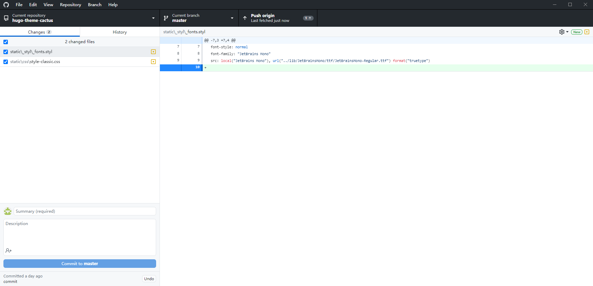

# stylus中文版参考文档之综述

https://www.zhangxinxu.com/jq/stylus/

# Stylus_Guide

https://truejiang.github.io/2018/12/05/Stylus_Guide/


# 牛津袖珍英语词汇 pdf


# 词以类记pdf


# 网页显示音标

https://www.google.com.hk/search?sxsrf=ALeKk02sPHXcG0mwcAbn0LMD472vxpuNXQ%3A1605800454375&ei=BpK2X6vMFsaEr7wP4eii4Ac&q=web+html+phonetic+symbol&oq=web+html+phonetic+symbol&gs_lcp=CgZwc3ktYWIQAzIHCCEQChCgATIHCCEQChCgAToECCMQJzoFCAAQywE6BQghEKABUPm9AVimiwNg2owDaAFwAHgCgAGmDogB7TSSAREwLjIuMy4xLjAuMy4yLjAuMZgBAKABAaABAqoBB2d3cy13aXrAAQE&sclient=psy-ab&ved=0ahUKEwir56bt-I7tAhVGwosBHWG0CHwQ4dUDCA0&uact=5 | web html phonetic symbol - Google 搜索
https://www.key-shortcut.com/en/writing-systems/rare-old-scripts/ipa-phonetic-alphabet | IPA Phonetic Alphabet: www.key-shortcut.com
https://www.pinterest.com/pin/161988917828481924/ | https://www.pinterest.com/pin/161988917828481924/
https://www.internationalphoneticassociation.org/content/links-phonetics-resources | Links to Phonetics Resources | International Phonetic Association
https://www.phon.ucl.ac.uk/home/wells/ipa-unicode.htm | IPA transcription in Unicode
https://stackoverflow.com/questions/39424069/html-file-with-international-phonetic-alphabet-characters-and-light-or-extra-lig | utf 8 - Html file with International Phonetic Alphabet characters and light or extra-light font - Stack Overflow
https://www.internationalphoneticalphabet.org/ipa-charts/ipa-symbols-with-html-codes/ | IPA symbols with HTML codes


# Segoe UI  字体


# stylus 是什么

https://www.jianshu.com/p/5fb15984f22d

https://juejin.cn/entry/6844903493132615687

# hugo 分页

https://bwaycer.github.io/hugo_tutorial.hugo/extras/menus/

# html使用highlight.js高亮代码

https://segmentfault.com/a/1190000005840034

https://www.jianshu.com/p/e2f12268fe81

https://www.ghostchina.com/adding-syntax-highlighting-to-ghost-using-highlight-js/

# css 圆角

https://www.runoob.com/css3/css3-border-radius.html


# 网站 转换代码为漂亮的html 格式

http://hilite.me/

10个CSS和JavaScript代码段，用于突出显示语法

https://speckyboy.com/snippets-beautiful-syntax-highlighting/

# css 代码颜色对照表

https://blog.csdn.net/u010541670/article/details/50223937


# css table   inline-table

https://www.google.com.hk/search?q=html+table+css&oq=html+table+css&aqs=chrome.0.0l6j69i60l2.4549j0j1&sourceid=chrome&ie=UTF-8 | html table css - Google 搜索
https://divtable.com/table-styler/ | HTML Table Styler ▦ CSS Generator | 𝗗𝗜𝗩𝗧𝗔𝗕𝗟𝗘.𝗖𝗢𝗠
https://css-tricks.com/complete-guide-table-element/ | A Complete Guide to the Table Element | CSS-Tricks
https://www.w3schools.com/html/html_tables.asp | HTML Tables
https://www.w3schools.com/css/css_table.asp | CSS Styling Tables
https://www.w3schools.com/css/tryit.asp?filename=trycss_table_border-collapse | Tryit Editor v3.6
https://www.w3schools.com/css/tryit.asp?filename=trycss_table_fullwidth | Tryit Editor v3.6
http://localhost:1313/posts/scoop/ | scoop Windows命令行包管理工具使用 | straywriter blog


https://www.w3schools.com/css/tryit.asp?filename=trycss_table_fancy

https://css-tricks.com/complete-guide-table-element/

# typora 图片

https://support.typora.io/Images/

# hugo 使用

[Hugo的使用](https://blog.csdn.net/qq_30682027/article/details/83536577)

https://kuang.netlify.app/blog/hugo.html

# 创建自己的hugo 主题

[如何创建自己的hugo主题](https://www.jianshu.com/p/0b9aecff290c)

[自定义Hugo主题样式](https://sr-c.github.io/2020/07/21/Hugo-custom/)

# css table 


# hugo Page bundles

https://gohugo.io/content-management/page-bundles/


# hugo 相关

### 概念

hugo是由Go语言实现的静态网站生成器。简单、易用、高效、易扩展、快速部署。

主要用于个人Blog、项目文档、初创公司站点构建。

hugo的下载安装很简单，可以参考官方的quickstart，本文主要介绍一下hugo框架的基本概念和工作原理。

### 目录结构

命令：hugo new site blog

```
blog
├── archetypes
├── config.toml
├── content
├── data
├── layouts
├── static
├── themes
└── public
archetypes
12345678910
```

在通过命令窗口hugo new xxx 创建内容页面的时候，默认情况下hugo会创建date、title等front matter，可以通过在archetypes目录下创建文件，设置自定义的front matter。

**config.toml**

所有的hugo站点都有一个全局配置文件，用来配置整个站点的信息，hugo默认提供了跟多配置指令。

**content**

站点下所有的内容页面，也就是我们创建的md文件都在这个content目录下面。

**data**

data目录用来存储网站用到一些配置、数据文件。文件类型可以是yaml|toml|json等格式。

**layouts**

存放用来渲染content目录下面内容的模版文件，模版.html格式结尾，layouts可以同时存储在项目目录和themes//layouts目录下。

**static**

用来存储图片、css、js等静态资源文件。

**themes**

用来存储主题，主题可以方便的帮助我们快速建立站点，也可以方便的切换网站的风格样式。

**public**

hugo编译后生成网站的所有文件都存储在这里面，把这个目录放到任意web服务器就可以发布网站成功。

### 页面绑定

Page bundles**
hugo中的内容组织是依赖Page Bundles来管理的。Page Bundles包括Leaf Bundle（没有子节点）和Branch Bundle（home page, section, taxonomy terms, taxonomy list）两类。

Leaf Bundle Branch Bundle
索引文件 [index.md](http://index.md/) _index.md
布局类型 single list
嵌套 不允许嵌套 允许Leaf或Branch Bundle嵌套
Section
section是基于content/目录下的组织结构定义的页面集合。

content/ 下的第一级子目录都是一个section。如果想让一个子目录成为section，需要在目录下面定义_index.md文件。 所有的section构成一个section tree。

```
content
└── blog        <-- Section, 因为是content的子目录
    ├── funny-cats
    │   ├── mypost.md
    │   └── kittens         <-- Section, 因为包含_index.md
    │       └── _index.md
    └── tech                <-- Section, 因为包含 _index.md
        └── _index.md
12345678
```

如果section tree 需要可导航，至少最底层的部分需要定义一个_index.md文件。

**front matter**
front matter 用来配置文章的标题、时间、链接、分类等元信息，提供给模板调用

```
+++
title = "post title"
description = "description."
date = "2018-08-20"
tags = [ "tag1", "tag2", "tag3"]
categories = ["cat1","cat2"]
weight = 20
+++
12345678
```

### 模版

Hugo以go语言的html/template库作为模版引擎，将内容通过template渲染成html，模版作为内容和显示视图之间的桥梁。

**hugo由三种类型的模版**：single、list and partial。

Hugo有一套自己的模版查找机制，如果找不到与内容完全匹配的模板，它将向上移动一级并从那里搜索。直到找到匹配的模板或用完模板来尝试。如果找不到模板，它将使用该站点的默认模板。

**Single Template**
single template 用于渲染页面内容。

**List Template**
list template 用于渲染一组相关内容，例如一个站点下所有内容，一个目录下的内容；

homepage 也就是_index.md，是一个特殊类型的list template，homepage实际上就是一个站点所有内容的入口。

**partial Template**
partial template 可以被其他模版引用，实际上可以理解为模版级别的组件，例如页面头部、页面底部等。

**基础模版查询规则**
基本模版是指baseof.html的查找规则

```
1. /layouts/section/<TYPE>-baseof.html
2. /themes/<THEME>/layouts/section/<TYPE>-baseof.html
3. /layouts/<TYPE>/baseof.html
4. /themes/<THEME>/layouts/<TYPE>/baseof.html
5. /layouts/section/baseof.html
6. /themes/<THEME>/layouts/section/baseof.html
7. /layouts/_default/<TYPE>-baseof.html
8. /themes/<THEME>/layouts/_default/<TYPE>-baseof.html
9. /layouts/_default/baseof.html
10. /themes/<THEME>/layouts/_default/baseof.html
12345678910
```

**页面模版查询规则**
kind
判断页面是single page 还是 list page？

如果是single page，会选择模版_default/single.html

如果是list page（section listings, home page, taxonomy lists, taxonomy terms），会选择模版_default/list.html

**Output Format**
根据输出格式的名称和后缀，选择匹配的模版。例如输出格式是rss，后缀是.html,首先看有没有匹配的index.rss.html格式的模版。

**Language**
根据站点设置的语言选择匹配的模版，比如，站点的语言为fr，模版匹配的优先级是：index.fr.amp.html > index.amp.html > index.fr.html

**Layout**
可以在页面头部设置front matter：layout，设置页面用指定的模版进行渲染，例如，页面在目录posts（默认section）下面，layout=custom，查找规则如下：

```
layouts/posts/custom.html
layouts/posts/single.html
layouts/_default/custom.html
layouts/_default/single.html
1234
```

**type**
如果在页面的头部设置了属性type属性，例如type=event，查找规则如下：

```
layouts/event/custom.html
layouts/event/single.html
layouts/events/single.html
layouts/_default/single.html
1234
```

### 语法

**基础语法**
go-template 基础语法

**block**
在父模版中通过{{ block “xxx”}} 定义一个块，在子模块中可以通过{{define “xxx”}} 定义的内容进行替换。
111
 模版定义 

{{ define “chrome/header.html” }}

{{ .Site.Params.author}}

{{ end }}

**模版引用**

**方法一 ：partial（推荐使用）**

用于引入定义的局部模版，局部模版位置必须在themes/layouts/partials 或者layouts/partials目录下。

`{{ partial "chrome/header.html" . }}`
**方法二 ：template**

template 在一些比较老的版本中用于引入定义的局部模版，现在在内部模版中仍然使用。

```{​{​
{{- xxx -}}
1
```

-用于去除空格，例如：

{{- xxx}用于去除{{- 前边的空格
{{ xxx -}用于去除-}}后边的空格
{{- xxx -}}用于去除两边的空格
**Paginator**
.Paginator主要用来构建菜单，只能在homePage、listPage中使用。

```
{{ range .Paginator.Pages }}
   {{ .Title }}
{{ end }}
123
```

**短代码**
短代码（shortcodes）相当于一些自定义模版，通过在md文档中引用，生成代码片段，类似于一些js框架中的组件。

短代码必须在themes/layouts/partials 或者layouts/partials目录下定义。

短代码在模版文件中引用是无效的，只能在content目录下的*.md文件中引用。

引用方式

```
{}**this** is a text{}
 **Yeahhh !** is a text 
12
```

% 代表短代码中的内容需要进一步渲染
< 代表短代码中间的内容项不需要进一步渲染
**taxonomy**
hugo中通过taxonomy来实现用户对内容的分组。taxonomy需要在站点配置文件中定义：

```
[taxonomies]
  category = "categories"
  tag = "tags"
  series = "series"
1234
```

默认情况下，hugo提供了category、tag两个分类，不需要用户在配置文件中定义，但如果还有其他的taxonomy定义，则默认的tag、category也需要定义；

**使用方式**

在站点配置文件中添加taxonomy,例如：series
定义taxonomy list template；例如，在layouts/taxonomy/series.html
在内容文件的front matter中设置term；例如，series = [“s1”,“s2”]
访问taxonomy列表，例如，localhost:1313/series/s1
变量
Hugo提供了很多不同类型变量用于创建模版，构建站点。

**Site**
大部分站点变量定义在站点配置文件中（config.[yaml|toml|json] ）

```
.Site.Menus:站点下的所有菜单

.Site.Pages:站点下的所有页面

.Site.Params: 站点下的参数
12345
```

**Page**
页面级参数都定义在页面头部的front matter中，例如：

```
+++
title = "Hugo"
date = 2018-08-13T18:29:20+08:00
description = ""
draft = false
weight = 10
+++
1234567
```

使用方式

```
{{ .Params.xxx }} 或者是 {{ .Site.Params.xxx }}```
```


# typora-root-url


# typora-copy-images-to


# css 转换 在线css转less/sass/stylus工具

http://tools.jb51.net/code/css2less

# markdown latex 数学


# typora 行内公式

**文件→偏好设置→Markdown，勾选内联公式，重启typora**


# hexo math

## [解决](https://qingstudios.com/2020/03/01/Hexo%E4%B8%AD%E6%8F%92%E5%85%A5%E6%95%B0%E5%AD%A6%E5%85%AC%E5%BC%8F/)

[hexo math](https://abelsu7.top/2018/10/29/hexo-mathjax/)

# Hexo 放大图片


# 解决hexo中图片路径不显示的问题


图片路径

- 配置根目录中的_config.yml里面的post_asset_folder:false这个选项设置为true

- 安装

  hexo-asset-image

  ```
  npm install hexo-asset-image --save
  ```

- 运行下面命令生成md博文以及在博文相同路径下生成和博文名称一样的,图片存放的文件夹

  ```
  hexo n "xxxx"
  ```

- 使用

  

  直接插入图片

  ## 问题

- 安装已经修改过的插件

  ```
  npm install https://github.com/7ym0n/hexo-asset-image --save
  ```

  详细见

  具体解析


[hexo图片显示路径问题解决](https://sparkparis.github.io/2020/03/26/hexo%E5%9B%BE%E7%89%87%E6%98%BE%E7%A4%BA%E8%B7%AF%E5%BE%84%E9%97%AE%E9%A2%98%E8%A7%A3%E5%86%B3/)

https://blog.csdn.net/xjm850552586/article/details/84101345

# hexo-typora-image

typora-root-url


# 附加资源

- [GLFW: Window Guide](http://www.glfw.org/docs/latest/window_guide.html)：GLFW官方的配置GLFW窗口的指南。
- [Building applications](http://www.opengl-tutorial.org/miscellaneous/building-your-own-c-application/)：提供了很多编译或链接相关的信息和一大列错误及对应的解决方案。
- [GLFW with Code::Blocks](http://wiki.codeblocks.org/index.php?title=Using_GLFW_with_Code::Blocks)：使用Code::Blocks IDE编译GLFW。
- [Running CMake](http://www.cmake.org/runningcmake/)：简要的介绍如何在Windows和Linux上使用CMake。
- [Writing a build system under Linux](http://learnopengl.com/demo/autotools_tutorial.txt)：Wouter Verholst写的一个autotools的教程，讲的是如何在Linux上编写构建系统，尤其是针对这些教程。
- [Polytonic/Glitter](https://github.com/Polytonic/Glitter)：一个简单的样板项目，它已经提前配置了所有相关的库；如果你想要很方便地搞到一个LearnOpenGL教程的范例工程，这也是很不错的。


# Segoe-UI

https://www.cssfontstack.com/Segoe-UI


# html 音标

在音标所在的标签内添加class="IPA"（随便起类名）

在css中对ipa类添加如下属性：


```css
.IPA{font-family: "Segoe UI", Verdana,Lucida Sans Regular,Lucida Sans Unicode,Arial,sans-serif;}
```

# html

```html
<!DOCTYPE html>
<html lang="en">
<head>
  <meta http-equiv="Content-Type" content="text/html; charset=utf-8">
  <title>hair</title>
  <link href="https://fonts.googleapis.com/css?family=Assistant:300" rel="stylesheet">
  <style>
  .ipa {
    font-family: 'Assistant';
    font-weight: 300;
    font-size: 34px;
  }
  </style>
</head>
<body>
  <div class="ipa">hɛər</div>
</body>
</html>
```


# Cmake


https://glad.dav1d.de/generated/tmpH6dGhuglad/ | Index of .
https://www.wordreference.com/encz/glad | glad - WordReference.com Anglicko-český slovník
https://dictionary.cambridge.org/dictionary/english/glad | GLAD | meaning in the Cambridge English Dictionary
https://slovnik.seznam.cz/preklad/anglicky_cesky/glad | glad překlad z češtiny do angličtiny – Seznam Slovník
https://github.com/glfw/glfw | glfw/glfw: A multi-platform library for OpenGL, OpenGL ES, Vulkan, window and input
https://www.cnblogs.com/hbccdf/p/introduction_of_cmake.html | CMake简介 - 缘生梦 - 博客园
https://www.jianshu.com/p/03640a4caf7e | CMake 简介和 CMake 模板 - 简书
https://www.jianshu.com/go-wild?ac=2&url=http%3A%2F%2Fhahack.com%2Fcodes%2Fcmake%2F | 简书
https://www.jianshu.com/p/c042abb42133 | CMake 简介与使用 - 简书
https://www.jianshu.com/go-wild?ac=2&url=http%3A%2F%2Fblog.csdn.net%2Ffelaim%2Farticle%2Fdetails%2F71511909 | 简书
https://blog.csdn.net/felaim/article/details/71511909 | (17条消息) CMake error 合集（Configuring incomplete errors occurred!）_Felaim的博客-CSDN博客
https://www.jianshu.com/p/bbf68f9ddffa | CMake简要教程 - 简书
https://www.jianshu.com/p/c3119b57174a | 分布式版本控制软件水银（Mercurial）使用指南0 - 简书
https://huangwang.github.io/2019/11/16/CMake%E4%BD%BF%E7%94%A8%E5%85%A5%E9%97%A8%E6%95%99%E7%A8%8B/ | CMake使用入门教程 | Jack Huang's Blog
https://aiden-dong.github.io/2019/07/20/CMake%E6%95%99%E7%A8%8B%E4%B9%8BCMake%E4%BB%8E%E5%85%A5%E9%97%A8%E5%88%B0%E5%BA%94%E7%94%A8/ | CMake 教程 | CMake 从入门到应用 - 董涛的博客 | Aiden Blog
https://www.jianshu.com/p/6e6569ba2237 | CMake 入门实战 - 简书
https://www.hahack.com/codes/cmake/ | CMake 入门实战 | HaHack


参考链接

1. [Linux平台编译安装测试JSBSim](https://huangwang.github.io/2019/03/20/Linux平台编译安装测试JSBSim/),by jackhuang.
2. [干货：构建C/C++良好的工程结构](https://zhuanlan.zhihu.com/p/59450618),by Froser.
3. [基于CMake构建系统的C++工程框架](https://blog.csdn.net/yzx_zjut/article/details/80831900),by zhongxiao_yao.
4. [CMake 手册详解（十九）install指令](https://www.cnblogs.com/coderfenghc/archive/2012/08/12/2627561.html),by SirDigit.
5. [CMake中变量总结](https://murphypei.github.io/blog/2018/10/cmake-variable),by 拾荒志.
6. [cmake使用教程（十）-关于file](https://juejin.im/post/5b3ecfef6fb9a04f8c5ebab5),by saka.
7. [Recursive CMake search for header and source files](https://stackoverflow.com/questions/17653738/recursive-cmake-search-for-header-and-source-files),by stackoverflow.
8. [CMake shared library in subdirectory](https://stackoverflow.com/questions/47251874/cmake-shared-library-in-subdirectory),by stackoverflow.
9. [CMake 语言和语法](https://blog.leosocy.top/CMake进阶学习/),by leosocy.


# 分布式版本控制软件水银（Mercurial）使用指南


# cmake 常用命令

**cmake 常用变量**

| 环境变量名                                                   | 描述                                                         |
| :----------------------------------------------------------- | :----------------------------------------------------------- |
| CMAKE_BINARY_DIR, PROJECT_BINARY_DIR, `<projectname>`_BINARY_DIR | 如果是 `in source` 编译,指得就是工程顶层目录,如果是 `out-of-source` 编译,指的是工程编译发生的目录。PROJECT_BINARY_DIR 跟其他指令稍有区别,现在,你可以理解为他们是一致的。 |
| CMAKE_SOURCE_DIR, PROJECT_SOURCE_DIR, `<projectname>`_SOURCE_DIR | 工程顶层目录。                                               |
| CMAKE_CURRENT_SOURCE_DIR                                     | 当前处理的 CMakeLists.txt 所在的路径,比如上面我们提到的 src 子目录。 |
| CMAKE_CURRRENT_BINARY_DIR                                    | 如果是 `in-source` 编译,它跟 CMAKE_CURRENT_SOURCE_DIR 一致,如果是 `out-of-source` 编译,他指的是 target 编译目录。 |
| EXECUTABLE_OUTPUT_PATH , LIBRARY_OUTPUT_PATH                 | 最终目标文件存放的路径。                                     |
| PROJECT_NAME                                                 | 通过 PROJECT 指令定义的项目名称。                            |

**cmake 系统信息**

| 系统信息变量名         | 描述                                            |
| :--------------------- | :---------------------------------------------- |
| CMAKE_MAJOR_VERSION    | CMAKE 主版本号,比如 2.4.6 中的 2                |
| CMAKE_MINOR_VERSION    | CMAKE 次版本号,比如 2.4.6 中的 4                |
| CMAKE_PATCH_VERSION    | CMAKE 补丁等级,比如 2.4.6 中的 6                |
| CMAKE_SYSTEM           | 系统名称,比如 Linux-2.6.22                      |
| CMAKE_SYSTEM_NAME      | 不包含版本的系统名,比如 Linux                   |
| CMAKE_SYSTEM_VERSION   | 系统版本,比如 2.6.22                            |
| CMAKE_SYSTEM_PROCESSOR | 处理器名称,比如 i686.                           |
| UNIX                   | 在所有的类 UNIX 平台为 TRUE,包括 OS X 和 cygwin |
| WIN32                  | 在所有的 win32 平台为 TRUE,包括 cygwin          |

**cmake 编译选项**

| 编译控制开关名    | 描述                                                    |
| :---------------- | :------------------------------------------------------ |
| BUILD_SHARED_LIBS | 使用 `ADD_LIBRARY` 时生成动态库                         |
| BUILD_STATIC_LIBS | 使用 `ADD_LIBRARY` 时生成静态库                         |
| CMAKE_C_FLAGS     | 设置 C 编译选项,也可以通过指令 ADD_DEFINITIONS()添加。  |
| CMAKE_CXX_FLAGS   | 设置 C++编译选项,也可以通过指令 ADD_DEFINITIONS()添加。 |


# CMake 简介

**CMake是个一个开源的跨平台自动化建构系统，用来管理软件建置的程序，并不相依于某特定编译器。**

并可支持多层目录、多个应用程序与多个库。 它用配置文件控制建构过程（build process）的方式和Unix的make相似，只是CMake的配置文件取名为CMakeLists.txt。

**CMake并不直接建构出最终的软件，而是产生标准的建构档（如Unix的Makefile或Windows Visual C++的projects/workspaces），然后再依一般的建构方式使用。**

这使得熟悉某个集成开发环境（IDE）的开发者可以用标准的方式建构他的软件，这种可以使用各平台的原生建构系统的能力是CMake和SCons等其他类似系统的区别之处。

**它首先允许开发者编写一种平台无关的CMakeList.txt 文件来定制整个编译流程，然后再根据目标用户的平台进一步生成所需的本地化 Makefile 和工程文件，如 Unix的 Makefile 或 Windows 的 Visual Studio 工程。从而做到“Write once, run everywhere”。显然，CMake 是一个比上述几种 make 更高级的编译配置工具。**

**“CMake”这个名字是"Cross platform MAke"的缩写。虽然名字中含有"make"，但是CMake和Unix上常见的“make”系统是分开的，而且更为高端。 它可与原生建置环境结合使用，例如：make、苹果的Xcode与微软的Visual Studio。**

[CMake维基百科地址](https://zh.wikipedia.org/wiki/CMake)

[文中代码github地址](https://github.com/Shanlovana/DailyCode)

**本文采用 JetBrains CLion 与 CMake 作为 开发与编译工具，和大家一起走进CMake，了解CMake。**


你或许听过好几种 Make 工具，例如 [GNU Make](https://www.hahack.com/wiki/tools-makefile.html) ，QT 的 [qmake](http://qt-project.org/doc/qt-4.8/qmake-manual.html) ，微软的 [MS nmake](http://msdn.microsoft.com/en-us/library/ms930369.aspx)，BSD Make（[pmake](http://www.freebsd.org/doc/en/books/pmake/)），[Makepp](http://makepp.sourceforge.net/)，等等。这些 Make 工具遵循着不同的规范和标准，所执行的 Makefile 格式也千差万别。这样就带来了一个严峻的问题：如果软件想跨平台，必须要保证能够在不同平台编译。而如果使用上面的 Make 工具，就得为每一种标准写一次 Makefile ，这将是一件让人抓狂的工作。

CMake 就是针对上面问题所设计的工具：它首先允许开发者编写一种平台无关的 CMakeList.txt 文件来定制整个编译流程，然后再根据目标用户的平台进一步生成所需的本地化 Makefile 和工程文件，如 Unix 的 Makefile 或 Windows 的 Visual Studio 工程。从而做到“Write once, run everywhere”。显然，CMake 是一个比上述几种 make 更高级的编译配置工具。一些使用 CMake 作为项目架构系统的知名开源项目有 [VTK](http://www.vtk.org/)、[ITK](http://www.itk.org/)、[KDE](http://kde.org/)、[OpenCV](http://www.opencv.org.cn/opencvdoc/2.3.2/html/modules/core/doc/intro.html)、[OSG](http://www.openscenegraph.org/) 等 [[1\]](https://www.hahack.com/codes/cmake/#fn1)。

在 linux 平台下使用 CMake 生成 Makefile 并编译的流程如下：

1. 编写 CMake 配置文件 CMakeLists.txt 。
2. 执行命令 `cmake PATH` 或者 `ccmake PATH` 生成 Makefile（`ccmake` 和 `cmake` 的区别在于前者提供了一个交互式的界面）。其中， `PATH` 是 CMakeLists.txt 所在的目录。
3. 使用 `make` 命令进行编译。

本文将从实例入手，一步步讲解 CMake 的常见用法，文中所有的实例代码可以在[这里](https://github.com/wzpan/cmake-demo)找到。如果你读完仍觉得意犹未尽，可以继续学习我在文章末尾提供的其他资源。


**CMake** 是一个跨平台的、开源的构建工具。`cmake` 是 `makefile` 的上层工具，它们的目的正是为了产生可移植的makefile，并简化自己动手写makefile时的巨大工作量.


代码变成可执行文件，叫做编译（compile）；先编译这个，还是先编译那个（即编译的安排），叫做构建（build）。

Make是最常用的构建工具，诞生于1977年，主要用于C语言的项目。但是实际上 ，任何只要某个文件有变化，就要重新构建的项目，都可以用Make构建。

Make工具有很多，例如 GNU Make ，QT 的 qmake ，微软的 MS nmake，BSD Make（pmake），Makepp，等等。这些 Make 工具遵循着不同的规范和标准，所执行的 Makefile 格式也千差万别。这样就带来了一个严峻的问题：如果软件想跨平台，必须要保证能够在不同平台编译。而如果使用上面的 Make 工具，就得为每一种标准写一次 Makefile ，这将是一件让人抓狂的工作。

CMake就是针对上面问题所设计的工具：它首先允许开发者编写一种平台无关的 CMakeList.txt 文件来定制整个编译流程，然后再根据目标用户的平台进一步生成所需的本地化 Makefile 和工程文件，如 Unix 的 Makefile 或 Windows 的 Visual Studio 工程。从而做到“Write once, run everywhere”。显然，CMake 是一个比上述几种 make 更高级的编译配置工具。一些使用 CMake 作为项目架构系统的知名开源项目有 VTK、ITK、KDE、OpenCV、OSG 等。

# 字体  Font-Awesome

https://github.com/FortAwesome/Font-Awesome

# 列表CSS 样式


# GitHub 客户端



# Tree 命令 windows 和linux 

```
-a 显示所有文件和目录。
-A 使用ASNI绘图字符显示树状图而非以ASCII字符组合。
-C 在文件和目录清单加上色彩，便于区分各种类型。
-d 显示目录名称而非内容。
-D 列出文件或目录的更改时间。
-f 在每个文件或目录之前，显示完整的相对路径名称。
-F 在执行文件，目录，Socket，符号连接，管道名称名称，各自加上”*”,”/”,”=”,”@”,”|”号。
-g 列出文件或目录的所属群组名称，没有对应的名称时，则显示群组识别码。
-i 不以阶梯状列出文件或目录名称。
-I<范本样式> 不显示符合范本样式的文件或目录名称。
-l 如遇到性质为符号连接的目录，直接列出该连接所指向的原始目录。
-n 不在文件和目录清单加上色彩。
-N 直接列出文件和目录名称，包括控制字符。
-p 列出权限标示。
-P <范本样式> 只显示符合范本样式的文件或目录名称。
-q 用”?”号取代控制字符，列出文件和目录名称。
-s 列出文件或目录大小。
-t 用文件和目录的更改时间排序。
-u 列出文件或目录的拥有者名称，没有对应的名称时，则显示用户识别码。
-x 将范围局限在现行的文件系统中，若指定目录下的某些子目录，其存放于另一个文件系统上，则将该子目录予以排除在寻找范围外。
```


https://www.google.com/search?sxsrf=ALeKk02EXn0MbV_TRNhYek3eXlhR61g-nw%3A1605832987497&ei=GxG3X8LzHYKYr7wPqP2XyA0&q=tree+%E5%91%BD%E4%BB%A4%E4%BD%BF%E7%94%A8&oq=tree+%E5%91%BD%E4%BB%A4%E4%BD%BF%E7%94%A8&gs_lcp=CgZwc3ktYWIQAzIECAAQDDoECAAQQzoCCAA6BQgAEMsBOgQIABAKOgcIABAKEMsBOgQIIxAnOgYIABAEEB5Q3ghYny1guC5oCnABeACAAeYIiAGQGZIBDTIuNS4yLjEuMS43LTGYAQCgAQGqAQdnd3Mtd2l6wAEB&sclient=psy-ab&ved=0ahUKEwiC7aaG8o_tAhUCzIsBHaj-BdkQ4dUDCA0&uact=5 | tree 命令使用 - Google 搜索
https://blog.csdn.net/sinat_41093471/article/details/80322172 | (17条消息) 命令行tree命令生成文件树(win和mac环境)_曾少年的博客-CSDN博客_文件树
https://kingganzeng.github.io/%E5%91%BD%E4%BB%A4%E8%A1%8Ctree%E5%91%BD%E4%BB%A4%E7%94%9F%E6%88%90%E6%96%87%E4%BB%B6%E6%A0%91/ | 命令行tree命令生成文件树 - KingGanZeng`s blogs
https://blog.csdn.net/MasterFT/article/details/1671672 | (17条消息) Windows-tree命令生成目录树_MasterFT的专栏-CSDN博客
https://juejin.cn/post/6844903736016371725 | tree命令-一键生成目录结构
https://www.jianshu.com/p/f117be185c6f | 命令行使用之tree命令 - 简书
https://www.google.com/search?q=tree+%E5%8F%82%E6%95%B0%E5%A4%AA%E5%A4%9A+-+2&oq=tree+%E5%8F%82%E6%95%B0%E5%A4%AA%E5%A4%9A+-+2&aqs=chrome..69i57j0l2j69i65l2j69i61l2j69i60.2161j0j1&sourceid=chrome&ie=UTF-8 | tree 参数太多 - 2 - Google 搜索
https://yijiebuyi.com/blog/c0defa3a47d16e675d58195adc35514b.html | mac 下的 tree 命令 终端展示你的目录树结构 一介布衣
https://segmentfault.com/a/1190000020030642 | 命令行 tree、tldr 安装使用_前端学习笔记 - SegmentFault 思否
https://www.cnblogs.com/sinosaurus/p/11492107.html | window-tree命令 - 木石心 - 博客园
https://www.bbsmax.com/R/o75N8D3KzW/ | paip.tree 生成目录树到txt后的折叠查看 - 相关文章
http://sunshiyong.com/2018/05/13/tree-win/ | 在windows终端里面使用tree命令 | zihan-smile
https://www.imqianduan.com/tool/164.html | 使用tree命令生成目录树(目录结构) - 工具类 - 我是前端

