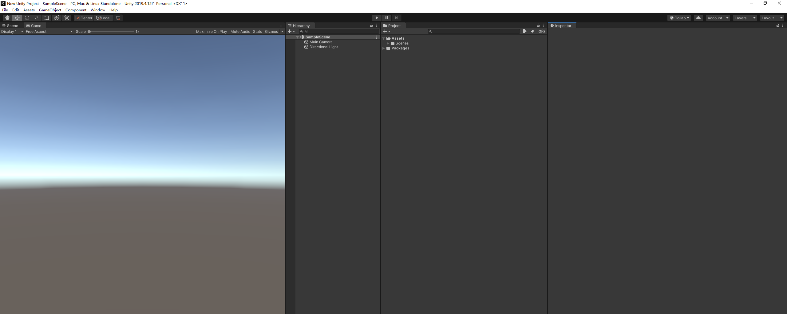
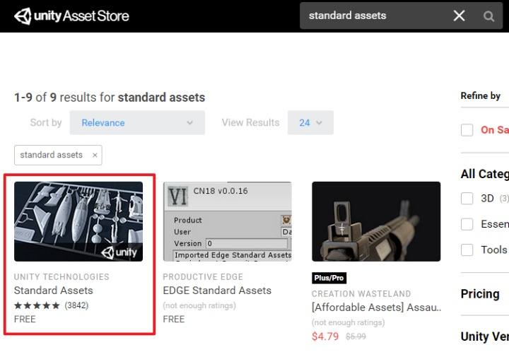
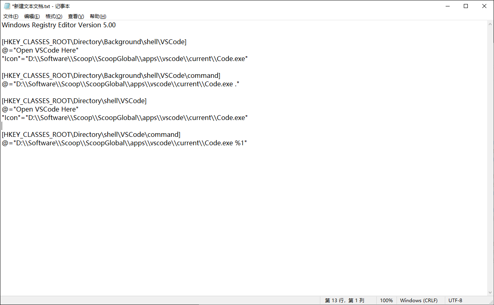
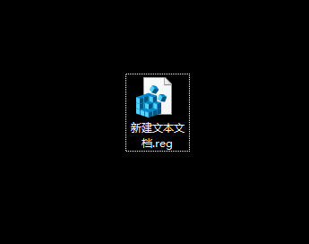
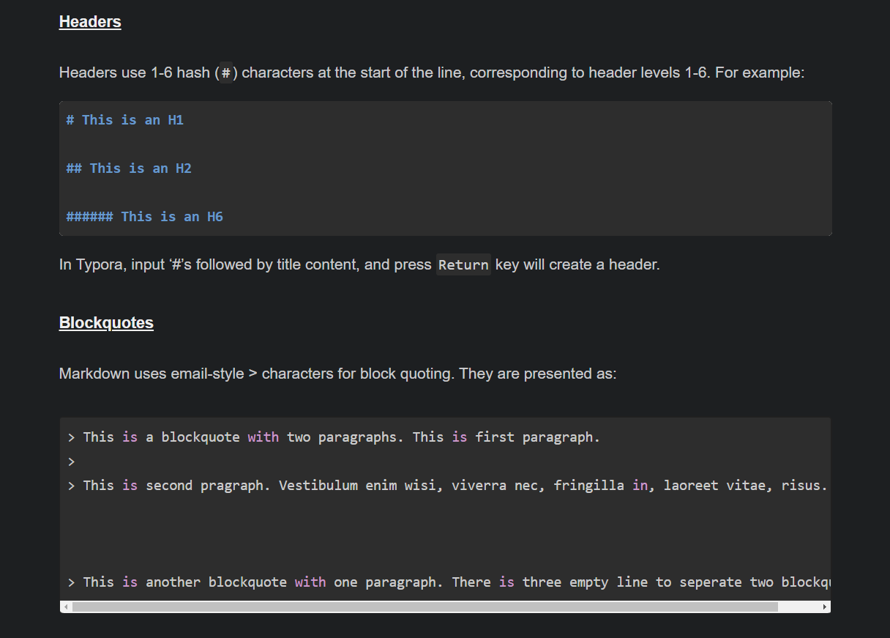
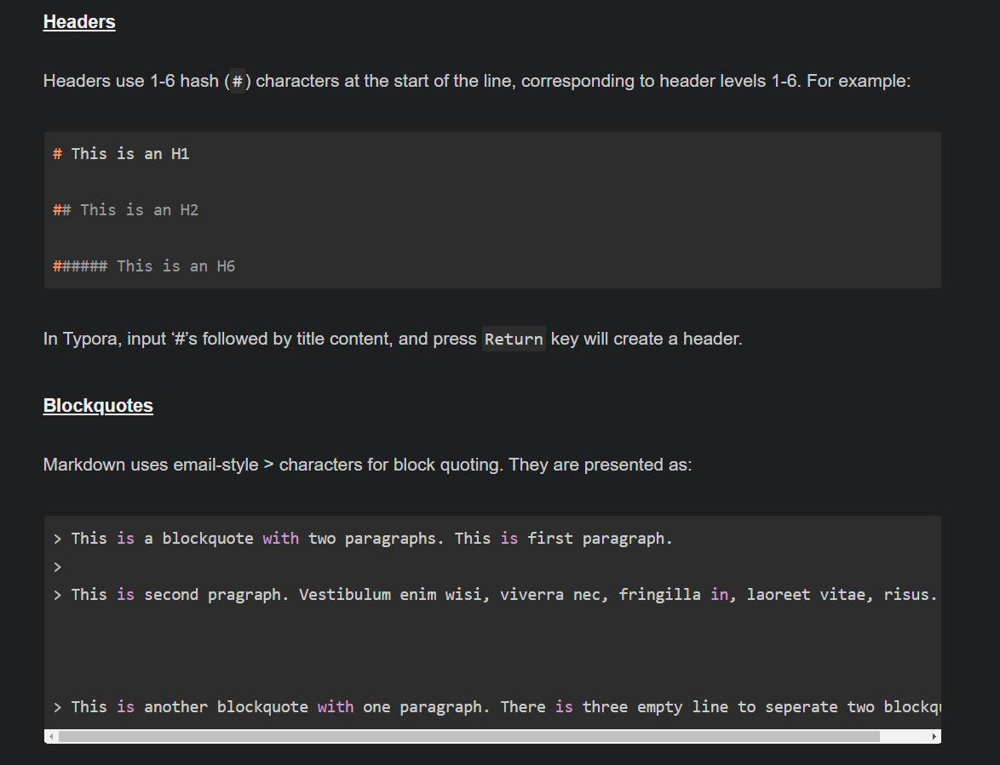

# c++ undefined reference to function


# C++ 内联函数 使用


# c++ first defined here

# C++ 使用imgui

[imgui](https://github.com/ocornut/imgui)

[imgui cmake](https://github.com/tamaskenez/imgui-cmake)


# 盘多多

https://www.pan131.com/

http://www.panduoduo.top/


# node.js


# vscodo 预览html

https://github.com/ritwickdey/vscode-live-server

# 前端环境搭建


https://www.google.com.hk/search?newwindow=1&safe=strict&ei=Ip-4X6a-NYfnwQPa_orQCA&q=%E5%89%8D%E7%AB%AF%E7%8E%AF%E5%A2%83%E6%90%AD%E5%BB%BA&oq=%E5%89%8D%E7%AB%AF%E7%8E%AF%E5%A2%83%E6%90%AD%E5%BB%BA&gs_lcp=CgZwc3ktYWIQAzIECAAQDDoCCAA6BAgAEEM6BggAEAUQHlCZOFiQVmC6V2gCcAB4AYAB4QKIAckjkgEIMC4xLjE1LjOYAQCgAQGqAQdnd3Mtd2l6sAEAwAEB&sclient=psy-ab&ved=0ahUKEwim1-fR7ZLtAhWHc3AKHVq_AooQ4dUDCA0&uact=5 | 前端环境搭建 - Google 搜索
https://github.com/xyoscer/WebPack4-San | xyoscer/WebPack4-San: 使用webpack4 搭建前端开发环境
https://www.pianshen.com/article/14561764431/ | 前端开发环境搭建 - 程序员大本营
https://wiki-power.com/post/%E5%89%8D%E7%AB%AF/%E5%89%8D%E7%AB%AF%E5%BC%80%E5%8F%91-%E7%8E%AF%E5%A2%83%E6%90%AD%E5%BB%BA.html | 前端开发 - 环境搭建 | Power's Wiki
http://www.soolco.com/post/13533_1_1.html | 前端开发环境搭建-博客
https://my.oschina.net/u/2371923/blog/3135091 | 前后端分离项目的前端开发环境搭建 - em_aaron的个人空间 - OSCHINA - 中文开源技术交流社区
https://zhuanlan.zhihu.com/p/72828262 | 如何打造舒适的前端开发环境 - 知乎
https://bin.zmide.com/?p=569 | Windows 前端开发环境搭建
https://blog.csdn.net/tiny2017/article/details/104185099 | (17条消息) 前端开发环境搭建_Tiny2017的博客-CSDN博客
https://www.cnblogs.com/gating/p/12488433.html | (oﾟvﾟ)ノ Hi - 从零搭建Window前端开发环境
https://juejin.cn/post/6844903996956606471 | 前端开发环境搭建
https://anran758.github.io/blog/2019/07/26/configuring-mac-front-end-development-env-from-zero/ | [环境搭建] 从零开始配置前端开发环境 | Anran758's blog
https://medium.com/@thoamsy/%E4%BD%BF%E7%94%A8-vs-code-%E6%90%AD%E5%BB%BA%E4%B8%80%E4%B8%AA%E5%BE%88%E7%88%BD%E7%9A%84%E5%89%8D%E7%AB%AF%E7%8E%AF%E5%A2%83-2d393ba5cc45 | 使用 VS Code 搭建一个很爽的前端环境. 这篇文章主要是针对打算学习前端的小白，和想学点前端的后端大佬，为了提升你们的编码… | by Thomas Yang | Medium
https://www.typescriptlang.org/ | TypeScript: Typed JavaScript at Any Scale.
https://blog.csdn.net/weixin_44198965/article/details/103747866 | (17条消息) 高效率工具：web前端开发VScode必备插件大全(欲其善其事必先利其器)_王佳斌-CSDN博客

# 前端相关教程网站

[](https://www.w3school.com.cn/h.asp)

[](https://www.runoob.com/html/html-tutorial.html)


https://marksheet.io/

# html 简写


下表列出了 HTML 标签简写及全称：

| 标签        | 英文全称                  | 中文说明                       |
| :---------- | :------------------------ | :----------------------------- |
| a           | Anchor                    | 锚                             |
| abbr        | Abbreviation              | 缩写词                         |
| acronym     | Acronym                   | 取首字母的缩写词               |
| address     | Address                   | 地址                           |
| alt         | alter                     | 替用(一般是图片显示不出的提示) |
| b           | Bold                      | 粗体（文本）                   |
| bdo         | Direction of Text Display | 文本显示方向                   |
| big         | Big                       | 变大（文本）                   |
| blockquote  | Block Quotation           | 区块引用语                     |
| br          | Break                     | 换行                           |
| cell        | cell                      | 巢                             |
| cellpadding | cellpadding               | 巢补白                         |
| cellspacing | cellspacing               | 巢空间                         |
| center      | Centered                  | 居中（文本）                   |
| cite        | Citation                  | 引用                           |
| code        | Code                      | 源代码（文本）                 |
| dd          | Definition Description    | 定义描述                       |
| del         | Deleted                   | 删除（的文本）                 |
| dfn         | Defines a Definition Term | 定义定义条目                   |
| div         | Division                  | 分隔                           |
| dl          | Definition List           | 定义列表                       |
| dt          | Definition Term           | 定义术语                       |
| em          | Emphasized                | 加重（文本）                   |
| font        | Font                      | 字体                           |
| h1~h6       | Header 1 to Header 6      | 标题1到标题6                   |
| hr          | Horizontal Rule           | 水平尺                         |
| href        | hypertext reference       | 超文本引用                     |
| i           | Italic                    | 斜体（文本）                   |
| iframe      | Inline frame              | 定义内联框架                   |
| ins         | Inserted                  | 插入（的文本）                 |
| kbd         | Keyboard                  | 键盘（文本）                   |
| li          | List Item                 | 列表项目                       |
| nl          | navigation lists          | 导航列表                       |
| ol          | Ordered List              | 排序列表                       |
| optgroup    | Option group              | 定义选项组                     |
| p           | Paragraph                 | 段落                           |
| pre         | Preformatted              | 预定义格式（文本 ）            |
| q           | Quotation                 | 引用语                         |
| rel         | Reload                    | 加载                           |
| s/ strike   | Strikethrough             | 删除线                         |
| samp        | Sample                    | 示例（文本                     |
| small       | Small                     | 变小（文本）                   |
| span        | Span                      | 范围                           |
| src         | Source                    | 源文件链接                     |
| strong      | Strong                    | 加重（文本）                   |
| sub         | Subscripted               | 下标（文本）                   |
| sup         | Superscripted             | 上标（文本）                   |
| td          | table data cell           | 表格中的一个单元格             |
| th          | table header cell         | 表格中的表头                   |
| tr          | table row                 | 表格中的一行                   |
| tt          | Teletype                  | 打印机（文本）                 |
| u           | Underlined                | 下划线（文本）                 |
| ul          | Unordered List            | 不排序列表                     |
| var         | Variable                  | 变量（文本）                   |


# html 基础

基本
<html>…</html> 定义 HTML 文档

<head>…</head> 文档的信息
<meta> HTML 文档的元信息
<title>…</title> 文档的标题
<link> 文档与外部资源的关系
<style>…</style> 文档的样式信息
<body>…</body> 可见的页面内容
<!--…--> 注释

文本
<h1>...</h1> 标题字大小（h1~h6）
<b>...</b> 粗体字
<strong>...</strong> 粗体字(强调)
<i>...</i> 斜体字
<em>...</em> 斜体字(强调)
<u>...</u> 下划线
<del>...</del> 删除线(表示删除)

<center>…</center> 居中文本(HTMl5已不支持center标签，可用样式text-align:center代替)
<ul>…</ul> 无序列表
<ol>…</ol> 有序列表
<li>…</li> 列表项目
<a href=”…”>…</a> 超链接
<font> 定义文本字体尺寸、颜色、大小
<sub> 下标
<sup> 上标
<br> 换行
<p> 段落
图形
 定义图像

<hr> 水平线

表格
<table>…</table> 定义表格
<th>…</th> 定义表格中的表头单元格
<tr>…</tr> 定义表格中的行
<td>…</td> 定义表格中的单元

其它
<form>…</form> 定义供用户输入的 HTML 表单
<frame> 定义框架集的窗口或框架


# Unity 2d

Sprite Editor

Sprite Renderer


# 字体格式相关


# unity 中文文档

https://www.w3cschool.cn/unity3d/unity3d-yftg2ccg.html

https://www.w3cschool.cn/unity3d/unity3d-85q22can.html


# unity 新建项目中的Package 目录中有什么


# unity 布局 带鱼屏



# unity 标准资源包

https://www.w3cschool.cn/unity3d/unity3d-yftg2ccg.html

https://www.w3cschool.cn/unity3d/unity3d-85q22can.html


**下载**

商店下载




[下载安装包 安装到路径](https://link.zhihu.com/?target=https%3A//download.unity3d.com/download_unity/a6cc294b73ee/WindowsStandardAssetsInstaller/UnityStandardAssetsSetup-2018.1.9f2.exe)

相关文章

https://zhuanlan.zhihu.com/p/65822341


# 常用Unity插件汇总合集与Unity3D老油条的资源推荐

[简书](https://www.jianshu.com/p/2f4513df7e97)


# unity 代码仓库


# unity 移动脚本


# unity hello world


```c#
using UnityEngine;
using System.Collections;

public class testCS : MonoBehaviour {

	// Use this for initialization
	void Start () {
		print ("hello world");
	}
	
	// Update is called once per frame
	void Update () {
	
	}
}

```


# 深入理解计算机系统


https://github.com/vonzhou/CSAPP


# 设计模式

https://github.com/search?l=C%2B%2B&q=DesignPatterns&type=Repositories | Search · DesignPatterns
https://github.com/jaredtao/DesignPattern/tree/master/code/Struct/Adapter_01 | DesignPattern/code/Struct/Adapter_01 at master · jaredtao/DesignPattern
https://github.com/jaredtao/DesignPattern | jaredtao/DesignPattern: C++11全套设计模式-23种指针的用法(a full DesignPattern implement with c++11)
https://github.com/jaredtao/DesignPattern/blob/master/Template/Behavior/ObserverTemplate/main.cpp | DesignPattern/main.cpp at master · jaredtao/DesignPattern
https://github.com/jaredtao/DesignPattern/blob/master/code/Create/FactoryMethod/README.md | DesignPattern/README.md at master · jaredtao/DesignPattern
https://github.com/jamehuang2012/designpatterns | jamehuang2012/designpatterns: designpatterns
https://github.com/Poyias/DesignPatterns | Poyias/DesignPatterns: Design Patters Quick guides
https://github.com/Poyias/DesignPatterns/blob/master/Bridge.cpp | DesignPatterns/Bridge.cpp at master · Poyias/DesignPatterns
https://github.com/nesteruk/DesignPatternsWebinar | nesteruk/DesignPatternsWebinar: Materials for the Design Patterns webinar


https://www.google.com.hk/search?q=GitHub+C%2B%2B+%E8%AE%BE%E8%AE%A1%E6%A8%A1%E5%BC%8F&oq=GitHub+C%2B%2B+%E8%AE%BE%E8%AE%A1%E6%A8%A1%E5%BC%8F&aqs=chrome..69i57j0l2j69i65.8424j0j1&sourceid=chrome&ie=UTF-8 | GitHub C++ 设计模式 - Google 搜索
https://github.com/micooz/DesignPattern | micooz/DesignPattern: 23 Design Patterns implemented by C++
https://github.com/Waleon/DesignPatterns/tree/master/AbstractFactory | DesignPatterns/AbstractFactory at master · Waleon/DesignPatterns
https://github.com/Waleon/DesignPatterns | Waleon/DesignPatterns: 趣味设计模式，小朋友也能学得会！
https://github.com/Waleon/DesignPatterns/tree/master/AbstractFactory | DesignPatterns/AbstractFactory at master · Waleon/DesignPatterns
https://github.com/jaredtao/DesignPattern | jaredtao/DesignPattern: C++11全套设计模式-23种指针的用法(a full DesignPattern implement with c++11)
https://github.com/jaredtao/DesignPattern | jaredtao/DesignPattern: C++11全套设计模式-23种指针的用法(a full DesignPattern implement with c++11)
https://github.com/john-bai/DesignPatterns/tree/master/C%2B%2B | DesignPatterns/C++ at master · john-bai/DesignPatterns
https://github.com/john-bai/DesignPatterns/blob/master/C%2B%2B/main.cpp | DesignPatterns/main.cpp at master · john-bai/DesignPatterns
https://github.com/john-bai/DesignPatterns/blob/master/C%2B%2B/builder.cpp | DesignPatterns/builder.cpp at master · john-bai/DesignPatterns

# javascript历史


# 英语单词分类

https://www.google.com.hk/search?newwindow=1&safe=strict&ei=72W2X8a1Hou7wAO9-4y4Aw&q=%E8%8B%B1%E8%AF%AD%E5%8D%95%E8%AF%8D%E5%88%86%E7%B1%BB&oq=%E8%8B%B1%E8%AF%AD%E5%8D%95%E8%AF%8D%E5%88%86%E7%B1%BB&gs_lcp=CgZwc3ktYWIQAzIECAAQDDIECAAQDDIECAAQDDIECAAQDDoECAAQQzoCCABQlwdYjxJgsBNoAHAAeACAAe8DiAGtEpIBBzItNS4yLjGYAQCgAQGqAQdnd3Mtd2l6wAEB&sclient=psy-ab&ved=0ahUKEwiG6abnzo7tAhWLHXAKHb09AzcQ4dUDCA0&uact=5 | 英语单词分类 - Google 搜索
https://wenku.baidu.com/view/ff024cf69e31433239689376.html | 100个常用英语单词分类表 - 百度文库
http://m.kekenet.com/word/30919.shtml | 分类英语词汇之旅游英语类_英语单词 - 可可英语
http://www.360doc.com/content/20/0114/20/141793_886202168.shtml | 英语老师：分类整理3000个英语单词，一张表拿下12年词汇量！珍藏
http://www.360doc.com/content/11/0914/16/1030243_148205467.shtml | 英语动词分类大全（附练习）
https://cv.qiaobutang.com/knowledge/articles/51b9739c0cf27180ee1f8f72 | 148个简历常用行为词 - 乔布简历
http://www.360doc.com/content/11/0914/16/1030243_148205467.shtml | 英语动词分类大全（附练习）
http://www.fltagrammar.com/220/ | 英语动词的分类:及物动词,不及物动词,系动词,助动词和情态动词 - 飞达语法网
https://www.jianshu.com/p/2c8f0c5792cf | 英语语法第3课：动词的分类和形式 - 简书


# pygments


# Html 相关

常用标签

表单

SEO 优化

# vscode 创建右键菜单

不知为何，重新安装VSCode之后，右键菜单并没有常用的Open with VSCode项，手动添加吧。

先列出注册表：


```csharp
Windows Registry Editor Version 5.00

[HKEY_CLASSES_ROOT\Directory\Background\shell\VSCode]
@="Open VSCode Here"
"Icon"="D:\\mysoft\\Microsoft VS Code\\Code.exe"

[HKEY_CLASSES_ROOT\Directory\Background\shell\VSCode\command]
@="D:\\mysoft\\Microsoft VS Code\\Code.exe ."

[HKEY_CLASSES_ROOT\Directory\shell\VSCode]
@="Open VSCode Here"
"Icon"="D:\\mysoft\\Microsoft VS Code\\Code.exe"

[HKEY_CLASSES_ROOT\Directory\shell\VSCode\command]
@="D:\\mysoft\\Microsoft VS Code\\Code.exe %1"
```

你可以将上述文件复制下来，修改对应的程序路径后，右键另存为.reg文件，然后直接打开，也可以对照着它手动添加。

文件中的内容可以分成两部分，前两部分添加的是在文件背景中点击右键，效果如下图：


演示



另存为

reg




# vscode

https://code.visualstudio.com/

# 前端学习路线

https://objtube.github.io/front-end-roadmap


# vue

https://cn.vuejs.org/


# highlightjs

https://highlightjs.org/static/demo/


# hugo 主题截图






# html 颜色名

| 颜色名                                                       | 十六进制颜色值                                               | 颜色 |
| :----------------------------------------------------------- | :----------------------------------------------------------- | :--- |
| [AliceBlue](https://www.w3school.com.cn/tiy/color.asp?color=AliceBlue) | [#F0F8FF](https://www.w3school.com.cn/tiy/color.asp?hex=F0F8FF) |      |
| [AntiqueWhite](https://www.w3school.com.cn/tiy/color.asp?color=AntiqueWhite) | [#FAEBD7](https://www.w3school.com.cn/tiy/color.asp?hex=FAEBD7) |      |
| [Aqua](https://www.w3school.com.cn/tiy/color.asp?color=Aqua) | [#00FFFF](https://www.w3school.com.cn/tiy/color.asp?hex=00FFFF) |      |
| [Aquamarine](https://www.w3school.com.cn/tiy/color.asp?color=Aquamarine) | [#7FFFD4](https://www.w3school.com.cn/tiy/color.asp?hex=7FFFD4) |      |
| [Azure](https://www.w3school.com.cn/tiy/color.asp?color=Azure) | [#F0FFFF](https://www.w3school.com.cn/tiy/color.asp?hex=F0FFFF) |      |
| [Beige](https://www.w3school.com.cn/tiy/color.asp?color=Beige) | [#F5F5DC](https://www.w3school.com.cn/tiy/color.asp?hex=F5F5DC) |      |
| [Bisque](https://www.w3school.com.cn/tiy/color.asp?color=Bisque) | [#FFE4C4](https://www.w3school.com.cn/tiy/color.asp?hex=FFE4C4) |      |
| [Black](https://www.w3school.com.cn/tiy/color.asp?color=Black) | [#000000](https://www.w3school.com.cn/tiy/color.asp?hex=000000) |      |
| [BlanchedAlmond](https://www.w3school.com.cn/tiy/color.asp?color=BlanchedAlmond) | [#FFEBCD](https://www.w3school.com.cn/tiy/color.asp?hex=FFEBCD) |      |
| [Blue](https://www.w3school.com.cn/tiy/color.asp?color=Blue) | [#0000FF](https://www.w3school.com.cn/tiy/color.asp?hex=0000FF) |      |
| [BlueViolet](https://www.w3school.com.cn/tiy/color.asp?color=BlueViolet) | [#8A2BE2](https://www.w3school.com.cn/tiy/color.asp?hex=8A2BE2) |      |
| [Brown](https://www.w3school.com.cn/tiy/color.asp?color=Brown) | [#A52A2A](https://www.w3school.com.cn/tiy/color.asp?hex=A52A2A) |      |
| [BurlyWood](https://www.w3school.com.cn/tiy/color.asp?color=BurlyWood) | [#DEB887](https://www.w3school.com.cn/tiy/color.asp?hex=DEB887) |      |
| [CadetBlue](https://www.w3school.com.cn/tiy/color.asp?color=CadetBlue) | [#5F9EA0](https://www.w3school.com.cn/tiy/color.asp?hex=5F9EA0) |      |
| [Chartreuse](https://www.w3school.com.cn/tiy/color.asp?color=Chartreuse) | [#7FFF00](https://www.w3school.com.cn/tiy/color.asp?hex=7FFF00) |      |
| [Chocolate](https://www.w3school.com.cn/tiy/color.asp?color=Chocolate) | [#D2691E](https://www.w3school.com.cn/tiy/color.asp?hex=D2691E) |      |
| [Coral](https://www.w3school.com.cn/tiy/color.asp?color=Coral) | [#FF7F50](https://www.w3school.com.cn/tiy/color.asp?hex=FF7F50) |      |
| [CornflowerBlue](https://www.w3school.com.cn/tiy/color.asp?color=CornflowerBlue) | [#6495ED](https://www.w3school.com.cn/tiy/color.asp?hex=6495ED) |      |
| [Cornsilk](https://www.w3school.com.cn/tiy/color.asp?color=Cornsilk) | [#FFF8DC](https://www.w3school.com.cn/tiy/color.asp?hex=FFF8DC) |      |
| [Crimson](https://www.w3school.com.cn/tiy/color.asp?color=Crimson) | [#DC143C](https://www.w3school.com.cn/tiy/color.asp?hex=DC143C) |      |
| [Cyan](https://www.w3school.com.cn/tiy/color.asp?color=Cyan) | [#00FFFF](https://www.w3school.com.cn/tiy/color.asp?hex=00FFFF) |      |
| [DarkBlue](https://www.w3school.com.cn/tiy/color.asp?color=DarkBlue) | [#00008B](https://www.w3school.com.cn/tiy/color.asp?hex=00008B) |      |
| [DarkCyan](https://www.w3school.com.cn/tiy/color.asp?color=DarkCyan) | [#008B8B](https://www.w3school.com.cn/tiy/color.asp?hex=008B8B) |      |
| [DarkGoldenRod](https://www.w3school.com.cn/tiy/color.asp?color=DarkGoldenRod) | [#B8860B](https://www.w3school.com.cn/tiy/color.asp?hex=B8860B) |      |
| [DarkGray](https://www.w3school.com.cn/tiy/color.asp?color=DarkGray) | [#A9A9A9](https://www.w3school.com.cn/tiy/color.asp?hex=A9A9A9) |      |
| [DarkGreen](https://www.w3school.com.cn/tiy/color.asp?color=DarkGreen) | [#006400](https://www.w3school.com.cn/tiy/color.asp?hex=006400) |      |
| [DarkKhaki](https://www.w3school.com.cn/tiy/color.asp?color=DarkKhaki) | [#BDB76B](https://www.w3school.com.cn/tiy/color.asp?hex=BDB76B) |      |
| [DarkMagenta](https://www.w3school.com.cn/tiy/color.asp?color=DarkMagenta) | [#8B008B](https://www.w3school.com.cn/tiy/color.asp?hex=8B008B) |      |
| [DarkOliveGreen](https://www.w3school.com.cn/tiy/color.asp?color=DarkOliveGreen) | [#556B2F](https://www.w3school.com.cn/tiy/color.asp?hex=556B2F) |      |
| [Darkorange](https://www.w3school.com.cn/tiy/color.asp?color=Darkorange) | [#FF8C00](https://www.w3school.com.cn/tiy/color.asp?hex=FF8C00) |      |
| [DarkOrchid](https://www.w3school.com.cn/tiy/color.asp?color=DarkOrchid) | [#9932CC](https://www.w3school.com.cn/tiy/color.asp?hex=9932CC) |      |
| [DarkRed](https://www.w3school.com.cn/tiy/color.asp?color=DarkRed) | [#8B0000](https://www.w3school.com.cn/tiy/color.asp?hex=8B0000) |      |
| [DarkSalmon](https://www.w3school.com.cn/tiy/color.asp?color=DarkSalmon) | [#E9967A](https://www.w3school.com.cn/tiy/color.asp?hex=E9967A) |      |
| [DarkSeaGreen](https://www.w3school.com.cn/tiy/color.asp?color=DarkSeaGreen) | [#8FBC8F](https://www.w3school.com.cn/tiy/color.asp?hex=8FBC8F) |      |
| [DarkSlateBlue](https://www.w3school.com.cn/tiy/color.asp?color=DarkSlateBlue) | [#483D8B](https://www.w3school.com.cn/tiy/color.asp?hex=483D8B) |      |
| [DarkSlateGray](https://www.w3school.com.cn/tiy/color.asp?color=DarkSlateGray) | [#2F4F4F](https://www.w3school.com.cn/tiy/color.asp?hex=2F4F4F) |      |
| [DarkTurquoise](https://www.w3school.com.cn/tiy/color.asp?color=DarkTurquoise) | [#00CED1](https://www.w3school.com.cn/tiy/color.asp?hex=00CED1) |      |
| [DarkViolet](https://www.w3school.com.cn/tiy/color.asp?color=DarkViolet) | [#9400D3](https://www.w3school.com.cn/tiy/color.asp?hex=9400D3) |      |
| [DeepPink](https://www.w3school.com.cn/tiy/color.asp?color=DeepPink) | [#FF1493](https://www.w3school.com.cn/tiy/color.asp?hex=FF1493) |      |
| [DeepSkyBlue](https://www.w3school.com.cn/tiy/color.asp?color=DeepSkyBlue) | [#00BFFF](https://www.w3school.com.cn/tiy/color.asp?hex=00BFFF) |      |
| [DimGray](https://www.w3school.com.cn/tiy/color.asp?color=DimGray) | [#696969](https://www.w3school.com.cn/tiy/color.asp?hex=696969) |      |
| [DodgerBlue](https://www.w3school.com.cn/tiy/color.asp?color=DodgerBlue) | [#1E90FF](https://www.w3school.com.cn/tiy/color.asp?hex=1E90FF) |      |
| [Feldspar](https://www.w3school.com.cn/tiy/color.asp?color=Feldspar) | [#D19275](https://www.w3school.com.cn/tiy/color.asp?hex=D19275) |      |
| [FireBrick](https://www.w3school.com.cn/tiy/color.asp?color=FireBrick) | [#B22222](https://www.w3school.com.cn/tiy/color.asp?hex=B22222) |      |
| [FloralWhite](https://www.w3school.com.cn/tiy/color.asp?color=FloralWhite) | [#FFFAF0](https://www.w3school.com.cn/tiy/color.asp?hex=FFFAF0) |      |
| [ForestGreen](https://www.w3school.com.cn/tiy/color.asp?color=ForestGreen) | [#228B22](https://www.w3school.com.cn/tiy/color.asp?hex=228B22) |      |
| [Fuchsia](https://www.w3school.com.cn/tiy/color.asp?color=Fuchsia) | [#FF00FF](https://www.w3school.com.cn/tiy/color.asp?hex=FF00FF) |      |
| [Gainsboro](https://www.w3school.com.cn/tiy/color.asp?color=Gainsboro) | [#DCDCDC](https://www.w3school.com.cn/tiy/color.asp?hex=DCDCDC) |      |
| [GhostWhite](https://www.w3school.com.cn/tiy/color.asp?color=GhostWhite) | [#F8F8FF](https://www.w3school.com.cn/tiy/color.asp?hex=F8F8FF) |      |
| [Gold](https://www.w3school.com.cn/tiy/color.asp?color=Gold) | [#FFD700](https://www.w3school.com.cn/tiy/color.asp?hex=FFD700) |      |
| [GoldenRod](https://www.w3school.com.cn/tiy/color.asp?color=GoldenRod) | [#DAA520](https://www.w3school.com.cn/tiy/color.asp?hex=DAA520) |      |
| [Gray](https://www.w3school.com.cn/tiy/color.asp?color=Gray) | [#808080](https://www.w3school.com.cn/tiy/color.asp?hex=808080) |      |
| [Green](https://www.w3school.com.cn/tiy/color.asp?color=Green) | [#008000](https://www.w3school.com.cn/tiy/color.asp?hex=008000) |      |
| [GreenYellow](https://www.w3school.com.cn/tiy/color.asp?color=GreenYellow) | [#ADFF2F](https://www.w3school.com.cn/tiy/color.asp?hex=ADFF2F) |      |
| [HoneyDew](https://www.w3school.com.cn/tiy/color.asp?color=HoneyDew) | [#F0FFF0](https://www.w3school.com.cn/tiy/color.asp?hex=F0FFF0) |      |
| [HotPink](https://www.w3school.com.cn/tiy/color.asp?color=HotPink) | [#FF69B4](https://www.w3school.com.cn/tiy/color.asp?hex=FF69B4) |      |
| [IndianRed ](https://www.w3school.com.cn/tiy/color.asp?color=IndianRed) | [#CD5C5C](https://www.w3school.com.cn/tiy/color.asp?hex=CD5C5C) |      |
| [Indigo ](https://www.w3school.com.cn/tiy/color.asp?color=Indigo) | [#4B0082](https://www.w3school.com.cn/tiy/color.asp?hex=4B0082) |      |
| [Ivory](https://www.w3school.com.cn/tiy/color.asp?color=Ivory) | [#FFFFF0](https://www.w3school.com.cn/tiy/color.asp?hex=FFFFF0) |      |
| [Khaki](https://www.w3school.com.cn/tiy/color.asp?color=Khaki) | [#F0E68C](https://www.w3school.com.cn/tiy/color.asp?hex=F0E68C) |      |
| [Lavender](https://www.w3school.com.cn/tiy/color.asp?color=Lavender) | [#E6E6FA](https://www.w3school.com.cn/tiy/color.asp?hex=E6E6FA) |      |
| [LavenderBlush](https://www.w3school.com.cn/tiy/color.asp?color=LavenderBlush) | [#FFF0F5](https://www.w3school.com.cn/tiy/color.asp?hex=FFF0F5) |      |
| [LawnGreen](https://www.w3school.com.cn/tiy/color.asp?color=LawnGreen) | [#7CFC00](https://www.w3school.com.cn/tiy/color.asp?hex=7CFC00) |      |
| [LemonChiffon](https://www.w3school.com.cn/tiy/color.asp?color=LemonChiffon) | [#FFFACD](https://www.w3school.com.cn/tiy/color.asp?hex=FFFACD) |      |
| [LightBlue](https://www.w3school.com.cn/tiy/color.asp?color=LightBlue) | [#ADD8E6](https://www.w3school.com.cn/tiy/color.asp?hex=ADD8E6) |      |
| [LightCoral](https://www.w3school.com.cn/tiy/color.asp?color=LightCoral) | [#F08080](https://www.w3school.com.cn/tiy/color.asp?hex=F08080) |      |
| [LightCyan](https://www.w3school.com.cn/tiy/color.asp?color=LightCyan) | [#E0FFFF](https://www.w3school.com.cn/tiy/color.asp?hex=E0FFFF) |      |
| [LightGoldenRodYellow](https://www.w3school.com.cn/tiy/color.asp?color=LightGoldenRodYellow) | [#FAFAD2](https://www.w3school.com.cn/tiy/color.asp?hex=FAFAD2) |      |
| [LightGrey](https://www.w3school.com.cn/tiy/color.asp?color=LightGrey) | [#D3D3D3](https://www.w3school.com.cn/tiy/color.asp?hex=D3D3D3) |      |
| [LightGreen](https://www.w3school.com.cn/tiy/color.asp?color=LightGreen) | [#90EE90](https://www.w3school.com.cn/tiy/color.asp?hex=90EE90) |      |
| [LightPink](https://www.w3school.com.cn/tiy/color.asp?color=LightPink) | [#FFB6C1](https://www.w3school.com.cn/tiy/color.asp?hex=FFB6C1) |      |
| [LightSalmon](https://www.w3school.com.cn/tiy/color.asp?color=LightSalmon) | [#FFA07A](https://www.w3school.com.cn/tiy/color.asp?hex=FFA07A) |      |
| [LightSeaGreen](https://www.w3school.com.cn/tiy/color.asp?color=LightSeaGreen) | [#20B2AA](https://www.w3school.com.cn/tiy/color.asp?hex=20B2AA) |      |
| [LightSkyBlue](https://www.w3school.com.cn/tiy/color.asp?color=LightSkyBlue) | [#87CEFA](https://www.w3school.com.cn/tiy/color.asp?hex=87CEFA) |      |
| [LightSlateBlue](https://www.w3school.com.cn/tiy/color.asp?color=LightSlateBlue) | [#8470FF](https://www.w3school.com.cn/tiy/color.asp?hex=8470FF) |      |
| [LightSlateGray](https://www.w3school.com.cn/tiy/color.asp?color=LightSlateGray) | [#778899](https://www.w3school.com.cn/tiy/color.asp?hex=778899) |      |
| [LightSteelBlue](https://www.w3school.com.cn/tiy/color.asp?color=LightSteelBlue) | [#B0C4DE](https://www.w3school.com.cn/tiy/color.asp?hex=B0C4DE) |      |
| [LightYellow](https://www.w3school.com.cn/tiy/color.asp?color=LightYellow) | [#FFFFE0](https://www.w3school.com.cn/tiy/color.asp?hex=FFFFE0) |      |
| [Lime](https://www.w3school.com.cn/tiy/color.asp?color=Lime) | [#00FF00](https://www.w3school.com.cn/tiy/color.asp?hex=00FF00) |      |
| [LimeGreen](https://www.w3school.com.cn/tiy/color.asp?color=LimeGreen) | [#32CD32](https://www.w3school.com.cn/tiy/color.asp?hex=32CD32) |      |
| [Linen](https://www.w3school.com.cn/tiy/color.asp?color=Linen) | [#FAF0E6](https://www.w3school.com.cn/tiy/color.asp?hex=FAF0E6) |      |
| [Magenta](https://www.w3school.com.cn/tiy/color.asp?color=Magenta) | [#FF00FF](https://www.w3school.com.cn/tiy/color.asp?hex=FF00FF) |      |
| [Maroon](https://www.w3school.com.cn/tiy/color.asp?color=Maroon) | [#800000](https://www.w3school.com.cn/tiy/color.asp?hex=800000) |      |
| [MediumAquaMarine](https://www.w3school.com.cn/tiy/color.asp?color=MediumAquaMarine) | [#66CDAA](https://www.w3school.com.cn/tiy/color.asp?hex=66CDAA) |      |
| [MediumBlue](https://www.w3school.com.cn/tiy/color.asp?color=MediumBlue) | [#0000CD](https://www.w3school.com.cn/tiy/color.asp?hex=0000CD) |      |
| [MediumOrchid](https://www.w3school.com.cn/tiy/color.asp?color=MediumOrchid) | [#BA55D3](https://www.w3school.com.cn/tiy/color.asp?hex=BA55D3) |      |
| [MediumPurple](https://www.w3school.com.cn/tiy/color.asp?color=MediumPurple) | [#9370D8](https://www.w3school.com.cn/tiy/color.asp?hex=9370D8) |      |
| [MediumSeaGreen](https://www.w3school.com.cn/tiy/color.asp?color=MediumSeaGreen) | [#3CB371](https://www.w3school.com.cn/tiy/color.asp?hex=3CB371) |      |
| [MediumSlateBlue](https://www.w3school.com.cn/tiy/color.asp?color=MediumSlateBlue) | [#7B68EE](https://www.w3school.com.cn/tiy/color.asp?hex=7B68EE) |      |
| [MediumSpringGreen](https://www.w3school.com.cn/tiy/color.asp?color=MediumSpringGreen) | [#00FA9A](https://www.w3school.com.cn/tiy/color.asp?hex=00FA9A) |      |
| [MediumTurquoise](https://www.w3school.com.cn/tiy/color.asp?color=MediumTurquoise) | [#48D1CC](https://www.w3school.com.cn/tiy/color.asp?hex=48D1CC) |      |
| [MediumVioletRed](https://www.w3school.com.cn/tiy/color.asp?color=MediumVioletRed) | [#C71585](https://www.w3school.com.cn/tiy/color.asp?hex=C71585) |      |
| [MidnightBlue](https://www.w3school.com.cn/tiy/color.asp?color=MidnightBlue) | [#191970](https://www.w3school.com.cn/tiy/color.asp?hex=191970) |      |
| [MintCream](https://www.w3school.com.cn/tiy/color.asp?color=MintCream) | [#F5FFFA](https://www.w3school.com.cn/tiy/color.asp?hex=F5FFFA) |      |
| [MistyRose](https://www.w3school.com.cn/tiy/color.asp?color=MistyRose) | [#FFE4E1](https://www.w3school.com.cn/tiy/color.asp?hex=FFE4E1) |      |
| [Moccasin](https://www.w3school.com.cn/tiy/color.asp?color=Moccasin) | [#FFE4B5](https://www.w3school.com.cn/tiy/color.asp?hex=FFE4B5) |      |
| [NavajoWhite](https://www.w3school.com.cn/tiy/color.asp?color=NavajoWhite) | [#FFDEAD](https://www.w3school.com.cn/tiy/color.asp?hex=FFDEAD) |      |
| [Navy](https://www.w3school.com.cn/tiy/color.asp?color=Navy) | [#000080](https://www.w3school.com.cn/tiy/color.asp?hex=000080) |      |
| [OldLace](https://www.w3school.com.cn/tiy/color.asp?color=OldLace) | [#FDF5E6](https://www.w3school.com.cn/tiy/color.asp?hex=FDF5E6) |      |
| [Olive](https://www.w3school.com.cn/tiy/color.asp?color=Olive) | [#808000](https://www.w3school.com.cn/tiy/color.asp?hex=808000) |      |
| [OliveDrab](https://www.w3school.com.cn/tiy/color.asp?color=OliveDrab) | [#6B8E23](https://www.w3school.com.cn/tiy/color.asp?hex=6B8E23) |      |
| [Orange](https://www.w3school.com.cn/tiy/color.asp?color=Orange) | [#FFA500](https://www.w3school.com.cn/tiy/color.asp?hex=FFA500) |      |
| [OrangeRed](https://www.w3school.com.cn/tiy/color.asp?color=OrangeRed) | [#FF4500](https://www.w3school.com.cn/tiy/color.asp?hex=FF4500) |      |
| [Orchid](https://www.w3school.com.cn/tiy/color.asp?color=Orchid) | [#DA70D6](https://www.w3school.com.cn/tiy/color.asp?hex=DA70D6) |      |
| [PaleGoldenRod](https://www.w3school.com.cn/tiy/color.asp?color=PaleGoldenRod) | [#EEE8AA](https://www.w3school.com.cn/tiy/color.asp?hex=EEE8AA) |      |
| [PaleGreen](https://www.w3school.com.cn/tiy/color.asp?color=PaleGreen) | [#98FB98](https://www.w3school.com.cn/tiy/color.asp?hex=98FB98) |      |
| [PaleTurquoise](https://www.w3school.com.cn/tiy/color.asp?color=PaleTurquoise) | [#AFEEEE](https://www.w3school.com.cn/tiy/color.asp?hex=AFEEEE) |      |
| [PaleVioletRed](https://www.w3school.com.cn/tiy/color.asp?color=PaleVioletRed) | [#D87093](https://www.w3school.com.cn/tiy/color.asp?hex=D87093) |      |
| [PapayaWhip](https://www.w3school.com.cn/tiy/color.asp?color=PapayaWhip) | [#FFEFD5](https://www.w3school.com.cn/tiy/color.asp?hex=FFEFD5) |      |
| [PeachPuff](https://www.w3school.com.cn/tiy/color.asp?color=PeachPuff) | [#FFDAB9](https://www.w3school.com.cn/tiy/color.asp?hex=FFDAB9) |      |
| [Peru](https://www.w3school.com.cn/tiy/color.asp?color=Peru) | [#CD853F](https://www.w3school.com.cn/tiy/color.asp?hex=CD853F) |      |
| [Pink](https://www.w3school.com.cn/tiy/color.asp?color=Pink) | [#FFC0CB](https://www.w3school.com.cn/tiy/color.asp?hex=FFC0CB) |      |
| [Plum](https://www.w3school.com.cn/tiy/color.asp?color=Plum) | [#DDA0DD](https://www.w3school.com.cn/tiy/color.asp?hex=DDA0DD) |      |
| [PowderBlue](https://www.w3school.com.cn/tiy/color.asp?color=PowderBlue) | [#B0E0E6](https://www.w3school.com.cn/tiy/color.asp?hex=B0E0E6) |      |
| [Purple](https://www.w3school.com.cn/tiy/color.asp?color=Purple) | [#800080](https://www.w3school.com.cn/tiy/color.asp?hex=800080) |      |
| [Red](https://www.w3school.com.cn/tiy/color.asp?color=Red)   | [#FF0000](https://www.w3school.com.cn/tiy/color.asp?hex=FF0000) |      |
| [RosyBrown](https://www.w3school.com.cn/tiy/color.asp?color=RosyBrown) | [#BC8F8F](https://www.w3school.com.cn/tiy/color.asp?hex=BC8F8F) |      |
| [RoyalBlue](https://www.w3school.com.cn/tiy/color.asp?color=RoyalBlue) | [#4169E1](https://www.w3school.com.cn/tiy/color.asp?hex=4169E1) |      |
| [SaddleBrown](https://www.w3school.com.cn/tiy/color.asp?color=SaddleBrown) | [#8B4513](https://www.w3school.com.cn/tiy/color.asp?hex=8B4513) |      |
| [Salmon](https://www.w3school.com.cn/tiy/color.asp?color=Salmon) | [#FA8072](https://www.w3school.com.cn/tiy/color.asp?hex=FA8072) |      |
| [SandyBrown](https://www.w3school.com.cn/tiy/color.asp?color=SandyBrown) | [#F4A460](https://www.w3school.com.cn/tiy/color.asp?hex=F4A460) |      |
| [SeaGreen](https://www.w3school.com.cn/tiy/color.asp?color=SeaGreen) | [#2E8B57](https://www.w3school.com.cn/tiy/color.asp?hex=2E8B57) |      |
| [SeaShell](https://www.w3school.com.cn/tiy/color.asp?color=SeaShell) | [#FFF5EE](https://www.w3school.com.cn/tiy/color.asp?hex=FFF5EE) |      |
| [Sienna](https://www.w3school.com.cn/tiy/color.asp?color=Sienna) | [#A0522D](https://www.w3school.com.cn/tiy/color.asp?hex=A0522D) |      |
| [Silver](https://www.w3school.com.cn/tiy/color.asp?color=Silver) | [#C0C0C0](https://www.w3school.com.cn/tiy/color.asp?hex=C0C0C0) |      |
| [SkyBlue](https://www.w3school.com.cn/tiy/color.asp?color=SkyBlue) | [#87CEEB](https://www.w3school.com.cn/tiy/color.asp?hex=87CEEB) |      |
| [SlateBlue](https://www.w3school.com.cn/tiy/color.asp?color=SlateBlue) | [#6A5ACD](https://www.w3school.com.cn/tiy/color.asp?hex=6A5ACD) |      |
| [SlateGray](https://www.w3school.com.cn/tiy/color.asp?color=SlateGray) | [#708090](https://www.w3school.com.cn/tiy/color.asp?hex=708090) |      |
| [Snow](https://www.w3school.com.cn/tiy/color.asp?color=Snow) | [#FFFAFA](https://www.w3school.com.cn/tiy/color.asp?hex=FFFAFA) |      |
| [SpringGreen](https://www.w3school.com.cn/tiy/color.asp?color=SpringGreen) | [#00FF7F](https://www.w3school.com.cn/tiy/color.asp?hex=00FF7F) |      |
| [SteelBlue](https://www.w3school.com.cn/tiy/color.asp?color=SteelBlue) | [#4682B4](https://www.w3school.com.cn/tiy/color.asp?hex=4682B4) |      |
| [Tan](https://www.w3school.com.cn/tiy/color.asp?color=Tan)   | [#D2B48C](https://www.w3school.com.cn/tiy/color.asp?hex=D2B48C) |      |
| [Teal](https://www.w3school.com.cn/tiy/color.asp?color=Teal) | [#008080](https://www.w3school.com.cn/tiy/color.asp?hex=008080) |      |
| [Thistle](https://www.w3school.com.cn/tiy/color.asp?color=Thistle) | [#D8BFD8](https://www.w3school.com.cn/tiy/color.asp?hex=D8BFD8) |      |
| [Tomato](https://www.w3school.com.cn/tiy/color.asp?color=Tomato) | [#FF6347](https://www.w3school.com.cn/tiy/color.asp?hex=FF6347) |      |
| [Turquoise](https://www.w3school.com.cn/tiy/color.asp?color=Turquoise) | [#40E0D0](https://www.w3school.com.cn/tiy/color.asp?hex=40E0D0) |      |
| [Violet](https://www.w3school.com.cn/tiy/color.asp?color=Violet) | [#EE82EE](https://www.w3school.com.cn/tiy/color.asp?hex=EE82EE) |      |
| [VioletRed](https://www.w3school.com.cn/tiy/color.asp?color=VioletRed) | [#D02090](https://www.w3school.com.cn/tiy/color.asp?hex=D02090) |      |
| [Wheat](https://www.w3school.com.cn/tiy/color.asp?color=Wheat) | [#F5DEB3](https://www.w3school.com.cn/tiy/color.asp?hex=F5DEB3) |      |
| [White](https://www.w3school.com.cn/tiy/color.asp?color=White) | [#FFFFFF](https://www.w3school.com.cn/tiy/color.asp?hex=FFFFFF) |      |
| [WhiteSmoke](https://www.w3school.com.cn/tiy/color.asp?color=WhiteSmoke) | [#F5F5F5](https://www.w3school.com.cn/tiy/color.asp?hex=F5F5F5) |      |
| [Yellow](https://www.w3school.com.cn/tiy/color.asp?color=Yellow) | [#FFFF00](https://www.w3school.com.cn/tiy/color.asp?hex=FFFF00) |      |
| [YellowGreen](https://www.w3school.com.cn/tiy/color.asp?color=YellowGreen) | [#9ACD32](https://www.w3school.com.cn/tiy/color.asp?hex=9ACD32) |      |

# html css 文章

https://zhuanlan.zhihu.com/p/62967499

***

## 一，html+css基础

## 1-1

Html和CSS的关系

学习web前端开发基础技术需要掌握：HTML、CSS、JavaScript语言。下面我们就来了解下这三门技术都是用来实现什么的：

\1. HTML是网页内容的载体。内容就是网页制作者放在页面上想要让用户浏览的信息，可以包含文字、图片、视频等。

\2. CSS样式是表现。就像网页的外衣。比如，标题字体、颜色变化，或为标题加入背景图片、边框等。所有这些用来改变内容外观的东西称之为表现。

\3. JavaScript是用来实现网页上的特效效果。如：鼠标滑过弹出下拉菜单。或鼠标滑过表格的背景颜色改变。还有焦点新闻（新闻图片）的轮换。可以这么理解，有动画的，有交互的一般都是用JavaScript来实现的。

## 1-2

1， HTML标签不区分大小写，<h1>和<H1>是一样的，但建议小写，因为大部分程序员都以小写为准。

## 1-3

一个HTML文件是有自己固定的结构的。

<html>

<head>...</head>

<body>...</body>

</html>

代码讲解：

\1. <html></html>称为根标签，所有的网页标签都在<html></html>中。

\2. <head> 标签用于定义文档的头部，它是所有头部元素的容器。头部元素有<title>、<script>、 <style>、<link>、 <meta>等标签，头部标签在下一小节中会有详细介绍。

\3. 在<body>和</body>标签之间的内容是网页的主要内容，如<h1>、<p>、<a>、等网页内容标签，在这里的标签中的内容会在浏览器中显示出来。

## 1-4

1，下面这些标签可用在 head 部分：

<head>

<title>...</title>

<meta>

<link>

<style>...</style>

<script>...</script>

</head>

2，代码注释不仅方便程序员自己回忆起以前代码的用途，还可以帮助其他程序员很快的读懂你的程序的功能，方便多人合作开发网页代码。

语法：

<!--注释文字 -->

3，CSS注释代码

就像在Html的注释一样，在CSS中也有注释语句：用/*注释语句*/来标明（Html中使用<!--注释语句-->)

## 1-5

1，语义化：说的通俗点就是：明白每个标签的用途（在什么情况下我可以使用这个标签才合理）比如，网页上的文章的标题就得用标题标签，网页上的各个栏目的栏目名称也可以使用标题标签。

2，语义化的作用

1）. 更容易被搜索引擎收录。

2）. 更容易让屏幕阅读器读出网页内容。

> 二，认识标签（第一部分）

## 2-1

如果想在网页上显示文章，这时就需要<p>标签了，把文章的段落放到<p>标签中。

语法：

<p>段落文本</p>

## 2-2

<hx>标签来制作文章的标题。

标题标签一共有6个，h1、h2、h3、h4、h5、h6分别为一级标题、二级标题、三级标题、四级标题、五级标题、六级标题。并且依据重要性递减。<h1>是最高的等级。

语法：

<hx>标题文本</hx> (x为1-6)

文章的标题前面已经说过了，可以使用标题标签，另外网页上的各个栏目的标题也可使用它们

## 2-3

有了段落又有了标题，现在如果想在一段话中特别强调某几个文字，这时候就可以用到<em>或<strong>标签。

但两者在强调的语气上有区别:<em> 表示强调，<strong> 表示更强烈的强调。并且在浏览器中<em> 默认用斜体表示，<strong> 用粗体表示。两个标签相比，目前国内前端程序员更喜欢使用<strong>表示强调

## 2-4

<em>、<strong>、<span>的区别：

\1. <em>和<strong>标签是为了强调一段话中的关键字时使用，它们的语义是强调。

\2. <span>标签是没有语义的，它的作用就是为了设置单独的样式用的，把一段话圈起来，然后用css设置样式。

## 2-5

q标签，短文本引用

比如在你的网页的文章里想引用某个作家的一句诗，这样会使你的文章更加出彩，那么<q>标签是你所需要的。

> 语法：

<q>引用文本</q>

1，注意要引用的文本不用加双引号，浏览器会对q标签自动添加双引号。

2，注意这里用<q>标签的真正关键点不是它的默认样式双引号（如果这样我们不如自己在键盘上输入双引号就行了），而是它的语义：引用别人的话

blockquote标签，长文本引用

<blockquote>的作用也是引用别人的文本。但它是对长文本的引用

<q>标签是对简短文本的引用，比如说引用一句话就用到<q>标签。

语法:

<blockquote>引用文本</blockquote>

浏览器对<blockquote>标签的解析是缩进样式

## 2-6

换行标签<br/>

<br/>标签作用相当于word文档中的回车。

分割线标签<hr/>

<hr/>标签和<br/>标签一样也是一个空标签，所以只有一个开始标签，没有结束标签。

<hr/>标签的在浏览器中的默认样式线条比较粗，颜色为灰色，可能有些人觉得这种样式不美观，没有关系，这些外在样式在我们以后学习了css样式表之后，都可以对其修改。

## 2-7

html特殊字符

空格：&nbsp; (;分号必不可少)

## 2-8

address标签，为网页加入地址信息

语法：

<address>地址信息</address>

如：

<address>北京市西城区德外大街10号</address>

在浏览器上显示的样式为斜体，如果不喜欢斜体，当然可以，可以在后面的课程中使用css样式来修改它<address>标签的默认样式

## 2-9

在介绍语言技术的网站中，必免不了在网页中显示一些计算机专业的编程代码，当代码为一行代码时，你就可以使用<code>标签了，如下面例子：

<code>var i=i+300;</code>

语法：

<code>代码语言</code>

注意：在文章中一般如果要插入多行代码时不能使用<code>标签，如果是多行代码，可以使用<pre>标签。

<pre> 标签的主要作用:预格式化的文本。被包围在 pre 元素中的文本通常会保留空格和换行符。如果用以前的方法，回车需要输入<br>签，空格需要输入&nbsp;。

注意：<pre> 标签不只是为显示计算机的源代码时用的，在你需要在网页中预显示格式时都可以使用它，只是<pre>标签的一个常见应用就是用来展示计算机的源代码。

> 三，认识标签（第二部分）

## 3-1

1，无序列表

ul-li是没有前后顺序的信息列表。

语法：

<ul>

<li>信息</li>

<li>信息</li>

......

</ul>

举例：

<ul>

<li>精彩少年</li>

<li>美丽突然出现</li>

<li>触动心灵的旋律</li>

</ul>

ul-li在网页中显示的默认样式一般为：每项li前都自带一个圆点

2,有序列表

语法：

<ol>

<li>信息</li>

<li>信息</li>

......

</ol>

举例：

下面是一个热点课程下载排行榜：

<ol>

<li>前端开发面试心法 </li>

<li>零基础学习html</li>

<li>JavaScript全攻略</li>

</ol>

<ol>在网页中显示的默认样式一般为：每项<li>前都自带一个序号，序号默认从1开

## 3-2

<div>容器标签

在网页制作过程过中，可以把一些独立的逻辑部分划分出来，放在一个<div>标签中，这个<div>标签的作用就相当于一个容器。

语法：

<div>…</div>

确定逻辑部分：

什么是逻辑部分？它是页面上相互关联的一组元素。如网页中的独立的栏目版块，就是一个典型的逻辑部分。如下图所示：图中用红色边框标出的部分就是一个逻辑部分，就可以使用<div>标签作为容器

注释：<div> 是一个块级元素，也就是说，浏览器通常会在 div 元素前后放置一个换行符。

## 3-3

创建表格的五个元素：

table、tbody、tr、th、td

1、<table>…</table>：整个表格以<table>标记开始、</table>标记结束。

2、<tbody>…</tbody>：当表格内容非常多时，表格会下载一点显示一点，但如果加上<tbody>标签后，这个表格就要等表格内容全部下载完才会显示。如右侧代码编辑器中的代码。（这个标签基本上不怎么用了）

3、<tr>…</tr>：表格的一行，所以有几对tr 表格就有几行。

4、<td>…</td>：表格的一个单元格，一行中包含几对<td>...<td/>，说明一行中就有几列。

5、<th>…</th>：表格的头部的一个单元格，表格表头。

6、表格中列的个数，取决于一行中数据单元格的个数。

表格还是需要添加一些标签进行优化，可以添加标题和摘要

<table summary="本表格记录2012年到2013年库存记录，记录包括U盘和耳机库存量">

<caption>2012年到2013年库存记录</caption>

## 3-4

1，使用<a>标签，链接到别一个页面

使用<a>标签可实现超链接，它在网页制作中可以说是无处不在，只要有链接的地方，就会有这个标签。

语法：

<a href=”目标网址”>链接显示的文本</a>

例如：

<a href = "http://www.imooc.com">click here!</a>

上面例子作用是单击click here!文字，网页链接到[http://www.imooc.com](https://link.zhihu.com/?target=http%3A//www.imooc.com)这个网页。

## 3-5

认识标签，为网页插入图片

在网页的制作中为使网页炫丽美观，肯定是缺少不了图片，可以使用标签来插入图片。

语法：


举例：


讲解：

1、src：标识图像的位置；

2、alt：指定图像的描述性文本，当图像不可见时（下载不成功时），可看到该属性指定的文本；

3、title：提供在图像可见时对图像的描述(鼠标滑过图片时显示的文本)；

4、图像可以是GIF，PNG，JPEG格式的图像文件。

> 四，表单标签（与用户进行交互）

## 4-1

表单是可以把浏览者输入的数据传送到服务器端，这样服务器端程序就可以处理表单传过来的数据。

语法：

<form method="传送方式" action="服务器文件">

讲解：

1.<form> ：<form>标签是成对出现的，以<form>开始，以</form>结束。

2.action ：浏览者输入的数据被传送到的地方,比如一个PHP页面(save.php)。

3.method ： 数据传送的方式（get/post）。

## 4-2

<input>输入框

文本输入框、密码输入框

当用户要在表单中键入字母、数字等内容时，就会用到文本输入框。文本框也可以转化为密码输入框。

语法：

<form>

<input type="text/password" name="名称" value="文本" />

</form>

1、type：

当type="text"时，输入框为文本输入框;

当type="password"时, 输入框为密码输入框。

2、name：为文本框命名，以备后台程序ASP 、PHP使用。

3、value：为文本输入框设置默认值。(一般起到提示作用)

## 4-3

文本域，支持多行文本输入

当用户需要在表单中输入大段文字时，需要用到文本输入域。

语法：

<textarea rows="行数" cols="列数">文本</textarea>

1、<textarea>标签是成对出现的，以<textarea>开始，以</textarea>结束。

2、cols ：多行输入域的列数。

3、rows ：多行输入域的行数。

## 4-4

单选框，复选框

语法：

<input type="radio/checkbox" value="值" name="名称" checked="checked"/>

1、type:

当type="radio"时，控件为单选框

当type="checkbox"时，控件为复选框

2、value：提交数据到服务器的值（后台程序PHP使用）

3、name：为控件命名，以备后台程序ASP、PHP使用

4、checked：当设置checked="checked"时，该选项被默认选中

注意：同一组的单选按钮，name取值一定要一致，这样同一组的单选按钮才可以起到单选的作用。

## 4-5

下拉列表框，节省空间

下拉列表在网页中也常会用到，它可以有效的节省网页空间。既可以单选、又可以多选。

语法：<option value="提交值">选项</option>

提交值是向服务器提交的值，选项是显示的值。

<form action="save.php" method="post" >

<label>爱好:</label>

<select>

<option value="看书">看书</option>

<option value="旅游" selected="selected">旅游</option>

<option value="运动">运动</option>

<option value="购物">购物</option>

</select>

</form>

## 4-6

使用下拉列表框进行多选

下拉列表也可以进行多选操作，在<select>标签中设置multiple="multiple"属性，

就可以实现多选功能，进行多选时按下Ctrl键同时进行单击，可以选择多个选项。

如下代码：

<form action="save.php" method="post" >

<label>爱好:</label>

<select multiple="multiple">

<option value="看书">看书</option>

<option value="旅游">旅游</option>

<option value="运动">运动</option>

<option value="购物">购物</option>

</select>

</form>

## 4-7

在表单中有两种按钮可以使用，分别为：提交按钮、重置。

1，提交按钮：当用户需要提交表单信息到服务器时，需要用到提交按钮。

语法：

<input type="submit" value="提交">

type：只有当type值设置为submit时，按钮才有提交作用

value：按钮上显示的文字

2，重置按钮，重置表单信息

当用户需要重置表单信息到初始时的状态时，比如用户输入“用户名”后，发现书写有误，可以使用重置按钮使输入框恢复到初始状态。只需要把type设置为"reset"就可以。

语法：

<input type="reset" value="重置">

type：只有当type值设置为reset时，按钮才有重置作用

value：按钮上显示的文字

> 五，css样式

## 5-1

认识css样式

CSS全称为“层叠样式表 (Cascading Style Sheets)”，它主要是用于定义HTML内容在浏览器内的显示样式，如文字大小、颜色、字体加粗等。

如下列代码：

p{

font-size:12px;

color:red;

font-weight:bold;

}

使用CSS样式的一个好处是通过定义某个样式，可以让不同网页位置的文字有着统一的字体、字号或者颜色等。

## 5-2

CSS代码语法

css 样式由选择符和声明组成，而声明又由属性和值组成

选择符{属性:值}

p{color:red;}

选择符：又称选择器，指明网页中要应用样式规则的元素，如本例中是网页中所有的段（p）的文字将变成蓝色，而其他的元素（如ol）不会受到影响。

声明：在英文大括号“｛｝”中的的就是声明，属性和值之间用英文冒号“：”分隔。当有多条声明时，中间可以英文分号“;”分隔，如下所示：

p{font-size:12px;color:red;}

## 5-3

从CSS 样式代码插入的形式来看基本可以分为以下3种：

内联式、嵌入式和外部式三种

1,内联式css样式

就是把css代码直接写在现有的HTML标签中，如下面代码：

<p style="color:red">这里文字是红色。</p>

css样式代码要写在style=""双引号中，如果有多条css样式代码设置可以写在一起，中间用分号隔开。如下代码：

<p style="color:red;font-size:12px">这里文字是红色。</p>

2,嵌入式css样式，

就是可以把css样式代码写在<style type="text/css"></style>标签之间。如下面代码实现把三个<span>标签中的文字设置为红色：

<style type="text/css">

span{

color:red;

}

</style>

嵌入式css样式必须写在<style></style>之间，并且一般情况下嵌入式css样式写在<head></head>之间。

3,外部式css样式

写在单独的一个文件中

外部式css样式(也可称为外联式)就是把css代码写一个单独的外部文件中，这个css样式文件以“.css”为扩展名，在<head>内（不是在<style>标签内）使用<link>标签将css样式文件链接到HTML文件内，如下面代码：

<link href="base.css" rel="stylesheet" type="text/css" />

## 注意：

1、css样式文件名称以有意义的英文字母命名，如 main.css。

2、rel="stylesheet" type="text/css" 是固定写法不可修改。

3、<link>标签位置一般写在<head>标签之内。

> 六，CSS选择器

每一条css样式定义由两部分组成，形式如下：

选择器{

样式;

}

在{}之前的部分就是“选择器”，“选择器”指明了{}中的“样式”的作用对象，也就是“样式”作用于网页中的哪些元素

## 6-1，标签选择器

标签选择器其实就是html代码中的标签。如右侧代码编辑器中的<html>、<body>、<h1>、<p>、。例如下面代码：

p{font-size:12px;line-height:1.6em;}

上面的css样式代码的作用：为p标签设置12px字号，行间距设置1.6em的样式。

## 6-2，类选择器

类选择器在css样式编码中是最常用到的，如右侧代码编辑器中的代码:可以实现为“胆小如鼠”、“勇气”字体设置为红色。

语法：

.类选器名称{css样式代码;}

注意：

1、英文圆点开头

2、其中类选器名称可以任意起名（但不要起中文噢）

使用方法：

第一步：使用合适的标签把要修饰的内容标记起来，如下：

<span>胆小如鼠</span>

第二步：使用class="类选择器名称"为标签设置一个类，如下：

<span class="stress">胆小如鼠</span>

第三步：设置类选器css样式，如下：

.stress{color:red;}/*类前面要加入一个英文圆点*/

## 6-3，ID选择器

在很多方面，ID选择器都类似于类选择符，但也有一些重要的区别：

1、为标签设置id="ID名称"，而不是class="类名称"。

2、ID选择符的前面是井号（#）号，而不是英文圆点（.）。

## 6-4,类和ID选择器的区别

相同点：可以应用于任何元素

不同点：

1、ID选择器只能在文档中使用一次。与类选择器不同，在一个HTML文档中，ID选择器只能使用一次，而且仅一次。而类选择器可以使用多次。

下面代码是正确的：

<p>三年级时，我还是一个<span class="stress">胆小如鼠</span>的小女孩，上课从来不敢回答老师提出的问题，生怕回答错了老师会批评我。就一直没有这个<span class="stress">勇气</span>来回答老师提出的问题。</p>

而下面代码是错误的：

<p>三年级时，我还是一个<span id="stress">胆小如鼠</span>的小女孩，上课从来不敢回答老师提出的问题，生怕回答错了老师会批评我。就一直没有这个<span id="stress">勇气</span>来回答老师提出的问题。</p>

2、可以使用类选择器词列表方法为一个元素同时设置多个样式。我们可以为一个元素同时设多个样式，但只可以用类选择器的方法实现，ID选择器是不可以的（不能使用 ID 词列表）。

下面的代码是正确的(完整代码见右侧代码编辑器)

.stress{

color:red;

}

.bigsize{

font-size:25px;

}

<p>到了<span class="stress bigsize">三年级</span>下学期时，我们班上了一节公开课...</p>

上面代码的作用是为“三年级”三个文字设置文本颜色为红色并且字号为25px

下面的代码是不正确的(完整代码见右侧代码编辑器)

\#stressid{

color:red;

}

\#bigsizeid{

font-size:25px;

}

<p>到了<span id="stressid bigsizeid">三年级</span>下学期时，我们班上了一节公开课...</p>

上面代码不可以实现为“三年级”三个文字设置文本颜色为红色并且字号为25px的作用。

## 6-5，子选择器

还有一个比较有用的选择器子选择器，即大于符号(>),用于选择指定标签元素的子元素。如下面的代码：

.food>li{border:1px solid red;}

这行代码会使class名为food下的子元素li加入红色实线边框。

## 6-6，包含(后代)选择器

包含选择器，即加入空格,用于选择指定标签元素下的后辈元素。如右侧代码编辑器中的代码：

.first span{color:red;}

请注意这个选择器与子选择器的区别

1，子选择器（child selector）仅是指它的直接后代，或者你可以理解为作用于子元素的第一代后代

2，后代选择器是作用于所有子后代元素。后代选择器通过空格来进行选择，而子选择器是通过“>”进行选择。

总结：>作用于元素的第一代后代，空格作用于元素的所有后代。

## 6-7，通用选择器

通用选择器是功能最强大的选择器，它使用一个（*）号指定，它的作用是匹配html中任意标签元素，如下使用下面代码使用html中任意标签元素字体颜色全部设置为红色：

\* {color:red;}

## 6-8，伪类选择符

更有趣的是伪类选择符，为什么叫做伪类选择符，它允许给html不存在的标签设置样式，比如说我们给html中一个标签元素的鼠标滑过的状态来设置字体颜色：

a:hover{color:red;}

这行代码会使被<a></a>标签包裹的文字内容中的“胆小如鼠”字体颜色在鼠标滑过时变为红色。

## 6-9，分组选择符

当你想为html中多个标签元素设置同一个样式时，可以使用分组选择符（，），如下代码为右侧代码编辑器中的h1、span标签同时设置字体颜色为红色：

h1,span{color:red;}

它相当于下面两行代码：

h1{color:red;}

span{color:red;}

> 七，CSS的继承、层叠和特殊性。

## 7-1

CSS的某些样式是具有继承性的，那么什么是继承呢？继承是一种规则，它允许样式不仅应用于某个特定html标签元素，而且应用于其后代。比如下面代码：如某种颜色应用于p标签，这个颜色设置不仅应用p标签，还应用于p标签中的所有子元素文本，这里子元素为span标签。

但注意有一些css样式是不具有继承性的。如border:1px solid red;

## 7-2

根据权值来判断使用哪个css样式

浏览器是根据权值来判断使用哪种css样式的，权值高的就使用哪种css样式。

下面是权值的规则：

标签的权值为1，类选择符的权值为10，ID选择符的权值最高为100。例如下面的代码：

p{color:red;} /*权值为1*/

p span{color:green;} /*权值为1+1=2*/

.warning{color:white;} /*权值为10*/

p span.warning{color:purple;} /*权值为1+1+10=12*/

\#footer .note p{color:yellow;} /*权值为100+10+1=111*/

注意：还有一个权值比较特殊--继承也有权值但很低，有的文献提出它只有0.1，所以可以理解为继承的权值最低

## 7-3，层叠

我们来思考一个问题：如果在html文件中对于同一个元素可以有多个css样式存在并且这多个css样式具有相同权重值怎么办？好，这一小节中的层叠帮你解决这个问题。

层叠就是在html文件中对于同一个元素可以有多个css样式存在，当有相同权重的样式存在时，会根据这些css样式的前后顺序来决定，处于最后面的css样式会被应用。

如下面代码:

p{color:red;}

p{color:green;}

<p class="first">三年级时，我还是一个<span>胆小如鼠</span>的小女孩。</p>

最后 p 中的文本会设置为green，这个层叠很好理解，理解为后面的样式会覆盖前面的样式。

所以前面的css样式优先级就不难理解了：

内联样式表（标签内部）> 嵌入样式表（当前文件中）> 外部样式表（外部文件中）。

## 7-4，重要性

重要性

我们在做网页代码的时，有些特殊的情况需要为某些样式设置具有最高权值，怎么办？这时候我们可以使用!important来解决。

如下代码：

p{color:red!important;}

p{color:green;}

<p class="first">三年级时，我还是一个<span>胆小如鼠</span>的小女孩。</p>

这时 p 段落中的文本会显示的red红色。

注意：!important要写在分号的前面

> 八，CSS格式化排版

## 8-1

文字排版

1，文字排版--字体

我们可以使用css样式为网页中的文字设置字体、字号、颜色等样式属性。下面我们来看一个例子，下面代码实现：为网页中的文字设置字体为宋体。

body{font-family:"宋体";}

这里注意不要设置不常用的字体，因为如果用户本地电脑上如果没有安装你设置的字体，就会显示浏览器默认的字体。（因为用户是否可以看到你设置的字体样式取决于用户本地电脑上是否安装你设置的字体。）

2，文字排版--字号、颜色

可以使用下面代码设置网页中文字的字号为12像素，并把字体颜色设置为#666(灰色)：

body{font-size:12px;color:#666}

3，文字排版--粗体

我们还可以使用css样式来改变文字的样式：粗体、斜体、下划线、删除线，可以使用下面代码实现设置文字以粗体样式显示出来。

p span{font-weight:bold;}

4，文字排版--斜体

以下代码可以实现文字以斜体样式在浏览器中显示：

p a{font-style:italic;}

<p>三年级时，我还是一个<a>胆小如鼠</a>的小女孩。</p>

5，文字排版--下划线

有些情况下想为文字设置为下划线样式，这样可以在视觉上强调文字，可以使用下面代码来实现：

p a{text-decoration:underline;}

<p>三年级时，我还是一个<a>胆小如鼠</a>的小女孩。</p>

删除线，在电商网站上经常见。

p a{text-decoration:line-through;}

## 8-2

段落排版

1，段落排版--缩进

中文文字中的段前习惯空两个文字的空白，这个特殊的样式可以用下面代码来实现：

p{text-indent:2em;}

注意：2em的意思就是文字的2倍大小。

2，段落排版--行间距

这一小节我们来学习一下另一个在段落排版中起重要作用的行间距属性（line-height），如下代码实现设置段落行间距为1.5倍。

p{line-height:1.5em;}

3，段落排版--字间距、字母间距

文字间隔、字母间隔设置：

如果想在网页排版中设置文字间隔或者字母间隔就可以使用 letter-spacing来实现，如下面代码：

h1{

letter-spacing:50px;

}

...

<h1>了不起的盖茨比</h1>

注意：这个样式使用在英文单词时，是设置字母与字母之间的间距。

单词间距设置：

如果我想设置英文单词之间的间距呢？可以使用word-spacing来实现。如下代码：

h1{

word-spacing:50px;

}

...

<h1>welcome to imooc!</h1>

> 九，CSS盒模型

## 9-1

元素分类

在讲解CSS布局之前，我们需要提前知道一些知识，在CSS中，html中的标签元素大体被分为三种不同的类型：块状元素、内联元素和内联块状元素。

常用的块状元素有：

<div>、<p>、<h1>...<h6>、<ol>、<ul>、<dl>、<table>、<address>、<blockquote> 、<form>

常用的内联元素有：

<a>、<span>、<br>、<i>、<em>、<strong>、<label>、<q>、<var>、<cite>、<code>

常用的内联块状元素有：

、<input>

## 9-2

元素分类--块级元素

什么是块级元素？在html中<div>、 <p>、<h1>、<form>、<ul> 和 <li>就是块级元素。设置display:block就是将元素显示为块级元素。如下代码就是将行内元素a转换为块状元素，从页使用a元素具有块状元素特点。

a{display:block;}

块级元素特点：

1、每个块级元素都从新的一行开始，并且其后的元素也另起一行。（真霸道，一个块级元素独占一行）

2、元素的高度、宽度、行高以及顶和底边距都可设置。

3、元素宽度在不设置的情况下，是它本身父容器的100%（和父元素的宽度一致），除非设定一个宽度。

## 9-3

元素分类--行内元素

在html中，<span>、<a>、<label>、<input>、 、 <strong> 和<em>就是典型的行内元素（inline）元素。当然块状元素也可以通过代码display:inline将元素设置为行内元素。

行内元素特点：

1、和其他元素都在一行上；

2、元素的高度、宽度、行高及顶部和底部边距不可设置；

3、元素的宽度就是它包含的文字或图片的宽度，不可改变。

## 9-4

元素分类--内联块状元素

内联块状元素（inline-block）就是同时具备内联元素、块状元素的特点，代码display:inline-block就是将元素设置为内联块状元素。(css2.1新增)，、<input>标签就是这种内联块状标签。

inline-block元素特点：

1、和其他元素都在一行上；

2、元素的高度、宽度、行高以及顶和底边距都可设置。

## 9-5

盒模型--边框（一）

盒子模型的边框就是围绕着内容及补白的线，这条线你可以设置它的粗细、样式和颜色(边框三个属性)。

如下面代码为div来设置边框粗细为2px、样式为实心的、颜色为红色的边框：

div{

border:2px solid red;

}

上面是border代码的缩写形式，可以分开写：

div{

border-width:2px;

border-style:solid;

border-color:red;

}

## 注意：

1、border-style（边框样式）常见样式有：

dashed（虚线）| dotted（点线）| solid（实线）。

2、border-color（边框颜色）中的颜色可设置为十六进制颜色，如:

border-color:#888;//前面的井号不要忘掉。

## 9-6

盒模型--边框（二）

现在有一个问题，如果有想为p标签单独设置下边框，而其它三边都不设置边框样式怎么办呢？css样式中允许只为一个方向的边框设置样式：

div{border-bottom:1px solid red;}

同样可以使用下面代码实现其它三边上、右、左边框的设置：

border-top:1px solid red;

border-right:1px solid red;

border-left:1px solid red;

## 9-7

盒模型--边界

元素与其它元素之间的距离可以使用边界（margin）来设置。边界也是可分为上、右、下、左。如下代码：

div{margin:20px 10px 15px 30px;}

也可以分开写：

div{

margin-top:20px;

margin-right:10px;

margin-bottom:15px;

margin-left:30px;

}

如果上下左右的边界都为10px;可以这么写：

div{ margin:10px;}

如果上下边界一样为10px，左右一样为20px，可以这么写：

div{ margin:10px 20px;}

总结一下：padding和margin的区别，padding在边框里，margin在边框外。

## 9-8

盒模型--填充

元素内容与边框之间是可以设置距离的，称之为填充。填充也可分为上、右、下、左。如下代码：

div{padding:20px 10px15px 30px;}

顺序一定不要搞混。可以分开写上面代码：

div{

padding-top:20px;

padding-right:10px;

padding-bottom:15px;

padding-left:30px;

}

如果上、右、下、左的填充都为10px;可以这么写

div{padding:10px;}

如果上下填充一样为10px，左右一样为20px，可以这么写：

div{padding:10px 20px;}

## 9-9

盒模型代码简写

还记得在讲盒模型时外边距(margin)、内边距(padding)和边框(border)设置上下左右四个方向的边距是按照顺时针方向设置的：上右下左。具体应用在margin和padding的例子如下：

margin:10px 15px 12px 14px;/*上设置为10px、右设置为15px、下设置为12px、左设置为14px*/

通常有下面三种缩写方法:

1、如果top、right、bottom、left的值相同，如下面代码：

margin:10px 10px 10px 10px;

可缩写为：

margin:10px;

2、如果top和bottom值相同、left和 right的值相同，如下面代码：

margin:10px 20px 10px 20px;

可缩写为：

margin:10px 20px;

3、如果left和right的值相同，如下面代码：

margin:10px 20px 30px 20px;

可缩写为：

margin:10px 20px 30px;

注意：padding、border的缩写方法和margin是一致的。

## 9-10

颜色值缩写

关于颜色的css样式也是可以缩写的，当你设置的颜色是16进制的色彩值时，如果每两位的值相同，可以缩写一半。

例子1：

p{color:#000000;}

可以缩写为：

p{color: #000;}

例子2：

p{color: #336699;}

可以缩写为：

p{color: #369;}

> 十，CSS布局模型

## 10-1

css布局模型

清楚了CSS 盒模型的基本概念、 盒模型类型， 我们就可以深入探讨网页布局的基本模型了。布局模型与盒模型一样都是 CSS 最基本、 最核心的概念。 但布局模型是建立在盒模型基础之上，又不同于我们常说的 CSS 布局样式或 CSS 布局模板。如果说布局模型是本，那么 CSS 布局模板就是末了，是外在的表现形式。

CSS包含3种基本的布局模型，用英文概括为：Flow、Layer 和 Float。

在网页中，元素有三种布局模型：

1、流动模型（Flow）

2、浮动模型 (Float)

3、层模型（Layer）

## 10-2

流动模型（一）

流动（Flow）：自上而下。

先来说一说流动模型，流动（Flow）是默认的网页布局模式。也就是说网页在默认状态下的 HTML 网页元素都是根据流动模型来分布网页内容的。

流动布局模型具有2个比较典型的特征：

第一点，块状元素都会在所处的包含元素内自上而下按顺序垂直延伸分布，因为在默认状态下，块状元素的宽度都为100%。实际上，块状元素都会以行的形式占据位置。如右侧代码编辑器中三个块状元素标签(div，h1，p)宽度显示为100%。

第二点，在流动模型下，内联元素都会在所处的包含元素内从左到右水平分布显示。（内联元素可不像块状元素这么霸道独占一行）

右侧代码编辑器中内联元素标签a、span、em、strong都是内联元素。

## 10-3浮动模型

块状元素这么霸道都是独占一行，如果现在我们想让两个块状元素并排显示，怎么办呢？不要着急，设置元素浮动就可以实现这一愿望。任何元素在默认情况下是不能浮动的，但可以用CSS定义为浮动，如div、p、table、img等元素都可以被定义为浮动。如下代码可以实现两个div元素一行显示。

div{

width:200px;

height:200px;

border:2px red solid;

float:left;

}

<div id="div1"></div>

<div id="div2"></div>

注意：设置浮动的同时一定要先设置块状元素的宽度，且需要浮动的几个元素宽度加起来一定要小于容器元素的宽度。

## 10-4什么是层模型？

什么是层布局模型？层布局模型就像是图像软件PhotoShop中非常流行的图层编辑功能一样，每个图层能够精确定位操作，但在网页设计领域，由于网页大小的活动性，层布局没能受到热捧。但是在网页上局部使用层布局还是有其方便之处的。下面我们来学习一下html中的层布局。

如何让html元素在网页中精确定位，就像图像软件PhotoShop中的图层一样可以对每个图层能够精确定位操作。CSS定义了一组定位（positioning）属性来支持层布局模型。

层模型有三种形式：

1、绝对定位(position: absolute)

2、相对定位(position: relative)

3、固定定位(position: fixed)

1，层模型--绝对定位（相对于父类）

如果想为元素设置层模型中的绝对定位，需要设置position:absolute(表示绝对定位)，这条语句的作用将元素从文档流中拖出来，然后使用left、right、top、bottom属性相对于其最接近的一个具有定位属性的父包含块进行绝对定位。如果不存在这样的包含块，则相对于body元素，即相对于浏览器窗口。

如下面代码可以实现div元素相对于浏览器窗口向右移动100px，向下移动50px。

div{

width:200px;

height:200px;

border:2px red solid;

position:absolute;

left:100px;

top:50px;

}

<div id="div1"></div>

2，层模型--相对定位（相对于以前）

如果想为元素设置层模型中的相对定位，需要设置position:relative（表示相对定位），它通过left、right、top、bottom属性确定元素在正常文档流中的偏移位置。相对定位完成的过程是首先按static(float)方式生成一个元素(并且元素像层一样浮动了起来)，然后相对于以前的位置移动，移动的方向和幅度由left、right、top、bottom属性确定，偏移前的位置保留不动。

如下代码实现相对于以前位置向下移动50px，向右移动100px;

\#div1{

width:200px;

height:200px;

border:2px red solid;

position:relative;

left:100px;

top:50px;

}

<div id="div1"></div>

3，层模型--固定定位（相对于网页窗口）

固定住某一坐标。

fixed：表示固定定位，与absolute定位类型类似，但它的相对移动的坐标是视图（屏幕内的网页窗口）本身。由于视图本身是固定的，它不会随浏览器窗口的滚动条滚动而变化，除非你在屏幕中移动浏览器窗口的屏幕位置，或改变浏览器窗口的显示大小，因此固定定位的元素会始终位于浏览器窗口内视图的某个位置，不会受文档流动影响，这与background-attachment:fixed?属性功能相同。以下代码可以实现相对于浏览器视图向右移动100px，向下移动50px。并且拖动滚动条时位置固定不变。

\#div1{

width:200px;

height:200px;

border:2px red solid;

position:fixed;

left:100px;

top:50px;

}

## 10-5Relative与Absolute组合使用

小伙伴们学习了12-6小节的相对定位的方法：使用position:absolute可以实现被设置元素相对于浏览器（body）设置定位以后，大家有没有想过可不可以相对于其它元素进行定位呢？答案是肯定的，当然可以。使用position:relative来帮忙，但是必须遵守下面规范：

1、参照定位的元素必须是相对定位元素的前辈元素：

<div id="box1"><!--参照定位的元素-->

<div id="box2">相对参照元素进行定位</div><!--相对定位元素-->

</div>

从上面代码可以看出box1是box2的父元素（父元素当然也是前辈元素了）。

2、参照定位的元素必须加入position:relative;

\#box1{

width:200px;

height:200px;

position:relative;

}

3、定位元素加入position:absolute，便可以使用top、bottom、left、right来进行偏移定位了。

\#box2{

position:absolute;

top:20px;

left:30px;

}

这样box2就可以相对于父元素box1定位了（这里注意参照物就可以不是浏览器了，而可以自由设置了）。