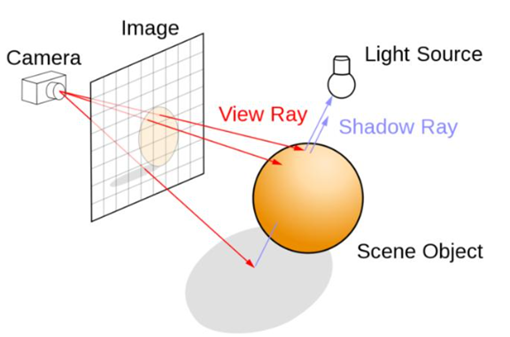
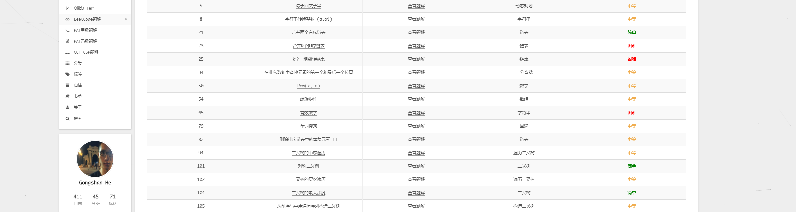
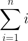
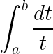

# book 全局光照技术


# 蒙特卡洛积分


# 记录

选择了这样一幅题图, 因为计算机图形学这个学科, 无非是在和"眼"打交道, 让计算机来生成图像, 让计算机来生成动画, 让计算机来从图像中提取信息, 可以说, 凡是和视觉有关的东西, 都能够成为这个学科研究的目标.

从诞生以来, 这个学科有了快速和辉煌的发展. 这30年来, 我们所取得的成就:

[](https://www.zhihu.com/question/389058916)

https://zhuanlan.zhihu.com/p/26683511

https://zhuanlan.zhihu.com/p/23239884


# 张心欣

https://zhuanlan.zhihu.com/p/23239884

# TODO vim cmake


# archlinux 安装记录

https://stackoom.com/question/27EEK/%E5%A6%82%E4%BD%95%E5%9C%A8Arch-Linux%E4%B8%AD%E5%AE%89%E8%A3%85dwm | linux - 如何在Arch Linux中安装dwm - 堆栈内存溢出
https://www.bilibili.com/video/av94563820/ | Arch Linux 上 Dynamic Window Manager (DWM) 的安装和配置_哔哩哔哩 (゜-゜)つロ 干杯~-bilibili
https://space.bilibili.com/505839682 | LinuxTube的个人空间 - 哔哩哔哩 ( ゜- ゜)つロ 乾杯~ Bilibili
https://www.bilibili.com/video/BV1B7411G7Xk | 虚拟机安装Arch Linux 发行版_哔哩哔哩 (゜-゜)つロ 干杯~-bilibili
https://space.bilibili.com/505839682 | LinuxTube的个人空间 - 哔哩哔哩 ( ゜- ゜)つロ 乾杯~ Bilibili
https://i.linuxtoy.org/files/pdf/ArchlinuxGuide.pdf | 打造完美的 Linux 桌面──Archlinux 2007.08-2
https://k2.work/8269 | https://k2.work/8269
https://k2.work/8269 | https://k2.work/8269
https://joydig.com/arch-linux-installation-and-configuration/ | Arch Linux 安装配置备忘 – 采蕨
https://www.google.com/search?q=Xorg | Xorg - Google 搜索
https://stackoverflow.com/questions/31275672/how-to-install-dwm-in-arch-linux | archlinux - How to install dwm in Arch Linux - Stack Overflow
http://www.nbyoho.com/news/arch%E5%AE%89%E8%A3%85dwm%E7%AA%97%E5%8F%A3%E7%AE%A1%E7%90%86%E5%99%A8 | arch安装dwm窗口管理器 - 宁波新闻网
https://www.csdn.net/gather_23/MtTacgzsOTMyNTctYmxvZwO0O0OO0O0O.html | dwm安装 - CSDN
https://zhuanlan.zhihu.com/p/137761177 | 笔记-安装archlinux之后 - 知乎
https://www.bilibili.com/video/av94563820/ | Arch Linux 上 Dynamic Window Manager (DWM) 的安装和配置_哔哩哔哩 (゜-゜)つロ 干杯~-bilibili
https://www.bbsmax.com/A/kmzLAAwBJG/ | ArchLinux dwm的安装和配置
https://juejin.im/post/6844904021520089102 | #Archlinux 安装完后需要做的事情 - 掘金
https://www.shuzhiduo.com/R/kmzLAAwBJG/ | ArchLinux dwm的安装和配置 - 相关文章
https://juejin.im/post/6844904021520089102 | #Archlinux 安装完后需要做的事情 - 掘金
https://dwm.suckless.org/ | dwm - dynamic window manager | suckless.org software that sucks less
https://www.cnblogs.com/tanglizi/p/8457821.html | ArchLinux dwm的安装和配置 - 糖栗子 - 博客园

https://blog.csdn.net/u014695839/article/details/84554606 | NetworkManager——nmcli命令连接WIFI、以太网和创建热点_培培哥的专栏-CSDN博客
https://blog.csdn.net/liujiandu101/article/details/82949134 | Linux_ubuntu16.04 无线/Wifi 上网速度慢的解决方法_liujiandu101的博客-CSDN博客
https://support.huaweicloud.com/topic/96235-1-S | 设置开机启动 networkmanager_帮助文档-华为云
https://support.huaweicloud.com/bestpractice-ims/ims_bp_0026.html | 配置NetworkManager_镜像服务 IMS_最佳实践_基于VirtualBox使用ISO创建Linux镜像_配置虚拟机_华为云
https://support.huaweicloud.com/topic/96235-1-S | 设置开机启动 networkmanager_帮助文档-华为云
https://developer.gnome.org/NetworkManager/stable/nmcli.html | nmcli: NetworkManager Reference Manual
https://blog.csdn.net/weixin_38076419/article/details/70148502?utm_medium=distribute.pc_relevant.none-task-blog-title-4&spm=1001.2101.3001.4242 | network、nmcli_weixin_38076419的博客-CSDN博客
https://blog.csdn.net/Swallow_he/article/details/87628465?utm_medium=distribute.pc_relevant.none-task-blog-title-2&spm=1001.2101.3001.4242 | 使用nmcli network-manager管理wifi网络_Swallow_he的博客-CSDN博客
https://blog.csdn.net/weixin_34138056/article/details/86119113?utm_medium=distribute.pc_relevant.none-task-blog-BlogCommendFromMachineLearnPai2-2.channel_param&depth_1-utm_source=distribute.pc_relevant.none-task-blog-BlogCommendFromMachineLearnPai2-2.channel_param | NetworkManager——Linux强大的网络管理工具_weixin_34138056的博客-CSDN博客
https://blog.csdn.net/xtggbmdk/article/details/80921606 | 关于 NetworkManager service_xtggbmdk的博客-CSDN博客
https://zhuanlan.zhihu.com/p/52731316 | NetworkManager设置 - 知乎
https://wiki.centos.org/zh/HowTos/Laptops/NetworkManager | zh/HowTos/Laptops/NetworkManager - CentOS Wiki
https://blog.csdn.net/qq_20252351/article/details/93725510?utm_medium=distribute.pc_relevant.none-task-blog-BlogCommendFromMachineLearnPai2-1.channel_param&depth_1-utm_source=distribute.pc_relevant.none-task-blog-BlogCommendFromMachineLearnPai2-1.channel_param | 【转】NetworkManager nmcli学习（热点）_qq_20252351的博客-CSDN博客
https://www.google.com/search?q=nmcli | nmcli - Google 搜索
https://linuxhint.com/arch_linux_network_manager/ | How to Use Arch Linux Network Manager – Linux Hint
https://evilshit.wordpress.com/2012/09/15/how-to-make-networkmanager-and-network-manager-applet-work-on-arch-linux-with-gnome3/ | How to install and configure NetworkManager and network-manager-applet on Arch Linux with Gnome3 | Linux M0nk3ys
https://pacesettergraam.wordpress.com/2018/12/31/error-networkmanager-is-not-running-arch-linux/ | Error: NetworkManager is not running. – Arch Linux | pacesettergraam
https://support.huaweicloud.com/topic/96235-1-S | 设置开机启动 networkmanager_帮助文档-华为云
https://wiki.centos.org/zh/HowTos/Laptops/NetworkManager | zh/HowTos/Laptops/NetworkManager - CentOS Wiki
https://www.linuxidc.com/Linux/2019-10/161211.htm | 如何在RHEL/CentOS 8中使用NetworkManager管理网络_Linux教程_Linux公社-Linux系统门户网站
https://access.redhat.com/documentation/zh-cn/red_hat_enterprise_linux/7/html/networking_guide/sec-installing_networkmanager | 1.4. 安装 NetworkManager Red Hat Enterprise Linux 7 | Red Hat Customer Portal
https://blog.csdn.net/u014695839/article/details/84554606 | NetworkManager——nmcli命令连接WIFI、以太网和创建热点_培培哥的专栏-CSDN博客
https://access.redhat.com/documentation/zh-cn/red_hat_enterprise_linux/7/html/networking_guide/sec-network_config_using_nmcli | 1.6. 使用 NetworkManager 的 CLI（nmcli）进行网络配置 Red Hat Enterprise Linux 7 | Red Hat Customer Portal
https://access.redhat.com/documentation/zh-cn/red_hat_enterprise_linux/7/html/networking_guide/sec-using_the_networkmanager_command_line_tool_nmcli | 2.3. 使用 NetworkManager 命令行工具 nmcli Red Hat Enterprise Linux 7 | Red Hat Customer Portal
https://www.google.com/search?sxsrf=ALeKk03IXkakhaV2oo5lZDWm0Ut9CfQxHg%3A1600325149699&ei=HQZjX8GyKoWfmgfW45PQBA&q=nmcli+%E8%BF%9E%E6%8E%A5wifi&oq=nmcli+%E8%BF%9E%E6%8E%A5&gs_lcp=CgZwc3ktYWIQAxgAMgIIADoECAAQRzoFCAAQywE6BwgjELECECc6BAgAEENQrwpYoB5g2CxoAHACeACAAZcDiAGlGJIBBTMtOC4xmAEAoAEBqgEHZ3dzLXdpesgBBcABAQ&sclient=psy-ab | nmcli 连接wifi - Google 搜索
https://blog.csdn.net/u014695839/article/details/84554606 | NetworkManager——nmcli命令连接WIFI、以太网和创建热点_培培哥的专栏-CSDN博客
https://blog.csdn.net/weixin_44690437/article/details/105850314 | arch linux dde 桌面WiFi频繁断线重连_weixin_44690437的博客-CSDN博客
https://bbs.archlinuxcn.org/viewtopic.php?id=4929 | 在arch下的wifi网速很慢 / 网络相关 / Arch Linux 中文论坛

https://www.google.com/search?sxsrf=ALeKk01fXWlt88CvkROweuZAR0z5h4TSYw%3A1600312916027&ei=VNZiX-GWAYfW0gTkkZbIBA&q=iwctl+%E6%89%93%E5%BC%80%E7%BD%91%E5%8D%A1&oq=iwctl+%E6%89%93%E5%BC%80%E7%BD%91%E5%8D%A1&gs_lcp=CgZwc3ktYWIQAzoGCCMQJxATOgQIABAKOgIIADoFCAAQywE6BAgAEA06BggAEA0QCjoHCCEQChCgAVCGBljLJ2DsKGgFcAB4AYABjAKIAY8YkgEGMC4zLjExmAEAoAEBqgEHZ3dzLXdpesABAQ&sclient=psy-ab&ved=0ahUKEwjhkI6Xnu_rAhUHq5QKHeSIBUkQ4dUDCA0&uact=5 | iwctl 打开网卡 - Google 搜索
https://www.jianshu.com/p/b1e4b99032ef | archlinux 安装前的网络设置 静态IP DHCP 无线WIFI - 简书
https://zhuanlan.zhihu.com/p/157260502 | Archlinux最新安装教程：2020-07 - 知乎
https://xuanwo.io/2019/06/13/switch-to-systemd-networkd/ | 从 netctl 切换到 systemd-networkd


# mathjax 换行问题

加//转义

https://www.google.com.hk/search?q=mathjax+%E5%85%AC%E5%BC%8F%E6%97%A0%E6%B3%95%E6%8D%A2%E8%A1%8C&oq=mathjax+%E5%85%AC%E5%BC%8F%E6%97%A0%E6%B3%95%E6%8D%A2%E8%A1%8C&aqs=chrome..69i57j0j69i60l2.15522j0j1&sourceid=chrome&ie=UTF-8 | mathjax 公式无法换行 - Google 搜索
https://github.com/flysnow-org/maupassant-hugo/issues/21 | $$Tex code$$, 块内公式换行问题，请问你们是怎样解决的呢？ · Issue #21 · flysnow-org/maupassant-hugo
https://github.com/blinkfox/hexo-theme-matery/issues/119 | MathJax无法渲染多行公式（包含解决方案） · Issue #119 · blinkfox/hexo-theme-matery
https://github.com/Molunerfinn/hexo-theme-melody | Molunerfinn/hexo-theme-melody: A simple & beautiful & fast theme for Hexo.
https://spiffyeight77.github.io/ | Site not found · GitHub Pages
https://msainaction.github.io/ | 基于Dubbo、Spring Cloud和ServiceMesh | 高可用可伸缩微服务架构
http://www.leiline.cn/ | 知道你要去很远的地方，但请一定记得回头看看 | 李林林的精神驿站
https://i-m.dev/posts/20190304-210101.html | Hexo+NexT使用MathJax问题 | I'm dev
https://www.zhihu.com/question/41004272 | 如何使用mathjax在手机上显示数学公式使其自动换行？ - 知乎
https://group.cnblogs.com/topic/78127.html | mathjax数学公式不能换行 - 问题反馈 - 小组 - 博客园
https://group.cnblogs.com/topic/78127.html | mathjax数学公式不能换行 - 问题反馈 - 小组 - 博客园
http://kubicode.me/2016/03/18/Hexo/The-Trick-about-Hexo-Support-MutliLine-Equation-using-Mathjax/ | [小技巧]让Hexo在使用Mathjax时支持多行公式 | Kubi Code'Blog
https://blog.csdn.net/xm_ovo/article/details/107536132 | (17条消息) 解决mathjax公式不换行问题_xm_ovo的博客-CSDN博客

# hugo 科研

https://zhuanlan.zhihu.com/p/141249465


# hugo 模板 

[模板](https://blog.pytool.com/language/golang/hugo/hugo-template/)

[Hugo 不完美教程 - V: Templates 模板机制](https://www.jianshu.com/p/e1f9123c721a)


https://www.google.com.hk/search?newwindow=1&safe=strict&ei=3j-6X5npKtrh-Aaeuq2oDg&q=hugo+%E6%8C%87%E5%AE%9A%E6%A8%A1%E6%9D%BF&oq=hugo+%E6%8C%87%E5%AE%9A%E6%A8%A1%E6%9D%BF&gs_lcp=CgZwc3ktYWIQAzoCCAA6BAgAEAw6BAgAEAo6BQghEKABUPSWAljXugJgvbsCaAFwAHgBgAGfBIgBjSeSAQowLjcuMTEuNS0ymAEAoAEBqgEHZ3dzLXdpesABAQ&sclient=psy-ab&ved=0ahUKEwiZ0M-I-5XtAhXaMN4KHR5dC-UQ4dUDCA0&uact=5 | hugo 指定模板 - Google 搜索
https://cloud.tencent.com/developer/article/1624402 | Hugo + Coding 搭建个人博客 - 云+社区 - 腾讯云
https://tonybai.com/2015/09/23/intro-of-gohugo/ | 使用Hugo搭建静态站点 | Tony Bai
https://tonybai.com/2014/09/29/a-channel-compendium-for-golang/ | Golang Channel用法简编 | Tony Bai
https://gohugo.io/templates/introduction/ | Introduction to Hugo Templating | Hugo
https://www.google.com.hk/search?q=%E5%AE%98%E6%96%B9%E8%AF%A6%E7%BB%86%E7%9A%84manual | 官方详细的manual - Google 搜索
https://zhuanlan.zhihu.com/p/141249465 | 科研利器 - 知乎
https://jianghd1996.github.io/ | Hongda Jiang
https://github.com/amzrk2/hugo-theme-fuji/blob/master/README_CN.md | hugo-theme-fuji/README_CN.md at master · amzrk2/hugo-theme-fuji
http://blog.sciencenet.cn/blog-255662-1062913.html | 科学网—用HUGO生成静态网站 - 张金龙的博文
https://jeshs.github.io/2019/01/hugo%E6%90%AD%E5%BB%BA%E5%8D%9A%E5%AE%A2/ | Hugo搭建博客
https://www.gohugo.org/doc/overview/quickstart/ | Hugo 快速开始指引 - Hugo中文文档
https://hugo.aiaide.com/post/hugo%E6%A8%A1%E6%9D%BF%E7%9A%84%E5%9F%BA%E6%9C%AC%E8%AF%AD%E6%B3%95/ | Hugo模板的基本语法 - Hugo 中文帮助文档
https://www.jianshu.com/p/e1f9123c721a | Hugo 不完美教程 - V: Templates 模板机制 - 简书
https://www.jianshu.com/go-wild?ac=2&url=https%3A%2F%2Fjimboyeah.github.io%2F | 简书
https://jimboyeah.github.io/ | Let's Go... | Go Learning
https://www.jianshu.com/go-wild?ac=2&url=https%3A%2F%2Fjimbowhy.gitee.io%2F | 简书
https://jimbowhy.gitee.io/tutorials/ch01-hugo-web-framework/ | I: Hugo Web Framework | Go Learning
https://blog.pytool.com/language/golang/hugo/hugo-template/ | Hugo 模板template
https://hanchuntao.github.io/articles/how-to-use-hugo/ | hugo的使用 - hanchuntao demo
https://www.gohugo.org/post/coderzh-hugo/ | 使用hugo搭建个人博客站点 - Hugo中文文档
https://blog.csdn.net/weixin_34037977/article/details/93164028 | (17条消息) Hugo创建个人博客指南_weixin_34037977的博客-CSDN博客
https://blog.csdn.net/u011138254/article/details/89441882 | (17条消息) 使用hugo制作静态个人界面_u011138254的博客-CSDN博客
https://hugo.aiaide.com/ | Hugo 中文帮助文档
https://kuang.netlify.app/blog/hugo.html | 风月
https://www.coder.work/article/6391255 | markdown - 在Hugo / Markdown页面中如何包含另一个文件？ - IT工具网
https://cpurely.github.io/post/hugo%E5%A6%82%E4%BD%95%E6%B7%BB%E5%8A%A0about%E5%92%8C%E8%87%AA%E5%AE%9A%E4%B9%89%E9%A1%B5%E9%9D%A2/ | Hugo如何添加about和自定义页面 - 后院池塘
https://hugo.aiaide.com/post/%E8%87%AA%E5%AE%9A%E4%B9%89hugo%E4%B8%BB%E9%A2%98-%E5%86%85%E5%AE%B9%E5%88%97%E8%A1%A8%E9%A1%B5/ | 自定义hugo主题--内容列表页 - Hugo 中文帮助文档
https://www.thinbug.com/q/39539812 | 如何在Hugo / Markdown页面中包含其他文件？ - Thinbug
https://blog.csdn.net/weixin_44397907/article/details/99621517 | (17条消息) hugo的基本用法和页面改造_风幕浦的博客-CSDN博客
https://stackoverrun.com/cn/q/10892378 | 如何将其他文件包含在Hugo/Markdown页面中？

# hugo 页面改造


# markdown

根据设计，markdown[允许将HTML包含在markdown文本中](https://daringfireball.net/projects/markdown/syntax#html)。这也意味着它可能包含Javascript和CSS样式。这样可以非常灵活地创建不受markdown语法限制的输出，但是如果将用户输入解析为markdown，则会带来安全风险（请参阅[XSS](https://en.wikipedia.org/wiki/Cross-site_scripting)）。

在这种情况下，您应该使用[HTML Purifier之](http://htmlpurifier.org/)类的工具处理markdown转换的结果，该工具 会过滤掉不允许用户添加的所有元素。

markdown的[允许元素](http://htmlpurifier.org/live/configdoc/plain.html#HTML.AllowedElements)列表可以配置为：

```
[
     'h1'，'h2'，'h3'，'h4'，'h5'，'h6'，
     'hr'，
     'pre'，'code'，
     'blockquote'，
     'table'，'tr'，' td'，'th'，'thead'，'tbody'，
     'strong'，'em'，'b'，'i'，'u'，'s' ，'span'，
     'a'，'p'，'br'，'nobr'，
     'ul'，'ol'，'li'，
     'img'，
]，
```

[允许的属性](http://htmlpurifier.org/live/configdoc/plain.html#HTML.AllowedAttributes)列表为：

```
[ 'th.align'，'td.align'，'ol.start'，'code.class' ]
```

以上配置是一般建议，可能需要根据您的需要进行调整。


By design markdown [allows HTML to be included within the markdown text](https://daringfireball.net/projects/markdown/syntax#html). This also means that it may contain Javascript and CSS styles. This allows to be very flexible for creating output that is not limited by the markdown syntax, but it comes with a security risk if you are parsing user input as markdown (see [XSS](https://en.wikipedia.org/wiki/Cross-site_scripting)).

In that case you should process the result of the markdown conversion with tools like [HTML Purifier](http://htmlpurifier.org/) that filter out all elements which are not allowed for users to be added.

The list of [allowed elements](http://htmlpurifier.org/live/configdoc/plain.html#HTML.AllowedElements) for markdown could be configured as:

```
[
    'h1', 'h2', 'h3', 'h4', 'h5', 'h6',
    'hr',
    'pre', 'code',
    'blockquote',
    'table', 'tr', 'td', 'th', 'thead', 'tbody',
    'strong', 'em', 'b', 'i', 'u', 's', 'span',
    'a', 'p', 'br', 'nobr',
    'ul', 'ol', 'li',
    'img',
],
```

The list of [allowed attributes](http://htmlpurifier.org/live/configdoc/plain.html#HTML.AllowedAttributes) would be:

```
['th.align', 'td.align', 'ol.start', 'code.class']
```

The above configuration is a general recommendation and may need to be adjusted dependent on your needs.

## Extensions

Here are some extensions to this library:

- [Bogardo/markdown-codepen](https://github.com/Bogardo/markdown-codepen) - shortcode to embed codepens from http://codepen.io/ in markdown.
- [cebe/markdown-latex](https://github.com/cebe/markdown-latex) - Convert Markdown to LaTeX and PDF
- [softark/creole](https://github.com/softark/creole) - A creole markup parser
- [hyn/frontmatter](https://github.com/hyn/frontmatter) - Frontmatter Metadata Support (JSON, TOML, YAML)
- ... [add yours!](https://github.com/cebe/markdown/edit/master/README.md#L186)

# hugo 静态博客下载文件

# vscode 插件位置

# markdown上标下标相关信息

# 浏览器相关知识


# cmake 自定义findpackage


# cmake 环境变量


# cmake get_filename_component

https://cmake.org/cmake/help/latest/command/get_filename_component.html


https://github.com/microsoft/DirectXShaderCompiler/blob/master/cmake/modules/FindD3D12.cmake


# 环境变量的 作用


# Win10 sdk 路径	


# [Finding Direct3D 12 using CMake](https://stackoverflow.com/questions/48955632/finding-direct3d-12-using-cmake)

[Ask Question](https://stackoverflow.com/questions/ask)


https://github.com/Microsoft/DirectXShaderCompiler/blob/master/cmake/modules/FindD3D12.cmake


# vim cmake插件


# cmake find windows kits


# cmake find windows sdk


# highlight 复制代码

# clipboard.js 代码复制 

https://github.com/zenorocha/clipboard.js


# 深入理解计算机系统


# css 背景色 和页面颜色 	

例如



# leetcode 题解

https://www.hegongshan.com/leetcode/


# math jax


# latex math 速查


https://www.google.com.hk/search?newwindow=1&safe=strict&ei=ztq5X_3cCJv6wAPJ5JrQDw&q=latex+math+%E6%89%8B%E5%86%8C&oq=latex+math+%E6%89%8B%E5%86%8C&gs_lcp=CgZwc3ktYWIQAzIHCCEQChCgATIHCCEQChCgAToECAAQQzoCCAA6BAgAEB46BggAEAgQHjoICAAQCBAKEB5Q67jZAVj9ztkBYILQ2QFoAHABeACAAccDiAH-G5IBCjAuMTAuNC4xLjGYAQCgAQGqAQdnd3Mtd2l6wAEB&sclient=psy-ab&ved=0ahUKEwj9-8_XmpXtAhUbPXAKHUmyBvoQ4dUDCA0&uact=5 | latex math 手册 - Google 搜索
https://zhuanlan.zhihu.com/p/59412540 | 使用Markdown输出LaTex数学公式 - 知乎
https://blog.csdn.net/lishoubox/article/details/7270556 | (17条消息) LaTeX命令速查手册1_lishoubox的专栏-CSDN博客
https://xiaoy.github.io/2018/03/11/Latex-Math/ | Latex数学速查手册 - Graphic | Light | 武龙飞 | 图形学 | opengl | vulkan | math
https://ctan.math.illinois.edu/macros/latex/contrib/thucoursework/thucoursework.pdf | violetThuCoursework：清华大学课程作业模板
https://www.cnblogs.com/by-sknight/p/12093871.html | MarkDown Latex 数学符号手册（链接） - by-sknight - 博客园
http://www.domuse.com/markdown-and-latex-equation-handbook.html | Leon's blog – Markdown语法和LaTeX数学记号速查手册
https://www.caam.rice.edu/~heinken/latex/symbols.pdf | symbols.pdf
http://static.latexstudio.net/article/2019/0204/amsmath-guide-zh-cn.pdf | amsmath包使用手册
http://math.ecnu.edu.cn/~jypan/Latex/Latex03_math.pdf | Latex03_math.pdf


# latex math 记录


# latex math

上下标

希腊字母

组 

括号

求和和积分

分数

求根

特殊函数

矢量

矩阵

分段函数


$$
\sum_{i=0}^n i^2 = \frac{(n^2+n)(2n+1)}{6}
$$


https://www.zhihu.com/question/26887527

# hugo  math 公式换行的问题

hugo 可以更换pandoc

[](https://jdhao.github.io/2018/10/10/hexo_to_hugo/#%E5%A6%82%E4%BD%95%E5%AE%8C%E7%BE%8E%E6%94%AF%E6%8C%81-latex-%E5%85%AC%E5%BC%8F)

[](https://github.com/olOwOlo/hugo-theme-even/issues/139)

[](https://github.com/flysnow-org/maupassant-hugo/issues/21)

# latex math 在线编译器

http://latex.codecogs.com/eqneditor/editor.php


# latex math 手册

[莱斯大学LaTex Math在线PDF手册](https://www.caam.rice.edu/~heinken/latex/symbols.pdf)。

# markdown math

| 大写希腊符号 | 小写希腊符号 | 大写转义符号 | 小写转移符号 | 大写效果 | 小写效果 |
| ------------ | ------------ | ------------ | ------------ | -------- | -------- |
| Α            | α            |              | \alpha       |          | αα       |
| Β            | β            |              | \beta        |          | ββ       |
| Γ            | γ            | \Gamma       | \gamma       | ΓΓ       | γγ       |
| Δ            | δ            | \Delta       | \delta       | ΔΔ       | δδ       |
|              | ε            | \Epsilon     | \epsilon     |          | ϵϵ       |
|              | ζ            | \            | \zeta        |          | ζζ       |
|              | η            | \            | \eta         |          | ηη       |
| Θ            | θ            | \Theta       | \theta       | ΘΘ       | θθ       |
|              | ι            | \            | \iota        |          | ιι       |
|              | κ            | \            | \kappa       |          | κκ       |
| ∧            | λ            | \Lambda      | \lambda      | ΛΛ       | λλ       |
|              | μ            | \            | \mu          |          | μμ       |
|              | ν            | \            | \nu          |          | νν       |
| Ξ            | ξ            | \Xi          | \xi          | ΞΞ       | ξξ       |
|              | ο            | \omicron     | \            |          | οο       |
| ∏            | π            | \Pi          | \pi          | ΠΠ       | ππ       |
|              | ρ            | \            | \rho         |          | ρρ       |
| ∑            | σ            | \Sigma       | \sigma       | ΣΣ       | σσ       |
|              | τ            | \            | \tau         |          | ττ       |
|              | υ            | \            | \upsilon     |          | υυ       |
| Φ            | φ            | \Phi         | \phi         | ΦΦ       | ϕϕ       |
|              | χ            | \            | \chi         |          | χχ       |
| Ψ            | ψ            | \Psi         | \psi         | ΨΨ       | ψψ       |
| Ω            | ω            | \Omega       | \omega       | ΩΩ       | ω        |


| 转义符号                            | 效果                       |
| ----------------------------------- | -------------------------- |
| \log_{x}y = \arccos z               | logxy=arccoszlogx⁡y=arccos⁡z |
| \frac{a} {b}                        | abab                       |
| _{a}^{b}\textrm{C}                  | baCabC                     |
| \frac{\partial {z_x}}{\partial x}   | ∂zx∂x∂zx∂x                 |
| \frac{\partial^2 {x}}{\partial x^2} | ∂2x∂x2∂2x∂x2               |
| \frac{\mathrm{d} y}{\mathrm{d} x}   | dydxdydx                   |
| \int x                              | ∫x∫x                       |
| \int_{a}^{b}x                       | ∫bax∫abx                   |
| \oint a                             | ∮a∮a                       |
| \oint_{a}^{b}C                      | ∮baC∮abC                   |
| \iint_{a}^{v}C                      | ∬vaC∬avC                   |
| \bigcap A                           | ⋂A⋂A                       |
| \bigcap_{a}^{b}C                    | ⋂baC⋂abC                   |
| \bigcup c                           | ⋃c⋃c                       |
| \bigcup_{a}^{b}C                    | ⋃baC⋃abC                   |
| \lim_{c}X                           | limcXlimcX                 |
| \sum a                              | ∑a∑a                       |
| \sum_{a}^{b}C                       | ∑baC∑abC                   |
| \sqrt{X}                            | X−−√X                      |
| \sqrt[a]{X}                         | X−−√aXa                    |
| \prod X                             | ∏X∏X                       |
| \prod_{a}^{b} X                     | ∏baX∏abX                   |
| \coprod X                           | ∐X∐X                       |
| \coprod_{a}^{b} X                   | ∐baX∐abX                   |
| \left [ a \right ]                  | [a][a]                     |
| \left ( a\right )                   | (a)(a)                     |
| \left { a \right }                  | {a}{a}                     |
| \left                               | a \right                   |
| \left \| a \right \|                | ∥a∥‖a‖                     |
| \left \langle a \right \rangle      | ⟨a⟩⟨a⟩                     |
| \left \lfloor a \right \rfloor      | ⌊a⌋⌊a⌋                     |
| \left \lceil a \right \rceil        | ⌈a⌉⌈a⌉                     |
| \left.{ a \right }                  | {a}{a}                     |
| \in A                               | ∈A∈A                       |
| \supseteqq A                        | ⫆A                         |


$   {\color{Red} \sum_{i=0}^n i^2 = \frac{(n^2+n)(2n+1)}{6}x} {\color{Green} x} {\color{Yellow} z}   $


| 转移符号            | 效果 |
| ------------------- | ---- |
| {\color{Red} 1}     | 11   |
| {\color{Green} 2}   | 22   |
| {\color{Blue} 3}    | 33   |
| {\color{Yellow} 4}  | 44   |
| {\color{Cyan} 5}    | 55   |
| {\color{Magenta} 6} | 66   |
| {\color{Teal} 7}    | 77   |
| {\color{Orange} 8}  | 88   |
| {\color{Pink} 9}    | 9    |

https://www.jianshu.com/p/d9a5a1c694b4


希腊字母语法

$\Gamma$、$\iota$、$\sigma$、$\phi$、$\upsilon$、$\Pi$、$\Bbbk$、$\heartsuit$、$\int$、$\oint$

三角函数对数指数

$\tan$、$\sin$、$\cos$、$\lg$、$\arcsin$、$\arctan$、$\min$、$\max$、$\exp$、$\log$

运算符

$\tan$、$\sin$、$\cos$、$\lg$、$\arcsin$、$\arctan$、$\min$、$\max$、$\exp$、$\log$

集合符号

$\cup$、$\cap$、$\in$、$\notin$、$\ni$、$\subset$、$\subseteq$、$\supset$、$\supseteq$、$\infty$


函数式

$f(x)=\frac{P(x)}{Q(x)}$  

$$
f(x)=\frac{P(x)}{Q(x)}
$$
简单的四则运算

$2x - 5y =  8$   

$3x + 9y =  -12$

 $7x \times 2y \neq 3z$


指数输出

$x^3+x^9$   $x^y$  

三角公式
$$
\cos (2\theta) = \cos^2 \theta - \sin^2 \theta
$$
分数
$$
\frac{x}{2y} +\frac{x-y}{x+y}
$$
求和
$$
\sum_{n=1}^\infty k
$$


极限
$$
\lim\limits_{x \to \infty} \exp(-x) = 0
$$
阶乘
$$
frac{n!}{k!(n-k)!} = \binom{n}{k}
$$


矩阵
$$
\begin{matrix}
   1 & 2 & 3 \\
   4 & 5 & 6 \\
   7 & 8 & 9
  \end{matrix}
$$


分段函数
$$
X(m,n)=
\begin{cases}
x(n),\\
x(n-1)\\
x(n-1)
\end{cases}
$$


# MathNoteBook-master

https://github.com/latexstudio/MathNoteBook


***


$$

$$


# latex math

$$
\qquad $\mathbb{N}={{1, 2, 3, \ldots }}
$$


# Upmath: Math Online Editor
### _Create web articles and&nbsp;blog posts with&nbsp;equations and&nbsp;diagrams_

Upmath extremely simplifies this task by using Markdown and LaTeX. It converts the Markdown syntax extended with LaTeX equations support into HTML code you can publish anywhere on the web.


## Markdown

Definition from [Wikipedia](https://en.wikipedia.org/wiki/Markdown):

> Markdown is a lightweight markup language with plain text formatting syntax designed so that it can be converted to HTML and many other formats using a tool by the same name. Markdown is often used to format readme files, for writing messages in online discussion forums, and to create rich text using a plain text editor.

The main idea of Markdown is to use a simple plain text markup. It's ~~hard~~ easy to __make__ **bold** _or_ *italic* text. Simple equations can be formatted with subscripts and superscripts: *E*~0~=*mc*^2^. I have added the LaTeX support: $$E_0=mc^2$$.

Among Markdown features are:

* images (see above);
* links: [service main page](/ "link title");
* code: `untouched equation source is *E*~0~=*mc*^2^`;
* unordered lists--when a line starts with `+`, `-`, or `*`;
  1. sub-lists
  1. and ordered lists too;
* direct use <nobr>of HTML</nobr>&ndash;for <span style="color: red">anything else</span>. 

In addition, Upmath supports typographic replacements: (c) (r) (tm) (p) +- !!!!!! ???? ,,  -- ---

## LaTeX

Upmath converts LaTeX equations in double-dollars `$$`: $$ax^2+bx+c=0$$. All equations are rendered as block equations. If you need inline ones, you can add the prefix `\inline`: $$\inline p={1\over q}$$. Place big equations on separate lines:

$$x_{1,2} = {-b\pm\sqrt{b^2 - 4ac} \over 2a}.$$

In this case the LaTeX syntax will be highlighted in the source code. You can even add equation numbers (unfortunately there is no automatic numbering and refs support):

$$|\vec{A}|=\sqrt{A_x^2 + A_y^2 + A_z^2}.$$(1)

It is possible to write Cyrillic symbols in `\text` command: $$Q_\text{плавления}>0$$.

One can use matrices:

$$T^{\mu\nu}=\begin{pmatrix}
\varepsilon&0&0&0\\
0&\varepsilon/3&0&0\\
0&0&\varepsilon/3&0\\
0&0&0&\varepsilon/3
\end{pmatrix},$$

integrals:

$$P_\omega={n_\omega\over 2}\hbar\omega\,{1+R\over 1-v^2}\int\limits_{-1}^{1}dx\,(x-v)|x-v|,$$

cool tikz-pictures:

$$\usetikzlibrary{decorations.pathmorphing}
\begin{tikzpicture}[line width=0.2mm,scale=1.0545]\small
\tikzset{>=stealth}
\tikzset{snake it/.style={->,semithick,
decoration={snake,amplitude=.3mm,segment length=2.5mm,post length=0.9mm},decorate}}
\def\h{3}
\def\d{0.2}
\def\ww{1.4}
\def\w{1+\ww}
\def\p{1.5}
\def\r{0.7}
\coordinate[label=below:$A_1$] (A1) at (\ww,\p);
\coordinate[label=above:$B_1$] (B1) at (\ww,\p+\h);
\coordinate[label=below:$A_2$] (A2) at (\w,\p);
\coordinate[label=above:$B_2$] (B2) at (\w,\p+\h);
\coordinate[label=left:$C$] (C1) at (0,0);
\coordinate[label=left:$D$] (D) at (0,\h);
\draw[fill=blue!14](A2)--(B2)-- ++(\d,0)-- ++(0,-\h)--cycle;
\draw[gray,thin](C1)-- +(\w+\d,0);
\draw[dashed,gray,fill=blue!5](A1)-- (B1)-- ++(\d,0)-- ++(0,-\h)-- cycle;
\draw[dashed,line width=0.14mm](A1)--(C1)--(D)--(B1);
\draw[snake it](C1)--(A2) node[pos=0.6,below] {$c\Delta t$};
\draw[->,semithick](\ww,\p+0.44*\h)-- +(\w-\ww,0) node[pos=0.6,above] {$v\Delta t$};
\draw[snake it](D)--(B2);
\draw[thin](\r,0) arc (0:atan2(\p,\w):\r) node[midway,right,yshift=0.06cm] {$\theta$};
\draw[opacity=0](-0.40,-0.14)-- ++(0,5.06);
\end{tikzpicture}$$

plots:

$$\begin{tikzpicture}[scale=1.0544]\small
\begin{axis}[axis line style=gray,
	samples=120,
	width=9.0cm,height=6.4cm,
	xmin=-1.5, xmax=1.5,
	ymin=0, ymax=1.8,
	restrict y to domain=-0.2:2,
	ytick={1},
	xtick={-1,1},
	axis equal,
	axis x line=center,
	axis y line=center,
	xlabel=$x$,ylabel=$y$]
\addplot[red,domain=-2:1,semithick]{exp(x)};
\addplot[black]{x+1};
\addplot[] coordinates {(1,1.5)} node{$y=x+1$};
\addplot[red] coordinates {(-1,0.6)} node{$y=e^x$};
\path (axis cs:0,0) node [anchor=north west,yshift=-0.07cm] {0};
\end{axis}
\end{tikzpicture}$$

and [the rest of LaTeX features](https://en.wikibooks.org/wiki/LaTeX/Mathematics).

## About Upmath

* Upmath works in browsers, except equations rendered [on the server](//i.upmath.me/).
* Upmath stores your text in the browser to prevent the loss of your work in case of software or hardware failures.
* You can copy or download the text and the code converted.
* To print your documents just use the standard browser print dialog.

I have designed and developed this lightweight editor and the service for converting LaTeX equations into svg-pictures to make publishing math texts on the web easy. I consider client-side rendering, the rival technique implemented in [MathJax](https://www.mathjax.org/), to be too limited and resource-consuming, especially on mobile devices.

The source code is [published on Github](https://github.com/parpalak/upmath.me) under MIT license.

***

Now you can erase this instruction and start writing your own scientific post. If you want to see the instruction again, open the editor in a private tab, in a different browser or download and clear your post and refresh the page.

Have a nice day :)

[Roman Parpalak](https://written.ru/), web developer and UX expert.


## Examples

| LaTeX                       | Image                                                        | Generated SymPy                                              |
| --------------------------- | ------------------------------------------------------------ | ------------------------------------------------------------ |
| `x^{3}`                     | [](https://camo.githubusercontent.com/cc9149f9ad9ff3d5cd19d0b24f6b652ae1781e478690328ae0fb0183fcb25fbf/68747470733a2f2f6c617465782e636f6465636f67732e636f6d2f6769662e6c617465783f2535434c415247452532307825354525374233253744) | `x**3`                                                       |
| `\frac{d}{dx}               | t                                                            | x`                                                           |
| `\sum_{i = 1}^{n} i`        | [](https://camo.githubusercontent.com/17ed955d4e15146ac3336b208ff2cd456ac2c33d46d305a57907ec47aa43ada1/68747470733a2f2f6c617465782e636f6465636f67732e636f6d2f6769662e6c617465783f2535434c4152474525323025354373756d5f25374269253230253344253230312537442535452537426e25374425323069) | `Sum(i, (i, 1, n))`                                          |
| `\int_{a}^{b} \frac{dt}{t}` | [](https://camo.githubusercontent.com/89a87d1a4d94cb7691a0a10d42e75bdb64fe45f585ce15867b4651c76bd16f6a/68747470733a2f2f6c617465782e636f6465636f67732e636f6d2f6769662e6c617465783f2535434c41524745253230253543696e745f253742612537442535452537426225374425323025354366726163253742647425374425374274253744) | `Integral(1/t, (t, a, b))`                                   |
| `(2x^3 - x + z)             | _{x=3}`                                                      | [](https://camo.githubusercontent.com/42b265379b6b3211b09aa4443e2b9ea6f111b48f985bc56cb3cc2a03f8e55325/68747470733a2f2f6c617465782e636f6465636f67732e636f6d2f6769662e6c617465783f2535434c415247452532302532383278253545332532302d253230782532302b2532307a2532392537435f2537427825334433253744) |

## Contributing

Contributors are welcome! Feel free to open a pull request or an issue.


# Unity 教程汇总

[[教程汇总+持续更新]Unity从入门到入坟——收藏这一篇就够了](https://zhuanlan.zhihu.com/p/151238164)


https://github.com/hormanlu/CatCoding


# markdown表情

# Emoji表情

将对应emoji表情的符号码复制后输入你的markdown文本即可显示emoji表情。 如`:blush:`，显示为😊

## 人物

| syntax                           | preview                                  | syntax                           | preview                                      | syntax                 | preview                                  |
| -------------------------------- | ---------------------------------------- | -------------------------------- | -------------------------------------------- | ---------------------- | ---------------------------------------- |
| `:bowtie:`                       |        | `:smile:`                        | 😄                                            | `:laughing:`           | 😆                                        |
| `:blush:`                        | 😊                                        | `:smiley:`                       | 😃                                            | `:relaxed:`            | ☺️                                        |
| `:smirk:`                        | 😏                                        | `:heart_eyes:`                   | 😍                                            | `:kissing_heart:`      | 😘                                        |
| `:kissing_closed_eyes:`          | 😚                                        | `:flushed:`                      | 😳                                            | `:relieved:`           | 😌                                        |
| `:satisfied:`                    | 😆                                        | `:grin:`                         | 😁                                            | `:wink:`               | 😉                                        |
| `:stuck_out_tongue_winking_eye:` | 😜                                        | `:stuck_out_tongue_closed_eyes:` | 😝                                            | `:grinning:`           | 😀                                        |
| `:kissing:`                      | 😗                                        | `:kissing_smiling_eyes:`         | 😙                                            | `:stuck_out_tongue:`   | 😛                                        |
| `:sleeping:`                     | 😴                                        | `:worried:`                      | 😟                                            | `:frowning:`           | 😦                                        |
| `:anguished:`                    | 😧                                        | `:open_mouth:`                   | 😮                                            | `:grimacing:`          | 😬                                        |
| `:confused:`                     | 😕                                        | `:hushed:`                       | 😯                                            | `:expressionless:`     | 😑                                        |
| `:unamused:`                     | 😒                                        | `:sweat_smile:`                  | 😅                                            | `:sweat:`              | 😓                                        |
| `:disappointed_relieved:`        | 😥                                        | `:weary:`                        | 😩                                            | `:pensive:`            | 😔                                        |
| `:disappointed:`                 | 😞                                        | `:confounded:`                   | 😖                                            | `:fearful:`            | 😨                                        |
| `:cold_sweat:`                   | 😰                                        | `:persevere:`                    | 😣                                            | `:cry:`                | 😢                                        |
| `:sob:`                          | 😭                                        | `:joy:`                          | 😂                                            | `:astonished:`         | 😲                                        |
| `:scream:`                       | 😱                                        | `:neckbeard:`                    |      | `:tired_face:`         | 😫                                        |
| `:angry:`                        | 😠                                        | `:rage:`                         | 😡                                            | `:triumph:`            | 😤                                        |
| `:sleepy:`                       | 😪                                        | `:yum:`                          | 😋                                            | `:mask:`               | 😷                                        |
| `:sunglasses:`                   | 😎                                        | `:dizzy_face:`                   | 😵                                            | `:imp:`                | 👿                                        |
| `:smiling_imp:`                  | 😈                                        | `:neutral_face:`                 | 😐                                            | `:no_mouth:`           | 😶                                        |
| `:innocent:`                     | 😇                                        | `:alien:`                        | 👽                                            | `:yellow_heart:`       | 💛                                        |
| `:blue_heart:`                   | 💙                                        | `:purple_heart:`                 | 💜                                            | `:heart:`              | ❤️                                        |
| `:green_heart:`                  | 💚                                        | `:broken_heart:`                 | 💔                                            | `:heartbeat:`          | 💓                                        |
| `:heartpulse:`                   | 💗                                        | `:two_hearts:`                   | 💕                                            | `:revolving_hearts:`   | 💞                                        |
| `:cupid:`                        | 💘                                        | `:sparkling_heart:`              | 💖                                            | `:sparkles:`           | ✨                                        |
| `:star:`                         | ⭐                                        | `:star2:`                        | 🌟                                            | `:dizzy:`              | 💫                                        |
| `:boom:`                         | 💥                                        | `:collision:`                    | 💥                                            | `:anger:`              | 💢                                        |
| `:exclamation:`                  | ❗                                        | `:question:`                     | ❓                                            | `:grey_exclamation:`   | ❕                                        |
| `:grey_question:`                | ❔                                        | `:zzz:`                          | 💤                                            | `:dash:`               | 💨                                        |
| `:sweat_drops:`                  | 💦                                        | `:notes:`                        | 🎶                                            | `:musical_note:`       | 🎵                                        |
| `:fire:`                         | 🔥                                        | `:hankey:`                       | 💩                                            | `:poop:`               | 💩                                        |
| `::`                             | 💩                                        | `:+1:`                           | 👍                                            | `:thumbsup:`           | 👍                                        |
| `:-1:`                           | 👎                                        | `:thumbsdown:`                   | 👎                                            | `:ok_hand:`            | 👌                                        |
| `:punch:`                        | 👊                                        | `:facepunch:`                    | 👊                                            | `:fist:`               | ✊                                        |
| `:v:`                            | ✌️                                        | `:wave:`                         | 👋                                            | `:hand:`               | ✋                                        |
| `:raised_hand:`                  | ✋                                        | `:open_hands:`                   | 👐                                            | `:point_up:`           | ☝️                                        |
| `:point_down:`                   | 👇                                        | `:point_left:`                   | 👈                                            | `:point_right:`        | 👉                                        |
| `:raised_hands:`                 | 🙌                                        | `:pray:`                         | 🙏                                            | `:point_up_2:`         | 👆                                        |
| `:clap:`                         | 👏                                        | `:muscle:`                       | 💪                                            | `:metal:`              | 🤘                                        |
| `:fu:`                           | 🖕                                        | `:walking:`                      | 🚶                                            | `:runner:`             | 🏃                                        |
| `:running:`                      | 🏃                                        | `:couple:`                       | 👫                                            | `:family:`             | 👪                                        |
| `:two_men_holding_hands:`        | 👬                                        | `:two_women_holding_hands:`      | 👭                                            | `:dancer:`             | 💃                                        |
| `:dancers:`                      | 👯                                        | `:ok_woman:`                     | 🙆‍♀️                                           | `:no_good:`            | 🙅                                        |
| `:information_desk_person:`      | 💁                                        | `:raising_hand:`                 | 🙋                                            | `:bride_with_veil:`    | 👰                                        |
| `:person_with_pouting_face:`     | :person_with_pouting_face:               | `:person_frowning:`              | :person_frowning:                            | `:bow:`                | 🙇                                        |
| `:couplekiss:`                   | 💏                                        | `:couple_with_heart:`            | 💑                                            | `:massage:`            | 💆                                        |
| `:haircut:`                      | 💇                                        | `:nail_care:`                    | 💅                                            | `:boy:`                | 👦                                        |
| `:girl:`                         | 👧                                        | `:woman:`                        | 👩                                            | `:man:`                | 👨                                        |
| `:baby:`                         | 👶                                        | `:older_woman:`                  | 👵                                            | `:older_man:`          | 👴                                        |
| `:person_with_blond_hair:`       | :person_with_blond_hair:                 | `:man_with_gua_pi_mao:`          | 👲                                            | `:man_with_turban:`    | 👳‍♂️                                       |
| `:construction_worker:`          | 👷                                        | `:cop:`                          | 👮                                            | `:angel:`              | 👼                                        |
| `:princess:`                     | 👸                                        | `:smiley_cat:`                   | 😺                                            | `:smile_cat:`          | 😸                                        |
| `:heart_eyes_cat:`               | 😻                                        | `:kissing_cat:`                  | 😽                                            | `:smirk_cat:`          | 😼                                        |
| `:scream_cat:`                   | 🙀                                        | `:crying_cat_face:`              | 😿                                            | `:joy_cat:`            | 😹                                        |
| `:pouting_cat:`                  | 😾                                        | `:japanese_ogre:`                | 👹                                            | `:japanese_goblin:`    | 👺                                        |
| `:see_no_evil:`                  | 🙈                                        | `:hear_no_evil:`                 | 🙉                                            | `:speak_no_evil:`      | 🙊                                        |
| `:guardsman:`                    | 💂‍♂️                                       | `:skull:`                        | 💀                                            | `:feet:`               | 🐾                                        |
| `:lips:`                         | 👄                                        | `:kiss:`                         | 💋                                            | `:droplet:`            | 💧                                        |
| `:ear:`                          | 👂                                        | `:eyes:`                         | 👀                                            | `:nose:`               | 👃                                        |
| `:tongue:`                       | 👅                                        | `:love_letter:`                  | 💌                                            | `:bust_in_silhouette:` | 👤                                        |
| `:busts_in_silhouette:`          | 👥                                        | `:speech_balloon:`               | 💬                                            | `:thought_balloon:`    | 💭                                        |
| `:feelsgood:`                    |  | `:finnadie:`                     |        | `:goberserk:`          |  |
| `:godmode:`                      |      | `:hurtrealbad:`                  |  | `:rage1:`              |          |
| `:rage2:`                        |          | `:rage3:`                        |              | `:rage4:`              |          |
| `:suspect:`                      |      | `:trollface:`                    |      |                        |                                          |

## 自然

| syntax                   | preview | syntax                          | preview                              | syntax                           | preview    |
| ------------------------ | ------- | ------------------------------- | ------------------------------------ | -------------------------------- | ---------- |
| `:sunny:`                | ☀️       | `:umbrella:`                    | ☔                                    | `:cloud:`                        | ☁️          |
| `:snowflake:`            | ❄️       | `:snowman:`                     | ⛄                                    | `:zap:`                          | ⚡          |
| `:cyclone:`              | 🌀       | `:foggy:`                       | 🌁                                    | `:ocean:`                        | 🌊          |
| `:cat:`                  | 🐱       | `:dog:`                         | 🐶                                    | `:mouse:`                        | 🐭          |
| `:hamster:`              | 🐹       | `:rabbit:`                      | 🐰                                    | `:wolf:`                         | 🐺          |
| `:frog:`                 | 🐸       | `:tiger:`                       | 🐯                                    | `:koala:`                        | 🐨          |
| `:bear:`                 | 🐻       | `:pig:`                         | 🐷                                    | `:pig_nose:`                     | 🐽          |
| `:cow:`                  | 🐮       | `:boar:`                        | 🐗                                    | `:monkey_face:`                  | 🐵          |
| `:monkey:`               | 🐒       | `:horse:`                       | 🐴                                    | `:racehorse:`                    | 🐎          |
| `:camel:`                | 🐫       | `:sheep:`                       | 🐑                                    | `:elephant:`                     | 🐘          |
| `:panda_face:`           | 🐼       | `:snake:`                       | 🐍                                    | `:bird:`                         | 🐦          |
| `:baby_chick:`           | 🐤       | `:hatched_chick:`               | 🐥                                    | `:hatching_chick:`               | 🐣          |
| `:chicken:`              | 🐔       | `:penguin:`                     | 🐧                                    | `:turtle:`                       | 🐢          |
| `:bug:`                  | 🐛       | `:honeybee:`                    | 🐝                                    | `:ant:`                          | 🐜          |
| `:beetle:`               | 🐞       | `:snail:`                       | 🐌                                    | `:octopus:`                      | 🐙          |
| `:tropical_fish:`        | 🐠       | `:fish:`                        | 🐟                                    | `:whale:`                        | 🐳          |
| `:whale2:`               | 🐋       | `:dolphin:`                     | 🐬                                    | `:cow2:`                         | 🐄          |
| `:ram:`                  | 🐏       | `:rat:`                         | 🐀                                    | `:water_buffalo:`                | 🐃          |
| `:tiger2:`               | 🐅       | `:rabbit2:`                     | 🐇                                    | `:dragon:`                       | 🐉          |
| `:goat:`                 | 🐐       | `:rooster:`                     | 🐓                                    | `:dog2:`                         | 🐕          |
| `:pig2:`                 | 🐖       | `:mouse2:`                      | 🐁                                    | `:ox:`                           | 🐂          |
| `:dragon_face:`          | 🐲       | `:blowfish:`                    | 🐡                                    | `:crocodile:`                    | 🐊          |
| `:dromedary_camel:`      | 🐪       | `:leopard:`                     | 🐆                                    | `:cat2:`                         | 🐈          |
| `:poodle:`               | 🐩       | `:paw_prints:`                  | 🐾                                    | `:bouquet:`                      | 💐          |
| `:cherry_blossom:`       | 🌸       | `:tulip:`                       | 🌷                                    | `:four_leaf_clover:`             | 🍀          |
| `:rose:`                 | 🌹       | `:sunflower:`                   | 🌻                                    | `:hibiscus:`                     | 🌺          |
| `:maple_leaf:`           | 🍁       | `:leaves:`                      | 🍃                                    | `:fallen_leaf:`                  | 🍂          |
| `:herb:`                 | 🌿       | `:mushroom:`                    | 🍄                                    | `:cactus:`                       | 🌵          |
| `:palm_tree:`            | 🌴       | `:evergreen_tree:`              | 🌲                                    | `:deciduous_tree:`               | 🌳          |
| `:chestnut:`             | 🌰       | `:seedling:`                    | 🌱                                    | `:blossom:`                      | 🌼          |
| `:ear_of_rice:`          | 🌾       | `:shell:`                       | 🐚                                    | `:globe_with_meridians:`         | 🌐          |
| `:sun_with_face:`        | 🌞       | `:full_moon_with_face:`         | 🌝                                    | `:new_moon_with_face:`           | 🌚          |
| `:new_moon:`             | 🌑       | `:waxing_crescent_moon:`        | 🌒                                    | `:first_quarter_moon:`           | 🌓          |
| `:full_moon:`            | 🌕       | `:waning_gibbous_moon:`         | 🌖                                    | `:last_quarter_moon:`            | 🌗          |
| `:waning_crescent_moon:` | 🌘       | `:last_quarter_moon_with_face:` | 🌜                                    | `:first_quarter_moon_with_face:` | 🌛          |
| `:moon:`                 | 🌔       | `:earth_africa:`                | 🌍                                    | `:earth_americas:`               | 🌎          |
| `:earth_asia:`           | 🌏       | `:volcano:`                     | 🌋                                    | `:milky_way:`                    | 🌌          |
| `:partly_sunny:`         | ⛅       | `:octocat:`                     |  | `:squirrel:`                     | :squirrel: |
| `:waxing_gibbous_moon:`  | 🌔       |                                 |                                      |                                  |            |

## 物体

| syntax                             | preview | syntax                         | preview | syntax                     | preview |
| ---------------------------------- | ------- | ------------------------------ | ------- | -------------------------- | ------- |
| `:bamboo:`                         | 🎍       | `:gift_heart:`                 | 💝       | `:dolls:`                  | 🎎       |
| `:school_satchel:`                 | 🎒       | `:mortar_board:`               | 🎓       | `:flags:`                  | 🎏       |
| `:fireworks:`                      | 🎆       | `:sparkler:`                   | 🎇       | `:wind_chime:`             | 🎐       |
| `:rice_scene:`                     | 🎑       | `:jack_o_lantern:`             | 🎃       | `:ghost:`                  | 👻       |
| `:santa:`                          | 🎅       | `:christmas_tree:`             | 🎄       | `:gift:`                   | 🎁       |
| `:bell:`                           | 🔔       | `:no_bell:`                    | 🔕       | `:tanabata_tree:`          | 🎋       |
| `:tada:`                           | 🎉       | `:confetti_ball:`              | 🎊       | `:balloon:`                | 🎈       |
| `:crystal_ball:`                   | 🔮       | `:cd:`                         | 💿       | `:dvd:`                    | 📀       |
| `:floppy_disk:`                    | 💾       | `:camera:`                     | 📷       | `:video_camera:`           | 📹       |
| `:movie_camera:`                   | 🎥       | `:computer:`                   | 💻       | `:tv:`                     | 📺       |
| `:iphone:`                         | 📱       | `:phone:`                      | ☎️       | `:telephone:`              | ☎️       |
| `:telephone_receiver:`             | 📞       | `:pager:`                      | 📟       | `:fax:`                    | 📠       |
| `:minidisc:`                       | 💽       | `:vhs:`                        | 📼       | `:sound:`                  | 🔉       |
| `:speaker:`                        | 🔈       | `:mute:`                       | 🔇       | `:loudspeaker:`            | 📢       |
| `:mega:`                           | 📣       | `:hourglass:`                  | ⌛       | `:hourglass_flowing_sand:` | ⏳       |
| `:alarm_clock:`                    | ⏰       | `:watch:`                      | ⌚       | `:radio:`                  | 📻       |
| `:satellite:`                      | 📡       | `:loop:`                       | ➿       | `:mag:`                    | 🔍       |
| `:mag_right:`                      | 🔎       | `:unlock:`                     | 🔓       | `:lock:`                   | 🔒       |
| `:lock_with_ink_pen:`              | 🔏       | `:closed_lock_with_key:`       | 🔐       | `:key:`                    | 🔑       |
| `:bulb:`                           | 💡       | `:flashlight:`                 | 🔦       | `:high_brightness:`        | 🔆       |
| `:low_brightness:`                 | 🔅       | `:electric_plug:`              | 🔌       | `:battery:`                | 🔋       |
| `:calling:`                        | 📲       | `:email:`                      | ✉️       | `:mailbox:`                | 📫       |
| `:postbox:`                        | 📮       | `:bath:`                       | 🛀       | `:bathtub:`                | 🛁       |
| `:shower:`                         | 🚿       | `:toilet:`                     | 🚽       | `:wrench:`                 | 🔧       |
| `:nut_and_bolt:`                   | 🔩       | `:hammer:`                     | 🔨       | `:seat:`                   | 💺       |
| `:moneybag:`                       | 💰       | `:yen:`                        | 💴       | `:dollar:`                 | 💵       |
| `:pound:`                          | 💷       | `:euro:`                       | 💶       | `:credit_card:`            | 💳       |
| `:money_with_wings:`               | 💸       | `:e-mail:`                     | 📧       | `:inbox_tray:`             | 📥       |
| `:outbox_tray:`                    | 📤       | `:envelope:`                   | ✉️       | `:incoming_envelope:`      | 📨       |
| `:postal_horn:`                    | 📯       | `:mailbox_closed:`             | 📪       | `:mailbox_with_mail:`      | 📬       |
| `:mailbox_with_no_mail:`           | 📭       | `:door:`                       | 🚪       | `:smoking:`                | 🚬       |
| `:bomb:`                           | 💣       | `:gun:`                        | 🔫       | `:hocho:`                  | 🔪       |
| `:pill:`                           | 💊       | `:syringe:`                    | 💉       | `:page_facing_up:`         | 📄       |
| `:page_with_curl:`                 | 📃       | `:bookmark_tabs:`              | 📑       | `:bar_chart:`              | 📊       |
| `:chart_with_upwards_trend:`       | 📈       | `:chart_with_downwards_trend:` | 📉       | `:scroll:`                 | 📜       |
| `:clipboard:`                      | 📋       | `:calendar:`                   | 📆       | `:date:`                   | 📅       |
| `:card_index:`                     | 📇       | `:file_folder:`                | 📁       | `:open_file_folder:`       | 📂       |
| `:scissors:`                       | ✂️       | `:pushpin:`                    | 📌       | `:paperclip:`              | 📎       |
| `:black_nib:`                      | ✒️       | `:pencil2:`                    | ✏️       | `:straight_ruler:`         | 📏       |
| `:triangular_ruler:`               | 📐       | `:closed_book:`                | 📕       | `:green_book:`             | 📗       |
| `:blue_book:`                      | 📘       | `:orange_book:`                | 📙       | `:notebook:`               | 📓       |
| `:notebook_with_decorative_cover:` | 📔       | `:ledger:`                     | 📒       | `:books:`                  | 📚       |
| `:bookmark:`                       | 🔖       | `:microscope:`                 | 🔬       | `:telescope:`              | 🔭       |
| `:name_badge:`                     | 📛       | `:newspaper:`                  | 📰       | `:football:`               | 🏈       |
| `:basketball:`                     | 🏀       | `:soccer:`                     | ⚽       | `:baseball:`               | ⚾       |
| `:tennis:`                         | 🎾       | `:8ball:`                      | 🎱       | `:rugby_football:`         | 🏉       |
| `:bowling:`                        | 🎳       | `:golf:`                       | ⛳       | `:mountain_bicyclist:`     | 🚵       |
| `:bicyclist:`                      | 🚴       | `:horse_racing:`               | 🏇       | `:snowboarder:`            | 🏂       |
| `:swimmer:`                        | 🏊       | `:surfer:`                     | 🏄       | `:ski:`                    | 🎿       |
| `:spades:`                         | ♠️       | `:hearts:`                     | ♥️       | `:clubs:`                  | ♣️       |
| `:diamonds:`                       | ♦️       | `:gem:`                        | 💎       | `:ring:`                   | 💍       |
| `:trophy:`                         | 🏆       | `:musical_score:`              | 🎼       | `:musical_keyboard:`       | 🎹       |
| `:violin:`                         | 🎻       | `:space_invader:`              | 👾       | `:video_game:`             | 🎮       |
| `:black_joker:`                    | 🃏       | `:flower_playing_cards:`       | 🎴       | `:game_die:`               | 🎲       |
| `:dart:`                           | 🎯       | `:mahjong:`                    | 🀄       | `:clapper:`                | 🎬       |
| `:memo:`                           | 📝       | `:pencil:`                     | 📝       | `:book:`                   | 📖       |
| `:art:`                            | 🎨       | `:microphone:`                 | 🎤       | `:headphones:`             | 🎧       |
| `:trumpet:`                        | 🎺       | `:saxophone:`                  | 🎷       | `:guitar:`                 | 🎸       |
| `:shoe:`                           | 👞       | `:sandal:`                     | 👡       | `:high_heel:`              | 👠       |
| `:lipstick:`                       | 💄       | `:boot:`                       | 👢       | `:shirt:`                  | 👕       |
| `:tshirt:`                         | 👕       | `:necktie:`                    | 👔       | `:womans_clothes:`         | 👚       |
| `:dress:`                          | 👗       | `:running_shirt_with_sash:`    | 🎽       | `:jeans:`                  | 👖       |
| `:kimono:`                         | 👘       | `:bikini:`                     | 👙       | `:ribbon:`                 | 🎀       |
| `:tophat:`                         | 🎩       | `:crown:`                      | 👑       | `:womans_hat:`             | 👒       |
| `:mans_shoe:`                      | 👞       | `:closed_umbrella:`            | 🌂       | `:briefcase:`              | 💼       |
| `:handbag:`                        | 👜       | `:pouch:`                      | 👝       | `:purse:`                  | 👛       |
| `:eyeglasses:`                     | 👓       | `:fishing_pole_and_fish:`      | 🎣       | `:coffee:`                 | ☕       |
| `:tea:`                            | 🍵       | `:sake:`                       | 🍶       | `:baby_bottle:`            | 🍼       |
| `:beer:`                           | 🍺       | `:beers:`                      | 🍻       | `:cocktail:`               | 🍸       |
| `:tropical_drink:`                 | 🍹       | `:wine_glass:`                 | 🍷       | `:fork_and_knife:`         | 🍴       |
| `:pizza:`                          | 🍕       | `:hamburger:`                  | 🍔       | `:fries:`                  | 🍟       |
| `:poultry_leg:`                    | 🍗       | `:meat_on_bone:`               | 🍖       | `:spaghetti:`              | 🍝       |
| `:curry:`                          | 🍛       | `:fried_shrimp:`               | 🍤       | `:bento:`                  | 🍱       |
| `:sushi:`                          | 🍣       | `:fish_cake:`                  | 🍥       | `:rice_ball:`              | 🍙       |
| `:rice_cracker:`                   | 🍘       | `:rice:`                       | 🍚       | `:ramen:`                  | 🍜       |
| `:stew:`                           | 🍲       | `:oden:`                       | 🍢       | `:dango:`                  | 🍡       |
| `:egg:`                            | 🥚       | `:bread:`                      | 🍞       | `:doughnut:`               | 🍩       |
| `:custard:`                        | 🍮       | `:icecream:`                   | 🍦       | `:ice_cream:`              | 🍨       |
| `:shaved_ice:`                     | 🍧       | `:birthday:`                   | 🎂       | `:cake:`                   | 🍰       |
| `:cookie:`                         | 🍪       | `:chocolate_bar:`              | 🍫       | `:candy:`                  | 🍬       |
| `:lollipop:`                       | 🍭       | `:honey_pot:`                  | 🍯       | `:apple:`                  | 🍎       |
| `:green_apple:`                    | 🍏       | `:tangerine:`                  | 🍊       | `:lemon:`                  | 🍋       |
| `:cherries:`                       | 🍒       | `:grapes:`                     | 🍇       | `:watermelon:`             | 🍉       |
| `:strawberry:`                     | 🍓       | `:peach:`                      | 🍑       | `:melon:`                  | 🍈       |
| `:banana:`                         | 🍌       | `:pear:`                       | 🍐       | `:pineapple:`              | 🍍       |
| `:sweet_potato:`                   | 🍠       | `:eggplant:`                   | 🍆       | `:tomato:`                 | 🍅       |
| `:corn:`                           | 🌽       |                                |         |                            |         |

## 地点

| syntax                  | preview | syntax                      | preview | syntax                     | preview |
| ----------------------- | ------- | --------------------------- | ------- | -------------------------- | ------- |
| `:house:`               | 🏠       | `:house_with_garden:`       | 🏡       | `:school:`                 | 🏫       |
| `:office:`              | 🏢       | `:post_office:`             | 🏣       | `:hospital:`               | 🏥       |
| `:bank:`                | 🏦       | `:convenience_store:`       | 🏪       | `:love_hotel:`             | 🏩       |
| `:hotel:`               | 🏨       | `:wedding:`                 | 💒       | `:church:`                 | ⛪       |
| `:department_store:`    | 🏬       | `:european_post_office:`    | 🏤       | `:city_sunrise:`           | 🌇       |
| `:city_sunset:`         | 🌆       | `:japanese_castle:`         | 🏯       | `:european_castle:`        | 🏰       |
| `:tent:`                | ⛺       | `:factory:`                 | 🏭       | `:tokyo_tower:`            | 🗼       |
| `:japan:`               | 🗾       | `:mount_fuji:`              | 🗻       | `:sunrise_over_mountains:` | 🌄       |
| `:sunrise:`             | 🌅       | `:stars:`                   | 🌠       | `:statue_of_liberty:`      | 🗽       |
| `:bridge_at_night:`     | 🌉       | `:carousel_horse:`          | 🎠       | `:rainbow:`                | 🌈       |
| `:ferris_wheel:`        | 🎡       | `:fountain:`                | ⛲       | `:roller_coaster:`         | 🎢       |
| `:ship:`                | 🚢       | `:speedboat:`               | 🚤       | `:boat:`                   | ⛵       |
| `:sailboat:`            | ⛵       | `:rowboat:`                 | 🚣       | `:anchor:`                 | ⚓       |
| `:rocket:`              | 🚀       | `:airplane:`                | ✈️       | `:helicopter:`             | 🚁       |
| `:steam_locomotive:`    | 🚂       | `:tram:`                    | 🚊       | `:mountain_railway:`       | 🚞       |
| `:bike:`                | 🚲       | `:aerial_tramway:`          | 🚡       | `:suspension_railway:`     | 🚟       |
| `:mountain_cableway:`   | 🚠       | `:tractor:`                 | 🚜       | `:blue_car:`               | 🚙       |
| `:oncoming_automobile:` | 🚘       | `:car:`                     | 🚗       | `:red_car:`                | 🚗       |
| `:taxi:`                | 🚕       | `:oncoming_taxi:`           | 🚖       | `:articulated_lorry:`      | 🚛       |
| `:bus:`                 | 🚌       | `:oncoming_bus:`            | 🚍       | `:rotating_light:`         | 🚨       |
| `:police_car:`          | 🚓       | `:oncoming_police_car:`     | 🚔       | `:fire_engine:`            | 🚒       |
| `:ambulance:`           | 🚑       | `:minibus:`                 | 🚐       | `:truck:`                  | 🚚       |
| `:train:`               | 🚋       | `:station:`                 | 🚉       | `:train2:`                 | 🚆       |
| `:bullettrain_front:`   | 🚅       | `:bullettrain_side:`        | 🚄       | `:light_rail:`             | 🚈       |
| `:monorail:`            | 🚝       | `:railway_car:`             | 🚃       | `:trolleybus:`             | 🚎       |
| `:ticket:`              | 🎫       | `:fuelpump:`                | ⛽       | `:vertical_traffic_light:` | 🚦       |
| `:traffic_light:`       | 🚥       | `:warning:`                 | ⚠️       | `:construction:`           | 🚧       |
| `:beginner:`            | 🔰       | `:atm:`                     | 🏧       | `:slot_machine:`           | 🎰       |
| `:busstop:`             | 🚏       | `:barber:`                  | 💈       | `:hotsprings:`             | ♨️       |
| `:checkered_flag:`      | 🏁       | `:crossed_flags:`           | 🎌       | `:izakaya_lantern:`        | 🏮       |
| `:moyai:`               | 🗿       | `:circus_tent:`             | 🎪       | `:performing_arts:`        | 🎭       |
| `:round_pushpin:`       | 📍       | `:triangular_flag_on_post:` | 🚩       | `:jp:`                     | 🇯🇵      |
| `:kr:`                  | 🇰🇷      | `:cn:`                      | 🇨🇳      | `:us:`                     | 🇺🇸      |
| `:fr:`                  | 🇫🇷      | `:es:`                      | 🇪🇸      | `:it:`                     | 🇮🇹      |
| `:ru:`                  | 🇷🇺      | `:gb:`                      | 🇬🇧      | `:uk:`                     | 🇬🇧      |
| `:de:`                  | 🇩🇪      |                             |         |                            |         |

## 符号


| syntax                              | preview | syntax                          | preview                            | syntax                        | preview |
| ----------------------------------- | ------- | ------------------------------- | ---------------------------------- | ----------------------------- | ------- |
| `:one:`                             | 1️⃣       | `:two:`                         | 2️⃣                                  | `:three:`                     | 3️⃣       |
| `:four:`                            | 4️⃣       | `:five:`                        | 5️⃣                                  | `:six:`                       | 6️⃣       |
| `:seven:`                           | 7️⃣       | `:eight:`                       | 8️⃣                                  | `:nine:`                      | 9️⃣       |
| `:keycap_ten:`                      | 🔟       | `:1234:`                        | 🔢                                  | `:zero:`                      | 0️⃣       |
| `:hash:`                            | #️⃣       | `:symbols:`                     | 🔣                                  | `:arrow_backward:`            | ◀️       |
| `:arrow_down:`                      | ⬇️       | `:arrow_forward:`               | ▶️                                  | `:arrow_left:`                | ⬅️       |
| `:capital_abcd:`                    | 🔠       | `:abcd:`                        | 🔡                                  | `:abc:`                       | 🔤       |
| `:arrow_lower_left:`                | ↙️       | `:arrow_lower_right:`           | ↘️                                  | `:arrow_right:`               | ➡️       |
| `:arrow_up:`                        | ⬆️       | `:arrow_upper_left:`            | ↖️                                  | `:arrow_upper_right:`         | ↗️       |
| `:arrow_double_down:`               | ⏬       | `:arrow_double_up:`             | ⏫                                  | `:arrow_down_small:`          | 🔽       |
| `:arrow_heading_down:`              | ⤵️       | `:arrow_heading_up:`            | ⤴️                                  | `:leftwards_arrow_with_hook:` | ↩️       |
| `:arrow_right_hook:`                | ↪️       | `:left_right_arrow:`            | ↔️                                  | `:arrow_up_down:`             | ↕️       |
| `:arrow_up_small:`                  | 🔼       | `:arrows_clockwise:`            | 🔃                                  | `:arrows_counterclockwise:`   | 🔄       |
| `:rewind:`                          | ⏪       | `:fast_forward:`                | ⏩                                  | `:information_source:`        | ℹ️       |
| `:ok:`                              | 🆗       | `:twisted_rightwards_arrows:`   | 🔀                                  | `:repeat:`                    | 🔁       |
| `:repeat_one:`                      | 🔂       | `:new:`                         | 🆕                                  | `:top:`                       | 🔝       |
| `:up:`                              | 🆙       | `:cool:`                        | 🆒                                  | `:free:`                      | 🆓       |
| `:ng:`                              | 🆖       | `:cinema:`                      | 🎦                                  | `:koko:`                      | 🈁       |
| `:signal_strength:`                 | 📶       | `:u5272:`                       | 🈹                                  | `:u5408:`                     | 🈴       |
| `:u55b6:`                           | 🈺       | `:u6307:`                       | 🈯                                  | `:u6708:`                     | 🈷️       |
| `:u6709:`                           | 🈶       | `:u6e80:`                       | 🈵                                  | `:u7121:`                     | 🈚       |
| `:u7533:`                           | 🈸       | `:u7a7a:`                       | 🈳                                  | `:u7981:`                     | 🈲       |
| `:sa:`                              | 🈂️       | `:restroom:`                    | 🚻                                  | `:mens:`                      | 🚹       |
| `:womens:`                          | 🚺       | `:baby_symbol:`                 | 🚼                                  | `:no_smoking:`                | 🚭       |
| `:parking:`                         | 🅿️       | `:wheelchair:`                  | ♿                                  | `:metro:`                     | 🚇       |
| `:baggage_claim:`                   | 🛄       | `:accept:`                      | 🉑                                  | `:wc:`                        | 🚾       |
| `:potable_water:`                   | 🚰       | `:put_litter_in_its_place:`     | 🚮                                  | `:secret:`                    | ㊙️      |
| `:congratulations:`                 | ㊗️      | `:m:`                           | Ⓜ️                                  | `:passport_control:`          | 🛂       |
| `:left_luggage:`                    | 🛅       | `:customs:`                     | 🛃                                  | `:ideograph_advantage:`       | 🉐       |
| `:cl:`                              | 🆑       | `:sos:`                         | 🆘                                  | `:id:`                        | 🆔       |
| `:no_entry_sign:`                   | 🚫       | `:underage:`                    | 🔞                                  | `:no_mobile_phones:`          | 📵       |
| `:do_not_litter:`                   | 🚯       | `:non-potable_water:`           | 🚱                                  | `:no_bicycles:`               | 🚳       |
| `:no_pedestrians:`                  | 🚷       | `:children_crossing:`           | 🚸                                  | `:no_entry:`                  | ⛔       |
| `:eight_spoked_asterisk:`           | ✳️       | `:eight_pointed_black_star:`    | ✴️                                  | `:heart_decoration:`          | 💟       |
| `:vs:`                              | 🆚       | `:vibration_mode:`              | 📳                                  | `:mobile_phone_off:`          | 📴       |
| `:chart:`                           | 💹       | `:currency_exchange:`           | 💱                                  | `:aries:`                     | ♈       |
| `:taurus:`                          | ♉       | `:gemini:`                      | ♊                                  | `:cancer:`                    | ♋       |
| `:leo:`                             | ♌       | `:virgo:`                       | ♍                                  | `:libra:`                     | ♎       |
| `:scorpius:`                        | ♏       | `:sagittarius:`                 | ♐                                  | `:capricorn:`                 | ♑       |
| `:aquarius:`                        | ♒       | `:pisces:`                      | ♓                                  | `:ophiuchus:`                 | ⛎       |
| `:six_pointed_star:`                | 🔯       | `:negative_squared_cross_mark:` | ❎                                  | `:a:`                         | 🅰️       |
| `:b:`                               | 🅱️       | `:ab:`                          | 🆎                                  | `:o2:`                        | 🅾️       |
| `:diamond_shape_with_a_dot_inside:` | 💠       | `:recycle:`                     | ♻️                                  | `:end:`                       | 🔚       |
| `:on:`                              | 🔛       | `:soon:`                        | 🔜                                  | `:clock1:`                    | 🕐       |
| `:clock130:`                        | 🕜       | `:clock10:`                     | 🕙                                  | `:clock1030:`                 | 🕥       |
| `:clock11:`                         | 🕚       | `:clock1130:`                   | 🕦                                  | `:clock12:`                   | 🕛       |
| `:clock1230:`                       | 🕧       | `:clock2:`                      | 🕑                                  | `:clock230:`                  | 🕝       |
| `:clock3:`                          | 🕒       | `:clock330:`                    | 🕞                                  | `:clock4:`                    | 🕓       |
| `:clock430:`                        | 🕟       | `:clock5:`                      | 🕔                                  | `:clock530:`                  | 🕠       |
| `:clock6:`                          | 🕕       | `:clock630:`                    | 🕡                                  | `:clock7:`                    | 🕖       |
| `:clock730:`                        | 🕢       | `:clock8:`                      | 🕗                                  | `:clock830:`                  | 🕣       |
| `:clock9:`                          | 🕘       | `:clock930:`                    | 🕤                                  | `:heavy_dollar_sign:`         | 💲       |
| `:copyright:`                       | ©️       | `:registered:`                  | ®️                                  | `:tm:`                        | ™️       |
| `:x:`                               | ❌       | `:heavy_exclamation_mark:`      | ❗                                  | `:bangbang:`                  | ‼️       |
| `:interrobang:`                     | ⁉️       | `:o:`                           | ⭕                                  | `:heavy_multiplication_x:`    | ✖️       |
| `:heavy_plus_sign:`                 | ➕       | `:heavy_minus_sign:`            | ➖                                  | `:heavy_division_sign:`       | ➗       |
| `:white_flower:`                    | 💮       | `:100:`                         | 💯                                  | `:heavy_check_mark:`          | ✔️       |
| `:ballot_box_with_check:`           | ☑️       | `:radio_button:`                | 🔘                                  | `:link:`                      | 🔗       |
| `:curly_loop:`                      | ➰       | `:wavy_dash:`                   | 〰️                                 | `:part_alternation_mark:`     | 〽️      |
| `:trident:`                         | 🔱       | `:black_large_square:`          | ⬛                                  | `:white_large_square:`        | ⬜       |
| `:white_check_mark:`                | ✅       | `:white_square_button:`         | 🔳                                  | `:black_square_button:`       | 🔲       |
| `:black_circle:`                    | ⚫       | `:white_circle:`                | ⚪                                  | `:red_circle:`                | 🔴       |
| `:large_blue_circle:`               | 🔵       | `:large_blue_diamond:`          | 🔷                                  | `:large_orange_diamond:`      | 🔶       |
| `:small_blue_diamond:`              | 🔹       | `:small_orange_diamond:`        | 🔸                                  | `:small_red_triangle:`        | 🔺       |
| `:small_red_triangle_down:`         | 🔻       | `:shipit:`                      |  |                               |         |

# markdown备份

> ## Overview
>
> **Markdown** is created by [Daring Fireball](http://daringfireball.net/); the original guideline is [here](http://daringfireball.net/projects/markdown/syntax). Its syntax, however, varies between different parsers or editors. **Typora** is using [GitHub Flavored Markdown][GFM].
>
> ***
>
> ## Block Elements
>
> ### Paragraph and line breaks
>
> A paragraph is simply one or more consecutive lines of text. In markdown source code, paragraphs are separated by two or more blank lines. In Typora, you only need one blank line (press `Return` once) to create a new paragraph.
>
> Press `Shift` + `Return` to create a single line break. Most other markdown parsers will ignore single line breaks, so in order to make other markdown parsers recognize your line break, you can leave two spaces at the end of the line, or insert `<br/>`.
>
> ### Headers
>
> Headers use 1-6 hash (`#`) characters at the start of the line, corresponding to header levels 1-6. For example:
>
> ```markdown
> # This is an H1
> 
> ## This is an H2
> 
> ###### This is an H6
> ```
>
> ***
>
> # This is an H1
>
> ## This is an H2
>
> ###### This is an H6
>
> ***
>
> In Typora, input ‘#’s followed by title content, and press `Return` key will create a header.
>
> ### Blockquotes
>
> Markdown uses email-style > characters for block quoting. They are presented as:
>
> ```markdown
> > This is a blockquote with two paragraphs. This is first paragraph.
> >
> > This is second pragraph. Vestibulum enim wisi, viverra nec, fringilla in, laoreet vitae, risus.
> 
> 
> 
> > This is another blockquote with one paragraph. There is three empty line to seperate two blockquote.
> ```
>
> > This is a blockquote with two paragraphs. This is first paragraph.
> >
> > This is second pragraph. Vestibulum enim wisi, viverra nec, fringilla in, laoreet vitae, risus.
>
> 
>
> > This is another blockquote with one paragraph. There is three empty line to seperate two blockquote.
>
> In Typora, inputting ‘>’ followed by your quote contents will generate a quote block. Typora will insert a proper ‘>’ or line break for you. Nested block quotes (a block quote inside another block quote) by adding additional levels of ‘>’.
>
> ### Lists
>
> Input `* list item 1` will create an unordered list - the `*` symbol can be replace with `+` or `-`.
>
> Input `1. list item 1` will create an ordered list - their markdown source code is as follows:
>
> ```markdown
> ## un-ordered list
> *   Red
> *   Green
> *   Blue
> 
> ## ordered list
> 1.  Red
> 2. 	Green
> 3.	Blue
> ```
>
> ***
>
> ## un-ordered list
>
> *   Red
> *   Green
> *   Blue
>
> ## ordered list
>
> 1.  Red
> 2.  Green
> 3.  Blue
>
> ***
>
> 
>
> ### Task List
>
> Task lists are lists with items marked as either [ ] or [x] (incomplete or complete). For example:
>
> ```markdown
> - [ ] a task list item
> - [ ] list syntax required
> - [ ] normal **formatting**, @mentions, #1234 refs
> - [ ] incomplete
> - [x] completed
> ```
>
> - [ ] a task list item
> - [ ] list syntax required
> - [ ] normal **formatting**, @mentions, #1234 refs
> - [ ] incomplete
> - [x] completed
>
> You can change the complete/incomplete state by clicking on the checkbox before the item.
>
> ### (Fenced) Code Blocks
>
> Typora only supports fences in GitHub Flavored Markdown. Original code blocks in markdown are not supported.
>
> Using fences is easy: Input ``` and press `return`. Add an optional language identifier after ``` and we'll run it through syntax highlighting:
>
> ```markdown
> Here's an example:
> 
> 
> ```
>
> function test() { console.log("notice the blank line before this function?"); } ```
>
> syntax highlighting: `ruby require 'redcarpet' markdown = Redcarpet.new("Hello World!") puts markdown.to_html `
>
> ```markdown
> ### Math Blocks
> 
> You can render *LaTeX* mathematical expressions using **MathJax**.
> 
> To add a mathematical expression, input `$$` and press the 'Return' key. This will trigger an input field which accepts *Tex/LaTex* source. For example:
> 
> 
> $$
> \mathbf{V}_1 \times \mathbf{V}_2 =  \begin{vmatrix}
> \mathbf{i} & \mathbf{j} & \mathbf{k} \\
> \frac{\partial X}{\partial u} &  \frac{\partial Y}{\partial u} & 0 \\
> \frac{\partial X}{\partial v} &  \frac{\partial Y}{\partial v} & 0 \\
> \end{vmatrix}
> $$
> 
> 
> In the markdown source file, the math block is a *LaTeX* expression wrapped by a pair of ‘$$’ marks:
> 
> ​``` markdown
> $$
> \mathbf{V}_1 \times \mathbf{V}_2 =  \begin{vmatrix}
> \mathbf{i} & \mathbf{j} & \mathbf{k} \\
> \frac{\partial X}{\partial u} &  \frac{\partial Y}{\partial u} & 0 \\
> \frac{\partial X}{\partial v} &  \frac{\partial Y}{\partial v} & 0 \\
> \end{vmatrix}
> $$
> ```
>
>
> $$
> \mathbf{V}_1 \times \mathbf{V}_2 =  \begin{vmatrix}
> \mathbf{i} & \mathbf{j} & \mathbf{k} \\
> \frac{\partial X}{\partial u} &  \frac{\partial Y}{\partial u} & 0 \\
> \frac{\partial X}{\partial v} &  \frac{\partial Y}{\partial v} & 0 \\
> \end{vmatrix}
> $$
>
>
> In the markdown source file, the math block is a *LaTeX* expression wrapped by a pair of ‘$$’ marks:
>
> You can find more details [here](https://support.typora.io/Math/).
>
> 
>
> $$\begin{align*}
> y = y(x,t) &= A e^{i\theta} \\
> &= A (\cos \theta + i \sin \theta) \\
> &= A (\cos(kx - \omega t) + i \sin(kx - \omega t)) \\
> &= A\cos(kx - \omega t) + i A\sin(kx - \omega t)  \\
> &= A\cos \Big(\frac{2\pi}{\lambda}x - \frac{2\pi v}{\lambda} t \Big) + i A\sin \Big(\frac{2\pi}{\lambda}x - \frac{2\pi v}{\lambda} t \Big)  \\
> &= A\cos \frac{2\pi}{\lambda} (x - v t) + i A\sin \frac{2\pi}{\lambda} (x - v t)
> \end{align*}$$
>
>
> $$
> \begin{align*}
> y = y(x,t) &= A e^{i\theta} \\\\
> &= A (\cos \theta + i \sin \theta) \\\\
> &= A (\cos(kx - \omega t) + i \sin(kx - \omega t)) \\\\
> &= A\cos(kx - \omega t) + i A\sin(kx - \omega t)  \\\\
> &= A\cos \Big(\frac{2\pi}{\lambda}x - \frac{2\pi v}{\lambda} t \Big) + i A\sin \Big(\frac{2\pi}{\lambda}x - \frac{2\pi v}{\lambda} t \Big)  \\\\
> &= A\cos \frac{2\pi}{\lambda} (x - v t) + i A\sin \frac{2\pi}{\lambda} (x - v t)
> \end{align*}
> $$
>
> ### Tables
>
> Input `| First Header | Second Header |` and press the `return` key. This will create a table with two columns.
>
> After a table is created, putting focus on that table will open up a toolbar for the table where you can resize, align, or delete the table. You can also use the context menu to copy and add/delete individual columns/rows.
>
> The full syntax for tables is described below, but it is not necessary to know the full syntax in detail as the markdown source code for tables is generated automatically by Typora.
>
> In markdown source code, they look like:
>
> ```markdown
> | First Header  | Second Header |
> | ------------- | ------------- |
> | Content Cell  | Content Cell  |
> | Content Cell  | Content Cell  |
> ```
>
> | First Header | Second Header |
> | ------------ | ------------- |
> | Content Cell | Content Cell  |
> | Content Cell | Content Cell  |
>
> You can also include inline Markdown such as links, bold, italics, or strikethrough in the table.
>
> Finally, by including colons (`:`) within the header row, you can define text in that column to be left-aligned, right-aligned, or center-aligned:
>
> ```markdown
> | Left-Aligned  | Center Aligned  | Right Aligned |
> | :------------ |:---------------:| -----:|
> | col 3 is      | some wordy text | $1600 |
> | col 2 is      | centered        |   $12 |
> | zebra stripes | are neat        |    $1 |
> ```
>
> | Left-Aligned  | Center Aligned  | Right Aligned |
> | :------------ | :-------------: | ------------: |
> | col 3 is      | some wordy text |         $1600 |
> | col 2 is      |    centered     |           $12 |
> | zebra stripes |    are neat     |            $1 |
>
> A colon on the left-most side indicates a left-aligned column; a colon on the right-most side indicates a right-aligned column; a colon on both sides indicates a center-aligned column.
>
> ### Footnotes
>
> ```markdown
> You can create footnotes like this[^footnote].
> 
> [^footnote]: Here is the *text* of the **footnote**.
> ```
>
> will produce:
>
> You can create footnotes like this[1](https://ta-mei.gitee.io/blog/2020/03/24/markdown/#fn1).
>
> Hover over the ‘footnote’ superscript to see content of the footnote.
>
> ### Horizontal Rules
>
> Inputting `***` or `---` on a blank line and pressing `return` will draw a horizontal line.
>
> ------
>
> ### YAML Front Matter
>
> Typora now supports [YAML Front Matter](http://jekyllrb.com/docs/frontmatter/). Input `---` at the top of the article and then press `Return` to introduce a metadata block. Alternatively, you can insert a metadata block from the top menu of Typora.
>
> ### Table of Contents (TOC)
>
> Input `[toc]` and press the `Return` key. This will create a “Table of Contents” section. The TOC extracts all headers from the document, and its contents are updated automatically as you add to the document.
>
> ## Span Elements
>
> Span elements will be parsed and rendered right after typing. Moving the cursor in middle of those span elements will expand those elements into markdown source. Below is an explanation of the syntax for each span element.
>
> ### Links
>
> Markdown supports two styles of links: inline and reference.
>
> In both styles, the link text is delimited by [square brackets].
>
> To create an inline link, use a set of regular parentheses immediately after the link text’s closing square bracket. Inside the parentheses, put the URL where you want the link to point, along with an optional title for the link, surrounded in quotes. For example:
>
> ```markdown
> This is [an example](http://example.com/ "Title") inline link.
> 
> [This link](http://example.net/) has no title attribute.
> ```
>
> will produce:
>
> This is [an example](http://example.com/"Title") inline link. (`<p>This is <a href="http://example.com/" title="Title">`)
>
> [This link](http://example.net/) has no title attribute. (`<p><a href="http://example.net/">This link</a> has no`)
>
> #### Internal Links
>
> **You can set the href to headers**, which will create a bookmark that allow you to jump to that section after clicking. For example:
>
> Command(on Windows: Ctrl) + Click [This link](https://ta-mei.gitee.io/blog/2020/03/24/markdown/#block-elements) will jump to header `Block Elements`. To see how to write that, please move cursor or click that link with `⌘` key pressed to expand the element into markdown source.
>
> #### Reference Links
>
> Reference-style links use a second set of square brackets, inside which you place a label of your choosing to identify the link:
>
> ```markdown
> This is [an example][id] reference-style link.
> 
> Then, anywhere in the document, you define your link label on a line by itself like this:
> 
> [id]: http://example.com/  "Optional Title Here"
> ```
>
> In Typora, they will be rendered like so:
>
> This is [an example](http://example.com/) reference-style link.
>
> The implicit link name shortcut allows you to omit the name of the link, in which case the link text itself is used as the name. Just use an empty set of square brackets — for example, to link the word “Google” to the google.com web site, you could simply write:
>
> ```markdown
> [Google][]
> And then define the link:
> 
> [Google]: http://google.com/
> ```
>
> In Typora, clicking the link will expand it for editing, and command+click will open the hyperlink in your web browser.
>
> ### URLs
>
> Typora allows you to insert URLs as links, wrapped by `<`brackets`>`.
>
> `<i@typora.io>` becomes [i@typora.io](mailto:i@typora.io).
>
> Typora will also automatically link standard URLs. e.g: www.google.com.
>
> ### Images
>
> Images have similar syntax as links, but they require an additional `!` char before the start of the link. The syntax for inserting an image looks like this:
>
> ```markdown
> 
> 
> 
> ```
>
> You are able to use drag & drop to insert an image from an image file or your web browser. You can modify the markdown source code by clicking on the image. A relative path will be used if the image that is added using drag & drop is in same directory or sub-directory as the document you're currently editing.
>
> If you’re using markdown for building websites, you may specify a URL prefix for the image preview on your local computer with property `typora-root-url` in YAML Front Matters. For example, input `typora-root-url:/User/Abner/Website/typora.io/` in YAML Front Matters, and then `` will be treated as `` in Typora.
>
> You can find more details [here](https://support.typora.io/Images/).
>
> ### Emphasis
>
> Markdown treats asterisks (`*`) and underscores (`_`) as indicators of emphasis. Text wrapped with one `*` or `_` will be wrapped with an HTML `<em>` tag. E.g:
>
> ```markdown
> *single asterisks*
> 
> _single underscores_
> ```
>
> output:
>
> *single asterisks*
>
> *single underscores*
>
> GFM will ignore underscores in words, which is commonly used in code and names, like this:
>
> > wow_great_stuff
> >
> > do_this_and_do_that_and_another_thing.
>
> To produce a literal asterisk or underscore at a position where it would otherwise be used as an emphasis delimiter, you can backslash escape it:
>
> ```
> \*this text is surrounded by literal asterisks\*
> ```
>
> Typora recommends using the `*` symbol.
>
> 
>
> ### Strong
>
> A double `*` or `_` will cause its enclosed contents to be wrapped with an HTML `<strong>` tag, e.g:
>
> ```
> **double asterisks**
> 
> __double underscores__
> ```
>
> output:
>
> **double asterisks**
>
> **double underscores**
>
> Typora recommends using the `**` symbol.
>
> ### Code
>
> To indicate an inline span of code, wrap it with backtick quotes (`). Unlike a pre-formatted code block, a code span indicates code within a normal paragraph. For example:
>
> ```
> Use the `printf()` function.
> ```
>
> will produce:
>
> Use the `printf()` function.
>
> ### Strikethrough
>
> GFM adds syntax to create strikethrough text, which is missing from standard Markdown.
>
> `~~Mistaken text.~~` becomes ~~Mistaken text.~~
>
> ### Underlines
>
> Underline is powered by raw HTML.
>
> `<u>Underline</u>` becomes Underline.
>
> ### Emoji :smile:
>
> Input emoji with syntax `:smile:`.
>
> User can trigger auto-complete suggestions for emoji by pressing `ESC` key, or trigger it automatically after enabling it on preference panel. Also, inputting UTF-8 emoji characters directly is also supported by going to `Edit` -> `Emoji & Symbols` in the menu bar (macOS).
>
> ### Inline Math
>
> To use this feature, please enable it first in the `Preference` Panel -> `Markdown` Tab. Then, use `$` to wrap a TeX command. For example: `$\lim_{x \to \infty} \exp(-x) = 0$` will be rendered as LaTeX command.
>
> To trigger inline preview for inline math: input “$”, then press the `ESC` key, then input a TeX command.
>
> You can find more details [here](https://support.typora.io/Math/).
>
> [^1]: 