# 软件光栅化器

https://www.zhihu.com/search?type=content&q=%E8%BD%AF%E4%BB%B6%E5%85%89%E6%A0%85%E5%8C%96 | (2 封私信 / 15 条消息) 软件光栅化 - 搜索结果 - 知乎
https://www.zhihu.com/question/65195520 | (2 封私信 / 15 条消息) 软渲中有什么好的anti-aliasing光栅化实现算法？ - 知乎
https://www.zhihu.com/question/53697505 | 三角形三个顶点都在不视野内，如何裁剪？ - 知乎
https://zhuanlan.zhihu.com/p/44755869 | 计算机图形学-光栅渲染概述 - 知乎
https://zhuanlan.zhihu.com/p/45757899 | 用C++编写一个简单的光栅化渲染器：3D篇 - 知乎
https://www.zhihu.com/question/350030454 | (2 封私信 / 26 条消息) 本科毕设想做一个光栅化渲染器，做多大规模比较合适？ - 知乎
https://github.com/ssloy/tinyrenderer | ssloy/tinyrenderer: A brief computer graphics / rendering course
http://www.huaxuejia.cn/ism/mol/examples/# | www.huaxuejia.cn/ism/mol/examples/#
http://link.zhihu.com/?target=https%3A//www.amazon.com/Visual-Basic-Graphics-Programming-Hands/dp/0471355992/
https://book.douban.com/subject/3462980/ | VISUAL BASIC 高级图形程序设计教程 (豆瓣)
https://zhuanlan.zhihu.com/p/46104457 | Yet anoter naive software rasterizer - 知乎
https://zhuanlan.zhihu.com/p/60455050 | 基于学习的实时透明材质渲染 - 知乎
https://www.zhihu.com/question/24786878 | (2 封私信 / 15 条消息) 如何开始用 C++ 写一个光栅化渲染器？ - 知乎


# Book  VISUAL BASIC 高级图形程序设计教程

[VISUAL BASIC 高级图形程序设计教程](https://book.douban.com/subject/3462980/)


# C++静态多态

https://www.google.com.hk/search?newwindow=1&safe=strict&ei=AbW7X9uUFMaHoASP2JDIAg&q=C%2B%2B+Static+polymorphism&oq=C%2B%2B+Static+polymorphism&gs_lcp=CgZwc3ktYWIQDDIECAAQQ1DjgR9Y44EfYMSLH2gCcAB4AIABvA2IAbwNkgEDOC0xmAEAoAECoAEBqgEHZ3dzLXdpesABAQ&sclient=psy-ab&ved=0ahUKEwibma713pjtAhXGA4gKHQ8sBCkQ4dUDCA0 | C++ Static polymorphism - Google 搜索
https://www.fluentcpp.com/2020/09/11/replacing-crtp-static-polymorphism-with-concepts/ | Replacing CRTP Static Polymorphism With Concepts - Fluent C++
https://www.modernescpp.com/index.php/c-is-still-lazy | C++ is Lazy: CRTP - ModernesCpp.com
http://blog.aaronballman.com/2011/08/static-polymorphism-in-c/ | Static Polymorphism in C++ | Ruminations
https://stackoverflow.com/questions/19062733/what-is-the-motivation-behind-static-polymorphism-in-c | 编码样式-C ++中静态多态性背后的动机是什么？ - 堆栈溢出
https://en.wikipedia.org/wiki/Template_metaprogramming#Static_polymorphism | Template metaprogramming - Wikipedia
https://medium.com/@kateolenya/static-polymorphism-in-c-9e1ae27a945b | Static Polymorphism in C++. Static Polymorphism: Ws and How | by Kateryna Bondarenko | Medium
https://blog.nowcoder.net/n/4753724304914d70950152747fd1b36e | C++特性_多态_牛客博客
http://www.cppblog.com/woaidongmao/archive/2008/05/22/50805.aspx | 利用C++模板，代替虚函数，实现类的静态多态性（加入性能测试部分） - woaidongmao - C++博客
https://www.coder.work/article/814036 | c++ - 静态多态性对实现接口(interface)有意义吗？ - IT工具网
https://www.coder.work/blog?tag=c%2b%2b | c++ - IT工具网
https://www.codenong.com/cs106608969/
http://bitdewy.github.io/blog/2013/04/09/staitc-and-dynamic-polymorphism/ | 使用静态多态辅助动态多态 - Bitdewy
https://www.jianshu.com/p/0c47d7767167 | 多态（1）静态多态与动态多态 - 简书
https://cloud.tencent.com/developer/article/1347880 | C++多态的两种形式 - 云+社区 - 腾讯云
http://sourcedb.ict.cas.cn/cn/ictthesis/200907/P020090722599150915696.pdf | 052026C.PDF
https://zhuanlan.zhihu.com/p/72349538 | C++ 静态多态和动态多态 浅析 - 知乎
https://www.cnblogs.com/lizhenghn/p/3667681.html | C++中的静态多态和动态多态 - lizhenghn - 博客园


# C++ stdout 重定向


# C++ 枚举类


# C++ 转换构造函数 类型转换函数


**https://www.google.com.hk/search?q=C%2B%2B+%E8%87%AA%E5%AE%9A%E4%B9%89%E7%B1%BB%E5%9E%8B%E8%BD%AC%E6%8D%A2%E5%87%BD%E6%95%B0&oq=C%2B%2B+%E8%87%AA%E5%AE%9A%E4%B9%89%E7%B1%BB%E5%9E%8B%E8%BD%AC%E6%8D%A2%E5%87%BD%E6%95%B0&aqs=chrome..69i57j0l3.7556j0j1&sourceid=chrome&ie=UTF-8 | C++ 自定义类型转换函数 - Google 搜索
https://blog.csdn.net/tlxxm/article/details/8860878 | (17条消息) 19、C++运算符重载之自定义类型转换_xuxianmei的专栏-CSDN博客
https://www.google.com.hk/search?q=%E7%B1%BB%E5%9E%8B%E8%BD%AC%E6%8D%A2%E5%87%BD%E6%95%B0 | 类型转换函数 - Google 搜索
https://docs.microsoft.com/zh-cn/office/vba/language/concepts/getting-started/type-conversion-functions | 类型转换函数 (VBA) | Microsoft Docs
https://www.jianshu.com/p/27a2f8658a53 | C++中的类型转换函数 - 简书
https://baike.baidu.com/item/%E7%B1%BB%E5%9E%8B%E8%BD%AC%E6%8D%A2%E5%87%BD%E6%95%B0 | 类型转换函数_百度百科
http://c.biancheng.net/cpp/biancheng/view/222.html | C++类型转换函数（类型转换运算符函数）_C语言中文网
https://blog.csdn.net/men_wen/article/details/73883936 | (17条消息) C++ 类型转换函数 与 explicit_men_wen的博客-CSDN博客
https://www.google.com.hk/search?q=%E8%BD%AC%E6%8D%A2%E6%9E%84%E9%80%A0%E5%87%BD%E6%95%B0 | 转换构造函数 - Google 搜索
https://blog.csdn.net/Leafage_M/article/details/51505985 | (17条消息) C++学习笔记：转换构造函数与类型转换函数_繁城落叶-CSDN博客
https://blog.csdn.net/qianqin_2014/article/details/51316461 | (17条消息) C++转换构造函数和隐式转换函数_烽火前秦路-CSDN博客_转换构造函数
https://blog.csdn.net/mlyjqx/article/details/73799844 | (17条消息) C++自定义数据类型的转换_mlyjqx的博客-CSDN博客_c++ 自定义类型转换https://www.google.com.hk/search?q=C%2B%2B+%E8%87%AA%E5%AE%9A%E4%B9%89%E7%B1%BB%E5%9E%8B%E8%BD%AC%E6%8D%A2%E5%87%BD%E6%95%B0&oq=C%2B%2B+%E8%87%AA%E5%AE%9A%E4%B9%89%E7%B1%BB%E5%9E%8B%E8%BD%AC%E6%8D%A2%E5%87%BD%E6%95%B0&aqs=chrome..69i57j0l3.7556j0j1&sourceid=chrome&ie=UTF-8 | C++ 自定义类型转换函数 - Google 搜索
https://blog.csdn.net/tlxxm/article/details/8860878 | (17条消息) 19、C++运算符重载之自定义类型转换_xuxianmei的专栏-CSDN博客
https://www.google.com.hk/search?q=%E7%B1%BB%E5%9E%8B%E8%BD%AC%E6%8D%A2%E5%87%BD%E6%95%B0 | 类型转换函数 - Google 搜索
https://docs.microsoft.com/zh-cn/office/vba/language/concepts/getting-started/type-conversion-functions | 类型转换函数 (VBA) | Microsoft Docs
https://www.jianshu.com/p/27a2f8658a53 | C++中的类型转换函数 - 简书
https://baike.baidu.com/item/%E7%B1%BB%E5%9E%8B%E8%BD%AC%E6%8D%A2%E5%87%BD%E6%95%B0 | 类型转换函数_百度百科
http://c.biancheng.net/cpp/biancheng/view/222.html | C++类型转换函数（类型转换运算符函数）_C语言中文网
https://blog.csdn.net/men_wen/article/details/73883936 | (17条消息) C++ 类型转换函数 与 explicit_men_wen的博客-CSDN博客
https://www.google.com.hk/search?q=%E8%BD%AC%E6%8D%A2%E6%9E%84%E9%80%A0%E5%87%BD%E6%95%B0 | 转换构造函数 - Google 搜索
https://blog.csdn.net/Leafage_M/article/details/51505985 | (17条消息) C++学习笔记：转换构造函数与类型转换函数_繁城落叶-CSDN博客
https://blog.csdn.net/qianqin_2014/article/details/51316461 | (17条消息) C++转换构造函数和隐式转换函数_烽火前秦路-CSDN博客_转换构造函数
https://blog.csdn.net/mlyjqx/article/details/73799844 | (17条消息) C++自定义数据类型的转换_mlyjqx的博客-CSDN博客_c++ 自定义类型转换**


# c++ virtual function performance cost

https://www.google.com.hk/search?q=c%2B%2B+virtual+function+performance+cost&oq=C%2B%2B+virtual+function+performance+cost&aqs=chrome.0.0l4.19890j0j1&sourceid=chrome&ie=UTF-8 | c++ virtual function performance cost - Google 搜索
https://medium.com/@calebleak/fast-virtual-functions-hacking-the-vtable-for-fun-and-profit-25c36409c5e0 | Fast Virtual Functions: Hacking the VTable for Fun and Profit | by Caleb Leak | Medium
https://softwareengineering.stackexchange.com/questions/191637/in-c-why-and-how-are-virtual-functions-slower | In C++ why and how are virtual functions slower? - Software Engineering Stack Exchange
https://stackoverflow.com/questions/667634/what-is-the-performance-cost-of-having-a-virtual-method-in-a-c-class/667680 | 在C ++类中使用虚拟方法的性能成本是多少？ - 堆栈溢出
https://stackoverflow.com/questions/449827/virtual-functions-and-performance-c | 虚拟功能和性能-C ++
http://www.open-std.org/jtc1/sc22/wg21/docs/ESC_Boston_01_304_paper.pdf | Efficient C/C++ Coding Techniques
https://hbfs.wordpress.com/2008/12/30/the-true-cost-of-calls/ | 通话的真实成本 更努力更好更快更强
https://www.agner.org/optimize/ | Software optimization resources. C++ and assembly. Windows, Linux, BSD, Mac OS X
http://assemblyrequired.crashworks.org/code-for-testing-virtual-function-speed/ | Some Assembly Required » Blog Archive » Code For Testing Virtual Function Speed
https://www.codeproject.com/Articles/7150/Member-Function-Pointers-and-the-Fastest-Possible | Member Function Pointers and the Fastest Possible C++ Delegates - CodeProject
https://stackoverflow.com/questions/113830/performance-penalty-for-working-with-interfaces-in-c | 在C ++中使用接口会降低性能吗？ - 堆栈溢出


# CRTP


# Andrei Alexandrescu


# Gitpod


# 图形学记录

[测试仓库代码](https://github.com/ssloy/tinyrenderer/tree/f6fecb7ad493264ecd15e230411bfb1cca539a12)


# Truevision TGA

https://en.wikipedia.org/wiki/Truevision_TGA


# 软件渲染相关

[](https://github.com/ssloy/tinyrenderer/wiki/Lesson-0-getting-started)


# MIT 计算机图形学课程

https://ocw.mit.edu/courses/electrical-engineering-and-computer-science/6-837-computer-graphics-fall-2012/lecture-notes/


# Ray Casting 

# Ray Tracing 


Particle system (PDE) 

“Physics” (ODEs) 

Color 

矩阵变换
$$
\left[\begin{array}{c}
x^{\prime} \\
y^{\prime} \\
z^{\prime} \\
1
\end{array}\right]=\left(\begin{array}{cccc}
a & b & c & d \\
e & f & g & h \\
i & j & k & l \\
0 & 0 & 0 & 1
\end{array}\right)\left(\begin{array}{l}
x \\
y \\
z \\
1
\end{array}\right)=\left(\begin{array}{c}
a x+b y+c z+d \\
e x+f y+g z+h \\
i x+j y+k z+l \\
1
\end{array}\right)
$$


# 图形学书籍

https://ocw.mit.edu/courses/electrical-engineering-and-computer-science/6-837-computer-graphics-fall-2012/lecture-notes/MIT6_837F12_Lec00.pdf

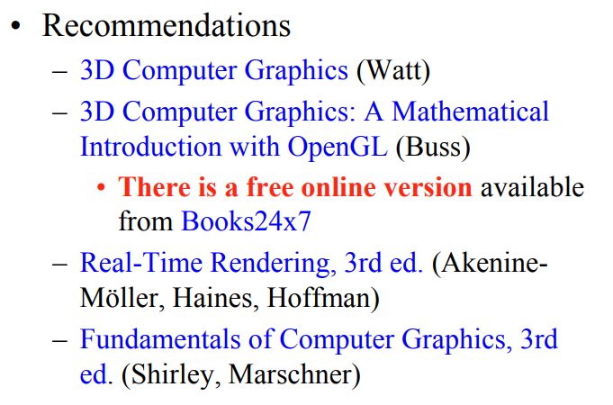


# 图形学截图

https://ocw.mit.edu/courses/electrical-engineering-and-computer-science/6-837-computer-graphics-fall-2012/lecture-notes/MIT6_837F12_Lec21.pdf

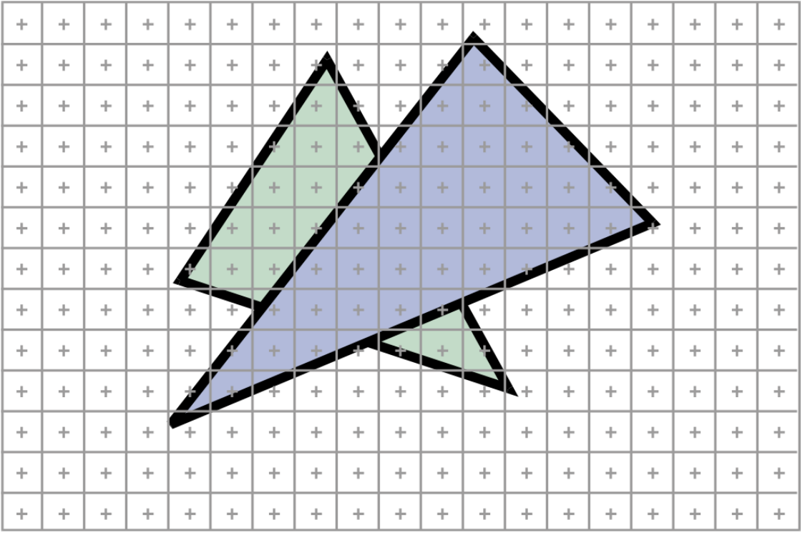

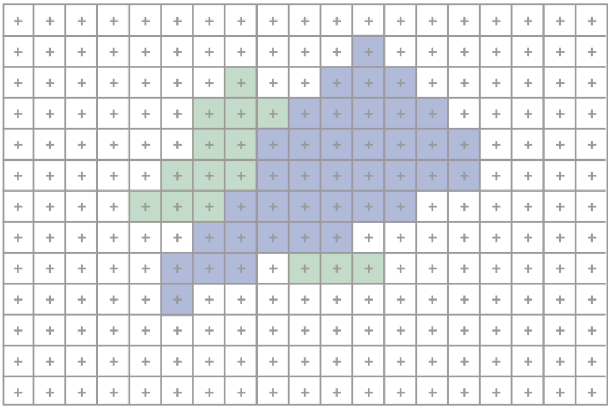

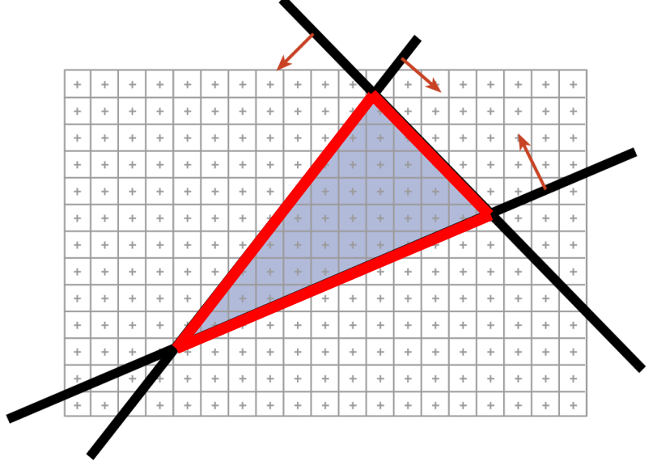

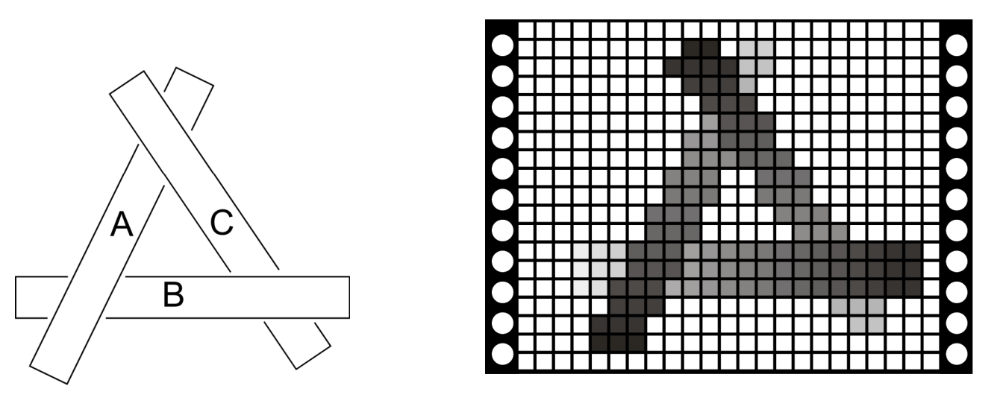


# DirectX 12的WARP

# Book 3D高级图形学编程 visual basic

visual basic 高级图形程序设计教程

https://book.douban.com/subject/3462980/

#  CMU 15462


# opengl 网站

http://www.songho.ca/opengl/gl_fbo.html

# 软件渲染引擎

https://github.com/zpzsoft/SoftRaster

https://github.com/skywind3000/mini3d


https://github.com/ssloy/tinyrenderer

# Bresenham快速画直线算法

[Bresenham快速画直线算法](https://www.cnblogs.com/gamesky/archive/2012/08/21/2648623.html)


# 三角形填充算法


# 英语

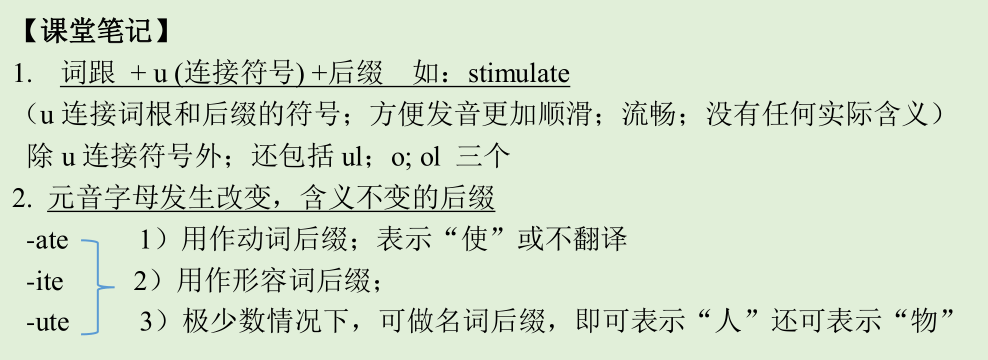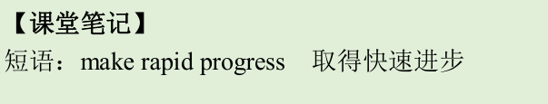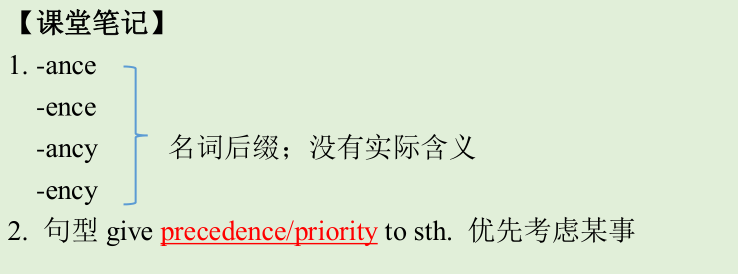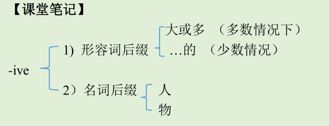

【课堂笔记】
-or 1）N. 人
-ar 物：机/器 tract

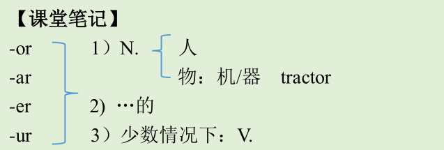


1.
s; t; d 相互转化的证据：
conclude→conclusion
decide→decision
convert→conversion
permit→permission
admit→admission
eat→-es/-ed
1.
obese: ob (over；过多；过度) + es(=eat; 吃) + e →吃的很多→肥胖的
2.
edible：ed (=eat; 吃) + ible （可…的）→可吃的→可食用的


# ppm 记录

https://www.google.com.hk/search?q=ppm+%E6%96%87%E4%BB%B6%E6%A0%BC%E5%BC%8F&oq=ppm+%E6%96%87%E4%BB%B6%E6%A0%BC%E5%BC%8F&aqs=chrome..69i57j0j69i59j0j69i60l3.2657j0j1&sourceid=chrome&ie=UTF-8 | ppm 文件格式 - Google 搜索
http://tool.chacuo.net/commonextinfo/e_ppm | ppm文件格式查询、文件类型信息、文件打开方式（编辑）软件查询--查错网
https://convertio.co/zh/ppm-jpg/ | PPM轉JPG轉換器。在线自由 — Convertio
https://gavinkg.github.io/ILearnVulkanFromScratch-CN/mdroot/Vulkan%20%E8%BF%9B%E9%98%B6/%E6%88%AA%E5%8F%96%E5%B1%8F%E5%B9%95/PPM%20%E6%A0%BC%E5%BC%8F.html | PPM 格式 · Vulkan 学习笔记
https://en.wikipedia.org/wiki/Netpbm_format%E3%80%82 | Netpbm format。 - Wikipedia
https://en.wikipedia.org/w/index.php?search=Netpbm+format%E3%80%82&title=Special%3ASearch&fulltext=1&ns0=1 | Netpbm format。 - Search results - Wikipedia
https://en.wikipedia.org/wiki/PFM | PFM-维基百科
https://en.wikipedia.org/wiki/Netpbm#File_formats | Netpbm-维基百科
https://en.wikipedia.org/wiki/Image_file_formats | Image file formats - Wikipedia
https://en.wikipedia.org/wiki/Netpbm#PPM_example | Netpbm - Wikipedia
https://en.wikipedia.org/wiki/PGM | PGM - Wikipedia
https://en.wikipedia.org/wiki/PPM | PPM-维基百科
https://www.shuzhiduo.com/A/gAJGroj3zZ/ | PPM、PGM、PBM图像格式剖析
https://www.vvzixun.com/code/e5f4c8626037e49cf8407e9c91904fbf | PPM文件格式详解之美 | 薇薇资讯网
https://m33.wiki/extension/ppm.html | PPM文件扩展名-什么是.ppm文件，如何打开它？
https://www.vvzixun.com/code/e5f4c8626037e49cf8407e9c91904fbf | PPM文件格式详解之美 | 薇薇资讯网
https://www.google.com.hk/search?q=:%20https://blog.csdn.net/weixin_44350205/article/details/104747007 | : https://blog.csdn.net/weixin_44350205/article/details/104747007 - Google 搜索
https://blog.csdn.net/weixin_44350205/article/details/104747007 | (17条消息) PPM文件格式详解之美_神秘的0和1-CSDN博客
https://zhidao.baidu.com/question/43064099.html | .ppm格式的图像文件怎么打开啊？_百度知道
https://zh.wikipedia.org/zh-hans/PBM%E6%A0%BC%E5%BC%8F | PBM格式 - 维基百科，自由的百科全书
https://web.archive.org/web/20090218192135/http://netpbm.sourceforge.net/history.html | Netpbm History
https://zh.wikipedia.org/wiki/Pbmplus | Pbmplus - 维基百科，自由的百科全书
http://www.fileformat.info/format/pbm/egff.htm | PBM, PGM, PNM, and PPM: Summary from the Encyclopedia of Graphics File Formats
https://zh.wikipedia.org/wiki/PNM%E6%A0%BC%E5%BC%8F | PNM格式 - 维基百科，自由的百科全书
https://www.jianshu.com/p/e809269b4ad7 | 数字图像处理-PPM图像格式 - 简书
https://blog.csdn.net/luoweifu/article/details/8789464 | (17条消息) PPM / PGM / PBM 图像文件格式_阳光日志-CSDN博客
https://blog.csdn.net/gengshenghong/article/details/8648577 | (17条消息) PPM文件格式_。。。。-CSDN博客_ppm文件
https://bbs.csdn.net/topics/110138145 | (17条消息) 怎么读取PPM文件-CSDN论坛
https://bbs.csdn.net/topics/80046872 | (17条消息) 有哪位老兄做过PPM文件的读写？-CSDN论坛
https://www.google.com.hk/search?q=linux%E4%B8%8B%E7%9A%84%E5%9B%BE%E5%83%8F%E5%A4%84%E7%90%86%E5%8C%85 | linux下的图像处理包 - Google 搜索
https://zh.wikipedia.org/wiki/Pbmplus | Pbmplus - 维基百科，自由的百科全书
http://netpbm.sourceforge.net/doc/pgm.html | PGM格式规格
http://netpbm.sourceforge.net/doc/libnetpbm.html | Libnetpbm manual
http://netpbm.sourceforge.net/doc/libnetpbm_image.html#writing | Libnetpbm Image Processing Manual

# ppm 介绍

下面将详细介绍ppm文件

ppm文件是一种图像文件，有其自己的文件格式。ppm文件由两个部分组成：第一个部分是三行ASCII码，这个部分决定了图像的存储格式以及图像的特征；第二个部分就是图像的数据部分，图像就是由这个部分组成的。

　　ppm的第一部分由三行ASCII码组成

第一行是P2/P3/P6
第二行是图像的大小，先是列像素数，后是行像素数，中间有一个空格
第三行是一个介于1和65535之间的整数，而且必须是文本的，用来表示每一个像素的一个分量用几个比特表示。

　　三行之后是图像的数据流，从左到右，从上到下。在进行图像数据存储的时候，需要进行数据的格式，假如需要的像素值在0~255之间，那么在进行数据文件保存的时候，所写入文件的值就必须是以%c的形式输入，而且数据之间没有明显的分离字符，图像处理软件会自动地识别这些像素的值，并给予处理。

PPM->Portable PixMap
PGM->Portable GreyMap
PBM->Portable BitMap

PBM支持单色图（1个像素位）
PGM支持灰度图形，能够读PBM图形和PGM图形，输出PGM图形
PPM支持真彩色图形，可以读上面所有格式，输出PPM图形

PPM

　　PPM图形文件格式包括两个部分，头部分和图象数据部分。头部分由三部分组成，这三部分由回车或换行分割，但PPM的标准中是要求空格。第一行通常是P3或P6，说明是PPM格式；第二行是图象的宽度和高度，用ASCII来表示；最后一部分是描述像素的最大颜色组成，这里允许描述超过一个字节（0-255）的颜色值。另外可以在上面个部分的后面用#来追加注释，注释行是从#到该行末。

　　下面是PPM头的例子：

例子1：
P6 1024 778 255

例子2：
P6
1024 778
255

例子3：
P6#PPM文件格式
1024 778#宽度和高度
\# 注释
255

　　PPM图象数据的格式依赖于PPM自身的表示，如果是P3格式，数据将以ASCII文本来表示，每个像素的值从0到前面的最大值，每行不应该长于70个字符，如下：

例子4：
P3
\# example from the man page
4 4
15
0 0 0 0 0 0 0 0 0 15 0 15
0 0 0 0 15 7 0 0 0 0 0 0
0 0 0 0 0 0 0 15 7 0 0 0
15 0 15 0 0 0 0 0 0 0 0 0

　　如果是P6格式，图象数据以字节格式存储，每个色彩成分（R，G，B）一个字节。仅仅在头部的最后一个字段的前面才能有注释，在头部的最后一个字段后面通常是一个回车或换行。P6图象文件比P3文件小，读起来更快。注意，P6文件仅仅用作但字节彩色。

　　但并没有按照格式规约的要求来，通常的习惯，图象从上到下，从左到右被存储。每个像素以一个字节来存储，0表示黑色，255表示白色。色彩成分按照通常的红-绿-蓝顺序爱存储。

PGM

　　该格式文件存储灰度图形，也就是这里每个像素使用一个值来表示而不是3个（R，G，B）。同PPM唯一不同的是头部用P2和P5，分别表示用ASCII和字节码来表示数据。

例如：
P2
24 7
15
0 0 0 0 0 0 0 0 0 0 0 0 0 0 0 0 0 0 0 0 0 0 0 0
0 3 3 3 3 0 0 7 7 7 7 0 0 11 11 11 11 0 0 15 15 15 15 0
0 3 0 0 0 0 0 7 0 0 0 0 0 11 0 0 0 0 0 15 0 0 15 0
0 3 3 3 0 0 0 7 7 7 0 0 0 11 11 11 0 0 0 15 15 15 15 0
0 3 0 0 0 0 0 7 0 0 0 0 0 11 0 0 0 0 0 15 0 0 0 0
0 3 0 0 0 0 0 7 7 7 7 0 0 11 11 11 11 0 0 15 0 0 0 0
0 0 0 0 0 0 0 0 0 0 0 0 0 0 0 0 0 0 0 0 0 0 0 0

PBM

　　使用ASCII的0或1方式来表示数据，0表示白色，1表示黑色。与PPM、PGM不同的头部是少了第三行，因为第三行的最大色彩值在这个模式下已经没有意义了；如下：

P1
\# PBM example
24 7
0 0 0 0 0 0 0 0 0 0 0 0 0 0 0 0 0 0 0 0 0 0 0 0
0 1 1 1 1 0 0 1 1 1 1 0 0 1 1 1 1 0 0 1 1 1 1 0
0 1 0 0 0 0 0 1 0 0 0 0 0 1 0 0 0 0 0 1 0 0 1 0
0 1 1 1 0 0 0 1 1 1 0 0 0 1 1 1 0 0 0 1 1 1 1 0
0 1 0 0 0 0 0 1 0 0 0 0 0 1 0 0 0 0 0 1 0 0 0 0
0 1 0 0 0 0 0 1 1 1 1 0 0 1 1 1 1 0 0 1 0 0 0 0
0 0 0 0 0 0 0 0 0 0 0 0 0 0 0 0 0 0 0 0 0 0 0 0

PPM文件格式分三种：

\1. PPM灰度文件
　　文件头由3行文本组成，可由fgets读出
　　1）第一行为“P2"，表示文件类型
　　2）第二行为图像的宽度和高度
　　3）第三行为最大的象素值255
　　接下来是图像数据块。按行顺序存储。每个象素占4个字节，灰度通道为4字节ASCII码表示的整数，高字节在前。左上角为坐标原点。

\2. 16位PPM文件（至少适用于读取由DCRAW生成的PPM文件）
　　文件头由3行文本组成，可由fgets读出
　　1）第一行为“P6"，表示文件类型
　　2）第二行为图像的宽度和高度
　　3）第三行为最大的象素值
　　接下来是图像数据块。按行顺序存储。每个象素占3个字节，依次为红绿蓝通道，每个通道为1字节整数。左上角为坐标原点。

\3. PPM彩色文件
　　文件头由3行文本组成，可由fgets读出
　　1）第一行为“P3"，表示文件类型
　　2）第二行为图像的宽度和高度
　　3）第三行为最大的象素值255
　　接下来是图像数据块。按行顺序存储。每个象素占12个字节，依次为红绿蓝通道，每个通道为4字节ASCII码表示的整数，高字节在前。左上角为坐标原点。

　　可移植像素图格式(PPM)，可移植灰度图格式(PGM)和可移植位图格式(PBM)是便于跨平台的图像格式。有时候也被统称为PNM格式。

历史

　　PBM格式由Jef Poskanzer在20世纪80年代发明，为了便于通过电子邮件，用ASCII码表示单色位图，能够承受一般的文本格式的变动。

　　第一个处理PBM格式的工具库是Pbmplus。它由这个格式的发明人Jef Poskanzer开发，在1988年发布。主要包含Jef编写的将PBM转化为已存在的其他图像格式的工具。在1988年末，Jef开发出PGM、PPM格式以及相关工具，并加入Pbmplus中。Pbmplus的最终发布日期是1991年12月10日。

　　在1993年，Netpbm库开始开发，用来替代不再维护的Pbmplus。它是Pbmplus的简单的重新包装，附加全世界开发者提供的额外功能和修订，可能是目前用的最普遍的处理PBM、PGM和PPM格式的工具库。

文件格式描述

　　这三种格式在颜色的表示上有差异。PBM是单色，PGM是灰度图，PPM使用RGB颜色。

　　每个文件的开头两个字节（ASCII码）作为文件描述子，指出具体格式和编码形式。具体见下表：

| 文件描述子 | 类型   | 编码   |
| :--------- | :----- | :----- |
| `P1`       | 位图   | ASCII  |
| `P2`       | 灰度图 | ASCII  |
| `P3`       | 像素图 | ASCII  |
| `P4`       | 位图   | 二进制 |
| `P5`       | 灰度图 | 二进制 |
| `P6`       | 像素图 | 二进制 |


# ppm 文件读取 C

```c
/*pnmfile.h */

#ifndef PNM_FILE_H
#define PNM_FILE_H

#include <cstdlib>
#include <climits>
#include <cstring>
#include <fstream>
#include "image.h"
#include "misc.h"
#include <iostream.h>//for debug,qiansen

#define BUF_SIZE 256

class pnm_error { };

static void read_packed(unsigned char *data, int size, std::ifstream &f) {
  unsigned char c = 0;
  
  int bitshift = -1;
  for (int pos = 0; pos < size; pos++) {
    if (bitshift == -1) {
      c = f.get();
      bitshift = 7;
    }
    data[pos] = (c >> bitshift) & 1;
    bitshift--;
    }
}

static void write_packed(unsigned char *data, int size, std::ofstream &f) {
  unsigned char c = 0;
  
  int bitshift = 7;
  for (int pos = 0; pos < size; pos++) {
      c = c | (data[pos] << bitshift);
      bitshift--;
      if ((bitshift == -1) || (pos == size-1)) {
f.put(c);
bitshift = 7;
c = 0;
      }
  }
}

/* read PNM field, skipping comments */ 
static void pnm_read(std::ifstream &file, char *buf) {
  char doc[BUF_SIZE];
  char c;
  
  file >> c;
  while (c == '#') {
    file.getline(doc, BUF_SIZE);
    file >> c;
  }
  file.putback(c);
  
  file.width(BUF_SIZE);
  file >> buf;
  file.ignore();
}

static image<uchar> *loadPBM(const char *name) {
  char buf[BUF_SIZE];
  
  /* read header */
  std::ifstream file(name, std::ios::in | std::ios::binary);
  pnm_read(file, buf);
  if (strncmp(buf, "P4", 2))
    throw pnm_error();
    
  pnm_read(file, buf);
  int width = atoi(buf);
  pnm_read(file, buf);
  int height = atoi(buf);
  
  /* read data */
  image<uchar> *im = new image<uchar>(width, height);
  for (int i = 0; i < height; i++)
    read_packed(imPtr(im, 0, i), width, file);
  
  return im;
}

static void savePBM(image<uchar> *im, const char *name) {
  int width = im->width();
  int height = im->height();
  std::ofstream file(name, std::ios::out | std::ios::binary);

  file << "P4\n" << width << " " << height << "\n";
  for (int i = 0; i < height; i++)
    write_packed(imPtr(im, 0, i), width, file);
}

static image<uchar> *loadPGM(const char *name) {
  char buf[BUF_SIZE];
  
  /* read header */
  std::ifstream file(name, std::ios::in | std::ios::binary);
  pnm_read(file, buf);
  if (strncmp(buf, "P5", 2))
    throw pnm_error();

  pnm_read(file, buf);
  int width = atoi(buf);
  pnm_read(file, buf);
  int height = atoi(buf);

  pnm_read(file, buf);
  if (atoi(buf) > UCHAR_MAX)
    throw pnm_error();

  /* read data */
  image<uchar> *im = new image<uchar>(width, height);
  file.read((char *)imPtr(im, 0, 0), width * height * sizeof(uchar));

  return im;
}

static void savePGM(image<uchar> *im, const char *name) {
  int width = im->width();
  int height = im->height();
  std::ofstream file(name, std::ios::out | std::ios::binary);

  file << "P5\n" << width << " " << height << "\n" << UCHAR_MAX << "\n";
  file.write((char *)imPtr(im, 0, 0), width * height * sizeof(uchar));
}

static image<rgb> *loadPPM(const char *name) {
  char buf[BUF_SIZE], doc[BUF_SIZE];
  
  /* read header */
  std::ifstream file(name, std::ios::in | std::ios::binary);
  pnm_read(file, buf);
  if (strncmp(buf, "P5", 2)){
    //throw pnm_error();
    cout<<"pnm version is P6,may be not supported."<<endl;
  }
  pnm_read(file, buf);
  int width = atoi(buf);
  pnm_read(file, buf);
  int height = atoi(buf);

  pnm_read(file, buf);
  if (atoi(buf) > UCHAR_MAX)
    throw pnm_error();

  /* read data */
  image<rgb> *im = new image<rgb>(width, height);
  file.read((char *)imPtr(im, 0, 0), width * height * sizeof(rgb));

  return im;
}

static void savePPM(image<rgb> *im, const char *name) {
  int width = im->width();
  int height = im->height();
  std::ofstream file(name, std::ios::out | std::ios::binary);

  file << "P6\n" << width << " " << height << "\n" << UCHAR_MAX << "\n";
  file.write((char *)imPtr(im, 0, 0), width * height * sizeof(rgb));
}

template <class T>
void load_image(image<T> **im, const char *name) {
  char buf[BUF_SIZE];
  
  /* read header */
  std::ifstream file(name, std::ios::in | std::ios::binary);
  pnm_read(file, buf);
  if (strncmp(buf, "VLIB", 9))
    throw pnm_error();

  pnm_read(file, buf);
  int width = atoi(buf);
  pnm_read(file, buf);
  int height = atoi(buf);

  /* read data */
  *im = new image<T>(width, height);
  file.read((char *)imPtr((*im), 0, 0), width * height * sizeof(T));
}

template <class T>
void save_image(image<T> *im, const char *name) {
  int width = im->width();
  int height = im->height();
  std::ofstream file(name, std::ios::out | std::ios::binary);

  file << "VLIB\n" << width << " " << height << "\n";
  file.write((char *)imPtr(im, 0, 0), width * height * sizeof(T));
}

#endif
```


```c
/* a simple image class 
filename: image.h */

#ifndef IMAGE_H
#define IMAGE_H

#include <cstring>

template <class T>
class image {
 public:
  /* create an image */
  image(const int width, const int height, const bool init = true);

  /* delete an image */
  ~image();

  /* init an image */
  void init(const T &val);

  /* copy an image */
  image<T> *copy() const;
  
  /* get the width of an image. */
  int width() const { return w; }
  
  /* get the height of an image. */
  int height() const { return h; }
  
  /* image data. */
  T *data;
  
  /* row pointers. */
  T **access;
  
 private:
  int w, h;
};

/* use imRef to access image data. */
#define imRef(im, x, y) (im->access[y][x])
  
/* use imPtr to get pointer to image data. */
#define imPtr(im, x, y) &(im->access[y][x])

template <class T>
image<T>::image(const int width, const int height, const bool init) {
  w = width;
  h = height;
  data = new T[w * h];  // allocate space for image data
  access = new T*[h];   // allocate space for row pointers
  
  // initialize row pointers
  for (int i = 0; i < h; i++)
    access[i] = data + (i * w);  
  
  if (init)
    memset(data, 0, w * h * sizeof(T));
}

template <class T>
image<T>::~image() {
  delete [] data; 
  delete [] access;
}

template <class T>
void image<T>::init(const T &val) {
  T *ptr = imPtr(this, 0, 0);
  T *end = imPtr(this, w-1, h-1);
  while (ptr <= end)
    *ptr++ = val;
}


template <class T>
image<T> *image<T>::copy() const {
  image<T> *im = new image<T>(w, h, false);
  memcpy(im->data, data, w * h * sizeof(T));
  return im;
}

#endif
```


```c

#include <stdio.h>
#include <stdlib.h>
 
int writePPMHeader(FILE *f, char magic, int w, int h, int color) {
	if (f==NULL) {
		printf("FILE error\n");
		exit(0);
	}
 
	if (magic=='A') {// ASCII
		fprintf(f, "P3\n");
	} else if (magic=='B') {
		fprintf(f, "P6\n");
	} else {
		printf("Magic can only be A(ASCII) or B(binary)\n");
		exit(0);
	}
 
	fprintf(f, "%d %d\n", w, h);
    fprintf(f, "%d\n", color);
	return 0;
}
 
int writePPMdataP3(FILE* f, unsigned char* img, int w, int h) {
	int i,j;
	for(i=0;i<h;i++) {	// every rwo
		for(j=0;j<w;j++) {	// every line
			fprintf(f, "%d ",img[i*w*3+3*j]);
			fprintf(f, "%d ",img[i*w*3+3*j+1]);
			fprintf(f, "%d ",img[i*w*3+3*j+2]);	// PS: 对于j=w-1的时候，最后一个空格可以不写，但是这里就不考虑了
		}
		fprintf(f, "\n");
	}
}
 
int writePPMdataP6(FILE* f, unsigned char* img, int w, int h) {
	int i,j;
	for(i=0;i<w;i++) {
		for(j=0;j<h;j++) {
			fwrite(img, w*h, 3, f);
		}
	}
}
 
#define WIDTH	3
#define HEIGHT	2
unsigned char img[WIDTH*HEIGHT*3]={255,0,0,0,255,0,0,0,255,255,255,0,255,255,255,0,0,0};
 
int main() {
	char *filename1 = "testP3.ppm";
	char *filename2 = "testP6.ppm";
 
    FILE *f3 = fopen(filename1, "w");
	if (f3==NULL) {
		printf("FILE error\n");
		exit(0);
	}
 
    FILE *f6 = fopen(filename2, "w");
	if (f6==NULL) {
		printf("FILE error\n");
		exit(0);
	}
 
	writePPMHeader(f3, 'A', WIDTH, HEIGHT, 255);
	writePPMdataP3(f3, img, WIDTH, HEIGHT);
 
	writePPMHeader(f6, 'B', WIDTH, HEIGHT, 255);
	writePPMdataP6(f6, img, WIDTH, HEIGHT);
 
	fclose(f3);
	fclose(f6);
 
	return 0;
}

```


# PPM 文件格式


查看器

https://legacy.imagemagick.org/

http://netpbm.sourceforge.net/doc/ppm.html


在线ppm 转jpg


ppm 在线转换网站

https://convertio.co/zh/ppm-jpg/


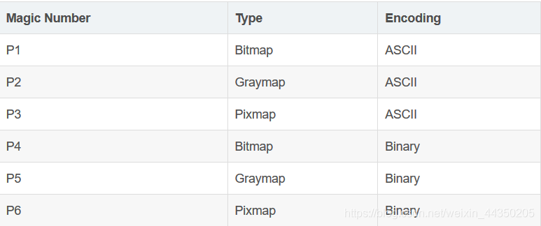


编码方式：
ASCII格式适合人类阅读理解，可以用文本编辑器打开，读取对应图像的数据（比如PPM格式的RGB值）。 Binary格式适合机器阅读，按照二进制形式，顺序存储图像信息，不用空格分隔，所以图像处理起来更有效率，占用空间容量更少（由于缺少空格）。

下面着重讲解PPM格式：
PPM图像格式分为两部分，分别为头部分和图像数据部分。
头部分：由3部分组成，通过换行或空格进行分割，一般PPM的标准是空格。
第1部分：P3或P6，指明PPM的编码格式，
第2部分：图像的宽度和高度，通过ASCII表示，
第3部分：最大像素值，0-255字节表示。

图像数据部分：
ASCII格式：按RGB的顺序排列，RGB中间用空格隔开，图片每一行用回车隔开。
Binary格式：PPM用24bits代表每一个像素，红绿蓝分别占用8bits。

ppm是一种很简单的协议，下面我们使用文本编辑器和windows画图对其进行解释。

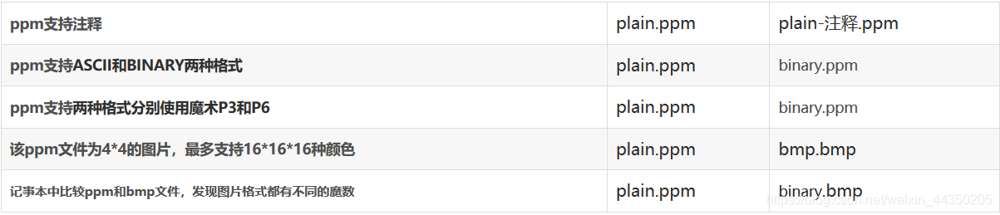

https://blog.csdn.net/weixin_44350205/article/details/104747007

> PPM图像格式是由Jef Poskanzer 在1991年所创造的。
>
> PPM（Portable Pixmap Format）还有两位兄长，大哥名叫「PBM」，二哥人称「PGM」，他们三兄弟各有所长，下面为你们一一介绍：
>
> - PBM 是位图（bitmap），仅有黑与白，没有灰
> - PGM 是灰度图（grayscale）
> - PPM 是通过RGB三种颜色显现的图像（pixmaps）
>
> 每个图像文件的开头都通过2个字节「magic number」来表明文件格式的类型（PBM, PGM, PPM），以及编码方式（ASCII 或 Binary），magic number分别为P1、P2、P3、P4、P5、P。
>
> 
> 
>
> 编码方式：
> ASCII格式适合人类阅读理解，可以用文本编辑器打开，读取对应图像的数据（比如PPM格式的RGB值）。 Binary格式适合机器阅读，按照二进制形式，顺序存储图像信息，不用空格分隔，所以图像处理起来更有效率，占用空间容量更少（由于缺少空格）。
>
> 下面着重讲解PPM格式：
> PPM图像格式分为两部分，分别为头部分和图像数据部分。
> 头部分：由3部分组成，通过换行或空格进行分割，一般PPM的标准是空格。
> 第1部分：P3或P6，指明PPM的编码格式，
> 第2部分：图像的宽度和高度，通过ASCII表示，
> 第3部分：最大像素值，0-255字节表示。
>
> 图像数据部分：
> ASCII格式：按RGB的顺序排列，RGB中间用空格隔开，图片每一行用回车隔开。
> Binary格式：PPM用24bits代表每一个像素，红绿蓝分别占用8bits。
>
> ppm是一种很简单的协议，下面我们使用文本编辑器和windows画图对其进行解释。
>
> 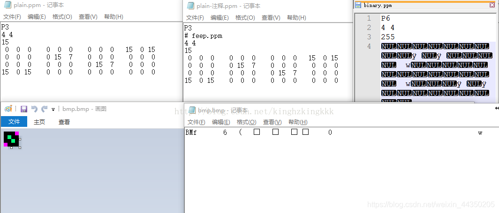
>                                                    对比分析PPM文件
>
> 
>
> 下面我们通过另一张图确认二进制ppm内容究竟是什么样子的。
>
> 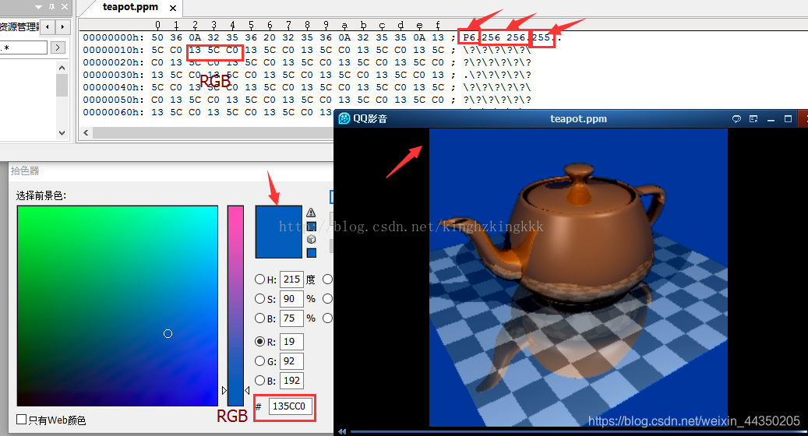
>
> 通过UE查看二进制文件，同样的我们发现，前三行为ppm文件的“头部分”信息，然后第四行开始为二进制数据。
>
> 从“头部分”可以看出来文件teapot.ppm为P6格式（即二进制的ppm文件类型）的文件，256*256的图像大小，RGB的每个色彩值范围为0-255，也就是数8个byte表示一个R或者G或者B的颜色，8*3个byte（即3Byte）表示一个RGB颜色，UE查看器中矩形内的3Byte就是该文件的一个像素点，该值为135CC0。通过Photoshop可以查看该值颜色就是我们图片中显示的颜色。
>
>
> 总结：从上面分析我们了解PPM是一种简单的图片格式，我们可以通过PPM进行图像相关的学习。

# Borel-Cantelli引理


# 数学家 安德雷·柯尔莫哥洛夫


[](https://baike.baidu.com/item/%E5%AE%89%E5%BE%B7%E9%9B%B7%C2%B7%E6%9F%AF%E5%B0%94%E8%8E%AB%E5%93%A5%E6%B4%9B%E5%A4%AB/5356848?fromtitle=%E6%9F%AF%E5%B0%94%E8%8E%AB%E5%93%A5%E6%B4%9B%E5%A4%AB&fromid=1192834)


# 记录

几何概型

概率空间

**全概公式，Bayes公式**

事件列的上下极限，Borel-Cantelli引理

切比雪夫不等式，大数定律中心极限定理

古典概型

**随机变量与分布**

**离散型随机变量**

各种分布

帕斯卡分布 **超几何分布** 连续型随机变量 概率密度 

连续 均匀指数伽马 分布函数  Newton-Lebniz公式

https://baike.baidu.com/item/%E5%8F%A4%E5%85%B8%E6%A6%82%E5%9E%8B

http://staff.ustc.edu.cn/~zwp/teach/Prob-Stat/Lec2_slides.pdf


排列组合

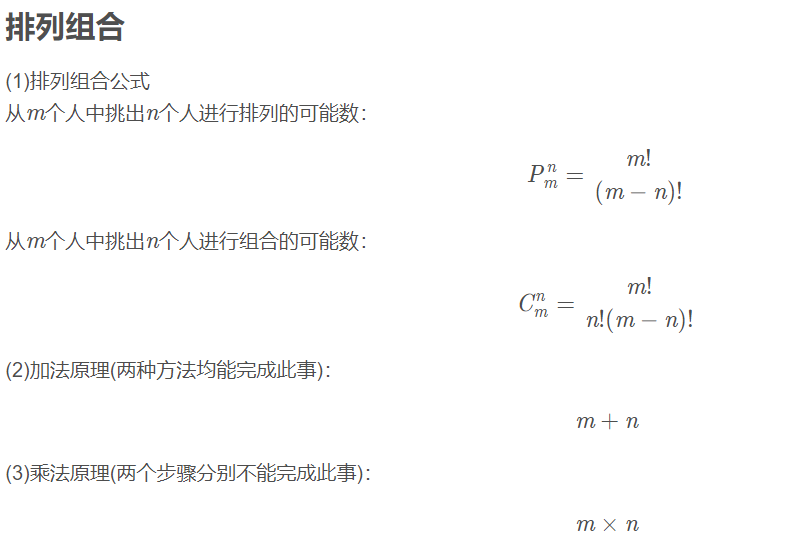

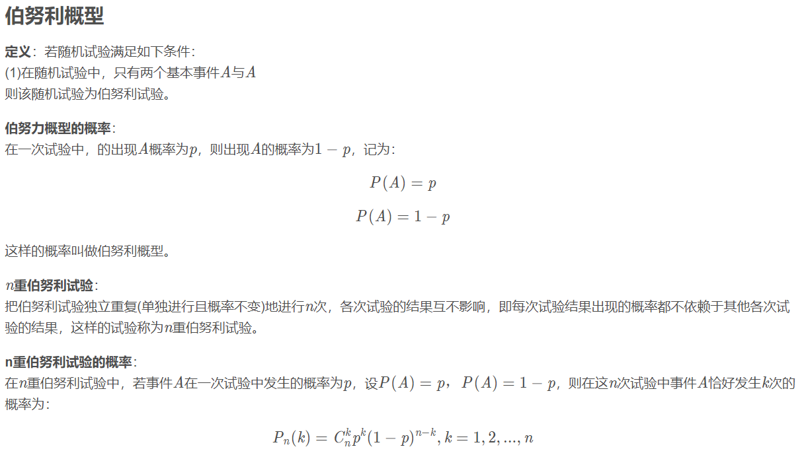

事件

1. 样本空间(Sample space) ΩΩ:一个试验所有的结果组成的集合, 比如试验为 掷骰子1次,得到的点数, 那么样本空间就为{1, 2, 3, 4, 5, 6}
2. 事件: 从集合的角度每个事件都是 ΩΩ 的子集.
3. 基本事件: 如果只包含结果集中的一种结果的话,那么这个事件可以称为基本事件, 比如掷骰子1次得到2点就是一个基本事件
4. 复合事件: 包含多个结果, 比如掷一次骰子,得到偶数点就是一个复合事件,因为表 现在集合上它包含了多个结果集中的元素{2, 4, 6}.
5. 互斥事件: 如果两个事件不可能同时发生，那么他们就是互斥事件，表现在集合上 就是两个集合无交集互斥事件有一个发生的概率：P(A+B) = P(A) + P(B) (用集合 很好理解)
6. 对立事件: 是互斥事件的特例，表现在集合上两个集合互为补集、
7. 事件的和(并集): 若有两个事件A与B C = {A, B至少有一个发生},那么C就是A, B的 和,记作: C = A+B
8. 事件的积(交集): 若有两个事件A与B C = {A, B都发生},那么C就是A, B的积,记作: C = AB
9. 事件的差(差集):若有两个事件A与B C = {A发生但是B不发生},那么C就是A与B的差, 记作: C = A-B

古典概率

全部试验结果已知并且等可能的情况下才可以应用古典概率,古典概率一般是使用排列组合来求解.

概率的公理化定义

所有的试验结果定义一个全集 ΩΩ, 所有的事件组成一个集合 FF, 任何定义于该集合上的事件都是它的子集

1. P(A)≥0P(A)≥0 for all A∈FA∈F

2. P(Ω)=1,P(∅)=0P(Ω)=1,P(∅)=0

3. A1, A2,…, An 是互斥事件

   

   P(∪iAi)=∑iP(Ai)P(∪iAi)=∑iP(Ai)


知识点


> - [一、预备知识](https://blog.csdn.net/qq_41498261/article/details/106820049#_8)
> - - [1.1 排列、组合、集合、二项式定理](https://blog.csdn.net/qq_41498261/article/details/106820049#11__9)
>   - [1.2 随机试验、随机事件](https://blog.csdn.net/qq_41498261/article/details/106820049#12__13)
>   - [1.3 事件的概率](https://blog.csdn.net/qq_41498261/article/details/106820049#13__17)
>   - [1.4 概率的公理化意义](https://blog.csdn.net/qq_41498261/article/details/106820049#14__21)
>   - [1.5 条件概率](https://blog.csdn.net/qq_41498261/article/details/106820049#15__26)
>   - [1.6 全概率公式及贝叶斯公式](https://blog.csdn.net/qq_41498261/article/details/106820049#16__31)
> - [二、一维随机变量](https://blog.csdn.net/qq_41498261/article/details/106820049#_34)
> - - [2.1 离散随机变量](https://blog.csdn.net/qq_41498261/article/details/106820049#21__35)
>   - [2.2 连续型随机变量](https://blog.csdn.net/qq_41498261/article/details/106820049#22__39)
> - [三、二维随机变量](https://blog.csdn.net/qq_41498261/article/details/106820049#_45)
> - - [3.1 二维离散型随机变量](https://blog.csdn.net/qq_41498261/article/details/106820049#31__46)
>   - [3.2 二维连续型随机变量](https://blog.csdn.net/qq_41498261/article/details/106820049#32__51)
> - [四、随机变量函数的分布](https://blog.csdn.net/qq_41498261/article/details/106820049#_58)
> - [六、方差](https://blog.csdn.net/qq_41498261/article/details/106820049#_71)
> - [七、大数定律](https://blog.csdn.net/qq_41498261/article/details/106820049#_79)


# 概率论

https://www.zybuluo.com/catscarf/note/971426

https://www.zybuluo.com/catscarf/note/986628


概率加法公式？
$$
\begin{split} P(\bigcup_{i=1}^{n}A_i)=&\sum_{i=1}^{n}P(A_i)- \sum_{1\leq i<j\leq n}P(A_iA_j)+\\&\sum_{1\leq i<j<k\leq n}P(A_i A_j A_k)+...+(-1)^{n-1}P(A_1 A_2 ... A_n) \end{split}
$$


条件概论
$$
P(B|A)=\frac{P(AB)}{P(A)}
$$
全概率公式
$$
P(A)=\sum_{j=1}^{n}P(B_j)P(A|B_j)
$$
贝叶斯
$$
P(B_i|A)=\frac{P(AB_i)}{P(A)}=\frac{P(B_i)P(A|B_i)}{\sum_{j=1}^{n}P(B_j)P(A|B_j)}​
$$
二 **随机变量及其概率分布随机变量及其概率分布**

概率密度


$$
F(x)=\int_{-\infty}^x f(t)dt
$$
常见分布及期望和方差

0-1分布


$$
P(X=k)=p^k(1-p)^{n-k}
$$

$$
X\sim 0-1(p),E(X)=p,D(X)=p(1-p)
$$

泊松分布
$$
P(X=k)=\frac{\lambda^k e^{-\lambda}}{k!}\ (k=0,1,2,...)
$$

$$
X\sim \pi(\lambda),E(X)=\lambda,D(X)=\lambda
$$
正态分布
$$
f(x)=\frac{1}{\sqrt{2\pi}\sigma}e^{-\frac{(x-\mu)^2}{2\sigma^2}}
$$

$$
X\sim N(\mu,\sigma^2),E(X)=\mu,D(X)=\sigma^2
$$

指数分布
$$
f(x)=\lambda e^{-\lambda x}\ x>0
$$

$$
X\sim E(\lambda),E(X)=\frac{1}{\mu},D(X)=\frac{1}{\lambda^2}
$$
二项分布
$$
P(X=k)=C_n^k\cdot P^k\cdot (1-p)^{n-k}
$$

$$
X\sim B(n,p),E(X)=np,D(X)=np(1-p)
$$

均匀分布
$$
f(x)=\frac{1}{b-a}\ a\leq x<b
$$

$$
X\sim U(a,b),E(X)=\frac{a+b}{2},D(X)=\frac{(b-a)^2}{12}
$$

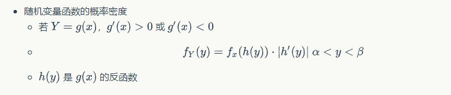

三 **二元随机变量**


# Book Stochastic Simulation and Monte Carlo Methods


https://www.springer.com/gp/book/9783642393624

# 数学相关英语


# mathworks.com

# Book Simulation and the Monte Carlo Method

蒙特卡洛方法第二版

[Amazon](https://www.amazon.com/Simulation-Monte-Method-Reuven-Rubinstein/dp/0470177942)

# 蒙特卡洛求积分示例

python


# 的说法


https://www.unige.ch/sciences/astro/files/2713/8971/4086/3_Paltani_MonteCarlo.pdf


$$
f(x, y)=\left\{\begin{array}{lc}
1 & x^{2}+y^{2} \leq 1 \\
0 & \text { else }
\end{array}\right.
$$

$$
\iint_{D} f(x, y) d x d y \approx \frac{1}{n} \sum_{i=1}^{n} \frac{f\left(x_{i}\right)}{p d f\left(x_{i}\right)}=\frac{1}{n} \sum_{i=1}^{n} f\left(x_{i}\right)
$$


# 蒙特卡罗方法

**蒙特卡洛积分概述**：简而言之蒙特卡洛积分就是，在求定积分时，如果找不到被积函数的原函数，无法使用经典牛顿-莱布尼茨积分法得到定积分结果的。而蒙特卡洛积分方法利用一个随机变量对被积函数进行采样，并将采样值进行一定的处理可以得到定积分的一个近似值，当采样数量很高时，得到的近似值可以很好的近似原积分的结果。这样一来，我们就不用去求原函数的形式，就能求得积分的近似结果。


# 蒙特卡洛 重要性采样

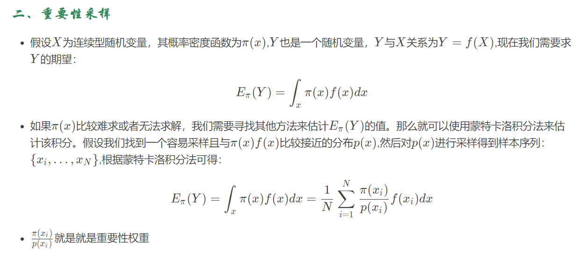

# Monte Carlo Integration

$$
\int_{D} f(x) \mathrm{d} x=\lim _{N \rightarrow \infty} \frac{1}{N} \sum_{i=1}^{N} \frac{f\left(X_{i}\right)}{p\left(X_{i}\right)}
$$


$$
\begin{aligned}
E\left[F_{N}\right] &=E\left[\frac{1}{N} \sum_{i=1}^{N} \frac{f\left(X_{i}\right)}{p\left(X_{i}\right)}\right] \\
&=\frac{1}{N} \sum_{i=1}^{N} E\left[\frac{f\left(X_{i}\right)}{p\left(X_{i}\right)}\right] \\
&=\frac{1}{N} \sum_{i=1}^{N} E\left[Y_{i}\right] \\
&=\frac{1}{N} \sum_{i=1}^{N} \int_{a}^{b}\left[\frac{f(x)}{p(x)}\right] p(x) \mathrm{d} x \\
&=\frac{1}{N} \sum_{i=1}^{N} \int_{a}^{b} f(x) \mathrm{d} x \\
&=\int_{a}^{b} f(x) \mathrm{d} x
\end{aligned}
$$

# Monte Carlo


# LOTUS Law of the unconscious statistician

https://en.wikipedia.org/wiki/Law_of_the_unconscious_statistician

LOTUS的应用情景是，已知随机变量X的概率分布，但不知道f(x)的分布，此时用LOTUS公式能计算出函数f(x)的数学期望。

# 无意识统计学家法则（LOTUS）

**无意识统计学家法则（Law of the unconscious statistician）**

　　无意识统计学家法则（LOTUS），描述了已知随机变量XX的概率分布，但不知道g(X)g(X)的分布，如何求解g(X)g(X)的数学期望就是LOTUS的目的。 我想有一定概率论基础的同学都应该知道LOTUS的公式：

XX是离散分布时:
$$
E[g(X)]=\sum_{x} g(x) f_{X}(x)
$$
XX是连续分布时:
$$
E[g(X)]=\int_{-\infty}^{\infty} g(x) f_{X}(x) \mathrm{d} x
$$
　　其中，fX(x)fX(x)是xx的概率密度函数（PDF）。总结一下就是在计算期望时，用已知的XX的PDF代替未知的g(X)g(X)的PDF。

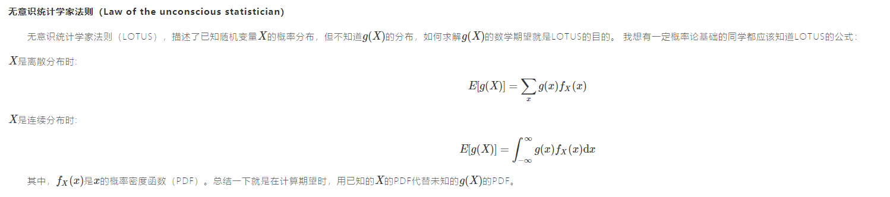

# 蒙特卡洛 公式

$$
\begin{aligned}
F &=\int_{a}^{b} f(x) d x \\
F^{N} &=\frac{1}{N} \sum_{i=1}^{N} \frac{f\left(X_{i}\right)}{p d f\left(X_{i}\right)}
\end{aligned}
$$

蒙特卡洛推导
$$
\begin{aligned}
E\left[\left\langle F^{N}\right\rangle\right] &=E\left[\frac{1}{N} \sum_{i=0}^{N-1} \frac{f\left(X_{i}\right)}{\left.p d f X_{i}\right)}\right] \\
&=\frac{1}{N} \sum_{i=0}^{N-1} E\left[\frac{f\left(X_{i}\right)}{p d f\left(X_{i}\right)}\right] \\
&=\frac{1}{N} \sum_{i=0}^{N-1} \int_{\Omega} \frac{f(x)}{p d f(x)} p d f(x) d x \\
&=\frac{1}{N} \sum_{i=0}^{N-1} \int_{\omega} f(x) d x \\
&=F
\end{aligned}
$$


**第二行到第三行是最不好理解的。因为这里其实用到了新的知识点：[Law of the unconscious statistician](https://en.wikipedia.org/wiki/Law_of_the_unconscious_statistician)(简称：LOTUS)。LOTUS的应用情景是，已知随机变量X的概率分布，但不知道f(x)的分布，此时用LOTUS公式能计算出函数f(x)的数学期望。LOTUS的公式如下：**


# 数学公式识别

https://mathpix.com/


https://zhuanlan.zhihu.com/p/63918634