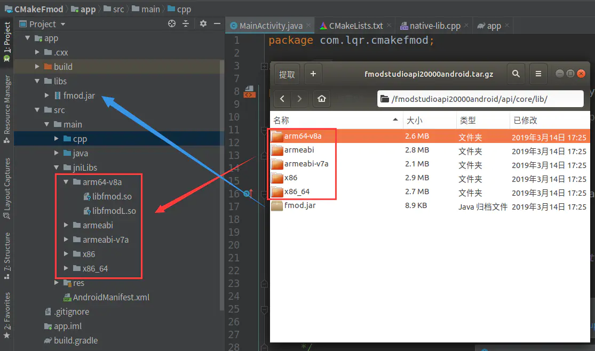
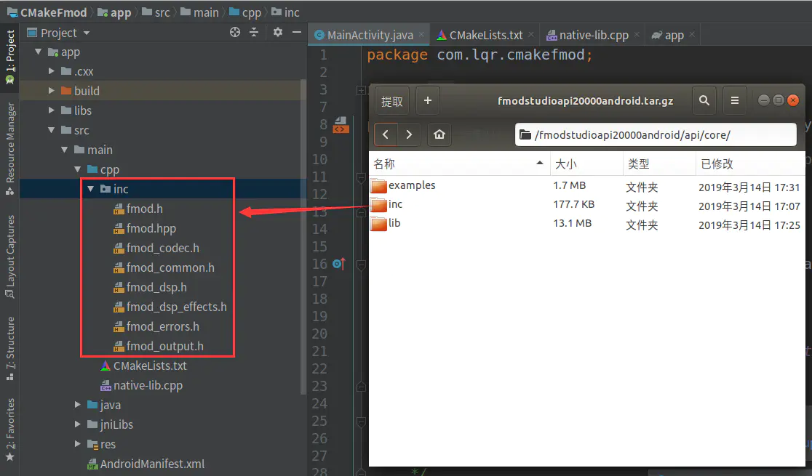
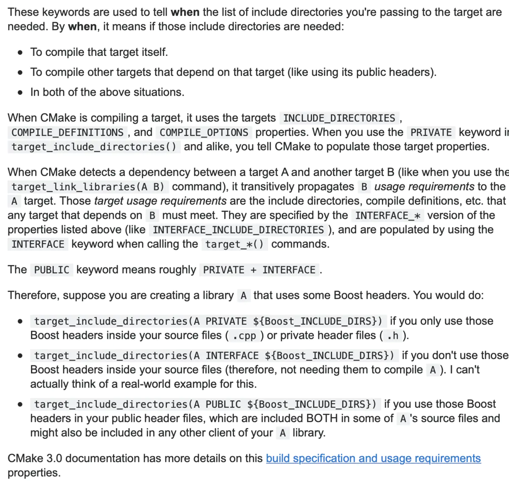

# cmake 子目录

```cmake

# Scans the current directory and returns a list of subdirectories.
# Third parameter is 1 if you want relative paths returned.
# Usage: list_subdirectories(the_list_is_returned_here C:/cwd 1)
macro(list_subdirectories retval curdir return_relative)
  file(GLOB sub-dir RELATIVE ${curdir} *)
  set(list_of_dirs "")
  foreach(dir ${sub-dir})
    if(IS_DIRECTORY ${curdir}/${dir})
      if (${return_relative})
        set(list_of_dirs ${list_of_dirs} ${dir})
      else()
        set(list_of_dirs ${list_of_dirs} ${curdir}/${dir})
      endif()
    endif()
  endforeach()
  set(${retval} ${list_of_dirs})
endmacro()
```


# globalutils.cmake

https://github.com/inviwo/inviwo/blob/master/cmake/globalutils.cmake


```cmake
#################################################################################
#
# Inviwo - Interactive Visualization Workshop
#
# Copyright (c) 2013-2020 Inviwo Foundation
# All rights reserved.
# 
# Redistribution and use in source and binary forms, with or without
# modification, are permitted provided that the following conditions are met: 
# 
# 1. Redistributions of source code must retain the above copyright notice, this
# list of conditions and the following disclaimer. 
# 2. Redistributions in binary form must reproduce the above copyright notice,
# this list of conditions and the following disclaimer in the documentation
# and/or other materials provided with the distribution. 
# 
# THIS SOFTWARE IS PROVIDED BY THE COPYRIGHT HOLDERS AND CONTRIBUTORS "AS IS" AND
# ANY EXPRESS OR IMPLIED WARRANTIES, INCLUDING, BUT NOT LIMITED TO, THE IMPLIED
# WARRANTIES OF MERCHANTABILITY AND FITNESS FOR A PARTICULAR PURPOSE ARE
# DISCLAIMED. IN NO EVENT SHALL THE COPYRIGHT OWNER OR CONTRIBUTORS BE LIABLE FOR
# ANY DIRECT, INDIRECT, INCIDENTAL, SPECIAL, EXEMPLARY, OR CONSEQUENTIAL DAMAGES
# (INCLUDING, BUT NOT LIMITED TO, PROCUREMENT OF SUBSTITUTE GOODS OR SERVICES;
# LOSS OF USE, DATA, OR PROFITS; OR BUSINESS INTERRUPTION) HOWEVER CAUSED AND
# ON ANY THEORY OF LIABILITY, WHETHER IN CONTRACT, STRICT LIABILITY, OR TORT
# (INCLUDING NEGLIGENCE OR OTHERWISE) ARISING IN ANY WAY OUT OF THE USE OF THIS
# SOFTWARE, EVEN IF ADVISED OF THE POSSIBILITY OF SUCH DAMAGE.
# 
#################################################################################

#--------------------------------------------------------------------
# This file contains a collection of CMake utility scripts

#--------------------------------------------------------------------
# first_case_upper(retval string)
# Make the first letter uppercase and the rest lower
function(first_case_upper retval value)
    string(TOLOWER ${value} lowercase)
    string(SUBSTRING ${lowercase} 0 1 first_letter)
    string(TOUPPER ${first_letter} first_letter)
    string(REGEX REPLACE "^.(.*)" "${first_letter}\\1" result "${lowercase}")
    set(${retval} ${result} PARENT_SCOPE)
endfunction()

function(lowercase retval)
    set(the_list "")
    foreach(item ${ARGN})
        string(TOLOWER ${item} lowercase)
        list(APPEND the_list ${lowercase})
    endforeach()
    set(${retval} ${the_list} PARENT_SCOPE)
endfunction()

#--------------------------------------------------------------------
# ivw_join(sep glue output)
# Joins list by replacing the separator with glue
function(ivw_join sep glue output)
    string (REGEX REPLACE "([^\\]|^)${sep}" "\\1${glue}" _TMP_STR "${ARGN}")
    # duplicate all backslashes
    string (REGEX REPLACE "[\\](.)" "\\1" _TMP_STR "${_TMP_STR}")
    set(${output} "${_TMP_STR}" PARENT_SCOPE)
endfunction()

#--------------------------------------------------------------------
# ivw_prepend(output str)
# ivw_prepends str to each element of the input
function(ivw_prepend var prefix)
   set(listVar "")
   foreach(f ${ARGN})
      list(APPEND listVar "${prefix}${f}")
   endforeach(f)
   set(${var} "${listVar}" PARENT_SCOPE)
endfunction(ivw_prepend)

#--------------------------------------------------------------------
# encodeLineBreaks(output strings)
# encodes the contents of the string given as last argument and saves the 
# result in output.
# Linebreaks ('\n'), semicolon (';'), and quotes ('"') are replaced for better handling 
# within CMAKE with __LINEBREAK__ and __SEMICOLON__, respectively.
function(encodeLineBreaks output)
    # replace linebreaks
    string(REPLACE "\n" "__LINEBREAK__" _tmp_str "${ARGN}")
    # replace semicolon, as it is interpreted as a list separator by CMAKE
    string(REPLACE ";" "__SEMICOLON__" _tmp_str "${_tmp_str}")
    # replace quotes as well
    string(REPLACE "\"" "__QUOTE__" _tmp_str "${_tmp_str}")
    set(${output} "${_tmp_str}" PARENT_SCOPE)
endfunction()

#--------------------------------------------------------------------
# decodeLineBreaks(output strings)
# reverse the encoding done by encodeLineBreaks(), i.e. __LINEBREAK__ and 
# __SEMICOLON__ are reverted to '\n' and ';', respectively.
function(decodeLineBreaks output)
    # revert linebreaks
    string(REPLACE "__LINEBREAK__" "\n" _tmp_str "${ARGN}")
    # revert semicolon
    string(REPLACE "__SEMICOLON__" ";" _tmp_str "${_tmp_str}")
    # revert quotes
    string(REPLACE "__QUOTE__" "\"" _tmp_str "${_tmp_str}")
    set(${output} "${_tmp_str}" PARENT_SCOPE)
endfunction()

#--------------------------------------------------------------------
# list_all_variables()
# prints all variables and values.
macro(list_all_variables)
    get_cmake_property(_variableNames VARIABLES)
    foreach (_variableName ${_variableNames})
        message(STATUS "${_variableName}=${${_variableName}}")
    endforeach()
endmacro()

#--------------------------------------------------------------------
# list_subdirectories(ret curdir return_relative)
# List subdirectories, excluding dirs starting with "."
function(list_subdirectories retval curdir return_relative)
    file(GLOB sub-dir RELATIVE ${curdir} ${curdir}/[^.]*)
    set(list_of_dirs "")
    foreach(dir ${sub-dir})
        if(IS_DIRECTORY ${curdir}/${dir})
            if (${return_relative})
                set(list_of_dirs ${list_of_dirs} ${dir})
            else()
                set(list_of_dirs ${list_of_dirs} ${curdir}/${dir})
            endif()
        endif()
    endforeach()
    set(${retval} ${list_of_dirs} PARENT_SCOPE)
endfunction()

#--------------------------------------------------------------------
# remove_duplicates(retval item item ...)
# Clean duplicates from list subdirectories
function(remove_duplicates retval)
    set(list_of_dirs ${ARGN})
    if(list_of_dirs)
        list(REMOVE_DUPLICATES list_of_dirs)
    endif()
    set(${retval} ${list_of_dirs} PARENT_SCOPE)
endfunction()

#--------------------------------------------------------------------
# remove_from_list(retval thelist toRemove0 toRemove1 ...)
# Remove entries in one list from another list
function(remove_from_list retval thelist)
    set(new_items ${thelist})
    set(old_items ${ARGN})
    if(old_items AND new_items)
        foreach(item ${old_items})
            list(REMOVE_ITEM new_items ${item})
        endforeach()
    endif()
    set(${retval} ${new_items} PARENT_SCOPE)
endfunction()


#--------------------------------------------------------------------
# list_intersection(retval list_a list_b)
# return items that are in both lists
function(list_intersection retval list_a list_b)
    set(intersection "")
    list(REMOVE_DUPLICATES list_a)
    list(REMOVE_DUPLICATES list_b)
    
    foreach(item ${list_a})
        list(FIND list_b ${item} index)
        if(NOT index EQUAL -1)
            list(APPEND intersection ${item})
        endif()
    endforeach()
    set(${retval} ${intersection} PARENT_SCOPE)
endfunction()

#--------------------------------------------------------------------
# list_to_stringvector(retval item1 item2 ...) -> {"item1", "item2", ...}
# builds a string vector 
function(list_to_stringvector retval)
    set (items ${ARGN})
    list(LENGTH items len)
    if (${len} GREATER 0)
        ivw_join(";" "\", \"" res ${items})
        set(${retval} "{\"${res}\"}" PARENT_SCOPE)
    else()
        set(${retval} "{}" PARENT_SCOPE)
    endif()
endfunction()
function(list_to_longstringvector retval) # same but with linebreaks
    set (items ${ARGN})
    list(LENGTH items len)
    if (${len} GREATER 0)
        ivw_join(";" "\",\n    \"" res ${items})
        set(${retval} "{\n    \"${res}\"\n}" PARENT_SCOPE)
    else()
        set(${retval} "{}" PARENT_SCOPE)
    endif()
endfunction()

#--------------------------------------------------------------------
# mark_as_internal(var)
# hides the given variable in all CMake UIs
macro ( mark_as_internal _var )
  set ( ${_var} ${${_var}} CACHE INTERNAL "hide this!" FORCE )
endmacro( mark_as_internal _var )

#--------------------------------------------------------------------
# ivw_add_module_option_to_cache(mod ON/OFF [FORCE])
# add/update a module to the CMake cache
function(ivw_add_module_option_to_cache mod onoff)
    set(options "FORCE;ON;OFF")
    set(oneValueArgs "")
    set(multiValueArgs "")
    cmake_parse_arguments(ARG "${options}" "${oneValueArgs}" "${multiValueArgs}" ${ARGN})

    set(desc "Build ${${mod}_name} Module\nPath: ${${mod}_path}")

    if(${mod}_version)
        set(desc "${desc}\nVersion: ${${mod}_version}")
    endif()
    if(${mod}_dependencies)
        ivw_join(";" ", " res ${${mod}_dependencies})
        set(desc "${desc}\nDependencies: ${res}")
    endif()    
    if(${mod}_description)
        decodeLineBreaks(decodedDesc ${${mod}_description})
        set(desc "${desc}\n\n${decodedDesc}")
    endif()

    if(ARG_FORCE)
        set(${${mod}_opt} ${onoff} CACHE BOOL "${desc}" FORCE)
    elseif(NOT DEFINED ${${mod}_opt})
        option(${${mod}_opt} "${desc}" ${onoff})
    else()
        # need to do this to update the docstring
        set(${${mod}_opt} ${${${mod}_opt}} CACHE BOOL "${desc}" FORCE)
    endif()
endfunction()

#--------------------------------------------------------------------
# Name conventions:
# opengl                 : dir                : Name of module folder, should be lowercase with no spaces (opengl)
# OpenGl                 : class              : The c++ class name / the module project name
# OPENGL                 : macro_name         : C Macro name, to uppercase, "-" -> "_"
# INVIWOOPENGLMODULE     : mod_dep            : Internal name for module all uppercase
# REG_INVIWOOPENGLMODULE : reg                : Registration macro
# IVW_MODULE_OPENGL      : mod_prefix         : Name of cmake option for module
# InviwoOpenGLModule     : mod_name           : The name of a module same as mod_dep, but not uppercase
# inviwo-module-opengl   : module_target_name : The name of the target for a module
# 
# Name conversion functions:
# ivw_to_macro_name            OpenGL-test        -> OPENGL_TEST
# ivw_dir_to_mod_dep           opengl             -> INVIWOOPENGLMODULE
# ivw_mod_dep_to_dir           INVIWOOPENGLMODULE -> opengl 
# ivw_dir_to_mod_prefix        opengl             -> IVW_MODULE_OPENGL
# ivw_mod_prefix_to_dir        IVW_MODULE_OPENGL  -> opengl
# ivw_mod_name_to_dir          InviwoOpenGLModule -> opengl
# ivw_mod_name_to_target_name  InviwoOpenGLModule -> inviwo-module-opengl
# ivw_mod_name_to_class        InviwoOpenGLModule -> OpenGL
# ivw_mod_name_to_mod_dep      InviwoOpenGLModule -> INVIWOOPENGLMODULE
# ivw_mod_name_to_reg          InviwoOpenGLModule -> REG_INVIWOOPENGLMODULE
# ivw_to_mod_name              OpenGL             -> InviwoOpenGLModule
# ivw_dir_to_module_taget_name opengl             -> inviwo-module-opengl
# ivw_mod_name_to_alias        InviwoOpenGLModule -> inviwo::module::opengl
#--------------------------------------------------------------------

#--------------------------------------------------------------------
# ivw_to_macro_name(retval item1 item2 ...)
# Convert a name to a macro name, i.e. OpenGL-test -> OPENGL_TEST
function(ivw_to_macro_name retval)
    set(the_list "")
    foreach(item ${ARGN})
        string(TOUPPER ${item} u_item)
        string(REGEX REPLACE "-" "_" new_item ${u_item})
        list(APPEND the_list "${new_item}")
    endforeach()
    set(${retval} ${the_list} PARENT_SCOPE)
endfunction()


#--------------------------------------------------------------------
# ivw_dir_to_mod_dep(retval item1 item2 ...)
# Convert directory name tp module dep, i.e. opengl -> INVIWOOPENGLMODULE
function(ivw_dir_to_mod_dep retval)
    set(the_list "")
    foreach(item ${ARGN})
        string(TOUPPER ${item} u_item)
        list(APPEND the_list "INVIWO${u_item}MODULE")
    endforeach()
    set(${retval} ${the_list} PARENT_SCOPE)
endfunction()


#--------------------------------------------------------------------
# ivw_dir_to_mod_prefix(retval item1 item2 ...)
# Convert dir name to  module prefix, i.e. opengl -> IVW_MODULE_OPENGL
function(ivw_dir_to_mod_prefix retval)
    set(the_list "")
    foreach(item ${ARGN})
        string(TOUPPER ${item} u_item)
        list(APPEND the_list IVW_MODULE_${u_item})
    endforeach()
    set(${retval} ${the_list} PARENT_SCOPE)
endfunction()

#--------------------------------------------------------------------
# ivw_mod_dep_to_dir(relval item1 item2 ...)
# Convert module dep to directory name, i.e. INVIWOOPENGLMODULE -> opengl
function(ivw_mod_dep_to_dir retval)
    set(the_list "")
    foreach(item ${ARGN})
        string(REGEX MATCH "^INVIWO(.*)MODULE$" found_item ${item})
        if(CMAKE_MATCH_1)
            string(TOLOWER ${CMAKE_MATCH_1} l_new_item)
            list(APPEND the_list ${l_new_item})
        endif()
    endforeach()
    set(${retval} ${the_list} PARENT_SCOPE)
endfunction()

#--------------------------------------------------------------------
# ivw_mod_prefix_to_dir(relval item1 item2 ...)
# Convert module prefix to directory name, i.e. IVW_MODULE_OPENGL -> opengl
function(ivw_mod_prefix_to_dir retval)
    set(the_list "")
    foreach(item ${ARGN})
        string(REGEX MATCH "(^IVW_MODULE_$)" found_item ${item})
        if(found_item)
            string(REGEX REPLACE "(^IVW_MODULE_$)" "" new_item ${item})
            string(TOLOWER ${new_item} l_new_item)
            list(APPEND the_list ${l_new_item})
        endif()
    endforeach()
    set(${retval} ${the_list} PARENT_SCOPE)
endfunction()

#--------------------------------------------------------------------
# ivw_mod_name_to_dir(retval item1 item2 ...)
# Convert module name to directory name, i.e. InviwoOpenGLModule -> opengl
function(ivw_mod_name_to_dir retval)
    set(the_list "")
    foreach(item ${ARGN})
        string(REGEX MATCH "(^Inviwo.*.Module$)" found_item ${item})
        if(found_item)
            string(REGEX REPLACE "(^Inviwo)|(Module$)" "" new_item ${item})
            string(TOLOWER ${new_item} l_new_item)
            list(APPEND the_list ${l_new_item})
        else()
            message(FATAL_ERROR "Error argument format error: ${item}, should be in the form Inviwo<Name>Module")
        endif()
    endforeach()
    set(${retval} ${the_list} PARENT_SCOPE)
endfunction()

#--------------------------------------------------------------------
# ivw_mod_name_to_class(retval item1 item2 ...)
# Convert module name to directory name, i.e. InviwoOpenGLModule -> OpenGL
function(ivw_mod_name_to_class retval)
    set(the_list "")
    foreach(item ${ARGN})
        string(REGEX MATCH "(^Inviwo.*.Module$)" found_item ${item})
        if(found_item)
            string(REGEX REPLACE "(^Inviwo)|(Module$)" "" new_item ${item})
            list(APPEND the_list ${new_item})
        else()
            message(FATAL_ERROR "Error argument format error: ${item}, should be in the form Inviwo<Name>Module")
        endif()
    endforeach()
    set(${retval} ${the_list} PARENT_SCOPE)
endfunction()

#--------------------------------------------------------------------
# ivw_mod_name_to_alias(retval item1 item2 ...)
# Convert module name to alias name, i.e. InviwoOpenGLModule -> inviwo::module::alias
# using module data
function(ivw_mod_name_to_alias retval)
    set(the_list "")
    foreach(item ${ARGN})
        ivw_mod_name_to_mod_dep(mod ${item})
        list(APPEND the_list ${${mod}_alias})
    endforeach()
    set(${retval} ${the_list} PARENT_SCOPE)
endfunction()

#--------------------------------------------------------------------
# ivw_mod_name_to_target_name(retval item1 item2 ...)
# Convert module name to target name, i.e. InviwoOpenGLModule -> inviwo-opengl-module
function(ivw_mod_name_to_target_name retval)
    set(dirs "")
    ivw_mod_name_to_dir(dirs ${ARGN})
    set(targets "")
    ivw_dir_to_module_taget_name(targets ${dirs})
    set(${retval} ${targets} PARENT_SCOPE)
endfunction()

#--------------------------------------------------------------------
# ivw_to_mod_name(retval item1 item2 ...)
# Convert module name to directory name, i.e. OpenGL -> InviwoOpenGLModule
function(ivw_to_mod_name retval)
    set(the_list "")
    foreach(item ${ARGN})
        list(APPEND the_list Inviwo${item}Module)
    endforeach()
    set(${retval} ${the_list} PARENT_SCOPE)
endfunction()


#--------------------------------------------------------------------
# ivw_dir_to_module_taget_name(retval item1 item2 ...)
# Convert module name to directory name, i.e. opengl -> inviwo-module-opengl
function(ivw_dir_to_module_taget_name retval)
    set(the_list "")
    foreach(item ${ARGN})
        list(APPEND the_list inviwo-module-${item})
    endforeach()
    set(${retval} ${the_list} PARENT_SCOPE)
endfunction()

#--------------------------------------------------------------------
# ivw_mod_name_to_mod_dep(retval item1 item2 ...)
# Convert module name to module dep, i.e. InviwoOpenGLModule -> INVIWOOPENGLMODULE
function(ivw_mod_name_to_mod_dep retval)
    set(the_list "")
    foreach(item ${ARGN})
        string(TOUPPER ${item} uitem)
        list(APPEND the_list ${uitem})
    endforeach()
    set(${retval} ${the_list} PARENT_SCOPE)
endfunction()

#--------------------------------------------------------------------
# ivw_mod_name_to_reg(retval item1 item2 ...)
# Convert module name to module dep, i.e. InviwoOpenGLModule -> REG_INVIWOOPENGLMODULE
function(ivw_mod_name_to_reg retval)
    set(the_list "")
    foreach(item ${ARGN})
        string(TOUPPER ${item} uitem)
        list(APPEND the_list REG_${uitem})
    endforeach()
    set(${retval} ${the_list} PARENT_SCOPE)
endfunction()

# Look for <package>_<vars> and <PACKAGE>_<vars> to figure out whether to use
# incoming casing or upper case name. Upper case is default, but not all use that.
function(ivw_find_package_name name retval)
    set(input 0)
    set(upper 0)

    string(TOUPPER ${name} u_name)

    foreach(prefix FOUND LIBRARY LIBRARIES LIBRARY_DIR LIBRARY_DIRS 
        DEFINITIONS INCLUDE_DIR INCLUDE_DIRS LINK_FLAGS) 
    if(DEFINED ${name}_${prefix})
        MATH(EXPR input "${input}+1")
    endif()
    if(DEFINED ${u_name}_${prefix})
        MATH(EXPR upper "${upper}+1")
    endif()
    endforeach()

    if(${input} GREATER ${upper})
        set(${retval} ${name} PARENT_SCOPE)
    else()
        set(${retval} ${u_name} PARENT_SCOPE)
    endif()
endfunction()

#--------------------------------------------------------------------
# pritty print a list .
# ivw_print_list(list) -> "list  = list1, list2, list3"
function(ivw_print_list list_var)
    string(REPLACE ";" ", " res "${${list_var}}") 
    message(STATUS "${list_var} = ${res}")
endfunction()

#--------------------------------------------------------------------
# repeat a string n times.
# ivw_repeat_str("-" 10 ret) -> "----------"
function(ivw_repeat_str str n retval)
    set(res "")
    while(${n} GREATER 0)
        set(res "${res}${str}")
        MATH(EXPR n "${n}-1")
    endwhile()
    set(${retval} ${res} PARENT_SCOPE)
endfunction()

#--------------------------------------------------------------------
# create a reverse copy of a list
# ivw_reverse_copy(retval list) 
function(ivw_reverse_list_copy list_var revlist)
    set(alist "")
    foreach(i ${${list_var}})
        list(APPEND alist ${i})
    endforeach()
    list(REVERSE alist)
    set(${revlist} ${alist} PARENT_SCOPE)
endfunction()

#--------------------------------------------------------------------
# helper function for topological sort
function(ivw_private_visit_node node sorted_var marked_var tempmarked_var node_list_var node_edge_var count)
    MATH(EXPR count "${count}+1")
    if(${count} GREATER 30)
        message(ERROR "Stoppig to deep recursion")
        return()
    endif()

    set(sorted ${${sorted_var}})
    set(marked ${${marked_var}})
    set(tempmarked ${${tempmarked_var}})
    set(node_list ${${node_list_var}})

    list(FIND tempmarked ${node} tempfound)
    if(NOT ${tempfound} EQUAL -1) # Error not a dag
        message(ERROR "Dependency graph not a DAG. Cant resove for node \"${node}\"")
    endif()

    list(FIND marked ${node} markedfound)
    if(${markedfound} EQUAL -1)  
        # mark node temporarily
        list(APPEND tempmarked ${node})

        # visit all dependencies
        foreach(dep ${${node}${node_edge_var}}) 
            ivw_private_visit_node(${dep} sorted marked tempmarked node_list ${node_edge_var} ${count})
        endforeach()

        # mark node permanently
        list(APPEND marked ${node})
        # unmark node temporarily
        list(REMOVE_ITEM tempmarked ${node})

        # add node to head of sorted
        list(INSERT sorted 0 ${node})
     endif()

    SET(${sorted_var} ${sorted} PARENT_SCOPE)
    SET(${marked_var} ${marked} PARENT_SCOPE)
    SET(${tempmarked_var} ${tempmarked} PARENT_SCOPE)
endfunction()

# A depth first topologocal sort
# https://en.wikipedia.org/wiki/Topological_sorting#Depth-first_search
function(ivw_topological_sort node_list_var node_edge_var sorted_var)
    set(sorted  "")
    set(marked "")
    set(tempmarked "")

    foreach(node ${${node_list_var}})
        list(FIND marked ${node} found)
        if(${found} EQUAL -1)
            ivw_private_visit_node(${node} sorted marked tempmarked ${node_list_var} ${node_edge_var} 0)
        endif()
    endforeach()
    list(REVERSE sorted)
    set(${sorted_var} ${sorted} PARENT_SCOPE)
endfunction()

#--------------------------------------------------------------------
# Get the module name from a CMakeLists.txt
function(ivw_private_get_ivw_module_name path retval)
    file(READ ${path} contents)
    string(REGEX MATCH "ivw_module\\([ \t\r\n]*([A-Za-z0-9_-]+)[ \t\r\n]*\\)" found_item ${contents})
    if(CMAKE_MATCH_1)
        set(${retval} ${CMAKE_MATCH_1} PARENT_SCOPE)
        return()
    endif()
     set(${retval} NOTFOUND PARENT_SCOPE)
endfunction()

#--------------------------------------------------------------------
# Get the module include path
function(ivw_private_get_ivw_module_include_path path includePrefix includePath orgName)
    get_filename_component(name ${path} NAME)
    if(EXISTS "${path}/include/${name}") 
        set(${includePath} "${path}/include/${name}" PARENT_SCOPE)
        set(${includePrefix} "${name}" PARENT_SCOPE)
        set(${orgName} "" PARENT_SCOPE)
        return()
    endif()
    
    if(EXISTS "${path}/include/")
        file(GLOB subdirs RELATIVE "${path}/include/" "${path}/include/[^.]*")
        foreach(item IN LISTS subdirs)
            if(EXISTS "${path}/include/${item}/${name}")
                set(${includePath} "${path}/include/${item}/${name}" PARENT_SCOPE)
                set(${includePrefix} "${item}/${name}" PARENT_SCOPE)
                set(${orgName} "${item}" PARENT_SCOPE)
                return()
            endif()
        endforeach()
    endif()
    
    set(${includePath} "${path}" PARENT_SCOPE)
    set(${includePrefix} "modules/${name}" PARENT_SCOPE)
    set(${orgName} "modules" PARENT_SCOPE)
    
endfunction()

#--------------------------------------------------------------------
# Get the module version from a CMakeLists.txt
# Major.Minor.Path
# Returns 1.0.0 if no version is found
function(ivw_private_get_ivw_module_version path retval)
    file(READ ${path} contents)
    string(REPLACE "\n" ";" lines "${contents}")
    foreach(line ${lines})
        # This regex does not seem to be supported in cmake so use a two-step solution
        #string(REGEX MATCHALL "IVW_.+_VERSION\\s([0-9]+)\\.([0-9]+)\\.([0-9]+)" found_item ${line})
        string(REGEX MATCH "IVW_(.+)_VERSION" found_mod ${line})

        if(CMAKE_MATCH_1)
            # Extract version number
            string(REGEX MATCH "\\s*\"*([0-9]+)\\.([0-9]+)\\.([0-9]+)" found_item ${line})
            if(NOT "${CMAKE_MATCH_1}" STREQUAL "" AND NOT "${CMAKE_MATCH_2}" STREQUAL "" AND NOT "${CMAKE_MATCH_3}" STREQUAL "")
                set(${retval} "${CMAKE_MATCH_1}.${CMAKE_MATCH_2}.${CMAKE_MATCH_3}" PARENT_SCOPE)
                return()
            endif()
        endif()
    endforeach()
    #ivw_message("Did not find version in (${path})")
    set(${retval} "1.0.0" PARENT_SCOPE)
endfunction()

# Verify that a given path and dir name is in fact a inviwo module
# This is done by chekcing that there exists a CMakeLists file
# and that it declares a inviwo module with the same name as dir.
function(ivw_private_is_valid_module_dir path dir retval)
    if(IS_DIRECTORY ${path}/${dir})
        string(TOLOWER ${dir} test)
        string(REPLACE " " "" ${test} test)
        if(${dir} STREQUAL ${test})
            if(EXISTS ${path}/${dir}/CMakeLists.txt)
                ivw_private_get_ivw_module_name(${path}/${dir}/CMakeLists.txt name)
                string(TOLOWER ${name} l_name)
                if(${dir} STREQUAL ${l_name})
                    set(${retval} TRUE PARENT_SCOPE)
                    return()
                else()
                    message("Found invalid module \"${dir}\" at \"${path}\". "
                        "ivw_module called with \"${name}\" which is different from the directory \"${dir}\""
                        "They should be the same except for casing.")
                endif()
            else()
                message("Found invalid module \"${dir}\" at \"${path}\". "
                    "CMakeLists.txt is missing")
            endif()
        else()
            message("Found invalid module dir \"${dir}\" at \"${path}\". "
                "Dir names should be all lowercase and without spaces")
        endif()
    endif()
    set(${retval} FALSE PARENT_SCOPE)
endfunction()

#--------------------------------------------------------------------
# Query if a lib is compiled with 32 or 64 bits, will return 0 if it 
# could not find out. 
function(ivw_library_bits lib retval)
    if(WIN32)
        get_filename_component(vcpath ${CMAKE_CXX_COMPILER} DIRECTORY)
        execute_process(COMMAND CMD /c dumpbin.exe ${lib} /headers | findstr machine 
                        WORKING_DIRECTORY ${vcpath} 
                        OUTPUT_VARIABLE result)
 
        string(REGEX MATCH "(x64)" found_64bit ${result})
        if(CMAKE_MATCH_1)
            set(${retval} 64 PARENT_SCOPE)
            return()
        endif()
        string(REGEX MATCH "(x86)" found_32bit ${result})
        if(CMAKE_MATCH_1)
            set(${retval} 32 PARENT_SCOPE)
            return()
        endif()
    elseif(APPLE)
        execute_process(COMMAND file -L -b ${lib} OUTPUT_VARIABLE result)
        string(REGEX MATCH "(x86_64)" found_64bit ${result})
        if(CMAKE_MATCH_1)
            set(${retval} 64 PARENT_SCOPE)
            return()
        endif()
        string(REGEX MATCH "(i386)" found_32bit ${result})
        if(CMAKE_MATCH_1)
            set(${retval} 32 PARENT_SCOPE)
            return()
        endif()
    else()
        execute_process(COMMAND file -L -b ${lib} OUTPUT_VARIABLE result)
        string(REGEX MATCH "(x86-64)" found_64bit ${result})
        if(CMAKE_MATCH_1)
            set(${retval} 64 PARENT_SCOPE)
            return()
        endif()
        string(REGEX MATCH "(80386)" found_32bit ${result})
        if(CMAKE_MATCH_1)
            set(${retval} 32 PARENT_SCOPE)
            return()
        endif()
    endif()

    set(${retval} 0 PARENT_SCOPE)
endfunction()

#--------------------------------------------------------------------
# From a 
function(ivw_find_unique_path_segements retval paths)
    list(LENGTH paths npaths)

    # Remove non-unique start of path
    set(ind 0)
    set(names ${paths})
    set(ret ${paths})
    list(LENGTH names n_names)
    while(n_names EQUAL npaths)
        set(ret ${names})
        set(names "")
        foreach(module ${paths})
            set(path "")
            set(i 0)
            string(REPLACE "/" ";" module_list ${module})
            foreach(dir ${module_list})
                if( i GREATER ind OR i EQUAL ind)
                    list(APPEND path ${dir})
                endif()
                MATH(EXPR i "${i}+1")
            endforeach()
            string(REPLACE ";" "/" path_joined "${path}")
            list(APPEND names ${path_joined})
        endforeach()
        list(REMOVE_DUPLICATES names)
        list(LENGTH names n_names)
        MATH(EXPR ind "${ind}+1")
    endwhile()
    
    # Remove non-unique end of path
    set(ind 0)
    set(new_module_bases ${ret})
    set(names ${ret})
    list(LENGTH names n_names)
    while(n_names EQUAL npaths)
        set(ret ${names})
        set(names "")
        foreach(module ${new_module_bases})
            set(path "")
            set(i 0)
            string(REPLACE "/" ";" module_list ${module})
            list(REVERSE module_list)
            foreach(dir ${module_list})
                if( i GREATER ind OR i EQUAL ind)
                    list(APPEND path ${dir})
                endif()
                MATH(EXPR i "${i}+1")
            endforeach()
            list(REVERSE path)
            string(REPLACE ";" "/" path_joined "${path}")
            list(APPEND names ${path_joined})
        endforeach()
        list(REMOVE_DUPLICATES names)
        list(LENGTH names n_names)
        MATH(EXPR ind "${ind}+1")
    endwhile()
    set(${retval} ${ret} PARENT_SCOPE)
endfunction()


#--------------------------------------------------------------------
# A function to try to retrive the git hash of the last commit in a 
# directory
function(ivw_git_get_hash dir retval)
    find_package(Git QUIET)
    if(GIT_FOUND)
        execute_process(COMMAND "${GIT_EXECUTABLE}" describe --match=NeVeRmAtCh --always --abbrev=20 --dirty
            WORKING_DIRECTORY ${dir}
            RESULT_VARIABLE result
            OUTPUT_VARIABLE version
            ERROR_QUIET OUTPUT_STRIP_TRAILING_WHITESPACE)
        if(${result} EQUAL 0)
            set(${retval} ${version} PARENT_SCOPE)
            return()
        endif()
    endif()
    set(${retval} "????????" PARENT_SCOPE)
endfunction()

#--------------------------------------------------------------------
# A helper funtion to generate a header file with inviwo build 
# information, like the build date and the commit hash
# ivw_generate_build_info(<template> <outputfile> <module dir1> <module dir2> ...
function(ivw_generate_build_info source_template ini_template buildinfo_sourcefile buildinfo_inifile)
    ivw_find_unique_path_segements(unique_names "${ARGN}")
    set(index 0)
    set(hashes_list "")
    foreach(dir ${ARGN})
        list(GET unique_names ${index} name)
        ivw_git_get_hash(${dir} hash)
        list(APPEND hashes_list "{\"${name}\", \"${hash}\"}")
        MATH(EXPR index "${index}+1")
    endforeach()
    string(REPLACE ";" ",\n            " hashes "${hashes_list}")
    set(HASHES "{\n            ${hashes}\n        }")
    set(NHASHES "${index}")

    set(index 0)
    set(hashes_list "")
    foreach(dir ${ARGN})
        list(GET unique_names ${index} name)
        ivw_git_get_hash(${dir} hash)
        list(APPEND hashes_list "${name}=${hash}")
        MATH(EXPR index "${index}+1")
    endforeach()
    string(REPLACE ";" "\n" hashes "${hashes_list}")
    set(INIHASHES "${hashes}")


    string(TIMESTAMP TMPYEAR "%Y")
    string(REGEX REPLACE "0*([0-9]+)" "\\1" YEAR ${TMPYEAR})
    string(TIMESTAMP TMPMONTH "%m")
    string(REGEX REPLACE "0*([0-9]+)" "\\1" MONTH ${TMPMONTH})
    string(TIMESTAMP TMPDAY "%d")
    string(REGEX REPLACE "0*([0-9]+)" "\\1" DAY ${TMPDAY})
    string(TIMESTAMP TMPHOUR "%H")
    string(REGEX REPLACE "0*([0-9]+)" "\\1" HOUR ${TMPHOUR})
    string(TIMESTAMP TMPMINUTE "%M")
    string(REGEX REPLACE "0*([0-9]+)" "\\1" MINUTE ${TMPMINUTE})
    string(TIMESTAMP TMPSECOND "%S")
    string(REGEX REPLACE "0*([0-9]+)" "\\1" SECOND ${TMPSECOND})
    configure_file("${source_template}" "${buildinfo_sourcefile}" @ONLY)

    string(REPLACE "\"" "" ini_dest_path ${INI_DEST_PATH})
    configure_file("${ini_template}" "${ini_dest_path}${buildinfo_inifile}" @ONLY)
endfunction()

#--------------------------------------------------------------------
# Append to cmake module path
macro(ivw_add_cmake_find_package_path)
    foreach(item ${ARGN})
        set(CMAKE_MODULE_PATH ${CMAKE_MODULE_PATH} ${item})
    endforeach()
endmacro()

#--------------------------------------------------------------------
# Get target properties recursively by following all INTERFACE_LINK_LIBRARIES
function(ivw_get_target_property_recursive retval target property alsoInterfaceTargets)
    set(res "")
    get_target_property(target_type ${target} TYPE)
    if(NOT ${target_type} STREQUAL "INTERFACE_LIBRARY" OR ${alsoInterfaceTargets})
        get_target_property(propval ${target} ${property})
        if(propval)
            list(APPEND res ${propval})
        endif()

        get_target_property(interface_link_libs ${target} INTERFACE_LINK_LIBRARIES)
        foreach(t ${interface_link_libs})
            if(TARGET ${t})
                ivw_get_target_property_recursive(val ${t} ${property} ${alsoInterfaceTargets})
                list(APPEND res ${val})
            endif()
        endforeach(t)
    endif()
    list(REMOVE_DUPLICATES res)
    set(${retval} ${res} PARENT_SCOPE)
endfunction()

function(ivw_move_targets_in_dir_to_folder directory folder)
    get_property(targets DIRECTORY ${directory} PROPERTY BUILDSYSTEM_TARGETS)
    foreach(target IN LISTS targets)
        get_target_property(type ${target} TYPE)
        if(NOT ${type} STREQUAL INTERFACE_LIBRARY)
            set_target_properties(${target} PROPERTIES FOLDER ${folder})
        endif()
    endforeach()

    get_property(dirs DIRECTORY ${directory} PROPERTY SUBDIRECTORIES)
    foreach(dir IN LISTS dirs) 
        ivw_move_targets_in_dir_to_folder(${dir} ${folder})
    endforeach()
endfunction()

function(ivw_suppress_warnings_for_targets_in_dir directory)
    get_property(targets DIRECTORY ${directory} PROPERTY BUILDSYSTEM_TARGETS)
    foreach(target IN LISTS targets)
        get_target_property(type ${target} TYPE)
        if(NOT ${type} STREQUAL INTERFACE_LIBRARY)
            ivw_suppress_compiler_warnings(${target})
        endif()
    endforeach()

    get_property(dirs DIRECTORY ${directory} PROPERTY SUBDIRECTORIES)
    foreach(dir IN LISTS dirs) 
        ivw_suppress_warnings_for_targets_in_dir(${dir} ${folder})
    endforeach()
endfunction()

function(ivw_print_targets_in_dir_recursive directory)
    get_property(targets DIRECTORY ${directory} PROPERTY BUILDSYSTEM_TARGETS)
    message(STATUS "${directory}: ${targets}")
    
    get_property(dirs DIRECTORY ${directory} PROPERTY SUBDIRECTORIES)
    foreach(dir IN LISTS dirs) 
        ivw_print_targets_in_dir_recursive(${dir})
    endforeach()
endfunction()

function(ivw_get_targets_in_dir_recursive retval directory)
    set(res "")
    get_property(targets DIRECTORY ${directory} PROPERTY BUILDSYSTEM_TARGETS)
    list(APPEND res ${targets})
    
    get_property(dirs DIRECTORY ${directory} PROPERTY SUBDIRECTORIES)
    foreach(dir IN LISTS dirs) 
        ivw_get_targets_in_dir_recursive(targets ${dir})
        list(APPEND res ${targets})
    endforeach()
    set(${retval} ${res} PARENT_SCOPE)
endfunction()

function(ivw_copy_if retval)
    set(options "EVAL")
    set(oneValueArgs LIST PROJECTOR VALUE)
    set(multiValueArgs "")
    cmake_parse_arguments(ARG "${options}" "${oneValueArgs}" "${multiValueArgs}" ${ARGN})

    set(res "")
    foreach(item IN LISTS ${ARG_LIST})
        if(ARG_PROJECTOR AND ARG_VALUE)
            if (ARG_EVAL)
                if ("${${${item}${ARG_PROJECTOR}}}" STREQUAL "${ARG_VALUE}")
                    list(APPEND res ${item})
                endif()
            else()
                if ("${${item}${ARG_PROJECTOR}}" STREQUAL "${ARG_VALUE}")
                    list(APPEND res ${item})
                endif()
            endif()
        elseif(ARG_PROJECTOR)
            if(ARG_EVAL)
                if ("${${${item}${ARG_PROJECTOR}}}")
                    list(APPEND res ${item})
                endif()
            else()
                if ("${${item}${ARG_PROJECTOR}}")
                    list(APPEND res ${item})
                endif()
            endif()
        elseif(ARG_VALUE)
            if(ARG_EVAL)
                if ("${${item}}" STREQUAL "${ARG_VALUE}")
                libist(APPEND res ${item})
                endif()
            else() 
                if ("${item}" STREQUAL "${ARG_VALUE}")
                    list(APPEND res ${item})
                endif()
            endif()
        else()
            if(ARG_EVAL)
                if (${${item}})
                    list(APPEND res ${item})
                endif()
            else() 
                if (${item})
                    list(APPEND res ${item})
                endif()
            endif()
        endif()
    endforeach()
    set(${retval} ${res} PARENT_SCOPE)
endfunction()

#-----------------------------------------------------------------------
# Uses QT's windeployqt.exe to copy necessary QT-dependencies (dlls etc) 
# for the given target to the build folder. 
# Does nothing on platforms other than Windows. 
function(ivw_deploy_qt target)
    if(WIN32)
        get_target_property(target_type ${target} TYPE)
        # For dll-builds (ie BUILD_SHARED_LIBS == true) we need to run it for both .dll and .exe
        # For lib-builds (ie BUILD_SHARED_LIBS == false) we need to run it for only .exe (there are no .dll)
        if (BUILD_SHARED_LIBS OR (target_type STREQUAL "EXECUTABLE")) 
            find_program(WINDEPLOYQT_EXECUTABLE NAMES windeployqt HINTS ${QTDIR} ENV QTDIR PATH_SUFFIXES bin)

            get_filename_component(qt_bin_dir ${WINDEPLOYQT_EXECUTABLE} DIRECTORY  )

            # in case of environment variable QTDIR not set
            if(NOT EXISTS ${WINDEPLOYQT_EXECUTABLE})
                get_target_property(qmake_executable Qt5::qmake IMPORTED_LOCATION)
                get_filename_component(qt_bin_dir "${qmake_executable}" DIRECTORY)
                find_program(WINDEPLOYQT_EXECUTABLE NAMES windeployqt HINTS ${qt_bin_dir} )
            endif()

            add_custom_command(
                TARGET ${target} POST_BUILD 
                COMMAND ${WINDEPLOYQT_EXECUTABLE} 
                    --no-compiler-runtime --verbose 1 $<TARGET_FILE:${target}>
            )
        endif()
    endif()
endfunction()
```


# cmake

> # 一、Cmake语法详解
>
> ## 1、什么是CMake
>
> - 在Android Studio 2.2及以上，构建原生库的默认工具是`CMake`。
> - CMake是一个跨平台的构建工具，可以用简单的语句来描述所有平台的安装（编译过程）。能够输出各种各样的makefile或者project文件。CMake并不直接构建出最终的软件，而是产生其他工具的脚本（如makefile），然后再依据这个工具的构建方式使用。
> - CMake是一个比make更高级的编译配置工具，它可以根据不同的平台、不同的编译器，生成相应的makefile或vcproj项目，从而达到跨平台的目的。Android Studio利用CMake生成的是ninja。ninja是一个小型的关注速度的构建系统。我们不需要关心ninja的脚本，知道怎么配置CMake就可以了。
> - CMake其实是一个跨平台的支持产出各种不同的构建脚本的一个工具。
>
> ## 2、CMake源文件
>
> - CMake的源码文件可以包含命令、注释、空格和换行。
> - 以CMake编写的源文件以CmakeLists.txt命名或以.cmake为扩展名。
> - 可以通过`add_subdirectory()`命令把子目录的CMake源文件添加进来。
> - CMake源文件中所有有效的语句都是命令，可以是内置命令或自定义的函数/宏命令。
>
> ## 3、CMake注释
>
> ```
> # 单行注释
> 
> #[[多行注释
> 多行注释
> 多行注释]]
> 复制代码
> ```
>
> - 单行注释：#注释内容（注释从#开始到行尾结束）
> - 钓竿注释：可以使用括号来实现多行注释：#[[多行注释]]
>
> ## 4、CMake变量
>
> ```
> # 声明变量：set(变量名 变量值)
> set(var 123)
> # 引用变量：message 命令用来打印
> message("var = ${var}")
> 复制代码
> ```
>
> - CMake中所有变量都是string类型。可以使用`set()`和`unset()`命令来声明或移除一个变量
> - 变量的引用：`${变量名}`
>
> ## 5、CMake列表（lists）
>
> ```
> # 声明列表：set(列表名 值1 值2 ... 值N)
> # 或set(列表名 "值1;值2;...;值N")
> set(list_var 1 2 3 4 5)
> # 或者
> set(list_var2 "1;2;3;4;5")
> 
> message("list_var = ${list_var}")
> 复制代码
> ```
>
> - 列表也是字符串，可以把列表看作一个特殊的变量，这个变量有多个值。
> - 语法格式：`set(列表名 值1 值2 ... 值N)`、`set(列表名 "值1;值2;...;值N")`
> - 列表的引用：`${列表名}`
>
> ## 6、CMake流程控制-操作符
>
> | 类型 |                             名称                             |
> | :--: | :----------------------------------------------------------: |
> | 一元 |                    EXIST,COMMAND,DEFINED                     |
> | 二元 | EQUAL,LESS,LESS_EQUAL,GREATER,GREATER_EQUAL,STREQUAL,STRLESS,  STRLESS_EQUAL,STRGREATER,STRGREATER_EQUAL,VERSION_EQUAL,VERSION_LESS,  VERSION_LESS_EQUAL,VERSION_GREATER,VERSION_GREATER_EQUAL,MATCHES |
> | 逻辑 |                          NOT,AND,OR                          |
>
> ## 7、CMake流程控制-布尔常量值
>
> | 类型  |                              值                              |
> | :---: | :----------------------------------------------------------: |
> | true  |                   1,ON,YES,TRUE,Y,非0的值                    |
> | false | 0,OFF,NO,FALSE,N,IGNORE,NOTFOUND,空字符串，  以-NOTFOUND结尾的字符串 |
>
> ## 8、CMake流程控制-条件命令
>
> ```
> set(if_tap OFF)
> set(elseif_tap ON)
> 
> if(${if_tap})
> 	message("if")
> elseif(${elseif_tap})
> 	message("elseif")
> else(${if_tap})
> 	message("else")
> endif(${if_tap})
> 复制代码
> ```
>
> - 语法格式：
>
> ```
> if(表达式)
> 	COMMAND(ARGS...)
> elseif(表达式)
> 	COMMAND(ARGS...)
> else(表达式)
> 	COMMAND(ARGS...)
> endif(表达式)
> 复制代码
> ```
>
> - elseif和else部分是可选的，也可以有多个elseif部分，缩进和空格对语句解析没有影响。
>
> ## 9、CMake流程控制-循环命令
>
> ```
> set(a "")
> while(NOT a STREQUAL "xxx")
> 	set(a "${a}x")
> 	message("a = ${a}")
> endwhile()
> 复制代码
> ```
>
> - 语法格式：
>
> ```
> while(表达式)
> 	COMMAND(ARGS...)
> endwhile(表达式)
> 复制代码
> ```
>
> - break()命令可以跳出整个循环。
> - continue()可以跳出当前循环。
>
> ## 10、CMake流程控制-循环遍历
>
> ### 1）格式一
>
> ```
> foreach(item 1 2 3)
> 	message("item = ${item}")
> endforeach(item)
> 复制代码
> ```
>
> - 语法格式：
>
> ```
> foreach(循环变量 参数1 参数2 ... 参数N)
> 	COMMAND(ARGS...)
> endforeach(循环变量)
> 复制代码
> ```
>
> - 每次迭代设置循环变量为参数。
> - foreach也支持break()和continue()命令跳出循环。
>
> ### 2）格式二
>
> ```
> foreach(item RANGE 3)
> 	message("item = ${item}")
> endforeach(item)
> 复制代码
> ```
>
> - 语法格式：
>
> ```
> foreach(循环变量 RANGE total)
> 	COMMAND(ARGS...)
> endforeach(循环变量)
> 复制代码
> ```
>
> - 循环范围从0到total。
>
> ### 3）格式三
>
> ```
> foreach(item RANGE 1 5 2)
> 	message("item = ${item}")
> endforeach(item)
> 复制代码
> ```
>
> - 语法格式：
>
> ```
> foreach(循环变量 RANGE start stop step)
> 	COMMAND(ARGS...)
> endforeach(循环变量)
> 复制代码
> ```
>
> - 循环范围从start到stop，循环增量为step。
>
> ### 4）格式四
>
> ```
> set(list_var 1 2 3)
> 
> foreach(item IN LISTS list_var)
> 	message("item = ${item}")
> endforeach(item)
> 复制代码
> ```
>
> - foreach还支持对列表的循环。
> - 语法格式：
>
> ```
> foreach(循环变量 IN LISTS 列表)
> 	COMMAND(ARGS...)
> endforeach(循环变量)
> 复制代码
> ```
>
> ## 11、CMake自定义函数命令
>
> ```
> function(func x y z)
> 	message("call function func")
> 	message("x = ${x}")
> 	message("y = ${y}")
> 	message("z = ${z}")
> 	message("ARGC = ${ARGC}")
> 	message("arg1 = ${ARGV0} arg2 = ${ARGV1} arg3 = ${ARGV2}")
> 	message("all args = ${ARGV}")
> endfunction(func)
> 
> func(1 2 3)
> 复制代码
> ```
>
> > `ARGC`：表示传入参数的个数。 `ARGV`：表示所有参数。 `ARGV0`：表示第一个参数，`ARGV1`、`ARGV2`以此类推。
>
> - 自定义函数命令格式：
>
> ```
> function(<name> [arg1[arg2[arg3...]]])
> 	COMMAND()
> endfunction(<name>)
> 复制代码
> ```
>
> - 函数命令调用格式：`name(实参列表)`
>
> ## 12、CMake自定义宏命令
>
> ```
> macro(ma x y z)
> 	message("call macro ma")
> 	message("x = ${x}")
> 	message("y = ${y}")
> 	message("z = ${z}")
> endmacro(ma)
> 
> ma(1 2 3)
> 复制代码
> ```
>
> > 函数命令有自己的作用域。 宏命令跟调用者的作用域一样。
>
> - 自定义宏命令格式：
>
> ```
> macro(<name> [arg1[arg2[arg3...]]])
> 	COMMAND()
> endmacro(<name>)
> 复制代码
> ```
>
> - 宏命令调用格式：`name(实参列表)`
>
> ## 13、CMake变量的作用域
>
> - `全局层`：cache变量，在整个项目范围可见，一般在set定义变量时，指定CACHE参数就能定义cache变量。
> - `目录层`：在当前目录CMakeLists.txt中定义，以及在该文件包含的其他cmake源文件中定义的变量。
> - `函数层`：在命令函数中定义的变量，属于函数作用域内的变量。
>
> > 变量查找优先级：`函数层` 优于 `目录层`，`目录层` 优于 `全局层`，即：`函数层` --> `目录层` --> `全局层`
>
> # 二、CMakeList.txt文件详解
>
> ## 1、CMakeLists.txt简析
>
> 使用AndroidStudio3.4创建一个C/C++Support的项目，默认在app/src/main目录下会生成cpp目录，里面包含CMakeLists.txt和native-lib.cpp。以下代码为CMakeLists.txt去掉英文注释格式化后的内容：
>
> ```
> cmake_minimum_required(VERSION 3.4.1)
> 
> # 添加一个库，根据native-lib.cpp源文件编译一个native-lib的动态库
> add_library(
> 	native-lib
> 	SHARED
> 	native-lib.cpp)
> 
> # 查找系统库，这里查找的是系统日志库，并赋值给变量log-lib
> find_library(
> 	log-lib
> 	log)
> 
> # 设置依赖的库（第一个参数必须为目标模块，顺序不能换）
> target_link_libraries(
> 	native-lib
> 	${log-lib})
> 复制代码
> ```
>
> - `cmake_minimum_required`：指定cmake最低支持的版本。这个命令是可选的，如果在CMakeLists.txt文件中使用了高版本特有的命令的话，就需要加上这条命令，来指定CMake的最低支持版本，如果CMake当前版本低于我们指定的版本就会报错。
> - `aux_source_directory(. DIR_SRCS)`：查找当前目录所有源文件，并将源文件名称列表保存到`DIR_SRCS`变量；但不能查找子目录中的源文件。
> - `find_library`：查找系统库，默认会在`AndroidNDK目录\platforms\android-xx\arch-arm\usr\lib`下查找。
>
> ## 2、常用命令-add_library
>
> ### 1）添加一个库
>
> - 添加一个库文件，名为`<name>`。
> - 指定STATIC，SHARED，MODULE参数来指定库的类型。STATIC：静态库，SHARED：动态库，MODULE：在使用dyld的系统有效，若不支持dyld，等同于SHARED。
> - EXCLUDE_FROM_ALL：表示该库不会被默认构建。
> - source1 source2 ... sourceN：用来指定库的源文件。
>
> ```
> add_library(<name> [STATIC | SHARED | MODULE]
>  [EXCLUDE_FROM_ALL] source1 source2 ... sourceN)
> 复制代码
> ```
>
> ### 2）导入预编译库
>
> - 添加一个已存在的预编译库，名为`<name>`。
> - 一般配合set_target_properties使用。
>
> ```
> add_library(<name> <SHARED|STATIC|MODULE|UNKNOW> IMPORTED)
> 
> # 比如
> add_library(test SHARED IMPORTED)
> set_target_properties(
> 	test # 指明目标库名
> 	PROPERTIES IMPORTED_LOCATION # 指明要设置的参数
> 	库路径/${ANDROID_ABI}/libtest.so # 导入库的路径
> )
> 复制代码
> ```
>
> ## 3、常用命令-set
>
> 设置CMake变量：
>
> ```
> # 设置可执行文件的输出路径（EXECUTABLE_OUTPUT_PATH是全局变量）
> set(EXECUTABLE_OUTPUT_PATH [output_path])
> 
> # 设置库文件的输出路径（LIBRARY_OUTPUT_PATH是全局变量）
> set(LIBRARY_OUTPUT_PATH [output_path])
> 
> # 设置C++编译参数（CMAKE_CXX_FLAGS是全局变量）
> set(CMAKE_CXX_FLAGS "-Wall std=c++11")
> 
> # 设置源文件集合（SOURCE_FILES是本地变量即自定义变量）
> set(SOURCE_FILES main.cpp test.cpp ...)
> 复制代码
> ```
>
> ## 4、常用命令-include_directories
>
> 设置头文件目录。
>
> ```
> # 可以用相对或绝对路径，也可以用自定义的变量值
> include_directories(./include ${MY_INCLUDE})
> 复制代码
> ```
>
> > 相当于g++选项中的-l参数。
>
> ## 5、常用命令-add_executable
>
> 添加可执行文件：
>
> ```
> add_executable(<name> ${SRC_LIST})
> 复制代码
> ```
>
> ## 6、常用命令-target_link_libraries
>
> ```
> target_link_libraries(<name> lib1 lib2 lib3)
> 
> # 如果出现互相依赖的静态库，CMake会允许依赖图中包含循环依赖，如：
> add_library(A STATIC a.c)
> add_library(B STATIC b.c)
> target_link_libraries(A B)
> target_link_libraries(B A)
> add_executable(main main.c)
> target_link_libraries(main A)
> 复制代码
> ```
>
> - 将若干库链接到目标库文件。
> - 链接的顺序应当符合gcc链接顺序规则，被链接的库放在依赖它的库的后面，即如果上面的命令中，lib1依赖于lib2，lib2又依赖于lib3，则在上面命令中必须严格按照lib1 lib2 lib3的顺序排列，否则会报错。
>
> ## 7、常用命令-add_definitions
>
> 为当前路径以及子目录的源文件加入由-D引入的define flag
>
> ```
> add_definitions(-DF00 -DDEBUG ...)
> 复制代码
> ```
>
> > 通常用于添加编译参数
>
> ## 8、常用命令-add_subdirectory
>
> 用于添加子目录的CMake源文件：
>
> ```
> # sub_dir指定包含CMakeLists.txt和源码文件的子目录位置
> # binary_dir是输出路径，一般可以不指定
> add_subdirectory(sub_dir [binary_dir])
> 复制代码
> ```
>
> 如果当前目录下还有子目录时可以使用add_subdirectory，子目录中也需要包含有CMakeLists.txt。
>
> ## 9、常用命令-file
>
> 文件操作命令：
>
> ```
> # 将message写入filename文件中，会覆盖文件原有内容
> file(WRITE filename "message")
> # 将message写入filename文件中，会追加在文件末尾
> file(APPEND filename "message")
> # 从filename文件中读取内容并存储到var变量中，如果指定了numBytes和offset，
> # 则从offset处开始最多读numBytes个字节，另外如果指定了HEX参数，则内容会以十六进制形式存储在var变量中
> file(READ filename var [LIMIT numbytes] [OFFSET offset] [HEX])
> # 重命名文件
> file(RENAME <oldname> <newname>)
> # 删除文件，等于rm命令
> file(REMOVE [file1 ...])
> # 递归的执行删除文件命令，等于rm -r
> file(REMOVE_RECURSE [file1...])
> # 根据指定的url下载文件
> # timeout超时时间；下载的状态会保存到status中；下载日志会被保存到log；sum指定所下载文件预期的MD5值，如果指定会自动进行比对，
> # 如果不一致，则返回一个错误；SHOW_PROGRESS，进度信息会以状态信息的形式被打印出来
> file(DOWNLOAD url file [TIMEOUT timeout] [STATUS status] [LOG log] [EXPECTED_MD5 sum] [SHOW_PROGRESS])
> # 创建目录
> file(MAKE_DIRECTORY [dir1 dir2 ...])
> # 会把path转换为以unix的/开头的cmake风格路径，保存到result中
> file(TO_CMAKE_PATH path result)
> # 它会把cmake风格的路径转换为本地路径风格：windows下用"\"，而unix下用"/"
> file(TO_NATIVE_PATH path result)
> # 将会为所有匹配查询表达式的文件生成一个文件list，并将该list存储进变量variable里，如果一个表达式指定了RELATIVE，返回的结果
> # 将会是相对于定路径的相对路径，查询表达式例子：*.cxx，*.vt?
> # NOTE：按照官方文档的说法，不建议使用file的GLOB指令来收集工程的源文件
> file(GLOB variable [RELATIVE path] [globbing expressions]...)
> 复制代码
> ```
>
> > 使用这种方式来指定源文件的话，如果后面项目需要增加源文件，比如项目中原本有2个源文件a.c和b.c，后面新增一个c.c，如果我们直接增加c.c，然后进行编译是会报错的，因为CMakeLists文件没有改动，所以cmake不会重新生成makefile文件，所以我们需要简单的改动一下CMakeLists文件，可以在CMakeLists文件中添加一个空格，然后再编译，它就会生成makefile文件。
>
> ## 9、常用命令-set_directory_properties
>
> 设置某个路径的一种属性：
>
> ```
> set_directory_properties(PROPERTIES prop1 value1 prop2 value2)
> 复制代码
> ```
>
> prop1，prop2代表属性，取值为：
>
> - INCLUDE_DIRECTORIES
> - LINK_DIRECTORIES
> - INCLUDE_REGULAR_EXPRESSION
> - ADDITIONAL_MAKE_CLEAN_FILES
>
> ## 10、常用命令-set_property
>
> 在给定的作用域内设置一个命名的属性：
>
> ```
> set_property(<GLOBAL |
> 			DIRECTORY [dir] |
> 			TARGET [target ...] |
> 			SOURCE [src1 ...] |
> 			TEST [test1 ...] |
> 			CACHE [entry1 ...]>
> 			[APPEND]
> 			PROPERTY <name> [value ...])
> 复制代码
> ```
>
> `PROPERTY` 参数是必须的。第一个参数决定了属性可以影响的作用域：
>
> - GLOBAL：全局作用域
> - DIRECTORY：默认当前路径，也可以用[dir]指定路径。
> - TARGET：目标作用域，可以是0个或多个已有目标。
> - SOURCE：源文件作用域，可以是0个或多个源文件。
> - TEST：测试作用域，可以是0个或多个已有的测试。
> - CACHE：必须指定0个或多个cache中已有的条目。
>
> ## 11、多个源文件处理
>
> ```
> cmake_minimum_required(VERSION 3.4.1)
> # 查找当前目录所有源文件，并将名称保存到 DIR_SRCS 变量
> # 不能查找子目录
> aux_source_directory(. DIR_SRCS)
> # 也可以使用
> # file(GLOB DIR_SRCS *.c *.cpp)
> 
> add_library(
> 	native-lib
> 	SHARED
> 	${DIR_SRCS})
> 复制代码
> ```
>
> 如果源文件很多，把所有文件一个个加入很麻烦，可以使用aux_source_directory命令或file命令，会查找指定目录下的所有源文件，然后将结果存进指定变量名。
>
> ## 12、多目录多源文件处理
>
> ```
> cmake_minimum_required(VERSION 3.4.1)
> aux_source_directory(. DIR_SRCS)
> # 添加child子目录下的cmakelist
> add_subdirectory(child)
> 
> add_library(
> 	native_lib
> 	SHARED
> 	${DIR_SRCS})
> target_link_libraries(native-lib child)
> ----------------------------------------
> 
> # child目录下的CMakeLists.txt：
> cmake_minimum_required(VERSION 3.4.1)
> aux_source_directory(. DIR_LIB_SRCS)
> add_library(
> 	child
> 	SHARED
> 	${DIR_LIB_SRCS})
> 复制代码
> ```
>
> - 主目录中的CMakeLists.txt中添加add_subdirectory(child)命令，指明本项目包含一个子项目child。并在target_link_libraries指明本项目需要链接一个名为child的库。
> - 子目录child中创建CMakeLists.txt，这里child编译为共享库。
>
> ## 13、添加预编译库
>
> ### 1）Android6.0版本以前
>
> 假设我们本地项目引用了libimported-lib.so：
>
> ```
> cmake_minimum_required(VERSION 3.4.1)
> # 使用 IMPORTED 标志告知 CMake 只希望将库导入到项目中
> # 如果是静态库则将shared改为static
> add_library(imported-lib
> 			SHARED
> 			IMPORTED)
> 
> # 参数分别为：库、属性、导入地址、库所在地址
> set_target_properties(
> 	imported-lib
> 	PROPERTIES
> 	IMPORTED_LOCATION
> 	<路径>/libimported-lib.so)
> 
> aux_source_directory(. DIR_SRCS)
> add_library(
> 	native-lib
> 	SHARED
> 	${DIR_SRCS})
> 
> target_link_libraries(native-lib imported-lib)
> 复制代码
> ```
>
> - 添加`add_library`命令，第一个参数是模块名，第二个参数`SHARED`表示动态库，`STATIC`表示静态库，第三个参数`IMPORTED`表示以导入的形式添加。
> - 添加`set_target_properties`命令设置导入路径属性。
> - 将`import-lib`添加到`target_link_libraries`命令参数中，表示native-lib需要链接imported-lib模块
>
> ### 2）Android6.0版本以后
>
> 在Android6.0及以上版本，如果使用上节的方法添加预编译动态库的话，会有问题，我们可以使用另外一种方式来配置：
>
> ```
> # set命令定义一个变量
> # CMAKE_C_FLAGS：c的参数，会传递给编译器
> # 如果是c++文件，需要用CMAKE_CXX_FLAGS
> # -L：库的查找路径
> set(CMAKE_C_FLAGS "${CMAKE_C_FLAGS} -L[so所在目录")
> 复制代码
> ```
>
> ## 14、添加头文件目录
>
> 为了确保CMake可以在编译时定位头文件，使用include_directories，相当于g++选项中的`-I`参数。这样就可以使用`#include <xx.h>`，否则需要使用`#include "path/xx.h"`：
>
> ```
> cmake_minimum_required(VERSION 3.4.1)
> # 设置头文件目录
> include_directories(<文件目录>)
> set(CMAKE_C_FLAGS "${CMAKE_C_FLAGS} -L[so所在目录]")
> aux_source_directory(. DIR_SRCS)
> add_library(
> 	native-lib
> 	SHARED
> 	${DIR_SRCS})
> target_link_libraries(native-lib imported-lib)
> 复制代码
> ```
>
> ## 15、build.gradle配置
>
> 可以在gradle中使用arguments设置一些配置：
>
> ```
> android{
> 	defaultConfig{
> 		cmake{
> 			// 使用的编译器clang/gcc
> 			// cmake默认就是 gnustl_static
> 			arguments "-DANDROID_TOOLCHAIN=clang","-DANDROID_STL=gnustl_static"
> 			// 指定cflags和cppflags，效果和cmakelist使用一样
> 			cFlags ""
> 			cppFlags ""
> 			// 指定需要编译的cpu架构
> 			abiFilters "armeabi-v7a"
> 		}
> 	}
> 	externalNativeBuild{
> 		cmake{
> 			// 指定CMakeLists.txt文件相对当前build.gradle的路径
> 			path "xxx/CMakeLists.txt"
> 		}
> 	}
> }
> 复制代码
> ```
>
> # 三、实操
>
> 官网：[www.fmod.com/](https://www.fmod.com/) SDK下载页面：[www.fmod.com/download](https://www.fmod.com/download)
>
> > 需要先注册登录后，才能下载
>
> ## 1、库文件集成
>
> 在fmod官网下载好 fmodstudioapi20000android.tar.gz 后，解压，找到 `api/core`目录，其中`inc`是fmod的头文件，`lib`是fmod预编译好的so和jar文件。
>
> ### 1）集成so与jar
>
> 
>
> 
>
> 
>
> ### 2）集成.h头文件
>
> 
>
> 
>
> 
>
> ## 2、CMakeLists.txt文件配置：
>
> fmod提供的so文件属于预编译库，需要在自己的工程中集成fmod并使用，大概可分为2步骤：
>
> 1. 指定头文件目录。方便在native-lib.cpp中可以使用`include <fmod.hpp>`
> 2. 指定预编译库目录。让native-lib在编译时，可以成功链接fmod。
>
> ```
> # 指定cmake最小支持版本
> cmake_minimum_required(VERSION 3.4.1)
> 
> # 设置头文件目录
> include_directories(${CMAKE_SOURCE_DIR}/inc)
> 
> # 设置第三方so库路径（android6.0以后需要这样设置）
> set(CMAKE_CXX_FLAGS "${CMAKE_CXX_FLAGS} -L${CMAKE_SOURCE_DIR}/../jniLibs/${CMAKE_ANDROID_ARCH_ABI}")
> 
> # 添加一个库，根据native-lib.cpp源文件编译一个native-lib的动态库
> add_library(
>         native-lib
>         SHARED
>         native-lib.cpp)
> 
> # 查找系统库，这里查找的是系统日志库，并赋值给变量log-lib
> find_library(
>         log-lib
>         log)
> 
> # 设置以来的库（第一个参数必须为目标模块，顺序不能换）
> target_link_libraries(
>         native-lib
>         fmod
>         fmodL
>         ${log-lib})
> 复制代码
> ```
>
> > `${CMAKE_SOURCE_DIR}` 可以获取到CMakeLists.txt文件当前所在目录路径。
>
> ## 3、build.gradle配置
>
> 因为该工具只在模拟器上运行，所以只需要x86平台的so库文件，可以使用 `abiFilters` 进行过滤。
>
> > 手机一般都是arm平台，可根据实际情况修改abiFilters。
>
> ```
> android {
>     defaultConfig {
>         ...
>         externalNativeBuild {
>             cmake {
>                 cppFlags ""
>                 abiFilters "x86" // 指定本地库的cpu架构
>             }
>         }
>         ndk {
>             abiFilters "x86" // 指定第三方库的cpu架构
>         }
>     }
>     externalNativeBuild {
>         cmake {
>             path "src/main/cpp/CMakeLists.txt"
>             version "3.10.2"
>         }
>     }
> }
> 复制代码
> ```
>
> ## 4、编写native-lib.cpp
>
> 使用日志输出fmod版本号：
>
> ```
> #include <jni.h>
> #include <string>
> #include <android/log.h>
> #include <fmod.hpp>
> 
> using namespace FMOD;
> 
> extern "C" JNIEXPORT jstring JNICALL
> Java_com_lqr_cmakefmod_MainActivity_stringFromJNI(
>         JNIEnv *env,
>         jobject /* this */) {
>     System *system;
>     System_Create(&system);
>     unsigned int version;
>     system->getVersion(&version);
>     __android_log_print(ANDROID_LOG_ERROR, "TEST", "FMOD Version: %08x", version);
> 
>     std::string hello = "Hello from C++";
>     return env->NewStringUTF(hello.c_str());
> }
> 复制代码
> ```
>
> 最终，在触发stringFromJNI()方法后，就可以在控制台看到fmod版本号的输出了。
>
>
> 作者：GitLqr
> 链接：https://juejin.cn/post/6844904067492216845
> 来源：掘金
> 著作权归作者所有。商业转载请联系作者获得授权，非商业转载请注明出处。


# cmake

> # CmakeStudy
>
> ## 什么是CMake
>
> - 在android studio 2.2及以上，构建原生库的默认工具是 CMake。
> - CMake是一个跨平台的构建工具，可以用简单的语句来描述所有平台的安装(编译过程)。能够输出各种各样的makefile或者project文件。Cmake 并不直接建构出最终的软件，而是产生其他工具的脚本（如Makefile ），然后再依这个工具的构建方式使用。
> - CMake是一个比make更高级的编译配置工具，它可以根据不同平台、不同的编译器，生成相应的Makefile或者vcproj项目。从而达到跨平台的目的。Android Studio利用CMake生成的是ninja，ninja是一个小型的关注速度的构建系统。我们不需要关心ninja的脚本，知道怎么配置cmake就可以了。从而可以看出cmake其实是一个跨平台的支持产出各种不同的构建脚本的一个工具。
>
> ## CMake源文件
>
> - CMake的源码文件可以包含命令、注释、空格、和换行。
> - 以CMake编写的源文件以CMakeLists.txt命名或以.cmake为扩展名。
> - 可以通过add_subdirectory()命令把子目录的CMake源文件添加进来。
> - CMake源文件中所有的语句都是命令，可以是内置命令或自定义的函数/宏命令
>
> ## CMake变量
>
> - CMake中所有变量都是string类型。可以使用set()和unset()命令来声明或者移除一个变量
> - 变量的引用：${变量名}
>
> ```
> #声明变量：SET(变量名  变量值)
> SET(var 666)
> #引用变量 message命令用来打印
> MESSAGE("var=${var}")
> ```
>
> ## CMake变量的作用域
>
> - 全局层：cache变量，在整个项目范围内，一般在SET定义变量时，指定CACHE参数就能定义为cache变量。
> - 目录层：在当前目录CMakeLists.txt中定义，以及在该文件包含的其它cmake源文件中定义的变量。
> - 函数层：在命令函数中定义的变量，属于函数作用域内的变量。
>
> ## CMake列表（lists）
>
> - 列表也是字符串，可以把列表看做一个特殊的变量，这个变量有多个值。
> - 语法格式：SET(列表名 值1 值2... 值N)或者SET(列表名 “值1;值2；...值N”)
> - 列表的引用 ${列表名}
>
> ```
> #SET(列表名 值1 值2... 值N)
> #或者SET(列表名 “值1;值2；...值N”)
> SET(list_var 1 3 5 7)
> #或
> SET(list_var "1;3;5;7")
> MESSAGE("list_var=${list_var}")
> ```
>
> ## CMake流程控制-布尔常量
>
> | 类型  | 值                                                           |
> | ----- | ------------------------------------------------------------ |
> | true  | 1，ON，YES，TRUE，Y，非0的值                                 |
> | false | 0，OFF，NO，FALSE,N,IGNORE,NOTFOUND, 空字符串，以-NOTFOUND结尾的字符串 |
>
> ## CMake流程控制-操作符
>
> | 类型 | 值                                                           |
> | ---- | ------------------------------------------------------------ |
> | 一元 | EXIST,COMMAND,DEFINED                                        |
> | 二元 | EQUAL,LESS,LESS_EQUAL,GREATER,GREATER_EQUAL, STREQUAL,STRLESS,STRLESS_EQUAL,STRGREATER, STRGREATER_EQUAL,VERSION_EQUAL,VERSION_LESS, VERSION_LESS_EQUAL,VERSION_GREATER,VERSION_GREATER_EQUAL,MATCHES |
> | 逻辑 | NOT,AND,OR                                                   |
>
> ## CMake流程控制-循环遍历
>
> ### 循环遍历一
>
> - 语法格式：
>   foreach(循环变量 参数1 参数2 ... 参数n)
>   COMMAND(ARGS ...)
>   endforeach(循环变量)
> - 每次迭代设置循环变量为参数。
> - foreach也支持breack()和continue()命令跳出循环。
>
> ```
> FOREACH(item 2 4 6)
>     MESSAGE("item=${item}")
> ENDFOREACH(item)    
> ```
>
> ### 循环遍历二
>
> - 语法格式：
>   foreach(循环变量 RANGE total)
>   COMMAND(ARGS ...)
>   endforeach(循环变量)
> - 循环范围从0到total。
>
> ```
> FOREACH(item RANGE 6)
>     MESSAGE("item=${item}")
> ENDFOREACH(item)    
> ```
>
> ### 循环遍历三
>
> - 语法格式：
>   foreach(循环变量 RANGE start stop step)
>   COMMAND(ARGS ...)
>   endforeach(循环变量)
> - 循环范围从start到stop,循环增量为step。
>
> ```
> FOREACH(item RANGE 1 6 2)
>     MESSAGE("item=${item}")
> ENDFOREACH(item)    
> ```
>
> ### 循环遍历四
>
> - foreach还支持对列表的循环。
> - 语法格式：
>   foreach(循环变量 IN LISTS 列表)
>   COMMAND(ARGS ...)
>   endforeach(循环变量)
>
> ```
> SET(list_var 1 2 3)
> FOREACH(item IN LISTS list_var)
>     MESSAGE("item=${item}")
> ENDFOREACH(item)    
> ```
>
> ## CMake自定义函数命令
>
> - 自定义函数命令格式：
>   function([arg1[arg2[arg3...]]])
>   COMMAND()
>   endfunction()
> - 函数命令调用调用格式：
>   name(实参列表)
>
> ```
>    FUNCTION(func x y z)
>     MESSAHE("call function func")
>     MESSAGE("x=${x}")
>     MESSAGE("y=${y}")
>     MESSAGE("z=${z}")
>     MESSAGE("ARGC = ${ARGC}")
>     MESSAGE("arg1= ${ARGV0}" arg2= ${ARGV1} arg3= ${ARGV2})
>     MESSAGE("all args=${ARGV}")
>    ENDFUNCTION(func)
>    
>    func(2,5,7)
> ```
>
> ## CMake自定义宏命令
>
> - 自定义宏命令格式：
>   macro([arg1[arg2[arg3...]]])
>   COMMAND()
>   endmacro()
> - 宏命令调用格式：
>   name(实参列表)
>
> ```
>    MACRO(ma x y z)
>     MESSAHE("call macro ma")
>     MESSAGE("x=${x}")
>     MESSAGE("y=${y}")
>     MESSAGE("z=${z}")
>    ENDMOCRO(ma)
>    
>    ma(2,5,7)
> ```
>
> ## 常用命令
>
> ### 常用命令-AUX_SOURCE_DIRECTORY(. DIR_SRCS)
>
> ```
>  AUX_SOURCE_DIRECTORY(. DIR_SRCS)
> ```
>
> - 查找当前目录所有源文件 并将源文件名称列表保存到 DIR_DRCS变量中
> - 不能查找子目录
>
> ### 常用命令add_library
>
> 添加一个库
>
> - 添加一个库文件，名为`<name>`
> - 指定STATIC,SHARED,MODULE参数来指定库的类型。STATIC：静态库；SHARED:动态库；
>   MODULE:在使用dyld的系统有效，若不支持dydld,等同于SHARED.
> - EXCLUED_FROM_ALL:表示该库不会被默认构建。
> - source1 source2 ... sourceN:用来指定库的源文件
>
> ```
> add_library(<name> [STATIC | SHARED | MODULE] [EXCLUED_FORM_ALL] source1 source2 ... sourceN)
> #比如
> add_library(hello SHARED hello.cpp)    
> ```
>
> 导入预编译库
>
> - 添加一个已存在的与编译库，名为`<name>`
> - 一般配合set_target_properties使用
>
> ```
> add_library(<name> [STATIC | SHARED | MODULE|UNKNOWN] IMPORTED)
> #比如
> add_library(test SHARED IMPORTED)
> set_target_properties(
>     test  #指明目标库名
>     PROPERTIES IMPORTED_LOCATION #指明要设置的参数
>     库路径/${ANDROID_ABI}/libtest.so #导入库的路径
>     )    
> ```
>
> ### 常用命令-SET
>
> - 设置CMake变量
>
> ```
>     #设置可执行文件的输出路径（EXCUTABLE_OUTPUT_PATH是全局变量）
>     SET(EXCUTABLE_OUTPUT_PATH [out_path])
>     #设置库文件的输出路径(LIBRARY_OUTPUT_PATH是全局变量)
>     SET(LIBRARY_OUTPUT_PATH [output_path])
>     #设置c++编译参数(CMAKE_CXX_FLAGS是全局变量)
>     SET(CMAKE_CXX_FLAGS "-Wall std=c++11")
>     #设置源文件集合（SOURCE_FILES是本地变量即自定义变量）
>     SET(SOURCE_FILES main.cpp test.cpp)
> ```
>
> ### 常用命令-include_directories
>
> - 设置头文件目录
> - 相当于g++选项中的-l参数
>
> ```
>    #可以用相对或绝对路径，也可以用自定义的变量值
>    include_directories(./include ${MY_INCLUDE})  
> ```
>
> ### 常用命令-add_executable
>
> - 添加可执行文件
>
> ```
>     add_executable(<name> ${SRC_LIST})
> ```
>
> ### 常用命令-target_link_libraries
>
> - 将若干个库连接到目标文件
> - 链接的顺序应当符合gcc链接顺序规则，被连接的库放在依赖它的库的后面，即如果上面的命令中，lib1依赖于lib2，lib2又依赖于lib3，则在上面命令中必须严格按照lib1 lib2 lib3的顺序排列，否则会报错
>
> ```
> 格式 target_link_libraries(<name> lib1 lib2 lib3)
> #如果出现互相依赖的静态库，CMake会允许依赖图中包含循环依赖，如：
>     add_library（A STATIC a.c）
>     add_library（B STATIC b.c）
>     target_link_libraries(A B)
>     target_link_libraries(B A)
>     add_executable(main main.c)
> ```
>
> ### 常用命令-add_subdirectory
>
> - 如果当前目录下还有子目录是可以使用add_subdirectory，子目录中也需要包含有CMakeLists.txt
>
> ```
> # sub_dir指定包含CMakeLists.txt和源文件的子目录位置
> # binary_dir是输出路径，一般可以不指定
> add_subdirectory(sub_dir [binary_dir])
> ```
>
> ### 常用命令-file
>
> - 文件操作命令
>
> ```
> #将message写入filename文件中，会覆盖文件原有内容
> file(WRITE filename "message")
> # 将message写入filename文件中，会追加在文件末尾
> file(APPEND filename "message")
> #从filename文件中读取内容并存储到var变量中，如果指定了numBytes和offset，
> #则从offset处开始最多度numBytst个字节，另外如果指定了HEX参数，则内容会以十六进制形式存储在var变量中
> file(READ filename var [LIMIT numBytes] [OFFSET offset] [HEX])
> #重名名文件
> file(RENAME <oldname> <newname>)
> #删除文件，等于rm命令
> file(REMOVE [file1 ...])
> #递归的执行删除文件命令，等于rm -r
> file(REMOVE_RECURSE [file1 ...])
> #根据指定的url下载文件
> #timeout超时时间；下载的状态会保存到status中；下载日志会被保存到log；sum指定所下载文件预期的MD5值，如果指定会自动进行比对
> #如果不一致，则返回一个错误；SHOW_PROGRESS,进度信息会以状态信息的形式被打印出来
> file(DOWNLOAD url file [TIMEOUT timeout] [STATUS status] [LOG log] [EXPECTED_MD5 sum] [SHOW_PROGRESS])
> #创建目录
> file(MAKE_DIRECTORY [dir1 dir2 ...])
> #会把path转换为以unix的开头的cmake风格路径，保存在result中
> file(TO_CMAKE_PATH path result)
> #它会把cmake风格的路径转换为本地路径风格：windows下用“\”,而unix下用“/”
> file(TO_NATIVE_PATH path result)
> #将会为所有匹配查询表达式的文件生成一个list，并将该list存储进变量variable里，如果一个表达式指定了RELATIVE，返回的结果
> #将会是相对于给定路径的相对路径，查询表达式例子：*.cxx,*.vt?
> #NOTE:按照官方文档的说法，不建议使用file的GLOB指令来收集工程的源文件
> file(GLOB variable [RELATIVE path] [globbing expressions]....)
> ```
>
> ### 常用命令-set_directory_properties
>
> ```
> set_directory_properties(PROPERTIES prop1 value1 prop2 value2)
> ```
>
> - 设置某个路径的一种属性
> - prop1,prop2代表属性，取值为：
>   INCLUDE_DIRECTORIES
>   LINK_DIRECTORIES
>   INCLUDE_PEGULAR_EXPRESSION
>   ADDITIONAL_MAKE_CLEAN_FILES
>
> ### 常用命令-set_property
>
> ```
>  set_property(<GLOBAL |
>                 DIRECTORY [dir] |
>                 TARGET[target ...]> |
>                 SOURCE [src1 ....] |
>                 TEST [test1 ...]) |
>                 CACHE [ENTRY1 ...]>
>                 [APPEND]
>                 PROPERTY <name> [value ...])
>                 
> ```
>
> - 在给定的作用域内设置一个命名的属性
> - PROPERTY参数是必须的
> - 第一个参数决定了属性可以影响的作用域：
>   GLOBAL:全局作用域
>   DIRECTORY:默认当前路径，也可以用`[dir]` 指定路径
>   TARGET:目标作用域，可以是0个或多个已有目标
>   SOURCE:源文件作用域，可以是0个或多个源文件
>   TEST:测试作用域，可以是0个或多个源文件
>   CACHE:必须指定0个或多个cache中已有的条目
>
> ### 多个源文件处理
>
> - 如果源文件很多，把所有文件一个个加入很麻烦，可以使用aux_source_directory命令或file命令，会查找指定目录下的所有源文件，然后将结果存进指定变量名
>
> ```
> #cmake最低版本
> cmake_minimum_required(VERSION 3.6.0)
> # 查找当前目录所有源文件 并将名称保存到 DIR_SRCS变量
> # 不能查找子目录
> aux_source_directory(. DIR_SRCS)
> # 也可以使用
> # file(GLOB DIR_SRCS *.c *.cpp)
> 
> add_library(
>      native-lib
>      SHARED
>      ${DIR_SRCS})
> ```
>
> ### 多目录多源文件处理
>
> - 主目录中的CMakeLists.txt添加add_subdirectory(child)命令，指明本地项目包含一个子项目child。并在target_link_libraries指明本项目需要链接一个名为child的库。
> - 子目录child中创建CMakeLists.txt，这里child编译为共享库。
>
> ```
> #cmake最低版本
> cmake_minimum_required(VERSION 3.6.0)
> # 查找当前目录所有源文件 并将名称保存到 DIR_SRCS变量
> # 不能查找子目录
> aux_source_directory(. DIR_SRCS)
> # 添加child子目录下的cmakelist
> add_subdirectory(child)
> 
> add_library(
>      native-lib
>      SHARED
>      ${DIR_SRCS})
>  target_link_libraries(native child)
> #--------------------------------
> #child目录下的CMakeLists.txt
> cmake_minimum_required(VERSION 3.6.0)
> # 查找当前目录所有源文件 并将名称保存到 DIR_SRCS变量
> # 不能查找子目录
> aux_source_directory(. DIR_LIB_SRCS)
> add_library(
>      native-lib
>      SHARED
>      ${DIR_LIB_SRCS})
> ```
>
> ### 添加与编译库（Android6.0版本以前）
>
> - 假如我们本地项目引用了libhello-jni.so。
> - 添加add_library命令，第一个参数是模块名，第二个参数SHARED表示动态库，STARIC表示静态库，第三个参数IMPORTED表示以打入的形式添加
> - 添加set_target_properties命令设置打入路径属性。
> - 将import-lib添加到target_link_libraries命令参数中，native-lib需要链接到libhello-jni.so模块
>
> ```
> #cmake最低版本
> cmake_minimum_required(VERSION 3.6.0)
> #使用IMPORTED标志告知 CMake只希望将库导入到项目中
> #如果是静态库则将shared改为static
> add_library(
>      libhello-jni.so
>      SHARED
>      IMPORTED)
> #参数分别为：库、属性、导入地址、库所在的地址
> set_target_properties(
>                 libhello-jni.so
>                 PROPERTIES
>                 IMPORTED_LOCATION
>                 <路径>/libhello-jni.so)
>  aux_source_directory(. DIR_SRCS) 
>  add_library(
>      native-lib
>      SHARED
>      ${DIR_SRCS})
>  target_link_libraries(native-lib libhello-jni)
> ```
>
> ### 添加编译库（Android6.0版本以后）
>
> - 在Android6.0及以上版本，如果使用上节的方法添加预编译动态库的话，会有问题。我们可以使用另外一种方式来配置。
>
> ```
> #set命令定义一个变量
> #CMAKE_C_FLAGS:c的参数，会传递给编译器
> #-L：库的查找路径
> set(CMAKE_C_FLAGS "${CMAKE_C_FLAGS}" -L[so所在目录])
> ```
>
> ### 添加头文件目录
>
> - 为了确保CMake可以在编译时定位头文件，使用include_directories,相当于g++选项中的-l参数。这样就可以使用#include "xx.h"否则需要使用#include “path/xx.h”
>
> ```
> #cmake最低版本
> cmake_minimum_required(VERSION 3.6.0)
> #设置头文件目录
> include_directories(<文件目录>)
> set(CMAKE_CXX_FLAGS "${CMAKE_CXX_FLAGS} -L${CMAKE_SOURCE_DIR}/../../../libs/${ANDROID_ABI}")
> aux_source_directory(. DIR_SRCS) 
> add_library(
>      native-lib
>      SHARED
>      ${DIR_SRCS})
>  target_link_libraries(native libhello-jni)
> ```
>
> ### Build.gradle配置
>
> ```
> android {
>    
>     defaultConfig {
>         
>         externalNativeBuild {
>             cmake {
>                 //使用的编译器clang/gcc
>                 //cmake默认就是gnustl_static
>                 arguments "DANDROID_TOOLCAAIN=clang","-DANDROID_STL=gnustl_static"
>                 //指定cflags和cppflags，效果和cmakelist使用一样
>                 cppFlags ""
>                 cFlags “”
>                 //指定需要编译的cpu架构
>                 abiFilters 'arm64-v8a', "x86", "armeabi-v7a", "x86_64"
>             }
>         }
>     }
>     //指定库的位置
>     sourceSets {
>         main {
>             jniLibs.srcDirs(['libs'])
>         }
>     }
>    
>     externalNativeBuild {
>         cmake {
>             path file('src/main/cpp/CMakeLists.txt')
>         }
>     }
> 
> }
> ```
>
> ### CMake message说明
>
> 目前 Android Studio 默认支持的 CMake 最新版本是 3.10.2，但是这个版本 message 输出根本看不到。记得之前 3.6.x 版本中 build 之后还是可以看到的，这篇文章主要说下 message() 的使用和日志输出位置。
>
> ### 一、CMake 命令 message
>
> CMake 如果要像用户展示消息需要可以使用 message() API，类似与 Android 中的 Log 输出。
>
> message([] "message to display" ...) 关键字，可以指定消息的类型：
>
> (none) = 重要消息 STATUS = 附带消息 WARNING = CMake警告，继续处理 AUTHOR_WARNING = CMake警告（dev），继续处理 SEND_ERROR = CMake错误，继续处理，但跳过生成 FATAL_ERROR = CMake错误，停止处理和生成 DEPRECATION = 如果分别启用了变量CMAKE_ERROR_DEPRECATED或CMAKE_WARN_DEPRECATED，则CMake弃用错误或警告，否则无消息
>
> ### 二、使用示例
>
> 简单演示上面前三种，打印一些变量值：
>
> ```
> message("CMAKE_SOURCE_DIR = ${CMAKE_SOURCE_DIR}")
> message(STATUS "PROJECT_SOURCE_DIR = ${PROJECT_SOURCE_DIR}")
> message(WARNING "CMAKE_BINARY_DIR = ${CMAKE_BINARY_DIR}")
> message(WARNING "CMAKE_CXX_FLAGS = ${CMAKE_CXX_FLAGS}")
> ```
>
> 打印结果：
>
> CMAKE_SOURCE_DIR = /Users/sundy/Documents/project/github/CmakeStudy/app/src/main/cpp/. PROJECT_SOURCE_DIR = /Users/sundy/Documents/project/github/CmakeStudy/app/src/main/cpp CMake Warning at /Users/sundy/Documents/project/github/CmakeStudy/app/src/main/cpp/CMakeLists.txt:15 (message): CMAKE_BINARY_DIR =/Users/sundy/Documents/project/github/CmakeStudy/app/.cxx/cmake/debug/x86
>
> CMake Warning at /Users/sundy/Documents/project/github/CmakeStudy/app/src/main/cpp/CMakeLists.txt:16 (message): CMAKE_CXX_FLAGS = -g -DANDROID -fdata-sections -ffunction-sections -funwind-tables -fstack-protector-strong -no-canonical-prefixes -mstackrealign -fno-addrsig -Wa,--noexecstack -Wformat -Werror=format-security 可以看到 (none) 和 STATUS 输出区别不大； WARNING 会打印出 CMakeLists.txt 目录以及 行号，后面才是我们打印的内容。
>
> ### 三、message 输出
>
> 这里就要注意了，3.6 版本和 3.8 版本输出的位置不一样。
>
> #### CMake 3.6 版本
>
> 方式一： 使用 Gradle build build Run 中查看编译日志
>
> 日志输出 方式二：
>
> 直接 build
>
> Build中查看编译日志
>
> > 注意：build 第一次会执行编译，之后不再修改 CMakeLists.txt 中的内容，再次 build，CMake 是不会重新编译的，需要修改一下 CMakeLists.txt ，比如加个空格之类的，或者将 app/.externalNativeBuild 文件夹删掉，也可以重新编译。
>
> #### CMake 3.8 版本
>
> 还是使用上面方式 build 后查看 Run 中的编译日志：
>
> 日志输出
>
> > 我们会发现 (none) 和 STATUS 的 message 不会没有打印，项目开发中，我在这里被坑了，开始以为是 API 改变了，查了很多文档也没有说明，直到尝试使用 WARNING 级别，才发现问题的所在。
>
> 在 3.8 版本 (none) 和 STATUS 两种级别的 message 不会直接打印出来，有两种解决办法：
>
> - 方式一：如果想直接看到打印信息，使用 WARNING 以上的级别进行打印。
> - 方式二：就是下面的兼容方案，推荐使用，可以兼容 CMake 所有版本。
>
> ### 四、兼容方案
>
> 其实，输出内容 CMake 会保存到文本中，包括前面的 3.6 版本，目录是：
>
> $your-proj/$your-module/.cxx/cmake/debug/$ARCH/build_output.txt $your-module 默认是"app"，根据项目不同，可能不一样。 $ARCH 是 CPU 类型（armeabi-v7a，arm64-v8a，x86等） 


# [反复研究好几遍，我才发现关于 CMake 变量还可以这样理解！](https://zhuanlan.zhihu.com/p/106463392)


# cmake

> 注：本文主要引用自https://www.cnblogs.com/hbccdf/p/introduction_of_cmake.html
>
> ## 1. 设置cmake最小版本
>
> ```
> cmake_minimum_required (VERSION 2.8)
> ```
>
> ## 2. 设置项目名称
>
> ```
> project(demo)
> ```
>
> ## 3. 设置编译目标类型
>
> - `add_executable`：生成可执行文件
> - `add_library`：生成库文件
>
> `add_library`默认生成静态库，可以显示指定生成库的类型：
>
> ```
> #静态库
> add_library(test STATIC test.cpp)
> 
> #动态库
> add_library(test SHARED test.cpp)
> ```
>
> windows下生成的可执行文件是`*.exe`, 静态库是`*.lib`，动态库是`*.lib`和`*.dll`都有，但是`*.lib`文件很小，只是指向`*.dll`文件，相当于Linux下的软连接。
>
> Linux下的可执行程序没有后缀名，静态库是`lib*.a`文件，动态库是`lib*.so`文件。
>
> ## 4. 指定编译包含的源文件
>
> ### 1. 明确指明包含的源文件
>
> ```
> add_executable(demo main.cpp test.cpp util.cpp)
> ```
>
> ### 2. 搜索指定目录的所有的cpp文件
>
> ```
> aux_source_directory(. SRC_LIST) #搜索当前目录下的所有.cpp文件
> add_executable(demo ${SRC_LIST})
> ```
>
> ### 3. 自定义搜索规则
>
> ```
> file(GLOB SRC_LIST "*.cpp" "*.cc")
> add_executable(demo ${SRC_LIST})
> GLOB`不支持递归遍历子目录，若想实现递归遍历子目录，请使用`GLOB_RECURSE
> ```
>
> ### 4. 包含多个文件夹里的文件
>
> ```
> file(GLOB SRC_LIST "*.cpp" "protocol/*.cpp")
> add_executable(demo ${SRC_LIST})
> # 或者
> file(GLOB SRC_LIST "*.cpp")
> file(GLOB SRC_PROTOCOL_LIST "protocol/*.cpp")
> add_executable(demo ${SRC_LIST} ${SRC_PROTOCOL_LIST})
> # 或者
> aux_source_directory(. SRC_LIST)
> aux_source_directory(protocol SRC_PROTOCOL_LIST)
> add_executable(demo ${SRC_LIST} ${SRC_PROTOCOL_LIST})
> ```
>
> ## 5. 设置包含目录
>
> ```
> include_directories(
>     ${CMAKE_CURRENT_SOURCE_DIR}
>     ${CMAKE_CURRENT_BINARY_DIR}
>     ${CMAKE_CURRENT_SOURCE_DIR}/include
> )
> ```
>
> Linux下还可以通过flag的方式设置：
>
> ```
> set(CMAKE_CXX_FLAGS "${CMAKE_CXX_FLAGS} -I${CMAKE_CURRENT_SOURCE_DIR}")
> ```
>
> ## 6. 设置链接库搜索目录
>
> ```
> link_directories(
>     ${CMAKE_CURRENT_SOURCE_DIR}/libs64
> )
> ```
>
> Linux下还可以通过flag的方式设置：
>
> ```
> set(CMAKE_CXX_FLAGS "${CMAKE_CXX_FLAGS} -L${CMAKE_CURRENT_SOURCE_DIR}/libs64")
> ```
>
> ## 7. 设置需要链接的库
>
> ### 链接库目录搜索
>
> ```
> target_link_libraries(demo test)
> ```
>
> 该指令会在链接库目录（包括系统默认库目录和指定的自定义库目录）下搜索文件：
>
> - Windows下会搜索`test.lib`文件；
> - Linux下会搜索`libtest.a`和`libtest.so`。
>
> 当动态库和静态库同时存在时，默认会优先链接动态库，可以在链接时指定动态库或静态库：
>
> ```
> target_link_libraries(demo test.a)  # 链接静态库
> target_link_libraries(demo test.so) # 链接动态库
> ```
>
> ### 指定完整路径
>
> ```
> target_link_libraries(demo ${CMAKE_CURRENT_SOURCE_DIR}/lib/libtest.a)
> target_link_libraries(demo ${CMAKE_CURRENT_SOURCE_DIR}/lib/test.so)
> ```
>
> ### 指定多个链接库
>
> `target_link_libraries`可以一次添加多个链接库：
>
> ```
> target_link_libraries(demo 
>     ${CMAKE_CURRENT_SOURCE_DIR}/libs64/libtest.a 
>     pthread)
> ```
>
> ## 8. 设置变量
>
> ### 1. set直接设置变量的值
>
> ```
> set(SRC_LIST main.cpp test.cpp)
> add_executable(demo ${SRC_LIST})
> ```
>
> ### 2. set追加变量的值
>
> ```
> set(SRC_LIST main.cpp)
> set(SRC_LIST ${SRC_LIST} test.cpp)
> add_executable(demo ${SRC_LIST})
> ```
>
> ### 3. list追加或删除变量的值
>
> ```
> set(SRC_LIST main.cpp)
> list(APPEND SRC_LIST test.cpp)
> list(REMOVE_ITEM SRC_LIST main.cpp)
> add_executable(demo ${SRC_LIST})
> ```
>
> ## 9. 条件控制
>
> ### if...else...elseif...endif
>
> ```
> if(MSVC)
>     set(LINK_LIBS common)
> else()
>     set(boost_thread boost_log.a boost_system.a)
> endif()
> 
> target_link_libraries(demo ${LINK_LIBS})
> 
> 
> if(${CMAKE_BUILD_TYPE} MATCHES "debug")
>     ...
> else()
>     ...
> endif()
> ```
>
> ### while break continue foreach endwhile endforeach
>
> ```
> while(TRUE)
>   message(STATUS "While true")
>   break()
> endwhile()
> 
> foreach(project_file ${COMMON_PROJECT_FILES})
>         message(STATUS "project file found -- ${project_file}")
>         include("${project_file}")
>     endforeach()
> ```
>
> ## 10. 打印消息
>
> ```
> message(${MY_VAR})
> message("build with debug mode")
> message(WARNING "this is warnning message")
> message(FATAL_ERROR "this build has many error") # 会导致生成失败
> ```
>
> ## 11. 包含其他cmake文件
>
> ```
> include(./common.cmake) #指定包含文件的全路径
> include(def) #在搜索路径中搜索def.cmake文件
> set(CMAKE_MODULE_PATH ${CMAKE_CURRENT_SOURCE_DIR}/cmake) #设置include的搜索路径
> ```
>
> ## 12. 多目录
>
> 可以使用`add_subdirectory`的方式添加子目录，注意子目录下也需要一个`CMakeLists.txt`文件。
>
> 拿 https://www.cnblogs.com/hbccdf/p/introduction_of_cmake.html 中的例子说明，项目目录是
>
> ```
> ./demo
>     |
>     +--- main.cc
>     |
>     +--- math/
>           |
>           +--- MathFunctions.cc
>           |
>           +--- MathFunctions.h
> ```
>
> 在添加cmake文件后结构如下：
>
> ```
> ./demo
>     |
>     +--- CMakeLists.txt
>     |
>     +--- main.cc
>     |
>     +--- math/
>           |
>           +--- CMakeLists.txt
>           |
>           +--- MathFunctions.cc
>           |
>           +--- MathFunctions.h
> ```
>
> demo下的CMakeLists.txt文件如下：
>
> ```
> cmake_minimum_required (VERSION 2.8)
> project(demo)
> aux_source_directory(. DIR_SRCS)
> 
> # 添加math子目录
> add_subdirectory(math)
> 
> # 指定生成目标
> add_executable(demo ${DIR_SRCS})
> 
> # 添加链接库
> target_link_libraries(demo MathFunctions)
> ```
>
> math目录下的CMakeLists.txt文件如下：
>
> ```
> aux_source_directory(. DIR_LIB_SRCS)
> # 生成链接库
> add_library(MathFunctions ${DIR_LIB_SRCS})
> ```
>
> 在采用这种方式时，注意在写代码时就要规划好模块。
>
> ## 13. 常用变量
>
> ### 1. 构建类型
>
> | CMAKE_BUILD_TYPE | 对应的c编译选项变量          | 对应的c++编译选项变量          |
> | ---------------- | ---------------------------- | ------------------------------ |
> | None             | CMAKE_C_FLAGS                | CMAKE_CXX_FLAGS                |
> | Debug            | CMAKE_C_FLAGS_DEBUG          | CMAKE_CXX_FLAGS_DEBUG          |
> | Release          | CMAKE_C_FLAGS_RELEASE        | CMAKE_CXX_FLAGS_RELEASE        |
> | RelWithDebInfo   | CMAKE_C_FLAGS_RELWITHDEBINFO | CMAKE_CXX_FLAGS_RELWITHDEBINFO |
> | MinSizeRel       | CMAKE_C_FLAGS_MINSIZEREL     | CMAKE_CXX_FLAGS_MINSIZEREL     |
>
> ### 2. 指定编译类型
>
> #### widnows
>
> 1. windows中可以在VS中进行选择配置， 默认都会生成四中配置。
> 2. 要改变默认配置，需在cmake文件中配置：
>
> ```
> set(CMAKE_CONFIGURATION_TYPES "Debug;RelWithDebInfo")
> ```
>
> 1. 默认生成的平台类型为Win32，如果需要x64类型，则需要按如下命令执行:
>
> ```
> cmake -G "Visual Studio 14 2015 Win64" ..
> ```
>
> #### linux
>
> 1. Linux下默认会生成none类型的配置；
> 2. 可通过命令行指定配置：
>
> ```
> cmake -DCMAKE_BUILD_TYPE=Debug ..
> ```
>
> 1. 也可以在CMake文件中指定配置：
>
> ```
> set(CMAKE_BUILD_TYPE DEBUG)
> ```
>
> ### 3. 变量
>
> - 自定义变量使用set来定义，如：
>
> ```
> set(OBJ_NAME, xxxxx)
> ```
>
> - 使用时使用`${}`，和shell类似，如`${OBJ_NAME}`
> - 在if命令里，直接使用变量名即可，不需要加`${}`。
>
> ### 4. 内置变量
>
> - CMAKE_BINARY_DIR,PROJECT_BINARY_DIR,_BINARY_DIR：这三个变量内容一致，如果是内部编译，就指的是工程的顶级目录，如果是外部编译，指的就是工程编译发生的目录。
> - CMAKE_SOURCE_DIR,PROJECT_SOURCE_DIR,_SOURCE_DIR： 这三个变量内容一致，都指的是工程的顶级目录。
> - CMAKE_CURRENT_BINARY_DIR: 外部编译时，指的是target目录，内部编译时，指的是顶级目录
> - CMAKE_CURRENT_SOURCE_DIR: CMakeList.txt所在的目录
> - CMAKE_CURRENT_LIST_DIR: CMakeList.txt的完整路径
> - CMAKE_CURRENT_LIST_LINE: 当前所在的行
> - CMAKE_MODULE_PATH: 如果工程复杂，可能需要编写一些cmake模块-，这里通过SET指定这个变量
> - LIBRARY_OUTPUT_DIR,BINARY_OUTPUT_DIR: 库和可执行的最终存放目录
>
> ### 5. 环境变量
>
> - 使用环境变量：`$ENV{Name}`
> - 写入环境变量：`set(ENV{Name} value`) #这里没有“$”符号
>
> ## 14. 系统信息
>
> - CMAKE_MAJOR_VERSION，CMAKE 主版本号，比如2.4.6 中的2
> - CMAKE_MINOR_VERSION，CMAKE 次版本号，比如2.4.6 中的4
> - CMAKE_PATCH_VERSION，CMAKE 补丁等级，比如2.4.6 中的6
> - CMAKE_SYSTEM ，系统名称，比如Linux-2.6.22
> - CMAKE_SYSTEM_NAME ，不包含版本的系统名，比如Linux
> - CMAKE_SYSTEM_VERSION ，系统版本，比如2.6.22
> - CMAKE_SYSTEM_PROCESSOR，处理器名称，比如i686
> - UNIX ，在所有的类UNIX平台为TRUE，包括OS X 和cygwin
> - WIN32 ，在所有的win32 平台为TRUE，包括cygwin
>
> ## 15. 开关选项
>
> - `BUILD_SHARED_LIBS`： 用来控制默认的库编译方式，如果 不设置，使用`add_library`在没有指定库类型的情况下，默认生成的都是静态库。如果设置了`set(BUILD_SHARED_LIBS ON)`后，默认生成动态库。
> - `CMAKE_C_FLAGS`设置C编译选项，也可以通过`add_definitions()`添加
> - `CMAKE_CXX_FLAGS`设置C++编译选项，也可以通过指令`add_definitions()`添加。
> - `option`可以添加cmake编译选项。
>   如我们想在代码中添加一个宏：
>
> ```
> ．．．
> 
> ＃ifdef USE_MACRO
> 
> ．．．
> 
> ＃endif
> ```
>
> 我们可以通过在项目中的CMakeLists.txt 中添加如下代码控制代码的开启和关闭．
>
> ```
> option(USE_MACRO
> "Build the project using macro"
> OFF)
> 
> IF(USE_MACRO)
> 
>     add_definitions("-DUSE_MACRO")
> 
> endif(USE_MACRO)
> ```
>
> `add_definitions`的作用是添加一个代码中可以使用的宏，而`option`的作用是添加一个cmake可以使用的参数，在构建项目时，你就可以使用如下指令进行控制：
>
> ```
> cmake 　-DUSE_MACRO＝on ..
> cmake 　-DUSE_MACRO＝off ..
> ```


# 阿斯蒂芬

> ## 命令调用
>
> cmake的输入文件采用CMake的语法书写，由一条条命令调用组成。cmake提供许多命令，开发者通过这些命令描述代码项目的构建过程，CMakeLists.txt文件的内容就是对这些命令的调用。
>
> 命令调用格式为：
>
> ```
> command_name(arg0 arg1 arg2 ...)
> ```
>
> 其中，command_name是调用的命令名称，命令的名称是大小写无关的。括号内则是要传递给这个命令的参数，当存在多个参数时，使用空格隔开。如果参数较多，也可以使用换行符分隔，但左括号必须与命令名在同一行。
>
> ```
> command_name(
>     arg0 arg1 arg2
>     arg3 arg4 arg5
>     arg6 arg7 arg8
> )
> ```
>
> 调用命令时，即使没有参数，小括号也不可省略。
>
> ## 注释
>
> cmake语法中，注释以`#`开头，一直到这一行的结尾，例如：
>
> ```
> # 注释注释注释
> add_executable(app main.cpp) # 注释注释注释
> ```
>
> ## message打印命令
>
> 在后面的解释中，经常会用到message命令作为例子。message命令可以接收任意个参数，将参数内容从左到右拼接后输出到控制台上。例如：
>
> ```
> message(hello)   # 输出 hello
> message(A B C D) # 输出 ABCD
> ```
>
> **注意：**输出的内容是直接拼接的，并没有添加空格。
>
> ## 参数类型
>
> cmake中，传递给命令的参数可以有三种类型：**普通参数**，**引号参数**，**括号参数**。cmake的所有命令都支持这三种参数。
>
> ### 普通参数 Unquoted Argument
>
> 普通参数是最常见的参数类型，例如：
>
> ```
> message(hello)
> # hello 为普通参数
> ```
>
> 普通参数**不能**包含空格，双引号`"`，括号`()`，和井号`#`，除非使用反斜杠`\`进行转义，比如：
>
> ```
> message(abc\ \"\(\)\#)
> # 输出 abc "()#
> ```
>
> ### 引号参数 Quoted Argument
>
> 被一对双引号包含的参数称为引号参数。例如：
>
> ```
> message("hello, world!")
> # "hello, world!" 为引号参数
> ```
>
> 双引号内的内容是参数的值，双引号本身不属于参数值的一部分，不会被传递给调用的命令。引号参数内可以包含任意字符，包括空格和换行，但如果参数内容本身又含有双引号，需要使用反斜杠`\`进行转义。参数内也可以使用`\n \r \t`表示换行和制表符，或`\\`表示一个反斜杠本身。
>
> ```
> message("First line.\nSecond line, and some special characters ( ) # : ; \\
> Third line, and a double-quote \" .")
> ```
>
> 输出为：
>
> ```
> First line.
> Second line, and some special characters ( ) # : ; \
> Third line, and a double-quote " .
> ```
>
> ### 括号参数 Bracket Argument
>
> 括号参数以两个连续的左方括号开始，以两个连续的右方括号结束，有些类似Lua语言中多行注释的语法。例如：
>
> ```
> message([[hello]])
> # [[hello]] 为括号参数
> ```
>
> 开始和结束的两个方括号之间也可以加入任意个等号，但前后的数量必须相同，例如：
>
> ```
> message([==[hello]==])
> ```
>
> 括号参数内可以包含任意字符，包括空格和换行。开始和结束符不属于参数值的一部分，不会被传递给调用的命令。括号参数的值就是字面值，不会处理参数内的任何转义字符。另外，如果开始符后面紧跟一个换行，这个换行也会被忽略。例如：
>
> ```
> message([[One Line.]])
> message([=[
> First Line. hello\n\tcmake
> Second Line.]=])
> ```
>
> 输出为：
>
> ```
> One Line.
> First Line. hello\n\tcmake
> Second Line.
> ```
>
> 如果参数内容本身包含右侧的结束符，需要调整两侧等号的数量以避开，例如：
>
> ```
> message([==[abc]=]def]==])
> # 输出 abc]=]def
> ```
>
> **注意：**只有3.0以及更高版本的cmake支持括号参数，之前的版本会将其当作普通参数进行处理。
>
> ## 变量
>
> CMake本身提供了变量的概念，但与一般语言中变量的功能相差甚远，更类似于字符串替换宏。
>
> ### 定义变量
>
> 变量的定义和赋值需要使用set命令，set命令有多种调用形式，最常用的一种是传递两个参数，第一个参数是变量名，第二个参数是变量的值。例如：
>
> ```
> set(ABC hello)
> ```
>
> 表示定义一个名为ABC的变量，值为hello。如果当前已经存在重名的变量，则会直接覆盖它的值。
>
> CMake中的变量名是大小写敏感的，ABC和abc是完全不同的两个变量。理论上，变量名可以包含任意非空字符，但在实际使用时，强烈建议采用大部分语言的做法，即仅包含字母数字和下划线，不要起一些复杂蹩脚的名字。另外，CMake预定义了许多变量，用于控制工程构建过程，大部分以`CMAKE_`，`CTEST_`和`PROJECT_`开头，还有一些表示系统平台的变量，比如`WIN32`，`MSVC`，`UNIX`等，需要注意一下自定义的变量名不要和这些预定义变量产生冲突。CMake的文档中有列举所有预定义的变量，和它们的作用。
>
> 如果要删除一个变量的定义，可以使用unset命令并传入变量名。另外，使用set命令并且只传入变量名也可以删除变量。例如，以下两条命令都表示删除变量ABC。
>
> ```
> unset(ABC)
> set(ABC)
> ```
>
> ### 引用变量
>
> 之所以使用变量，就是为了避免填写重复的参数，当某些相同的参数需要被传递给很多不同的命令时，就可以用一个变量替换这些重复的参数。CMake语法中，使用`${ }`来引用一个变量的值，大括号中填入变量名。例如：
>
> ```
> set(ABC hello)
> message(${ABC}) # 引用变量ABC的值，输出结果为hello
> ```
>
> 这种引用基本可以当作是类似于C语言中宏定义替换。变量的引用不必单独作为一个参数出现，而是可以出现在普通参数和引号参数内，也就是说，可以将变量的引用和其他内容拼接在一起。例如：
>
> ```
> set(ABC 456)
> message(123${ABC}789)
> message("123 ${ABC} 789")
> ```
>
> 输出：
>
> ```
> 123456789
> 123 456 789
> ```
>
> 但如果是括号参数内包括`${ABC}`，则不会被处理，因为括号参数始终保持字面值。在普通参数和引号参数内，如果不希望`${ }`表示变量引用，可以进行转义处理。例如：
>
> ```
> message([[123${ABC}789]])
> message(123\${ABC}789)
> # 以上两条命令输出都为 123${ABC}789
> ```
>
> 当某个变量未定义，或被定义为空值时，对其引用的结果为空，可能会引起一些奇怪的错误。例如：
>
> ```
> set(A1 "")
> set(A2 [[]])
> message(${A0})   # error, A0未定义
> message(${A1})   # error，A1为空
> message(${A2})   # error，A2为空
> message("${A0}") # ok，输出空行
> ```
>
> 上例中，变量A0未定义，所以`${A0}`为空，因此`message(${A0})`就等同于`message()`，没有传递任何参数，但是message命令至少需要一个参数，所以最终导致运行错误。变量A1和A2被定义为空，同理也会导致错误。而`message("${A0}")`能够正常执行，因为引用后变成了`message("")`，实际传递了一个空的引号参数，结果为打印输出一个空行。通过这个例子也可以看出来变量引用就是字符串的替换。
>
> 一般情况下，如果需要通过message命令观察某个变量的值，最好使用引号参数的形式，比如`message("${A0}")`。这样一来即使变量A0没有定义或者为空，也不会引发错误，而是输出一个空行。
>
> 变量的引用也可以嵌套。例如：
>
> ```
> set(INDEX 2)
> set(DATA2 000)
> message("${DATA${INDEX}}")
> # 输出 000
> ```
>
> 嵌套引用时，由内到外依次引用。上例中首先引用变量INDEX的值，参数变为`"${DATA2}"`，然后引用变量DATA2的值，最终参数为`"000"`。
>
> ### 列表变量
>
> cmake提供存储列表的功能，可以将多个值保存在一个变量中，比如常用于保存多个源文件的文件名。定义一个列表同样需要使用set命令，但不同于一般变量的定义，定义列表时除第一个参数表示变量名外，后面可以添加任意个参数，每个参数都表示一个列表元素。例如：
>
> ```
> set(SOURCES a.cpp b.cpp c.cpp) 
> # 变量SOURCE包含三个元素
> add_executable(app ${SOURCES})
> # 等同于 add_executable(app a.cpp b.cpp c.cpp)
> ```
>
> 实际上，cmake中所有变量的类型都是字符串，并没有传统意义上的列表类型变量，而是通过以下两个特殊机制来实现类似“列表”变量的功能。
>
> \1. 定义变量时，如果提供了多个值，则使用分号作为分隔符，将它们拼接起来之后作为变量的值。
> \2. 传递参数时，如果一个普通参数中含有分号，则使用分号作为分隔符，将这个参数拆分成多个普通参数。
>
> 上例中，set命令执行过后，变量SOURCE的值实际为`a.cpp;b.cpp;c.cpp`。set命令使用分号将所有参数拼接起来作为SOURCE的值。add_executable命令执行时，引用变量后变为`add_executable(app a.cpp;b.cpp;c.cpp)`，然后按照分号进行拆分，最终等同于`add_executable(app a.cpp b.cpp c.cpp)`。
>
> 定义列表变量时的拼接，是直接拼接的参数的值，不管参数本身中是否已经存在分号，也不管参数是什么类型。例如：
>
> ```
> set(ABC a b c;d "e;f" [[g;h]])
> # 变量ABC的值为 a;b;c;d;e;f;g;h
> ```
>
> 只有含有分号的普通参数才会被拆分，引号参数和括号参数即便含有分号也不会被拆分。如果不希望普通参数被拆分，可以使用反斜杠\对分号进行转义。例如：
>
> ```
> message(a;b;c)     # 输出 abc
> message(a\;b\;c)   # 输出 a;b;c
> message("a;b;c")   # 输出 a;b;c
> message([[a;b;c]]) # 输出 a;b;c
> ```
>
> set命令同其他命令一样，如果参数中含有变量引用，也需要先处理变量引用，利用这一点，可以追加列表元素。例如：
>
> ```
> set(ABC a b)
> set(ABC ${ABC} c d)
> #变量ABC的值为a;b;c;d
> ```
>
> ### 环境变量
>
> CMake中也可以引用和设置环境变量。
>
> 环境变量的引用使用`$ENV{VAR}`，例如:
>
> ```
> #打印环境变量PATH的值
> message($ENV{PATH})
> ```
>
> 设置环境变量同样使用set命令，并使用`ENV{...}`包含变量名，表示设置的是环境变量，例如:
>
> ```
> set(ENV{PATH} $ENV{PATH}:/opt/bin)
> ```
>
> ## 条件判断
>
> 通过cmake配置代码项目时，可能需要一些条件判断来进行差异处理，比如在不同的系统平台上使用不同的参数设置。CMake中使用if/elseif/else/endif命令进行条件判断，形式如下。
>
> ```
> if(expression)
>   #...
> elseif(expression2)
>   #...
> else()
>   #...
> endif()
> ```
>
> if中的表达式有很多种形式，个人感觉设计的比较反人类，刚开始接触会很不适应。下面介绍一些比较常用的形式，其他形式可以自己查阅文档了解。
>
> ### 变量值判断
>
> ```
> if(<argument>)
> ```
>
> 接收一个参数，根据参数值进行判断，判断采用如下规则：
>
> 首先进行常量判断（忽略大小写）：
> \1. 如果参数值为1, ON, YES, TRUE, Y, 或者任意非零的数字，则判断结果为真。
> \2. 如果参数值为0, OFF, NO, FALSE, N, IGNORE, NOTFOUND, 空字符串, 或者以-NOTFOUND 结尾的值，则判断结果为假。
>
> 如果参数值不属于上面这些常量值中的任何一种，则该参数会被认为是变量名，进行变量判断（变量名大小写敏感）：
> \3. 如果该变量未定义，判断结果为假。
> \4. 如果该变量的值为0, OFF, NO, FALSE, N, IGNORE, NOTFOUND, 空字符串, 或者以-NOTFOUND 结尾的值，则判断结果为假，否则为真。
>
> 规则1和2容易理解，但如果和变量以及变量引用结合，就容易绕晕，看几个例子。
>
> ```
> set(A NO)
> set(B A)
> 
> if(A) # false
> endif()
> 
> if(${A}) # false
> endif()
> 
> if(B) # true
> endif()
> 
> if(${B}) # false
> endif()
> ```
>
> `if(A)`，因为参数A不属于规则1和2中可以被直接判断的常量，所以A被当作变量名，又因为变量A的值为NO，所以根据规则4，最终判断结果为false；
>
> `if(${A})`，if命令和其他命令一样，如果参数中含有变量引用，先处理变量引用。此例引用变量A后相当于`if(NO)`，根据规则2，参数NO属于能够直接判断的常量，结果为false；
>
> `if(B)`，和`if(A)`类似，参数B不属于规则1和2中可以被直接判断的常量，所以B被当作变量名，但因为变量B的值为A，根据规则4，不符合能够判为false的条件，所以判断结果为true；
>
> `if(${B})`，因为变量B的值为A，处理变量引用后相当于`if(A)`，参数A被当作变量名，最终结果和`if(A)`相同，为false。
>
> ### 大小判断
>
> ```
> if(<variable|string> <op> <variable|string>)
> ```
>
> 根据<op>的值不同，有两种判断：
>
> - 当<op>为LESS, GREATER, EQUAL, LESS_EQUAL, GREATER_EQUAL时，按数值判断大小关系。
> - 当<op>为STRLESS, STRGREATER, STREQUAL, STRLESS_EQUAL, STRGREATER_EQUAL时，按字符串判断大小关系。
>
> 执行时首先检查op前后的参数是否为已定义的变量名，如果是，则按变量的值进行处理，否则按参数字面值处理。例如：
>
> ```
> set(A 1)
> set(B 2)
> if(A LESS B) # true
> endif()
> ```
>
> `if(A LESS B)`中A和B都是已知的变量名，所以按它们的值进行判断，结果为真。但如果变量A和B都未定义，则判断结果为假，因为按参数字面值处理时，A和B不是数字。
>
> ### 文件判断
>
> ```
> if(EXISTS <path-to-file-or-directory>)
> ```
>
> 第一个参数为固定的`EXISTS`关键字，第二个参数可以是文件或目录的全路径，用于判断文件或目录是否存在，存在为真，否则为假。
>
> ### 与或非
>
> if命令中的表达式也可以使用AND，OR，NOT，和括号进行组合，形成复杂的表达式。例如：
>
> ```
> if(NOT ((1 LESS 2) AND (3 LESS 4)))
> ```
>
> ## 循环
>
> ### foreach命令
>
> foreach/endforeach命令用于遍历一组值或基于范围的循环处理。
>
> #### 遍历
>
> 用于遍历时的调用形式如下。
>
> ```
> foreach(loop_var arg1 arg2 ...)
>   # ...
> endforeach()
> ```
>
> foreach第一个参数为每次循环中用于表示当前遍历元素的变量名，其后的参数为要进行遍历的元素。例如以下命令执行后会依次输出1到5。
>
> ```
> foreach(item 1 2 3 4 5)
>     message(${item})
> endforeach()
> ```
>
> 结合变量引用，foreach可以遍历列表变量的元素，例如：
>
> ```
> set(A 1 2 3 4 5)
> foreach(item ${A})
>     message(${item})
> endforeach()
> ```
>
> #### 范围循环
>
> 范围循环有两种调用形式。
>
> \1. `foreach(loop_var RANGE total)`
>
> 表示从0循环到total，例如下面命令会依次输出1到10。
>
> ```
> foreach(item RANGE 10)
>     message(${item})
> endforeach()
> ```
>
> \2. `foreach(loop_var RANGE start stop [step])`
>
> 表示从start循环到stop，步进为step，步进参数可选，默认为1。例如下面命令输出1到10以内的奇数。
>
> ```
> foreach(item RANGE 1 10 2)
>     message(${item})
> endforeach()
> ```
>
> ### while命令
>
> while/endwhile命令用于条件控制的循环，调用形式如下：
>
> ```
> while(condition)
>   # ...
> endwhile()
> ```
>
> 其中while命令中的条件判断和if命令支持的相同。
>
> ### break/continue命令
>
> break()和continue()命令与C语言中的类似，用于跳出循环和进行下一次循环，此处不再赘述。
>
> ## 数学运算
>
> 因为cmake的变量值都是字符串，所以并不能像其他语言那样直接对变量进行运算操作，而是需要用到math命令。math命令的调用形式如下。
>
> ```
> math(EXPR <output-variable> <math-expression>)
> ```
>
> 其中第一个参数`EXPR`关键字是固定的，第二个参数接收一个变量名，第三个参数是要运算的表达式，math命令计算表达式后，将结果设置到第二个参数对应的变量中。例如
>
> ```
> math(EXPR NUM "5*2")
> # NUM值为10
> ```
>
> 目前，math命令的功能还是比较简单，支持的运算符有`+, -, *, /, %, |, &, ^, ~, <<, >>, (, )`，它们的含义和C语言中的运算符相同。math命令不支持大于小于等比较，不支持布尔表达式的运算，也不支持浮点类型的运算，只能够进行整形数值的运算。math命令对表达式的检查也比较有限，某些情况下可能并不会报错。
>
> 另外，建议表达式都使用引号参数形式传递，因为当表达式中含有空格和括号时，如果使用普通参数传递需要进行转义处理，较为麻烦。
>
> 表达式中也可以包含变量引用，例如`math(EXPR NUM "${NUM} + 1")`，实现对变量NUM的值加1。


# cmake

> 最近在负责一个大型工程的CMake编译系统管理，整理一些工作过程中积累下来的知识片段和技巧。CMake是一个跨平台的编译工具。
>
> # 基本操作
>
> 通过编写CMakeLists.txt指挥cmake进行构建和编译。
> 通常我们会在根目录新建一个build文件夹，然后依次执行：
>
> 
>
> ```go
> cmake ..
> make
> make install
> ```
>
> 其中`cmake`命令主要任务是按照CMakeLists.txt编写的规则生成MakeFile，而`make`会按照MakeFile进行编译、汇编和链接，从而生成可执行文件或者库文件。`make install`则是将编译好的文件安装到指定的目录。
> CMake常用的命令或函数包括：
>
> - **定义项目：**
>   `project(myProject C CXX)`：该命令会影响`PROJECT_SOURCE_DIR`、`PROJECT_BINARY_DIR`、`PROJECT_NAME`等变量。另外要注意的是，对于多个project嵌套的情况，`CMAKE_PROJECT_NAME`是当前CMakeLists.txt文件回溯至最顶层CMakeLists.txt文件中所在位置之前所定义的最后一个project的名字。
>   `cmake_minimum_required(VERSION 3.0)`：指出进行编译所需要的CMake最低版本，如果不指定的话系统会自己指定一个，但是也会扔出一个`warning`。
>
> - **搜索源文件：**
>   `file(<GLOB|GLOB_RECURSE> <variable> <pattern>)`：按照正则表达式搜索路径下的文件，比如`file(GLOB SRC_LIST "./src/*.cpp")`。
>   `aux_source_directory(<dir> <variable>)`：搜索文件内所有的源文件。
>
> - **添加编译目标：**
>   `add_library(mylib [STATIC|SHARED] ${SRC_LIST})`
>   `add_executable(myexe ${SRC_LIST})`
>
> - **添加头文件目录：**
>   `include_directories(<items>)`：为该位置之后的target链接头文件目录（不推荐）。
>   `target_include_directories(<target> <PUBLIC|INTERFACE|PRIVATE]> <items>)`：为特定的目标链接头文件目录。
>
> - **添加依赖库：**
>   `link_libraries(<items>)`：为该位置之后的target链接依赖库。
>   `target_link_libraries(<target> <items>)`：为特定的目标链接依赖库。
>   这里，常见的依赖库可能是以下几种情况：
>
>   1. 在此次编译的工程里添加的目标，给出目标名；
>   2. 外部库，给出路径和库文件全名；
>   3. 外部库，通过`find_package()`等命令搜索到的。
>
>   对于`find_package(XXX)`，该命令本身并不直接去进行搜索，而是通过特定路径下的FindXXX.cmake或XXXConfig.cmake文件来定位头文件和库文件的位置，分别被称为Module模式和Config模式。该命令会定义一个`XXX_FOUND`变量，如果成功找到，该变量为真，同时会定义`XXX_INCLUDE_DIR`和`XXX_LIBRARIES`两个变量，用于link和include。
>
> - **添加子目录：**
>   `add_subdirectories(<dir>)`：子目录中要有CMakeLists.txt文件，否则会报错。
>
> - **包含其他cmake文件：**
>   `include(./path/to/tool.cmake)`
>   或`set(CMAKE_MODULE_PATH ${CMAKE_MODULE_PATH} ./path/to)`，随后`include(tool)`。
>   该命令相当于将tool.cmake的内容直接包含进来。
>
> - **定义变量：**
>   `set(<variable> <value>... [PARENT_SCOPE])`
>   `set(<variable> <value>... CACHE <type> <docstring> [FORCE])`
>   其中`CACHE`会将变量定义在缓存文件`CMakeCache.txt`里，可以在下次编译的时候读取。
>
> - **作用域：**
>   `add_subdirectories(<dir>)`会创建一个子作用域，里面可以使用父作用域里定义的变量，但里面定义的变量在父作用域不可见，同样，在子作用域修改父作用域里的变量不会影响父作用域。`function()`同样会产生一个子作用域。若想让子作用域里的定义或者修改在父作用域可见，需要使用`PARENT_SCOPE`标记。
>   相对地，`macro()`和`include()`不会产生子作用域。
>
> - **选项：**
>   `add_option(MY_OPTION <ON|OFF>)`：会定义一个选项。在使用`cmake`命令时，可以通过`-D`改变选项的值。比如`cmake .. -DMY_OPTION=ON`。
>
> - **编译选项：**
>   `add_compile_options(-std=c++11)`
>   如果想要指定具体的编译器的选项，可以使用`make_cxx_flags()`或`cmake_c_flags()`。
>
> - **与源文件的交互：**
>   `configure_file(XXX.in XXX.XX)`会读入一个文件，处理后输入到新的位置。一方面，会替换掉`#XXX`或者`@XXX@`定义的内容。另一方面，会将文件里的`#cmakedefine VAR …`替换为`#define VAR …`或者`/* #undef VAR */`。
>
> - **字符串操作、循环、判断、文件/变量存在判断等**
>   这些命令同样有用，请参考网络资料。
>
> # 当代CMake理念
>
> > 参考1： [https://kubasejdak.com/modern-cmake-is-like-inheritance](https://links.jianshu.com/go?to=https%3A%2F%2Fkubasejdak.com%2Fmodern-cmake-is-like-inheritance)
> > 翻译自： [https://pabloariasal.github.io/2018/02/19/its-time-to-do-cmake-right/](https://links.jianshu.com/go?to=https%3A%2F%2Fpabloariasal.github.io%2F2018%2F02%2F19%2Fits-time-to-do-cmake-right%2F)
>
> 一些人士指出，CMake应该是基于Targets目标和Properties属性的，应有**面向对象**的思想。
> 目标指的当然就是library和executable。目标的属性则具有两种不同的作用域：**INTERFACE**（接口）和**PRIVATE**（私有）。私有属性适用于构建目标本身时内部使用，而接口属性则是由目标的使用者在外部使用的。也就是说，接口属性定义了使用要求，而私有属性则定义了目标本身的构建要求。
> 此外，属性也可以被定义为**PUBLIC**（公有），当且仅当其既是私有又是接口。
> 比如，假如一个工程里有如下文件：
>
> 
>
> ```css
> libjsonutils
> ├── CMakeLists.txt
> ├── include
> │   └── jsonutils
> │       └── json_utils.h
> ├── src
> │   ├── file_utils.h
> │   └── json_utils.cpp
> └── test
>     ├── CMakeLists.txt
>     └── src
>         └── test_main.cpp
> ```
>
> 我们注意到，`include/`中有json_utils.h头文件，这是我们想对外暴露的公共文件；而`src/`中有额外的头文件file_utils.h，这个文件仅在构建中使用，不想对外暴露。这两个头文件都应该在构建的时候被包含（include） ；另一方面，jsontuils的使用者又仅仅需要知道公开的头文件，因此**INTERFACE_INCLUDE_DIRS**只需要包含`include/`，而没有`src/`。
> 为此，可以在CMakeLists.txt使用如下代码（这里使用了CMake的[generator expression特性](https://links.jianshu.com/go?to=https%3A%2F%2Fcmake.org%2Fcmake%2Fhelp%2Fv3.5%2Fmanual%2Fcmake-generator-expressions.7.html)）：
>
> 
>
> ```ruby
> add_library(JSONUtils src/json_utils.cpp)
> target_include_directories(JSONUtils
>     PUBLIC 
>         $<INSTALL_INTERFACE:include>    
>         $<BUILD_INTERFACE:${CMAKE_CURRENT_SOURCE_DIR}/include>
>     PRIVATE
>         ${CMAKE_CURRENT_SOURCE_DIR}/src
> )
> ```
>
> 对于目标的依赖项，同样有**INTERFACE**和**PRIVATE**的区分。
> 比如：
>
> 
>
> ```css
> find_package(Boost 1.55 REQUIRED COMPONENTS regex)
> find_package(RapidJSON 1.0 REQUIRED MODULE)
> 
> target_link_libraries(JSONUtils
>     PUBLIC
>         Boost::boost RapidJSON::RapidJSON
>     PRIVATE
>         Boost::regex
> )
> ```
>
> 这种情况，rapidjson和Boost::boost都应当被定义成接口类型的依赖，并被传递到目标的使用者那边，因为用户所导入的头文件中调用了这两个库的工具。这意味着JSONUtils的用户不仅需要JSONUtils的接口属性，同时也需要其接口类型的依赖的接口属性（在我们的情况下，定义了boost和rapidjson的公共头文件），甚至接口类型的依赖的接口类型的依赖的接口属性，等等。
> 对于CMake而言，它会将`Boost::boost`和`RapidJSON::RapidJson`的所有接口属性添加到JSONUtils的接口属性中。这意味着JSONUtils的用户会传递获取依赖链条上所有的接口属性。
> 另一方面Boost::regex则仅在我们目标的内部使用，并且可以作为私有依赖。这种情况下，Boost::regex的接口属性会被添加到JSONUtils的私有属性中，而不会传递到用户那里。
>
> ## 导入目标
>
> 当我们执行`find_package(Boost 1.55 REQUIRED COMPONENTS regex)`的时候，CMake实际执行了`FindBoost.cmake`脚本，并由此导入了目标`Boost::boost`和`Boost::regex`，这是为什么我们能通过`target_link_libraries()`来依赖这些目标。
> 然而部分第三方库并不那么守规矩，比如RapidJSON的RapidJSONConfig.cmake：
>
> 
>
> ```bash
> get_filename_component(RAPIDJSON_CMAKE_DIR "${CMAKE_CURRENT_LIST_FILE}" PATH)
> set(RAPIDJSON_INCLUDE_DIRS "/usr/include")
> message(STATUS "RapidJSON found. Headers: ${RAPIDJSON_INCLUDE_DIRS}")
> ```
>
> 它实际上并没有定义目标，只是定义了RAPIDJSON_INCLUDE_DIRS一个变量。
> 这种情况，我们可以自己编写`FindRapidJSON.cmake`文件：
>
> 
>
> ```ruby
> # FindRapidJSON.cmake
> #
> # Finds the rapidjson library
> #
> # This will define the following variables
> #
> #    RapidJSON_FOUND
> #    RapidJSON_INCLUDE_DIRS
> #
> # and the following imported targets
> #
> #     RapidJSON::RapidJSON
> #
> # Author: Pablo Arias - pabloariasal@gmail.com
> 
> find_package(PkgConfig)
> pkg_check_modules(PC_RapidJSON QUIET RapidJSON)
> 
> find_path(RapidJSON_INCLUDE_DIR
>     NAMES rapidjson.h
>     PATHS ${PC_RapidJSON_INCLUDE_DIRS}
>     PATH_SUFFIXES rapidjson
> )
> 
> set(RapidJSON_VERSION ${PC_RapidJSON_VERSION})
> 
> mark_as_advanced(RapidJSON_FOUND RapidJSON_INCLUDE_DIR RapidJSON_VERSION)
> 
> include(FindPackageHandleStandardArgs)
> find_package_handle_standard_args(RapidJSON
>     REQUIRED_VARS RapidJSON_INCLUDE_DIR
>     VERSION_VAR RapidJSON_VERSION
> )
> 
> if(RapidJSON_FOUND)
>     set(RapidJSON_INCLUDE_DIRS ${RapidJSON_INCLUDE_DIR})
> endif()
> 
> if(RapidJSON_FOUND AND NOT TARGET RapidJSON::RapidJSON)
>     add_library(RapidJSON::RapidJSON INTERFACE IMPORTED)
>     set_target_properties(RapidJSON::RapidJSON PROPERTIES
>         INTERFACE_INCLUDE_DIRECTORIES "${RapidJSON_INCLUDE_DIR}"
>     )
> endif()
> ```
>
> ## 导出自己的库
>
> 如果想让自己的工程能够被别人通过简单的命令使用：
>
> 
>
> ```css
> find_package(JSONUtils 1.0 REQUIRED)
> target_link_libraries(example JSONUtils::JSONUtils)
> ```
>
> 我们需要做两件事：首先，需要导出目标JSONUtils::JSONUtils；随后，需要允许下游应用`find_package(JSONUtils)`的时候能够导入这个目标。
> 首先我们要将目标导出到一个能够导入目标的`JSONUtilsTargets.cmake`：
>
> 
>
> ```ruby
> include(GNUInstallDirs)
> install(TARGETS JSONUtils
>     EXPORT jsonutils-targets
>     LIBRARY DESTINATION ${CMAKE_INSTALL_LIBDIR}
>     ARCHIVE DESTINATION ${CMAKE_INSTALL_LIBDIR}
> )
> 
> install(EXPORT jsonutils-targets
>   FILE
>     JSONUtilsTargets.cmake
>   NAMESPACE
>     JSONUtils::
>   DESTINATION
>     ${CMAKE_INSTALL_LIBDIR}/cmake/JSONUtils
> )
> ```
>
> 这样，我们安装了一个JSONUtilsTargets.cmake文件，这里面包含了导入JSONUtils的命令，只需要在别的文件中使用这个文件就可以导入。
> 下一步，我们制作一个`JSONUtilsConfig.cmake`：
>
> 
>
> ```php
> get_filename_component(JSONUtils_CMAKE_DIR "${CMAKE_CURRENT_LIST_FILE}" PATH)
> include(CMakeFindDependencyMacro)
> 
> find_dependency(Boost 1.55 REQUIRED COMPONENTS regex)
> find_dependency(RapidJSON 1.0 REQUIRED MODULE)
> 
> if(NOT TARGET JSONUtils::JSONUtils)
>     include("${JSONUtils_CMAKE_DIR}/JSONUtilsTargets.cmake")
> endif()
> ```
>
> # 大型工程
>
> 在第一部分介绍的都是基本命令，对于大型工程来说，会用到一些不太常用的概念或者功能。
>
> ## 什么是Project？
>
> 对于大型工程来说，project的概念变得更为重要。通常来说，简单的工程只需要有一个project，而对于复杂的工程，有可能会出现project的嵌套。
> Project通常指的是一个逻辑上相对独立、完整，能够独立编译的集合。通常来说，如果某一个CMakeLists.txt文件中出现了`project()`命令，那你应该能以该文件所在的目录为根目录进行一次完整的编译。
> （[https://stackoverflow.com/questions/26878379/in-cmake-what-is-a-project](https://links.jianshu.com/go?to=https%3A%2F%2Fstackoverflow.com%2Fquestions%2F26878379%2Fin-cmake-what-is-a-project)）该命令也会如上文所说的，影响`CMAKE_PROJECT_NAME`等变量的值。
>
> ## 文件组织
>
> 文件组织方式就见仁见智了。不过通常来说，为了方便cmake的管理，建议以modules的形式扁平地组织，并且在每个module中设置有限的文件层次。比如说我们有一个moduleA，其下面有src、include和test三个目录，而在include目录下面，再根据具体的功能分为不同的目录，再下一级就只有头文件。
> 这样在添加头文件目录的时候，统一添加为`*/moduleA/include`，而在源文件或者其他头文件包含的时候，可以从include下一级目录开始：`#include "abc/a.hpp"`。
>
> ## 模块下的CMakeLists.txt
>
> 在一个模块下，可以遵循以下规律编写CMakeLists.txt：
>
> 1. 设置内部模块依赖
> 2. 搜索内部依赖模块的头文件和库文件
> 3. 设置项目内第三方模块依赖
> 4. 搜索项目内第三方模块依赖库的头文件和库文件
> 5. 设置和搜索本地的外部依赖库
> 6. 添加编译目标
> 7. 包含头文件目录、链接库文件
> 8. 设置安装规则（比如一些配置文件）
> 9. 设置单元测试
>
> ## 头文件暴露
>
> 有的时候，有些头文件只供内部使用，不想暴露在install后的头文件目录里。那就将其放在src路径下。
>
> ## 依赖顺序管理
>
> CMake中链接库的顺序是a依赖b，那么b放在a的后面。
> 例如目标test依赖a库、b库， a库又依赖b库，那么顺序如下：
> `target_link_libraries(test a b)`
> 另外，假如目标test依赖a库， a库又依赖b库，但test不直接依赖b库，那么test不用链接b库。
> 如果在一个工程中有多个target，那么可以用`add_dependencies(<target> [<target-dependency>]...)`命令，来定义依赖关系。这样CMake会首先编译被依赖的目标，随后再编译依赖的目标。
>
> ## INTERFACE|PUBLIC|PRIVATE
>
> 
>
> INTERFACE|PUBLIC|PRIVATE
>
> ## 如何调试
>
> `nm -a <target>`命令查看符号表。
> 如果出现
>
> 
>
> ```bash
> Undefined symbols for architecture x86_64:
>   "_main"
> ```
>
> 可能是在没有main的cpp文件定义add_executable。
> 构造函数和析构函数声明了就要定义，要么用default。


# cmake file

# 资源

本文档翻译自官方 [file](https://cmake.org/cmake/help/latest/command/file.html) 文档，更新日期：2018年9月28日

# 大纲

Reading


```cmake
  file(READ <filename> <out-var> [...])
  file(STRINGS <filename> <out-var> [...])
  file(<HASH> <filename> <out-var>)
  file(TIMESTAMP <filename> <out-var> [...])
```

Writing


```cmake
  file({WRITE | APPEND} <filename> <content>...)
  file({TOUCH | TOUCH_NOCREATE} [<file>...])
  file(GENERATE OUTPUT <output-file> [...])
```

Filesystem


```cmake
  file({GLOB | GLOB_RECURSE} <out-var> [...] [<globbing-expr>...])
  file(RENAME <oldname> <newname>)
  file({REMOVE | REMOVE_RECURSE } [<files>...])
  file(MAKE_DIRECTORY [<dir>...])
  file({COPY | INSTALL} <file>... DESTINATION <dir> [...])
```

Path Conversion


```cmake
  file(RELATIVE_PATH <out-var> <directory> <file>)
  file({TO_CMAKE_PATH | TO_NATIVE_PATH} <path> <out-var>)
```

Transfer


```cmake
  file(DOWNLOAD <url> <file> [...])
  file(UPLOAD <file> <url> [...])
```

Locking


```cmake
file(LOCK <path> [...])
```

# Reading


```cmake
file(READ <filename> <variable>
     [OFFSET <offset>] [LIMIT <max-in>] [HEX])
```

读取文件名为 `<filename>` 的文件并将其内容存储到 `<variable>` 变量中。可选的参数： `<offset>` 指定起始读取位置，`<max-in>` 最多读取字节数，`HEX` 将数据转为十六进制（处理二进制数据十分有用）。


```cmake
file(STRINGS <filename> <variable> [<options>...])
```

从 `<filename>` 文件解析一串 ASCII 字符串并存储到 `<variable>` 中。文件中的二进制文件将被忽略。回车字符（`\r`,CR）将被忽略。选项如下：

`LENGTH_MAXIMUM <max-len>` ：只考虑比给定长度少的字符串。

`LENGTH_MINIMUM <min-len>` ：只考虑比给定长度多的字符串。

`LIMIT_COUNT <max-num>` ：限制提取不同字符的数量。

`LIMIT_INPUT <max-in>` ：限制从文件读取的字节总数。

`LIMIT_OUTPUT <max-out>` ： 限制存储到 `<variable>` 变量中的字节数。

`NEWLINE_CONSUME` ： 将新行字符串（`\n`,LF）作为字符内容的一部分而不是终止。

`NO_HEX_CONVERSION` ：Intel Hex 和 Motorola S-record 文件在读取时自动转化为二进制，除非这个参数被指定。

`REGEX <regex>` ：只考虑匹配正则表达式的字符串。

`ENCODING <encoding-type>` ： 指定字符串的编码，目前支持的编码有：UTF-8, UTF-16LE, UTF-16BE, UTF-32LE, UTF-32BE。如果 ENCODING 选项没有指定且文件有字节顺序标志（Byte Order Mark），ENCODING 选择会根据字节顺序标志选择默认值。

例如：

```
file(STRINGS myfile.txt myfile)
```

上面代码存储文件中的列表，其中每一个元素在文件中占一行。

```
file(<HASH> <filename> <variable>)
```

上面代码计算文件内容的哈希值并存储在 `<variable>` 中。支持的 `<HASH>` 算法名字在 [string()](https://cmake.org/cmake/help/latest/command/string.html#supported-hash-algorithms) 命令中列出。

```
file(TIMESTAMP <filename> <variable> [<format>] [UTC])
```

计算一个体现文件修改时间的字符串并将其存储到 `<variable>` 中。如果该命令不能获得时间戳变量则输出为空字符串（""）。

查看 [string(TIMESTAMP)](https://cmake.org/cmake/help/latest/command/string.html#command:string) 命令来获得 `<format>` 和 `UTC` 选项。

# Writing


```cmake
file(WRITE <filename> <content>...)
file(APPEND <filename> <content>...)
```

写入 `<content>` 到 `<filename>` 文件中。如果文件不存在则创建。如果文件已存在，`WRITE` 模式将覆盖内容，如果为 `APPEND` 模式将追加内容。任何在 `<filename>` 文件路径中的不存在文件夹都将被创建。

如果文件是构建输入，使用 [configure_file()](https://cmake.org/cmake/help/latest/command/configure_file.html#command:configure_file) 命令来保证只在内容更改时更新文件。


```cmake
file(TOUCH [<files>...])
file(TOUCH_NOCREATE [<files>...])
```

如果文件不存在创建一个空文件。如果文件已存在，在函数执行时，它的访问和修改时间将被更新到函数调用执行时刻。

使用 `TOUCH_NOCREATE` 访问一个已存在的文件但不会创建它，如果文件不存在，该命令将被静默的忽略。

使用 `TOUCH` 和 `TOUCH_NOCREATE` 都将修改已存在文件的内容。


```cmake
file(GENERATE OUTPUT output-file
     <INPUT input-file|CONTENT content>
     [CONDITION expression])
```

给当前 [CMake Generator](https://cmake.org/cmake/help/latest/manual/cmake-generators.7.html#manual:cmake-generators(7)) 支持的每一个构建配置产生一个输出文件。从输入内容计算 [生成器表达式(generator expressions)](https://cmake.org/cmake/help/latest/manual/cmake-generator-expressions.7.html#manual:cmake-generator-expressions(7)) 并产生输出内容。选项如下：

`CONDITION <condition>` ： 对条件为真的特定配置产生输出文件。在计算生成器表达式之后条件必须为0或者1.

`CONTENT <content>` ：使用明确指定的内容作为输入。

`INPUT <input-file>` : 从指定文件获取内容作为输入。如果是相对路径认为是相对于 [CMAKE_CURRENT_SOURCE_DIR](https://cmake.org/cmake/help/latest/variable/CMAKE_CURRENT_SOURCE_DIR.html#variable:CMAKE_CURRENT_SOURCE_DIR) 。详情查看 [CMP0070](https://cmake.org/cmake/help/latest/policy/CMP0070.html#policy:CMP0070) 规则。

`OUTPUT <output-file>` ：指定产生的输出文件名。使用生成器表达式（例如`$<CONFIG>`）产生特定的配置输出文件名。如果生成内容一致，则多个配置可能产生相同输出文件。否则 `<output-file>` 必须给每个配置计算一个单独的文件名。相对路径（在计算生成器表达式之后）被认为是相对于 [CMAKE_CURRENT_BINARY_DIR](https://cmake.org/cmake/help/latest/variable/CMAKE_CURRENT_BINARY_DIR.html#variable:CMAKE_CURRENT_BINARY_DIR) 。详情查看 [CMP0070](https://cmake.org/cmake/help/latest/policy/CMP0070.html#policy:CMP0070) 规则。

必须给定确切的一个 `CONTENT` 或 `INPUT` 。一个特定的 `OUTPUT` 文件最多被一个 `file(GENERATE)` 调用(invocation)命名。在后续 cmake 运行时，只有当其内容修改了，生成文件才会被修改且对应的时间戳被更新。

还要注意，`file（GENERATE）`直到生成阶段才会创建输出文件。当 `file(GENERATE)` 命令返回时输出文件还没有被写入，只有当处理完整个项目的 `CMakeLists.txt` 文件才会被写入。

# Filesystem


```cmake
file(GLOB <variable>
     [LIST_DIRECTORIES true|false] [RELATIVE <path>] [CONFIGURE_DEPENDS]
     [<globbing-expressions>...])
file(GLOB_RECURSE <variable> [FOLLOW_SYMLINKS]
     [LIST_DIRECTORIES true|false] [RELATIVE <path>] [CONFIGURE_DEPENDS]
     [<globbing-expressions>...])
```

产生一个匹配 `<globbing-expressions>` 的文件列表并将它存储到变量 `<variable>` 中。文件名替代表达式和正则表达式相似，但更简单。如果 `RELATIVE` 标志位被设定，将返回指定路径的相对路径。结果将按字典顺序排序。

如果 `CONFIGURE_DEPENDS` 标志位被指定，CMake 将在编译时给主构建系统添加逻辑来检查目标，以重新运行 `GLOB` 标志的命令。如果任何输出被改变，CMake都将重新生成这个构建系统。

> 注意：我们不推荐使用 GLOB 来从源文件树收集源文件列表。如果当源文件添加或删除时没有 CMakeLists.txt 文件被修改，那么在 CMake 重新生成时并不会识别出它们。`CONFIGURE_DEPENDS` 标志位可能不会再所有生成器上可靠的工作，如果一个新的生成器在以后被添加，并不会被支持。如果项目使用它将会被卡主。即使 `CONFIGURE_DEPENDS` 可靠的工作，在每个重新构建的过程中做检查也十分浪费性能。

文件名替代表达式的使用示例如下：


```shell
*.cxx      - 匹配所有后缀名为 cxx 的文件
*.vt?      - 匹配所有后缀名为 vta,...,vtz 的文件
f[3-5].txt - 匹配 f3.txt, f4.txt, f5.txt 文件
```

`GLOB_RECURSE` 将会递归所有匹配文件夹的子文件夹和匹配的文件。子文件夹为符号链接时只有当 `FOLLOW_SYMLINKS` 被指定或规则 [CMP0009](https://cmake.org/cmake/help/latest/policy/CMP0009.html#policy:CMP0009) 没有设置为 `NEW` 时才会被递归。

默认 `GLOB_RECURSE` 省略结果列表中的目录，设置 `LIST_DIRECTORIES` 为 true 来添加目录到结果列表中。如果 `FOLLOW_SYMLINKS` 被指定或规则 [CMP0009](https://cmake.org/cmake/help/latest/policy/CMP0009.html#policy:CMP0009) 没有设置为 `OLD` 。`LIST_DIRECTORIES` 将符号链接作为路径。

递归文件名包括的例子：


```undefined
/dir/*.py  - match all python files in /dir and subdirectories
```


```cmake
file(RENAME <oldname> <newname>)
```

在文件系统中从 `<oldname>` 移动文件或文件夹到 `<newname>` ，自动替换目标路径。


```cmake
file(REMOVE [<files>...])
file(REMOVE_RECURSE [<files>...])
```

移动指定文件，`REMOVE_RECURSE` 模式将移动给定文件和文件夹，和非空文件夹。如果指定文件不存在不会给出错误。


```cmake
file(MAKE_DIRECTORY [<directories>...])
```

创建给定文件夹，并根据需求创建其父文件夹。


```cmake
file(<COPY|INSTALL> <files>... DESTINATION <dir>
     [FILE_PERMISSIONS <permissions>...]
     [DIRECTORY_PERMISSIONS <permissions>...]
     [NO_SOURCE_PERMISSIONS] [USE_SOURCE_PERMISSIONS]
     [FILES_MATCHING]
     [[PATTERN <pattern> | REGEX <regex>]
      [EXCLUDE] [PERMISSIONS <permissions>...]] [...])
```

`COPY` 表示复制文件、路径和符号链接到目标路径。以相对当前源文件路径计算输入路径的相对路径，以相对当前构建路径计算目标路径。复制保留输入文件时间戳，文件如果存在目标路径且时间戳相同，会对其进行优化。复制保留输入文件访问权限，除非明确权限或 指定`NO_SOURCE_PERMISSIONS`(默认指定 `USE_SOURCE_PERMISSIONS`)。

查看 [install(DIRECTORY)](https://cmake.org/cmake/help/latest/command/install.html#command:install) 命令了解文件权限，`FILES_MATCHING`, `PATTERN`, `REGEX` 和 `EXCLUDE` 选项。复制文件夹时会保留它们的文件结构，即使使用选项来选择文件的子集。

`INSTALL` 选项和 `COPY` 略有不同：它打印状态信息（根据 [CMAKE_INSTALL_MESSAGE](https://cmake.org/cmake/help/latest/variable/CMAKE_INSTALL_MESSAGE.html#variable:CMAKE_INSTALL_MESSAGE)） 变量，默认为 `NO_SOURCE_PERMISSIONS` 选项。安装脚本使用 [install()](https://cmake.org/cmake/help/latest/command/install.html#command:install) 命令产生，install() 命令使用了 `INSTALL` 选项并附带一些内部选项供内部使用。

# Path Conversion


```cmake
file(RELATIVE_PATH <variable> <directory> <file>)
```

计算文件 `<file>` 相对`<directory>` 的相对路径并存储到 `<viriable>` 变量中。


```cmake
file(TO_CMAKE_PATH "<path>" <variable>)
file(TO_NATIVE_PATH "<path>" <variable>)
```

`<TO_CMAKE_PATH>` 模式转换一个本地 `<path>` 为带 (/) 的 cmake 风格路径。输入可以是一个路径或系统搜索路径（如：`$ENV{PATH}`）。一个搜索路径可以被转换为以 `:` 分割的 cmake 风格列表。

`<TO_NATIVE_PATH>` 模式转换一个 cmake 风格的 `<path>` 为一个本地路径，路径根据平台 `\`（windows 平台）或使用 `/` （其他平台）。

应总是使用双引号将将 `<path>` 括起来以保证它在此命令中作为单个参数对待。

# Transfer


```cmake
file(DOWNLOAD <url> <file> [<options>...])
file(UPLOAD   <file> <url> [<options>...])
```

`<DOWNLOAD>` 模式将下载指定的 `<url>` 到本地 `<file>`。`UPLOAD` 模式将上传本地 `<file>` 到给定的 `<url>`。

`<DOWNLOAD>` 和 `<UPLOAD>` 都有以下选项：

`INACTIVITY_TIMEOUT <seconds>`: 在活动停止一段时间后终止操作。

`LOG <variable>`: 存储人眼可读的本操作日志到指定变量。

`SHOW_PROGRESS`: 在操作完成前，将过程信息作为状态信息进行打印。

`STATUS <variable>`: 将操作结果的状态存储到指定变量中。状态是一个以 `;` 分割有2个元素的列表。第一个元素是操作的数字返回值，第二个变量是错误信息的字符串。数字`0` 意味着在操作过程中没有错误。

`TIMEOUT<seconds>`: 在指定的总时间过后终止操作。

`UPERPWD <username>:<password>`: 设置操作的用户名和密码。

`HTTPHEADER <HTTP-header>`: 操作的 HTTP 头。子选项可以重复多次。

`NETRC <level>`: 指定操作将使用哪个 .netrc 文件。如果该选项没有给定，将使用 `CMAKE_NETRC` 变量进行替代。可用等级如下：

- `IGNORED`: .netrc 文件被忽略，该选项为默认选项。
- `OPTIONAL`: .netrc 文件是可选的，URL 中的信息优先使用。该文件将被扫描，以查找在 URL 中没有指定的哪些信息。
- `REQUIRED`: .netrc 文件是必须的，URL 中的信息将被忽略。

`NETRC_FILE <file>`: 如果 `NETRC` 等级为 `OPTIONAL` 或`REQUIRED`，该参数给你家目录下的 .netrc 文件指定一个替代文件。如果该参数没有被指定，将会使用 `CMAKE_NETRC 变量替代。

如果两个 `NETRC` 参数都没有指定，CMake 将对应的检测 `CMAKE_NETRC` 和 `CMAKE_NETRC_FILE` 变量。

关于`DOWNLOAD`的额外选项 ：

`EXPECTED_HASH ALGO=<value>`: 验证下载内容的 hash 值是否匹配给定值，其中 `ALGO` 是 `file(<HASH>)`支持的其中一种算法。如果不匹配，操作失败返回错误。

`EXPECTED_MD5 <value>`: Historical short-hand for `EXPECTED_HASH MD5=<value>`.

`TLS_VERIFY <ON|OFF>`: 指定哪里去验证服务器的 `https://` URLS 证书。默认不验证。

`TLS_CAINFO <file>`: 给 `https://` URLs 指定用户证书授权文件。

对于 `https://` URLs CMake 必须在支持 OpenSSL 下进行构建。默认 `TLS/SSL` 验证是不检查的。设置 `TLS_VERIFY` 为 `ON` 来检查验证或者使用 `EXPECTED_HASH` 来验证现在文件的内容。如果两个 `TLS` 都没有指定，CMake 将对应的检测 `CMAKE_TLS_VERIFY` 和 `CMAKE_TLS_CAINFO` 变量。

# Locking


```cmake
file(LOCK <path> [DIRECTORY] [RELEASE]
     [GUARD <FUNCTION|FILE|PROCESS>]
     [RESULT_VARIABLE <variable>]
     [TIMEOUT <seconds>])
```

如果没有指定 `DIRECTORY` 选项和 `<path>/cmake.lock` 文件，将锁定一个 `<path>` 指定的文件。文件将会在 `GUARD` 选项（默认为`PROCESS`）定义的区域内锁定。`RELEASE`选项可以被明确的来解锁文件。如果 `TIMEOUT`选项没有指定，CMake 将会等待锁定完成或出现错误失败。如果 `TIMEOUT` 被设置为0，锁将会执行一次并立刻报告执行结果。如果 `TIMEOUT` 不是0，CMake 将在 `<seconds>` 指定的时间内尝试锁定文件。如果没有指定 `RESULT_VARIABLE` 选项，任何错误将会作为严重错误来打断操作。否则结果将被存储在 `<variable>` 中且在成功时返回0或在失败时返回错误信息。

注意锁只是一个建议——无法保证其他进程响应该锁，也就是说，所锁同步两个或多个共享一些可修改资源的 CMake 实例。相同的逻辑使用 `DIRECTORY` 选项——锁住父文件夹并不能阻止其他 `LOCK` 命令锁任何子文件夹或文件。

不允许尝试锁定文件两次。任何中间文件夹和文件本身不存在的话都将被创建。`RELEASE` 操作期间 `GUARD` 和 `TIMEOUT` 参数将被忽略。

# cmake 

> 已hello.cpp为源文件,构建一个CMakeLists.txt
>
> ```
> cmake_minimum_required(VERSION 2.8)
> project(hello)
> add_executable(hello hello.cpp)
> ```
>
> 在目录中的build 文件夹中进行cmake ..和make ,就可以编译源文件生成可运行文件.
>
> 
>
> **cmake的常用命令:**
>
>   
>
> project 命令
>
>   语句 : project(<projectname> [languageName1 languageName2 … ] )
>
>   作用 : 指定项目名
>
> 
>
> cmake_minimum_required 命令
>
>   语句 : cmake_minimum_required(VERSION major[.minor[.patch[.tweak]]] [FATAL_ERROR])
>
>   作用 : 指定cmake需要的最小版本
>
>   
>
> aux_source_directory 命令
>
> 
>
>   语句 : aux_source_directory(<dir> <variable>)
>
>   作用 : 获取指定目录下的所有文件,保存到variable中,包括 .c .C .c++ .cc .cpp .cxx .m .M .mm .h .hh .h++ .hm .hpp .hxx .in .txx文件
>
>   示例 : aux_source_directory(. var)#获取当前目录中源文件
>
> 
>
> add_executable 命令
>
> 
>
>   语句 : add_executable(<name> [WIN32] [MACOSX_BUNDLE] [EXCLUDE_FROM_ALL] source1 source2 … sourceN)
>
>   作用 : 将指定文件source编译成可执行文件,命名位name
>
>   示例 : add_executable(hello hello.cpp)
>
> 
>
> add_library 命令
>
> 
>
>   语句 : add_library([STATIC | SHARED | MODULE] [EXCLUDE_FROM_ALL] source1 source2 … sourceN)
>
>   作用 : 添加一个名为<name>的库文件，指定STATIC，SHARED，或者MODULE参数用来指定要创建的库的类型。STATIC库是目标文件的归档文件，在链接其它目标的时候使用。SHARED库会被动态链接，在运行时被加载。MODULE库是不会被链接到其它目标中的插件，但是可能会在运行时使用dlopen-系列的函数动态链接。如果没有类型被显式指定，这个选项将会根据变量BUILD_SHARED_LIBS的当前值是否为真决定是STATIC还是SHARED
>
>   示例 : add_library(Lib ${DIR_SRCS})
>
> 
>
> add_dependencies 命令
>
> 
>
>   语句 : add_dependencies(target-name depend-target1 depend-target2 …)
>
>   作用 : 用于指定某个目标（可执行文件或者库文件）依赖于其他的目标。这里的目标必须是 add_executable、add_library、add_custom_target 命令创建的目标
>
> 
>
> add_subdirectory 命令
>
> 
>
>   语句 : add_subdirectory(source_dir [binary_dir] [EXCLUDE_FROM_ALL])
>
>   作用 : 用于添加一个需要进行构建的子目录
>
>   示例 : add_subdirectory(directory)
>
> 
>
> target_link_libraries 命令
>
> 
>
>   语句 : target_link_libraries(<target> [item1 [item2 […]]] [[debug|optimized|general] ] …)
>
>   作用 : 用于指定 target 需要链接 item1 item2 …。这里 target 必须已经被创建，链接的 item 可以是已经存在的 target（依赖关系会自动添加）
>
>   示例 : target_link_libraries(Main Lib)
>
> 
>
> set 命令
>
> 
>
>   语句 : set(<variable> <value> [[CACHE <type> <docstring> [FORCE]] | PARENT_SCOPE])
>
>   作用 : 用于设定变量 variable 的值为 value。variable可以自己定义
>
>   示例 : set(var "${list}_exe")
>
> 
>
> unset 命令
>
> 
>
>   语句 : unset(<variable> [CACHE])
>
>   作用 : 用于移除变量 variable。如果指定了 CACHE 变量将被从 Cache 中移除。
>
>   示例 : unset(VAR CACHE)
>
> 
>
> message 命令
>
> 
>
>   语句 : message([STATUS|WARNING|AUTHOR_WARNING|FATAL_ERROR|SEND_ERROR] “message to display” …)
>
>   作用 : 输出信息
>
>   示例 : message("hello world")
>
> 
>
> include_directories 命令
>
> 
>
>   语句 : include_directories([AFTER|BEFORE] [SYSTEM] dir1 dir2 …)
>
>   作用 : 用于设定目录，这些设定的目录将被编译器用来查找 include 文件
>
>   示例 : include_directories(${PROJECT_SOURCE_DIR}/lib)
>
> 
>
> find_path 命令
>
> 
>
>   语句 : find_path(<VAR> name1 [path1 path2 …])
>
>   作用 : 用于查找包含文件 name1 的路径，如果找到则将路径保存在 VAR 中（此路径为一个绝对路径），如果没有找到则结果为 <VAR>-NOTFOUND。默认的情况下，VAR 会被保存在 Cache 中，这时候我们需要清除 VAR 才可以进行下一次查询（使用 unset 命令）
>
> 
>
> add_definitions 命令
>
> 
>
>   语句 : find_library(<VAR> name1 [path1 path2 …])
>
>   作用 : 用于添加编译器命令行标志（选项），通常的情况下我们使用其来添加预处理器定义
>
>   示例 : add_definitions(-D_UNICODE -DUNICODE)
>
> execute_process 命令
>
> 
>
>   语句 : execute_process(COMMAND <cmd1> [args1...]]  [COMMAND <cmd2> [args2...] [...]] 
>
> ​                      [WORKING_DIRECTORY <directory>]
>
> ​                      [TIMEOUT <seconds>]
>
> ​                      [RESULT_VARIABLE <variable>]  
>
> ​                      [OUTPUT_VARIABLE <variable>] 
>
> ​                      [ERROR_VARIABLE <variable>] 
>
> ​                      [INPUT_FILE <file>]
>
> ​                      [OUTPUT_FILE <file>] 
>
> ​                      [ERROR_FILE <file>] 
>
> ​                      [OUTPUT_QUIET]  
>
> ​                      [ERROR_QUIET] 
>
> ​                      [OUTPUT_STRIP_TRAILING_WHITESPACE]
>
> ​                      [ERROR_STRIP_TRAILING_WHITESPACE])
>
> 
>
>   作用 : 用于执行一个或者多个外部命令。每一个命令的标准输出通过管道转为下一个命令的标准输入。WORKING_DIRECTORY 用于指定外部命令的工作目录，RESULT_VARIABLE 用于指定一个变量保存外部命令执行的结果，这个结果可能是最后一个执行的外部命令的退出码或者是一个描述错误条件的字符串，OUTPUT_VARIABLE 或者 ERROR_VARIABLE 用于指定一个变量保存标准输出或者标准错误，OUTPUT_QUIET 或者 ERROR_QUIET 用于忽略标准输出和标准错误。
>
>   示例 : execute_process(COMMAND ls)
>
> 
>
> file 命令
>
> 
>
>   语句 : file(WRITE filename "message to write"... ) 
>
>   作用 : WRITE选项将会写一条消息到名为filename的文件中。如果文件已经存在，该命令会覆盖已有的文件；如果文件不存在，它将创建该文件。
>
> 
>
>   ===========================================================
>
> 
>
>   语句 : file(APPEND filename "message to write"... )
>
>   作用 : APPEND选项和WRITE选项一样，将会写一条消息到名为filename的文件中，只是该消息会附加到文件末尾。 
>
> 
>
>   ===========================================================
>
> 
>
>   语句 : file(READ filename variable [LIMIT numBytes] [OFFSET offset] [HEX]) 
>
>   作用 : READ选项将会读一个文件中的内容并将其存储在变量里。读文件的位置从offset开始，最多读numBytes个字节。如果指定了HEX参数，二进制代码将会转换为十六进制表达方式，并存储在变量里。 
>
>   
>
>   ===========================================================
>
> 
>
>   语句 : file(STRINGS filename variable [LIMIT_COUNT num] [LIMIT_INPUT numBytes]  [LIMIT_OUTPUT numBytes] 
>
> ​                              [LENGTH_MINIMUM numBytes]  [LENGTH_MAXIMUM numBytes]
>
> ​                              [NEWLINE_CONSUME] [REGEX regex]  [NO_HEX_CONVERSION]) 
>
>   作用 : STRINGS将会从一个文件中将一个ASCII字符串的list解析出来，然后存储在variable变量中。文件中的二进制数据会被忽略。回车换行符会被忽略。它也可以用在Intel的Hex和Motorola的S-记录文件；读取它们时，它们会被自动转换为二进制格式。可以使用NO_HEX_CONVERSION选项禁止这项功能。LIMIT_COUNT选项设定了返回的字符串的最大数量。LIMIT_INPUT设置了从输入文件中读取的最大字节数。LIMIT_OUTPUT设置了在输出变量中存储的最大字节数。LENGTH_MINIMUM设置了要返回的字符串的最小长度；小于该长度的字符串会被忽略。LENGTH_MAXIMUM设置了返回字符串的最大长度；更长的字符串会被分割成不长于最大长度的字符串。NEWLINE_CONSUME选项允许新行被包含到字符串中，而不是终止它们。REGEX选项指定了一个待返回的字符串必须满足的正则表达式。 
>
> 
>
>   ===========================================================
>
> 
>
>   语句 : file(GLOB variable [RELATIVE path] [globbing expressions]...) 
>
>   作用 : GLOB选项将会为所有匹配查询表达式的文件生成一个文件list，并将该list存储进变量variable里。文件名查询表达式与正则表达式类似，只不过更加简单。如果为一个表达式指定了RELATIVE标志，返回的结果将会是相对于给定路径的相对路径。 
>
> 
>
>   ===========================================================
>
> 
>
>    语句 : file(GLOB_RECURSE variable [RELATIVE path] [FOLLOW_SYMLINKS] [globbing expressions]...) 
>
>   作用 : GLOB_RECURSE选项将会生成一个类似于通常的GLOB选项的list，只是它会寻访所有那些匹配目录的子路径并同时匹配查询表达式的文件。作为符号链接的子路径只有在给定FOLLOW_SYMLINKS选项或者cmake策略CMP0009被设置为NEW时，才会被寻访到。参见cmake --help-policy CMP0009 查询跟多有用的信息。 
>
> 
>
>   ===========================================================
>
> 
>
>   语句 : file(RENAME <oldname> <newname>) 
>
>   作用 : RENAME选项对同一个文件系统下的一个文件或目录重命名。
>
>  
>
>   ===========================================================
>
> 
>
>   语句 : file(REMOVE [file1 ...]) 
>
>   作用 : REMOVE选项将会删除指定的文件，包括在子路径下的文件。
>
>   ===========================================================
>
> 
>
>   语句 : file(REMOVE_RECURSE [file1 ...]) 
>
>   作用 : REMOVE_RECURSE选项会删除给定的文件以及目录，包括非空目录。 
>
> 
>
>   ===========================================================
>
> 
>
>   语句 : file(MAKE_DIRECTORY [directory1 directory2 ...]) 
>
>   作用 : MAKE_DIRECTORY选项将会创建指定的目录，如果它们的父目录不存在时，同样也会创建。（类似于mkdir命令——译注） 
>
> 
>
>   ===========================================================
>
> 
>
>   语句 : file(RELATIVE_PATH variable directory file) 
>
>   作用 : RELATIVE_PATH选项会确定从direcroty参数到指定文件的相对路径。 
>
> 
>
>   ===========================================================
>
> 
>
>   语句 : file(TO_CMAKE_PATH path result) 
>
>   作用 : TO_CMAKE_PATH选项会把path转换为一个以unix的 / 开头的cmake风格的路径。输入可以是一个单一的路径，也可以是一个系统路径，比如"$ENV{PATH}"。注意，在调用TO_CMAKE_PATH的ENV周围的双引号只能有一个参数(Note the double quotes around the ENV call TO_CMAKE_PATH only takes one argument. 原文如此。 
>
> 
>
>   ===========================================================
>
> 
>
>   语句 : file(TO_NATIVE_PATH path result) 
>
>   作用 : TO_NATIVE_PATH选项与TO_CMAKE_PATH选项很相似，但是它会把cmake风格的路径转换为本地路径风格：windows下用\，而unix下用/。 
>
> 
>
>   ===========================================================
>
> 
>
>   语句 : file(DOWNLOAD url file [TIMEOUT timeout] [STATUS status] [LOG log] [EXPECTED_MD5 sum] [SHOW_PROGRESS]) 
>
>   作用 : DOWNLOAD 将给定的URL下载到指定的文件中。如果指定了LOG var选项，下载日志将会被输出到var中。如果指定了STATUS var选项，下载操作的状态会被输出到var中。该状态返回值是一个长度为2的list。list的第一个元素是操作的数字返回值，第二个返回值是错误的字符串值。错误信息如果是数字0，操作中没有发生错误。如果指定了TIMEOUT time选项，在time秒之后，操作会超时退出；time应该是整数。如果指定了EXPECTED_MD5 sum选项，下载操作会认证下载的文件的实际MD5和是否与期望值匹配。如果不匹配，操作将返回一个错误。如果指定了SHOW_PROGRESS选项，进度信息会以状态信息的形式被打印出来，直到操作完成。
>
> 
>
> **cmake 常用语句**
>
>   
>
> 条件控制
>
> ====================== 
>
>    if(expression)
>
> ​    \# ...
>
> ​    elseif(expression2)
>
> ​       \# ...
>
> ​    else()
>
> ​       \# ...
>
> ​    endif()
>
> ======================
>
> 
>
>   对于 if(string) 来说：
>
> 1. 如果 string 为（不区分大小写）1、ON、YES、TRUE、Y、非 0 的数则表示真
>
> 2. 如果 string 为（不区分大小写）0、OFF、NO、FALSE、N、IGNORE、空字符串、以 -NOTFOUND 结尾的字符串则表示假
>
> 3. 如果 string 不符合上面两种情况，则 string 被认为是一个变量的名字。变量的值为第二条所述的各值则表示假，否则表示真
>
>    
>
> 
>
> ===========================================================
>
>   if中的语句:
>
> 1. if(NOT expression)
>    为真的前提是 expression 为假
>
>    
>
> 2. if(expr1 AND expr2)
>    为真的前提是 expr1 和 expr2 都为真
>
> 3. if(expr1 OR expr2)
>    为真的前提是 expr1 或者 expr2 为真
>
> 4. if(COMMAND command-name)
>    为真的前提是存在 command-name 命令、宏或函数且能够被调用
>
> 5. if(EXISTS name)
>    为真的前提是存在 name 的文件或者目录（应该使用绝对路径）
>
> 6. if(file1 IS_NEWER_THAN file2)
>    为真的前提是 file1 比 file2 新或者 file1、file2 中有一个文件不存在（应该使用绝对路径）
>
> 7. if(IS_DIRECTORY directory-name)
>    为真的前提是 directory-name 表示的是一个目录（应该使用绝对路径）
>
> 8. if(variable|string MATCHES regex)
>    为真的前提是变量值或者字符串匹配 regex 正则表达式
>
> 9. if(variable|string LESS variable|string)
>    if(variable|string GREATER variable|string)
>    if(variable|string EQUAL variable|string)
>    为真的前提是变量值或者字符串为有效的数字且满足小于（大于、等于）的条件
>
> 10. if(variable|string STRLESS variable|string)
>     if(variable|string STRGREATER variable|string)
>     if(variable|string STREQUAL variable|string)
>     为真的前提是变量值或者字符串以字典序满足小于（大于、等于）的条件
>
>     
>
> 11. if(DEFINED variable)
>     为真的前提是 variable 表示的变量被定义了
>
> 
>
> 循环结构
>
>   foreach循环
>
> ======================
>
> ​    set(VAR a b c)
>
> ​    foreach(f ${VAR})
>
> ​       message(${f})
>
> ​    endforeach()
>
> ====================== 
>
>   
>
> 
>
>   while循环
>
> ======================
>
> 
>
> ​    set(VAR 5)
>
> ​    while(${VAR} GREATER 0)
>
> ​       message(${VAR})
>
> ​       math(EXPR VAR "${VAR} - 1")
>
> ​    endwhile()
>
> 
>
> ======================
>
> 
>
> 
>
> 宏定义
>
>   macro循环
>
> ======================
>
> ​    \# 定义一个宏 hello
>
> ​    macro(hello MESSAGE)
>
> ​       message(${MESSAGE})
>
> ​    endmacro()
>
> ​    \# 调用宏 hello
>
> ​    hello("hello world")
>
> ​    \# 定义一个函数 hello
>
> ​    function(hello MESSAGE)
>
> ​       message(${MESSAGE})
>
> ​    endfunction()
>
> 
>
> ======================
>
> 
>
> 函数定义
>
>   
>
> ======================
>
> 
>
> ​    function(get_func RESULT)
>
> ​       \# RESULT 的值为实参的值，因此需要使用 ${RESULT}
>
> ​       \# 这里使用 PARENT_SCOPE 是因为函数会构建一个局部作用域
>
> ​       set(${RESULT} "Hello Function" PARENT_SCOPE)
>
> ​    endfunction()
>
> ​     
>
> ​    macro(get_macro RESULT)
>
> ​       set(${RESULT} "Hello Macro")
>
> ​    endmacro()
>
> ​     
>
> ​    get_func(V1)
>
> ​    \# 输出 Hello Function
>
> ​    message(${V1})
>
> ​     
>
> ​    get_macro(V2)
>
> ​    \# 输出 Hello Macro
>
> ​    message(${V2})
>
> 
>
> ======================
>
> 
>
> 字符串控制
>
>   string(REGEX MATCH (regular_expression) (output variable) (input) [(input)...])
>   string(REGEX MATCHALL (regular_expression) (output variable) (input) [(input)...])
>   string(REGEX REPLACE (regular_expression) (replace_expression) (output variable) (input) [(input)...])
>   string(REPLACE (match_string) (replace_string) (output variable) (input) [(input)...])
>   string(COMPARE EQUAL (string1) (string2) (output variable))
>   string(COMPARE NOTEQUAL (string1) (string2) (output variable))
>   string(COMPARE LESS (string1) (string2) (output variable))
>   string(COMPARE GREATER (string1) (string2) (output variable))
>   string(ASCII (number) [(number) ...] (output variable))
>   string(CONFIGURE (string1) (output variable) [@ONLY] [ESCAPE_QUOTES])
>   string(TOUPPER (string1) (output variable))
>   string(TOLOWER (string1) (output variable))
>   string(LENGTH (string) (output variable))
>   string(SUBSTRING (string) (begin) (length) (output variable))
>   string(STRIP (string) (output variable))
>   string(RANDOM [LENGTH (length)] [ALPHABET (alphabet)] (output variable))
>
> 
>
> 
>
> 
>
> **cmake 常用变量**
>
> **
> **
>
> 
>
> 1. UNIX 如果为真，表示为 UNIX-like 的系统，包括 Apple OS X 和 CygWin
>
> 2. WIN32 如果为真，表示为 Windows 系统，包括 CygWin
>
> 3. APPLE 如果为真，表示为 Apple 系统
>
> 4. CMAKE_SIZEOF_VOID_P 表示 void* 的大小（例如为 4 或者 8），可以使用其来判断当前构建为 32 位还是 64 位
>
> 5. CMAKE_CURRENT_LIST_DIR 表示正在处理的 CMakeLists.txt 文件的所在的目录的绝对路径（2.8.3 以及以后版本才支持）
>
> 6. CMAKE_ARCHIVE_OUTPUT_DIRECTORY 用于设置 ARCHIVE 目标的输出路径
>
> 7. CMAKE_LIBRARY_OUTPUT_DIRECTORY 用于设置 LIBRARY 目标的输出路径
>
> 8. CMAKE_RUNTIME_OUTPUT_DIRECTORY 用于设置 RUNTIME 目标的输出路径
>
>    
>
> 
>
> 
>
> **可能会用到的一些命令**
>
> 
>
> ​    get_property 获取一个属性值
>
> 
>
> ```
> get_property(<variable>
>                <GLOBAL             |
>                 DIRECTORY [dir]    |
>                 TARGET    <target> |
>                 SOURCE    <source> |
>                 TEST      <test>   |
>                 CACHE     <entry>  |
>                 VARIABLE>
>                PROPERTY <name>
>                [SET | DEFINED | BRIEF_DOCS | FULL_DOCS])
> ```
>
> 
>
> ​    get_source_file_property 为一个源文件获取一种属性值
>
> ```
> get_source_file_property(VAR file property)
> ```
>
> 
>
> ​    get_target_property 从一个目标中获取一个属性值
>
> 
>
> ```
> get_target_property(VAR target property)
> ```
>
> 
>
> ​    get_test_property 获取一个测试的属性
>
> 
>
> ```
> get_test_property(test VAR property)
> ```
>
> 
>
> ​    get_cmake_property 获取一个CMake实例的属性
>
> 
>
> ```
> get_cmake_property(VAR property)
> ```
>
> 
>
> ​    get_filename_component 得到一个完整文件名中的特定部分
>
> 
>
> ```
> get_filename_component(<VAR> FileName
>                          PATH|ABSOLUTE|NAME|EXT|NAME_WE|REALPATH
>                          [CACHE])
> ```
>
>    
>
>    get_cmake_property 获取一个CMake实例的属性。
>
> 
>
> ```
> get_directory_property(<variable> [DIRECTORY <dir>] <prop-name>)
> ```
>
> 
>
> 
>
> 
>
>   
>
> 
>
> 参考 : http://www.cnblogs.com/coderfenghc/archive/2012/07/08/2581734.html 


# cmake

> 在 Linux 中，经常使用 GNU 构建系统，也就是利用脚本和 make 程序在特定平台上构建软件，对于简单的程序来说是可以的，当项目变得复杂之后会很难进行维护。
>
> 而目前在维护 C/C++ 项目时，使用比较多的是 CMake ，这里就详细介绍下 CMake 的使用。
>
> ## 简介
>
> CMake 最开始是开发 ITK、VTK 几个工具时所产生的衍生品，而在 KDE4 使用 CMake 替换原有的编译系统之后，越来越多的项目开始使用 CMake ，到目前为止，应该是最为流行的 C/C++ 构建工具。
>
> ### 安装
>
> 最简单的是使用 OS 的安装工具，例如 CentOS 的 YUM 安装，不过一般来说 OS 的原生 CMake 版本比较低，可能会出现类似 `CMake 3.5 or higher is required. You are running version 2.8.12` 的报错信息，这时候就需要升级版本。
>
> 从官方 [cmake.org](https://cmake.org/download/) 网站中可以直接下载需要的版本，可以是源码也可以是二进制，不过建议直接使用二进制，这样更方便些。
>
> 根据平台下载相关的二进制包，这里以 Linux 的为例，可以将老版本卸载，或者添加到 `/opt` 目录下，这里采用后者，如果想卸载新版本直接删除文件即可。
>
> ```
> ----- 直接解压并将二进制文件复制到/opt/cmake目录下
> # mkdir /opt/cmake && cp cmake-3.17.5-Linux-x86_64/* /opt/cmake
> 
> ----- 添加到PATH环境变量中
> $ export PATH=/opt/cmake/bin:${PATH}
> ```
>
> 在安装时，可能会遇到类似 `CMake Error: Could not find CMAKE_ROOT !!!` 的报错，通常是非标准安装引起的，例如上述安装到 `/opt` 非标准目录，以 3.17.5 版本为例，需要确保执行 `cmake` 的用户可以访问 CMake 提供的基础模块。
>
> 可能会在访问模块时因为权限不足引起，可以通过 `ls -alh /opt/cmake/share/cmake-3.17/Modules/CMake.cmake` 命令查看是否有权限访问。
>
> ### 简单介绍
>
> 在使用时通过 `CMakeLists.txt` 文件配置如何进行编译，其基本结构可以简单描述为：
>
> 1. 依赖主 `CMakeLists.txt` 文件，项目主目标只有一个，主目录中可指定包含的子目录；
> 2. 在项目 `CMakeLists.txt` 中使用 `PROJECT` 指定项目名称，通过 `ADD_SUBDIRECTORY` 添加子目录；
> 3. 子目录 `CMakeLists.txt` 将从父目录 `CMakeLists.txt` 继承设置。
>
> 另外，上述通过 `PROJECT` 设置好工程后，可以通过 `${hello_SOURCE_DIR}` 引用，注意大小写。
>
> 因为 `CMakeLists.txt` 可执行脚本并通过脚本生成一些临时文件，因此 CMake 无法跟踪到底产生了那些临时文件，因此，没有办法提供一个可靠的 `make distclean` 方案，为此可以使用外部编译。
>
> 另外，CMake 没提供类似 `make uninstall` 的卸载命令，可以通过 `cat install_manifest.txt | sudo xargs rm` 命令执行卸载或者删除操作。
>
> ### 简单示例
>
> CMake 有内部和外部构建两种方式，所谓的内部构建直接在源码当前目录下编译，直接执行 `cmake .` 命令即可；而外部构建则是在一个新目录下编译，这样不会影响源码的结构，通常使用后者。
>
> 最简单示例单文件输出 `Hello World!`，只需创建两个文件 `main.c` 和 `CMakeLists.txt` 即可。
>
> ```
> $ cat CMakeLists.txt
> CMAKE_MINIMUM_REQUIRED(VERSION 2.6)
> PROJECT(hello)                                              # 项目名称
> SET(SRC_LIST main.c)                                        # 添加源码，可忽略
> MESSAGE(STATUS "This is BINARY dir " ${HELLO_BINARY_DIR})   # 打印信息
> MESSAGE(STATUS "This is SOURCE dir " ${HELLO_SOURCE_DIR})
> ADD_EXECUTABLE(hello ${SRC_LIST})
> 
> $ cat main.c
> #include <stdio.h>
> 
> int main(void)
> {
> 	printf("Hello World!\n");
> 	return 0;
> }
> 
> $ mkdir build && cd build && cmake .. && make
> ```
>
> 如上的编译方式就是外部构建，也可以在源码目录下执行 `cmake . && make` 命令编译，要查看详细信息可以 `make VERBOSE=1` 或者 `VERBOSE=1 make` 。
>
> 在上述 `MESSAGE()` 中，会打印变量用于调试，该变量是通过 `PROJECT()` 默认设定的变量，详见 `PROJECT()` 的使用。
>
> 调试的话可以使用 `cmake . -DCMAKE_BUILD_TYPE=Debug` ，不过此时使用的绝对地址。
>
> 
>
> ## 配置文件
>
> 通常 `autotools` 会根据平台动态生成 `config.h` 文件，在 CMake 中同样可以生成。
>
> 除了支持脚本外，还包括了一些常见的模块 (Modules)，例如 CentOS 中保存在 `/usr/share/cmake/Modules/` 目录下，在使用时需要先通过 `INCLUDE()` 指令包含相应的模块。
>
> ```
> # usage: CHECK_INCLUDE_FILES (<header> <RESULT_VARIABLE> )
> INCLUDE (CheckIncludeFiles)
> 
> CHECK_INCLUDE_FILES (malloc.h HAVE_MALLOC_H)
> CHECK_INCLUDE_FILES ("sys/param.h;sys/mount.h" HAVE_SYS_MOUNT_H)
> CONFIGURE_FILE(${CMAKE_CURRENT_SOURCE_DIR}/config.h.in ${CMAKE_CURRENT_BINARY_DIR}/config.h)
> ```
>
> 在执行时，会将结果保存在 `CMakeCache.txt` 文件中，类似如下；如果要重新生成则需要删除。
>
> ```
> //Have include HAVE_MALLOC_H
> HAVE_MALLOC_H:INTERNAL=1
> ```
>
> 在 `config.h.in` 中添加如下内容。
>
> ```
> #cmakedefine HAVE_MALLOC_H 1
> #cmakedefine HAVE_SYS_MOUNT_H
> ```
>
> 在检测后，会将 `#cmakedefine` 替换掉，如下。
>
> ```
> #define HAVE_MALLOC_H 1
> #define HAVE_SYS_MOUNT_H
> 
> /* #undef HAVE_MALLOC_H 1 */
> /* #define HAVE_SYS_MOUNT_H */
> ```
>
> 详细内容可以参考 [CMake:How To Write Platform Checks](https://itk.org/Wiki/CMake:How_To_Write_Platform_Checks) 。
>
> ### 安装
>
> CMake 默认会在与源码目录相同的路径下生成二进制文件或者库文件，实际上可以通过如下方式进行设置。
>
> ```
> SET(CMAKE_RUNTIME_OUTPUT_DIRECTORY ${CMAKE_BINARY_DIR}/bin)
> SET(CMAKE_LIBRARY_OUTPUT_DIRECTORY ${CMAKE_BINARY_DIR}/lib)
> SET(CMAKE_ARCHIVE_OUTPUT_DIRECTORY ${CMAKE_BINARY_DIR}/lib)
> ```
>
> 当然，对于单个可执行文件，也可以通过 `set_target_properties()` 指令设置如下的变量覆盖全局的参数。
>
> ```
> RUNTIME_OUTPUT_DIRECTORY
> LIBRARY_OUTPUT_DIRECTORY
> ARCHIVE_OUTPUT_DIRECTORY
> ```
>
> #### 安装指令
>
> 在编译完成之后，可以通过 `make install` 进行安装，通过 `cat install_manifest.txt | xargs rm` 删除即可，不过需要提前指定安装规则。
>
> ```
> INSTALL(TARGETS foobar DESTINATION bin)
> INSTALL(FILES foobar.h DESTINATION include)
> ```
>
> 如上的配置会将 `foobar` 和 `foobar.h` 安装到 `/usr/local/{bin,include}` 目录下即可，实际上对于安装目录而言，也可以直接使用 `INCLUDE(GNUInstallDirs)` 指定的目录。
>
> 对于 `TARGETS` 的配置，主要有三个参数，分别为 `ARCHIVE`、`LIBRARY`、`RUNTIME` ，一般会类似如下的方式编写。
>
> ```
> INSTALL(TARGETS targets...
>     ARCHIVE
>         DESTINATION     <dir>
>         PERMISSIONS     permissions...
>         CONFIGURATIONS  [Debug|Release|...]
>         COMPONENT       <component>
>     RUNTIME
>         DESTINATION     <dir>
>         PERMISSIONS     permissions...
>         CONFIGURATIONS  [Debug|Release|...]
>         COMPONENT       <component>
>     PUBLIC_HEADER
>         DESTINATION     <dir>
>         PERMISSIONS     permissions...
>         CONFIGURATIONS  [Debug|Release|...]
>         COMPONENT       <component>
> )
> ```
>
> 其中上述的 `targets` 可以指定多个，而且可以是不同的类型，如二进制、动态库、静态库、头文件等。
>
> 上述指定的 `DESTINATION` 一般是相对路径，可以通过 `CMAKE_INSTALL_PREFIX` 指定其前缀，对于 Linux 默认是 `/usr/local/`；另外，其前面还可以指定 `DESTDIR` 目录。
>
> 除了使用 `TARGETS` 外，还可以使用 `FILES` 或者 `DIRECTORY` ，对于 `DIRECTORY` 使用比较灵活，常见需要注意的关键点如下。
>
> ##### 后缀符号
>
> 需要注意其后缀的 `/` 符号。
>
> ```
> #----- 会将目录复制成为 dst/src/{subdirs and files...}
> install(DIRECTORY   myproj/src DESTINATION dst)
> 
> #----- 会将目录复制成为 dst/{subdirs and files...}
> install(DIRECTORY   myproj/src/ DESTINATION dst)
> ```
>
> ##### 文件过滤
>
> 可以通过参数 `FILES_MATCHING` 用于指定操作档案的条件，可以使用 `PATTERN` 或 `REGEX` 两种匹配方式，要注意 `PATTERN` 会比对全路径而不只是文件名。
>
> ```
> INSTALL(DIRECTORY src/ DESTINATION include FILES_MATCHING PATTERN "*.h")
> ```
>
> 以上会把 `src/` 底下所有文件后缀为 `.h` 的文件复制到 `include` 文件夹下，并且会保留原本目录树的结构。
>
> 另外，还可以在匹配条件后面通过 `EXCLUDE` 排除符合条件的文件或目录。
>
> ```
> INSTALL(DIRECTORY myapp/ mylib DESTINATION myproj PATTERN ".git" EXCLUDE)
> ```
>
> ### 打包
>
> 可以通过 CPack 进行打包，也就是将编译后的二进制进行打包，当然也可以打包源码，分别通过如下命令进行打包。
>
> ```
> make package_source
> make package
> ```
>
> ### 宏和函数
>
> 同大多数脚本语言一样，CMake 中也有宏和函数的概念，关键字分别为 `macro` 和 `function`，具体用法如下：
>
> ```
> MACRO( [arg1 [arg2 [arg3 ...]]])
> 	 COMMAND1(ARGS ...)
> 	 COMMAND2(ARGS ...)
> 	 ...
> ENDMACRO()
> 
> FUNCTION( [arg1 [arg2 [arg3 ...]]])
> 	 COMMAND1(ARGS ...)
> 	 COMMAND2(ARGS ...)
> 	 ...
> ENDFUNCTION()
> ```
>
> 如下是一个求和的宏定义。
>
> ```
> macro(sum outvar)
> 	set(_args ${ARGN})
> 	list(LENGTH _args argLength)
> 	if(NOT argLength LESS 4)　# 限制不能超过4个数字
> 		message(FATAL_ERROR "to much args!")
> 	endif()
> 	set(result 0)
> 
> 	foreach(_var ${ARGN})
> 		math(EXPR result "${result}+${_var}")
> 	endforeach()
> 
> 	set(${outvar} ${result})
> endmacro()
> 
> sum(addResult 1 2 3 4 5)
> message("Result is :${addResult}")
> ```
>
> `${ARGN}` 是 CMake 中的一个变量，指代宏中传入的多余参数；上述宏只定义了一个参数 `outvar`，其余需要求和的数字都是不定形式传入的，所以需要先将多余的参数传入一个单独的变量中。
>
> 函数与宏的区别是，函数中的变量是局部的，不能直接传出。
>
> 
>
> ## 测试
>
> 可以通过如下方式添加测试用例。
>
> ```
> option(WITH_UNIT_TESTS "Compile with unit tests" OFF)
> 
> # Setup testing
> IF(WITH_UNIT_TESTS)
>         ENABLE_TESTING()
>         ADD_SUBDIRECTORY(test)
> ENDIF()
> 
> # test/CMakeLists.txt
> FILE(GLOB SRCS *.c)
> ADD_EXECUTABLE(testfoo ${SRCS})
> TARGET_LINK_LIBRARIES(testfoo libs)
> ADD_TEST(
>     NAME testfoo
>     COMMAND testfoo your arguments
> )
> ```
>
> 然后在编译时通过 `cmake .. -DWITH_UNIT_TESTS=ON` 执行，并通过 `make test` 进行测试，实际等价于在 `build` 目录下运行 `ctest` 命令。
>
> 另外，可以指定测试的参数，以及输出的匹配。
>
> ```
> ADD_TEST(test foobar 10 5)
> SET_TESTS_PROPERTIES(test PROPERTIES PASS_REGULAR_EXPRESSION "ok")
> ```
>
> 对于 valgrind，如果输出是 reachable 类型，那么实际上是依赖于 OS 的内存回收，此时及时已经配置了 `--error-exitcode=1` 也不会返回 0 ，尤其是对于全局变量。
>
> 为此，对于 CMake 而言，就需要配置 `FAIL_REGULAR_EXPRESSION "reachable"`，同时对于其它的内存泄露也会报错。
>
> ### SetUp TearDown
>
> 一般在测试用例中会存在 SetUp 以及 TearDown ，分别用来做一些测试前后的准备工作，除此之外，还有一种方式 Fixture ，也就是打桩。
>
> 相比来说，打桩的处理流程会更加复杂，通常为了方便管理，会将测试相关的内容单独抽象一层。
>
> ```
> CMAKE_MINIMUM_REQUIRED(VERSION 3.7)
> PROJECT(foo)
> 
> ENABLE_TESTING()
> 
> #ADD_TEST(NAME DBSetUp   COMMAND /usr/bin/false)
> ADD_TEST(NAME DBSetUp   COMMAND ${CMAKE_COMMAND} -E echo setup)
> ADD_TEST(NAME DBCleanUp COMMAND ${CMAKE_COMMAND} -E echo cleanup)
> ADD_TEST(NAME TCaseFoo  COMMAND ${CMAKE_COMMAND} -E echo "Needs Fixture Foo")
> ADD_TEST(NAME TCaseBar  COMMAND ${CMAKE_COMMAND} -E echo "Needs Fixture Bar")
> 
> # Specified multi dependences, like "DB;File"
> SET_TESTS_PROPERTIES(TCaseFoo TCaseBar
>                                 PROPERTIES FIXTURES_REQUIRED  DB)
> SET_TESTS_PROPERTIES(DBSetUp    PROPERTIES FIXTURES_SETUP     DB)
> SET_TESTS_PROPERTIES(DBCleanUp  PROPERTIES FIXTURES_CLEANUP   DB)
> SET_TESTS_PROPERTIES(DBSetUp DBCleanUp TCaseFoo TCaseBar
>         PROPERTIES RESOURCE_LOCK SerialDB
> )
> ```
>
> 在运行一堆的测试用例之前，需要准备一些资源，最常见的是 DB 相关的数据。
>
> ```
> ----- 运行指定的测试用例
> $ ctest -R <TEST_NAME>
> 
> ----- 重新运行失败的用例
> $ ctest --rerun-failed
> ```
>
> 如果通过 ctest 单独测试某个用例，ctest 会先根据配置生成相关的依赖，如果 SetUp 执行失败会跳过相关的测试用例 (注意，清理函数还会继续执行) 。
>
> 当已经完成测试，可以通过 `ctest -R cleanup` 执行清理操作。
>
> 默认各个测试是并发执行的，如果需要串行执行，可以通过 `RESOURCE_LOCK` 来实现。
>
> ### 其它
>
> #### 超时设置
>
> 可以针对单个测试用例设置超时时间，单位是秒。
>
> ```
> ADD_TEST(yourtest ...)
> SET_TESTS_PROPERTIES(yourtest PROPERTIES TIMEOUT 30)
> ```
>
> 另外，如果单独使用 ctest 进行测试，那么可以在启动的时候添加 `--timeout 120` 参数，指定默认的超时时间。
>
> ## 常用示例
>
> ### 平台依赖
>
> #### 头文件检查
>
> ```
> CHECK_INCLUDE_FILE("regex.h" HAVE_REGEX_H)
> CHECK_INCLUDE_FILES("sys/prctl.h;sys/others.h" HAVE_SYS_PRCTL_H)
> ```
>
> 其中前者只能检查一个，后者可以检查多个头文件。
>
> #### 函数检查
>
> ```
> CHECK_FUNCTION_EXISTS(backtrace HAVE_BACKTRACE)
> ```
>
> 其中 `CHECK_FUNCTION_EXISTS()` 仅能判断在连接时能找到的函数，一般也就是标准头文件、标准库中的函数，如果是非标准的可以通过 `CHECK_SYMBOL_EXISTS()` 检查。
>
> 在检查是否支持某个函数时，可能会依赖于某些宏的定义，例如在使用 `pthread_setname_np()` 函数时，需要先定义 `_GNU_SOURCE` 宏才可以，那么可以通过如下方式使用。
>
> ```
> SET(CMAKE_REQUIRED_DEFINITIONS -D_GNU_SOURCE)
> CHECK_FUNCTION_EXISTS(pthread_setname_np HAVE_PTHREAD_SETNAME_NP)
> UNSET(CMAKE_REQUIRED_DEFINITIONS)
> ```
>
> 其它一些相关参数定义可以参考 [CheckFunctionExists](https://cmake.org/cmake/help/latest/module/CheckFunctionExists.html)，以及 [Github Zlib](https://github.com/luvit/zlib/blob/master/CMakeLists.txt) 中的使用方式。
>
> #### 变量、宏检查
>
> ```
> CHECK_SYMBOL_EXISTS(ENAMETOOLONG errno.h HAVE_ENAMETOOLONG)
> ```
>
> 用来检查函数、变量或宏存在，其中文件列表可以是 `"foo.h;bar.h"` 这类的方式，注意无法识别类型或者枚举，此时可以考虑使用 `CheckTypeSize()` 或 `CheckCSourceCompiles()` 。
>
> 其中 `CMakeLists.txt` 示例文件如下。
>
> ```
> CMAKE_MINIMUM_REQUIRED(VERSION 2.6)
> PROJECT(hello)
> 
> INCLUDE(CheckIncludeFile)
> INCLUDE(CheckIncludeFiles)
> CHECK_INCLUDE_FILE("regex.h" HAVE_REGEX_H)
> 
> INCLUDE(CheckFunctionExists)
> CHECK_FUNCTION_EXISTS(backtrace HAVE_BACKTRACE)
> 
> INCLUDE(CheckLibraryExists)
> CHECK_LIBRARY_EXISTS(pthread pthread_setname_np "" HAVE_PTHREAD_SETNAME_NP)
> 
> INCLUDE(CheckSymbolExists)
> CHECK_SYMBOL_EXISTS(ENAMETOOLONG errno.h HAVE_ENAMETOOLONG)
> 
> CONFIGURE_FILE(config.h.in config.h @ONLY)
> ```
>
> 其中 `config.h.in` 文件内容如下。
>
> ```
> #ifndef CONFIG_H_
> #define CONFIG_H_
> 
> #cmakedefine HAVE_REGEX_H            1
> #cmakedefine HAVE_BACKTRACE          1
> #cmakedefine HAVE_PTHREAD_SETNAME_NP 1
> #cmakedefine HAVE_ENAMETOOLONG       1
> 
> #endif
> ```
>
> ### 内置变量
>
> 如下是设置 C 编译器的参数，对于 CPP 则将 C 替换为 CXX 即可。
>
> ```
> set(CMAKE_C_COMPILER      "gcc" )               # 显示指定使用的编译器
> set(CMAKE_C_FLAGS         "-std=c99 -Wall")     # 设置编译选项，也可以通过add_definitions添加编译选项
> set(CMAKE_C_FLAGS_DEBUG   "-O0 -g" )            # 调试包不优化
> set(CMAKE_C_FLAGS_RELEASE "-O2 -DNDEBUG " )     # release包优化
> set(CMAKE_C_FLAGS  "${CMAKE_C_FLAGS} -Wno-sign-compare")   # 忽略某些告警
> ```
>
> 内置变量可在 cmake 命令中使用，如 `cmake -DBUILD_SHARED_LIBS=OFF -DCMAKE_BUILD_TYPE=Debug` 。
>
> ### Build Type
>
> 除了上述 `CMAKE_C_FLAGS_DEBUG` 指定不同类型的编译选项外，还可以通过如下方式指定。
>
> ```
> set(CMAKE_BUILD_TYPE Debug CACHE STRING "set build type to debug")
> if(NOT ${CMAKE_BUILD_TYPE} MATCHES "Debug")
> 	SET(CMAKE_C_FLAGS "-std=gnu99 ${CMAKE_C_FLAGS}")
>     set(LIBRARIES Irrlicht_S.lib)
> else()
>     set(LIBRARIES Irrlicht.lib)
> endif()
> ```
>
> 可以在命令行中通过如下方式编译 `cmake -DCMAKE_BUILD_TYPE=Debug ..`，最终的编译选项可以查看 `CMakeFiles/SRCFILE.dir/flags.make` 中的 `C_FLAGS` 选项，一般是 `CMAKE_C_FLAGS+CMAKE_C_FLAGS_MODE` 。
>
> ### 文件渲染
>
> 可以通过如下脚本，动态生成。
>
> ```
> $ cat CMakeLists.txt
> CONFIGURE_FILE(
>     "${PROJECT_SOURCE_DIR}/gcc_debug_fix.sh.in"
>     "${PROJECT_BINARY_DIR}/gcc_debug_fix.sh"
>     @ONLY)
> ... ...
> ADD_EXECUTABLE (my_exe ...)
> ... ...
> SET_TARGET_PROPERTIES(my_exe PROPERTIES RULE_LAUNCH_COMPILE "${PROJECT_BINARY_DIR}/gcc_debug_fix.sh")
> 
> $ cat gcc_debug_fix.sh.in
> #!/bin/sh
> PROJECT_BINARY_DIR="@PROJECT_BINARY_DIR@"
> PROJECT_SOURCE_DIR="@PROJECT_SOURCE_DIR@"
> 
> # shell script invoked with the following arguments
> # $(CXX) $(CXX_DEFINES) $(CXX_FLAGS) -o OBJECT_FILE -c SOURCE_FILE
> 
> # extract parameters
> SOURCE_FILE="${@: -1:1}"
> OBJECT_FILE="${@: -3:1}"
> COMPILER_AND_FLAGS=${@:1:$#-4}
> 
> # make source file path relative to project source dir
> SOURCE_FILE_RELATIVE="${SOURCE_FILE:${#PROJECT_SOURCE_DIR} + 1}"
> 
> # make object file path absolute
> OBJECT_FILE_ABSOLUTE="$PROJECT_BINARY_DIR/$OBJECT_FILE"
> 
> cd "$PROJECT_SOURCE_DIR"
> 
> # invoke compiler
> exec $COMPILER_AND_FLAGS -c "${SOURCE_FILE_RELATIVE}" -o "${OBJECT_FILE_ABSOLUTE}"
> ```
>
> 通过 `CONFIGURE_FILE()` 将文件中的变量替换，然后在 `set_target_properties()` 设置，将在编译之前将绝对路径转换为相对路径，注意 `gcc_debug_fix.sh.in` 需要为可以执行文件。
>
> ### 库参数
>
> 在编译不同的库时，可能需要使用不同的编译参数，那么此时就可以使用如下的方式修改。
>
> ```
> ADD_LIBRARY(unity unity/src/unity.c)
> 
> # Disable -Werror for Unity
> IF (FLAG_SUPPORTED_Werror)
> 	IF ("${CMAKE_VERSION}" VERSION_LESS "2.8.12")
>         SET(CMAKE_C_FLAGS "${CMAKE_C_FLAGS} -Wno-error")
>     ELSE()
>         TARGET_COMPILE_OPTIONS(unity PRIVATE "-Wno-error")
>     ENDIF()
> ENDIF()
> # Disable -fvisibility=hidden for Unity
> IF (FLAG_SUPPORTED_fvisibilityhidden)
>     IF ("${CMAKE_VERSION}" VERSION_LESS "2.8.12")
>         SET(CMAKE_C_FLAGS "${CMAKE_C_FLAGS} -fvisibility=default")
>     ELSE()
>         TARGET_COMPILE_OPTIONS(unity PRIVATE "-fvisibility=default")
>     ENDIF()
> ENDIF()
> # Disable -fsanitize=float-divide-by-zero for Unity
> #     (GCC bug on x86 https://gcc.gnu.org/bugzilla/show_bug.cgi?id=80097)
> IF (FLAG_SUPPORTED_fsanitizefloatdividebyzero AND (CMAKE_C_COMPILER_ID STREQUAL "GNU"))
>     IF ("${CMAKE_VERSION}" VERSION_LESS "2.8.12")
>         SET(CMAKE_C_FLAGS "${CMAKE_C_FLAGS} -fno-sanitize=float-divide-by-zero")
>     ELSE()
>         TARGET_COMPILE_OPTIONS(unity PRIVATE "-fno-sanitize=float-divide-by-zero")
>     ENDIF()
> ENDIF()
> ```
>
> ### 添加 flex bison
>
> 默认是不支持 flex 和 bison 的，可以通过如下方式添加。
>
> ```
> #----- 生成的中间文件保存在${CMAKE_CURRENT_BINARY_DIR}目录下
> include_directories(${CMAKE_CURRENT_BINARY_DIR} )
> 
> #----- 定义源码目录以及中间文件
> SET(PARSER_DIR ${CMAKE_SOURCE_DIR}/driver/mysql)
> SET(GEN_SOURCES
> 	${CMAKE_CURRENT_BINARY_DIR}/lex.yy.c
> 	${CMAKE_CURRENT_BINARY_DIR}/parser.tab.c
> 	${CMAKE_CURRENT_BINARY_DIR}/parser.tab.h
> 	${CMAKE_CURRENT_BINARY_DIR}/parser.l.h
> )
> 
> #----- 添加一个custom_target用于构建依赖，该target依赖${GEN_SOURCES}指向的文件
> ADD_CUSTOM_TARGET(
>         GenServerSource
>         DEPENDS ${GEN_SOURCES}
> )
> 
> #----- 告知${GEN_SOURCES}指向的文件是编译过程中生成的，以避免执行cmake命令的时候报文件找不到
> SET_SOURCE_FILES_PROPERTIES(${GEN_SOURCES} GENERATED)
> 
> #----- 需要注意的是OUTPUTS一定要和${GEN_SOURCES}中文件一致，并且target设置对否则无法确保执行顺序
> ADD_CUSTOM_COMMAND(
> 	SOURCE ${PARSER_DIR}/parser.y
> 	COMMAND bison -d ${PARSER_DIR}/parser.y -o ${CMAKE_CURRENT_BINARY_DIR}/parser.c
> 	TARGET GenServerSource
> 	OUTPUTS ${CMAKE_CURRENT_BINARY_DIR}/parser.tab.c ${CMAKE_CURRENT_BINARY_DIR}/parser.tab.h
> 	WORKING_DIRECTORY ${PARSER_DIR}
> )
> ADD_CUSTOM_COMMAND(
> 	SOURCE ${PARSER_DIR}/parser.l
> 	COMMAND flex -o ${CMAKE_CURRENT_BINARY_DIR}/scanner.c
> 			--header-file=${CMAKE_CURRENT_BINARY_DIR}/scanner.h ${PARSER_DIR}/scanner.l
> 	TARGET GenServerSource
> 	OUTPUTS ${CMAKE_CURRENT_BINARY_DIR}/lex.yy.c ${CMAKE_CURRENT_BINARY_DIR}/parser.l.h
> 	WORKING_DIRECTORY ${PARSER_DIR}
> )
> 
> #----- 这里将flex和bison生成的.c文件编译到程序的动态库中，需要注意指定路径
> add_library(driver SHARED
> 	sourcefile1.cc sourcefile2.cc sourcefile3.cc
> 	${CMAKE_CURRENT_BINARY_DIR}/lex.yy.c
> 	${CMAKE_CURRENT_BINARY_DIR}/parser.tab.c
> )
> 
> #----- 指明动态库driver所需要的依赖，所以可以保证cmake会先生成GenServerSource, 而GenServerSource又
> #      依赖${GEN_SOURCES}指明的文件， 而这些文件又是由两个ADD_CUSTOM_COMMAND命令来生成的
> #      (outputs中给出的)，所以会先执行两个ADD_CUSTOM_COMMAND命令
> ADD_DEPENDENCIES(driver GenServerSource)
> ```
>
> 在最新的版本中 `ADD_CUSTOM_COMMAND()` 命名已经取消，可以看考 [CMP0050](https://cmake.org/cmake/help/latest/policy/CMP0050.html) 中的介绍，对于 flex 以及 bison 可以使用如下方式。
>
> ```
> BISON_TARGET(parser fl.ypp fl.tab.cpp)
> ADD_EXECUTABLE(fl ${BISON_parser_OUTPUTS})
> ```
>
> ### 库使用
>
> 关于库的使用常见有如下的操作。
>
> ```
> ----- 增加库的搜索路径
> LINK_DIRECTORIES(./lib)
> 
> ----- 生成库，可以是动态(SHARED)或者静态库(STATIC)
> ADD_LIBRARY(hello SHARED ${SRC_LIST})
> 
> ----- 指定生成对象时依赖的库
> TARGET_LINK_LIBRARIES(hello A B.a C.so)
> 
> ----- 自定义链接选项，单独对B.a使用--whole-archive选项
> TARGET_LINK_LIBRARYIES(hello A -Wl,--whole-archive B.a -Wl,--no-whole-archive C.so)
> ```
>
> 在使用 `add_library(foo SHARED foo.c)` 时，不同平台输出有所区别，例如，`foo.dll(Windows)`、 `libfoo.so(Linux)`、 `libfoo.dylib(Mac)` 。
>
> 比如编写用于 lua 扩展的 C 模块，那么在进行 require 时，需要执行如下调用：
>
> ```
> require 'libfoo'     --默认加载libfoo.[so|dll]，并且执行luaopen_libluafoo
> require 'foo'        --加载foo.so,并且执行luaopen_luafoo
> ```
>
> 并且各个平台下各不相同，可以通过如下方式修改前缀以及后缀：
>
> ```
> SET_TARGET_PROPERTIES(foo PROPERTIES PREFIX "")
> SET_TARGET_PROPERTIES(foo PROPERTIES SUFFIX "so")
> ```
>
> ### 文件路径
>
> CMake 在编译时会使用到绝对路径，而在打印日志时可能会导致文件长度过大，有几种方式修改。
>
> ```
> #include <string.h>
> #define __FILENAME__                             \
>         (strrchr(__FILE__, '/') ?                \
> 	strrchr(__FILE__, '/') + 1 : __FILE__)
> ```
>
> 不过这种方式会在执行时计算，也可以使用如下宏定义，此时会使用相对路径。
>
> ```
> SET(CMAKE_C_FLAGS         "${CMAKE_C_FLAGS} -D__FILENAME__='\"$(subst ${CMAKE_SOURCE_DIR}/,,$(abspath $<))\"'")
> ```
>
> 或者只使用文件名。
>
> ```
> SET(CMAKE_C_FLAGS         "${CMAKE_C_FLAGS} -D__FILENAME__='\"$(notdir $(abspath $<))\"'")
> ```
>
> ### 常用命令
>
> 指令是大小写无关的，参数和变量是大小写相关的，参数使用空格或者分号隔开。如 `MESSAGE (STATUS "This is BINARY dir" ${HELLO_BINARY_DIR})` 和 `MESSAGE (STATUS "This is BINARY dir ${HELLO_BINARY_DIR}")` 相同。
>
> 变量使用 `${}` 方式取值，但是在 `IF` 控制语句中是直接使用变量名。
>
> ```
> PROJECT (projectname [CXX] [C] [Java])
>   定义工程名称以及语言，会隐式定义 projectname_BINARY_DIR、projectname_SOURCE_DIR变量，
>   同时也会定义 PROJECT_BINARY_DIR、PROJECT_SOURCE_DIR 与前两者相同，建议使用后者。
> 
> SET(VAR [VALUE] [CACHE TYPE DOCSTRING [FORCE]])
>   可以用来显式的定义变量。
> 
> MESSAGE([SEND_ERROR | STATUS | FATAL_ERROR] "message to display" ...)
>   向终端输出用户定义的信息，SEND_ERROR(产生错误，生成过程被跳过)，SATUS(输出前缀为-的信息)、
>   FATAL_ERROR(立即终止所有cmake过程)。
> 
> ADD_DEFINITIONS(-DMICRO_1 ...)
>   添加宏定义。
> 
> ADD_EXECUTABLE(hello ${SRC_LIST})
>   该工程会生成一个文件名为 hello 的可执行文件，相关的源文件是 SRC_LIST 。
> 
> ADD_SUBDIRECTORY(source_dir [binary_dir] [EXCLUDE_FROM_ALL])
>   指定当前工程的
> 
> CONFIGURE_FILE(intput output [COPYONLY] [ESCAPE_QUOTES] [@ONLY])
>   将文件 input 拷贝到 output 然后替换文件内容中引用到的变量值；如果用相对路径，则 input 相对
>   的是当前源码路径，output 相对于二进制文件路径。该命令替换掉在输入文件中，以 ${VAR} 格式或
>   @VAR@ 格式引用的任意变量，如同它们的值是由CMake确定的一样。 如果一个变量还未定义，它会被替
>   换为空。如果指定了COPYONLY选项，那么变量就不会展开。如果指定了ESCAPE_QUOTES选项，那么所有被
>   替换的变量将会按照C语言的规则被转义。该文件将会以CMake变量的当前值被配置。
> 
> ----- 查看当前支持的选项
> cmake .. -LH
> ```
>
> ## 参考
>
> 关于 CMake 相关的文档可以参考 [CMake 实践](https://gohalo.me/reference/linux/CMake_Practice.pdf) ，或者参考 [CMake 入门实战](http://hahack.com/codes/cmake/) 以及 [CMake Tutorial](https://cmake.org/cmake-tutorial/)；搭建 GTest 环境可以参考 [Unit testing with GoogleTest and CMake](http://kaizou.org/2014/11/gtest-cmake/) 。
>
> 常见的命令参考 [cmake-commands](https://cmake.org/cmake/help/v3.0/manual/cmake-commands.7.html) 。


# cmake 检测文件

[CMake检查本地文件是否存在](https://www.itranslater.com/qa/details/2582380113832707072)


# cmake

> ## CMake链接
>
> - [CMake官网](https://cmake.org/)
> - [CMakeWiki](https://cmake.org/Wiki/CMake)
> - [CMake源码](https://github.com/Kitware/CMake)
> - [Learn CMake](https://github.com/Akagi201/learning-cmake)
> - [CMake文档](https://cmake.org/cmake/help/latest/manual/cmake.1.html)
> - [CMake Tutorial](https://cmake.org/cmake-tutorial/)
>
> # CMake文档
>
> ## 思维导图
>
> [点击查看思维导图](https://wangpengcheng.github.io/img/CMakeFile.png)
>
> ------
>
> ## 1 安装
>
> ### 1.1 Windows安装
>
> 网址：https://cmake.org/download/
>
> ### 1.2 macOS安装
>
> - 网址：https://cmake.org/download/，下载CMake，并正常安装
> - 安装完成之后，使用以下指令创建/usr/local/bin下的CMake的软连接
>   - `sudo "/Applications/CMake.app/Contents/bin/cmake-gui" --install`
>   - 注意：执行此命令的时候确保CMake处于关闭状态重新打开Terminal，即可正常使用 CMake 的各种指令了，也可以在应用程序列表中使用带 GUI 的 CMake 工具。
>
> ### 1.3 Linux安装
>
> - 网址：https://cmake.org/download/，下载对应版本的CMake（32位或者64位）
> - 将下载的安装包上传到Linux服务器，比如:/root
> - 输入以下命令进行解压
>   - `tar -zxvf cmake-3.13.0-rc1-Linux-x86_64.tar.gz`
>   - 注意：后面是官网下载的对应版本的名字
> - 把解压后的目录改名为：cmake
>   - `mv cmake-3.10.0-rc4-Linux-x86_64 cmake`
>   - 设置环境变量
>     - 使用指令`vi .bash_profile`来设置环境变量，找到`PATH=$PATH:$....`这一行，后面添加CMake安装目录里面的bin目录的地址
>     - 如果是在/root目录安装的CMake，那添加的目录就是：/root/cmake/bin
>   - 安装完毕，环境变量设置成功之后，命令行输入：cmake –version检测是否安装成功
>     - 输出：cmake version 3.13，表示安装成功
>
> ------
>
> ## 2 使用CMake生成项目
>
> ### 2.1 使用Windows或者Linux生成项目
>
> - 进入项目目录（CMakeLists.txt所在目录），新建一个build文件夹，因为CMake会产生很多自己的中间文件。
> - 执行 ：cmake ../ 就会在build目录产生项目文件，windows下面默认产生vs的项目。
> - 如果要产生其他编译器的makefile，就需要使用-G指定编译器
>   - `cmake -G "MinGW Makefiles" ../`
>   - 可以使用cmake –help 来查看使用的编译器的名字
>   - 生成项目工程文件或者makefile之后，就可以使用对应的编译器来编译项目
>
> ### 2.2 使用macOS生成项目
>
> - mac下基本操作和windows、Linux相同，不过cmake命令使用的是：cmake .. （没有右斜杠）
>
> ### 注意：（默认已经配置好环境变量）
>
> ------
>
> ## 3 CMake命令行选项的设置
>
> ### 3.1 指定构建系统生成器：-G
>
> - 使用：-G 命令可以指定编译器，当前平台支持的编译器名称可以通过帮助手册查看：cmake –help， 例如： `cmake -G "Visual Studio 15 2017" `../ 使用vs2017构建工程
>
> ### 3.2CMakeCache.txt文件
>
> - 当cmake第一次运行一个空的构建的时候，他就会创建一个CMakeCache.txt文件，文件里面存放了一些可以用来制定工程的设置，比如：变量、选项等
> - 对于同一个变量，如果Cache文件里面有设置，那么CMakeLists文件里就会优先使用Cache文件里面的同名变量。
> - CMakeLists里面通过设置了一个Cache里面没有的变量，那就将这个变量的值写入到Cache里面
>
> 例子：
>
> ```
> //变量var的值被设置成1024，如果变量var在Cache中已经存在，该命令不会覆盖cac he里面的值
> 
> SET(var 1024)
> //如果var在Cache中存在，就优先使用Cache里面的值，如果不存在，就将该值写入Cache里面
>    
> SET(var 1024..CACHE..)
> //无论Cache里面是否存在，都始终使用该值
>    
> SET(var..CACHE..FORCE)
> ```
>
> ### 3.3 添加变量到Cache文件中：-D
>
> 注意：-D后面不能有空格，例如：cmake -DCMAKE_BUILD_TYPE:STRING=Debug
>
> ### 3.4 从Cache文件中删除变量：-U
>
> 此选项和-D功能相反，从Cache文件中删除变量，支持使用*和？通配符
>
> ### 3.5 CMake命令行模式：-E
>
> CMake提供了很多和平台无关的命令，在任何平台都可以使用：chdir, copy,copy_if_different等 可以使用：cmake -E help进行查询
>
> ### 3.6 打印运行的每一行CMake
>
> - 命令行选项中：`--trace`，将打印运行的每一行CMake，例如windows下执行: cmake –trace ..
> - 命令：`--trace-source="filename"`就会打印出有关filename的执行
>
> ### 3.7 设置编译参数
>
> - `add_definitions（-DENABLED）`，当在CMake里面添加该定义的时候，如果代码里面定义了`#ifdef ENABLED #endif`相关的片段，此时代码里面这一块代码就会生效
> - add_definitions( “-Wall -ansi –pedantic –g”)：该命令现已经被取代，使用： add_compile_definitions(WITH_OPENCV2)
>
> ### 3.8 设置默认值命令：option
>
> option命令可以帮助我们设置一个自定义的宏，如下：
>
> - option(MY-MESSAGE “this is my message” ON)
> - 第一个参数就是我们要设置的默认值的名字
> - 第二个参数是对值的解释，类似于注释
> - 第三个值是这个默认值的值，如果没有声明，CMake默认的是OFF
> - 使用：设置好之后我们在命令行去使用的时候，也可以去给他设定值：cmake -DMY-MESSAGE=on ../
> - 注意：使用的时候我们应该在值的前面加“D”
> - 这条命令可将MY-MESSAGE的值设置为on，通过这个值我们可以去触发相关的判断
>
> ## 4 CMake基础知识简介
>
> ### 4.1 最低版本
>
> 每个CMakeList.txt中第一行都会写`cmake_minimum_required(VERSION X.X)`来指定cmake的最低版本，设置cmake版本必须大于X.X，也可以使用`cmake_minimum_required(VERSION X.X...Y.Y)`来设置cmake的版本范围。
>
> #### 4.1.1 判断cmake版本
>
> ```
> #检查当前版本是否小鱼3.12是，则更新版本号变量,否则设置版本为3.12 
> if(${CMAKE_VERSION} VERSION_LESS 3.12)
>     cmake_policy(VERSION ${CMAKE_MAJOR_VERSION}.${CMAKE_MINOR_VERSION})
> else()
>     cmake_policy(VERSION 3.12)
> endif()
> ```
>
> 现在可以使用`cmake_minimum_required(VERSION 2.8.3)`检查cmake的最小版本
>
> ### 4.2 设置项目名称
>
> cmake中使用 `project(MyProject[C] [C++])` 不过后面的语言参数经常省略，默认支持所有语言。
>
> 执行project()函数就是定义了一个项目名称，并且会生成两个变量`_BINARY_DIR和_SOURCE_DIR`和`PROJECT_BINARY_DIR`者两个变量是cmake中预定义的变量。变量是否相同，关键在于是内部构建还是外部构建：
>
> - 内部构建： `cmake ./ && make`
> - 外部构建：`mkdir build && cd build && cmake ../ && make` 当cmake在外部构建时，产生的中间文件和可执行文件并不在同一目录，因此`PROJECT_BINARY_DIR`和`_BINARY_DIR`内容相同，内部构建的时候指向CMakeLists.txt文件的目录，外部构建的，指向target编译的目录。 此外：PROJECT_SOURCE_DIR和_SOURCE_DIR无论内部构建还是外部构建，指向的内容都是一样的，都指向工程的根目录
>
> ### 4.3 生成可执行文件
>
> 语法：`add_executable(exename srcname)`
>
> - exename:生成的可执行文件的名字
> - srcname:以来的源文件
>
> 生成exe的名字，并且指出需要的源文件。 获取文件路径中的所有源文件：`aux_sourcr_directory(<dir> <variable>)`例如：`aux_sourcr_directory(. DIR_SRCS)`将当前目录下的源文件名字存放到变量DIR_SRCS里面 ，如果源文件比较多，直接用DIR_SRCS变量即可。`add_executable(Demo ${DIR_SRCS})`生成名为Demo的可执行文件。
>
> ### 4.4 生成库文件
>
> cmake中使用`add_library`来实现库文件的生成； 命令：
>
> ```
> add_library(
>     libname 
>     [SHARED|STATIC|MODULE] 
>     [EXCLUDE_FROM_ALL] 
>     source1 
>     source2 
>     ... 
>     sourceN
>     )
> ```
>
> - libname:生成的库文件的名字
>
> - | `[SHARED|STATIC|MODULE]`：生成库文件的类型（动态库 | 静态库 | 模块） |
>   | -------------------------------------------------- | ------ | ------ |
>   |                                                    |        |        |
>
> - EXCLUDE_FROM_ALL：有这个参数表示该库不会被默认构建
>
> - source2 … sourceN：生成库依赖的源文件，如果源文件比较多，可以使用aux_sourcr_directory命令获取路径下所有源文件，具体章节参见：CMake基础知识简介->生成可执行文件->获取路径中所有源文件
>
> 示例：`add_library(ALib SHARE alib.cpp)`
>
> ### 4.5 添加头文件目录
>
> 命令1：
>
> ```
> target_include_directories(
>     <target> [SYSTEM] 
>     [BEFORE] 
>     <INTERFACE|PUBLIC|PRIVATE> [items1...] 
>     [<INTERFACE|PUBLIC|PRIVATE> [items2...] ...]
>     )
> ```
>
> 示例1：`target_include_directories(RigelEditor PUBLIC ./include/rgeditor)`，表示给RigelEditor 这个子项目添加一个库文件的路径。
>
> 命令2：`include_directories([AFTER|BEFORE] [SYSTEM] dir1 [dir2 …])` 参数解析：
>
> - `AFTER|BEFORE`：指定了要添加路径是添加到原有列表之前还是之后
> - `SYSTEM`：若指定了system参数，则把被包含的路径当做系统包含路径来处理。
> - `dir1 [dir2 …]`:把这些路径添加到CMakeLists及其子目录的CMakeLists的头文件包含项目中相当于g++选项中的-l的参数的作用。
>
> 示例2：`include_directories("/opt/MATLAB/R2012a/extern/include")`
>
> 注意：两者都是将include目录添加到目标区域中，但是include_directories是对整个项目进行全局添加，target_include_directories是将CMake中针对指定的目标进行添加。
>
> ### 4.6 添加链接库文件路径
>
> #### 4.6.1 添加需要的库文件路径
>
> 命令1:
>
> ```
> target_link_libraries(
>     <target> 
>     [item1 [item2 [...]]] 
>     [[debug|optimized|general] <item>] ... )
> ```
>
> 参数解析：
>
> - item: 对应的链接库文件
> - `debug|optimized|general`:调试配置/其它配置/所有配置
>
> 示例1：target_link_libraries(MyProject a b.a c.so) 将文件库链接到项目中，target_link_libraries中的库文件的顺序符合gcc/g++链接顺序规则，即：被依赖的库放在依赖其他的库的后面。
>
> 命令2：link_libraries 给当前工程链接需要的文件库。
>
> 注意：target_link_libraries可以给工程或者库文件设置其需要链接的库文件，而且不需要填写全路径，但是link_libraries只能给工程添加依赖的库，而且必须添加全路径。
>
> #### 4.6.2 添加需要的库文件的目录
>
> link_directories
>
> ### 4.7 控制目标属性
>
> 以上的几条命令的区分都是：是否带target前缀，在CMake里面，一个target有自己的属性集，如果我们没有显示的设置这些target的属性的话，CMake默认是由相关的全局属性来填充target的属性，我们如果需要单独的设置target的属性，需要使用命令：set_target_properties()
>
> 命令格式：
>
> ```
> set_target_properties(
>     target1 
>     target2 
>     ... 
>     PROPERTIES 属性名称1 值 
>     属性名称2 值 
>     ... 
>     )
> ```
>
> - 控制编译选项的属性是：COMPILE_FLAGS
> - 控制链接选项的属性是：LINK_FLAGS
> - 控制输出路径的属性：EXECUTABLE_OUTPUT_PATH（exe的输出路径）、LIBRARY_OUTPUT_PATH（库文件的输出路径）
>
> 示例：
>
> ```
> set_target_properties(exe 
>     PROPERTIES 
>     LINK_FLAGS -static 
>     LINK_FLAGS_RELEASE -s 
>     )
> ```
>
> 这条指令会使得exe这个目标在所有的情况下都采用-static选项，而且在release build的时候-static -s 选项。但是这个属性仅仅在exe这个target上面有效。
>
> ### 4.8 变量和缓存
>
> #### 4.8.1 局部变量
>
> CMakeLists.txt相当于一个函数，第一个执行的CMakeLists.txt相当于主函数，正常设置的变量不能跨越CMakeLists.txt文件，相当于局部变量只在当前函数域里面作用一样。但是当使用include()直接进行.cmake文件的引入时，可以实现变量的通用引用。
>
> #### 4.8.2 缓存变量
>
> 缓存变量就是cache变量，相当于全局变量，都是在第一个执行的CMakeLists.txt里面被设置的，不过在子项目的CMakeLists.txt文件里面也是可以修改这个变量的，此时会影响父目录的CMakeLists.txt，这些变量用来配置整个工程，配置好之后对整个工程使用。 设置缓存变量: `set(MY_CACHE_VALUE "cache_value" CACHE INTERNAL "THIS IS MY CACHE VALUE")`；//THIS IS MY CACHE VALUE，这个字符串相当于对变量的描述说明，不能省略，但可以自己随便定义。
>
> #### 4.8.3 环境变量
>
> 设置环境变量：`set(ENV{variable_name} value)` 获取环境变量：`$ENV{variable_name}`
>
> #### 4.8.4 内置变量
>
> CMake中包含大量的内置变量，和自定义的变量相同，常用的有以下：
>
> - CMAKE_C_COMPILER：指定C编译器
> - CMAKE_CXX_COMPILER：指定C++编译器
> - EXECUTABLE_OUTPUT_PATH：指定可执行文件的存放路径
> - LIBRARY_OUTPUT_PATH：指定库文件的放置路径
> - CMAKE_CURRENT_SOURCE_DIR：当前处理的CMakeLists.txt所在的路径
> - CMAKE_BUILD_TYPE：控制构建的时候是Debug还是Release命令：set(CMAKE_BUILD_TYPE Debug)
> - CMAKE_SOURCR_DIR：无论外部构建还是内部构建，都指的是工程的顶层目录（参考project命令执行之后，生成的_SOURCR_DIR以及CMake预定义的变量PROJECT_SOURCE_DIR）
> - CMAKE_BINARY_DIR：内部构建指的是工程顶层目录，外部构建指的是工程发生编译的目录（参考project命令执行之后，生成的_BINARY_DIR以及CMake预定义的变量PROJECT_BINARY_DIR）
> - CMAKE_CURRENT_LIST_LINE：输出这个内置变量所在的行。
>
> CMake中的缓存大多数存储在CMakeCache.txt文件文件中。
>
> ## 5 CMake基本控制语法
>
> ### 5.1 if
>
> 基本语法：
>
> ```
> if(expression)    
>     COMMAND1(ARGS ...)    
>     COMMAND2(ARGS ...)    
>     ...
> else(expression)    
>     COMMAND1(ARGS ...)    
>     COMMAND2(ARGS ...)    
>     ...
> endif(expression)
> ```
>
> 注意：ENDIF要和IF对应
>
> - if (expression)，expression不为：空,0,N,NO,OFF,FALSE,NOTFOUND或_NOTFOUND,为真
> - IF (not exp)，与上面相反
> - if (var1 AND var2)，var1且var2都为真，条件成立
> - if (var1 OR var2)，var1或var2其中某一个为真，条件成立
> - if (COMMAND cmd)， 如果cmd确实是命令并可调用，为真；
> - if (EXISTS dir) 如果目录存在，为真
> - if (EXISTS file) 如果文件存在，为真
> - if (file1 IS_NEWER_THAN file2)，当file1比file2新，或file1/file2中有一个不存在时为真，文件名需使用全路径
> - if (IS_DIRECTORY dir) 当dir是目录时，为真
> - if (DEFINED var) 如果变量被定义，为真
> - if (string MATCHES regex) 当给定变量或字符串能匹配正则表达式regex时，为真
>
> 例：IF (“hello” MATCHES “ell”) MESSAGE(“true”) ENDIF (“hello” MATCHES “ell”)
>
> **数字表达式**
>
> - if (var LESS number)，var小于number为真。
> - if (var GREATER number)，var大于number为真。
> - if (var EQUAL number)，var等于number为真。
>
> **字母顺序比较**
>
> - IF (var1 STRLESS var2)，var1字母顺序小于var2为真。
> - IF (var1 STRGREATER var2)，var1字母顺序大于var2为真。
> - IF (var1 STREQUAL var2)，var1和var2字母顺序相等为真。
>
> ### 5.2 while
>
> WHILE(condition) COMMAND1(ARGS …) COMMAND2(ARGS …) …ENDWHILE(condition)
>
> 条件判断参考if
>
> ### 5.3 Foreach
>
> FOREACH有三种使用形式的语法，且每个FOREACH都需要一个ENDFOREACH()与之匹配。
>
> **列表循环**
>
> - 语法：
>
> ```
> FOREACH(loop_var arg1 arg2 ...) 
>     COMMAND1(ARGS ...) 
>     COMMAND2(ARGS ...) 
>     ...
> ENDFOREACH(loop_var)
> ```
>
> - 例子：
>
>   ```
>   AUX_SOURCE_DIRECTORY(.SRC_LIST)
>   FOREACH(F ${SRC_LIST}) 
>     MESSAGE(${F})
>   ENDFOREACH(F)
>   ```
>
>   例子中，先将当前路径的源文件名放到变量SRC_LIST里面，然后遍历输出文件名
>
> **循环范围**
>
> - 语法：
>
> ```
> FOREACH(loop_var RANGE total) 
>     COMMAND1(ARGS ...) 
>     COMMAND2(ARGS ...)
>     ... 
> ENDFOREACH(loop_var)
> ```
>
> - 例子：
>
> ```
> FOREACH(VAR RANGE 100)
>     MESSAGE(${VAR})
> ENDFOREACH(VAR)
> ```
>
> 例子中默认起点为0，步进为1，作用就是输出：0~100。
>
> **范围步进循环**
>
> - 语法:
>
> ```
> FOREACH(loop_var RANGE start stop [step]) 
>     COMMAND1(ARGS ...) 
>     COMMAND2(ARGS ...)
>     ... 
> ENDFOREACH(loop_var)
> ```
>
> - 例子：
>
> ```
> FOREACH(A RANGE 0 100 10)
>     MESSAGE(${A})
> ENDFOREACH(A)
> ```
>
> 例子中，起点是0，终点是100，步进是10，输出：0,10,20,30,40,50,60,70,80,90,100。
>
> ## 6 构建规范以及构建属性
>
> 用于指定构建规则以及程序使用要求的指令：
>
> - target_include_directories()
> - target_compile_definitions()
> - target_compile_options()
>
> 指令格式：
>
> ```
> target_include_directories(
>     <target> 
>     [SYSTEM] 
>     [BEFORE] 
>     <INTERFACE|PUBLIC|PRIVATE> 
>     [items1...] 
>     [<INTERFACE|PUBLIC|PRIVATE> [items2...] ...]
>     )
> 主要是设置include的头文件的查找目录，也就是GCC的[-lidr...]选项
> target_compile_definitions(
>     <target> 
>     <INTERFACE|PUBLIC|PRIVATE> 
>     [items1...]
>     [<INTERFACE|PUBLIC|PRIVATE> [items2...] ...]
>     )
> 设置c++文件中预定义的宏变量。 ```
> ```
>
> target_compile_options( [BEFORE] <INTERFACE|PUBLIC|PRIVATE> [items1...] [<INTERFACE|PUBLIC|PRIVATE> [items2...] ...] )
>
> ```
>     gcc其它的一些编译选项，比如-fPIC,-fPIC作用于编译阶段，告诉编译器产生与位置无关代码Position-Independent Code)，则产生的代码中，没有绝对地址，全部使用相对地址，故而代码可以被加载器加载到内存的任意位置，都可以正确的执行。这正是共享库所要求的，共享库被加载时，在内存的位置不是固定的。
> 
> 以上的额三个命令会生成
> 
> - INCLUDE_DIRECTORIES, 
> - COMPILE_DEFINITIONS, 
> - COMPILE_OPTIONS
> 变量的值。或者 :
> - INTERFACE_INCLUDE_DIRECTORIES
> - INTERFACE_COMPILE_DEFINITIONS
> - INTERFACE_COMPILE_OPTIONS
> 
> 这三个命令都有三种可选模式: PRIVATE, PUBLIC。INTERFACE.PRIVATE模式仅填充不是接口的目标属性;INTERFACE模式仅填充接口目标的属性.PUBLIC模式填充这两种的目标属性。
> 
> ## 7 宏和函数
> CMake里面可以定义自己的函数（function）和宏（macro）
> 函数和宏的区别：
> 
> 函数是有范围的，而宏没有。如果希望函数设置的变量在函数的外部也可以看见，就需要使用PARENT_SCOPE来修饰，但是函数对于变量的控制会比较好，不会有变量泄露。函数很难将计算结果传出来，使用宏就可以将一些值简单的传出来。
> 
> 使用示例
> - 宏(macro)
> 
> ​```cmake
> macro( [arg1 [arg2 [arg3 ...]]])     
>     COMMAND1(ARGS ...)     
>     COMMAND2(ARGS ...)     
>     ...
> endmacro()
> ```
>
> - 函数(function)
>
> ```
> function( [arg1 [arg2 [arg3 ...]]])     
>     COMMAND1(ARGS ...)     
>     COMMAND2(ARGS ...)     
>     ...
> 
> endfunction()
> ```
>
> 使用示例:
>
> ```
> macro(macroTest)
>     set(test1 "aaa")
> endmacro()
> 
> function(funTest)
>     set(test2 "bbb")
> endfunction()
> 
> macroTest()
> message("${test1}")
> funTest()
> message("${test2}")
> 
> #最终显示结果为aaa,test2为局部变量，已经超出了他的工作范围。
> ```
>
> ## 8 和其它文件的交互
>
> ### 8.1 在代码中使用CMake中定义的变量
>
> 使用configure_file命令可以使得在普通文件中也能使用CMake中的变量
>
> 语法：
>
> ```
> configure_file(
>     <input> <output> 
>     [COPYONLY] 
>     [ESCAPE_QUOTES] 
>     [@ONLY] 
>     [NEWLINE_STYLE [UNIX|DOS|WIN32|LF|CRLF] ]
>     );
> ```
>
> 参数：
>
> - COPYONLY：
>
>   只拷贝文件，不进行任何的变量替换。这个选项在指定了 NEWLINE_STYLE 选项时不能使用（无效）。
>
> - ESCAPE_QUOTES：
>
>   躲过任何的反斜杠(C风格)转义。躲避转义，比如你有个变量在CMake中是这样的 set(FOO_STRING “"foo"”) 那么在没有 ESCAPE_QUOTES 选项的状态下，通过变量替换将变为 `"foo"`，如果指定了 ESCAPE_QUOTES 选项，变量将不变。
>
> - @ONLY：
>
>   限制变量替换:，让其只替换被 @VAR@ 引用的变量（那么 ${VAR}格式的变量将不会被替换）。这在配置 ${VAR} 语法的脚本时是非常有用的。
>
> - NEWLINE_STYLE:
>
>   指定输出文件中的新行格式。UNIX 和 LF 的新行是 \n ，DOS 和 WIN32 和 CRLF 的新行格式是 \r\n 。 这个选项在指定了 COPYONLY 选项时不能使用（无效）。
>
> ### 8.2 在CMake对文件的操作
>
> #### 8.2.1 file命令：
>
> - file(WRITE filename “message to write”… ):
>
>   WRITE选项会写一条消息到名为filename中，如果文件存在，则会覆盖原文件，如果文件不存在，他将创建该文件。
>
> - file(APPEND filename “message to write”… ):
>
>   APPEND选项和WRITE选项一样，只是APPEND会写到文件的末尾。
>
> - file(READ filename variable [LIMIT numBytes] [OFFSET offset] [HEX])：
>
>   READ选项会将读取的文件内容存放到变量variable，读取numBytes个字节，从offset位置开始，如果指定了[HEX]参数，二进制代码就会转换为十六进制的转换方式。
>
> - file(STRINGS filename variable [LIMIT_COUNT num] [LIMIT_INPUT numBytes] [LIMIT_OUTPUT numBytes] [LENGTH_MINIMUM numBytes] [LENGTH_MAXIMUM numBytes] [NEWLINE_CONSUME] [REGEX regex] [NO_HEX_CONVERSION])：
>
>   STRINGS标志，将会从一个文件中将ASCII字符串的list解析出来，然后储存在variable 变量中，文件中的二进制数据将会被忽略，回车换行符会被忽略（可以设置NO_HEX_CONVERSION选项来禁止这个功能）。LIMIT_COUNT：设定了返回字符串的最大数量；LIMIT_INPUT：设置了从输入文件中读取的最大字节数；LIMIT_OUTPUT：设置了在输出变量中允许存储的最大字节数；LENGTH_MINIMUM：设置了返回字符串的最小长度，小于该长度的字符串将会被忽略；LENGTH_MAXIMUM设置了返回字符串的最大长度，大于该长度的字符串将会被忽略；NEWLINE_CONSUME：该标志允许新行被包含到字符串中，而不是终止他们；REGEX：指定了返回的字符串必须满足的正则表达式。例如：`file(STRINGS myfile.txt myfile)`，将myfile.txt中的文本按行存储到myfile这个变量中。
>
> - file(GLOB variable [RELATIVE path] [globbing expressions]…)
>
>   GLOB：该选项将会为所有匹配表达式的文件生成一个文件list，并将该list存放在variable 里面，文件名的查询表达式和正则表达式类似，匹配和正则表达式相似。
>
> - file(GLOB_RECURSE variable [RELATIVE path] [FOLLOW_SYMLINKS] [globbing expressions]…)
>
>   GLOB_RECURSE会生成一个类似于通常GLOB选项的list，不过该选项可以递归查找文件中的匹配项。例如：/dir/*.py -就会匹配所有在/dir文件下面的python文件。
>
> - file(RENAME )
>
>   RENAME选项对同一个文件系统下的一个文件或目录重命名。
>
> - file(REMOVE [file1 …])
>
>   REMOVE选项将会删除指定的文件，包括在子路径下的文件。
>
> - file(REMOVE_RECURSE [file1 …])
>
>   REMOVE_RECURSE选项会删除给定的文件以及目录，包括非空目录
>
> - file(MAKE_DIRECTORY [directory1 directory2 …])
>
>   MAKE_DIRECTORY选项将会创建指定的目录，如果它们的父目录不存在时，同样也会创建。
>
> - file(RELATIVE_PATH variable directory file)
>
>   RELATIVE_PATH选项会确定从direcroty参数到指定文件的相对路径，然后存到变量variable中。
>
> - file(TO_CMAKE_PATH path result)
>
>   TO_CMAKE_PATH选项会把path转换为一个以unix的 / 开头的cmake风格的路径
>
> - file(TO_NATIVE_PATH path result)
>
>   TO_NATIVE_PATH选项与TO_CMAKE_PATH选项很相似，但是它会把cmake风格的路径转换为本地路径风格
>
> - file(DOWNLOAD url file [TIMEOUT timeout] [STATUS status] [LOG log] [EXPECTED_MD5 sum] [SHOW_PROGRESS])
>
>   DOWNLOAD将给定的url下载到指定的文件中，如果指定了LOG log，下载的日志将会被输出到log中，如果指定了STATUS status选项下载操作的状态就会被输出到status里面，该状态的返回值是一个长度为2的list，list第一个元素是操作的返回值，是一个数字 ，第二个返回值是错误的字符串，错误信息如果是0，就表示没有错误；如果指定了TIMEOUT time选项，time秒之后，操作就会推出。如果指定了EXPECTED_MD5 sum选项，下载操作会认证下载的文件的实际MD5和是否与期望值相匹配，如果不匹配，操作将返回一个错误；如果指定了SHOW_PROGRESS，进度信息会被打印出来，直到操作完成。
>
> #### 8.2.2 source_group命令
>
> 使用该命令可以将文件在VS中进行分组显示；`source_group("Header Files" FILES ${HEADER_FILES})`；以上命令是将变量HEADER_FILES里面的文件，在VS显示的时候都显示在“Header Files”选项下面
>
> ## 9 如何构建项目
>
> 使用include直接包含指定的文件，文件后缀名相关性不大，也可以使用add_subdirectories()来添加子文件夹，但是要求子文件夹中存在对应的CMakeList.txt文件。
>
> 存在项目目录如下：
>
> - project_dir
>   - lib文件夹
>     - libA.c
>     - libB.c
>     - CMakeLists.txt
>   - include文件夹
>     - includeA.h
>     - inclueeB.h
>     - CMakeLists.txt
>   - main.c
>   - CMakeLists.txt
>
> 第一层CMakeLists.txt内容如下：
>
> ```
> #项目名称
> project(main)
> #需要的cmake最低版本
> cmake_minium_required(VERSION 2.8)
> #将当前目录下的源文件名都赋给DIR_SRC目录
> aux_source_directories(. DIR_SRC)
> #添加include目录
> include_directories(include)
> #生成可执行文件
> add_executable(main ${DIR_SRC})
> #添加子目录
> add_subdirectories(lib)
> #将生成的文件与动态库相连
> target_link_libraries(main test)
> #test是lib目录里面生成的
> ```
>
> lib目录下的CMakeLists
>
> ```
> #将当前的源文件名字都添加到DIR_LIB变量下
> aux_source_director(. DIR_LIB)
> #生成库文件命名为
> testadd_libraries(test ${DIR_LIB})
> ```
>
> ## 10 运行其它程序
>
> CMakeLists.txt中可以使用`execute_process` 来运行系统中的程序。
>
> ```
> execute_process(
>     [COMMAND <cmd1> [args1...]] 
>     [COMMAND <cmd2> [args2...] [...]] 
>     [WORKING_DIRECTORY <directory>] 
>     [TIMEOUT <seconds>] 
>     [RESULT_VARIABLE <variable>] 
>     [OUTPUT_VARIABLE <variable>] 
>     [ERROR_VARIABLE <variable>] 
>     [INPUT_FILE <file>] 
>     [OUTPUT_FILE <file>] 
>     [ERROR_FILE <file>] 
>     [OUTPUT_QUIET] 
>     [ERROR_QUIET] 
>     [OUTPUT_STRIP_TRAILING_WHITESPACE] 
>     [ERROR_STRIP_TRAILING_WHITESPACE]
>     )
> ```
>
> **参数解析**
>
> - `COMMAND`：子进程的命令行，CMake使用操作系统的API直接执行子进程，所有的参数逐字传输，没有中间脚本参与，像“>”的输出重定向也会被直接的传输到子进程里面，当做普通的参数进行处理。
> - `WORKING_DIRECTORY`：指定的工作目录将会设置为子进程的工作目录
> - `TIMEOUT`：子进程如果在指定的秒数之内没有结束就会被中断
> - `RESULT_VARIABLE`：变量被设置为包含子进程的运算结果，也就是命令执行的最后结果将会保存在这个变量之中，返回码将是来自最后一个子进程的整数或者一个错误描述字符串
> - `OUTPUT_VARIABLE`、`ERROR_VARIABLE`：输出变量和错误变量
> - `INPUT_FILE`、`OUTPUT_FILE`、`ERROR_FILE`：输入文件、输出文件、错误文件
> - `OUTPUT_QUIET`、`ERROR_QUIET`:输出忽略、错误忽略，标准输出和标准错误的结果将被默认忽略.
>
> 使用示例:
>
> ```
> set(MAKE_CMD "/src/bin/make.bat")
> MESSAGE("COMMAND: ${MAKE_CMD}")
> execute_process(
>     COMMAND "${MAKE_CMD}" 
>     RESULT_VARIABLE 
>     CMD_ERROR OUTPUT_FILE CMD_OUTPUT
>     )
> MESSAGE( 
>     STATUS "CMD_ERROR:" 
>     ${CMD_ERROR}
>     )
> MESSAGE(
>     STATUS 
>     "CMD_OUTPUT:" 
>     ${CMD_OUTPUT}
>     )
> 
> #输出：COMMAND:/src/bin/make.batCMD_ERROR:No such file or directoryCMD_OUTPUT:（因为这个路径下面没有这个文件）
> ```
>
> ## 11 find_package() 查找链接库函数
>
> ### 11.1 find_package（）命令查找***.cmake的顺序。
>
> find_package()会优先从CMAKE_MODULE_PATH中寻找FindXXX.cmake来进行寻找。这种模式也成为Model模式。CMAKE_MODULE_PATH是cmake预先定义，但是一般没有值，一旦赋值则按照最先优先级去寻找。
>
> 因此我们可以通过set(CMAKE_MODULE_PATH ${PROJECT_SOURCE_DIR}/cmake)来进行添加，比较建议的做法是`LIST(APPEND CMAKE_MODULE_PATH ${PROJECT_SOURCE_DIR}/cmake_modules)`这样解可以在多个列表后面直接添加。
>
> 如果没有在CMAKE_MODULE_PATH找到，就会在`../.cmake/packages`或者`../uesr/local/share/`中的包目录中查找：<库名字大写>Config.cmake或者<库名字小写>-config.cmake。这种查找模式称作Config模式。
>
> 无论那种方式只要找到XXXX.cmake文件，里面都会定义下面这些变量
>
> - `<NAME>_FOUND<NAME>_INCLUDE_DIRS`
> - `<NAME>_INCLUDES<NAME>_LIBRARIES`
> - `<NAME>_LIBRARIES`
> - `<NAME>_LIBS<NAME>_DEFINITIONS`
>
> 然后就可以使用`include_directories(<Name>_INCLUDE_DIRS)`来包含库的头文件。使用:`link_libraries(<NAME>_LIBRARIES)`来链接动态库。
>
> 可以使用`cmake --help-module-list`命令来查看当前cmake支持的模块。
>
> ### 11.2 find_package()的命令参数
>
> 命令：
>
> ```
> FIND_PACKAGE( 
>     <name> 
>     [version] 
>     [EXACT] 
>     [QUIET] 
>     [NO_MODULE] 
>     [ [ REQUIRED | COMPONENTS ] [ componets... ] ]
>     )
> ```
>
> **参数解释**
>
> - version：需要一个版本号，给出这个参数而没有给出EXACT，那个就是找到和给出的这个版本号相互兼容就符合条件。
> - EXACT：要求版本号必须和version给出的精确匹配。没有指定时只要兼容就不会报错，但是当指定后不符合就会报错，因此建议使用版本范围。如：
>
> ```
> find_package(OpenCV 3.0 QUIET)
> if(NOT OpenCV_FOUND)
>    find_package(OpenCV 2.4.3 QUIET)
>    if(NOT OpenCV_FOUND)
>       message(FATAL_ERROR "OpenCV > 2.4.3 not found.")
>    endif()
> endif()
> ```
>
> - QUIET：会禁掉查找的包没有被发现的警告信息。对应于Find.cmake模块里面的的NAME_FIND_QUIETLY变量。
> - NO_MODULE：给出该指令之后，cmake将直接跳过Module模式的查找，直接使用Config模式查找。
> - COMPONENTS: 有些库不是一个整体比如Qt，其中还包含QtOpenGL和QtXml组件，当我们需要使用库的组件的时候，就使用COMPONENTS这个选项.
>
> ### 11.3 编写find模块。
>
> **find模块的编写流程**
>
> - 使用：find_path和find_library查找模块的头文件以及库文件，然后将结果放到_INCLUDE_DIR和_LIBRARY里面。
> - 设置：`<NAME>_INCLUDE_DIRS`为`<NAME>_INCLUDE_DIR<dependency1>_INCLUDE_DIRS ...`
> - 设置 `<name>_LIBRARIES` 为 `<name>_LIBRARY <dependency1>_LIBRARIES ...`
> - 调用宏 find_package_handle_standard_args() 设置 `<name>_FOUND` 并打印或失败信息。
>
> find_path函数使用方式为：
>
> ```
> find_path(<VAR> name1 [path1 path2 ...])
> ```
>
> 该命令搜索包含某个文件的路径，用于给定名字的文件坐在路径。的cache将会被创建。在路径中找到文件就存到变量中。除非变量被清除否则，搜索不会继续进行(者也是cmake配置错误需要删除cache的原因)。如果没有发现该文件就在里面存储`-NOTFOUND`
>
> 下面是一个FindBZip2.cmake模块的简单示例：
>
> ```
> #.rst:
> # FindBZip2
> # ---------
> #
> # Try to find BZip2
> #
> # Once done this will define
> #
> # ::
> #
> # BZIP2_FOUND - system has BZip2
> # BZIP2_INCLUDE_DIR - the BZip2 include directory
> # BZIP2_LIBRARIES - Link these to use BZip2
> # BZIP2_NEED_PREFIX - this is set if the functions are prefixed with BZ2_
> # BZIP2_VERSION_STRING - the version of BZip2 found (since CMake 2.8.8)
> 
> #=============================================================================
> # Copyright 2006-2012 Kitware, Inc.
> # Copyright 2006 Alexander Neundorf <neundorf@kde.org>
> # Copyright 2012 Rolf Eike Beer <eike@sf-mail.de>
> #
> # Distributed under the OSI-approved BSD License (the "License");
> # see accompanying file Copyright.txt for details.
> #
> # This software is distributed WITHOUT ANY WARRANTY; without even the
> # implied warranty of MERCHANTABILITY or FITNESS FOR A PARTICULAR PURPOSE.
> # See the License for more information.
> #=============================================================================
> # (To distribute this file outside of CMake, substitute the full
> # License text for the above reference.)
> 
> #设置_BZIP2_PATHS
> 
> set(_BZIP2_PATHS PATHS
>   "[HKEY_LOCAL_MACHINE\\SOFTWARE\\GnuWin32\\Bzip2;InstallPath]"
>   )
> #查找文件路径并保存到变量BZIP2_INCLUDE_DIR中
> 
> find_path(BZIP2_INCLUDE_DIR bzlib.h ${_BZIP2_PATHS} PATH_SUFFIXES include)
> 
> #如果没有定义BZIP2_LIBRARIES，进行查找
> 
> if (NOT BZIP2_LIBRARIES)
>     find_library(BZIP2_LIBRARY_RELEASE NAMES bz2 bzip2 ${_BZIP2_PATHS} PATH_SUFFIXES lib)
>     find_library(BZIP2_LIBRARY_DEBUG NAMES bzip2d ${_BZIP2_PATHS} PATH_SUFFIXES lib)
> 
>     include(${CMAKE_CURRENT_LIST_DIR}/SelectLibraryConfigurations.cmake)
>     SELECT_LIBRARY_CONFIGURATIONS(BZIP2)
> endif ()
> 
> #include文件存在，进行正则匹配查找文件名中的版本信息。
> 
> if (BZIP2_INCLUDE_DIR AND EXISTS "${BZIP2_INCLUDE_DIR}/bzlib.h")
>     file(STRINGS "${BZIP2_INCLUDE_DIR}/bzlib.h" BZLIB_H REGEX "bzip2/libbzip2 version [0-9]+\\.[^ ]+ of [0-9]+ ")
>     string(REGEX REPLACE ".* bzip2/libbzip2 version ([0-9]+\\.[^ ]+) of [0-9]+ .*" "\\1" BZIP2_VERSION_STRING "${BZLIB_H}")
> endif ()
> 
> # handle the QUIETLY and REQUIRED arguments and set BZip2_FOUND to TRUE if
> # all listed variables are TRUE
> include(${CMAKE_CURRENT_LIST_DIR}/FindPackageHandleStandardArgs.cmake)
> #答应获取的相关信息
> FIND_PACKAGE_HANDLE_STANDARD_ARGS(BZip2
>                                   REQUIRED_VARS BZIP2_LIBRARIES BZIP2_INCLUDE_DIR
>                                   VERSION_VAR BZIP2_VERSION_STRING)
> #如果找到了
> if (BZIP2_FOUND)
>    include(${CMAKE_CURRENT_LIST_DIR}/CheckSymbolExists.cmake)
>    include(${CMAKE_CURRENT_LIST_DIR}/CMakePushCheckState.cmake)
>    #确认cmake状态
>    cmake_push_check_state()
>    //设置CMAKE_REQUIRED_QUIET无错误的找到
>    set(CMAKE_REQUIRED_QUIET ${BZip2_FIND_QUIETLY})
>    set(CMAKE_REQUIRED_INCLUDES ${BZIP2_INCLUDE_DIR})
>    set(CMAKE_REQUIRED_LIBRARIES ${BZIP2_LIBRARIES})
>    CHECK_SYMBOL_EXISTS(BZ2_bzCompressInit "bzlib.h" BZIP2_NEED_PREFIX)
>    cmake_pop_check_state()
> endif ()
> #这个主要是给cmake-gui进行使用的
> mark_as_advanced(BZIP2_INCLUDE_DIR)
> ```
>
> 下面是对这个FindBZip2.cmake模块的调用示例：
>
> ```
> cmake_minimum_required(VERSION 2.8)
> project(helloword)
> add_executable(hello main.c)
> find_package(BZip2)
> #如果查找成功BZIP2_FOUND会被设置成为1
> 
> if(BZIP2_FOUND)
>     include_directories(${BZIP2_INCLUDE_DIRS})
>     target_link_libraries(hello ${BZIP_LIBRARIES})
> endif(BZIP_FOUND)
> ```
>
> ## 12 自定义内容
>
> ### 12.1 add_custom_command 为某一个工程添加一个自定义的命令
>
> *参考链接：* [各平台编译器中的Pre-build及Post-build操作](https://www.jianshu.com/p/66df9650a9e2)
>
> ```
> add_custom_command(TARGET target 
>     PRE_BUILD | PRE_LINK| POST_BUILD 
>     COMMAND command1[ARGS] [args1...] 
>     [COMMAND command2[ARGS] [args2...] ...] 
>     [WORKING_DIRECTORYdir] 
>     [COMMENT comment][VERBATIM]
>     )
> ```
>
> 执行命令的时间由第二个参数决定:
>
> 1. PRE_BUILD - 命令将会在其他依赖项执行前执行。
> 2. PRE_LINK - 命令将会在其他依赖项执行完后执行。
> 3. POST_BUILD - 命令将会在目标构建完后执行。
>
> 例子：
>
> ```
> add_custom_command(
>     TARGET ${PROJECT_NAME} 
>     POST_BUILD 
>     COMMAND ${CMAKE_COMMAND} -E sleep 5
>     )
> #目标就是TARGET后面跟的工程，当PROJECT_NAME被生成的时候就会执行COMMAND后面的命令。
> 
> add_custom_command(
>     TARGET test_elf 
>     PRE_BUILD 
>     COMMAND 
>     move E:/cfg/start.o ${CMAKE_BINARY_DIR}/. && 
>     )
> 
> #在test_el执行依赖之前，将start.o文件复制到编译目录
> ```
>
> ### 12.2 add_custom_command：（2）添加自定义命令来产生一个输出
>
> 参数格式：
>
> ```
> add_custom_command(
>     OUTPUT output1 [output2 ...]
>     COMMAND command1[ARGS] [args1...]
>     [COMMAND command2 [ARGS] [args2...] ...]
>     [MAIN_DEPENDENCYdepend]
>     [DEPENDS[depends...]]
>     [IMPLICIT_DEPENDS<lang1> depend1 ...]
>     [WORKING_DIRECTORYdir]
>     [COMMENT comment] [VERBATIM] [APPEND]
>     )
> ```
>
> 参数解析：
>
> - 其中ARGS选项 是为了向后兼容，MAIN_DEPENDENCY选项是针对VisualStudio给出一个建议，这两选项可以忽略。
> - COMMAND：指定一些在构建阶段执行的命令。如果指定了多于一条的命令，他会按照顺序去执行。如果指定了一个可执行目标的名字（被add_executable()命令创建），他会自动被在构建阶段创建的可执行文件的路径替换。
> - DEPENDS:指定目标依赖的文件，如果依赖的文件是和CMakeLists.txt相同目录的文件，则命令就会在CMakeLists.txt文件的，目录执行。如果没有指定DEPENDS，则只要缺少OUTPUT，该命令就会执行。如果指定的位置和CMAkeLists.txt不是同一位置，会先去创建依赖关系，先去将依赖的目标或者命令先去编译。
> - WORKING_DIRECTORY：使用给定的当前目录执行命令，如果是相对路径，则相对于当前源目录对应的目录结构进行解析
>
> 例子：
>
> ```
> #首先生成creator的可执行文件 
> add_executable(creator creator.cxx) 
> #获取EXE_LOC的LOCATION属性存放到creator里面 
> get_target_property(creator EXE_LOC LOCATION) 
> #生成created.c文件 
> add_custom_command(
>     OUTPUT ${PROJECT_BINARY_DIR}/created.c 
>     DEPENDS creator 
>     COMMAND ${EXE_LOC} 
>     ARGS ${PROJECT_BINARY_DIR}/created.c 
>     ) 
> #使用上一步生成的created.c文件来生成Foo可执行文件 
> add_executable(Foo ${PROJECT_BINARY_DIR}/created.c)
> ```
>
> 注意：不要在多个相互独立的文件中使用该命令产生相同的文件，放置冲突。
>
> ### 12.3 add_custom_target:增加定制目标。
>
> ```
> add_custom_target(
>     Name [ALL] [command1 [args1...]] 
>     [COMMAND command2 [args2...] ...] 
>     [DEPENDS depend depend depend ... ] 
>     [BYPRODUCTS [files...]] 
>     [WORKING_DIRECTORY dir] 
>     [COMMENT comment] 
>     [VERBATIM] [USES_TERMINAL] 
>     [SOURCES src1 [src2...]]
>     )
> ```
>
> add_custom_target 可以增加定制目标，常常用于编译文档、运行测试用例等。
>
> ### 12.4 add_custom_command和add_custom_target的区别
>
> - 命令命名里面的区别就在于：command和target，前者是自定义命令，后者是自定义目标
> - 目标：使用add_custom_target定义的叫做自定义目标，因此这些“目标”区别于正常的目标，他们不生成exe或者lib，但是仍然会具有一些正常目标相同的属性，构建他们的时候，只是调用了为他们设置的命令，如果自定义目标对于其他目标有依赖，那么就会优先生成依赖的那些目标。
> - 自定义命令：自定义命令不是一个“可构建”的对象，并且没有可以设置的属性，自定义命令是一个在构建依赖目标之前被调用的命令，自定义命令的依赖可以通过add_custom_command(TARGET target …)形式显式设置，也可以通过add_custom_command(OUTPUT output1 …)生成文件的形式隐式设置。显示执行的时候，每次构建目标，首先会执行自定义的命令，隐式执行的时候，如果自定义的命令依赖于其他文件，则在构建目标的时候先去执行生成其他文件。
>
> ## 13 C++中的常用选项
>
> *参考链接：* [CMake编译中target_link_libraries中属性PRIVATE、PUBLIC、INTERFACE含义](https://blog.csdn.net/turbock/article/details/90034787)
>
> ### 13.1 C++11功能的激活
>
> 使用`target_compile_features(<target> <PRIVATE|PUBLIC|INTERFACE> <feature> [...])`
>
> 添加c++11标准：`target_compile_features(<project_name> PUBLIC cxx_std_11)`。
>
> 注意：target必须是由:`add_executable`或者`add_library`生成的目标。
>
> 也可以使用下面的方式来进行支持：
>
> ```
> #设置c++标准级别
> 
> set(CMAKE_CXX_STANDARD 11)
> #告诉cmake使用它
> 
> set(CMAKE_CXX_STANDARD_REQUIRED ON)
> #(可选)确保-std=c++11
> ```
>
> ### 13.2 中间过程优化
>
> ```
> #检测编译器是否支持过程间优化
> 
> check_ipo_supported(RESULT result)
> 
> #如果不支持，判断进不去
> if(result)
>     #为工程设置过程间优化
> 
>     set_target_properties(foo PROPERTIES INTERPROCEDURAL_OPTIMIZATION TRUE)
> endif()
> ```
>
> ### 13.3 cmake中的option
>
> option命令可以设置默认值；例如`option(address "this is path for value" ON)`设置address的默认值为ON，并且添加注释提示。
>
> 注意：没有设置默认值时，默认的默认值是OFF，如果值已经改变一定要清除CMakeCache.txt。
>
> 可以另外当去创建option.txt文件，然后使用include进行包含。
>
> 可以使用`cmake_dependent_option`设置存在依赖的option ,但是一般建议使用if判断来进行配置。
>
> ```
> cmake_dependent_option(DEPENT_USE_CURL "this is dependent on USE_CURL" ON "USE_CURL;NOT USE_MATH" OFF)
> 
> 
> #设置一个option：DEPENT_USE_CURL,第二个参数是他的说明，ON后面的参数是一个表达式，当“USE_CURL”且“USE_MATH”为真的时候，DEPENT_USE_CURL取ON，为假取OFF
> ```
>
> ### 13.4 属性调试模块(CMakePrintHelpers)
>
> ```
> CMAKE_PRINT_PROPERTIES(
>     [TARGETS target1 .. targetN]
>     [SOURCES source1 .. sourceN]
>     [DIRECTORIES dir1 .. dirN]
>     [TESTS test1 .. testN]
>     [CACHE_ENTRIES entry1 .. entryN]
>     PROPERTIES prop1 .. propN
>     )
> ```
>
> 如果要检查foo目标的INTERFACE_INCLUDE_DIRS和LOCATION的值，则执行：
>
> ```
> cmake_print_properties(
>     TARGETS foo 
>     PROPERTIES 
>     INTERFACE_INCLUDE_DIRS 
>     LOCATION
>     )
> ```


# cmake 变量

| **CMAKE_C_COMPILER**             | 指定C编译器                                                  |
| -------------------------------- | ------------------------------------------------------------ |
| **CMAKE_CXX_COMPILER**           |                                                              |
| **CMAKE_C_FLAGS**                | 编译C文件时的选项，如-g；也可以通过add_definitions添加编译选项 |
| ***\*EXECUTABLE_OUTPUT_PATH\**** | 可执行文件的存放路径                                         |
| **LIBRARY_OUTPUT_PATH**          | 库文件路径                                                   |
| **CMAKE_BUILD_TYPE**             | build 类型(Debug, Release, ...)，CMAKE_BUILD_TYPE=Debug      |
| **BUILD_SHARED_LIBS**            | 生成分享库                                                   |
| ***\*BUILD_LIBS\****             | 生成静态库                                                   |
| **CMAKE_BINARY_DIR**             | 一样的，cmake 的时候，所在的路径。（一般，我们新建build，然后cd进去，再cmake ..，这个路径就是build）（一般我们希望cmake生成的东西单独在一个文件夹，就是指这里） |
| **PROJECT_BINARY_DIR**           |                                                              |
| **<projectname>_BINARY_DIR**     |                                                              |
| **CMAKE_SOURCE_DIR**             | 一样的，表示工程顶层目录。（和以上的区别，就是这的路径为build之外，一般指源代码所在文件路径）。 |
| **PROJECT_SOURCE_DIR**           |                                                              |
| **<projectname>_SOURCE_DIR**     |                                                              |
| **CMAKE_CURRENT_SOURCE_DIR**     | CMakeLists.txt 所在路径                                      |
| **CMAKE_CURRRENT_BINARY_DIR**    | 如果是 in-source 编译（没有新建build）,它跟 CMAKE_CURRENT_SOURCE_DIR 一致,如果是 out-of-source 编译（新建了build）,他指的是 target 编译目录。 |
| **CMAKE_CURRENT_LIST_FILE**      | 输出调用这个变量的 CMakeLists.txt 的完整路径                 |
| **CMAKE_CURRENT_LIST_LINE**      | 输出这个变量所在的行                                         |
| **CMAKE_MODULE_PATH**            | 这个变量用来定义自己的 cmake 模块所在的路径。也就是xxx.cmake文件 |
| **EXECUTABLE_OUTPUT_PATH**       | 用来重新定义最终结果的存放目录，可执行文件                   |
| **LIBRARY_OUTPUT_PATH**          | 用来重新定义最终结果的存放目录，库文件                       |
| **PROJECT_NAME**                 | 返回通过 PROJECT 指令定义的项目名称                          |
| **CMAKE_BUILD_TYPE \**\***       | 生成 Debug 版和 Release 版的程序                             |
| **CMAKE_CXX_FLAGS_DEBUG**        | ***\****为Debug，使用这个参数生成 Makefile                   |
| **CMAKE_C_FLAGS_DEBUG**          | ***\****为Debug，使用这个参数生成 Makefile                   |
| **CMAKE_CXX_FLAGS_RELEASE**      | ***\****为Release，使用这个参数生成 Makefile                 |
| **CMAKE_C_FLAGS_RELEASE**        | ***\****为Release，使用这个参数生成 Makefile                 |