# Cmake 社区


# [CMake：如何获取目录的所有子目录的名称？](https://stackoverflow.com/questions/7787823/cmake-how-to-get-the-name-of-all-subdirectories-of-a-directory)


其他文章


# 计算机图形学研究报告

计算机图形学 AMiner 研究报告第九期 知识智能联合研究中心（K&I） 2018 年 8 月 清华大学计算机系－中国工程科技知识中心 研究报告

http://staff.ustc.edu.cn/~lgliu/Resources/CG/download/201808_Aminer-CGSurvey.pdf


# 计算机图形学发展前景

https://www.zhihu.com/question/20225262


文章 https://cloud.tencent.com/developer/article/1378779

> 感谢邀请。这个话题太大了，我本人了解的就并不全面，研究的更只是其中一个很小的分支。不过我可以尽量尝试着讲一下。
> 计算机图形学各个领域的目标或许不同，但最终的形式都是渲染(即绘制)在二维的显示设备上的图像。下面是一个简单（可能并不完全）的分类：
> 计算机图形学-领域及分支：
> 1 绘制
> 1.1 真实感绘制(非实时)
> 1.1.1 光线追踪(Ray-tracing)
> 1.1.2 全局光照(Global Illumination)
> ......
> 1.2 实时绘制
> 1.2.1 Shading(BRDF, Programmable Shading等)
> 1.2.2 纹理(Texture Synthesis, 反走样, 采样等)
> 1.2.3 阴影和环境光照(Ambient Occlusion, Shadow Volume等)
> 1.2.4 基于图像的算法(HDR, Depth of Field, Motion Blur等)
> 1.2.5 光照算法(PRT, 球面谐波(Spherical Harmonic)等)
> ......
> 2 建模
> 2.1 曲面/曲线(Bézier曲线, B样条(B-Spline), 细分曲面(Subdivision Surface/Tessellation))
> 2.2 网格(Mesh)及形变(Morphing)
> 2.3 模型修复及重建(计算机视觉交叉方向)
> ......
> 3 物理模拟
> 3.1 刚体碰撞模拟
> 3.2 流体模拟(烟 火 水)
> 3.3 柔体模拟(布料 头发 皮肤 橡胶等)
> ......
> 4 动画
> 4.1 关键帧技术(keyframe)
> 4.2 基于物理的动画(Human motion capture, character animation等)
> ......
> 5 科学计算可视化
> 5.1 标量场可视化(Isosurface和体绘制 Raycasting等)
> 5.2 矢量场可视化(Flow visualization等)
> 5.3 信息可视化(如Social-Network Link Graph等)
> ......
> 6 延展和相关领域
> 6.1 图形硬件和GPU Computing(利用GPU进行普适的并行计算)
> 6.2 计算摄影学Computational Photography(图像处理和图形学的结合)
> 6.3 计算机视觉Computer Vision(是计算机图形学的逆向学科 如何从二维图像和视频中提取三维空间信息和内容理解)
> 6.4 大规模数据分析(大规模数据的可视化及物理模拟 如天气 洋流 社交网络信息等)
> 6.5 游戏引擎(是实时绘制+建模+物理模拟+动画的集合体)
> 6.6 电影动画及特效(是真实感绘制+建模+物理模拟+动画+计算机视觉等的集合体)
> 6.7 编译器及编程模型(GPU Shading Language语言设计及并行编程模型)
> ......
> 参考资料：
> [1] Real-Time Rendering, Third Edition
> [2] Physical-based Rendering, Second Edition
> [2] The Visualization Hand Book
> 这个分类一定还不够完全，欢迎各位同仁指出不完备之处。不过提问者可以通过上面的表大概了解图形学的研究内容。至于未来的发展趋势，我个人从事的图形硬件和并行计算我认为是一个很有前景的方向。另外几乎在每个我所列出的领域内都有迷人而艰难的未解决的问题。在图灵奖历次获奖者中，和计算机图形学唯一相关的就是图形学之父Ivan Sutherland。所以说，计算机图形学是一个相当年轻的学科，会有很光明的发展前途。我会在下面列出一些曾经帮助过我的参考资料和一些领域的教授页面/软件资源以 1)供提问者进一步获取信息 2)展示图形学的迷人之处：
>
> [1] 一篇极好的介绍球面谐波的教程：[http://www.cs.columbia.edu/~cs4162/slides/spherical-harmonic-lighting.pdf](https://link.zhihu.com/?target=http%3A//www.cs.columbia.edu/~cs4162/slides/spherical-harmonic-lighting.pdf)
> [2] Gatech教授Karen Liu 主要研究动画技术：[http://www.cc.gatech.edu/~karenliu/Home.html](https://link.zhihu.com/?target=http%3A//www.cc.gatech.edu/~karenliu/Home.html)
> [3] TAMU教授Jin-xiang Chai 动画技术：[http://faculty.cs.tamu.edu/jchai/](https://link.zhihu.com/?target=http%3A//faculty.cs.tamu.edu/jchai/)
> [4] Cornell教授Doug L. James 物理模拟：[http://www.cs.cornell.edu/~djames/](https://link.zhihu.com/?target=http%3A//www.cs.cornell.edu/~djames/)
> [5] Stanford教授Ron Fedkiw 物理模拟：[http://physbam.stanford.edu/~fedkiw/](https://link.zhihu.com/?target=http%3A//physbam.stanford.edu/~fedkiw/)
> [6] 物理模拟的一篇Siggraph课程：[http://www.matthiasmueller.info/realtimephysics/](https://link.zhihu.com/?target=http%3A//www.matthiasmueller.info/realtimephysics/)
> [7] 微软的Hugues Hoppe 模型+纹理：[http://research.microsoft.com/en-us/um/people/hoppe/](https://link.zhihu.com/?target=http%3A//research.microsoft.com/en-us/um/people/hoppe/)
> [8] Caltech应用几何实验室：[http://www.geometry.caltech.edu/geo.html](https://link.zhihu.com/?target=http%3A//www.geometry.caltech.edu/geo.html)
> [9] 浙江大学GAPS实验室：[http://www.gaps-zju.org/](https://link.zhihu.com/?target=http%3A//www.gaps-zju.org/)
> [10] 清华大学胡事民教授实验室： [http://cg.cs.tsinghua.edu.cn/](https://link.zhihu.com/?target=http%3A//cg.cs.tsinghua.edu.cn/)
> [11] 中科院深先所陈宝权教授： [http://web.siat.ac.cn/~baoquan/](https://link.zhihu.com/?target=http%3A//web.siat.ac.cn/~baoquan/)
> [12] UC Davis教授John Owens(我的导师:-)，GPU Computing：[http://www.ece.ucdavis.edu/~jowens/](https://link.zhihu.com/?target=http%3A//www.ece.ucdavis.edu/~jowens/)
> [13] GPU Gems 1/2/3: [http://developer.nvidia.com/content/gpu-gems-part-i-natural-effects](https://link.zhihu.com/?target=http%3A//developer.nvidia.com/content/gpu-gems-part-i-natural-effects) [http://developer.nvidia.com/node/17](https://link.zhihu.com/?target=http%3A//developer.nvidia.com/node/17) [http://developer.nvidia.com/content/gpu-gems-3](https://link.zhihu.com/?target=http%3A//developer.nvidia.com/content/gpu-gems-3)
> [14] Pixar的Renderman页面： [https://renderman.pixar.com/](https://link.zhihu.com/?target=https%3A//renderman.pixar.com/)
> [15] 国内最好的开源游戏引擎(作者是MSRA的龚敏敏)： [http://www.klayge.org/](https://link.zhihu.com/?target=http%3A//www.klayge.org/)
> [16] 最适宜学习引擎结构的游戏引擎OGRE： [http://www.ogre3d.org/](https://link.zhihu.com/?target=http%3A//www.ogre3d.org/)
> [17] 个人认为最好的开源的基于物理的真实感绘制引擎LuxRender: [http://www.luxrender.net/en_GB/index](https://link.zhihu.com/?target=http%3A//www.luxrender.net/en_GB/index)
> [18] 图形学界最无私的奉献者Ke-sen Huang的主页，包含历次重要图形学会议所有可公开下载论文及资料链接 向他致敬： [http://kesen.realtimerendering.com/](https://link.zhihu.com/?target=http%3A//kesen.realtimerendering.com/)
>
> 另外，上面提到的三本教材也值得一读。希望提问者能享受图形学的学习，尽快找到研究方向并作出好的成果。个人认为在拥有数据挖掘背景的前提下，提问者可以尝试在大规模数据分析和可视化或计算机视觉领域寻找感兴趣的方向，我个人有如下推荐：
> [1] 社交网络分析 [http://en.wikipedia.org/wiki/Social_network_analysis](https://link.zhihu.com/?target=http%3A//en.wikipedia.org/wiki/Social_network_analysis)
> [2] 基于海量网络照片的三维模型重建
> [http://www.cs.cornell.edu/~snavely/courses/phototour_im2gps/index.html](https://link.zhihu.com/?target=http%3A//www.cs.cornell.edu/~snavely/courses/phototour_im2gps/index.html)
> [http://phototour.cs.washington.edu/](https://link.zhihu.com/?target=http%3A//phototour.cs.washington.edu/)
> photosynth是微软的一个项目，看看埃菲尔铁塔的例子：[http://photosynth.net/view.aspx?cid=be06fae6-bda7-4e91-aea3-d214fb4508e7](https://link.zhihu.com/?target=http%3A//photosynth.net/view.aspx%3Fcid%3Dbe06fae6-bda7-4e91-aea3-d214fb4508e7)
> [3] 胡事民老师的一个非常聪明的项目，Sketch2photo：
> [http://cg.cs.tsinghua.edu.cn/montage/main.htm](https://link.zhihu.com/?target=http%3A//cg.cs.tsinghua.edu.cn/montage/main.htm)
>
> 希望能给你一些灵感。
>
> **在科研方面**，总的来说，如果从科研论文的数量上来看，做图形学的人不是很多（和计算机视觉，机器学习比，其它的我也不太了解）。但图形学与其它计算机学科相比，有一个巨大的优势就是，你做的东西的好坏都是可以直接用眼睛来判断的，不需要很多数据和图表什么的，所以不会很枯燥。
>
> 以下是我对图形学研究方向的分类：
> 1、**真实感绘制**。研究如何又快又好地绘制和真实世界一样的画面。在以前，现在和将来都是图形学的一个研究重点。
> 2、**非真实感绘制**。研究如何像人类艺术家那样绘制不真实的画面。比如水彩画、铅笔画、蜡笔画等等的绘制。
> 3、**真实物理模拟**。研究如何模拟物理现象，比如流水，火焰等等。
> 4、**人体运动**。研究如何捕捉、编辑和应用人体运动数据，如何模拟人体运动（比如当人被一个外物撞击时的动作反应，再比如一群人的群体运动模拟），如何绘制人体运动。
> 5、**计算机照相术**（Computational Photography）。我不是很了解，建议用这个词搜索一下。
> 6、**人机交互**。主要研究如何更方便地用计算机来进行三维建模。
> 7、**计算机声音模拟**。研究如何用计算机来生成真实的声音，比如两个金属碰撞的声音，复杂环境中经过反射的声音。还有一个相关领域和音乐有关，研究如何根据一段音乐自动生成舞蹈什么的。
> 8、**计算几何**。这是一个非常理论而且经典的研究方向，和数学中的几何学非常相关，研究的算法是其它图形学研究方向的基础，比如曲线曲面的表达、绘制和编辑等。按照我的理解（可能有点不准确），数学的几何学用所表达的几何概念都是连续的，而计算几何都是离散的，要把数学的几何学理论应用到图形学算法中，必须要将这些算法离散化，这一步很重要，而且也不简单。最近这个方向的研究的一个热点是几何图形的查询，比如研究如何google三维模型。
> 9、**图形硬件**。研究如何设计对图形学算法进行加速的硬件。
>
> 图形学所研究的一部分内容，采用了许多机器学习的方法，比如和人体运动，非真实感绘制相关的研究领域，这和数据挖掘还是有一定的相似性的，所以如果你选择图形学的话，还是能接触许多和数据挖掘类似的算法的。


# Games2019100刘利刚 PDF

https://slides.games-cn.org/pdf/Games2019100%E5%88%98%E5%88%A9%E5%88%9A.pdf


# inviwo 可视化软件

# https://github.com/inviwo/inviwo


# AndroidNDK——Cmake详解


# win10 sdk 版本


# [ vs 2019 自定义 CMake 生成设置](https://docs.microsoft.com/zh-cn/cpp/build/customize-cmake-settings?view=msvc-160)


# 这个是什么？？？

https://www.haiku-os.org/docs/api/index.html


# cmake 变量转换为字符串

https://stackoverflow.com/questions/48580149/converting-variable-to-type-string-in-cmake

[[CMake：遍历字符串并获取前三个数字](https://stackoverflow.com/questions/48567939/cmake-looping-through-a-string-and-getting-the-first-three-digits)](https://stackoverflow.com/questions/48567939/cmake-looping-through-a-string-and-getting-the-first-three-digits/48571176#48571176)

# cmake execute_process


# cmake get_directory_property


# qt creator 使用cmake


# window 查看环境变量


# cmake get_filename_component 	


# cmake 文章

https://www.jianshu.com/p/7e4aa4be239a


# cmake 文件


# Unity 教程

https://github.com/hormanlu/CatCoding/tree/master/Flow/01%20Texture%20Distortion | CatCoding/Flow/01 Texture Distortion at master · hormanlu/CatCoding
https://github.com/hormanlu/CatCoding/wiki/%E8%BF%9B%E9%98%B6%E6%B8%B2%E6%9F%93%E7%B3%BB%E5%88%97%E6%95%99%E7%A8%8B%E5%9C%B0%E5%9D%80 | 进阶渲染系列教程地址 · hormanlu/CatCoding Wiki
https://github.com/hormanlu/CatCoding/wiki/%E5%9F%BA%E7%A1%80%E6%B8%B2%E6%9F%93%E7%B3%BB%E5%88%97%E6%95%99%E7%A8%8B%E5%9C%B0%E5%9D%80 | 基础渲染系列教程地址 · hormanlu/CatCoding Wiki
https://mp.weixin.qq.com/s/IYZJVCTIzdvVDjERynR6ng | 基础渲染系列（一）图形学的基石——矩阵
https://mp.weixin.qq.com/s/SuyjRwqg4yNIpQdCZieq3g | 基础渲染系列（十六）——静态光照


# libWetHair

# 物理模拟的开源项目

# https://github.com/nepluno/


# [计算机图形学研究生有哪些发表论文的方向？](https://www.zhihu.com/question/271614919)


# 计算机图形学知识点

> 1、液晶显示器的显示原理
>
> 液晶的电光效应：当液晶分子的某种排列状态在电场作用下变为另一种排列状态时，液晶的光学性质随之改变。
>
> 液晶显示的机理是通过能阻塞或传递光的液晶材料，传递来自周围的或内部光源的偏振光。
>
> 观察方向——>垂直偏转板→垂直网格线→液晶层----->水平网格线——>水平偏转板——>反射层
>
> 
>
> 2、可编程渲染管线的流程
>
> 顶点数据
>
> 摄像机位置------>顶点着色器（进入几何阶段）1------>几何、曲面细分着色器1------>裁剪2------>屏幕映射3------>三角形设置3
>
> 光照纹理
>
> （进入光栅化阶段）------>三角形遍历3------>片元着色器1------>片元操作2------>帧缓存
>
> 1可编程 2可配置 3固定
>
> 3、椭圆中点算法的推导
>
> 椭圆中点Bresenham算法
>
> （1）输入椭圆的长半轴a和短半轴b
>
> （2）计算初始值
>
> d=b2+a2(-b+0.25)
>
> x=0
>
> y=b
>
> （3）绘制点(x,y)及其
>
> 另外三个对称点
>
> （4）判断d的符号
>
> 若d≤0
>
> 先将d更新为d+b2（2x+3）
>
> 再将(x,y)更新为(x+1,y)
>
> 否则
>
> 先将d更新为d+b2(2x+3)+a2(-2y+2)
>
> 再将(x,y)更新为(x+1,y-1)
>
> （5）当2a2(y-0.5)>2b2(x+1)时，重复步骤（3）和（4）
>
> 否则转到步骤（6）
>
> （6）用上半部分计算的最后点(x,y)来计算下半部分中d的初值
>
> 隐式方程：F(x,y)=b2x2+a2y2-a2b2
>
> d20=F（M）
>
> =b2(x+0.5)2+a2(y-1)2-a2b2
>
> （7）绘制点(x,y)及其在四分象限上的另外三个对称点。
>
> （8）判断d的符号
>
> 若d≤0
>
> 先将d更新为b2(2xi+2)+a2(-2yi+3)
>
> 再将(x,y)更新为(x+1,y-1)
>
> 否则
>
> 先将d更新为d+a2(-2yi+3)
>
> 再将(x,y)更新为(x,y-1)
>
> （9）当y>0时，重复步骤（7）和（8）
>
> 否则结束
>
> 
>
> 4、规则和非规则造型技术的概念和举例
>
> 造型技术：研究如何在计算机中建立恰当的模型表示不同图形对象的技术。
>
> 规则对象是指能用欧氏几何进行描述的形体，如点、直线、曲线、平面、曲面或实体等。规则对象的造型又称为几何造型。在几何造型中，所描述的形体都是规则物体，统称为几何模型。
>
> 不规则对象是指不能用欧氏几何加以描述的对象，如山、水、树、草、云、烟等自然界丰富多彩的对象。在不规则对象的造型系统中，大多采用过程式模拟，即用一个简单的模型以及少量的易于调节的参数来表示一类对象。
>
> 
>
> 5、几何阶段：视图变换的过程
>
> 局部坐标是对象相对于局部原点的坐标，也是物体起始的坐标。
>
> 下一步是将局部坐标变换为世界空间坐标，世界空间坐标是处于一个更大的空间范围的。这些坐标相对于世界的全局原点，它们会和其它物体一起相对于世界的原点进行摆放。
> 接下来我们将世界坐标变换为观察空间坐标，使得每个坐标都是从摄像机或者说观察者的角度进行观察的。
> 坐标到达观察空间之后，我们需要将其投影到裁剪坐标。裁剪坐标会被处理至-1.0到1.0的范围内，并判断哪些顶点将会出现在屏幕上。
> 最后，我们将裁剪坐标变换为屏幕坐标，我们将使用一个叫做视口变换(Viewport Transform)的过程。视口变换将位于-1.0到1.0范围的坐标变换到由glViewport函数所定义的坐标范围内。最后变换出来的坐标将会送到光栅器，将其转化为片段。
>
>
> 6、Phong模型包括那几个部分，程序中的光照计算，Blinn-Phong对哪些部分处理了近似，要求绘图
>
> Phong：包括环境光、漫反射、镜面反射（环境光的反射光强、理想漫反射光强和镜面反射光强的总和。
>
> 
>
> Blinn-Phong测量的是法线与半程向量之间的夹角，而冯氏模型测量的是观察方向与反射向量间的夹角。
>
> 近似：环境光：近似表示： 
>
> 其中，Ia环境光强度
>
> Ka为物体对环境光的反射系数
>
> 在用Phong模型进行真实感图形计算时,对物?图4.18 Phong模型中的几何量示意 表面上的每个点P,均须计算光线的反射方向R,再由R计算(R. V)。为减少计算量,可以作如下假设。
>
> (1)光源在无穷远处，即光线方向L为常数。
>
> (2)视点在无穷远处，即视线方向V为常数。
>
> (3)用(H·N)近似(R.V),这里H为L和V的平分向量,  。在这种简化下,由于对所有的点总共只需计算一次H的值,节省了计算时间。结合RGB颜色模型,Blinn-Phong光照明模型最终有如下的形式
>
> 
>
>
> （Phong图）
>
>
> （Blinn-Phong图）
>
> 
>
> 7、 光线追踪算法的主要思想，要求绘图
>
> 1、光线投射：从每一个像素射出一条射线，然后找到最接近的物体挡住射线的路径，而视平面上每个像素的颜色取决于从可见光表面产生的亮度。
>
> 2、加上光线追踪
>
> 在光线投射的基础上，加入光与物体表面的交互，让光线在物体表面沿着反射、折射等方式上继续传播，直到与光源相交。
>
> （从视点向成像平面上的像素发射光线，找到与该光线相交的最近物体的交点。如此递归下去，直到达到结束条件（光线与光源相交、逃逸出场景或者达到设定的最大递归深度）。
>
> 
>
> 
>
>
> 8、 法线贴图的主要思想，要求绘图
>
> 现实中的物体表面并非是平坦的，而是表现出无数（凹凸不平的）细节。
>
> 每个fragment使用了自己的法线，我们就可以让光照相信一个表面由很多微小的（垂直于法线向量的）平面所组成，物体表面的细节将会得到极大提升。这种每个fragment使用各自的法线，替代一个面上所有fragment使用同一个法线的技术叫做法线贴图。
>
> 高度图上存储的是RGB值
>
> 但每个颜色通道实际上是表面的法线坐标：
>
> R红色通道对应x方向
>
> G绿色通道对应y方向
>
> B蓝色通道对应z方向
>
> 通过height map获得法向量信息，即对应的RGB值表示法向量的XYZ，利用这个信息计算光强，产生凹凸阴影的效果
>
> 切线空间的引入
>
> 将相对于某个平面的法向量变换到全局中！
>
> TBN矩阵的计算
>
> 通过三个共面且不是共线的点P1、P2和P3分别计算TBN的方向量
>
> TBN的方向量构成TBN矩阵
>
> 在OpenGL中的实现 TBN矩阵
>
> 
>
> 
>
> 9、 阴影算法shadow mapping的主要思想，要求绘图
>
> 一个物体之所以会处在阴影当中，是由于在它和光源之间存在着遮蔽物，或者说遮蔽物离光源的距离比物体要近。
>
> Step 1: 以光源为视点，或者说在光源坐标系下面对整个场景进行渲染，目的是要得到一副所有物体相对于光源的 depth map （也就是我们所说的shadow map），也就是这副图像中每个象素的值代表着场景里面离光源最近的 fragment 的深度值。
>
> 由于这个部分我们感兴趣的只是象素的深度值，所以可以把所有的光照计算关掉。
>
> Step 2 : 将视点恢复到原来的正常位置，渲染整个场景，对每个象素计算它和光源的距离，然后将这个值和 depth map（shadow map）中相应的值比较，以确定这个象素点是否处在阴影当中。然后根据比较的结果，对 shadowed fragment（有阴影的片元） 和 lighted fragment （有光照的片元）分别进行不同的光照计算，这样就可以得到阴影的效果了。
>
> 
>
> 
>
> 10、 片元操作的几个主要步骤
>
> 片元——>模板测试——>深度测试——>颜色混合——>颜色缓冲区


# [计算机图形学有哪些著名的论文？](https://www.zhihu.com/question/361604494)


# https://icourse.club/course/6120/


# 刘利刚老师开的计算机图形学本科生课程真的很硬核（对于本科生感觉真的很肝


# Liang-Barsky线段裁剪算法

https://github.com/nepluno/libWetHair/blob/master/libWetHair/Core/liangbarsky.cpp

# 图形学人物

> 大名鼎鼎的Liang-Barsky线段裁剪算法发明者，该算法在今天已经被应用于各个领域（[源代码](https://link.zhihu.com/?target=https%3A//github.com/nepluno/libWetHair/blob/master/libWetHair/Core/liangbarsky.cpp)）。梁先生是数学家苏步青的弟子，于1983年去加州理工访学期间发明该算法：Liang, You-Dong, and Brian A. Barsky. "A new concept and method for line clipping." *ACM Transactions on Graphics (TOG)* 3.1 (1984): 1-22.，是**第一个在图形学顶级期刊（TOG）上发表文章的中国人**，该算法同时被计算机整个领域的顶级期刊CACM收录。
>
> 很可惜，没能找到一张先生的清晰照片。
>
> 
>
> 邵敏之与彭群生先生
>
> 后者建立浙大CAD研究所，同时在1988年，与梁先生以及当时还是硕士生的邵先生（后者毕业后进入Sony Pictures Imageworks做软件开发）一同以一种新的辐射度算法成为**中国第一篇SIGGRAPH（图形学顶级会议）**的作者，也是第一篇纯中国学者在图形学领域发表的顶级工作。Shao, Min-Zhi, Qun-Sheng Peng, and You-Dong Liang. "A new radiosity approach by procedural refinements for realistic image sythesis." *ACM SIGGRAPH Computer Graphics*. Vol. 22. No. 4. ACM, 1988.
>
> 
>
> 他们是中国图形学研究的先驱。
>
> 
>
> 那个时候，改革开放刚刚开始，十年动乱的影响还未完全消除。绝大多数人没听说过计算机，绝大多数研究人员没发过英文期刊，甚至没读过。很多人一辈子的最高追求就是三转一响：手表、自行车、缝纫机、收音机。
>
> 
>
> 
>
> 
>
> （Leroy W. Demery，摄于1983）
>
> 
>
> 至于后来的年轻一代，可以参考其他答案。


# 计算机图形学笔记？？

> 注：本文部分内容源自于[UDE课程 Computer Graphics（Prof. Dr. Jens Krüger）](https://link.zhihu.com/?target=https%3A//www.twitch.tv/covidag/)，仅供本人自己学习与作为课程笔记使用。（所有引用都已标注原网址，见文章或附录。若存在版权侵犯，请联系本人删除侵权内容。）
>
> Ps：若需要课程原ppt请联系我。再次声明，所有文档不可作为商业用途，仅供学习使用。谢谢！
>
> ## 1. 第一章 简介 Introduction
>
> ### 1.1 教授推荐的书（UDE 图书馆可以借阅到）
>
> 1. Foley, Van Dam, Feiner, Hughes ... Computer Graphics: Principles and Practice, Addison-Wesley
> 2. Watt & Watt Computer Graphics, Addison-Wesley
> 3. Glassner Principles of digital image synthesis, Morgan Kaufman
>
> ### 1.2 从几个方面简单了解一下CG
>
> 1. 渲染(*Rendering*):是指在计算机上展示模型和场景。*The display of models and scenes on a computer.*
>
>    
>
>    
>
>    
>
> 2. 动画与仿真(*Animation & Simulation*):指在计算机上动态图像的生成和表示。*The generation and representation of dynamic imagery on a computer.*
>
>    
>
>    Animation &amp;amp; Simulation
>
>    
>
> 3. 影像与计算机视觉(*Imaging & Computer Vision*):对图像的处理和从图像中提取特定对象的信息。*The manipulation of images and the extraction of object specific information from images.*
>
>    
>
>    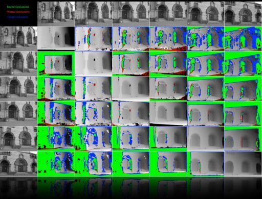
>
>    
>
> - Ps：在课程视频中教授提到了 *CRV(Prof. Dr. Pauli)* 这门课，这门课主要就是介绍这个方向的内容的。其实我已经通过了这门课的考试，但是等后期有时间了，我也会整理资料上传的。
>
> 1. 建模(*Modeling*):几何形状在计算机上的有效表示和有效修改。*The effective representation and efficient modification of geometric shape on a computer.*
>
>    
>
>    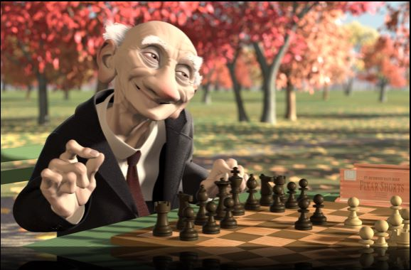
>
>    
>
> 2. 可视化(*Visualization*):在大规模多维和/或多模态数据集中可视化地表示信息内容的方法。*Methods to visually represent the information content within large-scale multi-dimensional and/or multimodality data sets.*
>
>    
>
>    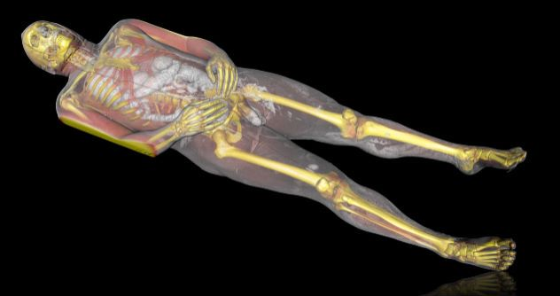
>
>    
>
> ### 1.3 逼真的图像合成 Photorealistic image synthesis
>
> - 图像合成算法，即渲染算法(Algorithms for image synthesis, i.e. rendering algorithms)
>
>   - 通过给定一个数字模型来生成这个模型所描述的真实图像。*Given a digital model on the computer, what has to be done to generate a realistic image of this model.*
>
>   - 一个足够逼真的图像与真实物体的照片我们通常没有办法将它们区分开了，下面的这张图片就是使用CG生成的。*A realistic image is one that cannot be distinguished from a photograph of the real object.*
>
>     
>
>     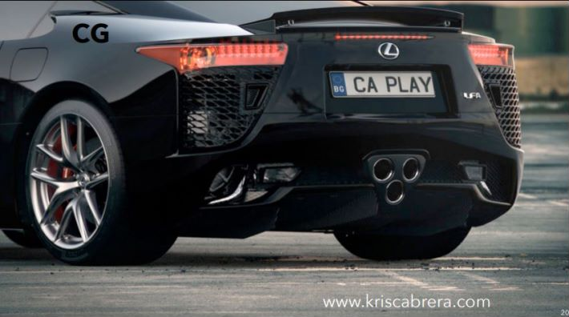
>
>     
>
> ### 1.4 图像合成的成分和先决条件 Ingredients and prerequisites for image synthesis
>
> 1. 第一步 基础 fundamentals：
>    - 建模 Modeling
>      - 多边形对象 Polygonal objects
>    - 颜色 Color
>    - 光线交互 Light interaction
>      - 光照 Illumination
>      - 反射，折射 Reflection, Refraction
> 2. 第二步 光线追踪 ray-tracing：
>    - 光线追踪 Ray-tracing
>      - 技巧 Technique
>      - 转换 Transformations
>      - 照明/阴影 Lighting/Shading
>      - 最优化 Optimization
>      - 取样 Sampling
> 3. 第三步 图形APIs graphics APIs：
>    - 基于光栅化呈现 Rasterization based rendering
>    - 渲染管道 Rendering pipeline
>    - 投影变换 Projective transforms
>    - 光栅化 Rasterization
>    - 可编程性与GPUs Programmability and GPUs
>
> ------
>
> 
>
> 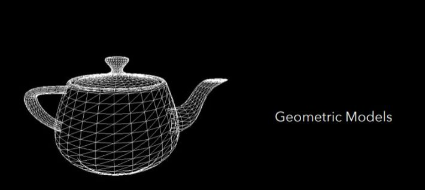
>
> 
>
> ## 2. 第二章 几何模型1 Geometric Models 1
>
> ### 2.1 对象的表示 Object representation
>
> - 在计算机图形学中，我们经常在连续的对象上处理多边形近似。*In computer graphics we often deal with polygonal approximations of continuous objects.*
>
> ### 2.2 那么什么是多边形 What is a polygon?
>
> - 它由点组成,通常在3d空间 ℝ3。 *It consists of points, typically in 3D-space ℝ3.*
>
>   - 一个点通过x、y、z坐标被表示出来;它被称为顶点。*A point is represented by its x, y, z - coordinates; it is called a vertex.*
>
> - 点通过线段(边)连接。*Points are connected via line segments (edges).*
>
>   - 线段是根据其端点的顶点来指定的。*Line segments are specified in terms of the vertices at their endpoints.*
>
> - 多边形是一个平面封闭连通的一系列线段的内部。*A polygon is the interior of a closed planar connected series of line segments.*
>
> - 任意两条边不交叉，恰好两条边在每个顶点相交。*The edges do not cross each other and exactly two edges meet at every vertex.*
>
>   
>
>   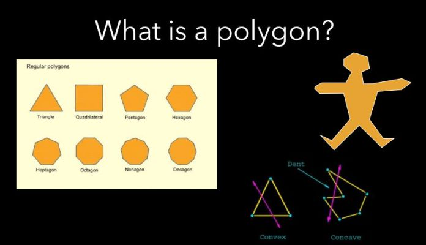
>
>   
>
> ### 2.3 多边形网格 Polygon mesh
>
> 1. 那么什么是多边形网格 What is a polygon mesh?
>
>    - 对象通常被认为是空心的。它们由一个由多边形(面)组成的封闭表面建模——边界表示或表面网格，即，对象建模为多面体。*Objects are typically considered to be hollow. They are modelled by a closed surface composed of polygons (faces) – the boundary representation or surface mesh i.e., objects are modelled as polyhedra..*
>
> 2. 多边形网格的类型 Types of polygon meshes
>
>    - 三角形网格和四边形网格。*Triangle meshes and quad meshes.*
>
> 3. 无效的网格 Invalid Meshes
>
>    - 带孔的三角剖分 holes
>
>      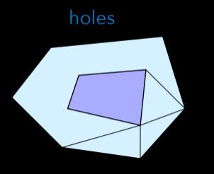
>
>      
>
>    - 具有重叠面的三角剖分 overlapping face
>
>      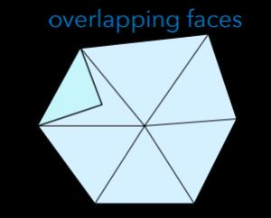
>
>      
>
>    - 带有T形顶点的三角剖分 T-Vertices
>
>      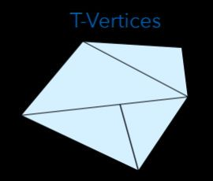
>
>      
>
> 4. 我们只考虑流形网格 Manifold meshes
>
>    - 这种网格，其中除边界边外，每条边都必须由恰好两个面共享。*A mesh where every edge must be shared by exactly 2 faces, except the border edges.*
>
> 5. 我们只考虑可定向的曲面 Orientable surfaces
>
>    - 这样的曲面，法线可以一致地排列，例如全部指向外。*Normals can be ordered consistently, e.g. pointing outwards.*
>
>    Ps：不可定向的曲面典型的2个案例就是：莫比乌斯带 (*Möbius strip*) 与 克莱因瓶 (*Klein bottle*)
>
> ### 2.4 网格图 Meshes as Graphs
>
> ```text
> - 图是一个2-tupel <V,E>
>     - V:节点的集合 *V: the set of nodes.*
>     - E:连接两个节点的边的集合 *E: the set of edges connecting two nodes.*
> ```
>
> 1. 平面性 Planarity
>
>    - 一个平面图 A planar graph
>      - 其顶点和边可以在ℝ2中嵌入以使其边不相交的图 *Graph whose vertices and edges can be embedded in ℝ2 such that its edges do not intersect.*
>    - 一个平面图形 A plane graph
>      - 在平面上画的平面图 *A planar graph drawn in a plane.*
>
> 2. 连接 Connected
>
>    - 连通平面图为2-tupel <V,E>
>      - V:节点的集合 *V: the set of nodes.*
>      - E:连接两个节点的边的集合 *E: the set of edges connecting two nodes.*
>      - 所有节点都通过一条路径沿边缘连接起来 *All nodes are connected via a path along the edge.*
>      - F:面是平面的连接部分，是沿平面边缘切割平面时产生的 *F: the faces are the connected parts of the plane, which emerge when cutting the plane along the edges*
>      - 三角化:每个面都是三角形的图形。*Triangulation: graph where every face is a triangle.*
>
> 3. 欧拉公式(用于连通平面图) Euler‘s Formula (for connected planar graphs)
>
>    - V − E + F = 2
>
>      [Proof](https://link.zhihu.com/?target=https%3A//www.ics.uci.edu/~eppstein/junkyard/euler/)
>
>    - 每个凸多面体都可以转化为连通的平面图，即欧拉公式也成立 *Every convex polyhedron can be turned into a connected planar graph i.e., Euler’s Formula holds as well.*
>
> 4. 多边形网格 Polygon meshes
>
>    - 一个顶点的n环是指存在一条路径到达该顶点的长度为n的顶点集合 *n-ring of a vertex is the set of vertices for which a path to that vertex of length n exist.*
>    - 顶点的价等于相邻边的数量(=相邻顶点的数量) *Valence of a vertex is the number of adjacent edges (= number of adjacent vertices).*
>
> 5. 图的理论问题 Graph theoretical problems
>
>    - 从一个顶点到另一个顶点的最短路径? *Shortest path along edges from one vertex to another?*
>    - 是否存在一条路径，每个顶点只被访问一次? *Does a path exist along which every vertex is visited exactly once?*
>    - 一个由V个顶点组成的三角形网格可以有多少条边? *How many edges E can a triangle mesh of V vertices have?*
>      - E ≤ 3V – 6, 3F = 2E (E ≈ 3V, F ≈ 2V)
>    - 三角形网格中顶点的平均价是多少? *What is the average valence of the vertices in a triangle mesh ?*
>      - < 6 (< 4 in a mesh of quadrilaterals)
>    - 哪个三角形网格可以是6规则的(所有的顶点都有价6)? *Which triangle meshes can be 6-regular (all vertices have valence 6)?*
>
> ### 2.5 多面体的属 Genus of a polyhedron
>
> - 属:不断开图形到多个部件的闭合切割曲线的最大数目，即“孔”或“柄”的数目。*Genus: Maximal number of closed cutting curves that do not disconnect the graph into multiple components, i.e., the number of "holes" or "handles".*
>
>   
>
>   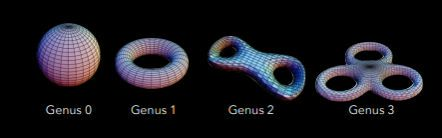
>
>   
>
> ### 2.6 Euler-Poincare 公式 Euler-Poincare Formula
>
> - 对于一个g属的闭多边形网格，给出了顶点数V、边数E、面数F的关系 *For a closed polygonal mesh of genus g, the relation of the number V of vertices, E of edges, and F of faces is given.*
>
> - V - E + F = 2(1-g)
>
>   [Proof](https://link.zhihu.com/?target=https%3A//www.sjsu.edu/faculty/watkins/eulerpoincare0.htm)
>
> - χ =(1-g) 被称为欧拉特性 *The term χ = 2(1-g) is called the Euler characteristic.*
>
>   
>
>   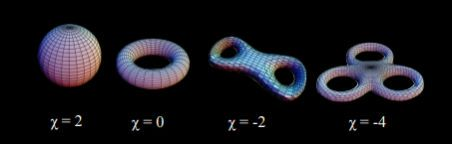
>
>   
>
>   
>
>   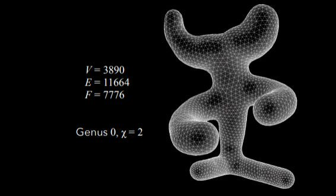
>
>   
>
>   
>
>   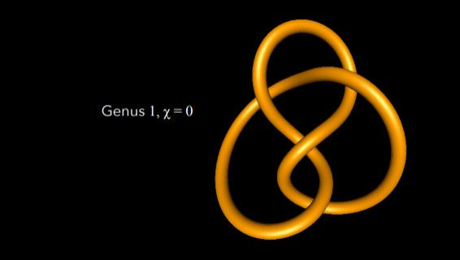
>
>   
>
> ### 2.7 折线逼近 Polygonal approximation
>
> - 多边形近似是通过多边形网格对连续曲面的近似 。*A polygonal approximation is an approximation of a continuous surface by a polygon mesh.*
>
>   
>
>   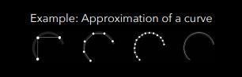
>
>   
>
> - 多边形近似通常由连续曲面上的一组离散点组成，这些点通过边连接。*A polygonal approximation typically consists of a discrete set of points of the continuous surface, which are connected via edges.*
>
>   
>
>   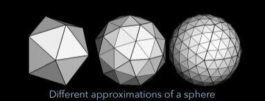
>
>   
>
> - 构造给定点集的连通性(边)称为三角剖分 *Constructing the connectivity (edges) for a given set of points is called triangulation*
>
>   
>
>   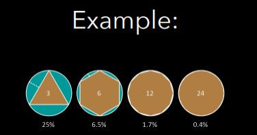
>
>   
>
>   随着插补点个数的增加，误差呈二次递减;误差随着间隔平方的大小而减小
>
> ### 2.8 自适应网格 Adaptive Meshes
>
> - 多边形近似通常是自适应的，即在高曲率区域使用更多/更小的多边形 *Polygonal approximation are typically adaptive, i.e., more/smaller polygons are used in regions of high curvature.*
>
>   
>
>   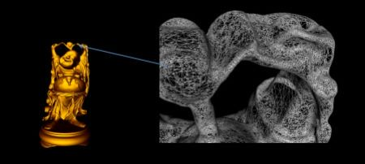
>
>   
>
> ### 2.9 三角形网格表示 Triangle mesh representation
>
> - 几何:顶点的位置 *Geometry: where are the vertices positioned.*
>
> - (多边形)拓扑:顶点是如何连接的 *(Polygon-)topology: how are the vertices connected .*
>
> - (网格-)拓扑:多边形是如何连接的 *(Mesh-)topology: how are the polygons connected.*
>
> - 显式表示(STL文件):为n个三角形n·3·3 = 9n个浮点数中的每个存储3个顶点 *Explicit representation (STL files): store three vertices for each of the n triangles n·3·3 = 9n floats.*
>
>   
>
>   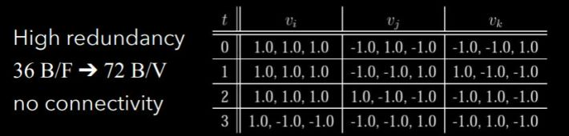
>
>   
>
> ### 2.10 共享顶点表示 Shared vertex representation
>
> - 又名“索引脸集”表示(OBJ文件) *aka „indexed face set“ representation (OBJ, OFF files).*
>
> - 所有顶点的坐标数组(3n个浮点数) *Array of coordinates of all vertices (3n floats).*
>
> - 顶点列表中带索引的三角形数组(3n个整数) *Array of triangles with indices into the vertex list (3n integers).*
>
>   
>
>   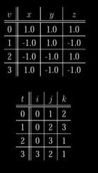
>
>   
>
>   12 B/V & 12 B/F ➔ 36 B/V
>
> ### 2.11 索引面集表示属性 Indexed face set representation properties
>
> - 冗余比显式表示少 *Less redundancy than explicit representation.*
> - 分离几何和(多边形)拓扑更有效的计算表面 *Separation of geometry and (polygon-)topology more efficient computations on surfaces.*
> - 网格操作仍然很难实现，例如找到所有1环邻居 *Mesh operators still difficult to realise e.g. find all 1-ring neighbours.*
>
> ### 2.12 扩展共享顶点表示 Extended shared vertex representation
>
> - 顶点数组，每个都引用一个相邻的三角形:3n个浮点数+ 1n个整数 *Array of vertices, each with a reference to one adjacent triangle: 3n floats + 1n integers.*
>
> - 三角形数组，每个数组都有对相邻三角形的引用(边界:-1):6n个整数 *Array of triangles, each with a reference to adjacent triangles (at the border: -1): 6n integers.*
>
>   
>
>   
>
>   
>
>   16 B/V + 24 B/F ➔ 64 B/V
>
> ### 2.13 翼边数据结构 Winged Edge data structure
>
> - 顶点数组:位置，引用1条边 *Arrays of Vertices: position, reference to 1 edge.*
>
> - 边数组:引用2个顶点，2个面，4条边 *Arrays of Edges: references to 2 vertices, 2 faces, 4 edges.*
>
> - 面数组:引用1条边 *Arrays of Faces: reference to 1 edge.*
>
>   
>
>   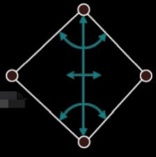
>
>   
>
>   120 B/V
>
> 
>
> 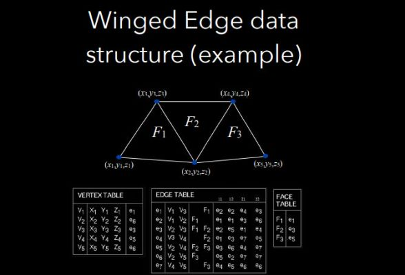
>
> 
>
> ### 2.14 例子：找到给定顶点X的所有关联边。
>
> ```Java
> Given vertex X;
> Retrieve incident edge e of X from vertex table;
> Let s be e; // working variable
> do // move to next edge
>  Output s; // incident edge
>  if start vertex of s is equal to X then
>  s = the successor of the left face of s
>  else
>  s = the successor of the right face of s;
>  end if
> while s ≠ e; // loop back if not eq
> ```
>
> 第一周 End


# 计算机物理模拟

> 简单列一些比较经典的paper：碰撞检测（GJK[3]、sweep-and-prune[6]、SAT[7]）粒子模拟 [1][13]刚体模拟 [2][4][12]柔体模拟（mass-and-spring[5]、shape matching[11]）流体模拟（stable fluid[8]、particle level set[9]、smoothed-particle hydrodynamics[10]）参考[1] Reeves, William T. "Particle systems—a technique for modeling a class of fuzzy objects."*ACM Transactions on Graphics (TOG)*2.2 (1983): 91-108.[2] Moore, Matthew, and Jane Wilhelms. "Collision detection and response for computer animation."*ACM Siggraph Computer Graphics*. Vol. 22. No. 4. ACM, 1988.[3] Gilbert, Elmer G., Daniel W. Johnson, and S. Sathiya Keerthi. "A fast procedure for computing the distance between complex objects in three-dimensional space."*IEEE Journal on Robotics and Automation*4.2 (1988): 193-203.[4] Baraff, David. "Analytical methods for dynamic simulation of non-penetrating rigid bodies."*ACM SIGGRAPH Computer Graphics*. Vol. 23. No. 3. ACM, 1989.[5] Baraff, David, and Andrew Witkin. "Large steps in cloth simulation."*Proceedings of the 25th annual conference on Computer graphics and interactive techniques*. ACM, 1998.[6] Cohen, Jonathan D., et al. "I-collide: An interactive and exact collision detection system for large-scale environments."*Proceedings of the 1995 symposium on Interactive 3D graphics*. ACM, 1995.[7] Gottschalk, Stefan, Ming C. Lin, and Dinesh Manocha. "OBBTree: A hierarchical structure for rapid interference detection."*Proceedings of the 23rd annual conference on Computer graphics and interactive techniques*. ACM, 1996.[8] Stam, Jos. "Stable fluids." *Proceedings of the 26th annual conference on Computer graphics and interactive techniques*. ACM Press/Addison-Wesley Publishing Co., 1999.[9] Enright, Douglas, Stephen Marschner, and Ronald Fedkiw. "Animation and rendering of complex water surfaces."*ACM Transactions on Graphics (TOG)*. Vol. 21. No. 3. ACM, 2002.[10] Müller, Matthias, David Charypar, and Markus Gross. "Particle-based fluid simulation for interactive applications."*Proceedings of the 2003 ACM SIGGRAPH/Eurographics symposium on Computer animation*. Eurographics Association, 2003.[11] Müller, Matthias, et al. "Meshless deformations based on shape matching."*ACM transactions on graphics (TOG)*. Vol. 24. No. 3. ACM, 2005.[12] Müller, Matthias, et al. "Position based dynamics."*Journal of Visual Communication and Image Representation*18.2 (2007): 109-118.[13] Macklin, Miles, et al. "Unified particle physics for real-time applications."*ACM Transactions on Graphics (TOG)*33.4 (2014): 153.
>
> [编辑于 2018-10-03](https://www.zhihu.com/question/264299347/answer/502924741)


# [系统的学习计算机图形学，有哪些不同阶段的书籍的推荐？](https://www.zhihu.com/question/26720808)


- 計算機圖形: 入門/API類 [http://book.douban.com/doulist/1445744/](https://link.zhihu.com/?target=http%3A//www.douban.com/link2/%3Furl%3Dhttp%3A%2F%2Fbook.douban.com%2Fdoulist%2F1445744%2F)
- 計算機圖形: 進階/專門 [http://book.douban.com/doulist/1445680/](https://link.zhihu.com/?target=http%3A//www.douban.com/link2/%3Furl%3Dhttp%3A%2F%2Fbook.douban.com%2Fdoulist%2F1445680%2F)
- 計算機圖形: Gems類 [http://book.douban.com/doulist/1445745/](https://link.zhihu.com/?target=http%3A//www.douban.com/link2/%3Furl%3Dhttp%3A%2F%2Fbook.douban.com%2Fdoulist%2F1445745%2F)
- 計算機圖形: 專欄結集 [http://book.douban.com/doulist/1445806/](https://link.zhihu.com/?target=http%3A//www.douban.com/link2/%3Furl%3Dhttp%3A%2F%2Fbook.douban.com%2Fdoulist%2F1445806%2F)
- 計算機圖形: 動畫 [http://book.douban.com/doulist/1445716/](https://link.zhihu.com/?target=http%3A//www.douban.com/link2/%3Furl%3Dhttp%3A%2F%2Fbook.douban.com%2Fdoulist%2F1445716%2F)
- 計算機圖形: 相關數學 [http://book.douban.com/doulist/1445735/](https://link.zhihu.com/?target=http%3A//www.douban.com/link2/%3Furl%3Dhttp%3A%2F%2Fbook.douban.com%2Fdoulist%2F1445735%2F)
- 計算機圖形: 其他參考 [http://book.douban.com/doulist/1447740/](https://link.zhihu.com/?target=http%3A//www.douban.com/link2/%3Furl%3Dhttp%3A%2F%2Fbook.douban.com%2Fdoulist%2F1447740%2F)


# CMU15463

http://15462.courses.cs.cmu.edu/fall2020/courseinfo

https://zhuanlan.zhihu.com/p/272539958


https://link.zhihu.com/?target=https%3A//www.bilibili.com/video/BV1QZ4y1K7ga%3Fp%3D1

# [现阶段应该怎么学习计算机图形学呢？](https://www.zhihu.com/question/26341836)


# Book Fluid Simulation for Computer Graphics

https://www.amazon.com/Simulation-Computer-Graphics-Robert-Bridson/dp/1568813260


# 图形学公开课

Foundations of Computer Graphics
[Foundations of Computer Graphics](https://link.zhihu.com/?target=https%3A//www.edx.org/course/uc-berkeleyx/uc-berkeleyx-cs184-1x-foundations-2746%23.U-JxHvldXeM)
Classes Start: 6 Oct 2014
Course Length: 6 weeks
Estimated effort: 12 hours/week

Interactive 3D Graphics
[Interactive 3D Graphics Course With Three.js & WebGL](https://link.zhihu.com/?target=https%3A//www.udacity.com/course/cs291)
This class is self paced. You can begin whenever you like and then follow your own pace.
Course Length: approx. 2 months
Estimated effort: 6 hours/week
(work at your own pace)
（以上信息 Daniel Wyllie Lacerda Rodrigues 提供）

Interactive Computer Graphics
by Takeo Igarashi, The University of Tokyo
[Coursera.org](https://link.zhihu.com/?target=https%3A//class.coursera.org/interactivegraphics-001)
Classes Start: Aug 5th 2014
Course Length: 7 weeks of study
Estimated effort: 2-6 hours of work / week

Coursera 即将推出
Interactive Computer Graphics with WebGL
with Edward Angel, University of New Mexico

除了各 MOOC 平台，各大学校的课程也有许多开放课件，不过很少有视频。
例如 Stanford 就有很多 [Courses in Graphics](https://link.zhihu.com/?target=http%3A//graphics.stanford.edu/courses/) 。其中有一个很好的网格处理入门课程 [CS468: Geometry Processing Algorithms](https://link.zhihu.com/?target=http%3A//graphics.stanford.edu/courses/cs468-12-spring/)。

还有其他学校的课程，包含 Modeling，Rendering，Animation 等各方向，就不必列举啦。


补充一个
CMU 15462 [Computer Graphics : 15-462/662 Fall 2015](https://link.zhihu.com/?target=http%3A//15462.courses.cs.cmu.edu/fall2015/home)
缺点是只有slides，需要善用搜索引擎来补充。
优点是提供了很多补充材料，也有编程练习。

公开课 [Ladislav Kavan](https://link.zhihu.com/?target=https%3A//www.cs.utah.edu/~ladislav/)教授的Physically based Animation也不错
在youtube直接搜这个人的名字就行了


谢谢楼上的，正好我最近在找。几个熟悉MOOC平台，没找到几个针对图形学的，不知道是不是打开方式还是搜索方式不对。最后直接上油管找，补充几个找得到video的……

以下按照课程新旧时间排序：

- 2017 Spring (MIT) [6.837 Computer Graphics](https://link.zhihu.com/?target=https%3A//www.youtube.com/watch%3Fv%3DE1-_15Vfddk) - Justin Solomon [Materials](https://link.zhihu.com/?target=https%3A//ocw.mit.edu/courses/electrical-engineering-and-computer-science/6-837-computer-graphics-fall-2012/lecture-notes/)
- 2017 Spring (MIT) [6.838 Shape Analysis](https://link.zhihu.com/?target=https%3A//www.youtube.com/watch%3Fv%3DC8II6BTmaYw) - Justin Solomon [Materials](https://link.zhihu.com/?target=http%3A//groups.csail.mit.edu/gdpgroup/6838_spring_2017.html)
- 2017 Spring (Utah) [CS 6660 Physics-based Animation](https://link.zhihu.com/?target=https%3A//www.youtube.com/watch%3Fv%3DsSKyQIxdhdA%26list%3DPL_a9tY9IhJuPc7e6r-3DMw_PbYbloKoWM) - Ladislav Kavan ([肖英俊](https://www.zhihu.com/people/skzr001)提到的)
- 2013 Fall (Stanford) [CS 205A Mathematical Methods for Robotics, Vision, and Graphics](https://link.zhihu.com/?target=https%3A//www.youtube.com/watch%3Fv%3DdkT8yuI2d50) - Justin Solomon [Materials](https://link.zhihu.com/?target=https%3A//graphics.stanford.edu/courses/cs205a-13-fall/notes.html)
- 2013 Spring (Stanford) [CS 468 Differential Geometry for Computer Science](https://link.zhihu.com/?target=https%3A//www.youtube.com/watch%3Fv%3DS_bUBfdffRU) - Justin Solomon Materials在每个视频下面有写地址
- 2012 (Utah) [CS 5600 Introduction To Computer Graphics](https://link.zhihu.com/?target=https%3A//www.youtube.com/channel/UC4bBeUfDuoIZVmAcnCKD5Wg) - Matt Stoker
- 2012 Fall (UCB) [CS184 Computer Graphics](https://link.zhihu.com/?target=https%3A//www.youtube.com/user/raviramamoorthi/playlists%3Fshelf_id%3D0%26view%3D1%26sort%3Ddd) - Ravi Ramamoorthi [Materials](https://link.zhihu.com/?target=http%3A//inst.eecs.berkeley.edu/~cs184/fa12/onlinelectures1.html) ([Alexander](https://www.zhihu.com/people/alexander98)提到的)
- 2009 Fall (UC Davis) [CS 175 Introduction to Computer Graphics](https://link.zhihu.com/?target=https%3A//www.youtube.com/playlist%3Flist%3DPL_w_qWAQZtAZhtzPI5pkAtcUVgmzdAP8g) - Ken Joy


Andy van Dam (Brown) [cs123 : introduction to computer graphics](https://link.zhihu.com/?target=http%3A//cs.brown.edu/courses/csci1230/lectures.html)

Ravi Ramamoorthi (Berkeley), CS184 Computer Graphics [CS184 - Online Lectures](https://link.zhihu.com/?target=http%3A//inst.eecs.berkeley.edu/~cs184/fa12/onlinelectures.html) (Videos are on YouTube);

Ravi Ramamoorthi (UCSanDiego), [CSE 291 Topics in Computer Graphics: Real-Time High Quality Rendering](https://link.zhihu.com/?target=http%3A//cseweb.ucsd.edu/~ravir/291/2015/291.html) (Slides only);

Ravi Ramamoorthi (Berkeley), [CS 283, Advanced Computer Graphics](https://link.zhihu.com/?target=http%3A//inst.eecs.berkeley.edu/~cs283/sp13/) (Slides only)

# ，，


按顺序学习以下课程：
《高等数学》
《线性代数》
《概率论与数理统计》
《复变函数与积分变换》
《数值分析》
《信号与系统》
《C++程序设计语言》
《数据结构》
《算法导论》
《傅里叶变换原理与应用》
《计算机图形学》
《数字图像处理》
《数字图像与机器视觉》

***


**3D数学基础*** Mathematics for 3D Game Programming and Computer Graphics(中文版：3D游戏与计算机图形学中的数学方法)* 3D Math Primer for Graphics and Game Development(中文版：3D数学基础：图形与游戏开发)* Geometric Tools for Computer Graphics(中文版：计算机图形学几何工具算法详解)* Visualizing Quaternions(The Morgan Kaufmann Series in Interactive 3D Technology)
**计算机图形学理论基础*** Fundamentals of Computer Graphics(中文版：计算机图形学)* Computer Graphics: Principles and Practice(计算机图形学原理及实践:C语言描述)* Interactive Computer Graphics: A Top-Down Approach with Shader-Based OpenGL(中文版：交互式计算机图形学)* Graphics Gems系列(1~5)
**实时渲染*** Real-Time Rendering, Fourth Edition* Real-Time Shadows(中文版：实时阴影技术)* Real-Time Cameras
**离线渲染*** Ray Tracing from the Ground Up(中文版：光线跟踪算法技术)* Physically Based Rendering, Third Edition* Advanced Global Illumination

**Direct3D*** Introduction to 3D Game Programming with DirectX 12(中文版：DirectX 12 3D游戏开发实践)* Practical Rendering and Computation with Direct3D 11
**OpenGL*** OpenGL SuperBible: Comprehensive Tutorial and Reference (中文版：OpenGL超级宝典)* OpenGL Programming Guide(中文版：OpenGL编程指南)* OpenGL ES 3.0 Programming Guide(中文版：OpenGL ES 3.0编程指南)* OpenGL Shading Language(中文版：OpenGL着色语言)* Graphics Shaders(中文版：图形着色器)* OpenGL Insights
**Vulkan*** The Official Guide to Learning Vulkan
**渲染Tricks系列*** ShaderX系列(1~7)* GPU Gems系列(1~3)* GPU Pro系列(1~7)* GPU Zen* GPU Zen 2
如果是想从事游戏方面的工作，下面的书单也是非常有用的，可以借鉴：**游戏引擎开发*** Game Engine Architecture(中文版：游戏引擎架构)* 3D Game Engine Design(中文版：3D游戏引擎设计：实时计算机图形学的应用方法)* Game Engine Gems系列(1~3)

**游戏物理学*** Physics for Game Developers(中文版：游戏开发物理学)* Physics for Game Programmers* Game Physics Engine Development(中文版：游戏物理引擎开发)* Real-Time Collision Detection(中文版：实时碰撞检测算法技术)
**游戏动画*** Character Animation With Direct3D* Computer Animation, Second Edition* Realtime 3D Character Animation with Visual C++
**游戏编程实践*** Game Programming Patterns(中文版：游戏编程模式)* Tricks of the Windows Game Programming Gurus(中文版：WINDOWS游戏编程大师技巧)* Tricks of the 3D Game Programming Gurus-Advanced 3D Graphics and Rasterization(中文版：3D游戏编程大师技巧)* Game Programming Algorithms and Techniques(中文版：游戏编程算法与技巧)* Game Coding Complete(中文版：游戏编程权威指南)* Game Programming Gems系列(1~8)学习网站推荐[Learn OpenGL, extensive tutorial resource for learning Modern OpenGL​learnopengl.com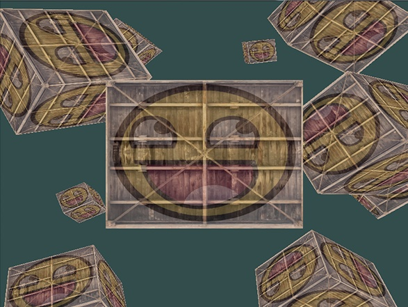](https://link.zhihu.com/?target=https%3A//learnopengl.com/)[Scratchapixel​www.scratchapixel.com](https://link.zhihu.com/?target=https%3A//www.scratchapixel.com/index.php%3Fredirect)[Home​www.opengl-tutorial.org](https://link.zhihu.com/?target=http%3A//www.opengl-tutorial.org/)[OpenGL Step by Step​ogldev.atspace.co.uk](https://link.zhihu.com/?target=http%3A//ogldev.atspace.co.uk/)


> 题主问计算机图形学入门教程，楼上推荐各种各样的OpenGL，D3D，CG教程是什么意思，问题标签和描述里没提到某个方向和某类技术吧？
> 难道默认认为：
> ( Graphics == Rendering->Real-time Rendering->Modern GPU-based Real Time Rendering )
> 难怪 
> @文刀秋二
>  Edward大神感慨知乎上Graphics话题区风气各种不正...
>
> 正题：
> 首先，入门，即对Graphics有个大致的了解，从而选择自己感兴趣的方向，广泛推荐的教材是：
> Fundamentals of Computer Graphics, Third Edition (豆瓣)
> 然后，正三观（理清思路），造轮子（多写代码）如果是Rendering：
> 实时：Real-Time Rendering, Third Edition (豆瓣) ，入门流行写Software Rasterizer
> 离线：Physically Based Rendering, Second Edition (豆瓣) ，入门流行写简单的Raytracer
> 同时可以挑书里的reference和SIGGRAPH[Asia]，EGSR，PG上感兴趣的paper看
> 最后，Research or Engineering, that's a question(dilemma~)


# 虎书 翻译

https://blog.csdn.net/yibu_refresh/article/details/108753014

https://blog.csdn.net/yibu_refresh/category_9271889.html

# 推荐

https://github.com/GraphiCon/-


> https://zhuanlan.zhihu.com/p/27158983 知乎持续更新，以知乎为准
>
> 不同于目前互联网上经常见到的书单推荐，本文侧重收集、整理图形学研究所需要的各个方面（基础知识，领域重要著作，工具链参考手册）以供想了解/快速上手该细分领域的同学参考。
>
> 本书单长期更新，请在评论区中留下您的反馈意见/补充推荐，我们会定期对这个书单做更新。
>
> 由于编者水平有限，难免有遗漏和不妥之处，请各位客官不吝赐教。
>
> Contributors：@硕鼠酱 ，@李旻辰 ，@Raymond
>
> 方向
>
> ### Introduction
>
> [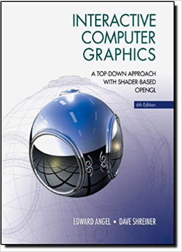](https://camo.githubusercontent.com/2c05e89a51eee8ef366a87e7d4150cd3d3090513214bfebc7c44aa1256b0133f/68747470733a2f2f696d616765732d6e612e73736c2d696d616765732d616d617a6f6e2e636f6d2f696d616765732f492f35316d47354c315261544c2e5f53583335395f424f312c3230342c3230332c3230305f2e6a7067)
>
> > Interactive computer graphics : a top-down approach with shader-based OpenGL / Edward Angel et al.
>
> 相当不错的图形学入门读物，偏重实时渲染。用OpenGL（新版本为WebGL）作为教学，简单容易上手。
>
> [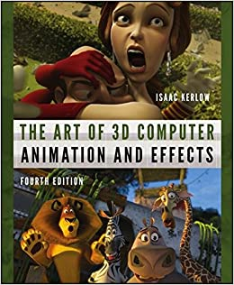](https://camo.githubusercontent.com/b8fae5da744b9f73e417356af0da2d35ea50fdb9359c4a7ca0a976f21264e638/68747470733a2f2f696d616765732d6e612e73736c2d696d616765732d616d617a6f6e2e636f6d2f696d616765732f492f3531752b7376304e32454c2e5f53583235385f424f312c3230342c3230332c3230305f2e6a7067)
>
> > The Art of 3D Computer Animation and Effects by Isaac V. Kerlow
>
> 全面介绍电影/动画工业的方方面面，由迪斯尼工作人员攒书，值得一看。
>
> ### Geometry Processing
>
> [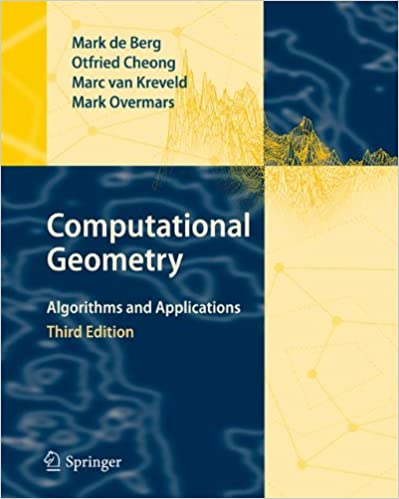](https://camo.githubusercontent.com/dad9f1caf0571434bd6f8e93457fe22885e928db0df1725f75c1bca4bbd210f3/68747470733a2f2f696d616765732d6e612e73736c2d696d616765732d616d617a6f6e2e636f6d2f696d616765732f492f353135766c676264586a4c2e5f53583339375f424f312c3230342c3230332c3230305f2e6a7067)
>
> > Computational Geometry: Algorithms and Applications. Third Edition. Mark de Berg, et al
>
> 计算几何经典之作，深入浅出，例子很多，每一章开头都有本章内容的实际应用，书后附有大量习题。
>
> [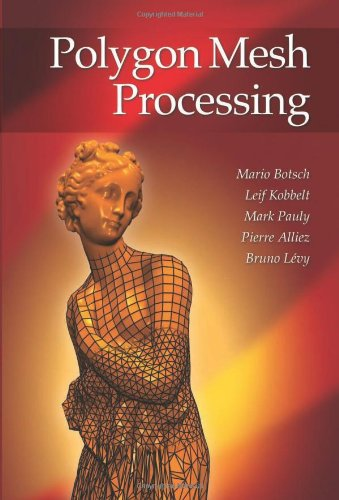](https://camo.githubusercontent.com/bc140d127635e77243ab34f610444761bd8356dedf9c39d4adeef74c7cdf2650/68747470733a2f2f696d616765732d6e612e73736c2d696d616765732d616d617a6f6e2e636f6d2f696d616765732f492f3531577a7644764772454c2e6a7067)
>
> > Polygon mesh processing. CRC press. Botsch et al. 2010
>
> 包括基本的几何形体处理算法的讲解，比如平滑降噪、参数化、三角剖分、简化与近似、形变等。
>
> [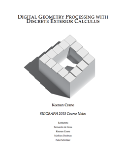](https://camo.githubusercontent.com/8854499df5490c32b75516cf6e5d8706aa0c2ae3166441a29b5a53c83fecd168/68747470733a2f2f7777772e63732e636d752e6564752f7e6b6d6372616e652f50726f6a656374732f4444472f707265766965772e706e67)
>
> > Discrete Differential Geometry: An Applied Introduction. Keenan Crane 2015
>
> 讲述传统微分几何的基本概念如何在离散计算中得到应用，同时也会涉及到对一些相关数学工具的应用的探讨。内容主要包括曲率、平行转移、外蕴代数和微积分、拓扑、霍奇分解、保角映射、有限元方法等。
>
> [](https://camo.githubusercontent.com/90ae97228ead4981e53eb05bed12833eb61fc1095313ad26512f0552ffb40397/687474703a2f2f6665726e616e646f6465676f65732e6f72672f666967757265732f766653696731362e6a7067)
>
> > Vector Field Processing on Triangle Meshes. Fernando de Goes et al. 2015
>
> 讲述如何在几何体表面的切空间定义向量场并应用到对几何形体的处理中。本文也着重讲解了如何将传统微分几何的概念离散化到三角形网格上，选取三角形、顶点、边作为离散元分别有何优缺点。
>
> ### Rendering
>
> [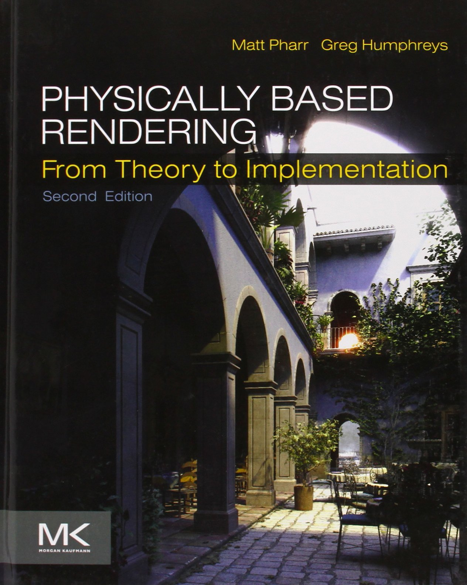](https://camo.githubusercontent.com/02733fae1617ff992029b7da3c8edddcb315a39200c7fc59f7f9e628b96696d3/68747470733a2f2f696d616765732d6e612e73736c2d696d616765732d616d617a6f6e2e636f6d2f696d616765732f492f383174377a4a516945694c2e6a7067)
>
> > Physically Based Rendering, From Theory to Implementation /Matt Pharr
>
> 讲解详细体系完备，更难能可贵的是本书配套一个渲染系统，书后习题提供了参考文献和思路来改进这个渲染系统，学练结合，夫复何求？
>
> [](https://camo.githubusercontent.com/5d3ba8d41e06849121040507944e786831051735a3f1e39bea08ac978e0fb04d/687474703a2f2f7777772e7265616c74696d6572656e646572696e672e636f6d2f727472332e6a7067)
>
> > Real-Time Rendering, Tomas Akenine-Moller, Eric Haines & Naty Hoffman
>
> 与离线渲染相对应的实时渲染经典著作，针对现代图形渲染管线、GPU、着色器等有详细讲解。同时总结了大量游戏开发中非常实用的算法。
>
> ### Simulation and Animation
>
> [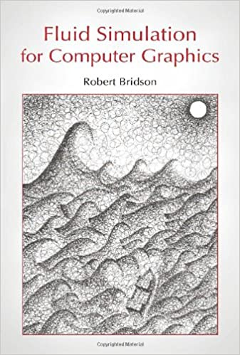](https://camo.githubusercontent.com/6d076e78590161195d4cf05db59932603c3672e5715e447bd50776abc3b68b91/68747470733a2f2f696d616765732d6e612e73736c2d696d616765732d616d617a6f6e2e636f6d2f696d616765732f492f3531592b416c6235532d4c2e5f53583333355f424f312c3230342c3230332c3230305f2e6a7067)
>
> > Fluid simulation for computer graphics / Robert Bridson
>
> 作者流体模拟届大牛Bridson，从NS方程的推导入手，详细介绍流体模拟的经典算法，是做物理模拟方向的同学几乎人手一本的参考书。
>
> [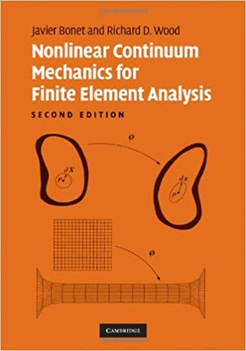](https://camo.githubusercontent.com/537254860f7d76ef36937c72c91c332f228be6686102cf781a8b54d8b6a46257/68747470733a2f2f696d616765732d6e612e73736c2d696d616765732d616d617a6f6e2e636f6d2f696d616765732f492f343168644959346563414c2e5f53583334385f424f312c3230342c3230332c3230305f2e6a7067)
>
> > Nonlinear Continuum Mechanics for Finite Element Analysis / Javier Bonet & Richard D. Wood
>
> 固体、软体模拟、声音合成等方向的必读物。从最简单的线性机械学介绍到非线性机械学，对各种应力模型都有详细的介绍。同时对不同机械学模型的有限元分析也进行了深入的讲解。
>
> [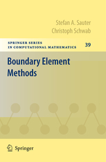](https://camo.githubusercontent.com/b802fca6456a2d8af6de774fb3bbea10cb8e34154f16294325bd664747fde7a3/68747470733a2f2f696d616765732e737072696e6765722e636f6d2f7367772f626f6f6b732f6d656469756d2f393738333534303638303932352e6a7067)
>
> > Boundary Element Method / Stefan A. Sauter & Christoph Schwab
>
> 本书详细介绍了边界元方法的理论和具体的数值方法。从边界元的概念、伽辽金方法等，讲述到椭圆边界积分方程的性质和解法，之后详细介绍了边界元方法及其在不同应用下的各种变通方法，最后也介绍了一些相关的线性方程求解和误差分析方法。
>
> [](https://camo.githubusercontent.com/d60a4764809ed04a88c6037dee28bb2eafe7b8670b81919453bf516126e72339/687474703a2f2f696d616765732e736c696465706c617965722e636f6d2f31362f343933323938312f736c696465732f736c6964655f362e6a7067)
>
> > Rigid Body Simulation I & II / David Baraff
>
> 刚体模拟的入门读物，从最基本的刚体运动方程讲到刚体碰撞等。作者是皮克斯动画工作室的高级研究员，其开发的布料模拟算法已被广泛采纳于各种游戏和特效引擎中。
>
> ### Mathematics
>
> 本分类收集边角料
>
> [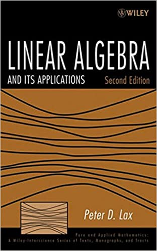](https://camo.githubusercontent.com/e75e51a33b3f0cbcc9089f913a4ef4116cc3d82ef385d1bd6f4c872ca05505fc/68747470733a2f2f696d616765732d6e612e73736c2d696d616765732d616d617a6f6e2e636f6d2f696d616765732f492f3531594735664b7a4c364c2e5f53583331305f424f312c3230342c3230332c3230305f2e6a7067)
>
> > Linear Algebra and Its Applications / Peter Lax
>
> 作者是科学计算领域大家，这本书用分析的视角介绍了线性代数/ 数值线性代数的方方面面，适合有本科数学基础的同学参考。
>
> [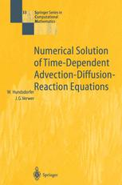](https://camo.githubusercontent.com/99c6b3501549eb4848211335bf3fc5b9a375db7e51a99bfba119c164d52aa927/68747470733a2f2f7374617469632d636f6e74656e742e737072696e6765722e636f6d2f636f7665722f626f6f6b2f3937382d332d3636322d30393031372d362e6a7067)
>
> > Numerical Solution of Time-Dependent Advection-Diffusion-Reaction Equations / Willem Hundsdorfer and Jan Verwer
>
> 从Method of Lines讲解抛物方程数值求解的一本观点新颖的著作，可供做流体模拟/CFD的同学参考。
>
> [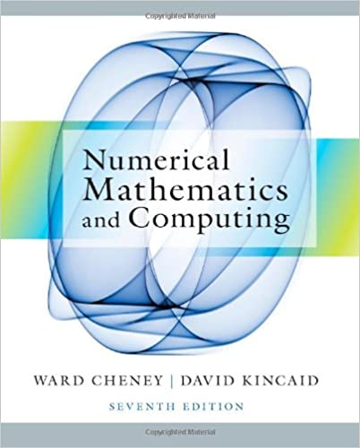](https://camo.githubusercontent.com/7246444bba7aa672b56092e28d5671112abda66bdec891823a992f53768dbb43/68747470733a2f2f696d616765732d6e612e73736c2d696d616765732d616d617a6f6e2e636f6d2f696d616765732f492f353159457a78615775324c2e5f53583430305f424f312c3230342c3230332c3230305f2e6a7067)
>
> > Numerical Mathematics and Computing / Cheney, E., and David Kincaid.
>
> 一本比较新的计算数学著作，详细介绍了科学计算各个方面，知识比较新，并有详细的例子。
>
> [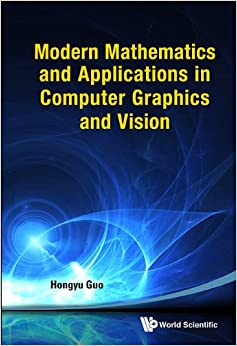](https://camo.githubusercontent.com/1e4767d127c285bb74266e9d6dcea7b9491b0cfb7c52fb4242ad6077169af745/68747470733a2f2f696d616765732d6e612e73736c2d696d616765732d616d617a6f6e2e636f6d2f696d616765732f492f353147534666646e354c4c2e5f53593334345f424f312c3230342c3230332c3230305f2e6a7067)
>
> > Modern Mathematics and Applications in Computer Graphics and Vision / Hongyu Guo
>
> 这本书收集了很多计算机图形学和视觉科学需要用到的现代数学知识。
>
> [](https://camo.githubusercontent.com/57ec5ce70637cffa501947e7413dbfba8fbdec48a67bdf9337769850383d3db1/687474703a2f2f75736572732e69656d732e6e6f7274687765737465726e2e6564752f7e6e6f636564616c2f696d616765732f636f7665722d6d2e676966)
>
> > Numerical Optimization / Jorge Nocedal & Stephen J. Wright
>
> 数值优化的经典著作，作者是开发了著名非线性优化算法L-BFGS的大牛，和数值计算相关领域的必读书目。
>
> [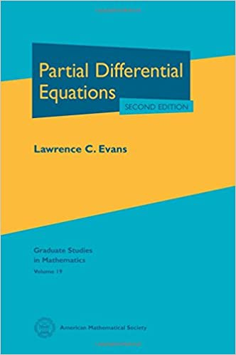](https://camo.githubusercontent.com/4f0533ab9bf6ab14018bf20f4df28fa7fa8dd5c32c5303da939e4b0ac053ec81/68747470733a2f2f696d616765732d6e612e73736c2d696d616765732d616d617a6f6e2e636f6d2f696d616765732f492f34315959725a4c396e734c2e5f53583333305f424f312c3230342c3230332c3230305f2e6a7067)
>
> > Partial Differential Equations / L. C. Evans
>
> 本书从应用角度全面地介绍了偏微分方程的相关内容，结合经典的工科应用，详细讲述了偏微分方程的类型、求解方法以及相关理论，适合已有数学分析基础的同学学习。
>
> [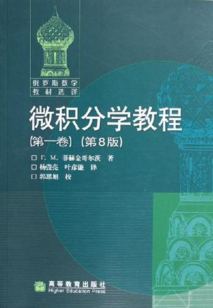](https://camo.githubusercontent.com/1207243d2f39e46f82abb88e45b4b43e94e2545aa438751e2ce6539c95ba6e65/68747470733a2f2f696d67332e646f7562616e696f2e636f6d2f6c7069632f73313532353435312e6a7067)
>
> > 微积分学教程(三卷本) / 菲赫今哥尔茨
>
> 这套书是享誉世界的著作。然而由于体量实在太大，所以更适合作为参考资料使用。这套书讲解相当详细，每一章几乎都可以自成体系，并且配备数量可观的例题，是快速回忆微积分相关公式/定理绝佳的参考资料。
>
> ### Toolchain
>
> [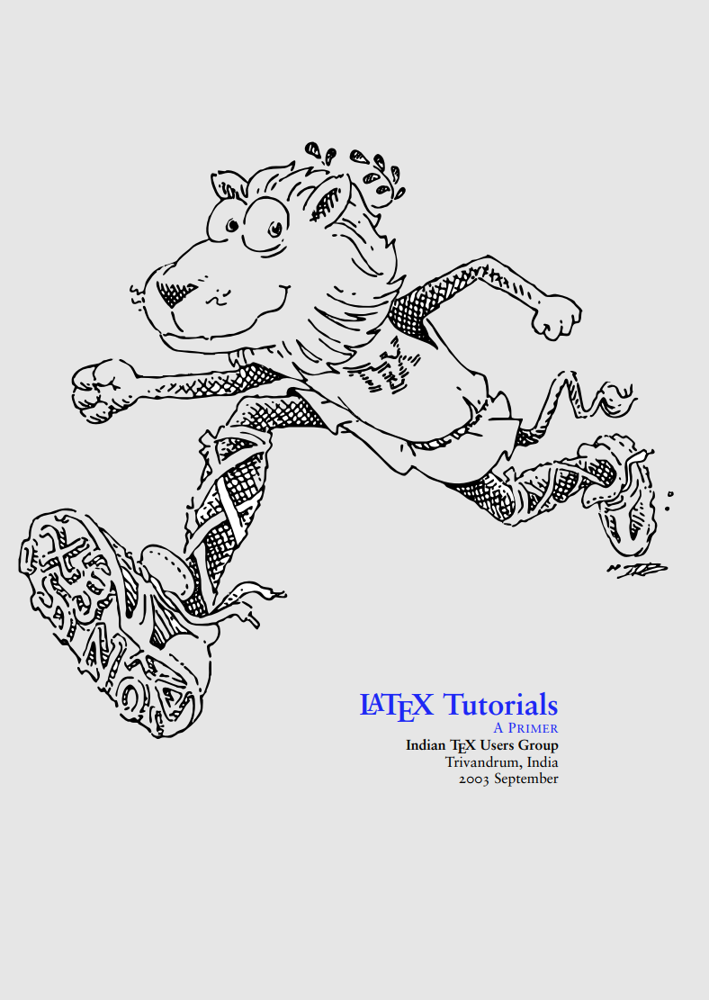](https://camo.githubusercontent.com/bf4f3d120eac8a49d41eeea8e3e9c3a81d0ef21a058d5db765214b71bc8b37fa/68747470733a2f2f692e696d6775722e636f6d2f7668314d46464e2e706e67)
>
> > The ltxprimer / Indian TeX Group
>
> TeX排版语言的相当棒的入门参考。虽然这本小册子比较老，但是由于它主要关注TeX的核心方面，所以依然有很大的参考价值。
>
> [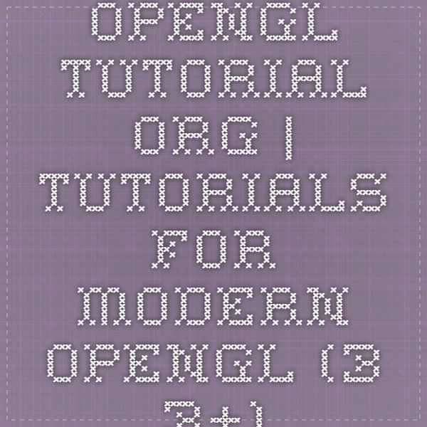](https://camo.githubusercontent.com/3d69722998b8726822aa9c3c6b162e6a0fabe93c89d0a352ac5baf7c086c81cd/68747470733a2f2f732d6d656469612d63616368652d616b302e70696e696d672e636f6d2f6f726967696e616c732f63652f66612f66342f63656661663437303339636530396462306362356331393962623564646632332e6a7067)
>
> > opengl-tutorials.org
>
> OpenGL边学边做，讲解详细，代码质量也不错。
>
> > The Linux Command Line / William Shotts
>
> 相当棒、相当精简、信息密度极大的介绍GNU/Linux（debian），bash programming和日常工具（grep, sed等）的手册。是以后/正在使用Linux的同学绝佳的自学教程 / 参考资料。更重要的是， 这本书是开源免费的！
>
> > http://www.learncpp.com/
>
> 相当赞的在线C++知识参考网站，有详细的例子，体系完备技术新颖，适合自学C++或者查漏补缺。
>
> [](https://camo.githubusercontent.com/b9f2cd5d8e70c4f53dbc8e2af33edd633ebedea1fd2a28f27e283260333153e7/68747470733a2f2f7777772e7061636b747075622e636f6d2f73697465732f64656661756c742f66696c65732f4230333638375f556e7265616c253230456e67696e6525323047616d65253230446576656c6f706d656e74253230436f6f6b626f6f6b5f2e6a7067)
>
> > Unreal Engine Game Development Cookbook, John P. Doran
>
> UE4的入门读物，从实例入手讲解如何进行简单游戏的开发。
>
> 一些不错的书单推荐：
>
> https://zhuanlan.zhihu.com/p/24207171 http://www.cc.gatech.edu/~turk/math_gr.html http://peterwonka.net/Documentation/BooksToRead.htm


# 计算机图形学 推荐


> 基础的话 我感觉 Shirley 的 Fundamentals of Computer Graphics 和 Foley 的 Computer Graphics: Principles and Practice 都不错。如果嫌贵的话 Morgan McGuire 的 [https://graphicscodex.com/](https://link.zhihu.com/?target=https%3A//graphicscodex.com/) 也可以


> 个人推荐，三本书，看完，基本你就有能力自行选择了~
> \1. 3D数学基础， 中英文版都有
> [http://www.ppurl.com/2010/10/3d%E6%95%B0%E5%AD%A6%E5%9F%BA%E7%A1%80%E5%9B%BE%E5%BD%A2%E4%B8%8E%E6%B8%B8%E6%88%8F%E5%BC%80%E5%8F%91.html](https://link.zhihu.com/?target=http%3A//www.ppurl.com/2010/10/3d%E6%95%B0%E5%AD%A6%E5%9F%BA%E7%A1%80%E5%9B%BE%E5%BD%A2%E4%B8%8E%E6%B8%B8%E6%88%8F%E5%BC%80%E5%8F%91.html)
> 这本回顾一下数学知识，然后会讲解一些图形学基础概念，比较通俗~ 好读
>
> \2. shaders for game programmer & artist 只有英文版
> [http://www.ppurl.com/2010/05/shaders-for-game-programmers-and-artists.html](https://link.zhihu.com/?target=http%3A//www.ppurl.com/2010/05/shaders-for-game-programmers-and-artists.html)
> 这本是用render monkey，教你写shader，主要提升兴趣，然后可以尝试熟悉一些光照算法和矩阵变换。
>
> \3. Real-time Rendering 实时计算机图形学 中英文版都有
> [http://www.ppurl.com/2008/12/real-time-rendering-third-edition.html](https://link.zhihu.com/?target=http%3A//www.ppurl.com/2008/12/real-time-rendering-third-edition.html)
> 皮皮这里只有英文版，可以自己找中文版看。经过前两本书的铺垫，你看这本书的时候，很多问题会得到解答，经常会有“噢，是这么回事的感叹”。


# 光栅化

https://www.zhihu.com/search?type=content&q=%E8%BD%AF%E4%BB%B6%E5%85%89%E6%A0%85%E5%8C%96 | (2 封私信 / 23 条消息) 软件光栅化 - 搜索结果 - 知乎
https://www.zhihu.com/question/65195520 | (2 封私信 / 23 条消息) 软渲中有什么好的anti-aliasing光栅化实现算法？ - 知乎
https://www.zhihu.com/question/33712299 | (2 封私信 / 23 条消息) 想用C++实现一个软件渲染器，类似DX和OpenGL，除了《3D游戏编程大师技巧》，有什么网站推荐？ - 知乎
https://zhuanlan.zhihu.com/p/33600502 | 用300行代码写一个软渲染器 - 知乎
https://zhuanlan.zhihu.com/p/45757899 | 用C++编写一个简单的光栅化渲染器：3D篇 - 知乎
https://www.zhihu.com/question/24786878 | 如何开始用 C++ 写一个光栅化渲染器？ - 知乎
https://www.zhihu.com/question/54594199 | 一个图形渲染引擎的难度适合本科毕设么？ - 知乎
https://zhuanlan.zhihu.com/p/85278175 | 游戏引擎开发新感觉！渲染引擎篇 - 知乎
https://www.zhihu.com/question/308451653 | 国内有什么好的可以实时渲染的网站或者引擎呢？ - 知乎
https://www.zhihu.com/question/30296764 | (2 封私信 / 31 条消息) 如果要自己动手编写3D引擎，不能错过的书籍有哪些？ - 知乎


# Unity 教程

https://www.zhihu.com/ | (2 封私信 / 29 条消息) 首页 - 知乎
https://www.zhihu.com/people/feng-ju-he-11 | (2 封私信 / 29 条消息) TA-MEI - 知乎
https://zhuanlan.zhihu.com/p/151238164 | [教程汇总+持续更新]Unity从入门到入坟——收藏这一篇就够了 - 知乎
https://zhuanlan.zhihu.com/p/267376624 | 【完结】Unity基础教程系列——Unity物体运动11篇 - 知乎
https://zhuanlan.zhihu.com/p/159120874 | 【完结】Unity基础教程系列——Unity引擎入门和C#编程入门5篇 - 知乎
https://www.zhihu.com/people/niuxingxing/posts?page=6 | (2 封私信 / 29 条消息) 放牛的星星 - 知乎
https://zhuanlan.zhihu.com/p/151238164 | [教程汇总+持续更新]Unity从入门到入坟——收藏这一篇就够了 - 知乎
https://github.com/hormanlu/CatCoding/commit/99c873101e59210814b898877c96758dad6303a7 | 基础教程 第五章 源码 · hormanlu/CatCoding@99c8731
https://zhuanlan.zhihu.com/p/159120874 | 【完结】Unity基础教程系列——Unity引擎入门和C#编程入门5篇 - 知乎
https://zhuanlan.zhihu.com/p/259266694 | Unity基础教程-对象管理（七）——可配置形状（Variety of Randomness） - 知乎
https://zhuanlan.zhihu.com/p/64856900 | 保持Unity项目结构清晰的7种方法 - 知乎
https://zhuanlan.zhihu.com/p/212583611 | 【Unity俯视角射击】我们来做一个《元气骑士》的完整Demo（五） - 知乎
https://zhuanlan.zhihu.com/p/39092883 | Unity3D入坑记录（一） - 知乎
https://mp.weixin.qq.com/s/QaEZuMRGTf07pml_h1rhxA | Unity基础系列（一）——创建一个时钟（GameObjects与Scripts）
https://github.com/hormanlu/CatCoding | hormanlu/CatCoding: 公众号： 壹种念头 教程源码
https://www.google.com.hk/search?q=Catlike%20Coding | Catlike Coding - Google 搜索
https://catlikecoding.com/ | Catlike Coding
https://www.google.com.hk/search?q=Component+at+index+2+could+not+be+loaded+when+loading+game+object+%27Main+Camera%27.+Removing+it!+UnityEngine.GUIUtility%3AProcessEvent(Int32%2C+IntPtr)&oq=Component+at+index+2+could+not+be+loaded+when+loading+game+object+%27Main+Camera%27.+Removing+it!+UnityEngine.GUIUtility%3AProcessEvent(Int32%2C+IntPtr)&aqs=chrome..69i57.257j0j1&sourceid=chrome&ie=UTF-8 | Component at index 2 could not be loaded when loading game object 'Main Camera'. Removing it! UnityEngine.GUIUtility:ProcessEvent(Int32, IntPtr) - Google 搜索
https://forum.unity.com/threads/component-at-index-2-could-not-be-loaded-when-loading-game-object-maincamera-removing-it.920624/ | Help Wanted - Component at index 2 could not be loaded when loading game object 'MainCamera'. Removing it! - Unity Forum
https://issuetracker.unity3d.com/issues/scene-management-component-could-not-be-loaded-when-loading-game-object-exception-is-thrown-on-opening-the-scene | Unity Issue Tracker - [Scene Management] Component could not be loaded when loading game object exception is thrown on opening the scene


# js 字符串处理


chrome-extension://pepedflfkmhiiodlnbhckneljnpgnolj/courses/course-v1:ColumbiaX+CSMM.104x+3T2020/xblock/block-v1:ColumbiaX+CSMM.104x+3T2020+type@video+block@f8dcc1c99b204c49b169f463662377ab/handler/transcript/translation/__lang__en

# json格式字幕


# 字幕文件格式


https://www.coursera.org/search?query=Animation%20


# youtube-dl 使用


# [如何下载edx上的课件和教程](https://zhuanlan.zhihu.com/p/75310149)


**You can access 2 courses
 1 - Animation and CGI Motion [course-v1:ColumbiaX+CSMM.104x+1T2018/co]
     https://courses.edx.org/courses/course-v1:ColumbiaX+CSMM.104x+1T2018/course/
 2 - Animation and CGI Motion [course-v1:ColumbiaX+CSMM.104x+3T2020/co]
     https://courses.edx.org/courses/course-v1:ColumbiaX+CSMM.104x+3T2020/course/**


#  You are using pip version 20.1.1; however, version 20.2.4 is available.

```
python -m pip install --upgrade pip -i https://pypi.douban.com/simple
```


# 计算机图形学 虎书

> ## 1 介绍(Introduction)
>
> 1.1 图形领域(Graphics Areas)
>
> 1.2 主要应用(Major Applications)
>
> 1.3 图形API(Graphics APIs)
>
> 1.4 图形管线(Graphics Pipeline)
>
> 1.5 数值问题(Numerical Issues)
>
> 1.6 效能(Efficiency)
>
> 1.7 设计和编码图形程序(Designing and Coding Graphics Programs)
>
> ------
>
> ## 2 各种各样的数学(Miscellaneous Math)
>
> 2.1 设置和映射(Sets and Mappings)
>
> 2.2 解二次方程(Solving Quadratic Equations)
>
> 2.3 三角函数(Trigonometry)
>
> 2.4 向量(Vectors)
>
> 2.5 曲线和曲面(Curves and Surfaces)
>
> 2.6 线性插值(Linear Interpolation)
>
> 2.7 三角形(Triangles)
>
> ------
>
> ## 3 光栅化图像(Raster Images)
>
> 3.1 光栅设备(Raster Devices)
>
> 3.2 图像、像素和几何图形(Images, Pixels, and Geometry)
>
> 3.3 RGB颜色
>
> 3.4 透明度混合(Alpha Compositing)
>
> ------
>
> ## 4 光线追踪(Ray Tracing)
>
> 4.1 基本的光线追踪算法
>
> 4.2 透视(Perspective)
>
> 4.3 计算视角射线(Computing Viewing Rays)
>
> 4.4 光线与物体相交(Ray-Object Intersection)
>
> 4.5 着色
>
> 4.6 一个光线追踪程序
>
> 4.7 阴影(Shadows)
>
> 4.8 理想的镜面反射(Ideal Specular Reflection)
>
> 4.9 历史遗留问题(Historical Notes)
>
> ------
>
> ## 5 线性代数(Linear Algebra)
>
> 5.1 行列式(Determinants)
>
> 5.2 矩阵(Matrices)
>
> 5.3 计算矩阵和行列式(Computing with Matrices and Determinants)
>
> 5.4 特征式和矩阵对角式(Eigenvalues and Matrix Diagonalization)
>
> 
>
> ------
>
> ## 6 变换矩阵(Transformation Matrices)
>
> 6.1 2D线性变换
>
> 6.2 3D线性变换
>
> 6.3 平移和仿射变换(Translation and Affine Transformations)
>
> 6.4 变换矩阵的逆(Inverses of Transformation Matrices)
>
> 6.5 坐标变换(Coordinate Transformations)
>
> ------
>
> ## 7 观察(Viewing)
>
> 7.1 视图变换(Viewing Transformations)
>
> 7.2 投影变换(Projective Transformations)
>
> 7.3 透视投影(Perspective Projection)
>
> 7.4 透视变换的一些属性(Some Properties of the Perspective Transform)
>
> 7.5 视野(Field-of-View,FOV)
>
> ------
>
> ## 8 图形管线(The Graphics Pipeline)
>
> 8.1 光栅化(Rasterization)
>
> 8.2 光栅化前后的操作(Operations Before and After Rasterization)
>
> 8.3 简单抗锯齿(Simple Antialiasing)
>
> 8.4 剔除渲染图元提高效率(Culling Primitives for Efficiency)
>
> ------
>
> ## 9 信号处理(Signal Processing)
>
> 9.1 数字音频：一维采样(Digital Audio: Sampling in 1D)
>
> 9.2 卷积(Convolution)
>
> 9.3 卷积过滤器(Convolution Filters)
>
> 9.4 图像信号处理(Signal Processing for Images)
>
> 9.5 采样理论(Sampling Theory)
>
> ------
>
> ## 10 表面着色(Surface Shading)
>
> 10.1 漫反射着色(Diffuse Shading)
>
> 10.2 冯氏着色(Phong Shading)
>
> 10.3 艺术风格着色(Artistic Shading)
>
> ------
>
> ## 11 纹理映射(Texture Mapping)
>
> 11.1 查询纹理值(Looking Up Texture Values)
>
> 11.2 纹理坐标函数(Texture Coordinate Functions)
>
> 11.3 抗锯齿纹理查询(Antialiasing Texture Lookups)
>
> 11.4 纹理映射的应用(Applications of Texture Mapping)
>
> 11.5 程序化3D纹理(Procedural 3D Textures)
>
> ------
>
> ## 12 图形数据结构(Data Structures for Graphics)
>
> 12.1 三角形网格(Triangle Meshes)
>
> 12.2 场景结构(Scene Graphs)
>
> 12.3 空间数据结构(Spatial Data Structures)
>
> 12.4 BSP树的可见度(BSP Trees for Visibility)
>
> 12.5 平铺多维数组(Tiling Multidimensional Arrays)
>
> ------
>
> ## 13 更多的光线追踪(More Ray Tracing)
>
> 13.1 透明度和折射(Transparency and Refraction)
>
> 13.2 实例化(Instancing)
>
> 13.3 构造立体几何(Constructive Solid Geometry)
>
> 13.4 分布式光线追踪(Distribution Ray Tracing)
>
> ------
>
> ## 14 采样(Sampling)
>
> 14.1 积分(Integration)
>
> 14.2 连续概率(Continuous Probability)
>
> 14.3 蒙特卡洛积分(Monte Carlo Integration)
>
> 14.4 选择随机点(Choosing Random Points)
>
> ------
>
> ## 15 曲线(Curves)
>
> 15.1 曲线(Curves)
>
> 15.2 曲线属性(Curve Properties)
>
> 15.3 多项式部分(Polynomial Pieces)
>
> 15.4 把所有面片放在一起(Putting Pieces Together)
>
> 15.5 三次曲线(Cubics)
>
> 15.6 逼近曲线(Approximating Curve)
>
> 15.7 总结(Summary)
>
> ------
>
> ## 16 计算机动画(Computer Animation)
>
> 16.1 动画原则(Principles of Animation)
>
> 16.2 关键帧(Keyframing)
>
> 16.3 变形(Deformations)
>
> 16.4 角色动画(Character Animation)
>
> 16.5 基于物理的动画(Physics-Based Animation)
>
> 16.6 程序化技术(Procedural Techniques)
>
> 16.7 对象组(Groups of Objects)
>
> ------
>
> ## 17 使用图形硬件(Using Graphics Hardware)
>
> 17.1 硬件概述
>
> 17.2 什么是图形硬件
>
> 17.3 异构多处理器(Heterogeneous Multiprocessing)
>
> 17.4 图形硬件变成：缓存区、状态和着色器(Graphics Hardware Programming: Buffers, State, and Shaders)
>
> 17.5 状态机(State Machine)
>
> 17.6 基本的OpenGL应用布局
>
> 17.7 几何图形
>
> 17.8 第一次看着色器
>
> 17.9 顶点缓存对象(Vertex Buffer Objects，VBO)
>
> 17.10 顶点数组对象(Vertex Array Objects，VAO)
>
> 17.11 变换矩阵
>
> 17.12 逐顶点着色属性(Shading with Per-Vertex Attributes)
>
> 17.13 片段处理器中的着色(Shading in the Fragment Processor)
>
> 17.14 网格和实例化(Meshes and Instancing)
>
> 17.15 纹理对象(Texture Objects)
>
> 17.16 面向对象的图形硬件编程设计(Object-Oriented Design for Graphics Hardware Programming)
>
> 17.17 继续学习
>
> ------
>
> ## 18 灯光(Light)
>
> 18.1 辐射(Radiometry)
>
> 18.2 传递方程(Transport Equation)
>
> 18.3 光度学(Photometry)
>
> ------
>
> ## 19 颜色(Color)
>
> 19.1 色度学(Colorimetry)
>
> 19.2 色彩空间(Color Spaces)
>
> 19.3 色彩适应(Chromatic Adaptation)
>
> 19.4 外观颜色(Color Appearance)
>
> ------
>
> ## 20 视觉感知(Visual Perception)
>
> 20.1 视觉科学(Vision Science)
>
> 20.2 视觉敏感度(Visual Sensitivity)
>
> 20.3 立体视觉(Spatial Vision)
>
> 20.4 对象、坐标和事件(Objects, Locations, and Events)
>
> 20.5 图像感知(Picture Perception)
>
> ------
>
> ## 21 色调重构(Visual Perception)
>
> 21.1 类别(Classification)
>
> 21.2 动态范围(Dynamic Range)
>
> 21.3 颜色
>
> 21.4 成像(Image Formation)
>
> 21.5 基于频率运算符(Frequency-Based Operators)
>
> 21.6 梯度域运算符(Gradient-Domain Operators)
>
> 21.7 空间运算符(Spatial Operators)
>
> 21.8 除法(Division)
>
> 21.9 S型曲线函数(Sigmoids)
>
> 21.10 其他方法
>
> 21.11 夜晚色调映射(Night Tonemapping)
>
> 21.12 讨论
>
> ------
>
> ## 22 隐式建模(Implicit Modeling)
>
> 22.1 隐函数、骨骼渲染图元和加法混合(Implicit Functions, Skeletal Primitives, and Summation Blending)
>
> 22.2 渲染
>
> 22.3 空间划分(Space Partitioning)
>
> 22.4 更多的混合
>
> 22.5 构造立体几何(Constructive Solid Geometry)
>
> 22.6 弯曲(Warping)
>
> 22.7 精确的接触建模(Precise Contact Modeling)
>
> 22.8 The BlobTree
>
> 22.9 交互式隐式建模系统(Interactive Implicit Modeling Systems)
>
> ------
>
> ## 23 全局光照(Global Illumination)
>
> 23.1 用于兰伯特场景的粒子追踪(Particle Tracing for Lambertian Scenes)
>
> 23.2 路径追踪(Path Tracing)
>
> 23.3 精确的直接光照(Accurate Direct Lighting)
>
> ------
>
> ## 24 反射模型(Reflection Models)
>
> 24.1 真实世界的材质(Real-World Materials)
>
> 24.2 实现反射模型(Implementing Reflection Models)
>
> 24.3 镜面反射模型(Specular Reflection Models)
>
> 24.4 Smooth-Layered模型
>
> 24.5 Rough-Layered模型
>
> ------
>
> ## 25 游戏中的计算机图形学(Computer Graphics in Games)
>
> 25.1 平台(Platforms)
>
> 25.2 有限的资源(Limited Resources)
>
> 25.3 优化技术(Optimization Techniques)
>
> 25.4 游戏类型(Game Types)
>
> 25.5 游戏制作流程(The Game Production Process)
>
> ------
>
> ## 26 可视化(Visualization)
>
> 26.1 背景(Background)
>
> 26.2 数据类型(Data Types)
>
> 26.3 以人为中心的设计过程(Human-Centered Design Process)
>
> 26.4 视觉编码原则(Visual Encoding Principles)
>
> 26.5 互动原则(Interaction Principles)
>
> 26.6 复合视图和相邻视图(Composite and Adjacent Views)
>
> 26.7 数据简化(Data Reduction)
>
> 26.8 示例