# SmallPT —— 99 行代码光线追踪解析

ppt

https://drive.google.com/file/d/0B8g97JkuSSBwUENiWTJXeGtTOHFmSm51UC01YWtCZw/view

> 光线追踪（Ray tracing）是三维计算机图形学中的特殊渲染算法：根据光路可逆原理，对每一个像素，沿着入射光线逆向追踪若干次反射、折射，进而计算此光线的颜色，把场景渲染出来。
>
> 理论上，光线追踪算法可以完整地模拟物理世界中的光照，分毫不差地计算出每个像素的颜色，但是这样做的算力消耗趋近于正无穷。所以实际上所有光线追踪算法都包含了一些近似优化的逻辑，以将运算开销控制在可接受的数量级内。
>
> [Rhythm & Hues Studios](http://rhythm.com/) 公司的程序员 [Kevin Beason](http://kevinbeason.com/) 曾于 2010 年编写过一个名为 SmallPT 的 C++ [程序](http://www.kevinbeason.com/smallpt/)，仅包含 99 行[代码](https://github.com/munificent/smallpt/blob/master/smallpt.cpp)，即实现了最简单的光线追踪效果。此程序可视为光追算法的可运行最小集，是初学者学习和理解光追原理的极佳材料，其运行结果如下图所示。作为一个门外汉，我花了好几个晚上研究这 99 行代码，并在这个极好的 [PPT](https://drive.google.com/file/d/0B8g97JkuSSBwUENiWTJXeGtTOHFmSm51UC01YWtCZw/view) 的帮助下，总算基本弄明白了其运行的原理。不妨记录下来：
>
> 
>
> 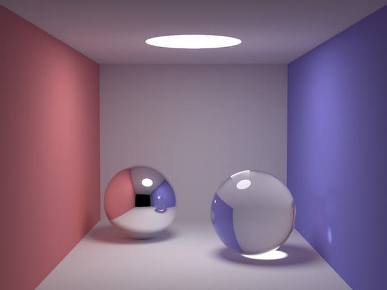Small PT 程序运行结果
>
> 
>
> ## 渲染方程
>
> 还是从最基础的渲染方程开始：
>
> 
>
> Lo(o)=Le(o)+∫ΩLi(i)⋅F(i,o)⋅cosθ⋅diLo(o)=Le(o)+∫ΩLi(i)⋅F(i,o)⋅cos⁡θ⋅di
>
> 
>
> 
>
> 解释：
>
> 1. 此方程描述的问题是：从物体表面上的一点 PP 处，射入到观察者眼中的某条光线的强度，是如何确定的。
> 2. Lo(o)Lo(o) 为射入观察者眼中的光线的颜色，即需要求取的值；oo 为出射方向。
> 3. Le(o)Le(o) 为物体表面在点 PP 向观察者方向自发射的光线的颜色（灯）。
> 4. Li(i)Li(i) 表示环境入射到点 PP 的光的颜色；ii **代表**入射方向（为计算方便，取真实入射方向的反方向，不影响**代表**关系，后面也简称为入射方向）。
> 5. F(i,o)F(i,o) 表示在给定 ii 和 oo 时，由 ii 方向的入射单位光强产生的 oo 方向的出射光的强度，此函数与表面的性质有关，又称表面的 BRDF 函数。
> 6. θθ 表示 ii 与表面法线的夹角。
> 7. ∫ΩLi(i)⋅F(i,o)⋅cosθ⋅di∫ΩLi(i)⋅F(i,o)⋅cos⁡θ⋅di 整个积分项表示：对半球（不透明材质）或全球（透明介质）内的所有入射方向 ii 进行积分，得到的 oo 方向的出射光强度。
>
> 依照光线追踪的原理，我们沿着 oo 方向追踪到一处交点 PP，就需要进行一次积分操作。在计算机程序中，积分是用求和模拟的，求和的次数越多（自变量的间隔越小），结果就越准确。假设每次积分都要进行 nn 次求和操作，那么当追踪的光线遇到第一个交点时，会发散成 nn 条光线；同时追踪这 nn 条光线，到下一个交点，每条光线又会发散成 nn 条光线……随着追踪深度的增加，计算开销的量级将按照指数级上升。
>
> 
>
> ## 蒙特卡洛方法
>
> 蒙特卡洛方法（Monte Carlo method）是一种使用概率理论（通过大量随机数采样）进行数值计算以求取积分的方法。一个常用的有助理解的例子是：对「如何计算圆的面积」这个问题（圆的面积公式求取其实也是一个积分问题），蒙特卡洛的解法是「撒豆」：在包含圆的已知面积为 SS 的矩形内随机采样（撒豆）NN 次，统计豆在圆内的次数为 MM，则圆的面积为 S⋅M/NS⋅M/N。
>
> 
>
> > 撒豆问题不仅可以解圆的面积，还可以解任意形状，甚至不规则形状的面积求取。
>
> 更具体地，蒙特卡洛方法可以表述为：
>
> 
>
> ∫baf(x)⋅dx≈∑x=rand(a,b)Nf(x)⋅b−aN∫abf(x)⋅dx≈∑x=rand(a,b)Nf(x)⋅b−aN
>
> 
>
> 1. 左侧表示函数 f(x)f(x) 在区间 [a,b][a,b] 的积分，即下图中的部分阴影部分面积。
> 2. 此积分的值，可以这样求取：随机在 [a,b][a,b] 区间取值，采样计算 f(x)f(x)，然后计算所有样本的均值并乘以区间的长度。当取样数量 NN 越大，最后的值就越接近真实的积分值。
>
> 
>
> 有同学可能会问（我也曾有此困惑），为什么不直接均等分采样，而要随机采样呢？其实，对于计算一维的函数 f(x)f(x)，区别确实不大，但对二维甚至更高维度的函数（此时需要求取重积分）如 f(x,y)f(x,y)，情况就不一样了。
>
> 
>
> ∫y2y1∫x2x1f(x,y)⋅dxdy≈∑x=rand(x1,x2)y=rand(y1,y2)Nf(x,y)⋅(x2−x1)⋅(y2−y1)N∫y1y2∫x1x2f(x,y)⋅dxdy≈∑x=rand(x1,x2)y=rand(y1,y2)Nf(x,y)⋅(x2−x1)⋅(y2−y1)N
>
> 
>
> 此时，如果采取均等分采样，就需要选择在 [x1,x2][x1,x2] 上均等分为若干份，选择在 [y1,y2][y1,y2] 上均等分为若干份（其实撒豆问题已经是二维积分了，只不过积分函数是最简单的二值函数）。随着维度的增加，我们采样的数量也更难以控制，甚至还会出现维度不确定的情况。相比之下，蒙特卡洛方法的随机采样，可以轻易地控制或调整采样的次数：取两次（或更多次数的）随机数，可以视为**单次**随机行为，其背后包含的某种「随机性」是一致的。
>
> > 对于光线追踪而言，我们会追踪若干次反射或折射（这个次数又称深度），每一次反射或折射都需要进行一次采样，相当于增加了一个维度。如果每次采样的次数过多，随着深度的增加，总采样次数很快就会不可接受，而如果每次的采样次数过少，（直觉告诉我）那么第一次采样对后续的采样将造成比较大的偏差（这背后应该有更完整的数学解释）。而且，在光线追踪算法中，有时候是否继续进行采样取决于具体的采样值，这就让等分采样变得更加困难。实际上，这份光追算法的实现，在每次反射或折射时只取一个随机样本，而通过增加总总采样次数 NN 来保证最后的结果满足期望。
>
> ## 光线追踪算法
>
> 使用蒙特卡洛方法，对每一次反射或折射不再进行积分，而是随机选取一条可能的反射或折射光线进行追踪。然后在开始追踪的源头处，重复多次追踪操作以求取期望，这就是 SmallPT 光追的算法。简述一下具体步骤：
>
> 
>
> 1. 从每个像素 PP 处发出一条射线 RR，其方向与入射到相机并产生该像素的光线相反。
>
> 2. 求取此射线照射到的物体表面的点 P1P1，即与场景中物体的交点；如有多个交点，取距离相机最近的那个。如果未求到交点，则返回背景色。
>
> 3. 
>
>    P1P1
>
>     
>
>    射向
>
>     
>
>    
>
>    PP
>
>     
>
>    的光线强度，为
>
>     
>
>    
>
>    P1P1
>
>     
>
>    本身发射光强度
>
>     
>
>    
>
>    EE
>
>    ，加上反射或折射环境光的强度。
>
>    1. EE：如果 P1P1 处是光源，则 EE 为光源的强度；否则，EE 为 0。
>    2. R1R1：根据 P1P1 处根据表面性质，按概率随机取**一次**反射的射线 R2R2，然后重复 2 的步骤，分别递归地求取 P2P2，R3R3，P3P3，R4R4 ……等等，直到满足一些特定条件停止递归。
>
> 以上便是单个像素的光追的算法。对单个像素，重复大量的次数求取平均值，作为此像素的颜色。
>
> 对每个像素完成以上步骤，就渲染出了整幅图像。
>
> ## 代码摘录
>
> 完整的代码摘抄如下：
>
> ```cpp
> #include <math.h>   // smallpt, a Path Tracer by Kevin Beason, 2008
> #include <stdlib.h> // Make : g++ -O3 -fopenmp smallpt.cpp -o smallpt
> #include <stdio.h>  //        Remove "-fopenmp" for g++ version < 4.2
> struct Vec {        // Usage: time ./smallpt 5000 && xv image.ppm
>   double x, y, z;                  // position, also color (r,g,b)
>   Vec(double x_=0, double y_=0, double z_=0){ x=x_; y=y_; z=z_; }
>   Vec operator+(const Vec &b) const { return Vec(x+b.x,y+b.y,z+b.z); }
>   Vec operator-(const Vec &b) const { return Vec(x-b.x,y-b.y,z-b.z); }
>   Vec operator*(double b) const { return Vec(x*b,y*b,z*b); }
>   Vec mult(const Vec &b) const { return Vec(x*b.x,y*b.y,z*b.z); }
>   Vec& norm(){ return *this = *this * (1/sqrt(x*x+y*y+z*z)); }
>   double dot(const Vec &b) const { return x*b.x+y*b.y+z*b.z; } // cross:
>   Vec operator%(Vec&b){return Vec(y*b.z-z*b.y,z*b.x-x*b.z,x*b.y-y*b.x);}
> };
> struct Ray { Vec o, d; Ray(Vec o_, Vec d_) : o(o_), d(d_) {} };
> enum Refl_t { DIFF, SPEC, REFR };  // material types, used in radiance()
> struct Sphere {
>   double rad;       // radius
>   Vec p, e, c;      // position, emission, color
>   Refl_t refl;      // reflection type (DIFFuse, SPECular, REFRactive)
>   Sphere(double rad_, Vec p_, Vec e_, Vec c_, Refl_t refl_):
>   rad(rad_), p(p_), e(e_), c(c_), refl(refl_) {}
>   double intersect(const Ray &r) const { // returns distance, 0 if nohit
>     Vec op = p-r.o; // Solve t^2*d.d + 2*t*(o-p).d + (o-p).(o-p)-R^2 = 0
>     double t, eps=1e-4, b=op.dot(r.d), det=b*b-op.dot(op)+rad*rad;
>     if (det<0) return 0; else det=sqrt(det);
>       return (t=b-det)>eps ? t : ((t=b+det)>eps ? t : 0);
>   }
> };
> Sphere spheres[] = {//Scene: radius, position, emission, color, material
>   Sphere(1e5, Vec( 1e5+1,40.8,81.6), Vec(),Vec(.75,.25,.25),DIFF),//Left
>   Sphere(1e5, Vec(-1e5+99,40.8,81.6),Vec(),Vec(.25,.25,.75),DIFF),//Rght
>   Sphere(1e5, Vec(50,40.8, 1e5),     Vec(),Vec(.75,.75,.75),DIFF),//Back
>   Sphere(1e5, Vec(50,40.8,-1e5+170), Vec(),Vec(),           DIFF),//Frnt
>   Sphere(1e5, Vec(50, 1e5, 81.6),    Vec(),Vec(.75,.75,.75),DIFF),//Botm
>   Sphere(1e5, Vec(50,-1e5+81.6,81.6),Vec(),Vec(.75,.75,.75),DIFF),//Top
>   Sphere(16.5,Vec(27,16.5,47),       Vec(),Vec(1,1,1)*.999, SPEC),//Mirr
>   Sphere(16.5,Vec(73,16.5,78),       Vec(),Vec(1,1,1)*.999, REFR),//Glas
>   Sphere(600, Vec(50,681.6-.27,81.6),Vec(12,12,12),  Vec(), DIFF) //Lite
> };
> inline double clamp(double x){ return x<0 ? 0 : x>1 ? 1 : x; }
> inline int toInt(double x){ return int(pow(clamp(x),1/2.2)*255+.5); }
> inline bool intersect(const Ray &r, double &t, int &id){
>   double n=sizeof(spheres)/sizeof(Sphere), d, inf=t=1e20;
>   for(int i=int(n);i--;) if((d=spheres[i].intersect(r))&&d<t){t=d;id=i;}
>   return t<inf;
> }
> Vec radiance(const Ray &r, int depth, unsigned short *Xi){
>   double t;                               // distance to intersection
>   int id=0;                               // id of intersected object
>   if (!intersect(r, t, id)) return Vec(); // if miss, return black
>   const Sphere &obj = spheres[id];        // the hit object
>   Vec x=r.o+r.d*t, n=(x-obj.p).norm(), nl=n.dot(r.d)<0?n:n*-1, f=obj.c;
>   double p = f.x>f.y && f.x>f.z ? f.x : f.y>f.z ? f.y : f.z; // max refl
>   if (++depth>5) if (erand48(Xi)<p) f=f*(1/p); else return obj.e; //R.R.
>   if (obj.refl == DIFF){                  // Ideal DIFFUSE reflection
>     double r1=2*M_PI*erand48(Xi), r2=erand48(Xi), r2s=sqrt(r2);
>     Vec w=nl, u=((fabs(w.x)>.1?Vec(0,1):Vec(1))%w).norm(), v=w%u;
>     Vec d = (u*cos(r1)*r2s + v*sin(r1)*r2s + w*sqrt(1-r2)).norm();
>     return obj.e + f.mult(radiance(Ray(x,d),depth,Xi));
>   } else if (obj.refl == SPEC)            // Ideal SPECULAR reflection
>     return obj.e + f.mult(radiance(Ray(x,r.d-n*2*n.dot(r.d)),depth,Xi));
>   Ray reflRay(x, r.d-n*2*n.dot(r.d));     // Ideal dielectric REFRACTION
>   bool into = n.dot(nl)>0;                // Ray from outside going in?
>   double nc=1, nt=1.5, nnt=into?nc/nt:nt/nc, ddn=r.d.dot(nl), cos2t;
>   if ((cos2t=1-nnt*nnt*(1-ddn*ddn))<0)    // Total internal reflection
>     return obj.e + f.mult(radiance(reflRay,depth,Xi));
>   Vec tdir = (r.d*nnt - n*((into?1:-1)*(ddn*nnt+sqrt(cos2t)))).norm();
>   double a=nt-nc, b=nt+nc, R0=a*a/(b*b), c = 1-(into?-ddn:tdir.dot(n));
>   double Re=R0+(1-R0)*c*c*c*c*c,Tr=1-Re,P=.25+.5*Re,RP=Re/P,TP=Tr/(1-P);
>   return obj.e + f.mult(depth>2 ? (erand48(Xi)<P ? // Russian roulette
>     radiance(reflRay,depth,Xi)*RP:radiance(Ray(x,tdir),depth,Xi)*TP) :
>     radiance(reflRay,depth,Xi)*Re+radiance(Ray(x,tdir),depth,Xi)*Tr);
> }
> int main(int argc, char *argv[]){
>   int w=1024/8, h=768/8, samps = argc==2 ? atoi(argv[1])/4 : 30;
>   Ray cam(Vec(50,52,295.6), Vec(0,-0.042612,-1).norm()); // cam pos, dir
>   Vec cx=Vec(w*.5135/h), cy=(cx%cam.d).norm()*.5135, r, *c=new Vec[w*h];
>   for (int y=0; y<h; y++){                       // Loop over image rows
>     fprintf(stderr,"\rRendering (%d spp) %5.2f%%",samps*4,100.*y/(h-1));
>     for (unsigned short x=0, Xi[3]={0,0,(unsigned short)(y*y*y)}; x<w; x++)
>       for (int sy=0, i=(h-y-1)*w+x; sy<2; sy++)     // 2x2 subpixel rows
>         for (int sx=0; sx<2; sx++, r=Vec()){        // 2x2 subpixel cols
>           for (int s=0; s<samps; s++){
>             double r1=2*erand48(Xi), dx=r1<1 ? sqrt(r1)-1: 1-sqrt(2-r1);
>             double r2=2*erand48(Xi), dy=r2<1 ? sqrt(r2)-1: 1-sqrt(2-r2);
>             Vec d = cx*( ( (sx+.5 + dx)/2 + x)/w - .5) +
>             cy*( ( (sy+.5 + dy)/2 + y)/h - .5) + cam.d;
>             r = r + radiance(Ray(cam.o+d*140,d.norm()),0,Xi)*(1./samps);
>           } // Camera rays are pushed ^^^^^ forward to start in interior
>           c[i] = c[i] + Vec(clamp(r.x),clamp(r.y),clamp(r.z))*.25;
>         }
>   }
>   FILE *f = fopen("image.ppm", "w");         // Write image to PPM file.
>   fprintf(f, "P3\n%d %d\n%d\n", w, h, 255);
>   for (int i=0; i<w*h; i++)
>     fprintf(f,"%d %d %d ", toInt(c[i].x), toInt(c[i].y), toInt(c[i].z));
> }
> ```
>
> 本文的主要部分，就是对这段代码的解析：
>
> ## 矢量运算
>
> 定义 `Vec` 结构体描述三维矢量，重载运算符来实现矢量运算。
>
> ```cpp
> struct Vec {
>   double x, y, z;
>   Vec(double x_=0, double y_=0, double z_=0){ x=x_; y=y_; z=z_; }
>   Vec operator+(const Vec &b) const { return Vec(x+b.x,y+b.y,z+b.z); }
>   Vec operator-(const Vec &b) const { return Vec(x-b.x,y-b.y,z-b.z); }
>   Vec operator*(double b) const { return Vec(x*b,y*b,z*b); }
>   Vec mult(const Vec &b) const { return Vec(x*b.x,y*b.y,z*b.z); }
>   Vec& norm(){ return *this = *this * (1/sqrt(x*x+y*y+z*z)); }
>   double dot(const Vec &b) const { return x*b.x+y*b.y+z*b.z; }
>   Vec operator%(Vec&b){return Vec(y*b.z-z*b.y,z*b.x-x*b.z,x*b.y-y*b.x);}
> };
> ```
>
> 矢量运算包括（假设 V1=(x1,y1,z1)V1=(x1,y1,z1)；V2=(x2,y2,z2)V2=(x2,y2,z2)）：
>
> 1. 加法 `operator+`：V1+V2=(x1+x2,y1+y2,z1+z2)V1+V2=(x1+x2,y1+y2,z1+z2)。
> 2. 减法 `operator-`：V1−V2=(x1−x2,y1−y2,z1−z2)V1−V2=(x1−x2,y1−y2,z1−z2)。
> 3. 乘法 `mult()`：mult(V1,V2)=(x1x2,y1y2,z1z2)mult(V1,V2)=(x1x2,y1y2,z1z2)。这种矢量分量直接相乘的运算通常用于颜色的计算，在三维空间中并无特殊的物理意义。
> 4. 点乘 `dot()`：V1⋅V2=(x1x2+y1y2+z1z2)=cosθV1⋅V2=(x1x2+y1y2+z1z2)=cos⁡θ，其中 θθ 为 V1V1 与 V2V2 的夹角。点乘的结果是一个标量，物理含义是 V1V1 在 V2V2 方向上的投影。
> 5. 叉乘 `operator%`：V1×V2=(y1z2−z1y2,z1x2−x1z2,x1y2−y1x2)V1×V2=(y1z2−z1y2,z1x2−x1z2,x1y2−y1x2)，叉乘的结果是一个矢量，物理意义是垂直于 V1V1 和 V2V2 的矢量（按 V1→V2V1→V2 顺序右手螺旋），其长度为 V1V1 和 V2V2 构成的平行四边形面积。
> 6. 矢量乘以标量 `operator*`：V1∗b=(x1b,y1b,z1b)V1∗b=(x1b,y1b,z1b)。
> 7. 归一化 `norm()`：norm(V1)=V1∗1x21+y21+z21√norm(V1)=V1∗1x12+y12+z12，其物理意义是保持矢量方向不变，将其长度缩放为单位长度 1。
>
> 
>
> ## 射线
>
> 通过定义射线的出射点 oo 和出射方向 dd 来定义射线：
>
> ```cpp
> struct Ray { Vec o, d; Ray(Vec o_, Vec d_) : o(o_), d(d_) {} };
> ```
>
> 
>
> ## 定义场景
>
> 如前文 SmallPT 的渲染效果图所示，整个场景由一个房间，一个光源和两个球体组成。为了简单，SmallPT 将场景全部用球体来表示，房间的墙壁就用直径极大（使观者感受不到墙壁是弯曲的）的球体来表示。
>
> 
>
> ### 球体对象的表示
>
> 1. 首先枚举出三种表面特性：散射面——用于墙壁，镜面——用于左侧的镜面小球，折射面——用于右侧的玻璃小球。
> 2. 定义球体，内容包括：
>    1. 数值类型成员：半径 radrad；
>    2. 矢量类型成员：圆心位置 pp，表面发光强度（颜色）ee，表面散射颜色 cc；
>    3. 表面特性 reflrefl；
>
> ```cpp
> enum Refl_t { DIFF, SPEC, REFR };  // material types, used in radiance()
> struct Sphere {
>   double rad;       // radius
>   Vec p, e, c;      // position, emission, color
>   Refl_t refl;      // reflection type (DIFFuse, SPECular, REFRactive)
>   Sphere(double rad_, Vec p_, Vec e_, Vec c_, Refl_t refl_):
>   rad(rad_), p(p_), e(e_), c(c_), refl(refl_) {}
>   // ...
> };
> ```
>
> ### 射线与球体相交
>
> `Sphere` 上定义了 `intersect` 方法，以求取给定的射线与球体是不是相交。如果相交则返回射线原点与交点的距离。
>
> ```c
> double intersect(const Ray &r) const { // returns distance, 0 if nohit
>   Vec op = p-r.o; // Solve t^2*d.d + 2*t*(o-p).d + (o-p).(o-p)-R^2 = 0
>   double t, eps=1e-4, b=op.dot(r.d), det=b*b-op.dot(op)+rad*rad;
>   if (det<0) return 0; else det=sqrt(det);
>     return (t=b-det)>eps ? t : ((t=b+det)>eps ? t : 0);
> }
> ```
>
> 
>
> 注意，下面为了清楚，我们使用大写字母为矢量，小写字母为标量来进行推导。我们需要求解的是射线的原点 OO 与交点 XX 的距离 tt，而条件是：
>
> 1. XX 点在射线上，即 X=O+D∗tX=O+D∗t。
> 2. XX 点在球面上，即 XX 与球心 PP 的距离等于球的半径 。即 |X−P|=r|X−P|=r，也就是 (X−P)2=r2(X−P)2=r2。
>
> 将 (1) 中关于 XX 的表达式代入 (2)，得到：
>
> 
>
> (O+D∗t−P)2=r2(O+D∗t−P)2=r2
>
> 
>
> 展开得到：
>
> 
>
> D2∗t+2(O−P)⋅D∗t+(O−P)2−r2=0D2∗t+2(O−P)⋅D∗t+(O−P)2−r2=0
>
> 
>
> 这已经是一个一元二次方程，自变量 tt 是未知的。所有矢量经过平方或点积后都成为了标量，可以直接根据一元二次方程 ax2+bx+c=0ax2+bx+c=0 的求根公式：
>
> 
>
> x=−b±b2−4ac−−−−−−−√2ax=−b±b2−4ac2a
>
> 
>
> 计算出根 tt。
>
> 1. 一元二次方程可能没有实根的，此时射线与球体不相交。这对应着代码中 `det<0` 的情况，直接返回 0。
> 2. 一元二次方程可能有两个实根，此时射线（所在的直线）与球体有两个交点。我们需要取的是**最小的正根**。如果另一个根 t′t′（对应交点为 X′X′）大于 tt，表明是左图的情况；如果 t′t′ 小于等于 0，表明是右图的情况，这条光线是在介质内的折射光线。
>
> ### 使用球体表示场景
>
> 代码定义了一个 `spheres` 数组来表达整个场景，每一个球体分别是：
>
> 1. 左侧墙体，红色；墙体的半径都很大，观者感知不到曲率；墙体的反射类型都是散射，但是颜色有所不同。
> 2. 右侧墙体，蓝色。
> 3. 后面墙体，灰色。
> 4. 前面墙体，黑色。
> 5. 底部墙体，灰色。
> 6. 顶部墙体，灰色。
> 7. 左侧球体，镜面材质。
> 8. 右侧球体，透明玻璃材质，光线可能折射进入玻璃中继续传播。
> 9. 顶部的光源，发射出强度为 12 的白光。
>
> ```c
> Sphere spheres[] = { //Scene: radius, position, emission, color, material
>   Sphere(1e5, Vec( 1e5+1,40.8,81.6), Vec(),Vec(.75,.25,.25),DIFF),//Left
>   Sphere(1e5, Vec(-1e5+99,40.8,81.6),Vec(),Vec(.25,.25,.75),DIFF),//Rght
>   Sphere(1e5, Vec(50,40.8, 1e5),     Vec(),Vec(.75,.75,.75),DIFF),//Back
>   Sphere(1e5, Vec(50,40.8,-1e5+170), Vec(),Vec(),           DIFF),//Frnt
>   Sphere(1e5, Vec(50, 1e5, 81.6),    Vec(),Vec(.75,.75,.75),DIFF),//Botm
>   Sphere(1e5, Vec(50,-1e5+81.6,81.6),Vec(),Vec(.75,.75,.75),DIFF),//Top
>   Sphere(16.5,Vec(27,16.5,47),       Vec(),Vec(1,1,1)*.999, SPEC),//Mirr
>   Sphere(16.5,Vec(73,16.5,78),       Vec(),Vec(1,1,1)*.999, REFR),//Glas
>   Sphere(600, Vec(50,681.6-.27,81.6),Vec(12,12,12),  Vec(), DIFF) //Lite
> };
> ```
>
> 可以看出，坐标轴的原点位于盒子的左面、后面和底面的交点附近。宽度 100 左右，高度 80 左右，深度 170 左右。
>
> ## 准备渲染
>
> 在真正开始渲染之前，还需要做一些准备工作。
>
> ### 确定相机和输出图像
>
> 先跳过 `clamp`，`toInt`，`radiance` 这几个函数，直接来看 `main` 函数。
>
> ```cpp
> int main(int argc, char *argv[]){
>   int w=1024, h=768, samps = argc==2 ? atoi(argv[1])/4 : 30;
>   Ray cam(Vec(50,52,295.6), Vec(0,-0.042612,-1).norm()); // cam pos, dir
>   Vec cx=Vec(w*.5135/h), cy=(cx%cam.d).norm()*.5135, r, *c=new Vec[w*h];
>   for (int y=0; y<h; y++){                       // Loop over image rows
>     fprintf(stderr,"\rRendering (%d spp) %5.2f%%",samps*4,100.*y/(h-1));
>     for (unsigned short x=0, Xi[3]={0,0,(unsigned short)(y*y*y)}; x<w; x++)
>       // ... 暂时先省略
>   }
>   FILE *f = fopen("image.ppm", "w");         // Write image to PPM file.
>   fprintf(f, "P3\n%d %d\n%d\n", w, h, 255);
>   for (int i=0; i<w*h; i++)
>     fprintf(f,"%d %d %d ", toInt(c[i].x), toInt(c[i].y), toInt(c[i].z));
> }
> ```
>
> 首先，定义需要渲染图像的宽度（1024），高度（768），对每个像素的采样次数（命令行参数传入，或 120 次）。注意，变量 `samps` 的值是采样次数的 1/4，在这个例子中，最终渲染在图像上的每一个像素，又会拆分成 4 个子像素进行追踪和采样，而 `samps` 的值是子像素的采样次数。
>
> 然后，使用射线类的变量 `cam` 来表示相机，射线的原点 `cam.o` 即是相机的位置，而射线的方向 `cam.d` 是相机朝向的方向。由于相机本身的位置只是一个点，所以需要把渲染出的图像视为在屏幕前方（亦或是后方，参考一下眼球和相机的构造）不远处的一块矩形幕布，抵达相机的光线穿透幕布时会在与幕布的交点 PP 处留下颜色，这样就在幕布上投影了。只要幕布的分辨率和宽高比不变，其距离相机的远近与最终结果是无关的，所以程序直接设定幕布与相机的距离是 1，设定幕布本身的高度为 0.5135（配合像素尺寸的宽高比，其实这里已经暗含了相机的水平和垂直视场角的信息）。然后，求取长度等于幕布真实宽度 `0.5135*w/h` 的水平矢量 `cx`（平行于 X 轴），求取长度等于幕布真实高度 `0.5135` 的垂直矢量 `cy`（通过 `cx` 与 `cam.d` 叉乘而来）。
>
> 
>
> 再接着，生成长度为 `w*h` 的 `Vec` 类型数组 `c` 备用。这个数组的作用是存储渲染的结果。
>
> 最后，遍历宽度和高度，对每一个像素进行渲染，并将渲染得到值写入到数组 `c` 中，并将其输出为 PPM 格式的图片，以便打开查看渲染效果。
>
> > PPM 是一种基于文本的图片格式，能够帮助你避免考虑图片文件编码问题，轻易地按像素输出图片。比如以下文本内容就是一张 4x4 的图片。
> >
> > ```
> > P3
> > # feep.ppm
> > 4 4
> > 15
> >  0  0  0    0  0  0    0  0  0   15  0 15
> >  0  0  0    0 15  7    0  0  0    0  0  0
> >  0  0  0    0  0  0    0 15  7    0  0  0
> > 15  0 15    0  0  0    0  0  0    0  0  0
> > ```
> >
> > 
>
> 总结一下各个变量的含义：
>
> 1. `w` 和 `h`：宽度和高度像素数。
> 2. `samps`：每个像素采样次数的 1/4。
> 3. `cam`：相机描述。
> 4. `cx` 和 `cy`：长度与幕布真实尺寸相同的水平、垂直矢量。
> 5. `c`：按像素存储渲染结果的数组。
>
> ### 子像素采样
>
> 接下来，我们看一下如何计算每个像素的值的（即之前省略的部分）。对每一个像素，都将其拆分为 2x2 一共 4 个子像素。一个当然的想法是，以子像素的中心点 PsPs 作为射线的出发点开始追踪，但是由于每个子像素都会进行 `samps` 次光追取均值，所以这里就引入了一次随机过程：以子像素的中心点，在一个像素大小的范围内进行一次随机采样，并以采样到的点 PiPi 为射线的出发点，进行一次光追。对每个子像素完成 `samps` 次光追，依次以 P1P1，P2P2 ……为出发点，最后求均值。
>
> 
>
> 而且，为了使渲染的质量更高一些（达到相同渲染质量所需的采样次数更小一些），这里对随机过程进行了优化：对随机数进行了一次 [tent 滤波](https://computergraphics.stackexchange.com/questions/3868/why-use-a-tent-filter-in-path-tracing)。此滤波函数将 xx 从 [0,2][0,2] 区间映射到了 [−1,1][−1,1]，当 xx 为随机的值时，f(x)f(x) 的分布更向中点值 00 集中（从图中可以看出）。
>
> 
>
> f(x)={x−−√−1←x<11−2−x−−−−√←x>1f(x)={x−1←x<11−2−x←x>1
>
> 
>
> 
>
> 然后，拿到经过滤波后的随机数 dxdx，dydy，计算 PiPi 在整个画布中的归一化坐标（假设成为 nxnx 和 nyny，如 `nx=(sx+0.5+dx)/2+x)/w-0.5`），再乘以之前求得的画布真实尺寸矢量 cxcx 和 cycy，加上相机本身的方向矢量 dd，就得到了最终从相机原点射向 PiPi 的矢量 DD，即代码中的 `d`。
>
> 
>
> ```cpp
> for (int sy=0, i=(h-y-1)*w+x; sy<2; sy++)     // 2x2 subpixel rows
>     for (int sx=0; sx<2; sx++, r=Vec()){        // 2x2 subpixel cols
>         for (int s=0; s<samps; s++){
>             double r1=2*erand48(Xi), dx=r1<1 ? sqrt(r1)-1: 1-sqrt(2-r1);
>             double r2=2*erand48(Xi), dy=r2<1 ? sqrt(r2)-1: 1-sqrt(2-r2);
>             Vec d = cx*( ( (sx+.5 + dx)/2 + x)/w - .5) +
>             cy*( ( (sy+.5 + dy)/2 + y)/h - .5) + cam.d;
>             r = r + radiance(Ray(cam.o+d*140,d.norm()),0,Xi)*(1./samps);
>         } // Camera rays are pushed ^^^^^ forward to start in interior
>         c[i] = c[i] + Vec(clamp(r.x),clamp(r.y),clamp(r.z))*.25;
>     }
> ```
>
> 最后，调用 `radiance`，沿着穿过此子像素的射线，在 140 倍远（让光追的开始点进到盒子里面，而不会直接被朝前的表面挡掉）的地方开始进行光线追踪算法。进行 `samps` 次，取均值，再基于 4 个子像素再取一次均值，就得到了这个像素的颜色。
>
> > erand48() 函数是 C 标准库提供的随机函数。传入长度为 3 的数组作为随机种子，返回 [0, 1] 区间的双精度浮点数，同时改写传入的随机种子，便于下一次调用 erand() 时传入（以获取一个不同的结果）。
>
> 总结一下各个变量的含义：
>
> - `i`：为当前像素在 `c` 中的索引。
> - `r`：通过光追计算出的子像素的颜色。
> - `sx` 和 `sy`：子像素索引，为 0 或 1。
> - `r1` 和 `r2`：滤波用自变量，在 [0, 2] 区间随机取得。
> - `dx` 和 `dy`：滤波后的随机自变量，分布在 [-1, 1] 区间内。
> - `d` ：从相机原点指向子像素位置的矢量。
>
> ## 光线追踪
>
> 讲了这么多，终于到正餐了。函数 `radiance()` 即进行了一次光线追踪。
>
> ```c
> Vec radiance(const Ray &r, int depth, unsigned short *Xi){
>     double t;                               // distance to intersection
>     int id=0;                               // id of intersected object
>     if (!intersect(r, t, id)) return Vec(); // if miss, return black
>     const Sphere &obj = spheres[id];        // the hit object
>     Vec x=r.o+r.d*t, n=(x-obj.p).norm(), nl=n.dot(r.d)<0?n:n*-1, f=obj.c;
>     double p = f.x>f.y && f.x>f.z ? f.x : f.y>f.z ? f.y : f.z; // max refl
>     if (++depth>5) if (erand48(Xi)<p) f=f*(1/p); else return obj.e; //R.R.
>     if (obj.refl == DIFF){                  // Ideal DIFFUSE reflection
>       // ...
>     } else if (obj.refl == SPEC)            // Ideal SPECULAR reflection
>       // ...
>     // ...                                   // Ideal dielectric REFRACTION
> }
> ```
>
> 函数 `radiance()` 接收三个参数，射线 `r`，深度 `depth` 和随机种子 `Xi`。此函数是一个递归函数，在计算射线颜色时候，遇到反射或折射，会计算出下一次反射或折射的射线，然后递归调用自己求算下一次射线的颜色。深度 `depth` 标记了反射/折射的次数。
>
> 下面看 `radiance()` 函数的逻辑：
>
> ### 求取交点和递归结束条件
>
> 首先，对场景中的所有球体对象，尝试求取射线与之交点。函数 `intersect()` 负责做这件事：遍历 `spheres` 数组，依次调用 `sphere` 对象上的 `intersect()` 方法，并保留最小的正值 `t` 和对应球体在 `spheres` 数组中的索引 `i`。
>
> ```c
> inline bool intersect(const Ray &r, double &t, int &id){
>     double n=sizeof(spheres) /sizeof(Sphere), d, inf=t=1e20;
>     for(int i=int(n);i--;) if((d=spheres[i].intersect(r))&&d<t){t=d;id=i;}
>     return t<inf;
> }
> ```
>
> 如果没有任何对象与之相交，直接返回黑色（递归的结束条件 1）。
>
> 如果检测到有球体与射线相交，首先检查当前深度是否大于了 5（之前已经经过了 5 次反射或折射），如果是，那么遵循一个概率来随机地决定采取以下哪一种方案：
>
> 1. 放弃反射光的贡献，直接返回物体的出射光——虽然大部分时候是 0（递归的结束条件 2）。
> 2. 继续追踪光线。
>
> 这个概率就是当前物体表面的颜色 RGB 分量中最大的那个分量，归一化后的值。换言之，物体越暗（的颜色值越低），越容易被筛选到第 1 种方案（因为物体暗，环境光反射贡献的值也会小），而物体越亮，越容易被筛选到第二种方案。值得注意的是，当选择第二种方案时，需要把物体的颜色按照概率调高一些 `f=f*(1/p)`，这是因为那些运气不够好，被筛选到 1 方案光线，其反射分量完全地消失了，这会导致最终计算出的颜色的期望（也就是说，即使采样无穷次）与真实值产生偏差。在运气好的 2 方案中调整颜色，可以消除这个偏差。
>
> > 按照概率进行随机选择是无处不在的，只要采样的次数足够多，那么遵照概率选择计算得到的均值就能够逼近真实值。
>
> 接着，如果深度小于等于 5，那么不管物体的颜色值如何，都会正常地递归地进行光线追踪。在此之前，还需要预先求取一些变量的值，比如法线 `nl` 等，便于后续使用。
>
> 总结一下各变量的意义：
>
> - `t`：交点距离相机原点的距离。
> - `id`：相交的球体在 `spheres` 数组中的索引。
> - `obj`：相交的球体 `Sphere` 对象。
> - `x`：交点的位置。
> - `n`：球体在交点处的归一化的法线（从球心射向表面）。
> - `nl`：与反射/折射上下文契合的归一化的法线：如果射线在球体外部，`nl` 与 `n` 相同；如果射线在球体内部（折射），`nl` 与 `n` 相反。
>
> ### 散射（漫反射）
>
> 追踪光线，当代表光线的射线与球体相交时，根据球体表面的特性，进行不同的操作（代码中省略的部分）。
>
> 如果物体表面是漫反射，将随机选取一个角度取归一化的反射光线 DD：
>
> 1. 确定互相正交的三个归一化矢量 UU，VV 和 WW，其中 WW 为反射面的法线。
> 2. 在区间 [0,1][0,1] 中随机确定一个值 r2r2，并使 1−r22−−−−−√1−r22 作为反射光线 DD 在法线 WW 方向上投影的长度，使 r2−−√r2 也就是 r2sr2s 成为反射光线在表面上投影的长度。
> 3. 在区间 [0,2π][0,2π] 中随机确定一个角度值 r1r1，使之成为反射光点 DD 在反射表面（即 UVUV 平面）的投影与 UU 轴的交角。
> 4. 极坐标公式转笛卡尔坐标，U∗cos(r1)∗r2s+V∗sin(r1)∗r2s+W∗1−r2s2−−−−−−−√U∗cos⁡(r1)∗r2s+V∗sin⁡(r1)∗r2s+W∗1−r2s2 计算出在半球面的随机矢量，再归一化得到反射矢量 DD。
>
> 
>
> 最后，递归地调用 `radiance()` 函数，将反射光线作为参数传入，传入已自增过一次的深度和随机种子。其结果乘以表面的颜色，再加上球体表面的发射光颜色，作为结果返回。这就是此光追算法对散射表面的处理。
>
> ```c
> if (obj.refl == DIFF){                  // Ideal DIFFUSE reflection
>     double r1=2*M_PI*erand48(Xi), r2=erand48(Xi), r2s=sqrt(r2);
>     Vec w=nl, u=((fabs(w.x)>.1?Vec(0,1):Vec(1))%w).norm(), v=w%u;
>     Vec d = (u*cos(r1)*r2s + v*sin(r1)*r2s + w*sqrt(1-r2)).norm();
>     return obj.e + f.mult(radiance(Ray(x,d),depth,Xi));
> ```
>
> 总结一下各变量的含义：
>
> - `u`，`v`，`w`：互相正交的三个归一化矢量，`w` 即为法向量。
> - `r1`：反射光线在反射表面与 `u` 的交角。
> - `r2` 与 `r2s`：`r2s` 为反射光线在反射表面投影的长度，`r2` 为此值的平方。
> - `d`：随机求取的反射方向。
>
> ### 镜面反射
>
> 镜面反射比较简单，因为对于确定的入射光线，反射的方向也是确定的，因此没有随机过程，直接取镜面反射的方向继续进行光追。
>
> 镜面反射的求法比较简单，不过也记录一下吧：如下图对称的两条射线 D1D1 和 D2D2，而法线为 NN（法线是归一化的）。此时有 D1+D2=N∗2(N⋅D1)D1+D2=N∗2(N⋅D1)，求解 D2=N∗2(N⋅D1)−D1D2=N∗2(N⋅D1)−D1 。在代码中，D1D1 就是 `-r.d`，带入得到 `r.d-n*2*n.dot(r.d)`，即反射光线的。由于 `r.d` 也已经是归一化的了，所以求取得到的结果也一定是归一化的。
>
> 
>
> 代码如下：
>
> ```c
> } else if (obj.refl == SPEC)            // Ideal SPECULAR reflection
>     return obj.e + f.mult(radiance(Ray(x,r.d-n*2*n.dot(r.d)),depth,Xi));
> ```
>
> ### 折射
>
> 折射是比较复杂的。不同的物体有不同的折射率，空气的折射率为 1，玻璃的折射率为 1.5。根据折射定理：光线从折射率为 n1n1 的介质折射到折射率为 n2n2 的介质，折射角满足（此定理可以从更一般的麦克斯韦电磁方程组推导出来，厉害厉害）：
>
> 
>
> n1sinθ1=n2sinθ2n1sin⁡θ1=n2sin⁡θ2
>
> 
>
> 
>
> #### 全反射
>
> 首先需要考虑的是全反射现象，即光线从光密介质（玻璃）向光疏介质（空气）传播时（上图右半部分），θ1θ1 大于临界角（使得 θ2θ2 为 90° 的 θ1θ1），以至于不存在 θ2θ2 满足上述折射定理时，所有光都被反射的现象，即：
>
> 
>
> sinθ1>n2n1sin(90°)sin⁡θ1>n2n1sin⁡(90°)
>
> 
>
> 两边平方并作简单变换，得到：
>
> 
>
> (n2n1)2−cos2θ1+1<0(n2n1)2−cos2⁡θ1+1<0
>
> 
>
> 由于 `nnt` 为 n1n2n1n2，而 `ddn` 为 −cosθ1−cos⁡θ1，代入上式，得到全反射的条件即是 `1-nnt*nnt*(1-ddn*ddn))<0`。满足全反射条件时，镜面反射的方式进行处理。
>
> ```c
> Ray reflRay(x, r.d-n*2*n.dot(r.d));     // Ideal dielectric REFRACTION
> bool into = n.dot(nl)>0;                // Ray from outside going in?
> double nc=1, nt=1.5, nnt=into?nc/nt:nt/nc, ddn=r.d.dot(nl), cos2t;
> if ((cos2t=1-nnt*nnt*(1-ddn*ddn))<0)    // Total internal reflection
>     return obj.e + f.mult(radiance(reflRay,depth,Xi));
> ```
>
> 总结一下各变量的含义：
>
> - `reflRay`：镜面反射方向，与上一节中的求法完全一致。
> - `into`：由空气（试图）进入玻璃则为 `true`，由玻璃（试图）进入空气则为 `false`。
> - `nc` 和 `nt`：空气和玻璃的折射率。
> - `nnt` 为折射率比值，当追踪的射线是从空气进入玻璃时，`nnt` 为 `1.0/1.5`，当射线是从玻璃进入空气时，`nnt` 为 `1.5`。
> - `ddn`：即 −cosθ1−cos⁡θ1 的值，由 DD 和 NN 点乘而来。
>
> #### 正常折射
>
> 所谓正常折射，即是光线一部分镜面反射，一部分折射进入另一种介质。此时，我们需要：
>
> 1. 计算折射光线矢量 TT。
> 2. 计算有多少比例的光线被反射，有多少比例的光线被折射。
> 3. 根据条件，选择以随机或非随机的形式，递归地进行光线追踪。
>
> 首先计算折射光线矢量 TT：
>
> 
>
> 首先，假设入射光线在表面平面的投影矢量（并归一化）为 BB 已知，折射角 θ2θ2 也已知，我们可以得到 TT 为：
>
> 
>
> T=Bsinθ2−Ncosθ2T=Bsin⁡θ2−Ncos⁡θ2
>
> 
>
> 其中 BB 就是入射光线平面上的投影矢量（因为入射和折射在同一个平面内）归一化得到，而此投影矢量可以使用 DD 减去 DD 在法线上的投影 D⋅ND⋅N（注意这里点积是个负数）来得出，因此：
>
> 
>
> B=D−N∗(D⋅N)1−(D⋅N)2−−−−−−−−−−√B=D−N∗(D⋅N)1−(D⋅N)2
>
> 
>
> 同时 θ2θ2 的正弦和余弦值也可以通过折射定律求得：
>
> 
>
> sinθ2=n1n2sinθ1=n1n21−(D⋅N)2−−−−−−−−−−√sin⁡θ2=n1n2sin⁡θ1=n1n21−(D⋅N)2
>
> 
>
> 
>
> cosθ2=1−sin2θ2−−−−−−−−√=1−n21n22(1−(D⋅N)2)−−−−−−−−−−−−−−−−−√cos⁡θ2=1−sin2⁡θ2=1−n12n22(1−(D⋅N)2)
>
> 
>
> 全部代入，可得：
>
> 
>
> T=n1(D+N(D⋅N))n2−N1−n21(1−(D⋅N)2)n22−−−−−−−−−−−−−−−−−√T=n1(D+N(D⋅N))n2−N1−n12(1−(D⋅N)2)n22
>
> 
>
> 按照上述公式，将变量代入，即可计算出折射光线归一化矢量 `tdir`：
>
> ```c
> Vec tdir = (r.d*nnt - n*((into?1:-1)*(ddn*nnt+sqrt(cos2t)))).norm();
> ```
>
> 接下来，计算有多少比例的光线被反射，有多少比例的光线被折射。根据电动力学的一些理论，入射光线（普通的非偏振光）被反射/折射的比例，与入射角 θ1θ1，两种介质的折射率都有关系。当入射角等于 0（即垂直入射到表面）时，被反射的比例 R0R0 为：
>
> 
>
> R0=(n1−n2n1+n2)2R0=(n1−n2n1+n2)2
>
> 
>
> 而当入射角为 θθ 时的反射比例 RθRθ 为：
>
> 
>
> Rθ=R0+(1−R0)(1−cosθ1)5Rθ=R0+(1−R0)(1−cos⁡θ1)5
>
> 
>
> 最后，基于当前光追的深度：
>
> 1. 如果深度小于等于 2，那么分别递归地追踪反射光和折射光，将两者对颜色的贡献再加上物体本身的发光，作为结果返回。
> 2. 如果深度大于 2，那么依据折射和反射光线的占比来进行概率随机，选择追踪反射光或折射光中的一支。换言之，如果反射光占比高，那么就有较大的可能性随机到反射光线，反之亦然。注意，这时由于我们放弃了另一种可能性，会导致结果的期望产生偏差，所以需要进行一次修正。
>
> 对玻璃材质，前几次反射、折射对最终的结果的贡献比较大，所以选择都进行追踪。但是这样做一下子使得某些追踪的采样次数发散为了原来的 4 倍，如果深度改为 4，可能就是 16 倍。所以代码把发散深度限制在 2 这样一个比较小的数值，也算是在效果和性能间达到一个平衡。
>
> 代码如下：
>
> ```c
> double a=nt-nc, b=nt+nc, R0=a*a/(b*b), c = 1-(into?-ddn:tdir.dot(n));
> double Re=R0+(1-R0)*c*c*c*c*c,Tr=1-Re,P=.25+.5*Re,RP=Re/P,TP=Tr/(1-P);
> return obj.e + f.mult(depth>2 ? (erand48(Xi)<P ?   // Russian roulette
>     radiance(reflRay,depth,Xi)*RP : radiance(Ray(x,tdir),depth,Xi)*TP) :
>     radiance(reflRay,depth,Xi)*Re+radiance(Ray(x,tdir),depth,Xi)*Tr);
> ```
>
> 最后解释一下各个变量的含义：
>
> - `a` 和 `b`：用以计算 R0R0 的临时变量。
> - `R0`：入射角为 0 时反射光的占比。
> - `c`：即 1−cosθ11−cos⁡θ1。
> - `Re`：当前入射角下反射光的占比。
> - `Tr`：折射光的占比。
> - `RP`：随机到反射光时，对结果的修正的因子。
> - `TP`：随机到折射光时，对结果的修正的因子。
>
> 这样，光追算法就全部完成了。
>
> ## 感想
>
> 一直觉得光线追踪是非常高端的存在，因为没有基础，想了解也不知从何看起。一个偶然的机会发现到这个 demo，觉得挺有意思，就拿过来研究了。结果发现看起来还是比较吃力，好在另外一个老外的解读 PPT 帮了很大的忙。
>
> 把学习过的东西消化了，再重新写出来是件很折磨的事情，但收获也不小。每一个公式一步一步推导过来，对一些地方「为什么这么做」也有了不一样的体会。数学还是挺重要的，而且能够给人带来很强的成就感。


# 2

> # [Basic Illumination Definitions](https://www.cnblogs.com/daniagger/archive/2012/05/28/2521318.html)
>
> \1. Irradiance(辐照度)
>
> total amount of energy received per unit area of a surface
>
>  
>
> \2. Illuminance(照明度)
>
> essentially same as irradiance,the difference is that illuminance measures the amount of visible light energy in photometric terms
>
>  
>
> \3. Radiance(辐射)
>
> measure of energy that is reflected by the surface
>
>  
>
> \4. Luminance(亮度)
>
> measure of photometrically weighted light energy that leaves the surface
>
>  
>
> \5. Luminous intensity
>
> amount of light energy that is emitted by the surface in a given direction


# 1

> # Chapt1. Why to write a RayTracing Render
>
> 提到Computer Graphics，众所周知的是如OpenGL、Direct3D这样非常流行的光栅化渲染器。事实上，这些大部分应用于游戏制作的API主要为实时渲染（Real-time Rendering）而设置，而它们所采用的光栅化(Rasterization)的渲染方式，通过渲染大量的三角形（或者其他的几何图元种类(Primitive types)），是与本文介绍的光线跟踪相对的一种渲染方式。这种基于光栅化的渲染系统，往往只支持局部照明(Local Illumination)。局部照明在渲染几何图形的一个像素时，光照计算只能取得该像素的信息，而不能访问其他几何图形的信息。
>
> 
>
> 图1.jpg
>
> 该图片出自《孤岛惊魂》，尽管看似水面显示出了远处山峰的倒影，却不能渲染植被、船骸等细节。
>
> 理论上，阴影(Shadow)、反射(Reflection)、折射(Refraction)均为全局照明(Global Illumination)效果，所以在实际应用中，栅格化渲染系统可以使用预处理(如阴影贴图(shadow mapping)、环境贴图(environment mapping))去模拟这些效果。
>
> 栅格化的最大优势是计算量比较小，适合实时渲染。相反，全局光照计算量大，一般也没有特殊硬件加速(通常只使用CPU而非GPU)，所以只适合离线渲染(offline rendering)，例如3D Studio Max、Maya等工具。其中一个支持全局光照的方法，称为光线追踪(ray tracing)。光线追踪能简单直接地支持阴影、反射、折射，实现起来亦非常容易。
>
> # Chapt2. Principles of RayTracing
>
> 由光源发出的光到达物体表面后，产生反射和折射，简单光照明模型和光透射模型模拟了这两种现象。在简单光照明模型中，反射被分为理想漫反射和镜面反射光，把透射光模型分为理想漫透射光和规则透射光。由广元发出的光成为直接光，物体对直接光的反射或折射成为直接反射和直接折射，相对的，把物体表面间对广德反射和折射成为间接光、间接反射、间接折射。光线在物体之间的传播方式是光线跟踪算法的基础。
>
> 最基本的光线跟踪算法是跟踪镜面反射和折射。从光源发出的光遇到物体的表面，发生反射和折射，光就改变方向，沿着反射方向和折射方向继续前进，知道遇到新的物体。但是光源发出光线，经过反射与折射，只有很少部分可以进入人的眼睛。因此实际光线跟踪算法的跟踪方向与光传播的方向是相反的（反向光线跟踪），称之为视线跟踪。由视点与像素***(x,y)\***发出一根射线，与第一个物体相交后，在其反射与折射方向上进行跟踪，如图2所示
>
> 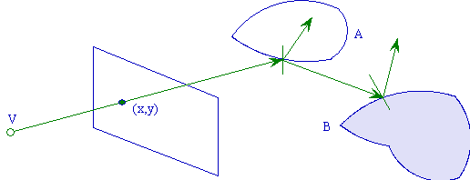
>
> 图2.gif
>
> 在光线跟踪算法中，我们有如下的四种光线：
>
> - 视线是由视点与像素***(x，y)\***发出的射线；
> - 阴影测试线是物体表面上点与光源的连线；
> - 反射光线；
> - 折射光线
>
> 当光线 V与物体表面交于点P时，点P分为三部分，把这三部分光强相加，就是该条光线V在P点处的总的光强：
>
> - a) 由光源产生的直接的光线照射光强，是交点处的局部光强，可以由下式计算：
>
>   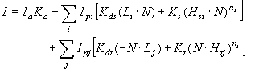
>
>   式1.gif
>
> ------
>
> - b) 反射方向上由其它物体引起的间接光照光强，由***IsKs'\*** 计算，Is通过对反射光线的递归跟踪得到
> - c) 折射方向上由其它物体引起的间接光照光强，由***ItKt'\*** 计算，It通过对折射光线的递归跟踪得到
>
> 现在我们来讨论光线跟踪算法本身。我们将对一个由两个透明球和一个非透明物体组成的场景进行光线跟踪（图3）通过这个例子，可以把光线跟踪的基本过程解释清楚。
>
> 
>
> 图3.gif
>
> 在我们的场景中，有一个点光源L，两个透明的球体O1与O2，一个不透明的物体O3。首先，从视点出发经过视屏一个像素点的视线E传播到达球体O1，与其交点为P1。从P1向光源L作一条阴影测试线S1，我们发现其间没有遮挡的物体，那么我们就用局部光照明模型计算光源对P1在其视线E的方向上的光强，作为该点的局部光强。同时我们还要跟踪该点处反射光线R1和折射光线T1，它们也对P1点的光强有贡献。在反射光线R1方向上，没有再与其他物体相交，那么就设该方向的光强为零，并结束这光线方向的跟踪。然后我们来对折射光线T1方向进行跟踪，来计算该光线的光强贡献。折射光线T1在物体O1内部传播，与O1相交于点P2，由于该点在物体内部，我们假设它的局部光强为零，同时，产生了反射光线R2和折射光线T2，在反射光线R2方向，我们可以继续递归跟踪下去计算它的光强，在这里就不再继续下去了。我们将继续对折射光线T2进行跟踪。T2与物体O3交于点P3，作P3与光源L的阴影测试线S3，没有物体遮挡，那么计算该处的局部光强，由于该物体是非透明的，那么我们可以继续跟踪反射光线R3方向的光强，结合局部光强，来得到P3处的光强。反射光线R3的跟踪与前面的过程类似，算法可以递归的进行下去。重复上面的过程，直到光线满足跟踪终止条件。这样我们就可以得到视屏上的一个象素点的光强，也就是它相应的颜色值。
>
> 上面的例子就是光线跟踪算法的基本过程，我们可以看出，光线跟踪算法实际上是光照明物理过程的近似逆过程，这一过程可以跟踪物体间的镜面反射光线和规则透射，模拟了理想表面的光的传播。
>
> 虽然在理想情况下，光线可以在物体之间进行无限的反射和折射，但是在实际的算法进行过程中，我们不可能进行无穷的光线跟踪，因而需要给出一些跟踪的终止条件。在算法应用的意义上，可以有以下的几种终止条件：
>
> - 该光线未碰到任何物体。
> - 该光线碰到了背景
> - 光线在经过许多次反射和折射以后，就会产生衰减，光线对于视点的光强贡献很小（小于某个设定值）
> - 光线反射或折射次数即跟踪深度大于一定值
>
> # Chapt3. Rasterization & RayTracing
>
> 了解了光线跟踪的原理之后，再来看一下在计算机上的实现。
>
> 光栅化渲染，简单地说，就是把大量三角形画到屏幕上。当中会采用深度缓冲(depth buffer, z-buffer)，来解决多个三角形重叠时的前后问题。三角形数目影响效能，但三角形在屏幕上的总面积才是主要瓶颈。
>
> 光线追踪，简单地说，就是从摄影机的位置，通过影像平面上的像素位置(比较正确的说法是取样(sampling)位置)，发射一束光线到场景，求光线和几何图形间最近的交点，再求该交点的著色。如果该交点的材质是反射性的，可以在该交点向反射方向继续追踪。光线追踪除了容易支持一些全局光照效果外，亦不局限于三角形作为几何图形的单位。任何几何图形，能与一束光线计算交点(intersection point)，就能支持。
>
> 
>
> 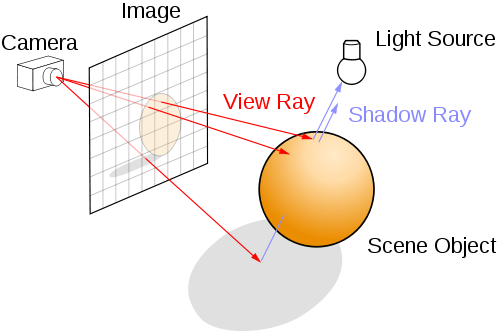
>
> 图4.png
>
> 上图显示了光线追踪的基本方式。要计算一点是否在阴影之内，也只须发射一束光线到光源，检测中间是否存在障碍物。
>
> # Chapt4. Source Code
>
> ### 1. Base Class
>
> 本例代码尝试使用基于物件(object-based)的方式编写
>
> ##### 3D Vector
>
> ```
> struct Vector {
> 
> 
> 
>     float x, y, z;
> 
> 
> 
>     Vector(float x_, float y_, float z_) : x(x_), y(y_), z(z_) {}
> 
> 
> 
>     Vector(const Vector& r) : x(r.x), y(r.y), z(r.z) {}
> 
> 
> 
>     float sqrLength() const {
> 
> 
> 
>         return x  x + y  y + z  z;
> 
> 
> 
>     }
> 
> 
> 
>     float length() const {
> 
> 
> 
>         return sqrt(sqrLength());
> 
> 
> 
>     }
> 
> 
> 
>     Vector operator+(const Vector& r) const {
> 
> 
> 
>         return Vector(x + r.x, y + r.y, z + r.z);
> 
> 
> 
>     }
> 
> 
> 
>     Vector operator-(const Vector& r) const {
> 
> 
> 
>         return Vector(x - r.x, y - r.y, z - r.z);
> 
> 
> 
>     }
> 
> 
> 
>     Vector operator(float v) const {
> 
> 
> 
>         return Vector(v  x, v  y, v  z);
> 
> 
> 
>     }
> 
> 
> 
>     Vector operator/(float v) const {
> 
> 
> 
>         float inv = 1 / v;
> 
> 
> 
>         return this  inv;
> 
> 
> 
>     }
> 
> 
> 
>     Vector normalize() const {
> 
> 
> 
>         float invlen = 1 / length();
> 
> 
> 
>         return this  invlen;
> 
> 
> 
>     }
> 
> 
> 
>     float dot(const Vector& r) const {
> 
> 
> 
>         return x  r.x + y  r.y + z  r.z;
> 
> 
> 
>     }
> 
> 
> 
>     Vector cross(const Vector& r) const {
> 
> 
> 
>         return Vector(-z  r.y + y  r.z,
> 
> 
> 
>                       z  r.x - x  r.z,
> 
> 
> 
>                       -y  r.x + x  r.y);
> 
> 
> 
>     }
> 
> 
> 
>     static Vector zero() {
> 
> 
> 
>         return Vector(0, 0, 0);
> 
> 
> 
>     }
> 
> 
> 
> };
> 
> 
> 
> inline Vector operator(float l, const Vector& r) {return r  l;}
> ```
>
> 这些类方法(如normalize、dot、cross等)，如果传回Vector对象，都会传回一个新建构的Vector。这些三维向量的功能很简单，不在此详述。
>
> Vector zero()用作常量，避免每次重新构建。值得一提，这些常量必需在prototype设定之后才能定义。
>
> ##### Ray
>
> 即为光线类，所谓光线(ray)，从一点向某方向发射也。数学上可用参数函数(parametric function)表示：
>
> 
>
> 
>
> 式2.png
>
> 当中，o即发谢起点(origin)，d为方向。在本文的例子里，都假设d为单位向量(unit vector)，因此t为距离。实现如下
>
> ```
> struct Ray {
> 
> 
> 
>     Vector origin, direction;
> 
> 
> 
>     Ray(const Vector& o, const Vector& d) : origin(o), direction(d) {}
> 
> 
> 
>     Vector getPoint(float t) const {
> 
> 
> 
>         return origin + t * direction;
> 
> 
> 
>     }
> 
> 
> 
> };
> ```
>
> ##### Sphere
>
> 球体(sphere)是其中一个最简单的立体几何图形。这里只考虑球体的表面(surface)，中心点为c、半径为r的球体表面可用等式(equation)表示：
>
> 
>
> 
>
> 式3.png
>
> 如前文所述，需要计算光线和球体的最近交点。只要把光线x = r(t)代入球体等式，把该等式求解就是交点。为简化方程，设v=o - c，则:
>
> 
>
> 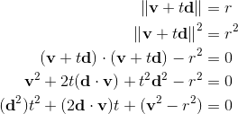
>
> 式4.png
>
> 因为d为单位向量，所以二次方的系数可以消去。 t的二次方程式的解为
>
> 
>
> 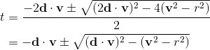
>
> 式5.png
>
> ```
> struct Sphere : public Geometry {
> 
> 
> 
>     Vector center;
> 
> 
> 
>     float radius, sqrRadius;
> 
> 
> 
>     Sphere(const Vector& c, float r, Material m = NULL) :
> 
> 
> 
>             Geometry(m), center(c), radius(r), sqrRadius(r  r) {}
> 
> 
> 
>     IntersectResult intersect(const Ray& ray) const {
> 
> 
> 
>         Vector v = ray.origin - center;
> 
> 
> 
>         float a0 = v.sqrLength() - sqrRadius;
> 
> 
> 
>         float DdotV = ray.direction.dot(v);
> 
> 
> 
>         if (DdotV <= 0.0) {
> 
> 
> 
>             float discr = DdotV * DdotV - a0;
> 
> 
> 
>             if (discr >= 0.0) {
> 
> 
> 
>                 float d = -DdotV - sqrt(discr);
> 
> 
> 
>                 Vector p = ray.getPoint(d);
> 
> 
> 
>                 Vector n = (p - center).normalize();
> 
> 
> 
>                 return IntersectResult(this, d, p, n);
> 
> 
> 
>             }
> 
> 
> 
>         }
> 
> 
> 
>         return IntersectResult();
> 
> 
> 
>     }
> ```

# 光线追踪

> 这一篇几乎是翻译。

真实感渲染(photorealistic rendering)的目标是创建出3D场景的图像(image)，且无法区分出(indistinguishable )这些电脑生成的图像与同一场景相机拍出的相片的差异。这里无法区分(indistinguishable)不是精确的度量。因为这个区分的过程会涉及到人的观察，而不同的观察者感知相同事物的能力不一样。如面对同一瀑布，有的人感受到的是“飞流直下三千尺，疑是银河落九天”，有的人感到的是“水，好多水，流下来了，轰隆隆，咚咚，声音好大”。这本书大部分情况下是通过模拟光(light)的物理特性以及光与事物的交互方式(反射、折射等)来完成渲染。

几乎所有的真实感渲染系统都是基于光线追踪算法(ray-tracing algorithm)的。光线追踪的原理实际上比较简单。它就是在追踪光线在场景中的路径以及光线和场景中物体的交互(碰撞、反射、折射、吸收等)。所有的光线追踪系统都要模拟以下事物和现象:

- Cameras: 相机模型决定了从哪里以及用怎样的方式去观察观景(游戏中的世界)，包括场景图像是怎样被记录在传感器上的。许多渲染系统都是以相机为原点发射视线(viewing ray)，射入到场景，进行追踪。
- Ray-object intersections: 必须能能够精确地判断一个给定的射线(光线或视线)与场景中的物体是否发生碰撞，以及碰撞的具体位置。也要能够确定碰撞点处场景物体的一些属性，如：法线、材质。许多光线追踪器(ray tracers)提供了用于碰撞检测的工具，尤其是一条射线可能与场景中多个物体发生碰撞时，通常要找出最近的碰撞点。
- Light sources: 没有光源，谈渲染场景毫无意义。Ray tracer要对穿过场景的光的分布(distribution)进行建模，包括光的位置，能量在空间中的分布。
- Visibility: 为了知道给定的光源(light)在表面某一点是否存储能量(deposit energy)，必须知道从这一点到光源是否有一条不间断的路径。这很容易实现：只需要构建一条从表面点到光源的射线，计算最近的ray-object相交点，比较表面点到相交点的距离和表面点到光源的距离。
- Surface scattering: 光的散射(指光通过不均匀介质时一部分光偏离原方向传播的现象，偏离原方向的光称为散射光)。每个物体必须对自己的样子(即材质，material)有一个描述，包括光怎么和该对象的表面进行交互，散射光的性质。表面散射模型通常是参数化的，这样就可以模拟各种各样的物体外观(材质)。
- Indirect light transport: 间接光的传输。因为光可能穿过表面A，或在表面B进行反射后，才到达表面C，因此需要追踪间接光，即源点在表面上的光线。其实生活中看到的大部分光都是间接光。
- Ray propagation：光线传播。我们需要知道光穿过空间时发生了什么。如果渲染真空中的一个场景，则光的能量在传播过程中保持恒定。但地球上很少有真空存在，很多情况下可以“假装”(近似)是真空。光穿过雾、烟、大气层等的的情况更为复杂。

这章节我们简略地讨论一下这些模拟任务(simulation tasks，即模拟Camera、光线、碰撞、光的传播等)。下一节讨论一条单个光线在主渲染循环(main rendering loop)中的经历的过程。也会介绍一个表面散射模型(surface scattering model)的实现(基于Turner Whitted的原始的光线追踪算法)。

### 1 Cameras

几乎每个人都使用过照相机，对它的基本功能比较熟悉：你通过按下一个按钮或者点击一下屏幕，把你想要的场景记录成一幅图像(image)，这个图像是记录在胶卷或者电子传感器上的。**针孔相机** (*pinhole camera*)是最简单地照相设备之一。针孔相机由一个遮光的箱子构成，这个箱子的一端带有一个极小的孔，如图1所示。与小孔相对的另一端上贴有一张胶卷(图中的Film)。在不遮避小孔时，光线可以从小孔进入，并撞击到照相纸上。尽管很简单，这种相机今天仍然在使用，主要用于艺术创作。为了使足够多的光线“撞击”到胶卷上，从而形成图像，需要花费较长的曝光时间。

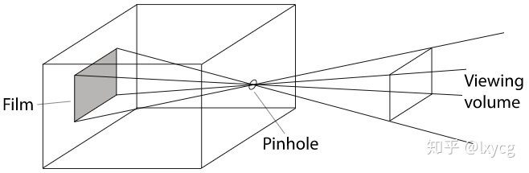图1 针孔相机示意图。

尽管大部分相机实际上比针孔相机复杂的多，但它是对相机的一种简单方便的模拟(simulation)，是往下学习的起点。相机最重要的功能是定义场景中哪些部分会被记录到图像中。从图1中，我们可以看到通过连接针孔和胶卷的边来创建一个双金字塔(a double pyramid)，其中一个金字塔是在场景中的。场景中不在此金字塔中的物体是不会被记录在胶卷中的。因为真实的相机拍摄到的形状比金字塔复杂的多，所以我们称可能被拍摄到胶卷中的空间区域为**视景体**(*viewing volume*)。

另一种思考针孔相机的方式是把胶卷放到针孔的前面，但是保持针孔和胶卷的距离相同，如图2所示。这样连接针孔和胶卷的边也同样定义了与之前相同的视景体。当然，这不是制造真实相机的方式，而是一种为了模拟相机而进行的方便的抽象。在这种把胶卷放在针孔前面的情况下，我们通常称针孔为“眼睛”(eye)。

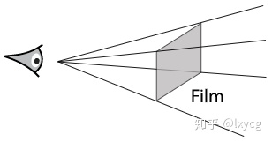图2 把胶卷放在针孔的前面的针孔相机，此时称孔就成了“眼睛”。

现在思考一个渲染的关键问题：在图像的每一个点处，相机应该记录什么颜色？回忆一下针孔相机，可以明白只有沿着针孔与胶卷上某一点所在的方向传输的光线，才能对该点处的颜色值有影响。在图2 中，在把胶卷放在眼睛前面的针孔相机中，我们在意的是沿着从图像上的点到眼睛所在的方向上传输的光线的量。

因此，我们要模拟相机的一个重要任务就是在图像上取一个点，并生成射线(rays)，沿着这些射线传输的光会决定图像上该点处的颜色值。因为一条射线由一个原点和一个方向组成，所以用针孔相机(见图 2)可以很简单地完成这个任务: 用针孔作为原点，从针孔到近平面(near plane，即胶卷)上某一点的方向，作为该点处射线的方向。对于针孔相机这种简单模型，图像上每个点只对应了一条射线。但对于更复杂的相机模型，很可能就不是这样了。比如有的相机模型涉及到多个透镜(multiple lenses)，对于图像上某一点对应的射线的计算会复杂很多，后面的章节会讲怎么实现这样的相机模型。

可以把从图像上的点计算对应射线的过程封装在相机模块中，则渲染系统剩下的任务就主要在于计算沿着这些射线的光照(lighting)。

### 2 Ray–Object Intersections

**射线和物体相交的计算**。每次相机产生一条射线，渲染器(renderer)的首要任务就是检测出该射线是否与场景中的物体相交，若相交求出第一个相交的物体及交点。交点是沿着射线的一个可见点，我们需要模拟在此点处光线与物体相交。为此，我们需要计算射线与场景中所有物体的相交情况，并找出第一个相交的物体及第一个交点。给定一个射线 ![[公式]](2020-11-25-0/equation) ，可以把它写成参数形式:

![[公式]](2020-11-25-0/equation)

这是 ![[公式]](2020-11-25-0/equation) 是射线原点， ![[公式]](2020-11-25-0/equation) 是方向向量， ![[公式]](2020-11-25-0/equation) 是参数， ![[公式]](2020-11-25-0/equation) 。给定一个![[公式]](https://www.zhihu.com/equation?tex=t)的值，由上述方程就能确定射线上的一个点。

通常，计算射线 ![[公式]](2020-11-25-0/equation) 和由隐式函数 ![[公式]](2020-11-25-0/equation) 表示的表面之间的相交情况是容易的。首先把射线的参数方程代入到表面的隐式函数中，得到一个新的方程，它只有一个参数![[公式]](https://www.zhihu.com/equation?tex=t)。然后，解这个方程，把最小的正根代入到射线参数方程中就得到想要的交点了。例如，表面是一个球心在原点、半径为![[公式]](https://www.zhihu.com/equation?tex=r)的球面，则它的隐式方程为:

![[公式]](2020-11-25-0/equation)

代入射线方程，得到:

![[公式]](2020-11-25-0/equation) 其中只有![[公式]](https://www.zhihu.com/equation?tex=t)是未知数，这是一个关于![[公式]](https://www.zhihu.com/equation?tex=t)是二次方程。若没有实根，则射线和球不相交；如果有根，则可以由最小的正根计算出交点。

光线追踪器(ray tracer)不仅需要交点，还需要交点处别的信息。它需要知道表面在交点处的某些属性。首先，交点处的材质信息需要确定，要传递给光线追踪算法的后续阶段。其次，为了对交点(也是表面上的一个点)进行着色(shade the point)，需要知道交点处的几何信息，例如，交点处的表面法线 ![[公式]](2020-11-25-0/equation) 。尽管许多光线追踪器只根据表面法线(surface normal)进行计算光照，但是更复杂的渲染系统，如本实现的**pbrt**，会使用更多的信息，如：位置(position)或表面法线相对于表面的各种局部参数的偏导数。

当然，大部分场景是由多个物体组成。计算射线与场景物体相交情况的蛮力方法：依次计算射线与场景中每个物体的相交情况，若存在相交，则解出最小的正![[公式]](https://www.zhihu.com/equation?tex=t)值，近一步解出第一个交点，同时也就知道第一个相交的物体。这个方法是正确的，但是显然效率低下。一个更好的方法是引入加速结构(acceleration structure)，它把场景中的物体划分成组，每组可以包含多个物体，它可以快速地判断出一组物体是否肯定不会和射线相交。这就快速地剔除了不相关的几何体，光线追踪(ray tracing)的时间复杂度通常为 ![[公式]](2020-11-25-0/equation) ，其中 ![[公式]](2020-11-25-0/equation) 是生成的图像中的像素数量， ![[公式]](2020-11-25-0/equation) 是场景中物体的数量。(然而，构建加速结构本身至少要花费 ![[公式]](2020-11-25-0/equation) 的时间)

### 3 Light Distribution

从上面2中的相交计算，我们可以得到光线与场景物体的交点即是进行着色的点(a point to be shaded)以及在该点处的几何信息(如：表面法线)。回想一下，我们的最终目标是计算出离开该点向着照相机的方向的光的总量。为此，我们需要知道有多少光到达了该点。这涉及到场景中光的几何和辐射分布(the *geometric* and *radiometric* distribution of light)。对于简单地光源(如：点光源)，只要知道了光源的位置，光的几何分布就很容易得到。然而，在现实世界中，不存在点光源，因此基于物理的光照通常是基于区域光源的(area light sources)。这意味着光源本身就是一个表面发光的几何体。但是，本节我们先用点光源来说明一下光的辐射分布部分，后面章节中会讨论严格的光的度量和分布。

我们通常想知道交点周围极小区域上存储的光能(light power)总量，如图3所示。设想有一个点光源，它的光能为 ![[公式]](2020-11-25-0/equation) ，它向所有方向均匀的辐射光能。这意味着以光源为中心的单位球上单位面积上的光能为 ![[公式]](2020-11-25-0/equation) 。

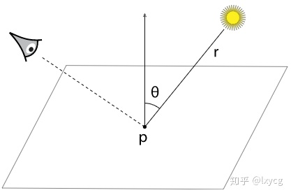图3 点光源。光源到着色点的距离为r

如果考虑两个球，如图4所示。很显然，大球上单位面积上的光能总量要小于小球单位面积上的光能总量，因为同一个光源的相同总量的光能分布到了更大的面积上。特别地，半径为 ![[公式]](https://www.zhihu.com/equation?tex=r) 的球上单位面积的光能与 ![[公式]](2020-11-25-0/equation) 成正比。

图4 同一光源的光能在两个同心但半径不同的球上的分布

此外，可以发现：一个极小面片 ![[公式]](2020-11-25-0/equation) 与光线不垂直时，即![[公式]](https://www.zhihu.com/equation?tex=dA)的法线与光线的夹角为 ![[公式]](2020-11-25-0/equation) ，则辐射到该面片上的光能与 ![[公式]](2020-11-25-0/equation) 成正比。总结起来就是，单位面积上的微分光能(即微分光照强度) ![[公式]](2020-11-25-0/equation) 为:

![[公式]](2020-11-25-0/equation)

> ![[公式]](2020-11-25-0/equation)相当于利用微分思想(无限小的思想)，求得的每个着色点的光能总量

熟悉图形学中基本光照的同学会注意到，上述方程编码了两个定律：倾斜平面的余弦衰减和距离的平方衰减。

### 4 Visibility

前面描述的光照分布忽略了非常重要的一部分：阴影。一个光源要想对着色点(即光线与表面的交点)的光照产生贡献(或影响)，则从该点到光源的位置的路径上没有任何障碍遮挡光线，如图5所示。

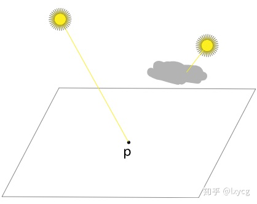图5 左上角的光源会照到点p，右上角的光源不会照到点p

幸运地是，光线追踪器很容易判断一个光源在一个着色点处是否可见。我们只需要构建一条新的射线，其原点为表面上的点(即着色点)，方向为从表面点指向光源。这种特殊的射线称为阴影射线(*shadow rays*)。我们可以跟踪这条射线从着色点穿过场景到达光源，判断在这中间射线是否与别的物体发生了相交(通过比较相交点的 ![[公式]](https://www.zhihu.com/equation?tex=t) 值与光源处的![[公式]](https://www.zhihu.com/equation?tex=t)关系判断)。如果在这中间没有障碍物，则该光源为影响到该点的着色。

### 5 Surface Scattering

关于着色(shading)，我们现在能够计算出两条信息：着色点的位置(location)和入射光(incident lighting)。现在我们需要决定入射光在表面是如何散射的(*scattered*)。特别地，我们需要计算沿着最初寻找交点的射线返回(最初的射线是从相机到交点，沿着其返回，相当于就是对方向取返)的散射的光能感兴趣，因为这条射线会到达相机(相当于眼睛/视点)，这对最终图像的形成有影响或贡献。如图6所示。

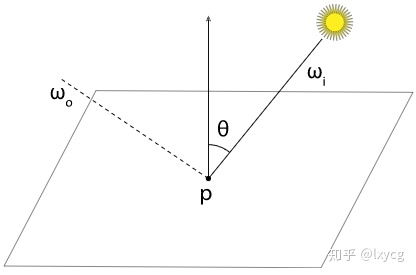图6 入射光沿着wi与表面相交于点p，散射光沿着方向wo返回到相机。返回到相机的散射光的总量由入射光能和BRDF的积给出。

> 这里只用到了直接光，后面会说间接光

场景中的每一个物体有一个材质(*material*)，它是物体表面上每个点的外观描述(a description of its appearance properties)。而这个描述(description)由双向反射率分布函数(*bidirectional reflectance distribution function*, BRDF)给出。这个函数(即BRDF)告诉方向为 ![[公式]](2020-11-25-0/equation) 的入射光有多少能量被反射到了出射方向 ![[公式]](2020-11-25-0/equation) 。我们把在点 ![[公式]](2020-11-25-0/equation) 处的BRDF写作 ![[公式]](2020-11-25-0/equation) 。现在，计算朝着相机返回的散射光的总量就很直白了：

```cpp
for each light:
    if light is not blocked:
        incident_light = light.L(point)
        amount_reflected = 
            surface.BRDF(hit_point, camera_vector, light_vector)
        L += amount_reflected * incident_light
```

这里用符号 ![[公式]](2020-11-25-0/equation) 表示光(the light)，和之前提过的光的测量单位 ![[公式]](2020-11-25-0/equation) 不同。![[公式]](https://www.zhihu.com/equation?tex=L)表示辐射率(*radiance*)，一种测量光的单位，后面会说到。

很容易把BRDF推广到透射光(transmitted light)，得到BTDF，或者推广到通用的从表面的任意一面达到的光的散射。一个描述通用的散射的函数被称为双向散射分布函数(*bidirectional scattering distribution function*, BSDF)。pbrt支持各种BSDF模型，后面讨论。更复杂的是双向散射表面反射率分布函数(*bidirectional scattering surface reflectance distribution function*, BSSRDF)，它模拟了光在表面上出射点和入射点不同的情况，后面章节会讨论到。

> 总结：
> BRDF: Bidirectional Reflectance Distribution Function，双向反射率反布函数
> BTDF: (transmitted light?)，双向透射分布函数
> BSDF: Bidirectional Scattering Distribution Function，双向散射分布函数
> BSSRDF: Bidirectional Scattering Surface Reflectance Distribution Function，双向散射表面反射率分布函数

### 6 Indirect Light Transport

间接光的传输。Turner Whitted的关于光线追踪的[原始论文](https://link.zhihu.com/?target=https%3A//www.cs.drexel.edu/~david/Classes/CS586/Papers/p343-whitted.pdf)强调了其递归性质(*recursive* nature)，这使得在渲染的图像中包含间接的镜面反射和透射(indirect specular reflection and transmission)成为可能。例如，如果一条从相机发出的射线撞击到一个光滑的物体，如：镜子，我们可以根据交点处的法线信息，计算出该射线反射后的方向，然后沿着这个方向(即构建一条新的射线，以该交点为原点，以这个反射方向为射线方向)递归调用光线追踪程序，来找到到达镜面上该点的光，然后添加它对原始的相机射线的贡献(contribution，指光的颜色等信息)。注意，这个过程提到的射线的方向和现实世界中光的传输路径恰恰相反。相同的技术可以用于追踪透射射线(即折射光线)，即与透明物体相交的射线。在很长一段时间里，大部分早期的光线追踪例子展示了镜子和玻璃球的渲染结果(如图7)，因为这两种类型的渲染效果在别的渲染技术(如光栅化)中实现起来是困难的。

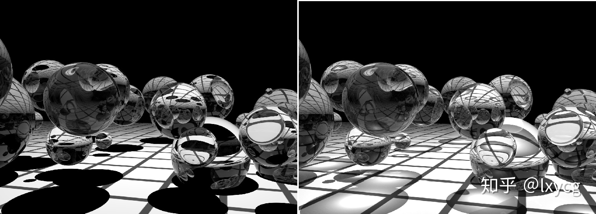图7 一个早期典型的光线追踪场景。

在图7中，注意场景使用了镜面材质和玻璃材质的物体，强调了光线追踪算法处理这种表面的能力。左图是用Whitted光线追踪算法渲染的结果。右图是使用随机渐近光子映射，stochastic progressive photon mapping (SPPM)渲染的结果。SPPM后面章节会遇到，能够准确地模拟光穿过玻璃球后的聚焦现象。

通常，从表面上一点到达相机的光的总量由物体本身发出的光(如果本身就是光源的话)与其反射的光的总量的和组成。这一思想的正式称呼为光线传输方程(*light transport equation*)，也称为**渲染方程**(*rendering equation*)，即：

![[公式]](2020-11-25-0/equation)

其中， ![[公式]](2020-11-25-0/equation) 是点 ![[公式]](2020-11-25-0/equation) 处沿着方向 ![[公式]](2020-11-25-0/equation) 射出的光能， ![[公式]](2020-11-25-0/equation) 是该点处物体本身发出的光能，而最后的积分项是来自以![[公式]](https://www.zhihu.com/equation?tex=p)点为球心的球 ![[公式]](2020-11-25-0/equation) 上各个方向的入射光的光能 ![[公式]](2020-11-25-0/equation) 乘以BSDF ![[公式]](2020-11-25-0/equation) 以及一个余弦项。

关于渲染方程，后面会有更完整的推导。求这个方程中积分项的解析解通常是不可能的(除了一些非常简单的场景)，因此我们要么对之做简化，要么使用数值积分方法。

Whitted的方法简化了这个积分项，它忽略了大部分方向的入射光，仅仅为来自光源方向的光、发生完全反射和发生完全折射的入射光计算光能 ![[公式]](2020-11-25-0/equation) 。换句话说，它把积分转换为了在几个少数方向上的和。

Whitted的方法可进行扩展以得到除了镜面、玻璃之外更多的效果。例如，通过追踪许多接近镜面反射方向的递归射线，然后对它们的贡献进行平均，我们可以得到一种光泽反射([glossy reflection](https://link.zhihu.com/?target=https%3A//computergraphics.stackexchange.com/questions/5482/what-is-the-difference-between-glossy-and-specular-reflection))的近似。实际上，一条射线无论何时碰撞到一个物体，我们都可以一直递归地追踪这条射线。例如，我们可以随机地选择一个反射方向 ![[公式]](2020-11-25-0/equation) ，并且通过计算新生成射线的BSDF ![[公式]](2020-11-25-0/equation) 对其贡献施加权重。这个简单但强大的思想可以形成许多真实的图像，因为它捕获了物体间所有光的相互反射。当然，我们也需要知道什么时候终止递归，并且要注意到完全随机地选择方向可能使得渲染算法收敛于一个合理结果的速度很慢。后面章节会谈到这些问题 的解决方案。

当我们以这种方式追踪射线时，实际上我们给每一个图像位置(image location，即像素点)关联了一棵射线树(a tree of rays)，见图8，其中从照相机发出的射线是根结点。树中的每一条射线都有一个权重，这就使得我们能够模拟一些效果，比如不能100%反射的闪亮表面(shiny surfaces)。

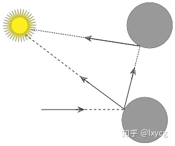图8 递归地光线追踪给每一个图像位置关联了一整棵射线树。

> stochastic progressive photon mapping: SPPM

### 7 Ray Propagation

光线传播。到目前为止，所有的讨论都是假设光线是在真空中传输的。例如，当讨论一个点光源的光的分布时，我们假设光能在以光源为球心的球面上均匀地分布，并且在传输过程中没有衰减。但是真实世界中传递介质(烟、雾、灰尘等)的存在，使得这种假设是无效的。模拟这些效果是很重要的，即使我们不打算渲染一个充满烟雾的房间，但实际上几乎所有户外场景本质上也会受到传递介质的影响。例如，地球的大气层导致远处的物体看起来不那么饱和(to appear less saturated )，如图9所示。

图9 大气层随着距离降低饱和度。左图没有考虑大气层的影响，右图渲染加入了大气层的影响。

传递介质有两种方法可以影响光沿着射线的传播。首先，传递介质可以衰减该射线上传播的光，甚至使光消失。这是通过吸收光或者把光散射到别的方向上来实现的。我们可以通过计算射线原点和交点之间的透射比(*transmittance*) ![[公式]](2020-11-25-0/equation) 来捕捉这一效果。透射比告诉我们有多少在交点处被散射的光返回到射线原点了。

一个传递介质也可能增加沿着一条射线传输的光。这种情况发生在：传递介质本身会发光或传递介质把别的方向的光散射到该射线的方向上了，如图10。我们可以通过计算体积光传输方程，*volume light transport equation*，来找到传递介质产生的光能的量(quantity)。后面会讨论这些。目前，我们勉强可以计算传递介质的影响并把它添加到沿射线传输的光中了。

图10 聚光灯穿过雾照射在球上。注意由于传递介质的影响，聚光灯的光照分布和球的阴影都清晰可见。

参考原文: [Photorealistic Rendering and the Ray-Tracing Algorithm](https://link.zhihu.com/?target=http%3A//www.pbr-book.org/3ed-2018/Introduction/Photorealistic_Rendering_and_the_Ray-Tracing_Algorithm.html)