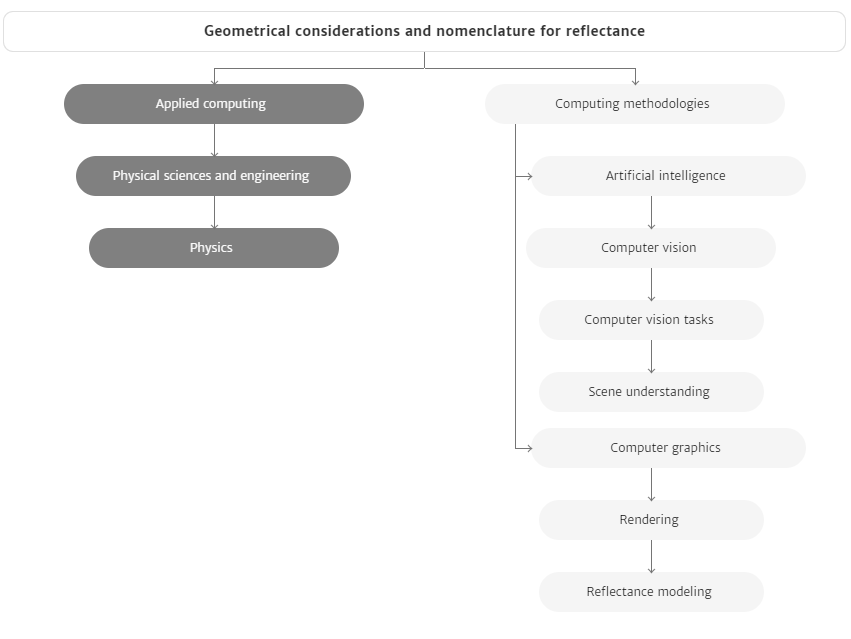
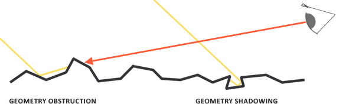
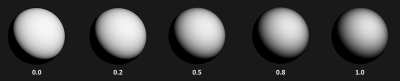
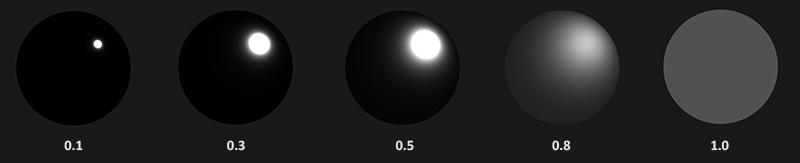

## BRDF 图书 Geometric Considerations and Nomenclature for Reflectance

rtr4 1277项参考

1. Nicodemus, F. E., J. C. Richmond, J. J. Hsia, I. W. Ginsberg, and T. Limperis, "Geometric Considerations and Nomenclature for Reflectance," National Bureau of Standards (US), Oct. 1977.
   https://www.gpo.gov/fdsys/pkg/GOVPUB-C13-80bc81d1913dfe186083080cbdc8ae75/content-detail.html

下载

https://graphics.stanford.edu/courses/cs448-05-winter/papers/nicodemus-brdf-nist.pdf

#  Phong model

# 各种物质实数折射率数值的查询汇总表

https://pixelandpoly.com/ior.html

# 麦克斯韦方程组（Maxwell’s equations）

# 微平面理论（Microfacet Theory）

- 能量守恒 （Energy Conservation）
- 菲涅尔反射（Fresnel Reflectance）
  *万物皆有菲涅尔反射，F0 是0度角入射的菲涅尔反射值，大多数非金属的 F0 范围是0.02~0.04，大多数金属的 F0 范围是0.7~1.0。*
- 线性空间（Linear Space）
- 色调映射（Tone Mapping）
- 物质的光学特性（Substance Optical Properties）
  *非金属具有单色/灰色镜面反射颜色，金属具有彩色的镜面反射颜色，即非金属的 F0 是一个 float。而金属的 F0 是一个 float3。*

# pbrt 文章

专栏 

https://www.zhihu.com/column/c_1101889687467159552

浅墨

https://blog.csdn.net/poem_qianmo/category_8558707.html

# BRDFs

# PBR 方程

$$
L_{o}\left(p, w_{o}\right)=\int_{\Omega}\left(k_{d} \frac{c}{\pi}+k_{s} \frac{D G F}{4\left(w_{o} \cdot n\right)\left(w_{i} \cdot n\right)}\right) L_{i}\left(p, w_{i}\right)\left(w_{i} \cdot n\right) d w_{i}
$$

简化 
$$
L_{o}\left(p, w_{o}\right)=\int_{\Omega}\left(k_{d} \frac{c}{\pi}+\frac{D G F}{4\left(w_{o} \cdot n\right)\left(w_{i} \cdot n\right)}\right) L_{i}\left(p, w_{i}\right)\left(w_{i} \cdot n\right) d w_{i}
$$

# 菲涅尔方程：Fresnel equation

$$
F=\operatorname{lerp}\left((1-(n \cdot v))^{5}, 1, F_{0}\right)
$$

# 图片

# BlinnPhong

# 正态分布函数 Normal Distribution Function

# Cook-Torrance的BRDF光照公式

# 微平面

# 辐射度

# Ray_casting

https://en.wikipedia.org/wiki/Ray_casting

https://www.google.com.hk/search?newwindow=1&safe=strict&ei=SJS7X4HNArLdmAXoo4v4Dg&q=ray+cast&oq=ray+cast&gs_lcp=CgZwc3ktYWIQAzICCAAyAggAMgQIABAKMgIIADICCAAyAggAMgIIADIGCAAQDBAKMgYIABAMEAoyAggAOgYIABAHEB46CAgAEAcQChAeOgQIABAMUL4bWPmNAWDClgFoAnAAeACAAa0CiAHyGpIBCDAuMTQuMy4xmAEAoAEBqgEHZ3dzLXdperABAMABAQ&sclient=psy-ab&ved=0ahUKEwiBkeHav5jtAhWyLqYKHejRAu8Q4dUDCA0&uact=5 | ray cast - Google 搜索
https://en.wikipedia.org/wiki/Ray_casting | Ray casting - Wikipedia
https://raycast.com/ | Raycast
https://github.com/search?q=ray+cast&ref=opensearch | Search · ray cast
https://github.com/bozorgi/VTKMultiVolumeRayCaster | bozorgi/VTKMultiVolumeRayCaster: A multi-volume ray casting within VTK
https://github.com/alecjacobson/computer-graphics-ray-casting | alecjacobson/computer-graphics-ray-casting: Computer Graphics Assignment about Ray Casting
https://github.com/RolandR/VolumeRayCasting | RolandR/VolumeRayCasting: Volume rendering in the browser, using volume ray casting implemented in WebGL 2.
https://github.com/permadi-com/ray-cast | permadi-com/ray-cast: Ray casting tutorial demos

# cmake 记录

https://cmake.org/pipermail/cmake/2008-February/020114.html

# cmake options

# cmake 工具箱

https://github.com/inviwo/inviwo/blob/master/cmake/globalmacros.cmake

# ssa/ass字幕格式

# SmallPT —— 99 行代码光线追踪

https://github.com/munificent/smallpt

# Cmake 宏

# 物理引擎

https://yangwc.com/2020/06/24/MassSpring/

# 博客

https://www.zhihu.com/people/lxyhpp/posts

https://yangwc.com/

# 英伟达光线追踪

https://www.sohu.com/a/416345719_115386 | 原来英伟达光线追踪是这样实现的！_光栅
https://www.gcores.com/articles/120970 | 实时光线追踪技术：业界发展近况与未来的挑战 | 机核 GCORES
https://www.jianshu.com/p/0375389e6a3e | 光线跟踪(RayTracing)原理及c++实现 - 简书
https://huailiang.github.io/blog/2020/ray/ | 光线追踪-引擎
https://blog.csdn.net/qq_38275140/article/details/90345582 | (17条消息) 路径追踪03 相交性检测_贤愚的博客-CSDN博客
https://www.ifanr.com/1252208 | 说了一整年的光线追踪技术，对游戏世界的影响才刚刚开始 | 爱范儿
https://www.eet-china.com/mp/a16887.html | 什么是光线追踪？看这一篇就够了！-面包板社区
https://zhuanlan.zhihu.com/p/35745255 | 解密NVIDIA光线追踪技术 - 知乎
https://zhuanlan.zhihu.com/p/41269520 | 一篇光线追踪的入门 - 知乎
https://www.zhihu.com/question/26683585 | 如何理解 (un)biased render？ - 知乎
https://developer.nvidia.com/zh-cn/rtx/raytracing | NVIDIA RTX 光线追踪 | NVIDIA Developer
https://zh.wikipedia.org/zh-hans/%E5%85%89%E7%B7%9A%E8%BF%BD%E8%B9%A4 | 光线追踪 - 维基百科，自由的百科全书

# cmake 选择 win10 sdk 版本

# BRDF

# 光线追踪 记录

https://www.google.com.hk/search?q=%E5%85%89%E7%BA%BF%E8%BF%BD%E8%B8%AA%E5%99%A8&oq=%E5%85%89%E7%BA%BF%E8%BF%BD%E8%B8%AA%E5%99%A8&aqs=chrome..69i57j0l6j69i65.4221j0j1&sourceid=chrome&ie=UTF-8 | 光线追踪器 - Google 搜索
https://www.bilibili.com/video/av53611161/ | UP主竟用c++自己写了一个光线追踪渲染器？_哔哩哔哩 (゜-゜)つロ 干杯~-bilibili
https://github.com/ArkNoya/Dimension-Faker-RayTracing | ArkNoya/Dimension-Faker-RayTracing: RayTracing Program use C++
https://www.qiujiawei.com/raytrace/ | 实现了一个C++11 Based的光线追踪渲染器demo – Wyman的原创技术博客 – 恭喜你发现我的小站，撩我请加QQ：234707482、Wechat：_Wyman
https://github.com/wangzhaode/RayTracing | wangzhaode/RayTracing: C++ 实现的光线追踪器
https://blog.csdn.net/qjh5606/article/details/89221918 | (17条消息) 图形学基础 | 一个简单光线追踪渲染器_[黑键]-CSDN博客
https://www.jianshu.com/p/0375389e6a3e | 光线跟踪(RayTracing)原理及c++实现 - 简书
https://zhuanlan.zhihu.com/p/36249555 | 一个玩具光线追踪渲染器 - 知乎
https://zhuanlan.zhihu.com/p/257433698 | 基本的光线追踪器 - 知乎
https://zhuanlan.zhihu.com/p/112814641 | 光线追踪渲染器（一） - 知乎
https://zhuanlan.zhihu.com/p/41269520 | 一篇光线追踪的入门 - 知乎
https://zh.wikipedia.org/zh-hans/%E5%85%89%E7%B7%9A%E8%BF%BD%E8%B9%A4 | 光线追踪 - 维基百科，自由的百科全书
https://yangwc.com/2019/05/08/RayTracer-Basis/ | 光线追踪器Ray Tracer：入门篇 | YangWC's Blog
https://www.amazon.com/Ray-Tracing-Weekend-Minibooks-Book-ebook/dp/B01B5AODD8/ref=sr_1_1?ie=UTF8&qid=1547695669&sr=8-1&keywords=Peter+Shirley | Amazon.com: Ray Tracing in One Weekend (Ray Tracing Minibooks Book 1) eBook: Shirley, Peter: Kindle Store