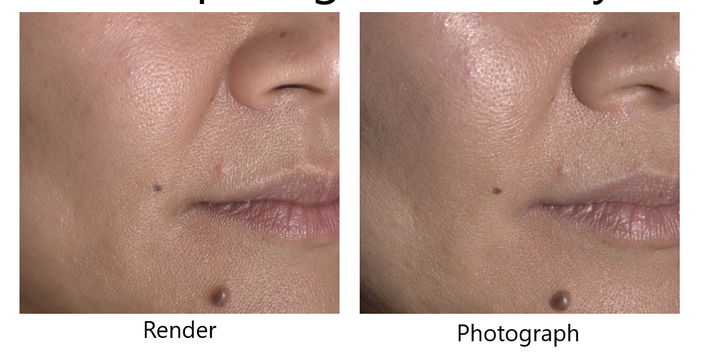

# 人物角色的建模及渲染

E:\百度云下载\图形学电子书\character

Next-Generation-Character-Rendering-v6.pptx

# 概率论笔记

# 软件渲染

https://www.google.com.hk/search?q=%E8%BD%AF%E4%BB%B6%E6%B8%B2%E6%9F%93%E5%BC%95%E6%93%8E&oq=%E8%BD%AF%E4%BB%B6%E6%B8%B2%E6%9F%93%E5%BC%95%E6%93%8E&aqs=chrome.0.69i59.3301j0j1&sourceid=chrome&ie=UTF-8 | 软件渲染引擎 - Google 搜索
https://www.sketchupvray.com/7285.html | SketchUp不被知道的5个最佳渲染软件 - SketchUp自学
https://arenas0.com/2018/02/15/Learn_3D_Engine_1/ | 一步一步学3D引擎 -- (1) 软件光栅化渲染器 - One Man With Dream
https://github.com/skywind3000/mini3d | skywind3000/mini3d: 3D Software Renderer in 700 Lines !! (700 行代码的 3D 软件渲染器)
https://github.com/skywind3000/mini3d/blob/master/mini3d.c | mini3d/mini3d.c at master · skywind3000/mini3d
http://www.songho.ca/opengl/gl_fbo.html | OpenGL Frame Buffer Object (FBO)
https://github.com/zpzsoft/SoftRaster | zpzsoft/SoftRaster
http://www.sunshine2k.de/coding/java/TriangleRasterization/TriangleRasterization.html | Software Rasterization Algorithms for filling triangles
https://www.cnblogs.com/gamesky/archive/2012/08/21/2648623.html | Bresenham快速画直线算法 - 冷夜 - 网游编程技术 - 博客园
https://docs.microsoft.com/zh-cn/windows/win32/direct3d9/transforms?redirectedfrom=MSDN | Transforms (Direct3D 9) - Win32 apps | Microsoft Docs

# 记录 物理BRDF  相关

https://www.sciencedirect.com/science/article/pii/S0263224113003072 | Measurement and modeling of Bidirectional Reflectance Distribution Function (BRDF) on material surface - ScienceDirect
https://web.cs.wpi.edu/~emmanuel/courses/cs563/write_ups/chuckm/chuckm_BRDFs_overview.html | Bi-Directional Reflection Distribution Functions - Chuck Moidel
https://zh.wikipedia.org/wiki/%E8%8F%B2%E6%B6%85%E8%80%B3%E6%96%B9%E7%A8%8B | 菲涅耳方程 - 维基百科，自由的百科全书
https://zh.wikipedia.org/wiki/%E5%81%8F%E6%8C%AF | 偏振 - 维基百科，自由的百科全书
https://www.cs.cmu.edu/afs/cs/academic/class/15462-f09/www/lec/lec8.pdf | PowerPoint Presentation
https://www.cs.cmu.edu/afs/cs/academic/class/15462-f09/www/lec/lec8.pdf | https://www.cs.cmu.edu/afs/cs/academic/class/15462-f09/www/lec/lec8.pdf
https://www.cs.princeton.edu/~smr/cs348c-97/surveypaper.html | A Survey of BRDF Representation for Computer Graphics
https://www.umb.edu/spectralmass/terra_aqua_modis/modis | Professor Crystal Schaaf's Lab | MODIS Research | BRDF Explained - University of Massachusetts Boston
https://math.nist.gov/~FHunt/appearance/brdf.html | BRDF
https://zh.wikipedia.org/zh-hans/%E9%9B%99%E5%90%91%E5%8F%8D%E5%B0%84%E5%88%86%E4%BD%88%E5%87%BD%E6%95%B8 | 双向反射分布函数 - 维基百科，自由的百科全书
https://en.wikipedia.org/wiki/Bidirectional_reflectance_distribution_function#cite_note-nicodemus_1965-1 | Bidirectional reflectance distribution function - Wikipedia
https://www.osapublishing.org/ao/abstract.cfm?uri=ao-4-7-767 | OSA | Directional Reflectance and Emissivity of an Opaque Surface
https://en.wikipedia.org/wiki/Bibcode | Bibcode - Wikipedia
https://ui.adsabs.harvard.edu/abs/1965ApOpt...4..767N/abstract | Directional reflectance and emissivity of an opaque surface - NASA/ADS
http://www.realtimerendering.com/
http://www.realtimerendering.com/refs.html | Real-Time Rendering Bibliography - 4th Edition
https://www.cs.utah.edu/~premoze/dbrdf | Page not found | School of Computing
https://www.govinfo.gov/app/details/GOVPUB-C13-80bc81d1913dfe186083080cbdc8ae75 | Geometrical considerations and nomenclature for reflectance - Content Details - GOVPUB-C13-80bc81d1913dfe186083080cbdc8ae75
https://www.google.com.hk/search?q=Geometrical%20considerations%20and%20nomenclature%20for%20reflectance | Geometrical considerations and nomenclature for reflectance - Google 搜索
https://dl.acm.org/doi/10.5555/136913.136929 | Geometrical considerations and nomenclature for reflectance | Radiometry
https://graphics.stanford.edu/courses/cs448-05-winter/papers/nicodemus-brdf-nist.pdf | nicodemus-brdf-nist.pdf

# PBR

# BRDF 论文

https://www.cs.princeton.edu/~smr/cs348c-97/surveypaper.html

https://math.nist.gov/~FHunt/appearance/brdf.html

# BRDF 图片

# BRDF 记录

https://scope-model.readthedocs.io/en/latest/my_proposal/brdf.html

# 蒙特卡洛方法

https://zhuanlan.zhihu.com/p/61611088 | Monte Carlo数学原理 - 知乎
https://www.google.com.hk/search?q=%E8%92%99%E7%89%B9%E5%8D%A1%E6%B4%9B&oq=%E8%92%99%E7%89%B9%E5%8D%A1%E6%B4%9B&aqs=chrome..69i57j69i59j0l4j69i60j69i61.3777j0j1&sourceid=chrome&ie=UTF-8 | 蒙特卡洛 - Google 搜索
https://patents.google.com/patent/CN102831321B/zh | CN102831321B - 一种基于蒙特卡洛方法的风电场风险评估方法 - Google Patents
http://www.ruanyifeng.com/blog/2015/07/monte-carlo-method.html | 蒙特卡罗方法入门 - 阮一峰的网络日志
https://blog.csdn.net/bitcarmanlee/article/details/82716641 | (17条消息) 小白都能看懂的蒙特卡洛方法以及python实现_bitcarmanlee的博客-CSDN博客_蒙特卡洛
https://baike.baidu.com/item/%E8%92%99%E7%89%B9%C2%B7%E5%8D%A1%E7%BD%97%E6%96%B9%E6%B3%95/8664362?fromtitle=%E8%92%99%E7%89%B9%E5%8D%A1%E6%B4%9B%E6%B3%95&fromid=2056487 | 蒙特·卡罗方法_百度百科
https://zh.wikipedia.org/zh/%E8%92%99%E5%9C%B0%E5%8D%A1%E7%BE%85%E6%96%B9%E6%B3%95 | 蒙地卡羅方法 - 维基百科，自由的百科全书

https://www.google.com.hk/search?q=%E8%92%99%E7%89%B9%E5%8D%A1%E6%B4%9B%E7%A7%AF%E5%88%86&oq=%E8%92%99%E7%89%B9%E5%8D%A1%E6%B4%9B%E7%A7%AF%E5%88%86&aqs=chrome..69i57j0l2.8979j0j1&sourceid=chrome&ie=UTF-8 | 蒙特卡洛积分 - Google 搜索
https://www.jianshu.com/p/3d30070932a8 | 随机模拟-Monte Carlo积分及采样（详述直接采样、接受-拒绝采样、重要性采样） - 简书
https://blog.csdn.net/ACM_hades/article/details/104643999 | (17条消息) 蒙特卡洛积分和重要性采样(Importance Sampling)_ACM_hades的博客-CSDN博客
https://blog.csdn.net/baimafujinji/article/details/53869358 | (17条消息) 蒙特卡洛（Monte Carlo）法求定积分_白马负金羁-CSDN博客_蒙特卡洛积分
https://blog.csdn.net/weixin_41503009/article/details/107853383 | (17条消息) 蒙特卡洛法求积分_少年吉的博客-CSDN博客
https://blog.csdn.net/baimafujinji | (17条消息) 白马负金羁_CSDN博客-数据结构与算法,深入理解数字图像处理,机器学习之道领域博主
https://000ddd00dd0d.github.io/2019/04/09/Monte-Carlo-Integration/ | 蒙特卡洛积分 Monte Carlo Integration | 000ddd00dd0d
https://zh.wikipedia.org/zh/%E8%92%99%E5%9C%B0%E5%8D%A1%E7%BE%85%E6%96%B9%E6%B3%95 | 蒙地卡羅方法 - 维基百科，自由的百科全书
https://www.cnblogs.com/time-flow1024/p/10094293.html | 蒙特卡洛积分与重要性采样详解 - 烈日行者 - 博客园
https://cosx.org/2010/03/monte-carlo-method-to-compute-integration/ | 蒙特卡洛方法与定积分计算 | 统计之都
http://www.twistedwg.com/2018/05/29/MC-integral.html | 蒙特卡洛（Monte Carlo）法求定积分 | TwistedW's Home
https://www.qiujiawei.com/monte-carlo/ | 蒙特·卡罗(Monte Carlo)积分详解 – Wyman的原创技术博客 – 恭喜你发现我的小站，撩我请加QQ：234707482、Wechat：_Wyman
https://en.wikipedia.org/wiki/Law_of_the_unconscious_statistician | Law of the unconscious statistician - Wikipedia
https://www.scratchapixel.com/lessons/mathematics-physics-for-computer-graphics/monte-carlo-methods-in-practice/monte-carlo-integration | Monte Carlo Methods in Practice (Monte Carlo Integration)
https://zhuanlan.zhihu.com/p/146144853 | 蒙特卡洛积分 - 知乎
https://www.google.com.hk/search?q=%E6%A6%82%E7%8E%87%E5%AF%86%E5%BA%A6%E5%87%BD%E6%95%B0 | 概率密度函数 - Google 搜索
https://www.scratchapixel.com/ | Scratchapixel
https://zhuanlan.zhihu.com/p/61611088 | Monte Carlo数学原理 - 知乎

https://zhuanlan.zhihu.com/p/61611088 | Monte Carlo数学原理 - 知乎
https://www.google.com.hk/search?q=%E8%92%99%E7%89%B9%E5%8D%A1%E6%B4%9B&oq=%E8%92%99%E7%89%B9%E5%8D%A1%E6%B4%9B&aqs=chrome..69i57j69i59j0l4j69i60j69i61.3777j0j1&sourceid=chrome&ie=UTF-8 | 蒙特卡洛 - Google 搜索
https://patents.google.com/patent/CN102831321B/zh | CN102831321B - 一种基于蒙特卡洛方法的风电场风险评估方法 - Google Patents
http://www.ruanyifeng.com/blog/2015/07/monte-carlo-method.html | 蒙特卡罗方法入门 - 阮一峰的网络日志
https://blog.csdn.net/bitcarmanlee/article/details/82716641 | (17条消息) 小白都能看懂的蒙特卡洛方法以及python实现_bitcarmanlee的博客-CSDN博客_蒙特卡洛
https://baike.baidu.com/item/%E8%92%99%E7%89%B9%C2%B7%E5%8D%A1%E7%BD%97%E6%96%B9%E6%B3%95/8664362?fromtitle=%E8%92%99%E7%89%B9%E5%8D%A1%E6%B4%9B%E6%B3%95&fromid=2056487 | 蒙特·卡罗方法_百度百科
https://zh.wikipedia.org/zh/%E8%92%99%E5%9C%B0%E5%8D%A1%E7%BE%85%E6%96%B9%E6%B3%95 | 蒙地卡羅方法 - 维基百科，自由的百科全书

https://www.sciencedirect.com/topics/medicine-and-dentistry/monte-carlo-method | Monte Carlo Method - an overview | ScienceDirect Topics
https://www.sciencedirect.com/topics/medicine-and-dentistry/monte-carlo-method | Monte Carlo Method - an overview | ScienceDirect Topics
https://www.sciencedirect.com/topics/neuroscience/monte-carlo-method | Monte Carlo Method - an overview | ScienceDirect Topics
https://www.ibm.com/cloud/learn/monte-carlo-simulation | What is Monte Carlo Simulation? | IBM
https://www.unige.ch/sciences/astro/files/2713/8971/4086/3_Paltani_MonteCarlo.pdf | Monte Carlo Methods
https://towardsdatascience.com/an-overview-of-monte-carlo-methods-675384eb1694 | An Overview of Monte Carlo Methods | by Christopher Pease | Towards Data Science
chrome-extension://jlgkpaicikihijadgifklkbpdajbkhjo/options.html | 设置
https://www.investopedia.com/terms/m/montecarlosimulation.asp | Monte Carlo Simulation Definition
https://www.palisade.com/risk/monte_carlo_simulation.asp | Monte Carlo Simulation: What Is It and How Does It Work? - Palisade
https://zh.wikipedia.org/wiki/%E8%92%99%E5%9C%B0%E5%8D%A1%E7%BE%85%E6%96%B9%E6%B3%95#%E5%8F%82%E8%A7%81 | 蒙特卡罗方法 - 维基百科，自由的百科全书
https://www.google.com.hk/search?q=Rubinstein,%20R.%20Y.;%20Kroese,%20D.%20P.%20Simulation%20and%20the%20Monte%20Carlo%20Method%202nd. | Rubinstein, R. Y.; Kroese, D. P. Simulation and the Monte Carlo Method 2nd. - Google 搜索
https://www.amazon.com/Simulation-Monte-Method-Reuven-Rubinstein/dp/0470177942 | Amazon.com: Simulation and the Monte Carlo Method (9780470177945): Rubinstein, Reuven Y., Kroese, Dirk P.: Books
https://proceedings.neurips.cc//papers/files/nips23/NIPS2010_0740.pdf | Server Error (500)
https://zh.wikipedia.org/wiki/Special:%E7%BD%91%E7%BB%9C%E4%B9%A6%E6%BA%90?isbn=978-0-470-17793-8 | 网络书源 - 维基百科，自由的百科全书
https://web.archive.org/web/20140909230946/http://library.lanl.gov/cgi-bin/getfile?15-13.pdf | Wayback Machine
https://zh.wikipedia.org/wiki/Special:%E7%BD%91%E7%BB%9C%E4%B9%A6%E6%BA%90/0-387-54369-4 | 网络书源 - 维基百科，自由的百科全书
https://library.lanl.gov/cgi-bin/getfile?00326886.pdf | 1.0
https://web.archive.org/web/20170702204928/http://library.lanl.gov/cgi-bin/getfile?00326886.pdf | Wayback Machine
https://en.wikipedia.org/wiki/Monte_Carlo | Monte Carlo - Wikipedia
https://en.wikipedia.org/wiki/Monte_Carlo_method | Monte Carlo method - Wikipedia

# 立体角 记录

https://www.google.com.hk/search?q=%E7%AB%8B%E4%BD%93%E8%A7%92wiki&oq=%E7%AB%8B%E4%BD%93%E8%A7%92wiki&aqs=chrome..69i57.3318j0j1&sourceid=chrome&ie=UTF-8 | 立体角wiki - Google 搜索
https://zh.neroforum.org/post/what-is-difference-between-plane-angle-and-solid-angle/ | 平面角和立体角有什么区别？
https://commons.wikimedia.org/wiki/Category:Solid_angle?uselang=zh-hant | Category:Solid angle - Wikimedia Commons
https://zhajiman.github.io/post/calculus_notes/ | 猴子也能懂的微积分 | 炸 鸡 人
https://zhajiman.github.io/post/conda/ | 在Windows的命令行中调用Conda环境 | 炸 鸡 人
https://math.stackexchange.com/questions/386612/solid-angle-and-projections | geometry - Solid angle and projections - Mathematics Stack Exchange
https://zh.wikipedia.org/wiki/%E7%AB%8B%E9%AB%94%E8%A7%92 | 立体角 - 维基百科，自由的百科全书
https://zh.wikipedia.org/wiki/%E7%90%83%E5%BA%A7%E6%A8%99%E7%B3%BB | 球坐标系 - 维基百科，自由的百科全书
https://www.zhihu.com/question/20085326 | (3 封私信 / 81 条消息) 什么是立体角元？高斯定理中，立体角元的积分为何等于4π？ - 知乎
https://www.zhihu.com/topic/19554091/hot | 数学 - 知乎
http://wuli.wiki/online/SolAng.html | 立体角 - 小时百科
https://www.google.com.hk/search?q=%E6%96%B9%E5%90%91%E7%A7%AF%E5%88%86&oq=%E6%96%B9%E5%90%91%E7%A7%AF%E5%88%86&aqs=chrome..69i57j0l7.2532j0j1&sourceid=chrome&ie=UTF-8 | 方向积分 - Google 搜索
https://www.google.com.hk/search?q=%5Cint+%5COmega+d+%5COmega&oq=%5Cint+%5COmega+d+%5COmega&aqs=chrome..69i57j69i60.891j0j1&sourceid=chrome&ie=UTF-8 | \int \Omega d \Omega - Google 搜索

# SIGGRAPH 2011相关

> SIGGRAPH 2011论文最近在ACM数字图书馆中提供（请参阅[此处](https://portal.acm.org/citation.cfm?id=2010324)）。尽管我建议尽可能使用Ke-Sen的[优秀论文链接页面](http://kesen.realtimerendering.com/sig2011.html)（它链接到可自由访问的作者副本，并经常链接到作者提供的其他信息），但并非所有作者都选择以这种方式提供其论文。数字图书馆本身是非常昂贵的（除非您是全日制学生，请参阅下文），但是如果您想要的只是SIGGRAPH的东西（包括SIGGRAPH赞助的其他会议），那么SIGGRAPH成员资格就可以使您访问。SIGGRAPH会员资格仅为42美元（学生30美元，但学生可以通过42美元的ACM学生会员资格获得完整的数字图书馆访问权限，这看起来是更好的选择）。
>
> 此外，ACM首次发布了包含每篇论文首页的文档，该文档是[SIGGRAPH快进论文](https://www.siggraph.org/s2011/for_attendees/technical-papers-fast-forward)的纸质版本。该文档可[在此处](https://www.siggraph.org/s2011/sites/org.s2011/files/papers-first-pages-siggraph-2011.pdf)免费访问，对于只想浏览论文程序并查看要全文阅读的论文的人员来说，该文档将非常有用。请注意，该文件太大（184MB）。论文程序的[视频预览](https://www.siggraph.org/s2011/for_attendees/technical-papers-video-preview)可能也很有趣（请注意，它仅涵盖了几篇论文）。
>
> [Eric收录：如果您是SIGGRAPH成员，则是如何访问数字图书馆[的链接](https://www.siggraph.org/membership/proceedings)。请注意，您不仅可以访问SIGGRAPH ，而且还可以访问[ACM TOG的](http://tog.acm.org/)所有期刊以及SIGGRAPH*赞助的*所有会议资料和期刊，而SIGGRAPH几乎可以满足您图形会议所需的一切：I3D，HPG，EGSR，NPAR等。 ，请记住，很酷的孩子说的是[SIG-GRAPH](https://www.siggraph.org/about/nomenclature)，而不是SEE-GRAPH。]