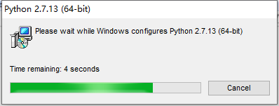
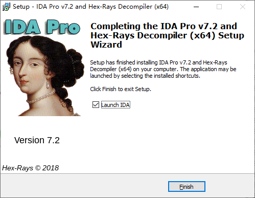

# obj 文件

# vs vim

https://www.google.com.hk/search?q=vs+2017+%E4%BD%BF%E7%94%A8vim&oq=vs+2017+%E4%BD%BF%E7%94%A8vim&aqs=chrome..69i57j0l6.5451j0j1&sourceid=chrome&ie=UTF-8 | vs 2017 使用vim - Google 搜索
https://feifeiyum.github.io/2017/01/23/vimusage/ | VIM 入门手册， (VS Code) | Feifeiyu Blog
https://www.itread01.com/content/1544578579.html | Vs 中使用 Vim 模式 - IT閱讀
https://blog.csdn.net/w746805370/article/details/52596245 | (21条消息) 怎样向visual studio加入vim的强大编辑能力，让装逼防不胜防！_Gikor-CSDN博客
https://blog.csdn.net/absurd/article/details/1164127 | (21条消息) 在visual studio中使用vim编辑程序_Linux mobile development & HTML5 Games/App-CSDN博客
https://blog.csdn.net/techfield/article/details/82881646 | (20条消息) Vs 中使用 Vim 模式_Hustlion 的技术博客-CSDN博客
https://blog.csdn.net/w746805370/article/details/52596245 | (20条消息) 怎样向visual studio加入vim的强大编辑能力，让装逼防不胜防！_Gikor-CSDN博客
https://vim.fandom.com/wiki/Integrate_gvim_with_Visual_Studio | Integrate gvim with Visual Studio | Vim Tips Wiki | Fandom
https://www.cnblogs.com/qiyuexin/p/10424755.html | VS下使用VIM， Visual Studio 安装 VSvim插件 配置 及使用 - QIYUEXIN - 博客园
https://www.google.com.hk/search?q=%C2%A0VsVim%E9%85%8D%E7%BD%AE%E6%96%87%E4%BB%B6 | VsVim配置文件 - Google 搜索
https://www.codeleading.com/article/6474552486/ | VsVim 配置 - 代码先锋网
https://my.oschina.net/u/4351540/blog/3638465 | VS下使用VIM， Visual Studio 安装 VSvim插件 配置 及使用 - osc_9g4x7r4s的个人空间 - OSCHINA - 中文开源技术交流社区
https://www.codenong.com/cs106739252/
https://www.codenong.com/cs106739252/
https://www.cnblogs.com/qiyuexin/p/10424755.html | VS下使用VIM， Visual Studio 安装 VSvim插件 配置 及使用 - QIYUEXIN - 博客园
https://kubi.pub/2018/09/16/VSVim_install_config/ | VSVim 安装及配置 — 酷毙dot发布
https://www.geek-share.com/detail/2724143543.html | VsVim配置教程 - 极客分享
https://www.geek-share.com/detail/2724143543.html | VsVim配置教程 - 极客分享
https://blog.csdn.net/yanchezuo/article/details/78790961 | (20条消息) VsVim配置教程_延澈左的专栏-CSDN博客
https://www.jianshu.com/p/805f598ddaf0 | VsVim 配置 - 简书
https://www.jianshu.com/p/805f598ddaf0 | VsVim 配置 - 简书
https://www.jianshu.com/go-wild?ac=2&url=https%3A%2F%2Fwww.wxxk.cc%2FC-CPP%2F134.html | 简书
https://github.com/Why8n/dotfiles/blob/master/vs2017/_vsvimrc | dotfiles/_vsvimrc at master · Why8n/dotfiles
https://github.com/Why8n/dotfiles | Why8n/dotfiles: my .dotfiles configurations
https://github.com/Why8n/dotfiles/tree/master/vs2017 | dotfiles/vs2017 at master · Why8n/dotfiles
https://github.com/Why8n/dotfiles/blob/master/vs2017/vscommands.txt | dotfiles/vscommands.txt at master · Why8n/dotfiles
https://github.com/Why8n/dotfiles/blob/master/vs2017/_vsvimrc | dotfiles/_vsvimrc at master · Why8n/dotfiles
https://www.jianshu.com/go-wild?ac=2&url=https%3A%2F%2Fvisualstudio.microsoft.com%2Fzh-hans%2F | 简书
https://github.com/aburok/mysettings/blob/master/VisualStudio/vscommands.txt | mysettings/vscommands.txt at master · aburok/mysettings
https://www.jianshu.com/go-wild?ac=2&url=https%3A%2F%2Fvisualstudio.microsoft.com%2Fzh-hans%2F | 简书
https://visualstudio.microsoft.com/zh-hans/ | Visual Studio IDE、代码编辑器、Azure DevOps 和 App Center - Visual Studio
https://www.jianshu.com/p/9536ec0d59a3 | VIM 配置 - 简书

# vscode vim

https://github.com/VSCodeVim/Vim

# 模型网站

https://www.google.com.hk/search?q=%E6%A8%A1%E5%9E%8B%E4%B8%8B%E8%BD%BD%E7%BD%91%E7%AB%99&oq=%E6%A8%A1%E5%9E%8B%E4%B8%8B%E8%BD%BD%E7%BD%91%E7%AB%99&aqs=chrome..69i57j0j69i65.4263j0j1&sourceid=chrome&ie=UTF-8 | 模型下载网站 - Google 搜索
https://www.zhihu.com/question/19959438 | (5 封私信 / 33 条消息) 哪个网站有免费的 3D 模型素材？ - 知乎
http://dlegend.com/html/free-3dmodels.html
http://www.oyonale.com/modeles.php?lang=en&format=OBJ | Free 3D models - Free OBJ models
http://www.oyonale.com/modeles.php?lang=en&page=47 | Free 3D models - Thompson submachine gun (POV-Ray,C4D,OBJ)
http://www.oyonale.com/modeles.php?lang=en&page=48 | Free 3D models - AK-47 Kalashnikov assault rifle (POV-Ray,C4D,OBJ)
http://ww1.dewantoro.net/?z | ww1.dewantoro.net/?z
http://telias.free.fr/Models_menu.html | 3d models for 3d studio max Ligthwave Poser Bryce and other 3d modelling and rendering software
https://wirecase3d.com/Gallery-Free-3D-Models_s-2_v-20-1_f-fc-0-321_f-fpx-_f-fpn-_f-oid-.html
https://www.turbosquid.com/3d-model/cat | Cat 3D Models for Download | TurboSquid
https://www.sharecg.com/v/44492/view/5/3D-Model/Ormesh-02---3D-model | Ormesh 02 - 3D model - 3D Model - ShareCG
https://www.sharecg.com/v/44494/view/5/3D-Model/Ormesh-04---3D-model | Ormesh 04 - 3D model - 3D Model - ShareCG
http://dd-freebies.blogspot.com/2007/09/ormesh-05.html | DD - Freebies: Ormesh 05
https://barbaradin.com/ | Barbara Din - Art Explorer
https://www.nasa.gov/multimedia/3d_resources/ | NASA 3D Resources | NASA
http://dlegend.com/html/free-3dmodels.html
https://archive3d.net/?a=download&id=40745fdd | Laundry basket N190919 - 3D model (*.gsm+*.3ds) for interior 3d visualization. | Home Appliances
https://www.turbosquid.com/Search/3D-Models | 3D Models for Download | TurboSquid
https://3dtotal.com/ | 3dtotal · Learn | Create | Share
https://zhuanlan.zhihu.com/p/65061874 | 【国外Top20】免费3D模型下载网站，设计师必藏！ - 知乎

# 颜色

https://uiiiuiii.com/inspiration/1616179831.html

浅蓝紫

#989DCC

#A2A7D1

#A2A7D1

162, 167, 209

#ABA985

# 颜色转换网站

# web 调试 禁用缓存

https://www.google.com.hk/search?q=%E6%B5%8F%E8%A7%88%E5%99%A8%E8%B0%83%E8%AF%95%E7%BD%91%E9%A1%B5%E4%B8%8D%E7%BC%93%E5%AD%98&oq=%E6%B5%8F%E8%A7%88%E5%99%A8%E8%B0%83%E8%AF%95%E7%BD%91%E9%A1%B5%E4%B8%8D%E7%BC%93%E5%AD%98&aqs=chrome..69i57.12482j1j1&sourceid=chrome&ie=UTF-8 | 浏览器调试网页不缓存 - Google 搜索
https://segmentfault.com/q/1010000002924819 | web调试如何禁用浏览器缓存？ - SegmentFault 思否
https://blog.csdn.net/qq_25479327/article/details/81039764 | (21条消息) Chrome禁用缓存，方便调试代码_林飞的梦呓-CSDN博客_chrome禁用缓存
https://blog.csdn.net/xinghuo0007/article/details/72637762 | (21条消息) google浏览器设置不缓存的方法_xinghuo0007的博客-CSDN博客

# 配色网站

花瓣网

# cmake cppcheck

# c++初学，有哪些简单易用的图形库？

https://www.zhihu.com/question/54149985

# MFC

# FLTK

https://en.wikipedia.org/wiki/FLTK

# easy x

https://easyx.cn/

# IDA 逆向软件

# IDA 截图

