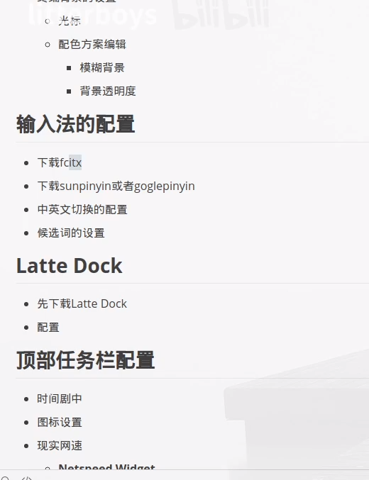
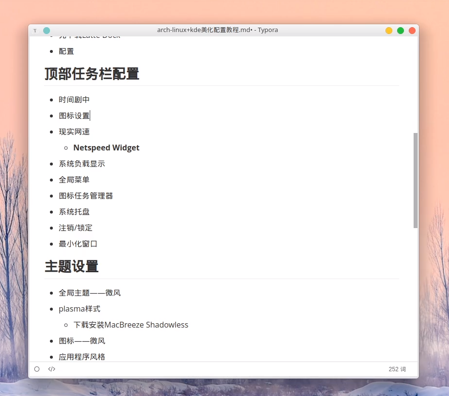
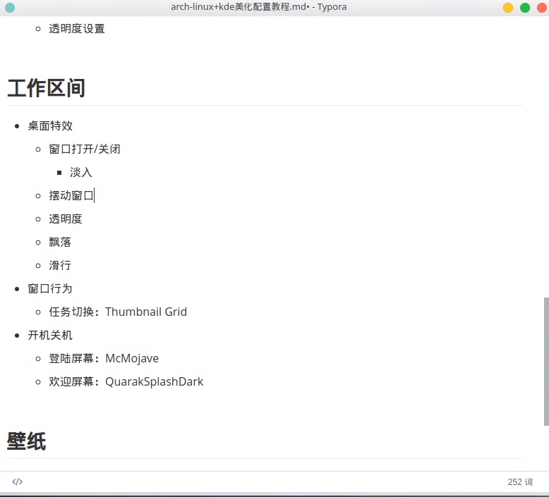
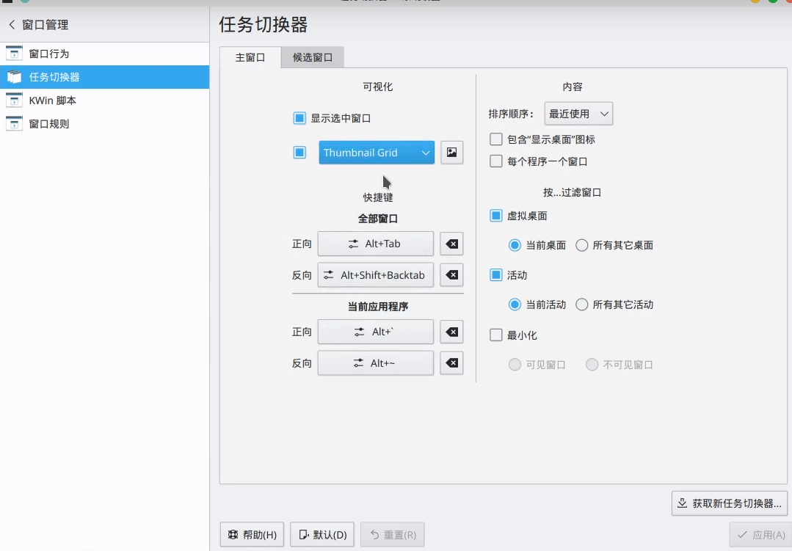
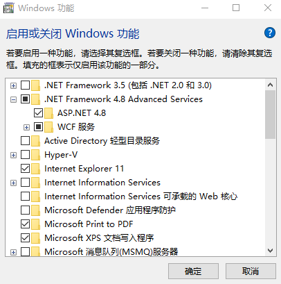

# C++中cmath无法使用M_PI：“M_PI”: 未声明的标识符

https://blog.csdn.net/weixin_39374967/article/details/104177917


# scoop  安装遇到的各种问题


http://boyinthesun.cn/post/scoop/


# win+x 添加功能 控制面板


# manjaro yay


# manjaro 添加国内源


# manjaro zsh


# manjaro 备份


# manjaro 美化 学习记录






 




# [Source Insight 4.0 安装破解和解决中文乱码](https://www.cnblogs.com/xiaokangkp0602/p/12590847.html)


一、Source Insight 4.0安装包和破解文件都在如下地址，有需要的自行下载。
链接: https://pan.baidu.com/s/18_piaLJbKFwCJ54JEWdtEw
提取码: b8xu 


 SourceInsight 不断无响应、占用CPU过高的有关问题

SourceInsight 不断无响应、占用CPU过高的有关问题
处理办法：
1.去掉同步，options->perferences->general->backgroud synchronization every [ ] 前面的钩；
2.updata revoery file every[ ]改一个大参数 1800


# scoop 软件库


# scoop 安装失败

http://boyinthesun.cn/post/scoop/


.png)




# scoop bucket

```
scoop bucket add extras
nirsoft games


scoop bucket add dorado https://github.com/h404bi/dorado

scoop bucket add Ash258 'https://github.com/Ash258/Scoop-Ash258.git'


main [默认]
extras [墙裂推荐]
versions
nightlies
nirsoft
php
nerd-fonts
nonportable
java
games
jetbrains
```


# 软件

### ImageGlass 

Captura 


# linux  系统时间不匹配问题


```
ntpdate  time.windows.com
```


```
hwclock -w
```


```
timedatectl set-local-rtc true
```


启动ntp 自动更新


> Manjaro 默认没有启动 NTP 自动对时，你需要手动配置与启动。
>
> 首先需要配置一下 `/etc/systemd/timesyncd.conf`，取消 `#NTP=` 的注释。然后填上 NTP 服务器的地址。这里推荐两组 NTP 服务器的域名
>
> 阿里巴巴 NTP
>
> ```plaintext
> NTP=time1.aliyun.com time2.aliyun.com time3.aliyun.com time4.aliyun.com time5.aliyun.com time6.aliyun.com time7.aliyun.com
> ```
>
> Copy
>
> Apple NTP
>
> ```plaintext
> NTP=time1.apple.com time2.apple.com time3.apple.com time4.apple.com time5.apple.com time6.apple.com time7.apple.com
> ```
>
> Copy
>
> 然后使用以下命令启动 NTP
>
> ```plaintext
> timedatectl set-ntp true
> ```
>
> Copy
>
> 然后使用以下命令查看 NTP 的状态
>
> ```plaintext
> timedatectl timesync-status
> ```
>
> Copy

# windows 删除cd 驱动器

https://jingyan.baidu.com/article/ff42efa91ba2b6c19e220298.html