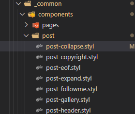

# Hexo 数学公式 换行问题解决

https://zhuanlan.zhihu.com/p/33857596


# hexo 透明度

https://www.zhihu.com/question/268140594


折腾了半天框架里的代码, f12后才发现问题居然如此简单...

前面两位的答案因为header-inner的位置是position: absolute;固定在main-inner中, 而main-inner在header-inner下方导致层级出现了问题...

即在设置透明度后导致header-inner无法点击(目录, 搜索框等包含在header-inner中的内容)

需要增加z-index给header-inner使得层级在main-inner上方

.main-inner{
	opacity: 0.8;
}
.header-inner{
	opacity: 0.8;
	z-index: 10;
}

```
.main-inner{
	opacity: 0.8;
}
.header-inner{
	opacity: 0.8;
	z-index: 10;
}
```


## 显示当前浏览进度

```
back2top:
  enable: true
  # Back to top in sidebar.
  sidebar: true
  # Scroll percent label in b2t button.
  scrollpercent: true
```


# https://github.com/chekun/hexo-excerpt


# hexo next auto_excerpt无法使用

https://github.com/theme-next/hexo-theme-next/issues/1262
https://github.com/theme-next/hexo-theme-next/issues/1336
突然心血来潮，又再整以前整了一半的hexo博客，主要是我有点复习资料没地方放，里面一堆公式csdn不知道能不能放

auto_excerpt整了半天就是没效果，在next的issue里发现是next新版本剔除了这个功能，认为插件能做的，为什么主题要做，这个功能还影响主题
大致了解了
早说嘛，那就用插件嘛，你倒是给我推荐一个呢
找了半天
那个什么hexo-auto-excerpt根本没法用，配置里面写了生成后没反应
然后找到一个hexo-excerpt
https://github.com/chekun/hexo-excerpt
配置文件写进去总算有效果了


# hexo 字数统计、阅读时长


# hexo

**https://tding.top/archives/42c38b10.html**


# hexo 设置本地搜索

**本地搜索的原理**

对于动态网站来说，可以通过 php 实现。但是，Hexo 博客是静态网站，用不了 php。

NexT 主题已经实现这个功能，它用了 Hexo 的拓展包 `hexo-generator-searchdb`，预先生成了一个文本库 `search.xml`，然后传到了网站里面。在本地搜索的时候，NexT 直接用 javascript 调用了这个文件，从而实现了静态网站的本地搜索。

**设置过程**

安装插件:

```
npm install hexo-generator-searchdb --save
```

然后我们修改站点配置`_config.yml` 文件，添加如下内容：

```
# 本地搜索
search:
  path: search.xml
  field: post
  format: html
  limit: 100
```

- path：索引文件的路径，相对于站点根目录
- field：搜索范围，默认是 post，还可以选择 page、all，设置成 all 表示搜索所有页面
- limit：限制搜索的条目数

然后修改主题配置文件`_config.yml`：

```
# Local Search
# Dependencies: https://github.com/theme-next/hexo-generator-searchdb
local_search:
  enable: true
  # If auto, trigger search by changing input.
  # If manual, trigger search by pressing enter key or search button.
  trigger: auto
  # Show top n results per article, show all results by setting to -1
  top_n_per_article: 1
  # Unescape html strings to the readable one.
  unescape: false
  # Preload the search data when the page loads.
  preload: false
```


# C++ iota 函数


# 游戏项目

https://github.com/nek0bit/LoopCube


# VS2019配置SDL2库

https://blog.csdn.net/banquetqaq/article/details/109403393

# hexo next 文章背景出现阴影边框


# hexo 背景


```
.sidebar
{
background :none;
opacity :0.9;

}
.content-wrap{

  opacity :0.9
}


// body {
//   background: url(https://source.unsplash.com/random/1600x900?wallpapers);
//   background-size: cover;
//   background-repeat: no-repeat;
//   background-attachment: fixed;
//   background-position: 50% 50%;
// }
// // 修改菜单栏透明度
.header-inner {
  opacity: 0.9;
}
// 修改主体透明度
// .main-inner {
//   // background: #fff;
//   opacity: 0.9;

// }

.content-wrap
{
opacity :0.98;
}

```


# hexo 圆角


```
$border-radius-inner              = 20px 20px 20px 20px;
$border-radius                    = 20px;
```


# hexo 收集美化




```
.posts-collapse {
  margin-left: $posts-collapse-margin;
  position: relative;

  +mobile() {
    margin-left: $posts-collapse-margin-mobile;
    margin-right: $posts-collapse-margin-mobile;
  }

  .collection-title {
    font-size: $font-size-large;
    position: relative;

    &::before {
      background: $grey-dark;
      border: 1px solid white;
      border-radius: 50%;
      content: ' ';
      height: 10px;
      left: 0;
      margin-left: -6px;
      margin-top: -4px;
      position: absolute;
      top: 50%;
      width: 10px;
    }
  }

  .collection-year {
    font-size: $font-size-largest;
    font-weight: bold;
    margin: 60px 0;
    position: relative;

    &::before {
      background: $grey;
      border-radius: 50%;
      content: ' ';
      height: 8px;
      left: 0;
      margin-left: -4px;
      margin-top: -4px;
      position: absolute;
      top: 50%;
      width: 8px;
    }
  }

  .collection-header {
    display: block;
    margin: 0 0 0 20px;

    small {
      color: $grey;
      margin-left: 5px;
    }
  }

  // .post-header {
  //   //border-bottom: 1px dashed $grey-light;
  //   margin: 30px 0;
  //   padding-left: 15px;
  //   position: relative;
  //   transition-property: border;
  //   the-transition();

  //   &::before {
  //     background: $grey;
  //     border: 1px solid white;
  //     border-radius: 50%;
  //     content: ' ';
  //     height: 6px;
  //     left: 0;
  //     margin-left: -4px;
  //     position: absolute;
  //     top: $font-size-smallest;
  //     transition-property: background;
  //     width: 6px;
  //     the-transition();
  //   }

  //   &:hover {
  //     border-bottom-color: $grey-dim;

  //     &::before {
  //       background: $black-deep;
  //     }
  //   }
  // }

  .post-meta {
    display: inline;
    //font-size: $font-size-smallest;
    margin-right: 10px;
     font-size: 19px;
  //position: absolute;
  color: #fff;
  background-color: #49b1f5;
  border-radius: 5px;
  padding-left: 5px;
  padding-right: 5px;
  margin-left: 10px;
  }

  .post-title {
    display: inline;

  margin-right: 10px;
     font-size: 19px;
  //position: absolute;
  color: #fff;
  background-color: #eff2f3;
  border-radius: 5px;
  padding-left: 5px;
  padding-right: 5px;
  margin-left: 10px;

    a, span.exturl {
      border-bottom: none;
      color: var(--link-color);
    }

    .fa-external-link-alt {
      font-size: $font-size-small;
      margin-left: 5px;
    }
  }

  &::before {
    background: $whitesmoke;
    content: ' ';
    height: 100%;
    left: 0;
    margin-left: -2px;
    position: absolute;
    top: 1.25em;
    width: 4px;
  }
}

```


# hexo 图像问题

由于`hexo-asset-image`插件存在bug，会导致博文中引用图片时无法生成正确的链接地址，进而导致图片无法访问的现象。
具体解决方案为将文件`node_modules/hexo-asset-image/index.js`替换为如下的内容：


```
COPY'use strict';
var cheerio = require('cheerio');

// http://stackoverflow.com/questions/14480345/how-to-get-the-nth-occurrence-in-a-string
function getPosition(str, m, i) {
  return str.split(m, i).join(m).length;
}

var version = String(hexo.version).split('.');
hexo.extend.filter.register('after_post_render', function(data){
  var config = hexo.config;
  if(config.post_asset_folder){
    	var link = data.permalink;
	if(version.length > 0 && Number(version[0]) == 3)
	   var beginPos = getPosition(link, '/', 1) + 1;
	else
	   var beginPos = getPosition(link, '/', 3) + 1;
	// In hexo 3.1.1, the permalink of "about" page is like ".../about/index.html".
	var endPos = link.lastIndexOf('/') + 1;
    link = link.substring(beginPos, endPos);

    var toprocess = ['excerpt', 'more', 'content'];
    for(var i = 0; i < toprocess.length; i++){
      var key = toprocess[i];
 
      var $ = cheerio.load(data[key], {
        ignoreWhitespace: false,
        xmlMode: false,
        lowerCaseTags: false,
        decodeEntities: false
      });

      $('img').each(function(){
		if ($(this).attr('src')){
			// For windows style path, we replace '\' to '/'.
			var src = $(this).attr('src').replace('\\', '/');
			if(!/http[s]*.*|\/\/.*/.test(src) &&
			   !/^\s*\//.test(src)) {
			  // For "about" page, the first part of "src" can't be removed.
			  // In addition, to support multi-level local directory.
			  var linkArray = link.split('/').filter(function(elem){
				return elem != '';
			  });
			  var srcArray = src.split('/').filter(function(elem){
				return elem != '' && elem != '.';
			  });
			  if(srcArray.length > 1)
				srcArray.shift();
			  src = srcArray.join('/');
			  $(this).attr('src', config.root + link + src);
			  console.info&&console.info("update link as:-->"+config.root + link + src);
			}
		}else{
			console.info&&console.info("no src attr, skipped...");
			console.info&&console.info($(this));
		}
      });
      data[key] = $.html();
    }
  }
});
```


