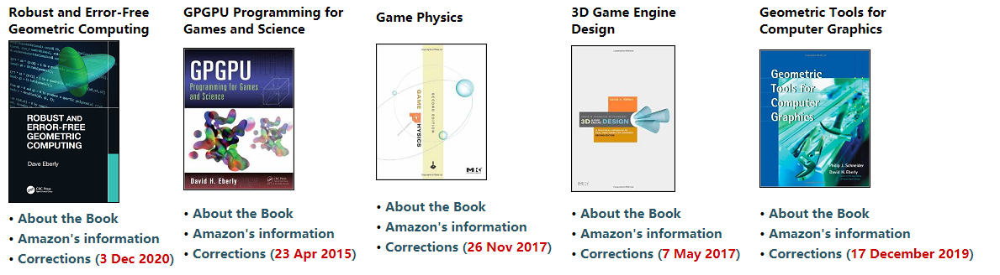

# 向量法判断点与线段的关系(一)

https://zhuanlan.zhihu.com/p/147366205

# 图书

https://www.geometrictools.com/Books/Books.html

# 工具箱

计算题

# C++ 头文件相互引用

# SIMD

https://www.google.com.hk/search?q=C%2B%2B+simd+%E5%90%91%E9%87%8F%E8%AE%A1%E7%AE%97%E5%8A%A0%E9%80%9F&oq=C%2B%2B+simd+%E5%90%91%E9%87%8F%E8%AE%A1%E7%AE%97%E5%8A%A0%E9%80%9F&aqs=chrome..69i57.7959j0j1&sourceid=chrome&ie=UTF-8 | C++ simd 向量计算加速 - Google 搜索
https://www.thinbug.com/q/28636482 | 英特尔SIMD指令加速 - Thinbug
https://www.daimajiaoliu.com/daima/3eb075e319003f0 | 《C++ AMP：用Visual C++加速大规模并行计算》——1.2　CPU并行技术
https://software.intel.com/content/www/cn/zh/develop/articles/using-simd-technologies-on-intel-architecture-to-speed-up-game-code.html | 借助 SIMD 技术基于英特尔® 架构加快游戏代码开发
https://www.coder.work/article/122872 | c++ - 使用SSE加速float 5x5矩阵* vector 乘法 - IT工具网
https://www.zhihu.com/question/60511140 | (5 封私信 / 80 条消息) c/cpp编译器会生成MMX,simd,avx这类的指令吗？ - 知乎
https://www.google.com.hk/search?q=%E9%A6%96%E5%85%88simd%E4%B8%8D%E6%98%AF%E4%B8%80%E7%A7%8D%E5%85%B7%E4%BD%93%E7%9A%84%E6%8C%87%E4%BB%A4%E6%A0%BC%E5%BC%8F%EF%BC%8Cmmx-%3Esse-%3Eavx%E8%BF%99%E6%A0%B7%E7%9A%84%E5%8F%91%E5%B1%95%E8%B6%8B%E5%8A%BF%EF%BC%8C%E4%BD%86%E5%AE%83%E4%BB%AC%E9%83%BD%E5%B1%9E%E4%BA%8Esimd%E3%80%82%E5%85%B6%E6%AC%A1%EF%BC%8C%E8%BF%99%E4%BA%9B%E6%8C%87%E4%BB%A4%E9%9B%86%E9%99%A4%E4%BA%86%E5%BE%AA%E7%8E%AF%E5%B1%95%E5%BC%80%E4%B9%8B%E7%B1%BB%E7%9A%84%E4%BC%98%E5%8C%96%E6%97%B6%E5%80%99%E4%BC%9A%E7%94%A8%E5%88%B0%E4%BB%A5%E5%A4%96%EF%BC%8C%E4%B8%80%E4%BA%9B%E6%99%AE%E9%80%9A%E7%9A%84%E6%B5%AE%E7%82%B9%E8%AE%A1%E7%AE%97%E4%B9%9F%E4%BC%9A%E7%94%A8%E5%88%B0%E3%80%82%E6%AF%94%E5%A6%82%E8%AE%A1%E7%AE%97%E4%B8%A4%E4%B8%AA%E6%B5%AE%E7%82%B9%E6%95%B0%E7%9A%84%E4%B9%98%E6%B3%95%EF%BC%8C%E5%8F%AA%E6%9C%89%E4%B8%A4%E4%B8%AA%EF%BC%8C%E7%9C%8B%E8%B5%B7%E6%9D%A5%E6%98%AF%E4%B8%8D%E6%98%AF%E6%B2%A1%E6%9C%89%E4%BB%80%E4%B9%88%E5%B1%95%E5%BC%80%E4%BC%98%E5%8C%96%E7%9A%84%E4%BD%99%E5%9C%B0%EF%BC%9F%E4%BD%86%E6%98%AF%E8%BF%98%E6%98%AF%E5%8F%AF%E8%83%BD%E4%BC%9A%E7%94%9F%E6%88%90mulss%E8%BF%99%E6%A0%B7%E7%9A%84%E6%8C%87%E4%BB%A4%E3%80%82%E5%9B%A0%E4%B8%BAx86%E4%B8%8D%E8%87%AA%E5%B8%A6%E6%B5%AE%E7%82%B9%E8%BF%90%E7%AE%97%E7%9A%84%E6%8C%87%E4%BB%A4%EF%BC%8C%E5%A6%82%E6%9E%9C%E7%94%A8x87%E7%9A%84%E6%8C%87%E4%BB%A4%EF%BC%8C%E8%99%BD%E7%84%B680%E4%BD%8D%E7%9A%84%E7%B2%BE%E5%BA%A6%E6%98%AF%E5%BE%88%E5%A5%BD%EF%BC%8C%E4%BD%86%E6%98%AFx87%E7%9A%84%E8%BF%90%E7%AE%97%E6%98%AF%E2%80%9C%E6%A0%88%E2%80%9D%E7%9A%84%E6%96%B9%E5%BC%8F%E2%80%A6%E2%80%A6%E6%80%BB%E4%B9%8B%E6%8D%A2%E6%88%90sse%E7%9A%84%E6%8C%87%E4%BB%A4%EF%BC%8C%E5%B0%B1%E8%83%BD%E8%9E%8D%E5%85%A5%E5%88%B0%E6%AD%A3%E5%B8%B8%E7%9A%84%E6%B5%81%E6%B0%B4%E7%BA%BF%E9%87%8C%E4%BA%86%E2%80%A6%E2%80%A6 | 首先simd不是一种具体的指令格式，mmx->sse->avx这样的发展趋势，但它们都属于simd。其次，这些指令集除了循环展开之类的优化时候会用到以外，一些普通的浮点计算也会用到。比如计算两个浮点数的乘法，只有两个，看起来是不是没有什么展开优化的余地？但是还是可能会生成mulss这样的指令。因为x86不自带浮点运算的指令，如果用x87的指令，虽然80位的精度是很好，但是x87的运算是“栈”的方式……总之换成sse的指令，就能融入到正常的流水线里了…… - Google 搜索
https://zhuanlan.zhihu.com/p/93824687 | 从Eigen向量化谈内存对齐 - 知乎
https://www.google.com.hk/search?newwindow=1&safe=strict&ei=nPjJX-GhGtemoASCyJOgAg&q=immintrin.h+how+to+use&oq=immintrin.h+how+to+use&gs_lcp=CgZwc3ktYWIQAzIFCCEQoAE6AggAOgQIABAeOgQIABANOgYIABANEB5Qm8gCWM-EA2CdhgNoAXAAeAGAAcMGiAHSHpIBCzItNC40LjIuMC4xmAEAoAEBqgEHZ3dzLXdpesABAQ&sclient=psy-ab&ved=0ahUKEwjh34Ou-bPtAhVXE4gKHQLkBCQQ4dUDCA0&uact=5 | immintrin.h how to use - Google 搜索
https://gcc.gnu.org/bugzilla/show_bug.cgi?id=57202 | 57202 – Please make the intrinsics headers like immintrin.h be usable without compiler flags
https://chryswoods.com/vector_c++/immintrin.html | chryswoods.com | 第2部分：AVX本质
https://github.com/intel/Immintrin-debug | intel/Immintrin-debug: immintrin_dbg.h is an include file, a wrapper around immintrin.h. It implements most of AVX, AVX2, AVX-512 vector intrinsics to enable source level debug of vector code.
https://github.com/intel/Immintrin-debug/blob/master/immintrin_dbg.h | Immintrin-debug/immintrin_dbg.h at master · intel/Immintrin-debug
https://gist.github.com/jackmott/b7268510227303bb28756596a09cd1e2 | 头文件使SIMD内在函数更易于使用
https://gist.github.com/jackmott/b7268510227303bb28756596a09cd1e2 | A header file to make SIMD intrinsics a bit easier to work with
https://www.cs.uaf.edu/courses/cs441/notes/avx/ | 高级矢量扩展：AVX
https://software.intel.com/content/www/us/en/develop/articles/intel-avx-cc-intrinsics-emulation.html | Intel® AVX C/C++ Intrinsics Emulation
https://stackoverflow.com/questions/36986159/alternative-to-immintrin-h | c - Alternative to immintrin.h - Stack Overflow
https://sites.uclouvain.be/SystInfo/usr/include/immintrin.h.html | immintrin.h
https://github.com/gcc-mirror/gcc/blob/master/gcc/config/i386/immintrin.h | gcc/immintrin.h at master · gcc-mirror/gcc
https://core.ac.uk/download/pdf/41458239.pdf | 41458239.pdf
http://www.jos.org.cn/html/2015/6/4811.htm | SIMD自动向量化编译优化概述
https://zhou-yuxin.github.io/articles/2017/%E4%BD%BF%E7%94%A8Intel%20SSE-AVX%E6%8C%87%E4%BB%A4%E9%9B%86%EF%BC%88SIMD%EF%BC%89%E5%8A%A0%E9%80%9F%E5%90%91%E9%87%8F%E5%86%85%E7%A7%AF%E8%AE%A1%E7%AE%97/index.html | 使用Intel SSE/AVX指令集（SIMD）加速向量内积计算
https://blog.csdn.net/sinat_26210035/article/details/88773961 | (19条消息) C++ SIMD入门_sinat_26210035的博客-CSDN博客_c++ simd
https://blog.csdn.net/artorias123/article/details/86524899 | (19条消息) 数值计算优化方法C/C++(三)——SIMD_artorias123的博客-CSDN博客
https://www.google.com.hk/search?q=Intrinsics%E5%A4%B4%E6%96%87%E4%BB%B6 | Intrinsics头文件 - Google 搜索

# C++ 模板特化和偏特化

# Advanced Global Illumination

https://book.douban.com/subject/2751153/

http://read.pudn.com/downloads702/ebook/2825108/Advanced%20Global%20Illumination.pdf

# 图形学收集

http://www.jagregory.com/abrash-black-book/#chapter-5-crossing-the-border | Michael Abrash’s Graphics Programming Black Book, Special Edition
https://www.google.com.hk/search?q=*Michael+Abrash%27s+Graphics+Programming+Black+Book*%2C&oq=*Michael+Abrash%27s+Graphics+Programming+Black+Book*%2C&aqs=chrome..69i57j0l5.1082j0j1&sourceid=chrome&ie=UTF-8 | *Michael Abrash's Graphics Programming Black Book*, - Google 搜索
https://www.amazon.com/Michael-Abrashs-Graphics-Programming-Special/dp/1576101746 | Michael Abrash's Graphics Programming Black Book (Special Edition): Abrash, Michael: 9781576101742: Amazon.com: Books
https://www.google.com.hk/search?q=Michael%20Abrash%27s%20Graphics%20Programming%20Black%20Book | Michael Abrash's Graphics Programming Black Book - Google 搜索
https://www.jagregory.com/abrash-black-book/ | Michael Abrash’s Graphics Programming Black Book, Special Edition
https://github.com/jagregory/abrash-black-book | jagregory/abrash-black-book: Markdown source for Michael Abrash's Graphics Programming Black Book
https://github.com/jagregory/abrash-black-book/releases/tag/v1.1 | Release Black Book v1.1 · jagregory/abrash-black-book
https://www.drdobbs.com/parallel/graphics-programming-black-book/184404919 | Graphics Programming Black Book | Dr Dobb's
http://giant.pourri.ch/Graphics%20Programming%20Black%20Book/Graphics%20Programming%20Black%20Book.pdf
http://giant.pourri.ch/Graphics%20Programming%20Black%20Book/Graphics%20Programming%20Black%20Book.pdf | 500 Internal Privoxy Error
http://giant.pourri.ch/Graphics%20Programming%20Black%20Book/Graphics%20Programming%20Black%20Book.pdf | 500 Internal Privoxy Error
https://www.google.com.hk/search?q=Latency--The%20*sine%20qua%20non*%20of%20AR%20and%20VR&ie=utf-8 | Latency--The *sine qua non* of AR and VR - Google 搜索
https://news.ycombinator.com/item?id=4985100 | Latency – the sine qua non of AR and VR | Hacker News
http://developer.amd.com/wordpress/media/2012/10/gr_proc_req_for_enabling_immer_VR.pdf | gr_proc_req_for_enabling_immer_VR.pdf
https://ceeds-project.eu/2013/01/28/latency-of-virtual-and-augmented-reality-applications/ | Latency of virtual and augmented reality applications | CEEDs
https://www.reddit.com/r/virtualreality/comments/15og50/latency_the_sine_qua_non_of_ar_and_vr/ | Latency – the sine qua non of AR and VR : virtualreality
https://blogs.valvesoftware.com/abrash/latency-the-sine-qua-non-of-ar-and-vr/ | 隐私设置错误
https://developer.oculus.com/blog/the-latent-power-of-prediction/?locale=de_DE | 预测的潜能 眼
https://blogs.valvesoftware.com/abrash/down-the-vr-rabbit-hole-fixing-judder/ | Access Denied

# doxygen

https://www.google.com.hk/search?q=doxygen+beautiful&newwindow=1&safe=strict&ei=0bHHX7PeEqPVmAXg0oewDw&start=10&sa=N&ved=2ahUKEwjziqDIza_tAhWjKqYKHWDpAfYQ8tMDegQIBxAy&biw=2560&bih=979 | doxygen beautiful - Google 搜索
https://www.star.bnl.gov/public/comp/sofi/doxygen/ | Doxygen manual:
https://developer.aliyun.com/mirror/npm/package/moxygen/v/0.7.7 | Package - moxygen
https://developer.aliyun.com/mirror/npm/package/example | Package - example
https://developer.aliyun.com/mirror/npm/package/example | Package - example
https://www.edn.com/7-tips-for-documenting-embedded-code-with-doxygen/ | 使用Doxygen记录嵌入式代码的7个技巧-EDN
https://www.reddit.com/r/cpp/comments/66nolj/extreme_makeover_for_doxygen/ | Doxygen的极端改头换面：cpp
https://github.com/vovkos/doxyrest | vovkos / doxyrest：从Doxygen XML到reStructuredText的编译器-因此，是名称。 它解析Doxygen生成的XML数据库，并为Python文档生成器Sphinx生成reStructuredText。
https://vovkos.github.io/doxyrest/samples/libusb-sphinxdoc/group_libusb_lib.html#doxid-group-libusb-lib | Library initialization/deinitialization — LibUSB Documentation
http://libusb.sourceforge.net/api-1.0/modules.html | libusb: Modules
https://vovkos.github.io/doxyrest/samples/alsa/ | Index Preamble and License — ALSA Library Documentation
https://vovkos.github.io/doxyrest-showcase/opencv/sphinx_rtd_theme/class_cv_videostab_NullWobbleSuppressor.html | class cv::videostab::NullWobbleSuppressor — OpenCV Documentation
https://github.com/Velron/doxygen-bootstrapped | Velron / doxygen-bootstrapped：自定义doxygen输出以使用twitter bootstrap框架。
https://biogearsengine.com/documentation/index.html | https://biogearsengine.com/documentation/index.html
https://github.com/gbv/jskos-php | gbv/jskos-php: JSKOS data model in PHP
http://web.evolbio.mpg.de/~boettcher//other/2016/creating_source_graph.html | Creating a visualization of a C++ project with doxygen
https://www-numi.fnal.gov/offline_software/srt_public_context/WebDocs/doxygen-howto.html | How to document your code for doxygen
https://news.ycombinator.com/item?id=18817414
https://news.ycombinator.com/item?id=18817414
https://www.rosettacommons.org/docs/latest/development_documentation/tutorials/doxygen-tips | Tips for writing doxygen documentation
https://mcss.mosra.cz/documentation/ | Doc generators | m.css
https://mcss.mosra.cz/documentation/doxygen/ | 文档生成器»Doxygen C ++主题| css
https://mcss.mosra.cz/css/themes/#light | CSS » Themes | m.css
http://blog.mosra.cz/ | tady je mosrovo
https://doc.magnum.graphics/magnum/cmake.html | Getting started » Usage with CMake | Magnum C++ docs
http://westonthayer.com/writing/2014/11/27/bootstrap-theme-for-doxygen/ | A Bootstrap Theme for Doxygen
https://sourcey.com/articles/generating-beautiful-cpp-markdown-documentation-with-moxygen | Generating Beautiful C++ Markdown Documentation with Moxygen | Sourcey
https://devblogs.microsoft.com/cppblog/clear-functional-c-documentation-with-sphinx-breathe-doxygen-cmake/ | Clear, Functional C++ Documentation with Sphinx + Breathe + Doxygen + CMake | C++ Team Blog
https://mesos.readthedocs.io/en/latest/doxygen-style-guide/ | Doxygen样式指南-Mesos
http://mesos.apache.org/api/latest/c++/ | Apache Mesos: Mesos API Documentation
https://www.doxygen.nl/results.html | Doxygen：doxygen产生的输出示例
https://vtk.org/doc/nightly/html/index.html | VTK: VTK 9.0.20201201 Documentation
https://api.kde.org/ | API Documentation

https://www.google.com.hk/search?newwindow=1&safe=strict&ei=JrbHX8ClH4e9mAWv5pXQBw&q=doxygen+css+themes&oq=doxygen+css+themes&gs_lcp=CgZwc3ktYWIQDFAAWABgywxoAHAAeACAAQCIAQCSAQCYAQCqAQdnd3Mtd2l6&sclient=psy-ab&ved=0ahUKEwjA0JTZ0a_tAhWHHqYKHS9zBXoQ4dUDCA0 | doxygen css themes - Google 搜索
https://sourceforge.net/p/doxygen/mailman/message/36492589/ | Doxygen / [Doxygen-users] Github Markdown theme created for Doxygen HTML output
https://laptrinhx.com/dark-theme-for-doxygen-documentation-generator-4051193925/ | Dark theme for doxygen documentation generator | LaptrinhX
https://libs.garden/css/ben-marshall/doxygen-themes | ben-marshall/doxygen-themes: A collection of the various Doxygen Theme customisations I have created and used.
https://github.com/MaJerle/doxygen-dark-theme | MaJerle/doxygen-dark-theme: Dark theme for doxygen documentation generator
https://docs.majerle.eu/projects/lwesp/en/latest/ | LwESP latest-develop documentation — LwESP documentation
https://github.com/nnen/doxygen-theme | nnen / doxygen-theme：自定义doxygen主题。
https://github.com/ben-marshall/doxygen-themes | ben-marshall / doxygen-themes：我创建和使用的各种Doxygen Theme自定义的集合。
https://www.hreniuc.dev/2019/07/15/use-mcss-theme-for-doxygen-documentation/ | Use mcss theme for doxygen documentation – Hreniuc’s Library
http://www.linuxfromscratch.org/blfs/view/svn/general/doxygen.html | Doxygen-1.8.20
https://mcss.mosra.cz/documentation/doxygen/#customizing-the-template | 文档生成器»Doxygen C ++主题| css
https://github.com/mosra/m.css | mosra/m.css: A no-nonsense, no-JavaScript CSS framework and Pelican theme for content-oriented websites
https://gitlab.ti.bfh.ch/doxygen-theme/doc | Doxygen Theme / doc · GitLab
https://github.com/mosra/m.css | mosra/m.css: A no-nonsense, no-JavaScript CSS framework and Pelican theme for content-oriented websites
https://mcss.mosra.cz/documentation/doxygen/ | Doc generators » Doxygen C++ theme | m.css
https://doc.magnum.graphics/magnum/namespaceMagnum_1_1SceneGraph.html | Magnum::SceneGraph namespace | Magnum C++ docs
https://www.doxygen.nl/manual/customize.html | Doxygen Manual: Customizing the output
https://stackoverflow.com/questions/9629779/change-the-theme-of-doxygen | c-更改Doxygen的主题？ - 堆栈溢出
https://developer.gnome.org/gtk3/2.24/ | 404 Not Found
http://www.libsdl.org/docs/html/index.html
https://github.com/MaJerle/doxygen-dark-theme | MaJerle/doxygen-dark-theme: Dark theme for doxygen documentation generator
https://docs.majerle.eu/projects/lwesp/en/latest/user-manual/architecture.html | Architecture — LwESP 

# C++ 操作符

# Eigen 使用

https://www.google.com.hk/search?newwindow=1&safe=strict&ei=QFjIX_WfHsiKr7wP5eqv-A4&q=eigen+vector+%E4%BD%BF%E7%94%A8&oq=eigen+vector+%E4%BD%BF%E7%94%A8&gs_lcp=CgZwc3ktYWIQAzIHCCEQChCgATIHCCEQChCgAToFCAAQsAM6CQgAELADEAcQHjoJCAAQsAMQCBAeOgQIABBDOgIIADoECAAQCjoGCAAQBxAeOggIABAHEAoQHjoFCCEQoAFQwBxY5Uxgm05oAnAAeACAAfgDiAGmFZIBCzAuMy40LjEuMS4xmAEAoAEBqgEHZ3dzLXdpesgBBcABAQ&sclient=psy-ab&ved=0ahUKEwj1v_ik7LDtAhVIxYsBHWX1C-8Q4dUDCA0&uact=5 | eigen vector 使用 - Google 搜索
https://zhuanlan.zhihu.com/p/31111908 | Eigen: C++开源矩阵计算工具 - 知乎
https://www.jianshu.com/p/931dff3b1b21 | Eigen库使用指南 - 简书
https://segmentfault.com/a/1190000012791358 | Eigen库的使用小结_个人文章 - SegmentFault 思否
https://www.aintk.xyz/post/2018-09-17-eigenusage/ | Eigen库的使用技巧(一)
https://blog.csdn.net/caomin1hao/article/details/81358911 | (18条消息) Eigen（3）矩阵Matrix及其简单操作_CSDN1HAO的博客-CSDN博客_eigen matrix
https://blog.csdn.net/houjixin/article/details/8490941 | (18条消息) C++开源矩阵计算工具——Eigen的简单用法（一）_逍遥子曰：-CSDN博客
https://blog.csdn.net/xuehuafeiwu123/article/details/75408755 | (18条消息) EIgen:Matricx和vector类的定义和使用_飘零过客-CSDN博客
https://eigen.tuxfamily.org/dox-devel/group__TutorialMatrixArithmetic.html | Eigen: Matrix and vector arithmetic
https://www.mathsisfun.com/algebra/eigenvalue.html | Eigenvector and Eigenvalue
https://en.wikipedia.org/wiki/Eigenvalues_and_eigenvectors | Eigenvalues and eigenvectors - Wikipedia

# C++ 多重继承

https://www.google.com.hk/search?newwindow=1&safe=strict&ei=rejIX9fjO4v_0gSkk72gDQ&q=C%2B%2B+%E8%99%9A%E7%BB%A7%E6%89%BF&oq=C%2B%2B+%E8%99%9A%E7%BB%A7%E6%89%BF&gs_lcp=CgZwc3ktYWIQAzICCAAyAggAOgQIABBDOgQIABAMUOXvDViAgA5gtoEOaAFwAHgAgAHnBYgB-Q-SAQswLjEuMi4yLjYtMZgBAKABAaoBB2d3cy13aXrAAQE&sclient=psy-ab&ved=0ahUKEwiX7qKD9rHtAhWLv5QKHaRJD9QQ4dUDCA0&uact=5 | C++ 虚继承 - Google 搜索
https://zhuanlan.zhihu.com/p/41309205 | C++中虚函数、虚继承内存模型 - 知乎
https://blog.csdn.net/weicao1990/article/details/81907807 | (18条消息) C++ 多重继承与虚继承_洪流之源-CSDN博客
https://blog.csdn.net/ai2000ai/article/details/78353516 | (18条消息) c++ 虚继承与继承的差异_幽雨雨幽-CSDN博客
https://www.cnblogs.com/BeyondAnyTime/archive/2012/06/05/2537451.html | 关于C++中的虚拟继承的一些总结 - VincentPass - 博客园
https://zh.m.wikipedia.org/zh-hans/%E8%99%9A%E7%BB%A7%E6%89%BF | 虚继承 - 维基百科，自由的百科全书
https://medium.com/@harshamw/deadly-diamond-of-death-e8bb4355c343 | Deadly Diamond of Death. Deadly diamond of death is a problem… | by Harsha Weerasinghe | Medium
http://www.gibmonks.com/c_plus/ch24lev1sec8.html | Section 24.8.  Multiple Inheritance and virtual Base Classes
http://www.gibmonks.com/c_plus/ch24lev1sec8.html | Section 24.8.  Multiple Inheritance and virtual Base Classes
https://www.learncpp.com/cpp-tutorial/117-multiple-inheritance/ | 11.7 — Multiple inheritance | Learn C++
http://www.cs.cmu.edu/~aldrich/FOOL09/malayeri.pdf | malayeri.pdf
https://silo.tips/download/cz-multiple-inheritance-without-diamonds | [PDF] CZ: Multiple Inheritance Without Diamonds - Free Download PDF
https://www.cprogramming.com/tutorial/virtual_inheritance.html | Virtual Inheritance in C++, and solving the diamond problem - Cprogramming.com
https://stackoverflow.com/questions/2659116/how-does-virtual-inheritance-solve-the-diamond-multiple-inheritance-ambiguit | 虚拟继承如何解决“钻石”（多重继承）的歧义？ - 堆栈溢出
https://isocpp.org/wiki/faq/multiple-inheritance | Inheritance — Multiple and Virtual Inheritance, C++ FAQ
https://www.freecodecamp.org/news/multiple-inheritance-in-c-and-the-diamond-problem-7c12a9ddbbec/ | Multiple Inheritance in C++ and the Diamond Problem
https://www.geeksforgeeks.org/multiple-inheritance-in-c/ | Multiple Inheritance in C++ - GeeksforGeeks
https://www.cpp.thiyagaraaj.com/c-programs/simple-program-for-single-inheritance-using-c-programming | Simple Program for Single Inheritance Using C++ Programming - C++ Programming Concepts
https://www.programtopia.net/cplusplus/docs/single-inheritance | Single Inheritance in C++ Programming | Programtopia
https://beginnersbook.com/2017/08/cpp-inheritance/ | Inheritance in C++
https://www.educba.com/single-inheritance-in-c-plus-plus/ | Single Inheritance in C++ | How Does Single Inheritance Work in C++?
https://www.javatpoint.com/cpp-inheritance | C++ Inheritance - javatpoint
https://docs.microsoft.com/en-us/cpp/cpp/single-inheritance?view=msvc-160 | Single Inheritance | Microsoft Docs
http://www.trytoprogram.com/cplusplus-programming/single-inheritance/ | C++ Single Inheritance (With Examples) - Trytoprogram
https://www.geeksforgeeks.org/inheritance-in-c/ | Inheritance in C++ - GeeksforGeeks
https://www.cnblogs.com/longcnblogs/p/7642951.html | C++继承汇总（单继承、多继承、虚继承、菱形继承） - xiaolongblog - 博客园
https://blog.csdn.net/qq_36782456/article/details/70159407 | (18条消息) C++之单继承与多继承_时光若止-Dale-CSDN博客