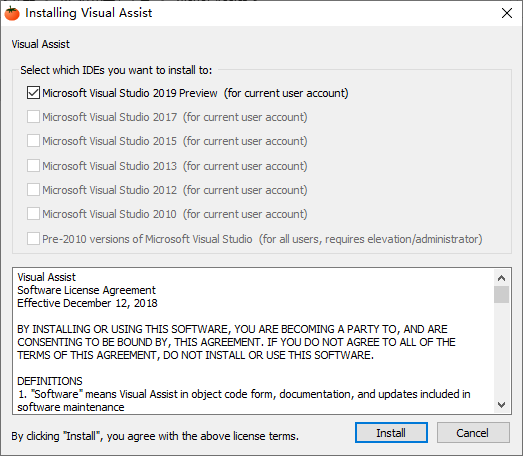
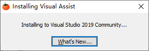

# 如何生成 chm


# Microsoft HTML帮助下载

https://docs.microsoft.com/zh-cn/previous-versions/windows/desktop/htmlhelp/microsoft-html-help-downloads?redirectedfrom=MSDN


# Win 10 安装latex


# css table 边框


# css 悬停 事件


# Doxygen 中文文档

http://read.pudn.com/downloads151/doc/653112/Doxygen_Using_Manual.pdf


# github 徽章

 

[](https://github.com/RichardLitt/standard-readme) 


http://shields.io/category/coverage


> https://github.com/straywriter/cmake-gtest-example | straywriter/cmake-gtest-example: cmake gtest example
> https://github.com/straywriter/cmake-gtest-example | straywriter/cmake-gtest-example: cmake gtest example
> https://www.google.com.hk/search?q=github+readme+%E6%96%87%E4%BB%B6%E6%80%8E%E4%B9%88%E5%86%99&oq=github+readme+%E6%96%87%E4%BB%B6%E6%80%8E%E4%B9%88%E5%86%99&aqs=chrome..69i57.6960j0j1&sourceid=chrome&ie=UTF-8 | github readme 文件怎么写 - Google 搜索
> https://www.cnblogs.com/wj-1314/p/8547763.html | 如何为开发项目编写规范的README文件（windows），此文详解 - 战争热诚 - 博客园
> https://blog.csdn.net/u012067966/article/details/50736647 | (19条消息) GitHub上README.md排版样式教程_需要时间-CSDN博客_github排版
> https://www.zhihu.com/question/29100816 | (5 封私信 / 5 条消息) 如何写好Github中的readme？ - 知乎
> https://github.com/RichardLitt/standard-readme | RichardLitt/standard-readme: A standard style for README files
> https://github.com/RichardLitt/standard-readme/blob/master/README.md | standard-readme/README.md at master · RichardLitt/standard-readme
> https://github.com/RichardLitt/standard-readme/blob/master/README.zh-CN.md | standard-readme/README.zh-CN.md at master · RichardLitt/standard-readme
> https://github.com/RichardLitt/standard-readme/issues/5 | Create a Standard Readme linter · Issue #5 · RichardLitt/standard-readme
> https://github.com/RichardLitt/standard-readme/blob/master/spec.md | standard-readme/spec.md at master · RichardLitt/standard-readme
> https://travis-ci.org/github/meolu/walden | meolu/walden - Travis CI
> https://github.com/meolu/walle-web | meolu/walle-web: walle - 瓦力 Devops开源项目代码部署平台
> https://gitter.im/meolu/walle-web | meolu/walle-web - Gitter
> https://github.com/RichardLitt/standard-readme | RichardLitt/standard-readme: A standard style for README files
> https://github.com/RichardLitt/standard-readme | RichardLitt/standard-readme: A standard style for README files
> https://www.google.com.hk/search?newwindow=1&safe=strict&ei=74XMX_fZCteB-QbS0YvYBA&q=Badge+GitHub&oq=Badge+GitHub&gs_lcp=CgZwc3ktYWIQAzICCAAyAggAMgIIADIGCAAQBRAeMgYIABAFEB4yBggAEAUQHjIGCAAQBRAeMgYIABAFEB4yBggAEAUQHjIGCAAQBRAeOgcIABBHELADOgQIABAMOgQIABAeUPYHWIIwYMoxaANwAngAgAHZAYgBgQmSAQUwLjQuMpgBAKABAaoBB2d3cy13aXrIAQXAAQE&sclient=psy-ab&ved=0ahUKEwi3jbO16LjtAhXXQN4KHdLoAksQ4dUDCA0&uact=5 | Badge GitHub - Google 搜索
> https://lpd-ios.github.io/2017/05/03/GitHub-Badge-Introduction/ | GitHub 项目徽章的添加和设置 - LPD-iOS
> http://shields.io/category/coverage | Shields.io: Quality metadata badges for open source projects
> https://github.com/Naereen/badges | Naereen/badges: Markdown code for lots of small badges (shields.io, forthebadge.com etc) . Contributions are welcome! Please add yours!
> https://github.com/badges/shields | badges/shields: Concise, consistent, and legible badges in SVG and raster format


# 如何写readme


https://github.com/RichardLitt/standard-readme


# VA vs2019 安装记录








# 记录

https://www.google.com.hk/search?q=cmake+%E6%B5%8B%E8%AF%95&oq=cmake+%E6%B5%8B%E8%AF%95&aqs=chrome.0.69i59j0l3j69i65j69i60l3.4068j0j1&sourceid=chrome&ie=UTF-8 | cmake 测试 - Google 搜索
https://qastack.cn/programming/14446495/cmake-project-structure-with-unit-tests | CMake：带有单元测试的项目结构
https://www.sohu.com/a/251930931_216613 | cmake-gtest单元测试_CMake
https://www.blurredcode.com/2019/04/452/ | 建立简单的带单元测试的CMake项目 | Blurred code
https://blog.csdn.net/EastonWoo/article/details/48393339 | (19条消息) cmake 使用 ctest 测试_EastonWoo的专栏-CSDN博客
https://www.daniweb.com/programming/software-development/threads/49698/fatal-error-lnk1169-one-or-more-multiply-defined-symbols-found | c++ - fatal error LNK1169: one or more multiply ... [SOLVED] | DaniWeb
https://my.oschina.net/u/4313718/blog/3471473 | "fatal error LNK1169: 找到一个或多个多重定义的符号" 解决方案 - osc_0zb4xeae的个人空间 - OSCHINA - 中文开源技术交流社区
https://www.cnblogs.com/VVingerfly/p/6056042.html | fatal error LNK1169: 找到一个或多个多重定义的符号 - VVingerfly - 博客园
https://blog.csdn.net/jh1513/article/details/52232756 | (19条消息) C++ “error LNK1169: 找到一个或多个多重定义的符号” 解决方法_jh1513的博客-CSDN博客
https://github.com/cdcseacave/TinyEXIF/blob/master/CMakeLists.txt | TinyEXIF/CMakeLists.txt at master · cdcseacave/TinyEXIF
https://stackoverflow.com/questions/10113017/setting-the-msvc-runtime-in-cmake | visual studio - Setting the MSVC runtime in CMake - Stack Overflow
https://www.coder.work/article/6377766 | visual-studio - 在CMake中设置MSVC运行时 - IT工具网
https://cmake.org/Wiki/CMake_FAQ#How_can_I_build_my_MSVC_application_with_a_static_runtime.3F | CMake FAQ - KitwarePublic
https://stackoverflow.com/questions/10113017/setting-the-msvc-%20runtime-in-cmake | visual studio - Setting the MSVC runtime in CMake - Stack Overflow
https://stackoverflow.com/questions/14172856/compile-with-mt-instead-of-md-using-cmake | Compile with /MT instead of /MD using CMake - Stack Overflow
https://stackoverflow.com/questions/64772397/cmake-runtime-library-configuration-for-visual-studio?noredirect=1&lq=1 | c++ - Cmake Runtime Library configuration for Visual studio - Stack Overflow


# [Compile with /MT instead of /MD using CMake](https://stackoverflow.com/questions/14172856/compile-with-mt-instead-of-md-using-cmake)

[Ask Question](https://stackoverflow.com/questions/ask)


# visual-studio - 在CMake中设置MSVC运行时 中文

https://www.coder.work/article/6377766

# [Setting the MSVC runtime in CMake](https://stackoverflow.com/questions/10113017/setting-the-msvc-runtime-in-cmake)


# cmake msvc 运行时

https://github.com/cdcseacave/TinyEXIF/blob/master/CMakeLists.txt


https://opensource.apple.com/source/clang/clang-700.1.81/src/projects/compiler-rt/CMakeLists.txt.auto.html

```cmake
# CMake build for CompilerRT.
#
# This build assumes that CompilerRT is checked out into the
# 'projects/compiler-rt' inside of an LLVM tree.
# Standalone build system for CompilerRT is not yet ready.
#
# An important constraint of the build is that it only produces libraries
# based on the ability of the host toolchain to target various platforms.

# Check if compiler-rt is built as a standalone project.
if (CMAKE_SOURCE_DIR STREQUAL CMAKE_CURRENT_SOURCE_DIR)
  project(CompilerRT C CXX)
  set(COMPILER_RT_STANDALONE_BUILD TRUE)
else()
  set(COMPILER_RT_STANDALONE_BUILD FALSE)
endif()

# The CompilerRT build system requires CMake version 2.8.8 or higher in order
# to use its support for building convenience "libraries" as a collection of
# .o files. This is particularly useful in producing larger, more complex
# runtime libraries.
if (NOT MSVC)
  cmake_minimum_required(VERSION 2.8.8)
else()
  # Version 2.8.12.1 is required to build with Visual Studion 2013.
  cmake_minimum_required(VERSION 2.8.12.1)
endif()

# FIXME: It may be removed when we use 2.8.12.
if(CMAKE_VERSION VERSION_LESS 2.8.12)
  # Invalidate a couple of keywords.
  set(cmake_2_8_12_INTERFACE)
  set(cmake_2_8_12_PRIVATE)
else()
  # Use ${cmake_2_8_12_KEYWORD} intead of KEYWORD in target_link_libraries().
  set(cmake_2_8_12_INTERFACE INTERFACE)
  set(cmake_2_8_12_PRIVATE PRIVATE)
  if(POLICY CMP0022)
    cmake_policy(SET CMP0022 NEW) # automatic when 2.8.12 is required
  endif()
endif()

# Top level target used to build all compiler-rt libraries.
add_custom_target(compiler-rt ALL)

if (NOT COMPILER_RT_STANDALONE_BUILD)
  # Compute the Clang version from the LLVM version.
  # FIXME: We should be able to reuse CLANG_VERSION variable calculated
  #        in Clang cmake files, instead of copying the rules here.
  string(REGEX MATCH "[0-9]+\\.[0-9]+(\\.[0-9]+)?" CLANG_VERSION
         ${PACKAGE_VERSION})
  # Setup the paths where compiler-rt runtimes and headers should be stored.
  set(COMPILER_RT_OUTPUT_DIR ${LLVM_LIBRARY_OUTPUT_INTDIR}/clang/${CLANG_VERSION})
  set(COMPILER_RT_EXEC_OUTPUT_DIR ${LLVM_RUNTIME_OUTPUT_INTDIR})
  set(COMPILER_RT_INSTALL_PATH lib${LLVM_LIBDIR_SUFFIX}/clang/${CLANG_VERSION})
  option(COMPILER_RT_INCLUDE_TESTS "Generate and build compiler-rt unit tests."
         ${LLVM_INCLUDE_TESTS})
 option(COMPILER_RT_ENABLE_WERROR "Fail and stop if warning is triggered"
        ${LLVM_ENABLE_WERROR})
  # Use just-built Clang to compile/link tests on all platforms, except for
  # Windows where we need to use clang-cl instead.
  if(NOT MSVC)
    set(COMPILER_RT_TEST_COMPILER ${LLVM_RUNTIME_OUTPUT_INTDIR}/clang)
  else()
    set(COMPILER_RT_TEST_COMPILER ${LLVM_RUNTIME_OUTPUT_INTDIR}/clang.exe)
  endif()
else()
  # Take output dir and install path from the user.
  set(COMPILER_RT_OUTPUT_DIR ${CMAKE_CURRENT_BINARY_DIR} CACHE PATH
    "Path where built compiler-rt libraries should be stored.")
  set(COMPILER_RT_EXEC_OUTPUT_DIR ${CMAKE_CURRENT_BINARY_DIR}/bin CACHE PATH
    "Path where built compiler-rt executables should be stored.")
  set(COMPILER_RT_INSTALL_PATH ${CMAKE_INSTALL_PREFIX} CACHE PATH
    "Path where built compiler-rt libraries should be installed.")
  option(COMPILER_RT_INCLUDE_TESTS "Generate and build compiler-rt unit tests." OFF)
  option(COMPILER_RT_ENABLE_WERROR "Fail and stop if warning is triggered" OFF)
  # Use a host compiler to compile/link tests.
  set(COMPILER_RT_TEST_COMPILER ${CMAKE_C_COMPILER} CACHE PATH "Compiler to use for testing")

  if (NOT LLVM_CONFIG_PATH)
    find_program(LLVM_CONFIG_PATH "llvm-config"
                 DOC "Path to llvm-config binary")
    if (NOT LLVM_CONFIG_PATH)
      message(FATAL_ERROR "llvm-config not found: specify LLVM_CONFIG_PATH")
    endif()
  endif()
  execute_process(
    COMMAND ${LLVM_CONFIG_PATH} "--obj-root" "--bindir" "--libdir" "--src-root"
    RESULT_VARIABLE HAD_ERROR
    OUTPUT_VARIABLE CONFIG_OUTPUT)
  if (HAD_ERROR)
    message(FATAL_ERROR "llvm-config failed with status ${HAD_ERROR}")
  endif()
  string(REGEX REPLACE "[ \t]*[\r\n]+[ \t]*" ";" CONFIG_OUTPUT ${CONFIG_OUTPUT})
  list(GET CONFIG_OUTPUT 0 LLVM_BINARY_DIR)
  list(GET CONFIG_OUTPUT 1 LLVM_TOOLS_BINARY_DIR)
  list(GET CONFIG_OUTPUT 2 LLVM_LIBRARY_DIR)
  list(GET CONFIG_OUTPUT 3 LLVM_MAIN_SRC_DIR)

  # Make use of LLVM CMake modules.
  file(TO_CMAKE_PATH ${LLVM_BINARY_DIR} LLVM_BINARY_DIR_CMAKE_STYLE)
  set(LLVM_CMAKE_PATH "${LLVM_BINARY_DIR_CMAKE_STYLE}/share/llvm/cmake")
  list(APPEND CMAKE_MODULE_PATH "${LLVM_CMAKE_PATH}")
  # Get some LLVM variables from LLVMConfig.
  include("${LLVM_CMAKE_PATH}/LLVMConfig.cmake")

  set(LLVM_LIBRARY_OUTPUT_INTDIR
    ${CMAKE_BINARY_DIR}/${CMAKE_CFG_INTDIR}/lib${LLVM_LIBDIR_SUFFIX})

  # Find Python interpreter.
  set(Python_ADDITIONAL_VERSIONS 2.7 2.6 2.5)
  include(FindPythonInterp)
  if(NOT PYTHONINTERP_FOUND)
    message(FATAL_ERROR "
      Unable to find Python interpreter required testing. Please install Python
      or specify the PYTHON_EXECUTABLE CMake variable.")
  endif()

  # Define default arguments to lit.
  set(LIT_ARGS_DEFAULT "-sv")
  if (MSVC OR XCODE)
    set(LIT_ARGS_DEFAULT "${LIT_ARGS_DEFAULT} --no-progress-bar")
  endif()
  set(LLVM_LIT_ARGS "${LIT_ARGS_DEFAULT}" CACHE STRING "Default options for lit")
endif()

if("${COMPILER_RT_TEST_COMPILER}" MATCHES "clang[+]*$")
  set(COMPILER_RT_TEST_COMPILER_ID Clang)
elseif("${COMPILER_RT_TEST_COMPILER}" MATCHES "clang.*.exe$")
  set(COMPILER_RT_TEST_COMPILER_ID Clang)
else()
  set(COMPILER_RT_TEST_COMPILER_ID GNU)
endif()

# Tests using XFAIL use the first value in COMPILER_RT_TEST_TARGET_TRIPLE
set(COMPILER_RT_TEST_TARGET_TRIPLE ${TARGET_TRIPLE} CACHE STRING
    "Default triple for cross-compiled executables")
string(REPLACE "-" ";" TARGET_TRIPLE_LIST ${COMPILER_RT_TEST_TARGET_TRIPLE})
list(GET TARGET_TRIPLE_LIST 0 COMPILER_RT_TEST_TARGET_ARCH)
list(GET TARGET_TRIPLE_LIST 1 COMPILER_RT_TEST_TARGET_OS)
list(GET TARGET_TRIPLE_LIST 2 COMPILER_RT_TEST_TARGET_ABI)

if ("${COMPILER_RT_TEST_TARGET_ABI}" STREQUAL "androideabi")
  set(ANDROID 1)
endif()

string(TOLOWER ${CMAKE_SYSTEM_NAME} COMPILER_RT_OS_DIR)
set(COMPILER_RT_LIBRARY_OUTPUT_DIR
  ${COMPILER_RT_OUTPUT_DIR}/lib/${COMPILER_RT_OS_DIR})
set(COMPILER_RT_LIBRARY_INSTALL_DIR
  ${COMPILER_RT_INSTALL_PATH}/lib/${COMPILER_RT_OS_DIR})

# Add path for custom compiler-rt modules.
set(CMAKE_MODULE_PATH
  "${CMAKE_CURRENT_SOURCE_DIR}/cmake"
  "${CMAKE_CURRENT_SOURCE_DIR}/cmake/Modules"
  ${CMAKE_MODULE_PATH}
  )
include(CompilerRTUtils)

set(COMPILER_RT_SOURCE_DIR ${CMAKE_CURRENT_SOURCE_DIR})
set(COMPILER_RT_BINARY_DIR ${CMAKE_CURRENT_BINARY_DIR})
# Setup custom SDK sysroots.
set(COMPILER_RT_LINUX_SDK_SYSROOT ${COMPILER_RT_SOURCE_DIR}/SDKs/linux)

# We support running instrumented tests when we're not cross compiling
# and target a UNIX-like system or Windows.
# We can run tests on Android even when we are cross-compiling.
if(("${CMAKE_HOST_SYSTEM}" STREQUAL "${CMAKE_SYSTEM}" AND (UNIX OR MSVC)) OR ANDROID
   OR COMPILER_RT_EMULATOR)
  option(COMPILER_RT_CAN_EXECUTE_TESTS "Can we execute instrumented tests" ON)
else()
  option(COMPILER_RT_CAN_EXECUTE_TESTS "Can we execute instrumented tests" OFF)
endif()

option(COMPILER_RT_DEBUG "Build runtimes with full debug info" OFF)
# COMPILER_RT_DEBUG_PYBOOL is used by lit.common.configured.in.
pythonize_bool(COMPILER_RT_DEBUG)

#================================
# Setup Compiler Flags
#================================
include(CheckIncludeFile)
check_include_file(unwind.h HAVE_UNWIND_H)

include(config-ix)

if(MSVC)
  append_string_if(COMPILER_RT_HAS_W3_FLAG /W3 CMAKE_C_FLAGS CMAKE_CXX_FLAGS)
else()
  append_string_if(COMPILER_RT_HAS_WALL_FLAG -Wall CMAKE_C_FLAGS CMAKE_CXX_FLAGS)
endif()
if(COMPILER_RT_ENABLE_WERROR)
  append_string_if(COMPILER_RT_HAS_WERROR_FLAG -Werror CMAKE_C_FLAGS CMAKE_CXX_FLAGS)
  append_string_if(COMPILER_RT_HAS_WX_FLAG /WX CMAKE_C_FLAGS CMAKE_CXX_FLAGS)
endif()

append_string_if(COMPILER_RT_HAS_STD_CXX11_FLAG -std=c++11 CMAKE_CXX_FLAGS)

# Emulate C99 and C++11's __func__ for MSVC prior to 2013 CTP.
if(NOT COMPILER_RT_HAS_FUNC_SYMBOL)
  add_definitions(-D__func__=__FUNCTION__)
endif()

# Provide some common commmandline flags for Sanitizer runtimes.
append_list_if(COMPILER_RT_HAS_FPIC_FLAG -fPIC SANITIZER_COMMON_CFLAGS)
append_list_if(COMPILER_RT_HAS_FNO_BUILTIN_FLAG -fno-builtin SANITIZER_COMMON_CFLAGS)
append_list_if(COMPILER_RT_HAS_FNO_EXCEPTIONS_FLAG -fno-exceptions SANITIZER_COMMON_CFLAGS)
append_list_if(COMPILER_RT_HAS_FOMIT_FRAME_POINTER_FLAG -fomit-frame-pointer SANITIZER_COMMON_CFLAGS)
append_list_if(COMPILER_RT_HAS_FUNWIND_TABLES_FLAG -funwind-tables SANITIZER_COMMON_CFLAGS)
append_list_if(COMPILER_RT_HAS_FNO_STACK_PROTECTOR_FLAG -fno-stack-protector SANITIZER_COMMON_CFLAGS)
append_list_if(COMPILER_RT_HAS_FVISIBILITY_HIDDEN_FLAG -fvisibility=hidden SANITIZER_COMMON_CFLAGS)
append_list_if(COMPILER_RT_HAS_FNO_FUNCTION_SECTIONS_FLAG -fno-function-sections SANITIZER_COMMON_CFLAGS)
append_list_if(COMPILER_RT_HAS_FNO_LTO_FLAG -fno-lto SANITIZER_COMMON_CFLAGS)

if(MSVC)
  # Replace the /MD[d] flags with /MT.
  # FIXME: In fact, sanitizers should support both /MT and /MD, see PR20214.
  if(COMPILER_RT_HAS_MT_FLAG)
    foreach(flag_var
      CMAKE_CXX_FLAGS CMAKE_CXX_FLAGS_DEBUG CMAKE_CXX_FLAGS_RELEASE
      CMAKE_CXX_FLAGS_MINSIZEREL CMAKE_CXX_FLAGS_RELWITHDEBINFO)
      if(${flag_var} MATCHES "/MD")
        string(REGEX REPLACE "/MD" "/MT" ${flag_var} "${${flag_var}}")
      elseif(${flag_var} MATCHES "/MDd")
        string(REGEX REPLACE "/MDd" "/MT" ${flag_var} "${${flag_var}}")
      endif()
    endforeach()
  endif()
  append_list_if(COMPILER_RT_HAS_Oy_FLAG /Oy- SANITIZER_COMMON_CFLAGS)
  append_list_if(COMPILER_RT_HAS_GS_FLAG /GS- SANITIZER_COMMON_CFLAGS)
endif()

append_list_if(COMPILER_RT_DEBUG -DSANITIZER_DEBUG=1 SANITIZER_COMMON_CFLAGS)

# Build with optimization, unless we're in debug mode. If we're using MSVC,
# always respect the optimization flags set by CMAKE_BUILD_TYPE instead.
if(NOT COMPILER_RT_DEBUG AND NOT MSVC)
  list(APPEND SANITIZER_COMMON_CFLAGS -O3)
endif()

# Determine if we should restrict stack frame sizes.
# Stack frames on PowerPC and in debug biuld can be much larger than
# anticipated.
# FIXME: Fix all sanitizers and add -Wframe-larger-than to
# SANITIZER_COMMON_FLAGS
if(COMPILER_RT_HAS_WFRAME_LARGER_THAN_FLAG AND NOT COMPILER_RT_DEBUG
   AND NOT ${LLVM_NATIVE_ARCH} STREQUAL "PowerPC")
  set(SANITIZER_LIMIT_FRAME_SIZE TRUE)
else()
  set(SANITIZER_LIMIT_FRAME_SIZE FALSE)
endif()

# Build sanitizer runtimes with debug info.
if(COMPILER_RT_HAS_GLINE_TABLES_ONLY_FLAG AND NOT COMPILER_RT_DEBUG)
  list(APPEND SANITIZER_COMMON_CFLAGS -gline-tables-only)
elseif(COMPILER_RT_HAS_G_FLAG)
  list(APPEND SANITIZER_COMMON_CFLAGS -g)
elseif(COMPILER_RT_HAS_Zi_FLAG)
  list(APPEND SANITIZER_COMMON_CFLAGS /Zi)
endif()

# Turn off several warnings.
append_list_if(COMPILER_RT_HAS_WGNU_FLAG -Wno-gnu SANITIZER_COMMON_CFLAGS)
append_list_if(COMPILER_RT_HAS_WVARIADIC_MACROS_FLAG -Wno-variadic-macros SANITIZER_COMMON_CFLAGS)
append_list_if(COMPILER_RT_HAS_WC99_EXTENSIONS_FLAG -Wno-c99-extensions SANITIZER_COMMON_CFLAGS)
append_list_if(COMPILER_RT_HAS_WNON_VIRTUAL_DTOR_FLAG -Wno-non-virtual-dtor SANITIZER_COMMON_CFLAGS)
append_list_if(COMPILER_RT_HAS_WD4146_FLAG /wd4146 SANITIZER_COMMON_CFLAGS)
append_list_if(COMPILER_RT_HAS_WD4291_FLAG /wd4291 SANITIZER_COMMON_CFLAGS)
append_list_if(COMPILER_RT_HAS_WD4391_FLAG /wd4391 SANITIZER_COMMON_CFLAGS)
append_list_if(COMPILER_RT_HAS_WD4722_FLAG /wd4722 SANITIZER_COMMON_CFLAGS)
append_list_if(COMPILER_RT_HAS_WD4800_FLAG /wd4800 SANITIZER_COMMON_CFLAGS)
if(APPLE)
  macro(find_darwin_sdk_dir var sdk_name)
    # Let's first try the internal SDK, otherwise use the public SDK.
    execute_process(
      COMMAND xcodebuild -version -sdk ${sdk_name}.internal Path
      OUTPUT_VARIABLE ${var}
      OUTPUT_STRIP_TRAILING_WHITESPACE
      ERROR_FILE /dev/null
    )
    if(${var} STREQUAL "")
      execute_process(
        COMMAND xcodebuild -version -sdk ${sdk_name} Path
        OUTPUT_VARIABLE ${var}
        OUTPUT_STRIP_TRAILING_WHITESPACE
        ERROR_FILE /dev/null
      )
    endif()
  endmacro()

  find_darwin_sdk_dir(OSX_SDK_DIR macosx)
  find_darwin_sdk_dir(IOSSIM_SDK_DIR iphonesimulator)
  find_darwin_sdk_dir(IOS_SDK_DIR iphoneos)
  find_darwin_sdk_dir(WATCHOSSIM_SDK_DIR watchsimulator)
  find_darwin_sdk_dir(WATCHOS_SDK_DIR watchos)

  string(REGEX MATCH "-mmacosx-version-min="
         MACOSX_VERSION_MIN_FLAG "${CMAKE_CXX_FLAGS}")
  set(SANITIZER_COMMON_SUPPORTED_DARWIN_OS osx)
  set(SANITIZER_COMMON_DARWIN_osx_ARCHES "i386;x86_64;x86_64h")
  darwin_drop_unsupported_arches(osx)

  set(SANITIZER_MIN_OSX_VERSION 10.7)
  set(SANITIZER_MIN_IOSSIM_VERSION 7.0)
  set(SANITIZER_MIN_IOS_VERSION 6.0)
  set(SANITIZER_MIN_WATCHOSSIM_VERSION 1.0)
  set(SANITIZER_MIN_WATCHOS_VERSION 1.0)
  set(CMAKE_OSX_DEPLOYMENT_TARGET "") # We're setting the flag manually below.
  set(DARWIN_osx_CFLAGS -mmacosx-version-min=${SANITIZER_MIN_OSX_VERSION}
    -isysroot ${OSX_SDK_DIR} -stdlib=libc++)
  set(DARWIN_iossim_CFLAGS
    -mios-simulator-version-min=${SANITIZER_MIN_IOSSIM_VERSION}
    -stdlib=libc++ -isysroot ${IOSSIM_SDK_DIR})
  set(DARWIN_ios_CFLAGS -miphoneos-version-min=${SANITIZER_MIN_IOS_VERSION}
    -stdlib=libc++ -isysroot ${IOS_SDK_DIR})
  set(DARWIN_watchossim_CFLAGS
    -stdlib=libc++
    -mwatchos-version-min=${SANITIZER_MIN_WATCHOSSIM_VERSION}
    -isysroot ${WATCHOSSIM_SDK_DIR})
  set(DARWIN_watchos_CFLAGS
    -stdlib=libc++
    -mwatchos-version-min=${SANITIZER_MIN_WATCHOS_VERSION}
    -isysroot ${WATCHOS_SDK_DIR})
  set(DARWIN_osx_LINKFLAGS -mmacosx-version-min=${SANITIZER_MIN_OSX_VERSION}
    -isysroot ${OSX_SDK_DIR} -stdlib=libc++)
  set(DARWIN_iossim_LINKFLAGS
    -Wl,-ios_simulator_version_min,${SANITIZER_MIN_IOSSIM_VERSION}
    -mios-simulator-version-min=${SANITIZER_MIN_IOSSIM_VERSION}
    -stdlib=libc++ -isysroot ${IOSSIM_SDK_DIR})
  set(DARWIN_ios_LINKFLAGS -miphoneos-version-min=${SANITIZER_MIN_IOS_VERSION}
    -Wl,-segalign,0x4000 -stdlib=libc++ -isysroot ${IOS_SDK_DIR})
  set(DARWIN_watchossim_LINKFLAGS
    -stdlib=libc++ -lc++
    -mwatchos-simulator-version-min=${SANITIZER_MIN_WATCHOSSIM_VERSION}
    -isysroot ${WATCHOSSIM_SDK_DIR})
  set(DARWIN_watchos_LINKFLAGS
    -stdlib=libc++ -lc++
    -mwatchos-version-min=${SANITIZER_MIN_WATCHOS_VERSION}
    -isysroot ${WATCHOS_SDK_DIR})

  if (IOSSIM_SDK_DIR AND NOT MACOSX_VERSION_MIN_FLAG)
    set(SANITIZER_COMMON_DARWIN_iossim_ARCHES "i386;x86_64")
    darwin_drop_unsupported_arches(iossim)
    if(SANITIZER_COMMON_DARWIN_iossim_ARCHES)
      list(APPEND SANITIZER_COMMON_SUPPORTED_DARWIN_OS iossim)
    endif()
  endif()

  if (IOS_SDK_DIR AND NOT MACOSX_VERSION_MIN_FLAG)
    set(SANITIZER_COMMON_DARWIN_ios_ARCHES "armv7;armv7s;arm64")
    darwin_drop_unsupported_arches(ios)
    if(SANITIZER_COMMON_DARWIN_ios_ARCHES)
      list(APPEND SANITIZER_COMMON_SUPPORTED_DARWIN_OS ios)
    endif()
  endif()

  if (WATCHOS_SDK_DIR AND NOT MACOSX_VERSION_MIN_FLAG)
    set(SANITIZER_COMMON_DARWIN_watchos_ARCHES "armv7;armv7k;armv7s;arm64")
    darwin_drop_unsupported_arches(watchos)
    if(SANITIZER_COMMON_DARWIN_watchos_ARCHES)
      list(APPEND SANITIZER_COMMON_SUPPORTED_DARWIN_OS watchos)
    endif()
  endif()

  if (WATCHOSSIM_SDK_DIR AND NOT MACOSX_VERSION_MIN_FLAG)
    set(SANITIZER_COMMON_DARWIN_watchossim_ARCHES "i386;x86_64")
    darwin_drop_unsupported_arches(watchossim)
    if(SANITIZER_COMMON_DARWIN_watchossim_ARCHES)
      list(APPEND SANITIZER_COMMON_SUPPORTED_DARWIN_OS watchossim)
    endif()
  endif()
endif()

add_subdirectory(include)

set(COMPILER_RT_LIBCXX_PATH ${LLVM_MAIN_SRC_DIR}/projects/libcxx)
if(EXISTS ${COMPILER_RT_LIBCXX_PATH}/)
  set(COMPILER_RT_HAS_LIBCXX_SOURCES TRUE)
else()
  set(COMPILER_RT_HAS_LIBCXX_SOURCES FALSE)
endif()

add_subdirectory(lib)

if(COMPILER_RT_INCLUDE_TESTS)
  add_subdirectory(unittests)
endif()
add_subdirectory(test)
```


# CMAKE msvc error LNK2038: 检测到“RuntimeLibrary”的不匹配项

https://www.google.com.hk/search?q=error+LNK2038%3A+%E6%A3%80%E6%B5%8B%E5%88%B0%E2%80%9CRuntimeLibrary%E2%80%9D%E7%9A%84%E4%B8%8D%E5%8C%B9%E9%85%8D%E9%A1%B9&oq=error+LNK2038%3A+%E6%A3%80%E6%B5%8B%E5%88%B0%E2%80%9CRuntimeLibrary%E2%80%9D%E7%9A%84%E4%B8%8D%E5%8C%B9%E9%85%8D%E9%A1%B9&aqs=chrome..69i57j69i59j69i60l3.565j0j1&sourceid=chrome&ie=UTF-8 | error LNK2038: 检测到“RuntimeLibrary”的不匹配项 - Google 搜索
https://www.shuzhiduo.com/A/qVdeWODpJP/ | 【Cef编译】 CefSharp编译失败，检测到“RuntimeLibrary”的不匹配项: 值“MT_StaticRelease”不匹配值“MD_DynamicRelease”
https://github.com/PaddlePaddle/PaddleOCR/issues/1311 | LNK2038 检测到“RuntimeLibrary”的不匹配项: 值“MT_StaticRelease”不匹配值“MD_DynamicRelease”(clipper.obj 中) ocr_system D:\PythonProject\PaddleOCR-develop\deploy\cpp_infer\build\libpaddle_fluid.lib(api.obj) · Issue #1311 · PaddlePaddle/PaddleOCR
https://article.itxueyuan.com/bR3vq | error LNK2038: 检测到“RuntimeLibrary”的不匹配项: 值“MTd_StaticDebug”不匹配值“MDd_DynamicDebug
https://www.51dev.com/cplus/6176 | error LNK2038: 检测到“RuntimeLibrary”的不匹配项: 值“MDd_DynamicDebug”不匹配值“MTd_StaticDebug”_51dev.com it技术开发者社区
https://www.itdaan.com/blog/2016/06/20/d928a7fd742b.html | error LNK2038: 检测到“RuntimeLibrary”的不匹配项: 值“MDd_DynamicDebug”不匹配值“MTd_StaticDebug” - 开发者知识库
https://www.cnblogs.com/jieliujas/p/8778389.html | error LNK2038: 检测到“RuntimeLibrary”的不匹配项: 值“MTd_StaticDebug”不匹配值“MDd_DynamicDebug - 一只羊JAS - 博客园
https://blog.csdn.net/xingkongfenqi/article/details/49180075 | (19条消息) error LNK2038: 检测到“RuntimeLibrary”的不匹配项的解决办法_sky0942的博客-CSDN博客


# vscode 重启

\> Reload Window


#  fatal error LNK1169: 找到一个或多个多重定义的符号


# error LNK2038: 检测到“RuntimeLibrary”的不匹配项:


# 颜色空间

https://www.google.com.hk/search?newwindow=1&safe=strict&ei=xhXKX5GIF6nxhwOum6OQBg&q=%E5%85%89%E8%B0%B1&oq=%E5%85%89%E8%B0%B1&gs_lcp=CgZwc3ktYWIQAzICCAAyAggAMgIIADICCAAyAggAMgIIADICCAAyAggAMgIIADICCAA6BAgAEENQqI0BWKiwAWDVsQFoB3AAeAGAAfQEiAHuFZIBCTItMi40LjEuMZgBAKABAaoBB2d3cy13aXqwAQDAAQE&sclient=psy-ab&ved=0ahUKEwiRg4mWlbTtAhWp-GEKHa7NCGIQ4dUDCA0&uact=5 | 光谱 - Google 搜索
https://www.jianshu.com/p/8ff4872e088f | RGB、CMY、CMYK、YUV、HSV、HSI、LAB颜色空间详解 - 简书
http://tool.oschina.net/commons?type=3 | 500 Internal Privoxy Error
https://www.google.com.hk/search?q=RGB%E3%80%81CMY%E3%80%81CMYK%E3%80%81YUV%E3%80%81HSV%E3%80%81HSI%E3%80%81LAB%E9%A2%9C%E8%89%B2%E7%A9%BA%E9%97%B4%E8%AF%A6%E8%A7%A3%20...www.jianshu.com%20%E2%80%BA%20... | RGB、CMY、CMYK、YUV、HSV、HSI、LAB颜色空间详解 ...www.jianshu.com › ... - Google 搜索
https://www.jianshu.com/p/9b51296fbe47 | 颜色空间 - 简书
https://www.jianshu.com/p/f03e9ac9c9ef | 深入理解color model(颜色模型) - 简书
https://baike.baidu.com/item/%E8%89%B2%E5%BD%A9%E7%A9%BA%E9%97%B4 | 色彩空间_百度百科
https://blog.csdn.net/weiweigfkd/article/details/20898937
https://zhuanlan.zhihu.com/p/67930839 | RGB、HSV和HSL颜色空间 - 知乎
https://zhuanlan.zhihu.com/p/28741691 | 数字图像处理之6大颜色空间 - 知乎
https://zh.wikipedia.org/wiki/%E8%89%B2%E5%BD%A9%E7%A9%BA%E9%96%93 | 色彩空间 - 维基百科，自由的百科全书
https://www.cambridgeincolour.com/tutorials/color-space-conversion.htm | Color Management: Color Space Conversion
https://www.google.com.hk/search?newwindow=1&safe=strict&ei=YhnKX-meEsaxmAWPvpDwAQ&q=YUV&oq=YUV&gs_lcp=CgZwc3ktYWIQAzICCAAyAggAMgIIADICCAAyAggAMgIIADICCAAyAggAMgIIADICCABQAFgAYM4BaABwAHgAgAG7AogBuwKSAQMzLTGYAQCqAQdnd3Mtd2l6&sclient=psy-ab&ved=0ahUKEwjp19DOmLTtAhXGGKYKHQ8fBB4Q4dUDCA0&uact=5 | YUV - Google 搜索
https://zh.wikipedia.org/zh-sg/YUV#YUV%E8%BD%89RGB | YUV - 维基百科，自由的百科全书
https://zh.m.wikipedia.org/zh/YCbCr | YCbCr - 维基百科，自由的百科全书
https://en.wikipedia.org/wiki/YCbCr | YCbCr - Wikipedia
https://baike.baidu.com/item/YCrCb/10874556 | YCrCb_百度百科