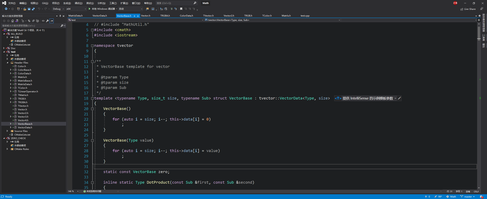
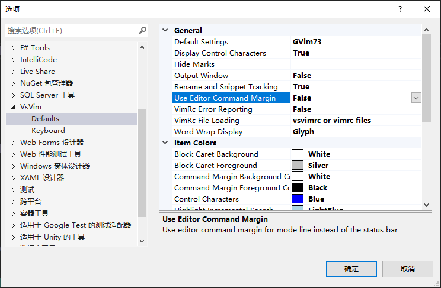
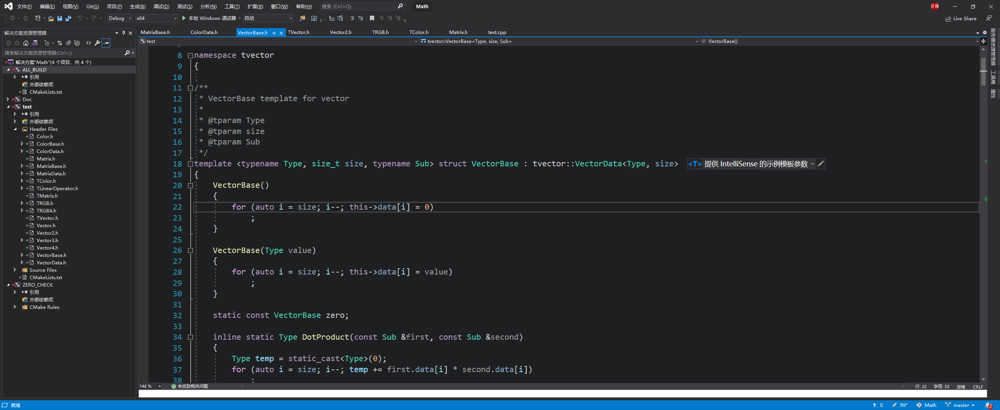
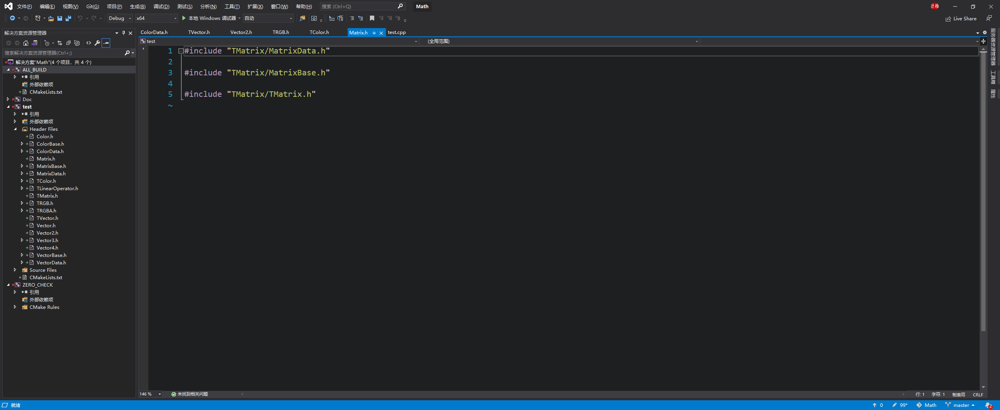
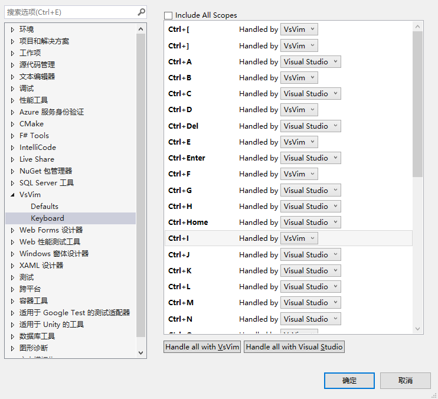
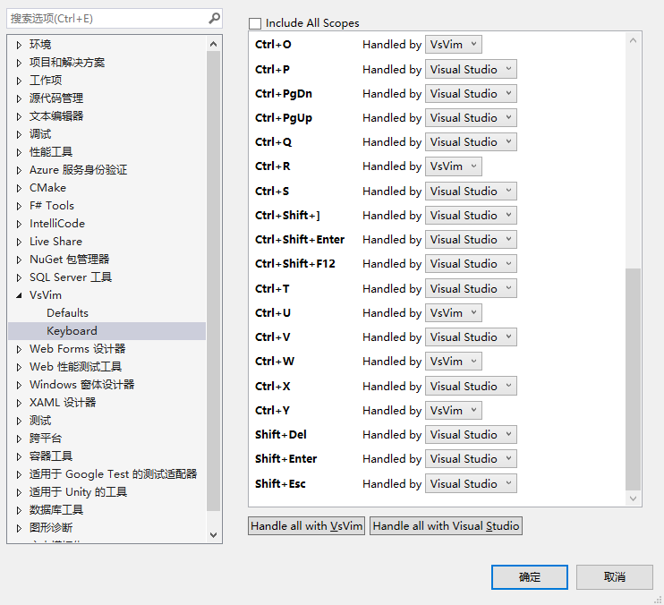
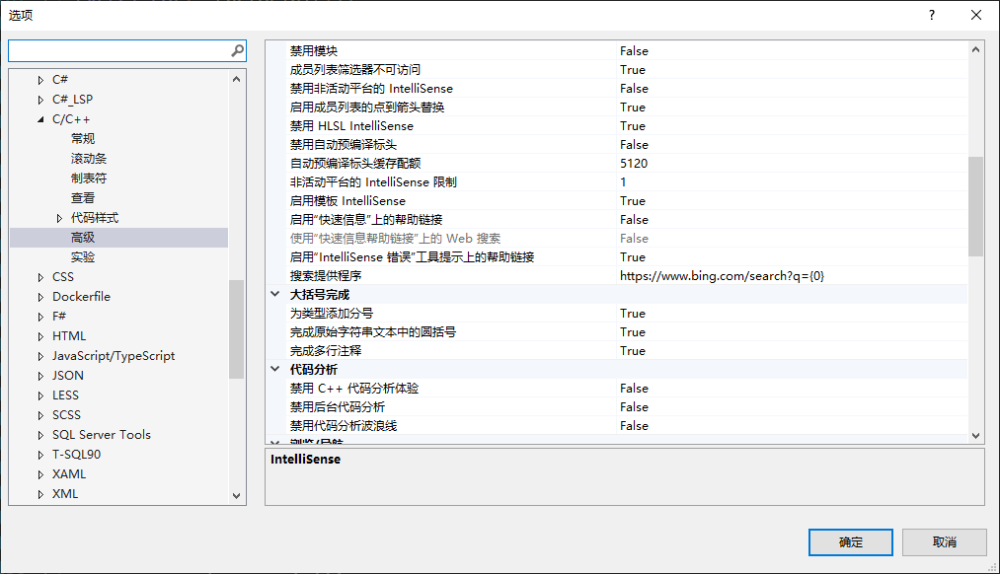

# vs 2017 重新安装记录


## 下载我的主题文件

https://gist.github.com/straywriter/a95b418770d6c205cb1f7342eb3b2317


导入后



## 安装VA  

链接：https://pan.baidu.com/s/1ocjR365MtKHJpqcTCgRv2w 
提取码：sp3k 
复制这段内容后打开百度网盘手机App，操作更方便哦--来自百度网盘超级会员V5的分享

安装2393


## 安装其他插件 vsVim Doxygen

## vsvim

此选项关闭














# clang format 格式


# vs 插件


# vs 快捷键管理插件


# tomorrow 主题


# vs 快捷键

https://docs.microsoft.com/zh-cn/visualstudio/ide/default-keyboard-shortcuts-in-visual-studio?view=vs-2019


# vs 取消在线 联机搜索



# vs 重置设置

两种方式


# 快速反平方根倒数


# https://www.geometrictools.com/index.html


# C++ 匿名对象

https://www.google.com.hk/search?newwindow=1&safe=strict&ei=uGrIX5jxLoqymAXV2KXICw&q=c%2B%2B+%E5%8C%BF%E5%90%8D%E7%BB%93%E6%9E%84&oq=c%2B%2B+%E5%8C%BF%E5%90%8D%E7%BB%93%E6%9E%84&gs_lcp=CgZwc3ktYWIQAzIECAAQDDoCCABQ6aMOWNS0DmDntQ5oAXAAeAGAAbsGiAG_E5IBCTItNC41LTEuMZgBAKABAaoBB2d3cy13aXrAAQE&sclient=psy-ab&ved=0ahUKEwiYrcfz_bDtAhUKGaYKHVVsCbkQ4dUDCA0&uact=5 | c++ 匿名结构 - Google 搜索
https://www.thinbug.com/q/56741468 | 使用匿名联合为struct创建空的构造函数 - Thinbug
http://www.jeepxie.net/article/675248.html
https://docs.microsoft.com/zh-cn/cpp/cpp/anonymous-class-types?view=msvc-160 | 匿名类类型 | Microsoft Docs
https://www.zhihu.com/question/52192165 | (5 封私信 / 80 条消息) 在 C++11 中，如何为匿名的结构体添加构造函数？ - 知乎
https://www.coder.work/article/123083
https://blog.csdn.net/u013566722/article/details/79430652 | (20条消息) 匿名结构体与匿名联合体_kuikuitage的博客-CSDN博客
http://www.jeepxie.net/article/440235.html
https://roachsinai.github.io/Cpp-learning-notes/declaration/namespace/anonymous.html | 匿名命名空间 · C++拾遗
https://www.coder.work/article/578640
https://www.coder.work/article/578640
https://www.coder.work/article/569602 | c++ - 如何匿名声明std::thread？ - IT工具网
https://www.coder.work/article/569602
https://blog.csdn.net/edwardlulinux/article/details/80790564 | (20条消息) C++ 匿名变量的一些理解_edwardlulinux的专栏-CSDN博客
https://docs.oracle.com/cd/E22055_01/html/821-2509/bkaek.html | 4.6 将 enum 名称作为作用域限定符 - Oracle Solaris Studio 12.2：C++ 用户指南
https://docs.oracle.com/cd/E19205-01/820-1214/bkael/index.html | 4.7 使用匿名 struct 声明 (Sun Studio 12：C++ 用户指南)
https://www.coder.work/article/1220277 | c++ - 什么时候从内存中删除匿名对象，何时建议使用它们？ - IT工具网
http://www.360doc.com/content/16/1115/16/10408243_606781083.shtml | C++ 匿名对象的使用
https://www.cnblogs.com/zhanggaofeng/p/5625987.html | C++ 匿名对象产生场景 - 寒魔影 - 博客园
https://my.oschina.net/u/1783725/blog/656271 | C++中引用和匿名对象的理解和本质剖析 - 沙米笔记的个人空间 - OSCHINA - 中文开源技术交流社区
https://blog.csdn.net/u010936800/article/details/51604649 | (18条消息) C++中的匿名对象_baby的专栏-CSDN博客_c++匿名对象
https://blog.csdn.net/a8887396/article/details/8785994 | (20条消息) C++学习笔记（十七） 匿名对象的优化与使用_赵一弘的博客-CSDN博客
https://www.cnblogs.com/pzhfei/archive/2013/01/14/lambda_expression.html | C++11中的匿名函数(lambda函数,lambda表达式) - 缘来是梦 - 博客园


# 3d 数学库

https://www.zhihu.com/search?type=content&q=3d%20%E6%95%B0%E5%AD%A6%E5%BA%93 | (5 封私信 / 80 条消息) 3d 数学库 - 搜索结果 - 知乎
https://zhuanlan.zhihu.com/p/66030605 | 太極：MIT华人学神开源的计算机图形库 - 知乎
https://zhuanlan.zhihu.com/p/102124442 | 3D数学 - 知乎
https://www.zhihu.com/question/36814207 | (5 封私信 / 80 条消息) 如何用C++设计一个 3D 数学库？ - 知乎
https://zh.wikipedia.org/wiki/%E5%A5%87%E5%BC%82%E9%80%92%E5%BD%92%E6%A8%A1%E6%9D%BF%E6%A8%A1%E5%BC%8F | 奇异递归模板模式 - 维基百科，自由的百科全书
https://zh.wikipedia.org/wiki/%E6%A8%A1%E6%9D%BF_(C%2B%2B) | 模板 (C++) - 维基百科，自由的百科全书
https://github.com/mmp/pbrt-v3/blob/master/src/core/geometry.h#L279 | pbrt-v3/geometry.h at master · mmp/pbrt-v3
https://github.com/bulletphysics/bullet3/tree/master/src/LinearMath | bullet3/src/LinearMath at master · bulletphysics/bullet3
http://www.songho.ca/opengl/gl_matrix.html | OpenGL Matrix Class
https://github.com/Unity-Technologies/Unity.Mathematics | Unity-Technologies/Unity.Mathematics: The C# math library used in Unity providing vector types and math functions with a shader like syntax
https://github.com/Ubpa/UGM | Ubpa/UGM: Ubpa Graphics Mathematics
https://www.google.com.hk/search?q=%E5%8D%95%E7%BB%A7%E6%89%BF%E5%8C%96%E6%8A%80%E6%9C%AF | 单继承化技术 - Google 搜索
https://www.cnblogs.com/cy568searchx/p/3707384.html | C++继承 派生类中的内存布局（单继承、多继承、虚拟继承） - 星语海蓝 - 博客园
https://zhuanlan.zhihu.com/p/106672814 | C++ | 单继承化 - 知乎
https://www.zhihu.com/people/UbpaX/posts | (5 封私信 / 80 条消息) Ubp.a - 知乎
https://zhuanlan.zhihu.com/p/131145847 | 开源！C++ 图形数学库 UGM - 知乎
https://zhuanlan.zhihu.com/p/106672814 | C++ | 单继承化 - 知乎
https://github.com/Ubpa/UTemplate/blob/master/include/UTemplate/TypeID.h | UTemplate/TypeID.h at master · Ubpa/UTemplate
https://zhuanlan.zhihu.com/p/106982496 | C++ | TemplateList - 知乎
https://devblogs.microsoft.com/cppblog/optimizing-the-layout-of-empty-base-classes-in-vs2015-update-2-3/ | Optimizing the Layout of Empty Base Classes in VS2015 Update 2 | C++ Team Blog
https://www.google.com.hk/search?q=coding%20overhead | coding overhead - Google 搜索
https://sourcegraph.com/github.com/Ubpa/UGM/-/blob/include/UGM/rgba.h#L7 | rgba.h - Ubpa/UGM - Sourcegraph
https://www.zhihu.com/question/433033794 | (5 封私信 / 99+ 条消息) OpenGL GL_SELECT 拾取方案取消后，有没有给出代替方案？ - 知乎


# C++ 继承 有缘 运算符重载


# cmaek doxygen 记录

https://www.google.com.hk/search?q=cmake+doxygen&oq=cmake+doxygen&aqs=chrome..69i57j69i64j69i59l2j69i65j69i60l2j69i61.7004j0j1&sourceid=chrome&ie=UTF-8 | cmake doxygen - Google 搜索
https://medium.com/practical-coding/c-documentation-with-doxygen-cmake-sphinx-breathe-for-those-of-use-who-are-totally-lost-7d555386fe13 | C++ documentation with Doxygen/CMake/Sphinx/Breathe for those of us who are totally lost | by Oliver K. Ernst | Practical coding | Medium
https://github.com/smrfeld/cpp_doxygen_sphinx | smrfeld/cpp_doxygen_sphinx: Tutorial for a C++ Doxygen CMake Sphinx Breathe Pipeline
https://github.com/smrfeld/cpp_doxygen_sphinx/blob/master/README_doxygen.md | cpp_doxygen_sphinx/README_doxygen.md at master · smrfeld/cpp_doxygen_sphinx
https://vicrucann.github.io/tutorials/quick-cmake-doxygen/ | Quick setup to use Doxygen with CMake Victoria Rudakova
https://devblogs.microsoft.com/cppblog/clear-functional-c-documentation-with-sphinx-breathe-doxygen-cmake/ | Sphinx +呼吸+ Doxygen + CMake提供的清晰，功能齐全的C ++文档| C ++团队博客
https://www.google.com.hk/search?q=Sphinx | Sphinx - Google 搜索
https://medium.com/@karlsson.vom.dach/c-documentation-with-doxygen-cmake-sphinx-breathe-for-those-of-use-who-are-totally-lost-452c9829deaa | 410 Deleted by author — Medium
https://vicrucann.github.io/tutorials/quick-cmake-doxygen/ | Quick setup to use Doxygen with CMake Victoria Rudakova
https://devblogs.microsoft.com/cppblog/clear-functional-c-documentation-with-sphinx-breathe-doxygen-cmake/ | Clear, Functional C++ Documentation with Sphinx + Breathe + Doxygen + CMake | C++ Team Blog
https://devblogs.microsoft.com/cppblog/clear-functional-c-documentation-with-sphinx-breathe-doxygen-cmake/ | Clear, Functional C++ Documentation with Sphinx + Breathe + Doxygen + CMake | C++ Team Blog
https://p5r.uk/blog/2014/cmake-doxygen.html | A cmake configuration for Doxygen
https://stackoverflow.com/questions/34878276/build-doxygen-from-cmake-script | Build doxygen from CMake script - Stack Overflow
https://vicrucann.github.io/tutorials/quick-cmake-doxygen/ | Quick setup to use Doxygen with CMake Victoria Rudakova
https://codedocs.xyz/ | CodeDocs[xyz]
https://cmake.org/cmake/help/latest/module/FindDoxygen.html | FindDoxygen — CMake 3.19.1文档
https://www.google.com.hk/search?q=doxygen_add_docs | doxygen_add_docs - Google 搜索
https://www.lagou.com/lgeduarticle/74876.html
https://community.opengroup.org/osdu/platform/domain-data-mgmt-services/seismic/open-vds/-/blob/d37b9e5b6f306261313f1624833aec5e74b2860d/docs/CMakeLists.txt | docs/CMakeLists.txt · d37b9e5b6f306261313f1624833aec5e74b2860d · Open Subsurface Data Universe Software / Platform / Domain Data Mgmt Services / Seismic / Open VDS · GitLab
https://antonypeacock.blog/blog/ | 博客– Antony的软件博客
https://majewsky.wordpress.com/2010/08/14/tip-of-the-day-cmake-and-doxygen/ | 每日贴士：CMake和Doxygen | 极客将继承地球
https://p5r.uk/blog/2014/cmake-doxygen.html | A cmake configuration for Doxygen
https://vicrucann.github.io/tutorials/quick-cmake-doxygen/ | Quick setup to use Doxygen with CMake Victoria Rudakova
https://gitlab.kitware.com/cmake/cmake/-/merge_requests/1745 | FindDoxygen：改进`doxygen_add_docs`（！1745）·合并请求·CMake / CMake·GitLab
https://aliceo2group.github.io/advanced/doxygen.html | Doxygen


# tga 记录


> https://hackage.haskell.org/package/GLFW-0.3/src/glfw/lib/tga.c | https://hackage.haskell.org/package/GLFW-0.3/src/glfw/lib/tga.c
> https://www.khronos.org/opengl/wiki/Image_Libraries | Image Libraries - OpenGL Wiki
> https://www.codeproject.com/Articles/1300/CxImage | CxImage - CodeProject
> https://unix4lyfe.org/targa/ | Targa reader/writer
> https://unix4lyfe.org/targa/targa.h | https://unix4lyfe.org/targa/targa.h
> https://unix4lyfe.org/targa/targa.c | https://unix4lyfe.org/targa/targa.c
> https://gamedev.stackexchange.com/questions/31958/how-can-i-read-tga-and-blp-image-files-in-c | How can I read .TGA and .BLP image files in C++? - Game Development Stack Exchange
> https://www.gamedev.net/forums/topic/349893-blizzards-blp-image-format/ | Blizzard's BLP image format - Graphics and GPU Programming - GameDev.net
> http://www.lonesock.net/soil.html | www.lonesock.net/soil.html
> http://nehe.gamedev.net/tutorial/loading_compressed_and_uncompressed_tga%27s/22001/ | NeHe Productions: Loading Compressed And Uncompressed TGA's
> https://www.gamedev.net/forums/topic/349893-blizzards-blp-image-format/ | Blizzard's BLP image format - Graphics and GPU Programming - GameDev.net
> http://www.cplusplus.com/forum/windows/84178/ | [Win32API] Load TGA Image? - C++ Forum
> https://www.leadtools.com/help/sdk/v20/main/clib/truevision-targa-format-tga.html | File Formats: Truevision TARGA Format (TGA) | Color and Grayscale | Raster imaging C++ Class Library Help
> https://orangepalantir.org/topicspace/show/85 | Creating a TGA file reader in java and c++
> http://download.nvidia.com/developer/GPU_Gems/CD_Image/Beyond_Triangles/Fluids/Flo/tga.cpp | download.nvidia.com/developer/GPU_Gems/CD_Image/Beyond_Triangles/Fluids/Flo/tga.cpp
> https://www.daniweb.com/programming/software-development/threads/385914/problem-in-loading-tga-image-file | c++ - Problem in loading TGA image file | DaniWeb
> https://people.math.sc.edu/Burkardt/cpp_src/cc_io/cc_io.html | CC_IO-读写压缩列（CC）稀疏矩阵文件
> https://people.math.sc.edu/Burkardt/cpp_src/albany_test/albany_test.html | albany_test - Test the ALBANY Linear Algebra Library
> https://people.math.sc.edu/Burkardt/cpp_src/albany_test/dome.txt | https://people.math.sc.edu/Burkardt/cpp_src/albany_test/dome.txt
> https://people.math.sc.edu/Burkardt/cpp_src/cpp_arrays/cpp_arrays.html | CPP_ARRAYS - Vectors, Matrices, Tensors in C++
> https://people.math.sc.edu/Burkardt/cpp_src/tga_io/tga_io.html | TGA_IO - Routines to Read a TARGA or TGA file
> https://people.math.sc.edu/Burkardt/cpp_src/tga_io/tga_io_test.txt | https://people.math.sc.edu/Burkardt/cpp_src/tga_io/tga_io_test.txt
> https://people.math.sc.edu/Burkardt/cpp_src/tga_io/tga_io.cpp | https://people.math.sc.edu/Burkardt/cpp_src/tga_io/tga_io.cpp
> https://people.math.sc.edu/Burkardt/cpp_src/tga_io/tga_io.hpp | https://people.math.sc.edu/Burkardt/cpp_src/tga_io/tga_io.hpp
> https://people.sc.fsu.edu/~jburkardt/txt/tga_format.txt | https://people.sc.fsu.edu/~jburkardt/txt/tga_format.txt
> https://people.math.sc.edu/Burkardt/pdf/targa.pdf | 404 Not Found
> https://people.math.sc.edu/Burkardt/cpp_src/tga_io/tga_io_test.cpp | https://people.math.sc.edu/Burkardt/cpp_src/tga_io/tga_io_test.cpp
> https://people.math.sc.edu/Burkardt/cpp_src/tga_io/tga_io.hpp | https://people.math.sc.edu/Burkardt/cpp_src/tga_io/tga_io.hpp
> https://people.math.sc.edu/Burkardt/cpp_src/tga_io/tga_io.cpp | https://people.math.sc.edu/Burkardt/cpp_src/tga_io/tga_io.cpp
> https://people.math.sc.edu/Burkardt/cpp_src/tga_io/tga_io.hpp | https://people.math.sc.edu/Burkardt/cpp_src/tga_io/tga_io.hpp
> https://gist.github.com/Loggie/3253731 | TGA Image and Texture
> https://www.cnblogs.com/xiayong123/p/3716993.html | Tga图片格式分析以及程序实现 - Lunaa - 博客园
> https://blog.csdn.net/guanghua2009/article/details/6641665 | (20条消息) tga文件解析_guanghua2009的专栏-CSDN博客
> https://blog.csdn.net/m0_46293129/article/details/105330102 | (20条消息) TGA文件格式解析_m0_46293129的博客-CSDN博客
> http://blog.sina.com.cn/s/blog_814e83d801014t3m.html | TGA文件格式深度解析（一）_追梦人_新浪博客
> http://blog.sina.com.cn/s/blog_814e83d801014t3m.html | TGA文件格式深度解析（一）_追梦人_新浪博客


# simd

https://www.google.com.hk/search?q=simd%E4%BC%98%E5%8C%96&oq=simd+&aqs=chrome.4.69i57j0l7.4685j0j1&sourceid=chrome&ie=UTF-8 | simd优化 - Google 搜索
http://litowang.top/2019/06/18/java-simd/ | Java SIMD 单指令多数据流优化 | 一只热爱物理与算法的汪
https://www.cnblogs.com/lgxZJ/p/8576698.html | SIMD---MMX代码优化 - lgxZJ - 博客园
http://www.jos.org.cn/html/2015/6/4811.htm | SIMD自动向量化编译优化概述
https://www.jianshu.com/p/4d4048744b21 | 数值计算优化方法C/C++(三)——SIMD - 简书


# gtest 记录


> https://www.cnblogs.com/coderzh/archive/2009/04/06/1426755.html | 玩转Google开源C++单元测试框架Google Test系列(gtest)(总) - CoderZh - 博客园
> https://www.cnblogs.com/coderzh/archive/2010/03/19/gtest_demo.html | gtest参数化测试代码示例 - CoderZh - 博客园
> https://www.cnblogs.com/coderzh/archive/2010/01/09/beautiful-testcase.html | 编写优美的GTest测试案例 - CoderZh - 博客园
> https://www.cnblogs.com/coderzh/archive/2009/08/02/1536901.html | gtest中如何跳出当前测试案例 - CoderZh - 博客园
> https://www.cnblogs.com/coderzh/archive/2009/03/31/1426758.html | 玩转Google开源C++单元测试框架Google Test系列(gtest)之一 - 初识gtest - CoderZh - 博客园
> https://www.cnblogs.com/coderzh/archive/2009/04/06/1430364.html | 玩转Google开源C++单元测试框架Google Test系列(gtest)之二 - 断言 - CoderZh - 博客园
> https://www.cnblogs.com/coderzh/archive/2009/04/06/1430396.html | 玩转Google开源C++单元测试框架Google Test系列(gtest)之三 - 事件机制 - CoderZh - 博客园
> https://www.cnblogs.com/coderzh/archive/2009/04/08/1431297.html | 玩转Google开源C++单元测试框架Google Test系列(gtest)之四 - 参数化 - CoderZh - 博客园
> https://www.cnblogs.com/coderzh/archive/2009/04/08/1432043.html | 玩转Google开源C++单元测试框架Google Test系列(gtest)之五 - 死亡测试 - CoderZh - 博客园
> https://www.cnblogs.com/coderzh/archive/2009/04/10/1432789.html | 玩转Google开源C++单元测试框架Google Test系列(gtest)之六 - 运行参数 - CoderZh - 博客园
> https://www.cnblogs.com/coderzh/archive/2009/04/12/1434155.html | 玩转Google开源C++单元测试框架Google Test系列(gtest)之八 - 打造自己的单元测试框架 - CoderZh - 博客园
> http://files.cnblogs.com/coderzh/Code/nancytest.rar | Error_404_资源不存在


# gtest 自定义输出

https://stackoverflow.com/questions/16491675/how-to-send-custom-message-in-google-c-testing-framework/29155677


# gtest

https://www.cnblogs.com/coderzh/archive/2009/04/06/1426755.html


# doxygen 中文手册

http://read.pudn.com/downloads151/doc/653112/Doxygen_Using_Manual.pdf


# doxygen chm

https://www.google.com.hk/search?q=doxygen+chm&newwindow=1&safe=strict&ei=aOHMX6LPKsnR-QaklIDIDg&start=10&sa=N&ved=2ahUKEwiio9_Tv7ntAhXJaN4KHSQKAOkQ8tMDegQICBA1&biw=2560&bih=979 | doxygen chm - Google 搜索
http://doxygen.10944.n7.nabble.com/When-the-CHM-file-is-opened-it-silently-doesnt-get-recompiled-td5427.html
https://www.tfzx.net/article/10131761.html | generate chm from doxygen results | 天府资讯
https://gavenkoa-tips.readthedocs.io/en/latest/doxygen.html | Doxygen. — Tips 1.0 documentation
https://stackoverrun.com/cn/q/8427583 | c++ - 如何使用Doxygen和HTML帮助编译器生成CHM？
http://www.garagegames.com/community/resources/view/6404 | Howto generate the documentation in Windows Help file format (chm) | Daan Broekhof | Resources | Community | GarageGames.com
https://github.com/doxygen/doxygen/issues/4385 | Broken PROJECT_LOGO in HTML or CHM (Origin: bugzilla #657704) · Issue #4385 · doxygen/doxygen
https://github.com/doxygen/doxygen/issues/4079 | initNavTree('...',''); call causes script failure in Windows' .chm viewer (Origin: bugzilla #638829) · Issue #4079 · doxygen/doxygen
https://www.experts-exchange.com/questions/26512684/Create-CHM-file-using-Doxygen.html | Solved: Create CHM file using Doxygen | Experts Exchange
https://abcmemo.com/2016/08/14/create-html-and-chm-documentation-from-c-or-c-visual-studio-source-code/ | 隐私设置错误
https://blog.csdn.net/xzytl60937234/article/details/70448102 | (19条消息) 使用Doxygen生成全中文的chm帮助文档_生命是一种长期而持续的累计过程~~~-CSDN博客
https://blog.csdn.net/weixin_30681121/article/details/98140572 | (19条消息) [转]使用Doxygen生成全中文的chm帮助文档_weixin_30681121的博客-CSDN博客
http://www.fmddlmyy.cn/text21.html | 使用doxygen为C/C++程序生成中文文档（上）
https://www.thinbug.com/q/30629770 | 如何使用Doxygen和HTML帮助编译器生成CHM？ - Thinbug
https://codeyarns.com/tech/2010-10-26-doxygen-generating-chm.html | Code Yarns – Doxygen: Generating CHM
https://stackoverflow.com/questions/41502703/how-to-configure-doxygen-chmcmd-to-come-up-with-closed-sections | chm-如何配置Doxygen / chmcmd以提供封闭部分？ - 堆栈溢出
https://stackoverflow.com/questions/43089733/how-to-prepare-chm-file-from-doxygen-file-with-accented-chars | encoding - How to prepare .chm file from doxygen file with accented chars - Stack Overflow
https://stackoverflow.com/questions/38081320/howto-convert-a-doxygen-html-documentation-to-chm-file | 如何将Doxygen HTML文档转换为.chm文件-代码日志
https://stackoverflow.com/questions/30629770/how-to-generate-chm-with-doxygen-and-html-help-compiler | 如何使用Doxygen和HTML帮助编译器生成CHM？ - 堆栈溢出
http://cs.swan.ac.uk/~csoliver/ok-sat-library/internet_html/doc/doc/Doxygen/1.7.6.1/html/searching.html | Doxygen manual: Searching
https://github.com/su2code/Documentation/blob/master/Doxygen/Doxyfile | Documentation/Doxyfile at master · su2code/Documentation
http://forums.codeblocks.org/index.php?topic=11013.0 | 使用doxygen创建一个.chm文件
http://epic-alfa.kavli.tudelft.nl/share/doc/doxygen-1.6.1/html/config.html | Doxygen manual: Configuration
http://younsi.blogspot.com/2007/04/doxygen-to-html-to-chm.html | vox populi vox dei: Doxygen to html to chm
https://www.star.bnl.gov/public/comp/sofi/doxygen/config.html | Doxygen manual: Configuration
https://sourceforge.net/p/doxygen/mailman/message/11650844/ | Doxygen / [Doxygen-users] CHM file is not being generated
https://codeyarns.com/tech/2010-10-26-doxygen-generating-chm.html | Code Yarns – Doxygen: Generating CHM
https://stackoverflow.com/questions/30629770/how-to-generate-chm-with-doxygen-and-html-help-compiler | 如何使用Doxygen和HTML帮助编译器生成CHM？ - 堆栈溢出
https://www.google.com.hk/search?q=hhc.exe&oq=hhc.exe&aqs=chrome..69i57&sourceid=chrome&ie=UTF-8 | hhc.exe - Google 搜索
http://hhc.exe/
https://www.cnblogs.com/mr-totoro/archive/2013/02/25/5785685.html | [转]使用Doxygen生成全中文的chm帮助文档 - 龙猫先生 - 博客园
https://www.cnblogs.com/zangdalei/p/5006979.html | 代码文档生成工具-Doxygen生成CHM和RTF图文教程 - DavidZang - 博客园
https://docs.microsoft.com/zh-cn/previous-versions/windows/desktop/htmlhelp/microsoft-html-help-downloads?redirectedfrom=MSDN | Microsoft HTML帮助下载| 微软文档
https://www.itread01.com/content/1546974726.html | 使用Doxygen從C++原始碼自動生成CHM文件 - IT閱讀
https://my.oschina.net/u/140714/blog/192435 | Doxygen生成chm文档 - 云颖的个人空间 - OSCHINA - 中文开源技术交流社区
https://blog.csdn.net/hzt12345hf/article/details/50738395 | (19条消息) Doxygen学习笔记2--生成.chm文件_紫藤的专栏-CSDN博客
https://blog.csdn.net/xzytl60937234/article/details/70448102 | (19条消息) 使用Doxygen生成全中文的chm帮助文档_生命是一种长期而持续的累计过程~~~-CSDN博客


# doxygen pdf

https://www.google.com.hk/search?newwindow=1&safe=strict&ei=gtzMX8iTNMmJoASIy4nICg&q=doxygen+%E7%94%9F%E6%88%90pdf&oq=doxygen+%E7%94%9F%E6%88%90pdf&gs_lcp=CgZwc3ktYWIQAzICCAA6BQgAELADOgQIABAMUKcJWK81YN42aAtwAHgBgAGrCIgBsCWSAQ0yLTUuMi4xLjIuMC4xmAEAoAEBqgEHZ3dzLXdpesgBAcABAQ&sclient=psy-ab&ved=0ahUKEwjI3O79urntAhXJBIgKHYhlAqkQ4dUDCA0&uact=5 | doxygen 生成pdf - Google 搜索
https://blog.csdn.net/lengye7/article/details/77887797 | (19条消息) doxygen生成PDF文档_lengye7的博客-CSDN博客_doxygen生成pdf
https://www.google.com.hk/search?q=doxygen+%E7%94%9F%E6%88%90chm&oq=doxygen+%E7%94%9F%E6%88%90chm&aqs=chrome..69i57j0j69i61.8257j0j1&sourceid=chrome&ie=UTF-8 | doxygen 生成chm - Google 搜索
https://www.google.com.hk/search?q=win+10+%E5%AE%89%E8%A3%85latex&oq=win+10+%E5%AE%89%E8%A3%85latex&aqs=chrome..69i57j0l7.5364j0j1&sourceid=chrome&ie=UTF-8 | win 10 安装latex - Google 搜索
https://www.cnblogs.com/alexanderzjs/p/12624859.html | Windows 10下安装TexLive并配置VSCode - alexanderzjs - 博客园
https://www.cnblogs.com/jinchengll/p/13731127.html | Win10安装Latex教程 - 林老头儿 - 博客园
https://www.jianshu.com/p/65aa3758b86b | win10入门使用LaTeX - 简书
https://mirrors.aliyun.com/CTAN/systems/texlive/Images/texlive2018.iso
https://mirrors.ustc.edu.cn/CTAN/systems/texlive/Images/texlive2018.iso | 404 Not Found
https://mirrors.tuna.tsinghua.edu.cn/CTAN/systems/texlive/Images/texlive2018.iso | 404 Not Found
https://www.jianshu.com/p/8f8da0517a31 | Win10 安装 TeXLive 2018 - 简书
https://mirrors.tuna.tsinghua.edu.cn/CTAN/systems/texlive/Images/ | Index of /CTAN/systems/texlive/Images/ | 清华大学开源软件镜像站 | Tsinghua Open Source Mirror
https://blog.csdn.net/zaishuiyifangxym/article/details/88170827 | (19条消息) LaTex 论文排版(1): Win10 下 LaTex所需软件安装 (Tex live 2018 + Tex studio)_TechArtisan6的博客-CSDN博客_latex
https://blog.csdn.net/weixin_39278265/article/details/81348752 | (19条消息) LaTeX (MikTeX+TeXstudio) 在win10上的配置教程_the Blog of 等不到天亮丶等时光-CSDN博客_miktex
https://blog.csdn.net/zaishuiyifangxym/article/details/88170827 | (19条消息) LaTex 论文排版(1): Win10 下 LaTex所需软件安装 (Tex live 2018 + Tex studio)_TechArtisan6的博客-CSDN博客_latex


# vs 调试技巧

https://www.google.com.hk/search?q=vs+%E8%B0%83%E8%AF%95%E6%8A%80%E5%B7%A7&oq=vs+%E8%B0%83%E8%AF%95%E6%8A%80%E5%B7%A7&aqs=chrome..69i57j0.6961j0j1&sourceid=chrome&ie=UTF-8 | vs 调试技巧 - Google 搜索
https://www.oschina.net/translate/10-even-more-visual-studio-debugging-tips-for-native?print | 10 个 Visual Studio 原生开发的调试技巧 - 技术翻译 - OSCHINA 社区
https://blog.csdn.net/iilegend/article/details/60883628 | (19条消息) vs调试技巧的总结_iilegend的博客-CSDN博客
https://zhuanlan.zhihu.com/p/28463467 | Visual Studio Debug 教程 之 小技巧 - 知乎
https://www.cnblogs.com/lazycoding/archive/2012/10/03/2710738.html | [原译]11个高效的VS调试技巧 - lazycoding - 博客园
https://www.cnblogs.com/sesametech-netcore/p/13262152.html | 12个Visual Studio调试效率技巧 - 芝麻麻雀 - 博客园
https://docs.microsoft.com/en-us/visualstudio/debugger/get-started-debugging-multithreaded-apps?view=vs-2019 | Learn to debug multithreaded applications - Visual Studio | Microsoft Docs

https://www.doxygen.nl/manual/index.html | Doxygen Manual: Overview
https://www.google.com.hk/search?q=doxygen+%E8%AF%AD%E6%B3%95&oq=doxygen+%E8%AF%AD%E6%B3%95&aqs=chrome..69i57.5220j0j1&sourceid=chrome&ie=UTF-8 | doxygen 语法 - Google 搜索
https://www.google.com.hk/search?newwindow=1&safe=strict&ei=oIfMX5v3A8P7wQO9jJKoBw&q=doxygen+%E7%A4%BA%E4%BE%8B&oq=doxygen+%E7%A4%BA%E4%BE%8B&gs_lcp=CgZwc3ktYWIQA1CUsgRYv7MEYPu0BGgCcAB4AIAB_QGIAf0BkgEDMi0xmAEAoAEBqgEHZ3dzLXdpesABAQ&sclient=psy-ab&ved=0ahUKEwibx-iD6rjtAhXDfXAKHT2GBHUQ4dUDCA0&uact=5 | doxygen 示例 - Google 搜索
https://www.jianshu.com/p/8d4225605023 | doxygen注释规范示例（C++） - 简书
https://www.cnblogs.com/chenyang920/p/5732643.html | Doxygen的使用，配置及实例 - `Elaine - 博客园
https://blog.csdn.net/itas109/article/details/86479661 | (19条消息) Doxygen语法_itas109的专栏-CSDN博客
https://www.cnblogs.com/schips/p/12200388.html | Doxygen 注释语法规范 - 黄树超 - 博客园
https://www.jianshu.com/p/24d36e885da4 | doxygen的语法 - 简书
https://www.jianshu.com/p/9464eca6aefe | Doxygen简明注释语法 - 简书
https://www.jianshu.com/go-wild?ac=2&url=http%3A%2F%2Fdocs.wxwidgets.org%2F3.0%2F | 简书
https://docs.wxwidgets.org/3.0/ | wxWidgets: Documentation


# 如何用sphinx+reST编写文档

https://promisechen.github.io/doc_guide/howto.html

# doxygen Sphinx Readthedoc


https://www.bilibili.com/read/cv3247399/


# 许可证

https://choosealicense.com/


# doxygen 语法

https://www.jianshu.com/p/8d4225605023


```
/**                                   | 文件注释
 * @file apply.c                      | “@file”后的文件名需与当前文件名一致
 * @author clover/clover@123.com
 * @version 1.0
 * @date 2013-12-12
 * @brief 概述：doxygen使用文档
 * 详细介绍了doxygen的C++注释方法
 * @details 详细说明
 * @see MainWindow参考其它的相关的函数，这里作一个链接 url
 * @note 描述需要注意的问题
 */


/// This macro is toolong, so comment here briefly!     | 推荐使用简洁的宏注释
#define HTTP_REQUEST_LEN_MAX    APPLY_BUF_SIZE_BIG
/**
 * The detail macro comment, may be multi-line.  | 尽量少写宏函数，可以使用内联函数代替
 * @param a The brief parameter comment
 * @param b The brief parameter comment
 * @return The brief return value comment
 */
#define MAX(a, b) ((a) > (b))? (a) : (b)


/**
 * @brief 结构体                          | 结构体成员的详细注释写在该成员上面
 * (与名称后面的描述有一个就可以)           | 结构体成员的详细注释与上一成员间留1个空行
 *                                        | 推荐使用简洁的结构体注释
 */
struct StructVariable {    ///  @brief 简单的描述   |  “///”与注释间留有2个空格
    int a;      ///< variable a                     |  “///<”与注释间留有1个空格
    int b;      ///< variable b

    /** this is details mement comment */
    int c;      ///< variable c
    int d;      ///< variable d
};


/** 
 * @enum 性别枚举
 */
enum Sex {  ///  @enum 性别枚举
    kMale,   ///< enum male
    kFemale  ///< enum female
};


/**
 *  @brief 主窗口
 */
class MainWindow : public QMainWindow
{
    Q_OBJECT
    
public:
    MainWindow(QWidget *parent = 0);
    ~MainWindow();
    bool SetProName(QString name);  ///< 设置工区名称
 
private:
    QString m_name_;
};


/// @brief 函数名称：setProName
static int ApplyLogin();
/**
 * @brief 函数名称：setProName                      |尽量避免函数声明和定义重复注释
 * @todo 代码实现的功能: 设置工区名称
 * @param 参数：QWidget*
 * @return 说明：int
 * @retval 1. true 名字设置成功  (返回值说明(可选))
 * @retval 2. false 名字设置失败
 * @bug 此处的bug描述: 无
 */
bool MainWindow::SetProName(QString name)
{
}

// 其它注释

// 代码中其余注释一律使用普通的单行注释“//”和多行注释“/*”“*/

/* 
 * Doxygen 会忽略你注释中的换行符，将多行注释连接成一个连续行并使用空格隔开。
 * 如果你希望保留两行注释之间的换行，需要在该行末加入“/n”。
 * 
 * 常用命令
 * @attention           注意
 * @author              作者
 * @bug                 缺陷，链接到所有缺陷汇总的缺陷列表
 * @brief               简要注释
 * @code                代码块开始，与“endcode”成对使用
 * @endcode             代码块结束，与“code”成对使用
 * @details             详细注释
 * @date                日期
 * @file                < 文件名> 文件参考，用在文件注释中
 * @param               参数，用在函数注释中
 * @return              返回，用在函数注释中
 * @todo                TODO，链接到所有TODO 汇总的TODO 列表
 * @version             版本
 * @warning             警告
 */

```


# vs 查看内存分布

https://www.google.com.hk/search?q=vs+%E8%B0%83%E8%AF%95%E6%9F%A5%E7%9C%8B%E5%86%85%E5%AD%98%E5%9C%B0%E5%9D%80&oq=vs+%E8%B0%83%E8%AF%95%E6%9F%A5%E7%9C%8B%E5%86%85%E5%AD%98%E5%9C%B0%E5%9D%80&aqs=chrome..69i57.4989j0j1&sourceid=chrome&ie=UTF-8 | vs 调试查看内存地址 - Google 搜索
https://www.cnblogs.com/SavionZhang/p/11270402.html | Visual Studio 调试系列7 查看变量占用的内存（使用内存窗口） - 张传宁 - 博客园
https://blog.csdn.net/richard1230/article/details/76861132 | (19条消息) 如何使用vs在调试时查看内存_richard1230的博客-CSDN博客_vs调试查看内存
https://blog.csdn.net/leiwangzhongde/article/details/84112544 | (19条消息) 【C++】VS2017 如何查看内存_王磊的博客-CSDN博客_c++ 查看内存
https://blog.csdn.net/zhang2531/article/details/52083832?utm_medium=distribute.pc_relevant.none-task-blog-baidulandingword-3&spm=1001.2101.3001.4242 | (19条消息) 用vs查看C++类的内存分布_zhang2531的专栏-CSDN博客
https://blog.csdn.net/u013700358/article/details/100828269 | (19条消息) VS2017 查看类内存布局_MaloFleur-CSDN博客
https://tennysonsky.blog.csdn.net/article/details/52054291 | VS开发人员命令界面查看C++类内存布局_秋叶原 && Mike || 麦克-CSDN博客
https://www.cnblogs.com/jerry19880126/p/3616999.html | C++类内存分布 - Jerry19880126 - 博客园
https://blog.csdn.net/xiuxiaoman/article/details/8693316 | (19条消息) VS2005 打开 内存 视图_xiuxiaoman的专栏-CSDN博客
https://blog.csdn.net/leiwangzhongde/article/details/84112544 | (19条消息) 【C++】VS2017 如何查看内存_王磊的博客-CSDN博客_c++ 查看内存
https://jingyan.baidu.com/article/08b6a591b387b914a809228a.html | vs编译器内存查看和分析-百度经验
https://blog.csdn.net/xiuxiaoman/article/details/8693316 | (19条消息) VS2005 打开 内存 视图_xiuxiaoman的专栏-CSDN博客
https://docs.microsoft.com/zh-cn/visualstudio/debugger/memory-windows?view=vs-2019 | 在调试器中查看变量的内存 - Visual Studio | Microsoft Docs


# cmake msvc

https://cmake.org/cmake/help/latest/variable/MSVC.html


https://www.google.com.hk/search?q=cmake+msvc&oq=cmake+msvc&aqs=chrome..69i57j69i59j0l3j69i60l3.3330j0j1&sourceid=chrome&ie=UTF-8 | cmake msvc - Google 搜索
https://perso.uclouvain.be/allan.barrea/opencv/building_tools.html | Building tools (CMake, MinGW, Visual Studio) — OpenCV 3.0 documentation
https://gitlab.kitware.com/cmake/cmake/-/issues/19084 | It is impossible to reliably use target_compile_options() on MSVC. (#19084) · Issues · CMake / CMake · GitLab
https://github.com/Kitware/CMake/blob/master/Modules/Platform/Windows-MSVC.cmake | CMake/Windows-MSVC.cmake at master · Kitware/CMake
https://cognitivewaves.wordpress.com/cmake-and-visual-studio/ | CMake and Visual Studio | Cognitive Waves
https://stackoverflow.com/questions/41692725/cmake-doesnt-recognize-msvc-compiler/41693234 | c++ - Cmake doesn't recognize MSVC compiler - Stack Overflow
https://stackoverflow.com/questions/8558703/building-msvc-project-with-cmake-and-command-line | visual studio - Building MSVC project with cmake and command-line - Stack Overflow
https://cmake.org/cmake/help/v3.7/variable/MSVC.html | MSVC — CMake 3.7.2 Documentation
https://cmake.org/cmake/help/latest/variable/MSVC.html | MSVC — CMake 3.19.1 Documentation


# doxygen

https://www.google.com.hk/search?newwindow=1&safe=strict&ei=uvnMX77MB9eJoATeo5rgAQ&q=doxygen+chm&oq=doxygen+chm&gs_lcp=CgZwc3ktYWIQAzICCAAyAggAMgIIADICCAAyBAgAEB4yBAgAEB4yBAgAEB4yBggAEAgQHjIGCAAQCBAeMgYIABAIEB46CQgAELADEAcQHjoFCAAQsAM6BwgAELADEB46BAgAEAxQt4EIWIqTCGCHlghoAXAAeAKAAbEFiAGhFpIBCzAuMS4xLjMuMC4ymAEAoAEBqgEHZ3dzLXdpesgBCsABAQ&sclient=psy-ab&ved=0ahUKEwi-kaHs1rntAhXXBIgKHd6RBhwQ4dUDCA0&uact=5 | doxygen chm - Google 搜索
https://stackoverflow.com/questions/30629770/how-to-generate-chm-with-doxygen-and-html-help-compiler | c++ - How to generate CHM with Doxygen and HTML Help Compiler? - Stack Overflow
http://www.literateprogramming.com/doxygen.pdf | doxygen.pdf
https://www.gnu.org/software/gsasl/doxygen/gsasl.pdf | gsasl.pdf
https://www.doxygen.nl/manual/output.html | Doxygen Manual: Output Formats
https://stackoverflow.com/questions/4099572/how-to-get-a-single-pdf-document-from-doxygen | pdf generation - How to get a single PDF document from Doxygen? - Stack Overflow
https://www.google.com.hk/search?newwindow=1&safe=strict&ei=EHrNX6LuDrKh-QbGkBY&q=doxygen+page&oq=doxygen+page&gs_lcp=CgZwc3ktYWIQAzICCAAyAggAMgIIADICCAAyAggAMgIIADICCAAyAggAMgIIADIECAAQHjoECAAQDFDA2AdYou8HYITxB2gBcAB4AIAB4gGIAckHkgEFMC4zLjKYAQCgAQGqAQdnd3Mtd2l6wAEB&sclient=psy-ab&ved=0ahUKEwiitqme0brtAhWyUN4KHUaIBQAQ4dUDCA0&uact=5 | doxygen page - Google 搜索
http://hosting.astro.cornell.edu/~dtamayo/OGREdoxy/index.html | My Project: Main Page
http://polywww.in2p3.fr/activites/physique/glast/workbook/pages/advanced_doxygen/usingDoxygen.htm | Using Doxygen
https://alesnosek.com/blog/2015/06/21/the-structure-of-doxygen-documentation/ | Doxygen文档的结构-Ales Nosek-软件从业者
https://alesnosek.com/blog/2015/06/14/technical-documentation-with-doxygen/ | Technical Documentation with Doxygen - Ales Nosek - The Software Practitioner
https://stackoverflow.com/questions/9502426/how-to-make-an-introduction-page-with-doxygen | How to make an introduction page with Doxygen - Stack Overflow
https://www.doxygen.nl/manual/markdown.html#md_page_header | Doxygen Manual: Markdown support
https://www.doxygen.nl/manual/commands.html#cmdpage | Doxygen Manual: Special Commands
https://stackoverflow.com/users/246263/veger | User Veger - Stack Overflow
https://stackoverflow.com/questions/14279866/what-is-inverse-function-to-xor/14279946#14279946 | java - What is inverse function to XOR? - Stack Overflow
https://stackoverflow.com/questions/13368350/use-the-readme-md-file-as-main-page-in-doxygen/13442157#13442157 | markdown - Use the README.md file as main page in Doxygen - Stack Overflow
https://wenku.baidu.com/view/490e25a2284ac850ad0242c9.html | Doxygen使用教程(个人总结) - 百度文库
https://stackoverrun.com/cn/q/5379302 | 如何使用Markdown页面和Doxygen组？
https://stackoverflow.com/questions/19998255/does-doxygen-file-work-in-markdown-files/20017464#20017464 | documentation - Does Doxygen @file work in markdown files? - Stack Overflow
https://www.cnblogs.com/chenyang920/p/5732643.html | Doxygen的使用，配置及实例 - `Elaine - 博客园
https://www.codenong.com/9502426/
https://cedar-renjun.github.io/2014/03/21/learn-doxygen-in-10-minutes/ | Doxygen 10 分钟入门教程 | Simple


# doxygen page 命令

https://www.doxygen.nl/manual/commands.html#cmdpage


# doxygen markdown

https://www.doxygen.nl/manual/markdown.html#md_page_header


# doxygen 模块


# C++ 编译期 计算 constexpr

https://www.google.com.hk/search?newwindow=1&safe=strict&ei=lUDLX_vWGJfr-QbDppfwDA&q=C%2B%2B+%E7%BC%96%E8%AF%91%E6%9C%9F%E8%AE%A1%E7%AE%97&oq=C%2B%2B+%E7%BC%96%E8%AF%91%E6%9C%9F%E8%AE%A1%E7%AE%97&gs_lcp=CgZwc3ktYWIQAzoICAAQsAMQzQI6BAgAEEM6BAgAEAw6AggAUJIPWMdPYNlQaAlwAHgBgAHAAogBpR6SAQgwLjYuMTEuMZgBAKABAaoBB2d3cy13aXrIAQLAAQE&sclient=psy-ab&ved=0ahUKEwi79d6RsrbtAhWXdd4KHUPTBc4Q4dUDCA0&uact=5 | C++ 编译期计算 - Google 搜索
https://blog.csdn.net/tangxiaoyin/article/details/80123024 | (19条消息) C++的杂七杂八：constexpr与编译期计算_唐门教主-CSDN博客
http://senlinzhan.github.io/2015/05/01/%E8%B0%88%E8%B0%88C-%E7%9A%84%E7%BC%96%E8%AF%91%E5%99%A8%E8%AE%A1%E7%AE%97/ | 谈谈 C++ 的编译期计算 | Senlin's Blog
https://www.google.com.hk/search?newwindow=1&safe=strict&ei=GkHLX6LmKpWl-Qbks7WgDw&q=C%2B%2B+%E6%9E%9A%E4%B8%BE%E7%B1%BB%E5%9E%8B%E7%B1%BB%E4%B8%AD+%E5%82%A8%E5%AD%98%E4%BD%8D%E7%BD%AE+&oq=C%2B%2B+%E6%9E%9A%E4%B8%BE%E7%B1%BB%E5%9E%8B%E7%B1%BB%E4%B8%AD+%E5%82%A8%E5%AD%98%E4%BD%8D%E7%BD%AE+&gs_lcp=CgZwc3ktYWIQAzoJCCEQChCgARAqOgcIIRAKEKABUIdBWK6PAWC5kAFoAXAAeACAAbACiAGhCpIBBzAuMy4yLjGYAQCgAQGqAQdnd3Mtd2l6wAEB&sclient=psy-ab&ved=0ahUKEwii26bRsrbtAhWVUt4KHeRZDfQQ4dUDCA0&uact=5 | C++ 枚举类型类中 储存位置 - Google 搜索


# cmake gtest

https://www.google.com.hk/search?newwindow=1&safe=strict&ei=PoTLX6Fpl-v5BsOml_AM&q=gtest++cmake+sub&oq=gtest++cmake+sub&gs_lcp=CgZwc3ktYWIQAzIFCAAQsAMyCQgAELADEAcQHjIJCAAQsAMQBxAeMgkIABCwAxAHEB4yCQgAELADEAcQHjIJCAAQsAMQBxAeMgkIABCwAxAHEB4yCQgAELADEAcQHjIJCAAQsAMQBxAeMgsIABCwAxAHEAoQHlD35gxYsfYMYKmBDWgBcAB4AYAB9QuIAaAfkgEFNy0yLjGYAQCgAQGqAQdnd3Mtd2l6yAEKwAEB&sclient=psy-ab&ved=0ahUKEwihgO3U8rbtAhWXdd4KHUPTBc4Q4dUDCA0&uact=5 | gtest cmake sub - Google 搜索
https://youyue123.github.io/tech/2018/01/29/TDD-for-C++-in-CMake-And-GoogleTest.html | You Yue | TDD for C++ in CMake and GoogleTest
https://cliutils.gitlab.io/modern-cmake/chapters/testing/googletest.html | GoogleTest · Modern CMake
https://raymii.org/s/tutorials/Cpp_project_setup_with_cmake_and_unit_tests.html | C++ project setup with CMake & unit tests (google test) - Raymii.org
https://stackoverflow.com/questions/18043910/adding-google-test-to-a-subfolder-in-a-cmake-project | googletest-将谷歌测试添加到CMake项目的子文件夹中
https://blog.csdn.net/joelcat/article/details/90766192 | (19条消息) cmake + googletest 之一 入门_Joel的博客-CSDN博客
https://cmake.org/cmake/help/latest/module/GoogleTest.html | GoogleTest — CMake 3.19.1 Documentation
https://stackoverflow.com/questions/8507723/how-to-start-working-with-gtest-and-cmake | unit testing - How to start working with GTest and CMake - Stack Overflow
https://github.com/google/googletest/blob/master/googletest/README.md | googletest/README.md at master · google/googletest
http://www.uml.org.cn/test/201905061.asp | gtest的介绍和使用-测试
http://senlinzhan.github.io/2017/10/08/gtest/ | 使用 Google Test 测试框架 | Senlin's Blog
https://www.cnblogs.com/coderzh/archive/2009/04/06/1426755.html | 玩转Google开源C++单元测试框架Google Test系列(gtest)(总) - CoderZh - 博客园
https://github.com/google/googletest | google/googletest: Googletest - Google Testing and Mocking Framework
https://www.thinbug.com/q/27168105 | 始终使用CMake运行测试用例 - Thinbug
https://www.thinkingininnovation.com/cmake/5.cmake_testing.html | 5.CMake测试 · GitBook
https://zhuanlan.zhihu.com/p/110168155 | Win10+Vs2019使用CMake自带的ctest进行简单测试 - 知乎
https://cloud.tencent.com/developer/ask/63055 | 单元测试输出和项目结构建议 - CMake + Google测试框架问题如何解决？ - 问答 - 云+社区 - 腾讯云
https://github.com/snikulov/google-test-examples | snikulov/google-test-examples: Short example how to use Google Test with CMake project
https://crascit.com/2015/07/25/cmake-gtest/ | Building GoogleTest and GoogleMock directly in a CMake project - Crascit
https://sourcegraph.com/github.com/snikulov/google-test-examples/-/blob/CMakeLists.txt#L12:4 | CMakeLists.txt - snikulov/google-test-examples - Sourcegraph
https://www.google.com.hk/search?newwindow=1&safe=strict&ei=LXLLX6XIFJn7-QaKl7fICA&q=add_dependencies+gtest&oq=add_dependencies+gtest&gs_lcp=CgZwc3ktYWIQAzIGCAAQBRAeOgcIABBHELADOgIIADoECAAQQzoECAAQHjoGCAAQChAeOgYIABAIEB5Q13BYy35g8X9oAXACeACAAd4EiAGND5IBBzItNS41LTGYAQCgAQGqAQdnd3Mtd2l6yAEBwAEB&sclient=psy-ab&ved=0ahUKEwjlktG34bbtAhWZfd4KHYrLDYkQ4dUDCA0&uact=5 | add_dependencies gtest - Google 搜索
https://mirkokiefer.com/cmake-by-example-f95eb47d45b1 | CMake by Example. When trying to learn CMake I could not… | by Mirko Kiefer | Mirko Kiefer’s blog
https://github.com/kaizouman/gtest-cmake-example | kaizouman/gtest-cmake-example: A sample project using GoogleTest with CMake
https://iscinumpy.gitlab.io/post/googletest-and-cmake/ | GoogleTest and CMake - ISciNumPy
https://stackoverflow.com/questions/8507723/how-to-start-working-with-gtest-and-cmake | unit testing - How to start working with GTest and CMake - Stack Overflow
https://cmake.org/cmake/help/latest/command/add_dependencies.html | add_dependencies — CMake 3.19.1 Documentation
https://blog.csdn.net/dongtingzhizi/article/details/9137905 | (19条消息) CMake实践笔记_lewsn2008的博客-CSDN博客
https://vtk.org/Wiki/CMake_FAQ#What_is_an_.22out-of-source.22_build.3F | CMake FAQ - KitwarePublic
https://www.codenong.com/8507723/
https://www.cnblogs.com/luhouxiang/p/6378495.html | googletest进行单元测试（使用cmake编译） - 绿色的麦田 - 博客园
https://www.sohu.com/a/251930931_216613 | cmake-gtest单元测试_CMake
https://juejin.cn/post/6844903558102401031 | cmake使用教程（三）-安装、测试、系统自检
https://sodocumentation.net/zh-cn/cmake/topic/4098/%E6%B5%8B%E8%AF%95%E5%92%8C%E8%B0%83%E8%AF%95 | cmake - 测试和调试 | cmake Tutorial
https://blog.csdn.net/EastonWoo/article/details/48393339 | (19条消息) cmake 使用 ctest 测试_EastonWoo的专栏-CSDN博客
https://www.blurredcode.com/2019/04/452/ | 建立简单的带单元测试的CMake项目 | Blurred code
https://juejin.cn/post/6847902218335551496 | 【CMake 系列】（四）用 GoogleTest 测试
https://gitlab.kitware.com/cmake/community/-/wikis/doc/ctest/Testing-With-CTest | Testing With CTest · Wiki · CMake / Community · GitLab
https://www.google.com.hk/search?q=gtest_add_tests | gtest_add_tests - Google 搜索
https://lesleylai.info/zh/unit-test-with-cmake/ | 如何在cmake中嵌入单元测试框架 | 赖思理的博客


# 关于vs提示：警告被视为错误的解决方法

？？？


# msvc 编译错误级别

https://docs.microsoft.com/zh-cn/cpp/error-messages/compiler-errors-1/compiler-error-c2220?f1url=%3FappId%3DDev16IDEF1%26l%3DZH-CN%26k%3Dk(C2220)%26rd%3Dtrue&view=msvc-160


# C++ 匿名结构体与匿名联合 匿名枚举

https://www.google.com.hk/search?newwindow=1&safe=strict&ei=KfbKX8zUN8WC-QbN_pXADA&q=struct+%E4%B8%AD%E5%8C%BF%E5%90%8D%E8%81%94%E5%90%88&oq=struct+%E4%B8%AD%E5%8C%BF%E5%90%8D%E8%81%94%E5%90%88&gs_lcp=CgZwc3ktYWIQA1DaZViLkQFgmZIBaAVwAHgBgAGkAogByhSSAQYwLjIuMTCYAQCgAQGqAQdnd3Mtd2l6wAEB&sclient=psy-ab&ved=0ahUKEwiMjaSV67XtAhVFQd4KHU1_BcgQ4dUDCA0&uact=5 | struct 中匿名联合 - Google 搜索
https://blog.csdn.net/u013566722/article/details/79430652 | (19条消息) 匿名结构体与匿名联合体_kuikuitage的博客-CSDN博客
https://bbs.csdn.net/topics/390798044 | (19条消息) C++匿名struct 如何定义构造函数-CSDN论坛
https://www.google.com.hk/search?q=%20anonymous%20structures | anonymous structures - Google 搜索
https://blog.csdn.net/openblog/article/details/7548363 | (19条消息) 例解 C 语言中的匿名联合体和匿名结构体_OPEN BLOG-CSDN博客
https://www.cnblogs.com/scnutiger/archive/2009/09/29/1576274.html | 结构struct 联合Union和枚举Enum的细节讨论 - 梁老虎 - 博客园
https://blog.csdn.net/LU_ZHAO/article/details/105103721 | (19条消息) C++ 匿名枚举_LU_ZHAO的博客-CSDN博客
https://blog.csdn.net/turkeyzhou/article/details/8745703 | (19条消息) c++ 匿名枚举_浮白-CSDN博客_c++ 匿名enum


# c 递增递减循环

https://www.google.com.hk/search?newwindow=1&safe=strict&ei=s0jLX-ryKNHnwQO7oq_wBg&q=C%2B%2B+%E9%80%92%E5%A2%9E%E5%BE%AA%E7%8E%AF%E5%92%8C%E9%80%92%E5%87%8F%E5%BE%AA%E7%8E%AF+%E9%80%9F%E5%BA%A6%E6%AF%94%E8%BE%83&oq=C%2B%2B+%E9%80%92%E5%A2%9E%E5%BE%AA%E7%8E%AF%E5%92%8C%E9%80%92%E5%87%8F%E5%BE%AA%E7%8E%AF+%E9%80%9F%E5%BA%A6%E6%AF%94%E8%BE%83&gs_lcp=CgZwc3ktYWIQAzoFCCEQoAFQuqUFWO2-BWD6vwVoAXAAeACAAaMCiAHQFJIBBTAuNS43mAEAoAEBqgEHZ3dzLXdpesABAQ&sclient=psy-ab&ved=0ahUKEwiqmN7wubbtAhXRc3AKHTvRC24Q4dUDCA0&uact=5 | C++ 递增循环和递减循环 速度比较 - Google 搜索
https://www.coder.work/article/73435 | java - 为什么递减循环比增量循环运行得快？ - IT工具网
https://ww2.mathworks.cn/help/matlab/ref/for.html | 用来重复指定次数的 for 循环 - MATLAB for - MathWorks 中国
https://geek-docs.com/cpp/cpp-tutorial/cpp-for-loop.html | C++ for循环|极客教程
https://www.coder.work/article/3262259 | c++ - 如何连续递增然后递减？ - IT工具网
https://www.coder.work/article/3300239 | c++ - 如何在循环中循环递增和递减26个拉丁字符 - IT工具网
https://blog.csdn.net/lishu14/article/details/100877605 | (19条消息) c++: for 循环递减的特殊用法_lishu14的博客-CSDN博客
https://blog.csdn.net/LG1259156776/article/details/52800121 | (19条消息) 【C/C++开发】循环中使用递减计数与递增计数的效率区别_ZhangPY的专栏-CSDN博客
https://blog.csdn.net/invom_dd/article/details/63683267 | (19条消息) 关于c语言递增（递减）的深入理解_鱼缸-CSDN博客_c语言递增
https://blog.csdn.net/u014524930/article/details/79430000 | (19条消息) 各排序算法循环版本(C++)_u014524930的博客-CSDN博客
https://hant-kb.kutu66.com/c++/post_12209895 | 404 Not Found
https://recomm.cnblogs.com/blogpost/4478800?page=1 | C++泛型指针的正向与逆向循环读取时报错Expreeeion:vector iterator + offset out of range问题_园荐_博客园
https://www.coder.work/article/1205623 | c++ - 比较int的正向和反向循环，其中一个限制为0 - IT工具网
https://zhuanlan.zhihu.com/p/37582101 | C++性能榨汁机之循环展开 - 知乎
https://qa.1r1g.com/sf/ask/597981401/ | 隐私设置错误
https://hant-kb.kutu66.com/c++/post_12209895 | 404 Not Found
https://www.itranslater.com/qa/details/2113346283980194816 | c ++ - C ++ 11基于反向范围的for循环 - ITranslater
https://blog.csdn.net/qq_41200424/article/details/82469562 | (19条消息) 49-C++使用for循环访问字符串_青木年华-CSDN博客
https://blog.csdn.net/qq_24489717/article/details/50350449 | (19条消息) STL 反向迭代器（rbegin,rend）_lewis-CSDN博客
https://www.itranslater.com/qa/details/2113346283980194816 | c ++ - C ++ 11基于反向范围的for循环 - ITranslater
https://www.coder.work/article/716 | c++ - C++ 11基于反向范围的for循环 - IT工具网
https://www.google.com.hk/search?newwindow=1&safe=strict&ei=OEjLX8qkKMSC-Qb3x6LQCg&q=C%2B%2B+compare+for+forward+inverse&oq=C%2B%2B+compare+for+forward+inverse&gs_lcp=CgZwc3ktYWIQA1CEjwFYjaoBYJCuAWgEcAB4AIAB-QGIAeIMkgEFMC42LjKYAQCgAQGqAQdnd3Mtd2l6wAEB&sclient=psy-ab&ved=0ahUKEwjKoIq2ubbtAhVEQd4KHfejCKoQ4dUDCA0&uact=5 | C++ compare for forward inverse - Google 搜索
https://hal.laas.fr/hal-01866228v2/document | The Pinocchio C++ library – A fast and flexible implementation of rigid body dynamics algorithms and their analytical derivatives
https://arxiv.org/pdf/2010.05359.pdf | Inverse Dynamics vs. Forward Dynamics in Direct Transcription Formulations for Trajectory Optimization
https://www.researchgate.net/post/What-is-the-difference-between-forward-kinematics-and-inverse-kinematics | What is the difference between forward kinematics and inverse kinematics?
https://stackoverflow.com/search?q=for+forword+reverse&s=1e929564-69c8-4eef-ab1a-cccc09e5e1fb | Posts containing 'for forword reverse' - Stack Overflow
https://www.google.com.hk/search?q=Why+do+decrementing+cycles+run+faster+than+incremental+cycles&oq=Why+do+decrementing+cycles+run+faster+than+incremental+cycles&aqs=chrome..69i57.411j0j1&sourceid=chrome&ie=UTF-8 | Why do decrementing cycles run faster than incremental cycles - Google 搜索
https://www.quora.com/Which-operation-is-faster-in-increment-or-decrement | Which operation is faster in increment or decrement? - Quora
https://stackoverflow.com/questions/8968785/which-loop-has-better-performance-increment-or-decrement | c - Which loop has better performance? Increment or decrement? - Stack Overflow


# C++ is_standard_layout

https://en.cppreference.com/w/cpp/types/is_standard_layout


# offsetof

https://en.cppreference.com/w/cpp/types/offsetof


# C++ size_t

1、sizeof返回的必定是无符号整形,在标准c中通过 typedef 将返回值类型定义为size_t.
若用printf输出size_t类型时,C99中定义格式符%zd;若编译器不支持可以尝试%u或%lu.
sizeof，获取操作数占用的内存空间字节数,返回类型size_t；
strlen，获取字符数组实际使用的字节数,不包含数组结尾符’\0’，返回类型size_t。

2、它是一种“整型”类型，里面保存的是一个整数，就像int, long那样。这种整数用来记录一个大小(size)。size_t 的全称应该是size type，就是说“一种用来记录大小的数据类型”。通常我们用sizeof(XXX)操作，这个操作所得到的结果就是size_t类型。因为size_t类型的数据其实是保存了一个整数，所以它也可以做加减乘除，也可以转化为int并赋值给int类型的变量。

类似的还有wchar_t、 ptrdiff_t。
wchar_t就是wide char type，“一种用来记录一个宽字符的数据类型”。
ptrdiff_t就是pointer difference type，“一种用来记录两个指针之间的距离的数据类型”。
**代码举例：**

```
int i;                   // 定义一个int类型的变量i
size_t size = sizeof(i); 
// 用sizeof操作得到变量i的大小，这是一个size_t类型的值
// 可以用来对一个size_t类型的变量做初始化
i = (int)size;           // size_t类型的值可以转化为int类型的值

char c = 'a';       // c保存了字符a，占一个字节
wchar_t wc = L'a';  
// wc保存了宽字符a，占两个字节。注意'a'表示字符a，L'a'表示宽字符a

int arr[] = {1, 2, 3, 4, 5}; // 定义一个数组
int* p1 = &arr[0];           // 取得数组中元素的地址，赋值给指针
int* p2 = &arr[3];
ptrdiff_t diff = p2 - p1; 
//指针的减法可以计算两个指针之间相隔的元素个数，所得结果是一个ptrdiff_t类型
i = (int)diff;          // ptrdiff_t类型的值可以转化为int类型的值12345678910111213141516
```

3、size_t是全局定义的类型；size_type是STL类中定义的类型属性，用以保存任意string和vector类对象的长度

4、string::size_type 制类型一般就是unsigned int, 但是不同机器环境长度可能不同 win32 和win64上长度差别;size_type一般也是unsigned int

5、使用的时候可以参考：
string::size_type a =123;
vectorsize_type b=234;
size_t b=456;

6、 size_t 使用的时候头文件需要 ；size_type 使用的时候需要或者
7、
sizeof(string::size_type)
sizeof(vector::size_type)
sizeof(vector::size_type)
sizeof(size_t)
上述长度均相等，长度为win32:4，win64:8

8、二者联系：在用下标访问元素时，vector使用vector::size_type作为下标类型，而数组下标的正确类型则是size_t

9、在编译的过程中size_t类型的a值会被编译他的补码。所以在使用size_t类型数据的过程中尤其要注意，特别是在逻辑表达式中使用到该类型，稍不注意可能带来很严重的后果。
**注：**正数的补码：与原码相同；负数的补码：符号位为1，其余位为该数绝对值的原码按位取反，然后整个数加1。

10、不同平台的size_t会用不同的类型实现，使用size_t而非int或unsigned可以写出扩展行更好的代码，即是为了提供一种可移植的代码形式。


size_t在C语言中就有了。
它是一种“整型”类型，里面保存的是一个整数，就像int, long那样。这种整数用来记录一个大小(size)。size_t的全称应该是size type，就是说“一种用来记录大小的数据类型”。
通常我们用sizeof(XXX)操作，这个操作所得到的结果就是size_t类型。
因为size_t类型的数据其实是保存了一个整数，所以它也可以做加减乘除，也可以转化为int并赋值给int类型的变量。

类似的还有wchar_t, ptrdiff_t。
wchar_t就是wide char type，“一种用来记录一个宽字符的数据类型”。
ptrdiff_t就是pointer difference type，“一种用来记录两个指针之间的距离的数据类型”。

示例代码：
int i;          // 定义一个int类型的变量i
size_t size = sizeof(i); // 用sizeof操作得到变量i的大小，这是一个size_t类型的值
             // 可以用来对一个size_t类型的变量做初始化
i = (int)size;      // size_t类型的值可以转化为int类型的值


char c = 'a';    // c保存了字符a，占一个字节
wchar_t wc = L'a'; // wc保存了宽字符a，占两个字节。注意'a'表示字符a，L'a'表示宽字符a


int arr[] = {1, 2, 3, 4, 5}; // 定义一个数组
int* p1 = &arr[0];      // 取得数组中元素的地址，赋值给指针
int* p2 = &arr[3];
ptrdiff_t diff = p2 - p1;  // 指针的减法可以计算两个指针之间相隔的元素个数
               // 所得结果是一个ptrdiff_t类型
i = (int)diff;        // ptrdiff_t类型的值可以转化为int类型的值

通常，size_t和ptrdiff_t都是用typedef来实现的。你可能在某个头文件里面找到类似的语句：
typedef unsigned int size_t;
typedef int ptrdiff_t;
而wchar_t则稍有不同。在一些旧的编译器中，wchar_t也可能是用typedef来实现，但是新的标准中wchar_t已经是C/C++语言的关键字，wchar_t类型的地位已经和char, int的地位等同了。


今天在看一个经典的双链表的时候看到了一个类型size_t，这个类型在此之前也经常见到，但是并没有太在意，一直都把他当成整形在用，但是在分析双链表的代码时发现了一个问题，跟我理解的有些出入，但是运行代码他的写法却是对的，于是就开始找我理解出错的地方，从头看了一遍，发现唯一的问题就是size_t类型，上网搜索了一下，讲解的并不多，一般都说把他当int用，于是自己写了一个代码测试下，代码如下：

\#include <stdio.h>
int main()
{
size_t a=-1;
size_t b=90;
if (a<b)
printf("a bao chi bu bian/n");
else
printf("a bei bian yi wei bu ma/n");
}

运行结果为：

[root@localhost dry]# ./cc
a bei bian yi wei bu ma
调试看了下结果如下：

[root@localhost dry]# gdb cc
GNU gdb Fedora (6.8-29.fc10)
Copyright (C) 2008 Free Software Foundation, Inc.
License GPLv3+: GNU GPL version 3 or later <http://gnu.org/licenses/gpl.html>
This is free software: you are free to change and redistribute it.
There is NO WARRANTY, to the extent permitted by law. Type "show copying"
and "show warranty" for details.
This GDB was configured as "i386-redhat-linux-gnu"...
(gdb) list
1 #include <stdio.h>
2 int main()
3 {
4 size_t a=-1;
5 size_t b=90;
6 if (a<b)
7 printf("a bao chi bu bian/n");
8 else
9 printf("a bei bian yi wei bu ma/n");
10 }
(gdb) b 6
Breakpoint 1 at 0x80483d3: file cc.c, line 6.
(gdb) run
Starting program: /home/spexamples/1/5/dry/cc

Breakpoint 1, main () at cc.c:6
6 if (a<b)
Missing separate debuginfos, use: debuginfo-install glibc-2.9-2.i686
(gdb) print a
$1 = 4294967295
(gdb) print b
$2 = 90
(gdb) s
9 printf("a bei bian yi wei bu ma/n");
(gdb) s
a bei bian yi wei bu ma
10 }
由此可以看出，在编译的过程中size_t类型的a值会被编译他的补码。所以在使用size_t类型数据的过程中尤其要注意，特别是在逻辑表达式中使用到该类型，稍不注意可能带来很严重的后果。

注：正数的补码：与原码相同；负数的补码：符号位为1，其余位为该数绝对值的原码按位取反，然后整个数加1


