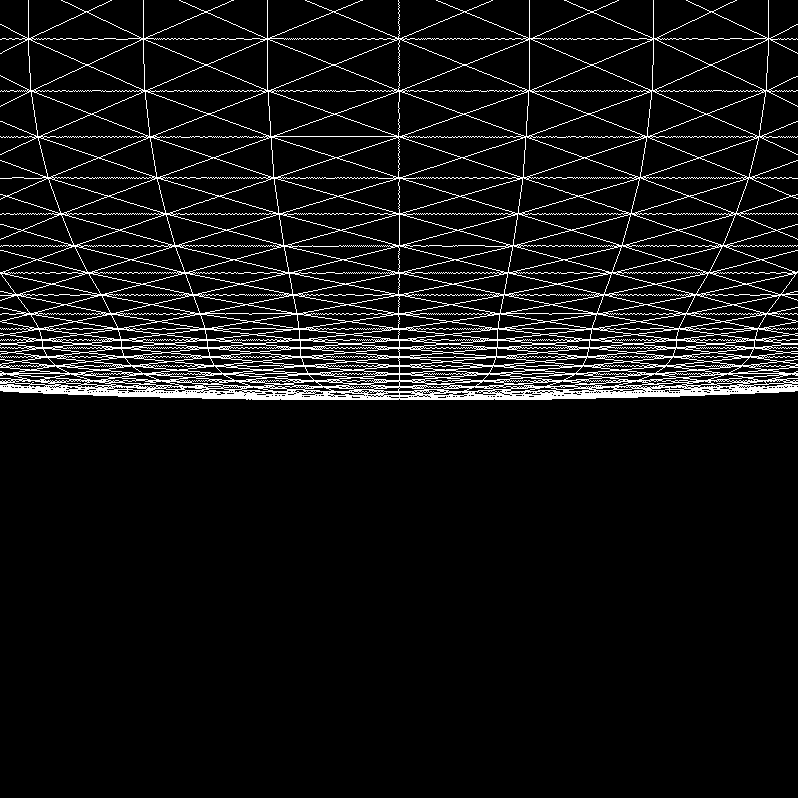
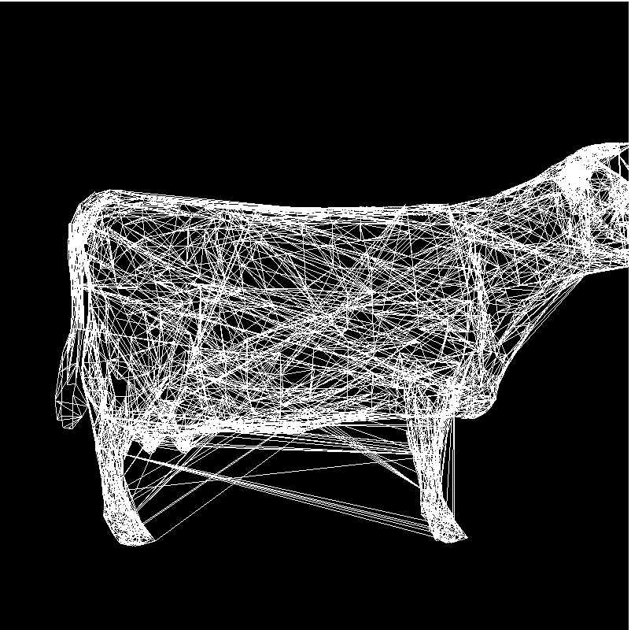
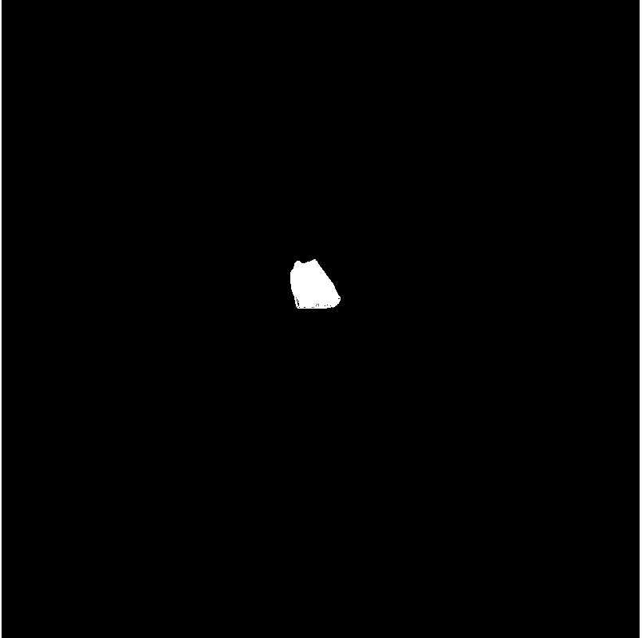

# Bug 记录

> https://www.google.com.hk/search?newwindow=1&safe=strict&ei=vO_OX5C2PNCJoATat5GoCw&q=%E7%BB%8F%E5%85%B8%E5%9B%BE%E5%BD%A2%E5%AD%A6%E6%A8%A1%E5%9E%8B+%E5%85%94%E5%AD%90&oq=%E7%BB%8F%E5%85%B8%E5%9B%BE%E5%BD%A2%E5%AD%A6%E6%A8%A1%E5%9E%8B+%E5%85%94%E5%AD%90&gs_lcp=CgZwc3ktYWIQA1DqdFiAgAFgi4EBaAFwAHgAgAHsAYgBygiSAQUwLjEuNJgBAKABAaoBB2d3cy13aXrAAQE&sclient=psy-ab&ved=0ahUKEwiQhPbMtb3tAhXQBIgKHdpbBLUQ4dUDCA0&uact=5 | 经典图形学模型 兔子 - Google 搜索
> https://www.zhihu.com/question/59064928 | (5 封私信 / 25 条消息) 斯坦福兔子模型的来源和故事有哪些? - 知乎
> https://www.ziyan.cc/read-103987.html | 斯坦福龙、斯坦福兔子 、弥勒佛 、犹他茶壶等等经典图形学3D模型Obj格式-人工智能-资研网_千万编程代码下载
> https://www.google.com.hk/search?q=%E6%96%AF%E5%9D%A6%E7%A6%8F%E9%BE%99%E3%80%81%E6%96%AF%E5%9D%A6%E7%A6%8F%E5%85%94%E5%AD%90%20%E3%80%81%E5%BC%A5%E5%8B%92%E4%BD%9B%20%E3%80%81%E7%8A%B9%E4%BB%96%E8%8C%B6%E5%A3%B6 | 斯坦福龙、斯坦福兔子 、弥勒佛 、犹他茶壶 - Google 搜索
> https://zhuanlan.zhihu.com/p/312879654 | 计算机图形学中的常用模型 - 知乎
> https://www.google.com.hk/search?newwindow=1&safe=strict&ei=A_DOX8_wOoHZ-Qann5OwBg&q=stanford+dragon+obj&oq=Stanford+Dragon&gs_lcp=CgZwc3ktYWIQARgBMgkIABCwAxAHEB4yBQgAELADMgUIABCwAzIFCAAQsAMyBQgAELADMgUIABCwAzIHCAAQsAMQHjIHCAAQsAMQHjIHCAAQsAMQHjIHCAAQsAMQHlAAWABgsqwIaAFwAHgAgAEAiAEAkgEAmAEAqgEHZ3dzLXdpesgBCsABAQ&sclient=psy-ab | stanford dragon obj - Google 搜索
> https://clara.io/library?query=stanford&gameCheck=true | Stanford 3D Models for Free - Download Free 3D · Clara.io
> https://github.com/alecjacobson/common-3d-test-models | alecjacobson / common-3d-test-models：包含原始格式的常见3D测试模型的存储库，带有原始源（如果已知）和obj网格
> https://www.cc.gatech.edu/~turk/bunny/bunny.html | 斯坦福兔子
> http://graphics.stanford.edu/data/3Dscanrep/ | 斯坦福3D扫描存储库
> https://download.csdn.net/download/chenweiyu11962/12919839 | (20条消息) 斯坦福龙、斯坦福兔子、弥勒佛、犹他茶壶等等经典图形学3D模型Obj格式-VR文档类资源-CSDN下载
> https://bbs.csdn.net/topics/90193886 | (20条消息) 请问图形学论文中经常出现的兔子模型和牛模型的三维数据在那里可以找到阿?-CSDN论坛
> https://www.google.com.hk/search?q=%E6%96%AF%E5%9D%A6%E7%A6%8F%E9%BE%99%E3%80%81%E6%96%AF%E5%9D%A6%E7%A6%8F%E5%85%94%E5%AD%90%20%E3%80%81%E5%BC%A5%E5%8B%92%E4%BD%9B%20%E3%80%81%E7%8A%B9%E4%BB%96%E8%8C%B6%E5%A3%B6%E7%AD%89%E7%AD%89%E7%BB%8F%E5%85%B8%E5%9B%BE%E5%BD%A2%E5%AD%A63D%E6%A8%A1%E5%9E%8BObj%E6%A0%BC%E5%BC%8F | 斯坦福龙、斯坦福兔子 、弥勒佛 、犹他茶壶等等经典图形学3D模型Obj格式 - Google 搜索
> https://cloud.tencent.com/developer/article/1346554 | 斯坦福兔子 3D 模型被玩坏了，可微图像参数化放飞你的无限想象力 - 云+社区 - 腾讯云
> https://github.com/tesseract-ocr/langdata/blob/master/chi_sim/chi_sim.wordlist | langdata/chi_sim.wordlist at master · tesseract-ocr/langdata
> https://blog.csdn.net/szchtx/article/details/7046989 | (20条消息) 计算机图形学中的常用模型_舒夜无痕--成为更好的自己-CSDN博客
> https://www.zhihu.com/question/49226908 | (5 封私信 / 25 条消息) Graphics Mesh Resources（图形学模型资源）? - 知乎
> https://www.bilibili.com/video/av33917704/ | opengl+openmesh+rabbit.obj案例_哔哩哔哩 (゜-゜)つロ 干杯~-bilibili
> https://www.iteye.com/resource/shuihanjing1986-4255677 | 兔子obj模型-iteye

# 图形学通用测试模型

https://github.com/alecjacobson/common-3d-test-models