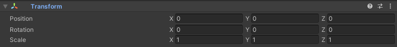
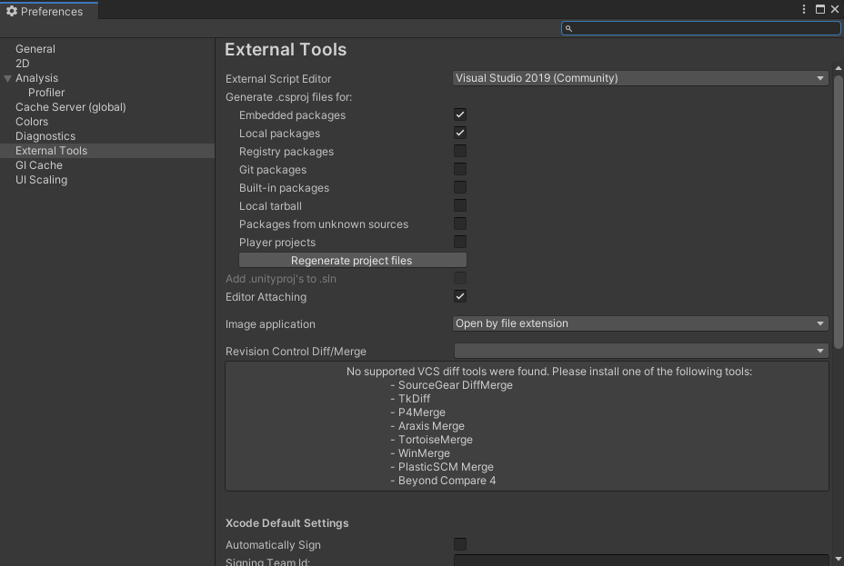
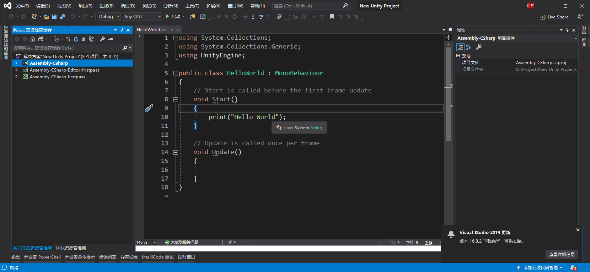
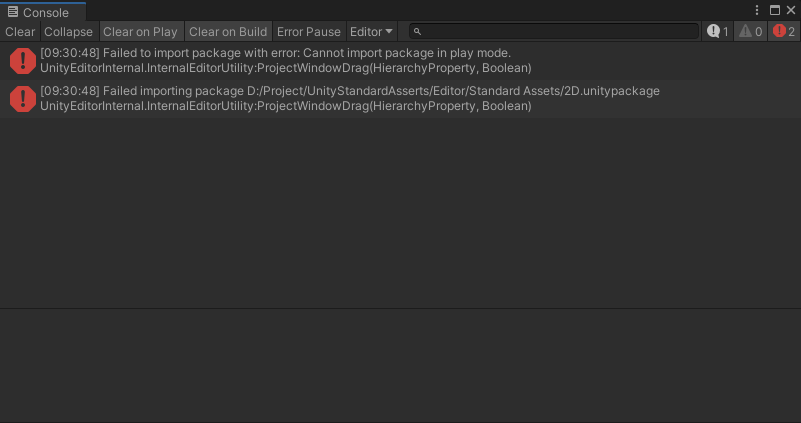
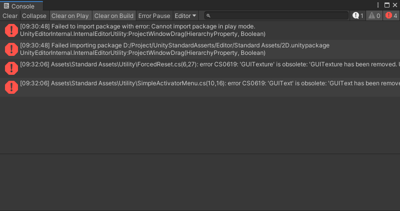
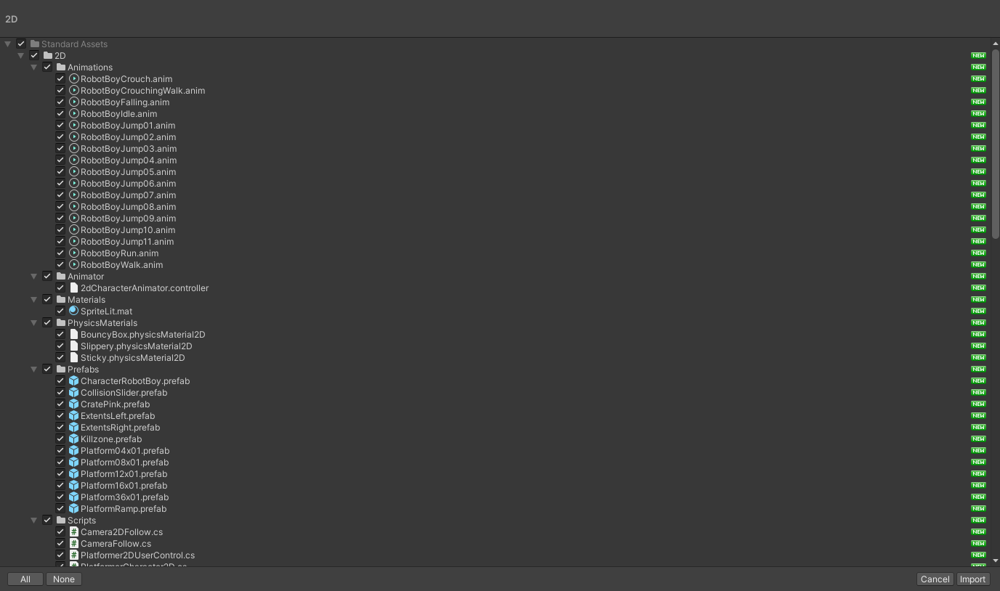
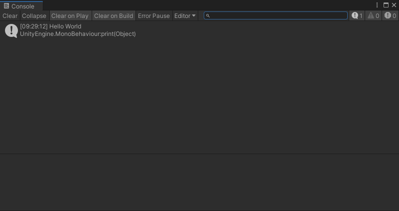
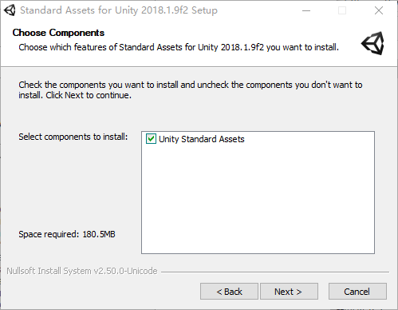
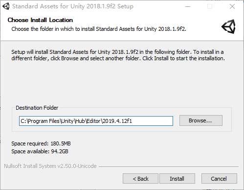

# Unity 脚本生命周期测试


```

 
    /// <summary>
    /// 当游戏对象被唤醒的时候执行,不管你身上的脚本组件是否禁用该函数都会执行.
    /// </summary>
    private void Awake()
    {
        Debug.Log("Awake");
    }
    /// <summary>
    /// 当组件或者游戏对象可用的时候执行
    /// </summary>
    private void OnEnable()
    {
        Debug.Log("OnEnable");
    }
    /// <summary>
    /// 当程序启动的时候执行   可应用与初始化.
    /// </summary>
    private void Start()
    {
        Debug.Log("Start");
    }
    /// <summary>
    /// 固定帧更新 默认每帧0.02秒. 
    /// </summary>
    private void FixedUpdate()
    {
        Debug.Log("FixedUpdate");
    }
    /// <summary>
    /// 每帧执行一次.
    /// </summary>
    private void Update()
    {
        Debug.Log("Update");
    }
    /// <summary>
    /// 在Update每帧执行完之后执行   用于摄像机跟随.
    /// </summary>
    private void LateUpdate()
    {
        Debug.Log("LateUpdate");
    }
    /// <summary>
    /// 渲染或处理GUI界面时调用.
    /// </summary>
    private void OnGUI()
    {
        Debug.Log("OnGUI");
    }
 
    /// <summary>
    /// 当组件或者游戏对象禁用的时候执行
    /// </summary>
    private void OnDisable()
    {
        Debug.Log("OnDisable");
    }
    /// <summary>
    /// 当游戏对象销毁的时候执行.
    /// </summary>
    private void OnDestroy()
    {
        Debug.Log("OnDestroy");
    }
    /// <summary>
    /// 应用程序退出的时候执行  作用于应用程序退出的时候将消息发送给所有的游戏对象.
    /// </summary>
    private void OnApplicationQuit()
    {
        Debug.Log("OnApplicationQuit");
    }
    /// <summary>
    /// 当玩家获取或失去焦点的时候发送给所有游戏对象.
    /// </summary>
    /// <param name="focus">是否获取了鼠标焦点</param>
    private void OnApplicationFocus(bool focus)
    {
        if (focus)
        {
            Debug.Log("获取了焦点");
        }
        else
        {
            Debug.Log("失去了焦点");
        }
 
    }
    /// <summary>
    /// 当游戏对象不在摄像机照射的范围内执行
    /// </summary>
    private void OnBecameInvisible()
    {
        Debug.Log("OnBecameInvisible");
    }
    /// <summary>
    /// 当游戏对象在摄像机照射的范围内执行
    /// </summary>
    private void OnBecameVisible()
    {
        Debug.Log("OnBecameVisible");
    }
FixedUpdate函数
```


# Transform功能扩展

https://zhuanlan.zhihu.com/p/99679563


```c#
using System.Collections.Generic;
using UnityEngine;

namespace Starry
{
    // Unity Transform的扩展功能
    public static partial class TransformExtensions
    {
        /// <summary>
        /// 广度优先搜索遍历
        /// </summary>
        /// <param name="root"></param>
        /// <typeparam name="TP">遍历时调用的函数的参数的类型</typeparam>
        /// <typeparam name="TR">遍历时调用的函数的返回值的类型</typeparam>
        /// <param name="visitFunc">遍历时调用的函数
        /// <para>TR Function(Transform t, T para)</para>
        /// </param>
        /// <param name="para">遍历时调用的函数的第二个参数</param>
        /// <param name="failReturnValue">遍历时查找失败的返回值</param>
        /// <returns>遍历时调用的函数的返回值</returns>
        public static TR BFSVisit<TP, TR>(this Transform root, System.Func<Transform, TP, TR> visitFunc, TP para, TR failReturnValue = default(TR))
        {
            TR ret = visitFunc(root, para);
            if (ret != null && !ret.Equals(failReturnValue))
                return ret;
            Queue<Transform> parents = new Queue<Transform>();
            parents.Enqueue(root);
            while (parents.Count > 0)
            {
                Transform parent = parents.Dequeue();
                foreach (Transform child in parent)
                {
                    ret = visitFunc(child, para);
                    if (ret != null && !ret.Equals(failReturnValue))
                        return ret;
                    parents.Enqueue(child);
                }
            }
            return failReturnValue;
        }
        
        /// <summary>
        /// 深度优先搜索遍历
        /// </summary>
        /// <param name="root"></param>
        /// <typeparam name="TP">遍历时调用的函数的参数的类型</typeparam>
        /// <typeparam name="TR">遍历时调用的函数的返回值的类型</typeparam>
        /// <param name="visitFunc">遍历时调用的函数
        /// <para>TR Function(Transform t, T para)</para>
        /// </param>
        /// <param name="para">遍历时调用的函数的第二个参数</param>
        /// <param name="failReturnValue">遍历时查找失败的返回值</param>
        /// <returns>遍历时调用的函数的返回值</returns>
        public static TR DFSVisit<TP, TR>(this Transform root, System.Func<Transform, TP, TR> visitFunc, TP para, TR failReturnValue = default(TR))
        {
            Stack<Transform> parents = new Stack<Transform>();
            parents.Push(root);
            while (parents.Count > 0)
            {
                Transform parent = parents.Pop();
                TR ret = visitFunc(parent, para);
                if (ret != null && !ret.Equals(failReturnValue))
                    return ret;
                for (int i = parent.childCount - 1; i >= 0; i--)
                {
                    parents.Push(parent.GetChild(i));
                }
            }
            return failReturnValue;
        }
        
        /// <summary>
        /// 根据名字查找并返回子孙，广度优先搜索
        /// </summary>
        /// <param name="trans"></param>
        /// <param name="childName">要查找的子孙的名字</param>
        /// <returns>要查找的子孙的Transform</returns>
        public static T FindComponent_BFS<T>(this Transform trans, string childName) where T : Component
        {
            var target = BFSVisit<string, Transform>(trans,
                (t, str) => { if (t.name.Equals(str)) return t; return null; },
                childName
            );

            if (target == null)
            {
                Debug.LogError(string.Format("cann't find child transform {0} in {1}", childName, trans.gameObject.name));
                return null;
            }

            T component = target.GetComponent<T>();
            if (component == null)
            {
                Debug.LogError("Component is null, type = " + typeof(T).Name);
                return null;
            }
            return component;
        }
        
        /// <summary>
        /// 根据名字查找并返回子孙，广度优先搜索
        /// </summary>
        /// <param name="trans"></param>
        /// <param name="tagName">要查找的子孙的名字</param>
        /// <returns>要查找的子孙的Transform</returns>
        public static Transform FindChild_ByTag(this Transform trans, string tagName)
        {
            var target = BFSVisit<string, Transform>(trans,
                (t, str) => { if (t.tag.Equals(str)) return t; return null; },
                tagName
            );

            if (target == null)
            {
                //Debug.LogError(string.Format("cann't find child transform {0} in {1}", tagName, trans.gameObject.name));
                return null;
            }

            return target;
        }
        
        /// <summary>
        /// 根据名字查找并返回子孙，深度优先搜索
        /// </summary>
        /// /// <param name="trans"></param>
        /// <param name="childName">要查找的子孙的名字</param>
        /// <returns>要查找的子孙的Transform</returns>
        public static T FindComponent_DFS<T>(this Transform trans, string childName) where T : Component
        {
            var target = DFSVisit<string, Transform>(trans,
                (t, str) => { if (t.name.Equals(str)) return t; return null; },
                childName
            );

            if (target == null)
            {
                Debug.LogError(string.Format("cann't find child transform {0} in {1}", childName, trans.gameObject.name));
                return null;
            }

            T component = target.GetComponent<T>();
            if (component == null)
            {
                Debug.LogError("Component is null, type = " + typeof(T).Name);
                return null;
            }
            return component;
        }
        
        /// <summary>
        /// 根据名字在子对象中查找组件
        /// </summary>
        /// <typeparam name="T"></typeparam>
        /// <param name="trans"></param>
        /// <param name="name"></param>
        /// /// <param name="reportError"></param>
        /// <returns></returns>
        public static T FindComponent<T>(this Transform trans, string name, bool reportError = true) where T : Component
        {
            Transform target = trans.Find(name);
            if (target == null)
            {
                if (reportError)
                {
                    Debug.LogError("Transform is null, name = " + name);
                }

                return null;
            }

            T component = target.GetComponent<T>();
            if (component == null)
            {
                if (reportError)
                {
                    Debug.LogError("Component is null, type = " + typeof(T).Name);
                }

                return null;
            }

            return component;
        }
        
        /// <summary>
        /// 初始化物体的相对位置、旋转、缩放
        /// </summary>
        /// <param name="trans"></param>
        public static void InitTransformLocal(this Transform trans)
        {
            trans.localPosition = Vector3.zero;
            trans.localScale = Vector3.one;
            trans.localRotation = Quaternion.identity;
        }

        /// <summary>
        /// 直接设置物体x轴的世界坐标
        /// </summary>
        /// <param name="trans"></param>
        /// <param name="x"></param>
        public static void SetPositionX(this Transform trans, float x)
        {
            var position = trans.position;
            position = new Vector3(x, position.y, position.z);
            trans.position = position;
        }

        /// <summary>
        /// 直接设置物体y轴的世界坐标
        /// </summary>
        /// <param name="trans"></param>
        /// <param name="y"></param>
        public static void SetPositionY(this Transform trans, float y)
        {
            var position = trans.position;
            position = new Vector3(position.x, y, position.z);
            trans.position = position;
        }

        /// <summary>
        /// 直接设置物体z轴的世界坐标
        /// </summary>
        /// <param name="trans"></param>
        /// <param name="z"></param>
        public static void SetPositionZ(this Transform trans, float z)
        {
            var position = trans.position;
            position = new Vector3(position.x, position.y, z);
            trans.position = position;
        }
    
        /// <summary>
        /// 直接设置物体x轴的本地坐标
        /// </summary>
        /// <param name="trans"></param>
        /// <param name="x"></param>
        public static void SetLocalPositionX(this Transform trans, float x)
        {
            var localPosition = trans.localPosition;
            localPosition = new Vector3(x, localPosition.y, localPosition.z);
            trans.localPosition = localPosition;
        }

        /// <summary>
        /// 直接设置物体y轴的本地坐标
        /// </summary>
        /// <param name="trans"></param>
        /// <param name="y"></param>
        public static void SetLocalPositionY(this Transform trans, float y)
        {
            var localPosition = trans.localPosition;
            localPosition = new Vector3(localPosition.x, y, localPosition.z);
            trans.localPosition = localPosition;
        }

        /// <summary>
        /// 直接设置物体z轴的本地坐标
        /// </summary>
        /// <param name="trans"></param>
        /// <param name="z"></param>
        public static void SetLocalPositionZ(this Transform trans, float z)
        {
            var localPosition = trans.localPosition;
            localPosition = new Vector3(localPosition.x, localPosition.y, z);
            trans.localPosition = localPosition;
        }
        
        /// <summary>
        /// 可以递归地查找所有子节点的某个T类型的组件
        /// </summary>
        /// <typeparam name="T"></typeparam>
        /// <param name="transform"></param>
        /// <param name="recursive"></param>
        /// <param name="includeInactive"></param>
        /// <returns></returns>
        public static T[] FindComponentsInChildren<T>(this Transform transform, bool recursive = true, bool includeInactive = true) where T : Component
        {

            if (recursive)
            {
                var list = new List<T>();
                GetChildren(transform, includeInactive, ref list);
                return list.ToArray();
            }
            else
            {
                return transform.GetComponentsInChildren<T>(includeInactive);
            }
        }
        
        public static T GetComponentsInParent<T>(this Transform transform) where T : Component
        {
            if (transform == null)
            {
                return null;
            }
            if (transform.GetComponent<T>() != null)
            {
                return transform.GetComponent<T>();
            }
            if (transform.parent != null)
            {
                return transform.parent.GetComponentInParent<T>();
            }
            return null;
        }
        
        public static Transform GetChildByName(this Transform transform, string name, bool recursive = true, bool includeInactive = true)
        {
            Transform target;
            for (int i = 0; i < transform.childCount; i++)
            {
                Transform child = transform.GetChild(i);
                if (child != null && (includeInactive || transform.gameObject.activeSelf))
                {
                    if (child.name == name)
                    {
                        return child;
                    }
                    else
                    {
                        target = child.GetChildByName(name);
                        if (target != null) return target;
                    }
                }
            }

            return null;
        }
        
        private static void GetChildren<T>(Transform t, bool includeInactive, ref System.Collections.Generic.List<T> list)
        {
            if (includeInactive || t.gameObject.activeSelf)
            {
                for (int i = 0; i < t.childCount; i++)
                {
                    if (t.GetChild(i) != null)
                    {
                        GetChildren(t.GetChild(i), includeInactive, ref list);
                    }
                }

                var comp = t.GetComponent<T>();
                if (comp != null)
                {
                    list.Add(comp);
                }
            }

        }
    }
}
```


# Unity GameObject


# Unity Transform

https://docs.unity3d.com/ScriptReference/Transform.html





Transform组件是Unity3D的重点之一，主要用于控制物体的旋转、移动、缩放。那么接下来我们将详细学习下Transform类所包含的成员变量和成员函数。

**一、成员变量**

**position：在世界空间坐标transform的位置。
localPosition：相对于父级的变换的位置。如果该变换没有父级，那么等同于Transform.position。
eulerAngles：世界坐标系中的旋转（欧拉角）。
localEulerAngles：相对于父级的变换旋转角度。
right：世界坐标系中的右方向。（世界空间坐标变换的红色轴。也就是x轴。）
up：世界坐标系中的上方向。（在世界空间坐标变换的绿色轴。也就是y轴。）
forward：世界坐标系中的前方向。（在世界空间坐标变换的蓝色轴。也就是z轴。）
rotation：世界坐标系中的旋转（四元数）。
localRotation：相对于父级的变换旋转角度。
localScale：相对于父级的缩放比例。
parent：父对象Transform组件。
worldToLocalMatrix：矩阵变换的点从世界坐标转为自身坐标（只读）。
localToWorldMatrix：矩阵变换的点从自身坐标转为世界坐标（只读）。
root：对象层级关系中的根对象的Transform组件。
childCount：子对象数量。
lossyScale：全局缩放比例（只读）。
**

**二、成员函数：**

**1、LookAt函数**

```csharp
public void LookAt(Transform target)


public void LookAt(Vector3 worldPosition);


public void LookAt(Vector3 worldPosition, Vector3 worldUp = Vector3.up);


public void LookAt(Transform target, Vector3 worldUp = Vector3.up);
```


旋转物体，使物体的z轴指向target/worldPosition，对于worldUp的描述是，在完成上面的旋转之后，继续旋转自身，使得当前对象的正y轴朝向与worldUp所指向的朝向一致。

这里的朝向一致指的是新旋转后的y轴与worldUp在该对象初次旋转后的xy平面上的投影向量一致。之所以取投影是因为第一次旋转使物体的z轴指向target/worldPosition后，此时的worldUp向量可能不在xy平面上，要在z轴指向target/worldPosition前提下是y轴朝向与worldUp一致，只能取worldUp在xy平面上的投影。

注意：使用worldPosition向量时要注意方向，一定是target-transform.position，顺序反了会使物体背向目标；若使用Transform作为参数，则不必注意。默认情况下，worldUp是Vector3.up（世界坐标系下的y轴）

**2、Rotate函数**

```csharp
public void Rotate(Vector3 eulerAngles);


public void Rotate(Vector3 eulerAngles, Space relativeTo = Space.Self);


public void Rotate(float xAngle, float yAngle, float zAngle);


public void Rotate(float xAngle, float yAngle, float zAngle, Space relativeTo = Space.Self);
```

旋转一个欧拉角度，它按照zxy的顺序进行旋转，默认情况下局部坐标系下Space.Self。

```csharp
public void Rotate(Vector3 axis, float angle);            


public void Rotate(Vector3 axis, float angle,Space relativeTo = Space.Self);
```

绕axis轴旋转angle角度，默认情况下局部坐标系下Space.Self。

***\*transform.rotation和Rotate有个区别：\****

Rotate()方法是：旋转多少度。在原有的基础上累加，即旋转了多少角度。又旋转了多少角度，是在原有的基础上在旋转

rotation属性是：旋转到某个角度，就是是在update中每帧都执行。但每次旋转到的角度都是5，所以是旋转到5度。一直都是

比如你只想让他旋转到多少, 用rotation; 假如想让他一直转,可以用Rotate

rotation直接改变了数值, 以达到旋转效果

Rotate应用一个的旋转角度每秒1度慢慢的旋转物体

当然:rotation()还可以通过插值旋转

**3、TransformDirection函数**

```csharp
public Vector3 TransformDirection(Vector3 direction);


public Vector3 TransformDirection(float x, float y, float z);
```

从自身坐标到世界坐标变换方向（这个强调的是方向）这个操作不会受到变换的缩放和位置的影响。返回的向量与direction有同样的长度

**4、TransformPoint函数**


```csharp
public Vector3 TransformPoint(Vector3 position);


public Vector3 TransformPoint(float x, float y, float z);
```


变换位置从自身坐标到世界坐标。注意，返回位置受缩放影响

**5、TransformVector函数**

```csharp
public Vector3 TransformVector(Vector3 vector);


public Vector3 TransformVector(float x, float y, float z);
```

变换一个向量从局部坐标空间到世界坐标空间。这个操作不受变换位置的影响，但是受缩放的影响

***\*6、Translate函数\****

```csharp
public void Translate(Vector3 translation);


public void Translate(Vector3 translation, Space relativeTo = Space.Self);
```

沿着translation方向移动translation向量长度的距离,如果relativeTo留空或者设置为Space.Self，移动被应用相对于自身坐标系

```csharp
public void Translate(float x, float y, float z);


public void Translate(float x, float y, float z, Space relativeTo = Space.Self);
```

移动变换由x沿着x轴，y沿着y轴，z沿着z轴。如果relativeTo留空或者设置为Space.Self，移动被应用相对于自身坐标系

```csharp
public void Translate(Vector3 translation, Transform relativeTo);   


public void Translate(float x, float y, float z, Transform relativeTo);
```

第一个参数的解释跟前面的一样，重点在移动relativeTo，解释为被应用相对于（relativeTo :Transform）的自身坐标系统。日光相对于为null，则移动被应用相对于世界坐标系统

```csharp
例子：


void Update()


{


//相对于摄像机每秒1单位向右移动物体


transform.Translate(Vector3.right * Time.deltaTime, Camera.main.transform);
```


# Unity 离线源码下载


**Unity手册**


| 目的地                 | 网址                                                  |
| ---------------------- | ----------------------------------------------------- |
| 标准网址               | https://docs.unity3d.com/Manual/index.html            |
| 版本特定网址（2017.1） | https://docs.unity3d.com/2017.1/Documentation/Manual/ |
| 特定版本的网址（5.6）  | https://docs.unity3d.com/560/Documentation/Manual/    |
| 特定版本的网址（5.5）  | https://docs.unity3d.com/550/Documentation/Manual/    |

**Unity脚本API**

| 目的地                 | 网址                                                         |
| ---------------------- | ------------------------------------------------------------ |
| 标准网址               | https://docs.unity3d.com/ScriptReference/index.html          |
| 版本特定网址（2017.1） | https://docs.unity3d.com/2017.1/Documentation/ScriptReference/ |
| 特定版本的网址（5.6）  | https://docs.unity3d.com/560/Documentation/ScriptReference/  |
| 特定版本的网址（5.5）  | https://docs.unity3d.com/550/Documentation/ScriptReference/  |

现在，照常浏览手册和脚本API。如果要在版本之间切换，请更改URL中的号码以反映您要查看的版本。此解决方法适用于[所有当前发布的文档版本](https://docs.unity3d.com/Manual/ManualVersions.html)。

有时，当您切换时，您可能会收到404错误。如果您在该版本的“手册”或“脚本API”中不存在您要查找的页面，则会发生这种情况。如果该功能在相应版本的Unity中不存在，则通常是这种情况。

# Unity C# 源码 GitHub

https://github.com/Unity-Technologies/UnityCsReference


# Unity Vector3 使用

## Description

Representation of 3D vectors and points.

This structure is used throughout Unity to pass 3D positions and directions around. It also contains functions for doing common vector operations.

Besides the functions listed below, other classes can be used to manipulate vectors and points as well. For example the [Quaternion](https://docs.unity3d.com/ScriptReference/Quaternion.html) and the [Matrix4x4](https://docs.unity3d.com/ScriptReference/Matrix4x4.html) classes are useful for rotating or transforming vectors and points.

## Static Properties

| [back](https://docs.unity3d.com/ScriptReference/Vector3-back.html) | Shorthand for writing Vector3(0, 0, -1).                     |
| ------------------------------------------------------------ | ------------------------------------------------------------ |
| [down](https://docs.unity3d.com/ScriptReference/Vector3-down.html) | Shorthand for writing Vector3(0, -1, 0).                     |
| [forward](https://docs.unity3d.com/ScriptReference/Vector3-forward.html) | Shorthand for writing Vector3(0, 0, 1).                      |
| [left](https://docs.unity3d.com/ScriptReference/Vector3-left.html) | Shorthand for writing Vector3(-1, 0, 0).                     |
| [negativeInfinity](https://docs.unity3d.com/ScriptReference/Vector3-negativeInfinity.html) | Shorthand for writing Vector3(float.NegativeInfinity, float.NegativeInfinity, float.NegativeInfinity). |
| [one](https://docs.unity3d.com/ScriptReference/Vector3-one.html) | Shorthand for writing Vector3(1, 1, 1).                      |
| [positiveInfinity](https://docs.unity3d.com/ScriptReference/Vector3-positiveInfinity.html) | Shorthand for writing Vector3(float.PositiveInfinity, float.PositiveInfinity, float.PositiveInfinity). |
| [right](https://docs.unity3d.com/ScriptReference/Vector3-right.html) | Shorthand for writing Vector3(1, 0, 0).                      |
| [up](https://docs.unity3d.com/ScriptReference/Vector3-up.html) | Shorthand for writing Vector3(0, 1, 0).                      |
| [zero](https://docs.unity3d.com/ScriptReference/Vector3-zero.html) | Shorthand for writing Vector3(0, 0, 0).                      |

## Properties

| [magnitude](https://docs.unity3d.com/ScriptReference/Vector3-magnitude.html) | Returns the length of this vector (Read Only).               |
| ------------------------------------------------------------ | ------------------------------------------------------------ |
| [normalized](https://docs.unity3d.com/ScriptReference/Vector3-normalized.html) | Returns this vector with a magnitude of 1 (Read Only).       |
| [sqrMagnitude](https://docs.unity3d.com/ScriptReference/Vector3-sqrMagnitude.html) | Returns the squared length of this vector (Read Only).       |
| [this[int\]](https://docs.unity3d.com/ScriptReference/Vector3.Index_operator.html) | Access the x, y, z components using [0], [1], [2] respectively. |
| [x](https://docs.unity3d.com/ScriptReference/Vector3-x.html) | X component of the vector.                                   |
| [y](https://docs.unity3d.com/ScriptReference/Vector3-y.html) | Y component of the vector.                                   |
| [z](https://docs.unity3d.com/ScriptReference/Vector3-z.html) | Z component of the vector.                                   |

## Constructors

| [Vector3](https://docs.unity3d.com/ScriptReference/Vector3-ctor.html) | Creates a new vector with given x, y, z components. |
| ------------------------------------------------------------ | --------------------------------------------------- |
|                                                              |                                                     |

## Public Methods

| [Equals](https://docs.unity3d.com/ScriptReference/Vector3.Equals.html) | Returns true if the given vector is exactly equal to this vector. |
| ------------------------------------------------------------ | ------------------------------------------------------------ |
| [Set](https://docs.unity3d.com/ScriptReference/Vector3.Set.html) | Set x, y and z components of an existing Vector3.            |
| [ToString](https://docs.unity3d.com/ScriptReference/Vector3.ToString.html) | Returns a nicely formatted string for this vector.           |

## Static Methods

| [Angle](https://docs.unity3d.com/ScriptReference/Vector3.Angle.html) | Returns the angle in degrees between from and to.            |
| ------------------------------------------------------------ | ------------------------------------------------------------ |
| [ClampMagnitude](https://docs.unity3d.com/ScriptReference/Vector3.ClampMagnitude.html) | Returns a copy of vector with its magnitude clamped to maxLength. |
| [Cross](https://docs.unity3d.com/ScriptReference/Vector3.Cross.html) | Cross Product of two vectors.                                |
| [Distance](https://docs.unity3d.com/ScriptReference/Vector3.Distance.html) | Returns the distance between a and b.                        |
| [Dot](https://docs.unity3d.com/ScriptReference/Vector3.Dot.html) | Dot Product of two vectors.                                  |
| [Lerp](https://docs.unity3d.com/ScriptReference/Vector3.Lerp.html) | Linearly interpolates between two points.                    |
| [LerpUnclamped](https://docs.unity3d.com/ScriptReference/Vector3.LerpUnclamped.html) | Linearly interpolates between two vectors.                   |
| [Max](https://docs.unity3d.com/ScriptReference/Vector3.Max.html) | Returns a vector that is made from the largest components of two vectors. |
| [Min](https://docs.unity3d.com/ScriptReference/Vector3.Min.html) | Returns a vector that is made from the smallest components of two vectors. |
| [MoveTowards](https://docs.unity3d.com/ScriptReference/Vector3.MoveTowards.html) | Calculate a position between the points specified by current and target, moving no farther than the distance specified by maxDistanceDelta. |
| [Normalize](https://docs.unity3d.com/ScriptReference/Vector3.Normalize.html) | Makes this vector have a magnitude of 1.                     |
| [OrthoNormalize](https://docs.unity3d.com/ScriptReference/Vector3.OrthoNormalize.html) | Makes vectors normalized and orthogonal to each other.       |
| [Project](https://docs.unity3d.com/ScriptReference/Vector3.Project.html) | Projects a vector onto another vector.                       |
| [ProjectOnPlane](https://docs.unity3d.com/ScriptReference/Vector3.ProjectOnPlane.html) | Projects a vector onto a plane defined by a normal orthogonal to the plane. |
| [Reflect](https://docs.unity3d.com/ScriptReference/Vector3.Reflect.html) | Reflects a vector off the plane defined by a normal.         |
| [RotateTowards](https://docs.unity3d.com/ScriptReference/Vector3.RotateTowards.html) | Rotates a vector current towards target.                     |
| [Scale](https://docs.unity3d.com/ScriptReference/Vector3.Scale.html) | Multiplies two vectors component-wise.                       |
| [SignedAngle](https://docs.unity3d.com/ScriptReference/Vector3.SignedAngle.html) | Returns the signed angle in degrees between from and to.     |
| [Slerp](https://docs.unity3d.com/ScriptReference/Vector3.Slerp.html) | Spherically interpolates between two vectors.                |
| [SlerpUnclamped](https://docs.unity3d.com/ScriptReference/Vector3.SlerpUnclamped.html) | Spherically interpolates between two vectors.                |
| [SmoothDamp](https://docs.unity3d.com/ScriptReference/Vector3.SmoothDamp.html) | Gradually changes a vector towards a desired goal over time. |

## Operators

| [operator -](https://docs.unity3d.com/ScriptReference/Vector3-operator_subtract.html) | Subtracts one vector from another.                   |
| ------------------------------------------------------------ | ---------------------------------------------------- |
| [operator !=](https://docs.unity3d.com/ScriptReference/Vector3-operator_ne.html) | Returns true if vectors different.                   |
| [operator *](https://docs.unity3d.com/ScriptReference/Vector3-operator_multiply.html) | Multiplies a vector by a number.                     |
| [operator /](https://docs.unity3d.com/ScriptReference/Vector3-operator_divide.html) | Divides a vector by a number.                        |
| [operator +](https://docs.unity3d.com/ScriptReference/Vector3-operator_add.html) | Adds two vectors.                                    |
| [operator ==](https://docs.unity3d.com/ScriptReference/Vector3-operator_eq.html) | Returns true if two vectors are approximately equal. |

 

**Vector3 ： Static Variables 静态变量**

| back    | Shorthand for writing Vector3(0, 0, -1). 写Vector3(0, 0, -1)的简码。 |
| ------- | ------------------------------------------------------------ |
| down    | Shorthand for writing Vector3(0, -1, 0). 写Vector3(0, -1, 0)的简码。 |
| forward | Shorthand for writing Vector3(0, 0, 1). 写Vector3(0, 0, 1)的简码,也就是向z轴。 |
| left    | Shorthand for writing Vector3(-1, 0, 0). 写Vector3(-1, 0, 0)的简码。 |
| one     | Shorthand for writing Vector3(1, 1, 1). 写Vector3(1, 1, 1)的简码。 |
| right   | Shorthand for writing Vector3(1, 0, 0). 写Vector3(1, 0, 0)的简码,也就是向x轴。 |
| up      | Shorthand for writing Vector3(0, 1, 0). 写Vector3(0, 1, 0)的简码,也就是向y轴 |
| zero    | Shorthand for writing Vector3(0, 0, 0). 写Vector3(0, 0, 0)的简码。 |

 1、Vector3三维向量：表示3D的向量和点。包含位置、方向（朝向）、欧拉角的信息，也包含做些普通向量运算的函数。

2、Quaternion四元数，用于表示旋转，Unity内使用Quaternion表示所有旋转。在电脑图形学中用于表示物体的旋转，在unity中由x,y,z,w 表示四个值。四元数不会产生万向节死锁并且能够很容易被插值。

在Unity里，tranform组件有一个变量名为rotation，它的类型就是四元数。

3、欧拉角：用来确定定点转动刚体位置的3个一组独立角参量，用来表示旋转角度。

 

声明四元数：

Quaternion q1= this.transform.rotatiion;

q1 = this.transform.rotation;

声明Vector :

Vector v1 =new Vector3(0,0,0);

v1 = this.transform.eulerAngles; //Vector3的欧拉角

 

Vector v2 =new Vector3(0,0,0);

v2 = this.transform.position; //Vector3的位置；

 

Vector3.normalized 规范化

非静态属性； 返回值类型vector3 ； 返回向量与原向量方向相同的单位向量，若原向量太小则返回零向量；

 

Vector3.Normalize() 规范化

静态函数； 返回值类型void； 返回向量与原向量方向相同的单位向量，若原向量太小则返回零向量；

Vector3 v1 = this.transform.position.normalized;

Vector3 v2 = Vector3.Normalize(this.transform.position);

v1,v2是等价的。

 

vector3.magniude 向量的长度

返回向量的长度，只有大小，没有方向，返回值类型为float 其实三维空间中的向量长度就是根号下（x*x+y*y+z*z）

 

Vector3.SqrMagnitude 向量的长度平方

常用于用于向量的比较，因为计算机求平方和开方比较消耗内存和时间。


Vector3.Distance() 距离

返回a和b之间的距离。

参数是两个 Vector3 类型

返回值类型 : float

Vector3.Distance(a,b) 等同于(a-b).magnitude.

 

Vecter3.Dot 点乘

两个向量的点乘积。 （向量数量积） 点积是一个浮点数的值：两个向量的长度（模）相乘再乘以他们之间夹角的余弦值.（即：|a|*|b|*cos<a,b>）

如果点乘的结果等于0，那么两个向量互相垂直。

如果结果大于0，那么两个向量的夹角小于90度，方向基本相同；

如果结果小于0，那么两个向量的夹角大于90度，方向基本相反。

 

Vector3.Cross 叉乘

两个向量的交叉乘积（外积）

它的结果是一个矢量。我们通常需要的是它的方向（Vector3.Cross(a.b).normalized）

得到一个分别垂直于这两个向量的向量

## 代码实现

```c#

// Unity C# reference source
// Copyright (c) Unity Technologies. For terms of use, see
// https://unity3d.com/legal/licenses/Unity_Reference_Only_License

using System;
using UnityEngine.Scripting;
using System.Runtime.InteropServices;
using UnityEngine.Bindings;
using scm = System.ComponentModel;
using uei = UnityEngine.Internal;
using System.Globalization;
using System.Runtime.CompilerServices;

namespace UnityEngine
{
    // Representation of 3D vectors and points.
    [NativeHeader("Runtime/Math/Vector3.h")]
    [NativeClass("Vector3f")]
    [RequiredByNativeCode(Optional = true, GenerateProxy = true)]
    [StructLayout(LayoutKind.Sequential)]
    [Unity.IL2CPP.CompilerServices.Il2CppEagerStaticClassConstruction]
    public partial struct Vector3 : IEquatable<Vector3>, IFormattable
    {
        // *Undocumented*
        public const float kEpsilon = 0.00001F;
        // *Undocumented*
        public const float kEpsilonNormalSqrt = 1e-15F;

        // X component of the vector.
        public float x;
        // Y component of the vector.
        public float y;
        // Z component of the vector.
        public float z;

        // Linearly interpolates between two vectors.
        [MethodImpl(MethodImplOptionsEx.AggressiveInlining)]
        public static Vector3 Lerp(Vector3 a, Vector3 b, float t)
        {
            t = Mathf.Clamp01(t);
            return new Vector3(
                a.x + (b.x - a.x) * t,
                a.y + (b.y - a.y) * t,
                a.z + (b.z - a.z) * t
            );
        }

        // Linearly interpolates between two vectors without clamping the interpolant
        [MethodImpl(MethodImplOptionsEx.AggressiveInlining)]
        public static Vector3 LerpUnclamped(Vector3 a, Vector3 b, float t)
        {
            return new Vector3(
                a.x + (b.x - a.x) * t,
                a.y + (b.y - a.y) * t,
                a.z + (b.z - a.z) * t
            );
        }

        // Moves a point /current/ in a straight line towards a /target/ point.
        public static Vector3 MoveTowards(Vector3 current, Vector3 target, float maxDistanceDelta)
        {
            // avoid vector ops because current scripting backends are terrible at inlining
            float toVector_x = target.x - current.x;
            float toVector_y = target.y - current.y;
            float toVector_z = target.z - current.z;

            float sqdist = toVector_x * toVector_x + toVector_y * toVector_y + toVector_z * toVector_z;

            if (sqdist == 0 || (maxDistanceDelta >= 0 && sqdist <= maxDistanceDelta * maxDistanceDelta))
                return target;
            var dist = (float)Math.Sqrt(sqdist);

            return new Vector3(current.x + toVector_x / dist * maxDistanceDelta,
                current.y + toVector_y / dist * maxDistanceDelta,
                current.z + toVector_z / dist * maxDistanceDelta);
        }

        [uei.ExcludeFromDocs]
        public static Vector3 SmoothDamp(Vector3 current, Vector3 target, ref Vector3 currentVelocity, float smoothTime, float maxSpeed)
        {
            float deltaTime = Time.deltaTime;
            return SmoothDamp(current, target, ref currentVelocity, smoothTime, maxSpeed, deltaTime);
        }

        [uei.ExcludeFromDocs]
        public static Vector3 SmoothDamp(Vector3 current, Vector3 target, ref Vector3 currentVelocity, float smoothTime)
        {
            float deltaTime = Time.deltaTime;
            float maxSpeed = Mathf.Infinity;
            return SmoothDamp(current, target, ref currentVelocity, smoothTime, maxSpeed, deltaTime);
        }

        // Gradually changes a vector towards a desired goal over time.
        public static Vector3 SmoothDamp(Vector3 current, Vector3 target, ref Vector3 currentVelocity, float smoothTime, [uei.DefaultValue("Mathf.Infinity")]  float maxSpeed, [uei.DefaultValue("Time.deltaTime")]  float deltaTime)
        {
            float output_x = 0f;
            float output_y = 0f;
            float output_z = 0f;

            // Based on Game Programming Gems 4 Chapter 1.10
            smoothTime = Mathf.Max(0.0001F, smoothTime);
            float omega = 2F / smoothTime;

            float x = omega * deltaTime;
            float exp = 1F / (1F + x + 0.48F * x * x + 0.235F * x * x * x);

            float change_x = current.x - target.x;
            float change_y = current.y - target.y;
            float change_z = current.z - target.z;
            Vector3 originalTo = target;

            // Clamp maximum speed
            float maxChange = maxSpeed * smoothTime;

            float maxChangeSq = maxChange * maxChange;
            float sqrmag = change_x * change_x + change_y * change_y + change_z * change_z;
            if (sqrmag > maxChangeSq)
            {
                var mag = (float)Math.Sqrt(sqrmag);
                change_x = change_x / mag * maxChange;
                change_y = change_y / mag * maxChange;
                change_z = change_z / mag * maxChange;
            }

            target.x = current.x - change_x;
            target.y = current.y - change_y;
            target.z = current.z - change_z;

            float temp_x = (currentVelocity.x + omega * change_x) * deltaTime;
            float temp_y = (currentVelocity.y + omega * change_y) * deltaTime;
            float temp_z = (currentVelocity.z + omega * change_z) * deltaTime;

            currentVelocity.x = (currentVelocity.x - omega * temp_x) * exp;
            currentVelocity.y = (currentVelocity.y - omega * temp_y) * exp;
            currentVelocity.z = (currentVelocity.z - omega * temp_z) * exp;

            output_x = target.x + (change_x + temp_x) * exp;
            output_y = target.y + (change_y + temp_y) * exp;
            output_z = target.z + (change_z + temp_z) * exp;

            // Prevent overshooting
            float origMinusCurrent_x = originalTo.x - current.x;
            float origMinusCurrent_y = originalTo.y - current.y;
            float origMinusCurrent_z = originalTo.z - current.z;
            float outMinusOrig_x = output_x - originalTo.x;
            float outMinusOrig_y = output_y - originalTo.y;
            float outMinusOrig_z = output_z - originalTo.z;

            if (origMinusCurrent_x * outMinusOrig_x + origMinusCurrent_y * outMinusOrig_y + origMinusCurrent_z * outMinusOrig_z > 0)
            {
                output_x = originalTo.x;
                output_y = originalTo.y;
                output_z = originalTo.z;

                currentVelocity.x = (output_x - originalTo.x) / deltaTime;
                currentVelocity.y = (output_y - originalTo.y) / deltaTime;
                currentVelocity.z = (output_z - originalTo.z) / deltaTime;
            }

            return new Vector3(output_x, output_y, output_z);
        }

        // Access the x, y, z components using [0], [1], [2] respectively.
        public float this[int index]
        {
            get
            {
                switch (index)
                {
                    case 0: return x;
                    case 1: return y;
                    case 2: return z;
                    default:
                        throw new IndexOutOfRangeException("Invalid Vector3 index!");
                }
            }

            set
            {
                switch (index)
                {
                    case 0: x = value; break;
                    case 1: y = value; break;
                    case 2: z = value; break;
                    default:
                        throw new IndexOutOfRangeException("Invalid Vector3 index!");
                }
            }
        }

        // Creates a new vector with given x, y, z components.
        [MethodImpl(MethodImplOptionsEx.AggressiveInlining)]
        public Vector3(float x, float y, float z) { this.x = x; this.y = y; this.z = z; }
        // Creates a new vector with given x, y components and sets /z/ to zero.
        [MethodImpl(MethodImplOptionsEx.AggressiveInlining)]
        public Vector3(float x, float y) { this.x = x; this.y = y; z = 0F; }

        // Set x, y and z components of an existing Vector3.
        [MethodImpl(MethodImplOptionsEx.AggressiveInlining)]
        public void Set(float newX, float newY, float newZ) { x = newX; y = newY; z = newZ; }

        // Multiplies two vectors component-wise.
        [MethodImpl(MethodImplOptionsEx.AggressiveInlining)]
        public static Vector3 Scale(Vector3 a, Vector3 b) { return new Vector3(a.x * b.x, a.y * b.y, a.z * b.z); }

        // Multiplies every component of this vector by the same component of /scale/.
        [MethodImpl(MethodImplOptionsEx.AggressiveInlining)]
        public void Scale(Vector3 scale) { x *= scale.x; y *= scale.y; z *= scale.z; }

        // Cross Product of two vectors.
        public static Vector3 Cross(Vector3 lhs, Vector3 rhs)
        {
            return new Vector3(
                lhs.y * rhs.z - lhs.z * rhs.y,
                lhs.z * rhs.x - lhs.x * rhs.z,
                lhs.x * rhs.y - lhs.y * rhs.x);
        }

        // used to allow Vector3s to be used as keys in hash tables
        public override int GetHashCode()
        {
            return x.GetHashCode() ^ (y.GetHashCode() << 2) ^ (z.GetHashCode() >> 2);
        }

        // also required for being able to use Vector3s as keys in hash tables
        public override bool Equals(object other)
        {
            if (!(other is Vector3)) return false;

            return Equals((Vector3)other);
        }

        public bool Equals(Vector3 other)
        {
            return x == other.x && y == other.y && z == other.z;
        }

        // Reflects a vector off the plane defined by a normal.
        public static Vector3 Reflect(Vector3 inDirection, Vector3 inNormal)
        {
            float factor = -2F * Dot(inNormal, inDirection);
            return new Vector3(factor * inNormal.x + inDirection.x,
                factor * inNormal.y + inDirection.y,
                factor * inNormal.z + inDirection.z);
        }

        // *undoc* --- we have normalized property now
        public static Vector3 Normalize(Vector3 value)
        {
            float mag = Magnitude(value);
            if (mag > kEpsilon)
                return value / mag;
            else
                return zero;
        }

        // Makes this vector have a ::ref::magnitude of 1.
        public void Normalize()
        {
            float mag = Magnitude(this);
            if (mag > kEpsilon)
                this = this / mag;
            else
                this = zero;
        }

        // Returns this vector with a ::ref::magnitude of 1 (RO).
        public Vector3 normalized { get { return Vector3.Normalize(this); } }

        // Dot Product of two vectors.
        [MethodImpl(MethodImplOptionsEx.AggressiveInlining)]
        public static float Dot(Vector3 lhs, Vector3 rhs) { return lhs.x * rhs.x + lhs.y * rhs.y + lhs.z * rhs.z; }

        // Projects a vector onto another vector.
        public static Vector3 Project(Vector3 vector, Vector3 onNormal)
        {
            float sqrMag = Dot(onNormal, onNormal);
            if (sqrMag < Mathf.Epsilon)
                return zero;
            else
            {
                var dot = Dot(vector, onNormal);
                return new Vector3(onNormal.x * dot / sqrMag,
                    onNormal.y * dot / sqrMag,
                    onNormal.z * dot / sqrMag);
            }
        }

        // Projects a vector onto a plane defined by a normal orthogonal to the plane.
        public static Vector3 ProjectOnPlane(Vector3 vector, Vector3 planeNormal)
        {
            float sqrMag = Dot(planeNormal, planeNormal);
            if (sqrMag < Mathf.Epsilon)
                return vector;
            else
            {
                var dot = Dot(vector, planeNormal);
                return new Vector3(vector.x - planeNormal.x * dot / sqrMag,
                    vector.y - planeNormal.y * dot / sqrMag,
                    vector.z - planeNormal.z * dot / sqrMag);
            }
        }

        // Returns the angle in degrees between /from/ and /to/. This is always the smallest
        public static float Angle(Vector3 from, Vector3 to)
        {
            // sqrt(a) * sqrt(b) = sqrt(a * b) -- valid for real numbers
            float denominator = (float)Math.Sqrt(from.sqrMagnitude * to.sqrMagnitude);
            if (denominator < kEpsilonNormalSqrt)
                return 0F;

            float dot = Mathf.Clamp(Dot(from, to) / denominator, -1F, 1F);
            return ((float)Math.Acos(dot)) * Mathf.Rad2Deg;
        }

        // The smaller of the two possible angles between the two vectors is returned, therefore the result will never be greater than 180 degrees or smaller than -180 degrees.
        // If you imagine the from and to vectors as lines on a piece of paper, both originating from the same point, then the /axis/ vector would point up out of the paper.
        // The measured angle between the two vectors would be positive in a clockwise direction and negative in an anti-clockwise direction.
        public static float SignedAngle(Vector3 from, Vector3 to, Vector3 axis)
        {
            float unsignedAngle = Angle(from, to);

            float cross_x = from.y * to.z - from.z * to.y;
            float cross_y = from.z * to.x - from.x * to.z;
            float cross_z = from.x * to.y - from.y * to.x;
            float sign = Mathf.Sign(axis.x * cross_x + axis.y * cross_y + axis.z * cross_z);
            return unsignedAngle * sign;
        }

        // Returns the distance between /a/ and /b/.
        public static float Distance(Vector3 a, Vector3 b)
        {
            float diff_x = a.x - b.x;
            float diff_y = a.y - b.y;
            float diff_z = a.z - b.z;
            return (float)Math.Sqrt(diff_x * diff_x + diff_y * diff_y + diff_z * diff_z);
        }

        // Returns a copy of /vector/ with its magnitude clamped to /maxLength/.
        public static Vector3 ClampMagnitude(Vector3 vector, float maxLength)
        {
            float sqrmag = vector.sqrMagnitude;
            if (sqrmag > maxLength * maxLength)
            {
                float mag = (float)Math.Sqrt(sqrmag);
                //these intermediate variables force the intermediate result to be
                //of float precision. without this, the intermediate result can be of higher
                //precision, which changes behavior.
                float normalized_x = vector.x / mag;
                float normalized_y = vector.y / mag;
                float normalized_z = vector.z / mag;
                return new Vector3(normalized_x * maxLength,
                    normalized_y * maxLength,
                    normalized_z * maxLength);
            }
            return vector;
        }

        // *undoc* --- there's a property now
        [MethodImpl(MethodImplOptionsEx.AggressiveInlining)]
        public static float Magnitude(Vector3 vector) { return (float)Math.Sqrt(vector.x * vector.x + vector.y * vector.y + vector.z * vector.z); }

        // Returns the length of this vector (RO).
        public float magnitude { get { return (float)Math.Sqrt(x * x + y * y + z * z); } }

        // *undoc* --- there's a property now
        [MethodImpl(MethodImplOptionsEx.AggressiveInlining)]
        public static float SqrMagnitude(Vector3 vector) { return vector.x * vector.x + vector.y * vector.y + vector.z * vector.z; }

        // Returns the squared length of this vector (RO).
        public float sqrMagnitude { get { return x * x + y * y + z * z; } }

        // Returns a vector that is made from the smallest components of two vectors.
        [MethodImpl(MethodImplOptionsEx.AggressiveInlining)]
        public static Vector3 Min(Vector3 lhs, Vector3 rhs)
        {
            return new Vector3(Mathf.Min(lhs.x, rhs.x), Mathf.Min(lhs.y, rhs.y), Mathf.Min(lhs.z, rhs.z));
        }

        // Returns a vector that is made from the largest components of two vectors.
        [MethodImpl(MethodImplOptionsEx.AggressiveInlining)]
        public static Vector3 Max(Vector3 lhs, Vector3 rhs)
        {
            return new Vector3(Mathf.Max(lhs.x, rhs.x), Mathf.Max(lhs.y, rhs.y), Mathf.Max(lhs.z, rhs.z));
        }

        static readonly Vector3 zeroVector = new Vector3(0F, 0F, 0F);
        static readonly Vector3 oneVector = new Vector3(1F, 1F, 1F);
        static readonly Vector3 upVector = new Vector3(0F, 1F, 0F);
        static readonly Vector3 downVector = new Vector3(0F, -1F, 0F);
        static readonly Vector3 leftVector = new Vector3(-1F, 0F, 0F);
        static readonly Vector3 rightVector = new Vector3(1F, 0F, 0F);
        static readonly Vector3 forwardVector = new Vector3(0F, 0F, 1F);
        static readonly Vector3 backVector = new Vector3(0F, 0F, -1F);
        static readonly Vector3 positiveInfinityVector = new Vector3(float.PositiveInfinity, float.PositiveInfinity, float.PositiveInfinity);
        static readonly Vector3 negativeInfinityVector = new Vector3(float.NegativeInfinity, float.NegativeInfinity, float.NegativeInfinity);

        // Shorthand for writing @@Vector3(0, 0, 0)@@
        public static Vector3 zero { get { return zeroVector; } }
        // Shorthand for writing @@Vector3(1, 1, 1)@@
        public static Vector3 one { get { return oneVector; } }
        // Shorthand for writing @@Vector3(0, 0, 1)@@
        public static Vector3 forward { get { return forwardVector; } }
        public static Vector3 back { get { return backVector; } }
        // Shorthand for writing @@Vector3(0, 1, 0)@@
        public static Vector3 up { get { return upVector; } }
        public static Vector3 down { get { return downVector; } }
        public static Vector3 left { get { return leftVector; } }
        // Shorthand for writing @@Vector3(1, 0, 0)@@
        public static Vector3 right { get { return rightVector; } }
        // Shorthand for writing @@Vector3(float.PositiveInfinity, float.PositiveInfinity, float.PositiveInfinity)@@
        public static Vector3 positiveInfinity { get { return positiveInfinityVector; } }
        // Shorthand for writing @@Vector3(float.NegativeInfinity, float.NegativeInfinity, float.NegativeInfinity)@@
        public static Vector3 negativeInfinity { get { return negativeInfinityVector; } }

        // Adds two vectors.
        [MethodImpl(MethodImplOptionsEx.AggressiveInlining)]
        public static Vector3 operator+(Vector3 a, Vector3 b) { return new Vector3(a.x + b.x, a.y + b.y, a.z + b.z); }
        // Subtracts one vector from another.
        [MethodImpl(MethodImplOptionsEx.AggressiveInlining)]
        public static Vector3 operator-(Vector3 a, Vector3 b) { return new Vector3(a.x - b.x, a.y - b.y, a.z - b.z); }
        // Negates a vector.
        [MethodImpl(MethodImplOptionsEx.AggressiveInlining)]
        public static Vector3 operator-(Vector3 a) { return new Vector3(-a.x, -a.y, -a.z); }
        // Multiplies a vector by a number.
        [MethodImpl(MethodImplOptionsEx.AggressiveInlining)]
        public static Vector3 operator*(Vector3 a, float d) { return new Vector3(a.x * d, a.y * d, a.z * d); }
        // Multiplies a vector by a number.
        [MethodImpl(MethodImplOptionsEx.AggressiveInlining)]
        public static Vector3 operator*(float d, Vector3 a) { return new Vector3(a.x * d, a.y * d, a.z * d); }
        // Divides a vector by a number.
        [MethodImpl(MethodImplOptionsEx.AggressiveInlining)]
        public static Vector3 operator/(Vector3 a, float d) { return new Vector3(a.x / d, a.y / d, a.z / d); }

        // Returns true if the vectors are equal.
        public static bool operator==(Vector3 lhs, Vector3 rhs)
        {
            // Returns false in the presence of NaN values.
            float diff_x = lhs.x - rhs.x;
            float diff_y = lhs.y - rhs.y;
            float diff_z = lhs.z - rhs.z;
            float sqrmag = diff_x * diff_x + diff_y * diff_y + diff_z * diff_z;
            return sqrmag < kEpsilon * kEpsilon;
        }

        // Returns true if vectors are different.
        public static bool operator!=(Vector3 lhs, Vector3 rhs)
        {
            // Returns true in the presence of NaN values.
            return !(lhs == rhs);
        }

        public override string ToString()
        {
            return ToString(null, CultureInfo.InvariantCulture.NumberFormat);
        }

        public string ToString(string format)
        {
            return ToString(format, CultureInfo.InvariantCulture.NumberFormat);
        }

        public string ToString(string format, IFormatProvider formatProvider)
        {
            if (string.IsNullOrEmpty(format))
                format = "F1";
            return UnityString.Format("({0}, {1}, {2})", x.ToString(format, formatProvider), y.ToString(format, formatProvider), z.ToString(format, formatProvider));
        }

        [System.Obsolete("Use Vector3.forward instead.")]
        public static Vector3 fwd { get { return new Vector3(0F, 0F, 1F); } }
        [System.Obsolete("Use Vector3.Angle instead. AngleBetween uses radians instead of degrees and was deprecated for this reason")]
        public static float AngleBetween(Vector3 from, Vector3 to) { return (float)Math.Acos(Mathf.Clamp(Vector3.Dot(from.normalized, to.normalized), -1F, 1F)); }
        [System.Obsolete("Use Vector3.ProjectOnPlane instead.")]
        public static Vector3 Exclude(Vector3 excludeThis, Vector3 fromThat) { return ProjectOnPlane(fromThat, excludeThis); }
    }
}
```


# Unity 标准资源下载导入


# Unity 2D 资源 CrossPlatformInputGuidelines


# Unity 相机跟随 2D


```c#
using System;
using UnityEngine;


namespace UnityStandardAssets._2D
{
    public class CameraFollow : MonoBehaviour
    {
        public float xMargin = 1f; // Distance in the x axis the player can move before the camera follows.
        public float yMargin = 1f; // Distance in the y axis the player can move before the camera follows.
        public float xSmooth = 8f; // How smoothly the camera catches up with it's target movement in the x axis.
        public float ySmooth = 8f; // How smoothly the camera catches up with it's target movement in the y axis.
        public Vector2 maxXAndY; // The maximum x and y coordinates the camera can have.
        public Vector2 minXAndY; // The minimum x and y coordinates the camera can have.

        private Transform m_Player; // Reference to the player's transform.


        private void Awake()
        {
            // Setting up the reference.
            m_Player = GameObject.FindGameObjectWithTag("Player").transform;
        }


        private bool CheckXMargin()
        {
            // Returns true if the distance between the camera and the player in the x axis is greater than the x margin.
            return Mathf.Abs(transform.position.x - m_Player.position.x) > xMargin;
        }


        private bool CheckYMargin()
        {
            // Returns true if the distance between the camera and the player in the y axis is greater than the y margin.
            return Mathf.Abs(transform.position.y - m_Player.position.y) > yMargin;
        }


        private void Update()
        {
            TrackPlayer();
        }


        private void TrackPlayer()
        {
            // By default the target x and y coordinates of the camera are it's current x and y coordinates.
            float targetX = transform.position.x;
            float targetY = transform.position.y;

            // If the player has moved beyond the x margin...
            if (CheckXMargin())
            {
                // ... the target x coordinate should be a Lerp between the camera's current x position and the player's current x position.
                targetX = Mathf.Lerp(transform.position.x, m_Player.position.x, xSmooth*Time.deltaTime);
            }

            // If the player has moved beyond the y margin...
            if (CheckYMargin())
            {
                // ... the target y coordinate should be a Lerp between the camera's current y position and the player's current y position.
                targetY = Mathf.Lerp(transform.position.y, m_Player.position.y, ySmooth*Time.deltaTime);
            }

            // The target x and y coordinates should not be larger than the maximum or smaller than the minimum.c#
            targetX = Mathf.Clamp(targetX, minXAndY.x, maxXAndY.x);
            targetY = Mathf.Clamp(targetY, minXAndY.y, maxXAndY.y);

            // Set the camera's position to the target position with the same z component.
            transform.position = new Vector3(targetX, targetY, transform.position.z);
        }
    }
}

```


# Unity 2D 相机跟随

```c#
using System;
using UnityEngine;

namespace UnityStandardAssets._2D
{
    public class Camera2DFollow : MonoBehaviour
    {
        public Transform target;
        public float damping = 1;
        public float lookAheadFactor = 3;
        public float lookAheadReturnSpeed = 0.5f;
        public float lookAheadMoveThreshold = 0.1f;

        private float m_OffsetZ;
        private Vector3 m_LastTargetPosition;
        private Vector3 m_CurrentVelocity;
        private Vector3 m_LookAheadPos;

        // Use this for initialization
        private void Start()
        {
            m_LastTargetPosition = target.position;
            m_OffsetZ = (transform.position - target.position).z;
            transform.parent = null;
        }


        // Update is called once per frame
        private void Update()
        {
            // only update lookahead pos if accelerating or changed direction
            float xMoveDelta = (target.position - m_LastTargetPosition).x;

            bool updateLookAheadTarget = Mathf.Abs(xMoveDelta) > lookAheadMoveThreshold;

            if (updateLookAheadTarget)
            {
                m_LookAheadPos = lookAheadFactor*Vector3.right*Mathf.Sign(xMoveDelta);
            }
            else
            {
                m_LookAheadPos = Vector3.MoveTowards(m_LookAheadPos, Vector3.zero, Time.deltaTime*lookAheadReturnSpeed);
            }

            Vector3 aheadTargetPos = target.position + m_LookAheadPos + Vector3.forward*m_OffsetZ;
            Vector3 newPos = Vector3.SmoothDamp(transform.position, aheadTargetPos, ref m_CurrentVelocity, damping);

            transform.position = newPos;

            m_LastTargetPosition = target.position;
        }
    }
}

```


# Unity vs2019 打开







# Unity标准资源包 2D.unitypackage




导入后错误







# Unity Hello World





# Unity 标准资源包

下载地址

[下载安装包 安装到路径](https://link.zhihu.com/?target=https%3A//download.unity3d.com/download_unity/a6cc294b73ee/WindowsStandardAssetsInstaller/UnityStandardAssetsSetup-2018.1.9f2.exe)







