# Unity 资源插件

https://www.w3cschool.cn/unity3d/unity3d-razb3d4u.html | Unity Physics 2D_w3cschool
https://docs.unity3d.com/2020.2/Documentation/ScriptReference/UnityEngine.Physics2DModule.html | Unity - Scripting API: UnityEngine.Physics2DModule
https://docs.unity3d.com/2020.2/Documentation/ScriptReference/UnityEngine.PhysicsModule.html | Unity - Scripting API: UnityEngine.PhysicsModule
https://docs.unity3d.com/Packages/com.unity.terrain-tools@2.0/manual/index.html | Terrain Tools | Package Manager UI website
https://www.w3cschool.cn/unity3d/unity3d-razb3d4u.html | Unity Physics 2D_w3cschool
https://www.google.com.hk/search?newwindow=1&safe=strict&ei=vWm4X73qGMvYhwPcrJbYAg&q=unity+%E6%A0%87%E5%87%86%E8%B5%84%E6%BA%90%E5%8C%85+%E6%9C%89%E4%BB%80%E4%B9%88&oq=unity+%E6%A0%87%E5%87%86%E8%B5%84%E6%BA%90%E5%8C%85+%E6%9C%89%E4%BB%80%E4%B9%88&gs_lcp=CgZwc3ktYWIQAzIFCAAQzQI6BAgAEAw6BAgAEB5Q-OYJWIb7CWCG_AloAXAAeACAAccEiAHYF5IBCTItNy4xLjEuMZgBAKABAaoBB2d3cy13aXrAAQE&sclient=psy-ab&ved=0ahUKEwj9vNnbupLtAhVL7GEKHVyWBSsQ4dUDCA0&uact=5 | unity 标准资源包 有什么 - Google 搜索
https://www.jianshu.com/p/9a323d8005b0 | 资源包 - 简书
https://docs.unity3d.com/Manual/AssetPackages.html | Unity - Manual: Asset packages
https://www.yuanmas.com/info/obzm6AJAaP.html | Unity Standard Assets 简介之 其他资源 / 源码寺
http://www.hxinjiaoxue.com/jishuchengjiu/2020/0223/30.html | Unity Asset Packages（资源包）
https://www.itread01.com/content/1550064991.html | Unity標準資源包，示例專案，Asset Store下載資源本地路徑 - IT閱讀
https://www.cnblogs.com/guobin-/p/11150588.html | Unity开发：5.0+版本标准资源包无内置问题 - 我命倾尘 - 博客园
https://docs.unity3d.com/cn/2018.4/Manual/AssetPackages.html | 资源包 - Unity 手册
https://docs.unity3d.com/Packages/com.unity.package-manager-ui@2.0/manual/index.html | Unity Package Manager | Package Manager UI | 2.0.13
https://my.oschina.net/u/4303180/blog/3472980 | Unity开发：5.0+版本标准资源包无内置问题 - osc_fdjrfnux的个人空间 - OSCHINA - 中文开源技术交流社区
https://zhuanlan.zhihu.com/p/65822341 | 2018.1之后Standard Assets如何安装？ - 知乎
https://link.zhihu.com/?target=https%3A//download.unity3d.com/download_unity/a6cc294b73ee/WindowsStandardAssetsInstaller/UnityStandardAssetsSetup-2018.1.9f2.exe | 知乎 - 安全中心
https://blog.csdn.net/frank901/article/details/72810772 | (17条消息) Unity3D官方资源包的下载以及从Asset Store下载后存在的位置查找_frank901的博客-CSDN博客_unity自带的资源包在哪
https://zhuanlan.zhihu.com/p/50170730 | Unity Asset Store——独立游戏开发者的素材插件商店 - 知乎
https://www.jianshu.com/p/2f4513df7e97 | 常用Unity插件汇总合集与Unity3D老油条的资源推荐 - 简书
https://www.jianshu.com/p/ee1582030ec4 | 好用的40个Unity插件汇总——必备Unity插件 - 简书
https://www.jianshu.com/p/ee1582030ec4 | 好用的40个Unity插件汇总——必备Unity插件 - 简书
https://www.jianshu.com/go-wild?ac=2&url=https%3A%2F%2Fpan.baidu.com%2Fs%2F1wbKq1V6r75SGRmNIMm0zeA | 简书
https://pan.baidu.com/s/1wbKq1V6r75SGRmNIMm0zeA | Asset-Store寻宝书-V1.0版本.pdf_免费高速下载|百度网盘-分享无限制
https://docs.unity3d.com/cn/2018.4/Manual/OpenSourceRepositories.html | 开源代码仓库 - Unity 手册
https://www.jianshu.com/p/8b6589b4f452 | unity 代码库 - 简书


https://docs.unity3d.com/cn/2018.4/Manual/OpenSourceRepositories.html


# Unity代码库

1. 创建文件流的方法


```cs
 private static byte[] getImageByte(string imagePath)
    {
        //读取到文件
        FileStream files = new FileStream(imagePath, FileMode.Open);
        //新建比特流对象
        byte[] imgByte = new byte[files.Length];
        //将文件写入对应比特流对象
        files.Read(imgByte, 0, imgByte.Length);
        //关闭文件
        files.Close();
        //返回比特流的值
        return imgByte;
    }
```

1. 读XML


```cs
using System.Xml; 
    private void AnalysisXml()
    {
        XmlDocument document = new XmlDocument();                 //实例化一个xml文档
        document.Load(Application.dataPath + "/Data/Dialog.xml"); //加载 XML 内容
        XmlElement rootEle = document.LastChild as XmlElement;    //根节点
        foreach (XmlElement ele in rootEle.ChildNodes)            //遍历根节点的所有子节点}
```

1. enum 类型


```cs
public enum CommandType
{
    Say, //说话
    Bgm, //背景音
    Bg   //背景
}
```

1. 加载场景


```cs
public void ReloadScene()
    {
   SceneManager.LoadScene(SceneManager.GetActiveScene().buildIndex); //重载当前场景
    }
```

1. ray


```cs
Ray mRay=Camera.main.ScreenPointToRay(Input.mousePosition);
RaycastHit mHi;
//判断是否击中了NPC
if(Physics.Raycast(mRay,out mHi))

RaycastHit mHit;
        Ray mRay=mManager.Manager_Camera.ScreenPointToRay(Input.mousePosition);
        bool isHit=Physics.Raycast(mRay,out mHit);
        if(isHit && mHit.collider.gameObject.tag=="NPC")
```

1. Rect


```cs
Rect mRect=new Rect((Screen.width-mTalkIcon.width)/2,
                Screen.height-mTalkIcon.height,
                mTalkIcon.width,mTalkIcon.height);
```

1. 鼠标形状


```cs
mManager.Mangager_Cursor.SetCursor(Cursor.CursorType.Talk);
Cursor.visible=false;
mManager.Mangager_Cursor.SetCursor(Cursor.CursorType.Default);
```

1. 距离


```cs
Transform NPC=mHit.collider.gameObject.transform;
Vector3 v1=NPC.position;
Vector3 v2=mManager.Player.position;
if(Vector3.Distance(v1,v2)<=2.0F && Input.GetMouseButtonDown(0))
```

1. npc 朝向


```cs
//使v1,v2共面
v1=new Vector3(v1.x,0,v1.z);
v2=new Vector3(v2.x,0,v2.z);
//计算v1,v2连线的向量
Vector3 mDir=(v1-v2).normalized;
//计算NPC的旋转角度
float NpcAngle=getAngle(new Vector3(0,0,1),mDir);
float PlayerAngle=getAngle(new Vector3(0,0,1),mDir);
//将NPC旋转到面向主角
NPC.forward=mDir;
```

1. GameManager


```cs
//获取游戏管理器
mManager=GameObject.Find("GameManager").GetComponent<GameManager>();

//设置游戏状态
mManager.SetGameState(GameState.InEvent);
```

1. 集合 命名空间


```cs
using System.Collections.Generic;  //引用集合
using UnityEngine.SceneManagement; //引用命名空间
using UnityEngine.UI;              //引用UI
```


# unity 教程

[2d教程](https://dometi.com.tw/blog/unity-2d-lesson1/)

[Unity脚本基础](https://zhuanlan.zhihu.com/p/37566006)

[教程](http://c.biancheng.net/view/2685.html)

[](https://www.gameislearning.url.tw/article_content.php?getb=2&foog=9997)

# unity wiki

http://wiki.unity3d.com/index.php/Beginner%27s_Scripting_Guide


# Unity 游戏对象相关方法


# Unity Layer


# untiy 基础示例

http://c.biancheng.net/view/2685.html


# Unity基础常见类关系图：

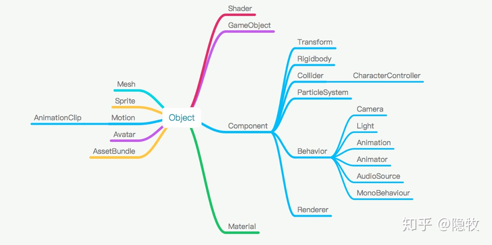

- 宏观控制类

Application —— 应用程序类

Input —— 输入类

GUI —— 图形输出类

Physics —— 物理引擎类

Resources —— 资源类

Time —— 时间类

- 游戏对象（GameObject）类

由于Unity是面向组件的开发模式（而非面向对象），所以从类的继承关系中也能看出，对于GameObject类没有下太多的笔墨，而是将更多的内容交给下面的组件类。

- 组件（Component）类

组件（Component）是用来绑定到游戏对象（Game Object）上的一组相关属性。本质上每个组件是一个类的实例。常见的组件有：MeshFilter、MeshCollider、Renderer、Animation等等。

其实不同的游戏对象，都可以看成是一个空的游戏对象，只是绑定了不同的组件。比如：Camera对象，就是一个空对象，加上Camera、GUILayer、FlareLayer、AudioListener等组件。其他对象绑定的组件，可自行观察。

开发的时候，我们使用最多的就是Unity组件类以及自定义的组件脚本。


## **二：Time等常见工具类的使用**

（1）Unity提供了Time类，这个类主要用来获取当前的系统时间。其中常见的几个属性如下所示：

- Time.time:从游戏开始后开始计时，表示截止目前共运行的游戏时间。
- Time.deltaTime:获取Update()方法中完成上一帧所消耗的时间。
- Time.fixedTime:FixedUpdate()方法中固定消耗的时间总和。FixedUpdate()每一帧更新的时间可以通过导航菜单栏”Edit“——”Project Settings“——”Time“菜单项去设置。
- Time.fixedDeltaTime:固定更新上一帧所消耗的时间。
- Time.timeScale:时间比例，等于0表示暂停，＝1表示正常，大于1表示加速，小于1表示减速。只影响FixedUpdate，不影响Update和LateUpdate。

问题:如何让一个对象匀速运动？匀速旋转？

（2）随机数：在开发中，有时需要获取程序中的随机数，这可以使用Random.Range()方法实现，其中该方法的第一个参数为随机数的起始位置，第二个参数为获取的随机数的结束位置。

（3）Unity开发中封装了一个数学类Mathf，使用它可以很轻松地帮我们解决复杂的数学公式。

## **三：Unity脚本生命周期函数**

若是使用脚本函数，我们必须熟练的掌握脚本函数的执行顺序。我们通过下面的例子来学习脚本的生命周期函数。

```csharp
public class LifeTest : MonoBehaviour {
	void Reset()
	{
		print ("Reset");
	}
	void Awake(){
		print ("Awake");
	}
	void OnEnable()
	{
		print ("Enabled");
	}
	// Use this for initialization
	void Start () {
		print ("Start");
	}
       // Update is called once per frame
	void Update () {
		print ("update");
	}
	void FixedUpdate()
	{
		print ("fixed");
	}
	void OnDisable()
	{
		print ("disabled");
	}
	void OnDestroy()
	{
		print ("destroy");
	}
｝
```

大体可以分为以下五个阶段：

编辑阶段Reset->开始阶段Awake-OnEnable-Start->迭代更新阶段FixedUpdate-Update-LateUpdate->显示阶段OnGUI->清除阶段OnDisable-OnDestroy

## **四：对象基本操作**

## **4.1:对象查找操作**

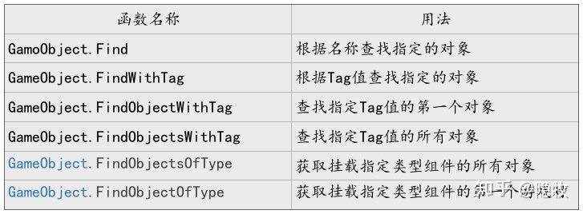

通过案例依次使用每个函数。掌握每个函数的具体用法。

何为Tag？

Tag是Unity为了标识一个对象而设计的，通过Tag值可以对具体的对象进行管理和筛选，比如碰撞检测的时候，可以通过Tag值过滤一些没必要发生碰撞的物体。如何修改Tag值呢？

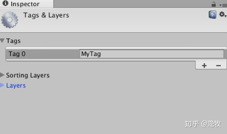

```csharp
using UnityEngine;
using System.Collections;
public class Test : MonoBehaviour {
	// Use this for initialization
	void Start () {
		GameObject[] array = GameObject.
			FindGameObjectsWithTag ("MyTag");
		print (array.Length);
		GameObject one=GameObject.FindGameObjectWithTag ("MyTag");
		print (one.name);	
      SayHello sayHello= GameObject.FindObjectOfType<SayHello>();
      Debug.LogFormat ("{0}{1}",sayHello.gameObject.name,
		                 sayHello.gameObject.tag);

      SayHello[] says = GameObject.FindObjectsOfType<SayHello> ();
		foreach (var item in says) {
			Debug.LogFormat ("{0}{1}",item.gameObject.name,
			                 item.gameObject.tag);
}
}
```

何为Layer？

在Unity中用int32数据类型来表示32个Layer层。int32表示二进制一共有32位（0—31）。在Unity中每个GameObject都有Layer属性，默认的Layer都是Default。在Unity中可编辑的Layer共有24个（8—31层），官方已使用的是0—7层，默认不可编辑。

在Unity中使用LayerMask：

Layers通常被摄像机用来渲染部分场景，和灯光照射部分场景使用。但是它们也可以用来做射线检测时忽略一些collder或Collision使用。

如何编辑Layers.

在代码中使用时如何开启某个Layers？答案是正确使LayerMask。

LayerMask mask = 1 << 你需要开启的Layers层。

LayerMask mask = 0 << 你需要关闭的Layers层。

例如：

LayerMask mask = 1 << 2; 表示开启Layer2。

LayerMask mask = 0 << 5;表示关闭Layer5。

LayerMask mask = 1<<2|1<<8;表示开启Layer2和Layer8。

LayerMask mask = 0<<3|0<<7;表示关闭Layer3和Layer7。

```csharp
void Update ()  
{  
    if (Input.GetMouseButtonDown(0)) {  
        // 只检测第6层  
        LayerMask mask1 = 1 << 6;  
        // 只不检测第7层  
        LayerMask mask2 = ~(1 << 7);  
        // 只检测第8层和第9层  
        LayerMask mask3 = (1 << 8)|(1 << 9);  
  
        Ray ray = Camera.main.ScreenPointToRay(Input.mousePosition);  
        RaycastHit hit;  
        if (Physics.Raycast(ray, out hit, mask1)) {  
            Debug.Log("test");  
        }  
    }  
  
}  
```

## **4.2:组件查找操作**


```csharp
public class ComponentTest : MonoBehaviour {
	public GameObject obj;
	// Use this for initialization
	void Start () {
		//this.GetComponent<SayHello> ();
		//1
		SayHello h = obj.GetComponent<SayHello> ();
		h.Hello ();
		//2
		SayHello h1 = obj.GetComponentInChildren<SayHello> ();
		h1.Hello ();
		//3
		SayHello[] h2 = obj.GetComponentsInChildren<SayHello> ();
		print (h2.Length);

		SayHello[] h3= obj.GetComponents<SayHello>();
		print (h3.Length);
	}
｝
```

给物体添加组件的几种方式：

- 编辑器直接添加，不再多说
- 通过代码AddComponent添加

```csharp
if (!ball1.GetComponent<CharacterController> ()) {

			ball1.AddComponent<CharacterController> ();

		}
```

- 通过RequireComponent添加，在脚本添加下面一行代码即可，当把该脚本拖动到物体上时候，会自动为该物体添加刚体组件。

```csharp
[RequireComponent(typeof(Rigidbody))]
```

- 在该脚本内部添加一句代码[AddComponentMenu(“BodyTest”)]，那么此时，在Unity菜单栏下面会出现BodyTest菜单，点击即可添加该脚本。

```csharp
Rigidbody[] body=GetComponentsInChildren<Rigidbody> ();

print (body.Length);

print (body[0].name);
```

## **4.3:自定义脚本查找操作**

自定义一个脚本，提供一个public函数。

```csharp
using UnityEngine;
using System.Collections;
public class ChangeMat : MonoBehaviour {
	public void ChangeMatrial(GameObject obj,Color col){
		obj.GetComponent<MeshRenderer> ().material.color = col;
	}
}
public class TestChange : MonoBehaviour {
	// Use this for initialization
	void Start () {
		ChangeMat c = this.GetComponent<ChangeMat> ();
		if (c == null) {
			c = this.gameObject.AddComponent<ChangeMat> ();
		}
		c.ChangeMatrial (this.gameObject,Color.blue);
	}
}
```

## **4.4:层级关系查找游戏对象**

在层级视图的对象列表中，存在有父子关系，在代码中可以通过获取Transform组件来找到子对象或者父对象。

```csharp
using UnityEngine;
using System.Collections;
public class Cengci : MonoBehaviour {
	private Transform objT;
	// Use this for initialization
	void Start () {
      //transform.Find获取的是名称为Cube的子对象
		objT = this.transform.Find(“Cube”);
	  	}
	// Update is called once per frame
	void Update () {
		objT.Rotate(20*Time.deltaTime,0,0);
		objT.parent.Translate(1,0,0);//objT的父对象一直移动
	}
}
```

一旦获取到”Cube”子对象，就可以通过GetComponent方法获取到”Cube”子对象的所有组件。另外，Unity中可以通过遍历transform对象来获取其子对象，遍历代码如下：

```csharp
foreach(Transform child in transform){
			child.Translate(0.1f,0.1f,0);
}
```

## **4.5:代码创建游戏对象**

```csharp
	GameObject cube = GameObject.CreatePrimitive(PrimitiveType.Cube);

	cube.AddComponent<Rigidbody>();

	cube.transform.position = new Vector3(1, 1, 0);
```

//我们将obj1初始化为一个Cube立方体，当然我们也可以初始化为其他的形状

GameObject obj1 = GameObject.CreatePrimitive(PrimitiveType.Cube);

//设置物体的位置Vector3三个参数分别代表x,y,z的坐标数

obj1.transform.position = new Vector3(1,1,1);

//给这个创建出来的对象起个名字

obj1.name = "cube";

//设置物体的tag值，在赋值之前要在Inspector面板中注册一个tag值

//注册tag值得方法，用鼠标选中摄像机对象在Inspector面板中找到tag，选addtag

obj1.tag = "shui";

//设置物体贴图要图片文件放在(Resources）文件夹下，没有自己创建

obj1.renderer.material.mainTexture = (Texture)Resources.Load("psb20");

## **五：本章总结**

本章我们主要对Unity中的脚本进行了一个系统的介绍，主要需要大家掌握脚本的生命周期、常见工具类的使用、Unity组件机制、Unity对象查找规则等。

# Unity 四元数


# Unity Time


# Unity 单位


# Unity 错误

UnassignedReferenceException: The variable minutesTransform of Clock has not been assigned.
You probably need to assign the minutesTransform variable of the Clock script in the inspector.
UnityEngine.Transform.set_localRotation (UnityEngine.Quaternion value) (at <958b02b187a74cbdb62346d66445cafe>:0)
Clock.UpdateDiscrete () (at Assets/Clock.cs:38)
Clock.Update () (at Assets/Clock.cs:20)

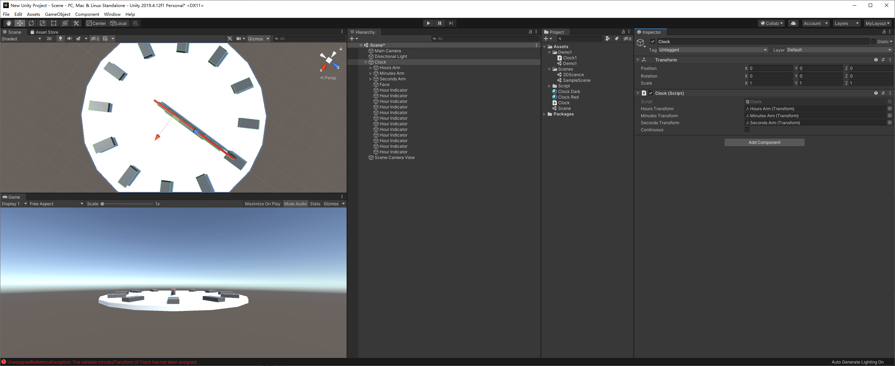


有可能是未指定对象

未指定对象

https://answers.unity.com/questions/627750/the-variable-has-not-been-assigned-but-it-has.html

https://answers.unity.com/questions/1040261/unassignedreferenceexception-the-variable-has-not.html

https://stackoverflow.com/questions/14722734/unassignedreferenceexception-the-variable-bullitprefab-of-movearound-has-not

# Unity 错误

Component at index 2 could not be loaded when loading game object 'Main Camera'. Removing it!
UnityEngine.GUIUtility:ProcessEvent(Int32, IntPtr)

移除组件后解决


https://forum.unity.com/threads/component-at-index-2-could-not-be-loaded-when-loading-game-object-maincamera-removing-it.920624/


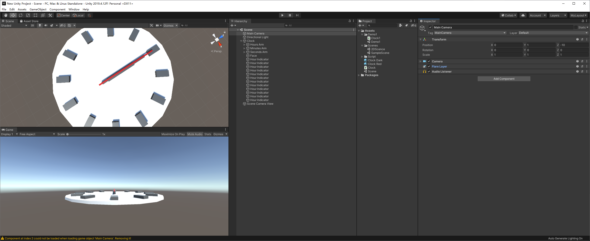


# Unity 窗口最大化问题

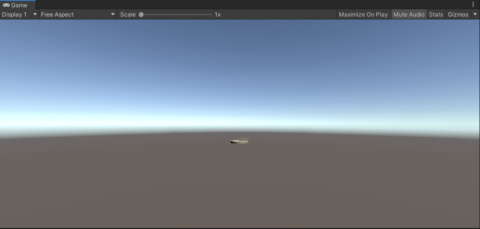

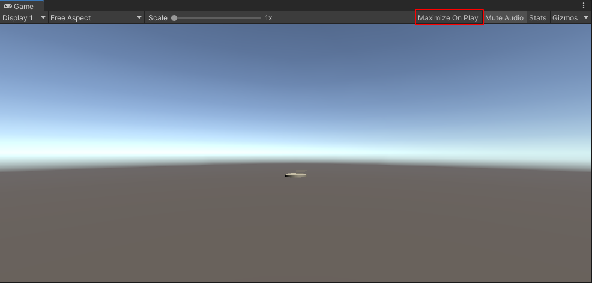


# Unity 错误

 Invalid editor window UnityEditor.FallbackEditorWindow
UnityEditor.EditorApplicationLayout:FinalizePlaymodeLayout()


# Unity 教程

[创建时钟](https://mp.weixin.qq.com/s/QaEZuMRGTf07pml_h1rhxA)


## 创建时钟

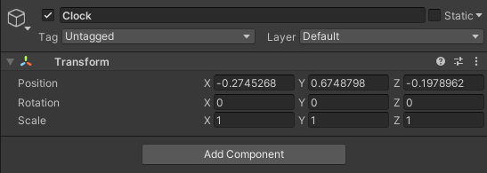


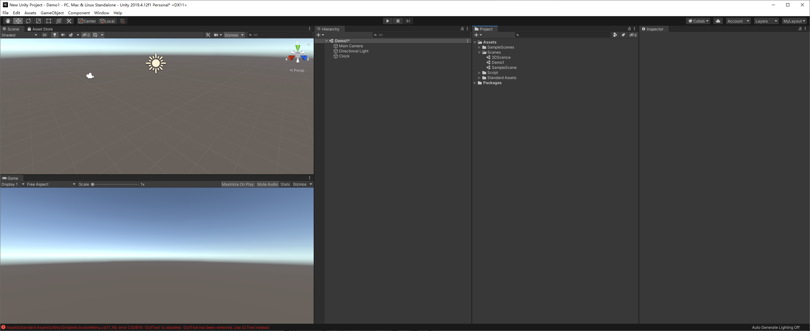


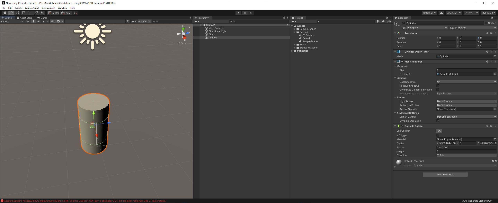


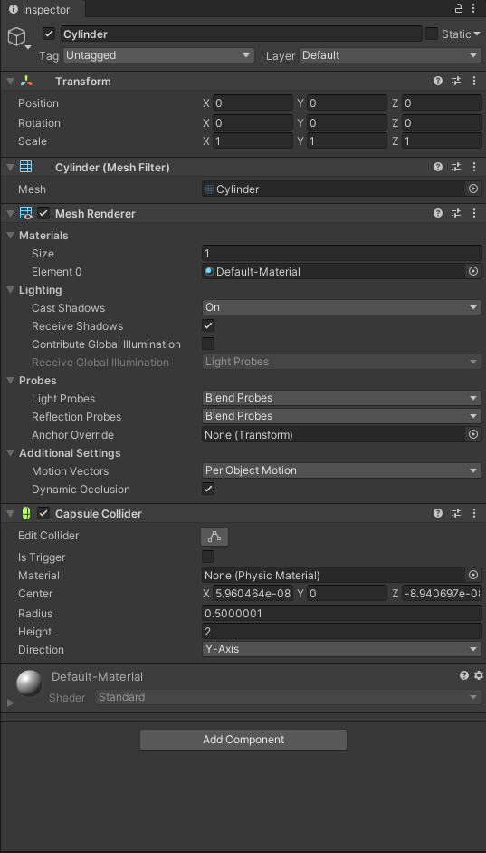


这个新的对象比刚才的clock对象多3个组件。

- Mesh Filter, 主要是引用了Unity内置的圆柱体网格。
- Capsule Collider，主要是用来做3D的物理。
- Mesh Renderer 这个组件是用来告诉Unity怎么把 Mesh Filter画出来的。它同时包含了一个内置的material（材质球）， 材质球可以根据需要自己创建或者更换，同时材质球也在Mesh Renderer的组件下面被展示出来了。


虽然这个物体代表的是圆柱体，但是它却有一个胶囊体的碰撞表示，那是因为Unity没有内置圆柱图的碰撞。在本例子里面，我们并不需要它，所以我们可以把它移除。不过如果你想把物理加入到时钟里的话，建议使用Mesh Collider组件。


每个组件都可以通过它右上角的齿轮图标，点击之后弹出的下拉列表进行移除。


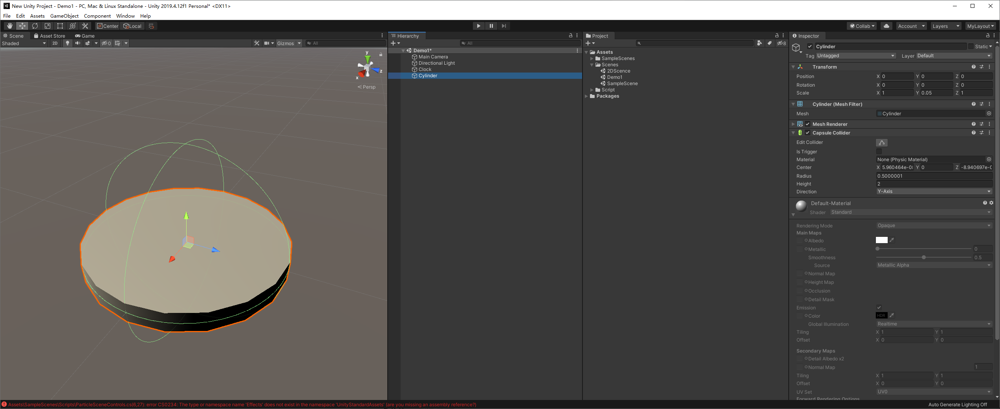


## 创建指针

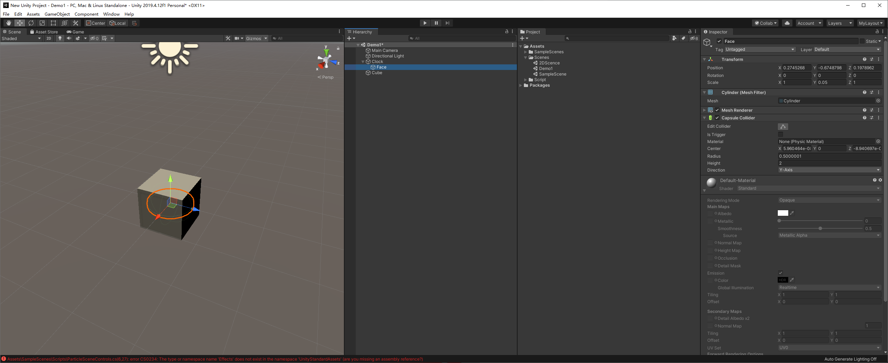


**修改指针**


Albedo 

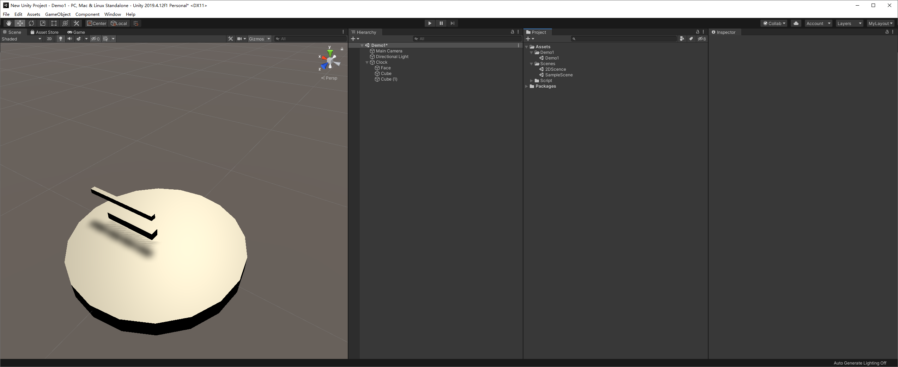


## 创建时钟指示


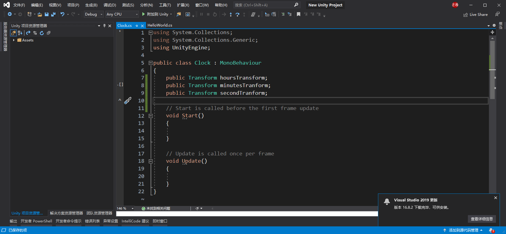


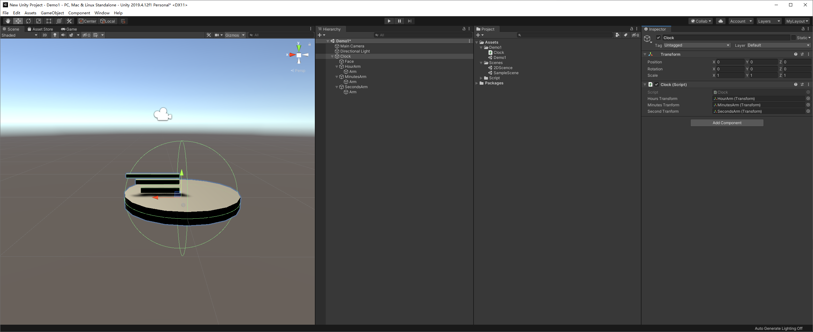


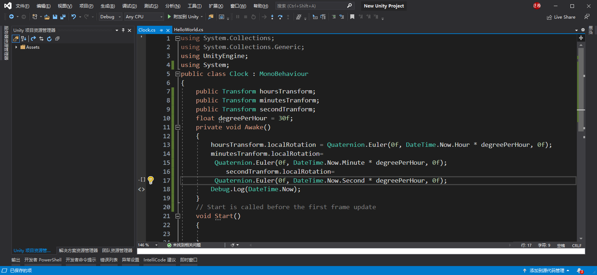

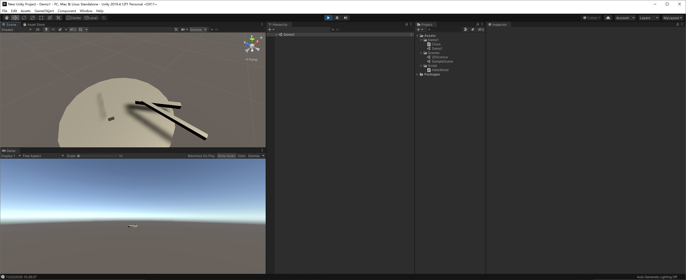


最终

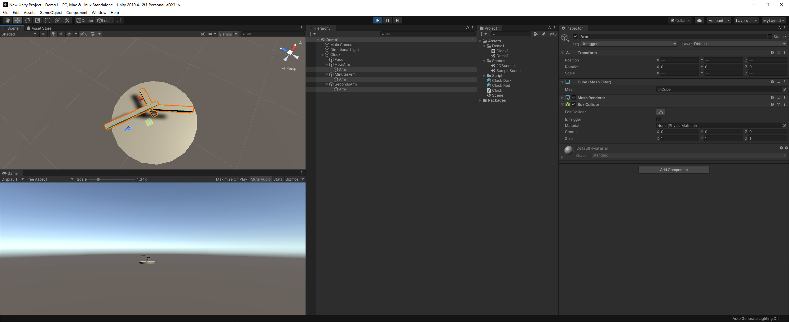

# Unity 保存布局


