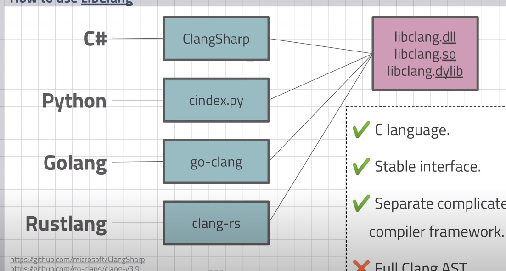

# ppt

https://github.com/gnab/remark


# 制作ppt

https://slides.com/


https://ppt.baomitu.com/





https://www.youtube.com/watch?v=-iOtb6luK1Q

# C++ 反射库

https://github.com/fankux/rellaf


Reflang-使用libclang的现代C ++反射

https://github.com/chakaz/reflang


# C++ 自动化测试和性能测试


# 使用Doxygen创建C/C++文档


# C++  文档工具

http://miloyip.github.io/rapidjson/index.html


# clang 源码分析


分析文章

http://people.cs.pitt.edu/~yongli/


https://blog.csdn.net/snsn1984

# clang 命令


显示ast

```
 clang++ -Xclang -ast-dump -fsyntax-only .\VectorData.h
```


# clang 源码分析


# clang 项目

> ### 外部Clang示例
>
> - - - [1. 介绍](https://blog.csdn.net/qq_23599965/article/details/90694205#1__2)
>     - [2. 项目和工具列表](https://blog.csdn.net/qq_23599965/article/details/90694205#2__11)
>
> 
> 本文为译文，点击 [此处](http://clang.llvm.org/docs/ExternalClangExamples.html)查看原文。
>
> 
>
> ### 1. 介绍
>
> 本页面提供了一些人们使用 Clang 所做的事情的示例，这些示例可以作为开发自己工具的有用指南(或起点)。它们甚至可能对一些像如何设置您的构建以集成Clang这样普通(但必要)的东西都有帮助。
>
> Clang基于库的设计旨在促进外部项目的使用，我们一直对改进 Clang 以更好地服务于外部用户感兴趣。Clang应用的一些典型类别包括：
>
> - 静态分析。
> - 文档/交叉引用的一代。
>
> 如果您了解(或编写了)使用 Clang 的一个工具或项目，请发送 email 到 Clang 的[开发讨论邮件列表](https://lists.llvm.org/mailman/listinfo/cfe-dev)中添加它。(如果您已经是 Clang 贡献者，那么可以直接提交添加内容)。由于本页面的主要目的是提供可以帮助开发人员的示例，所以通常他们必须有可用的代码。
>
> ### 2. 项目和工具列表
>
> 1. https://github.com/Andersbakken/rtags/
>    `RTags`是一个 client/server 应用程序，它索引 c/c++ 代码，并在内存中保存一个持久的数据库，其中包含引用、符号名、补全等。
> 2. https://rprichard.github.com/sourceweb/
>    一个 C/C++ 源代码索引器和导航器。
> 3. https://github.com/etaoins/qconnectlint
>    `qconnectlint`是一个 Clang 工具，用于静态验证使用 Qt 的`QObject::connect`建立的信号和插槽连接的一致性。
> 4. https://github.com/woboq/woboq_codebrowser
>    `Woboq`代码浏览器是一个基于web的代码浏览器，用于 C/C++ 项目。查看 https://code.woboq.org/ 获得一个示例。
> 5. https://github.com/mozilla/dxr
>    `DXR`是一个源代码交叉引用工具，它使用由插桩后的编译器收集的静态分析数据。
> 6. https://github.com/eschulte/clang-mutate
>    这个工具对C语言源文件执行许多操作。
> 7. https://github.com/gmarpons/Crisp
>    一个用于LLVM/clang的编码规则验证附加组件。`Crisp`规则是在Prolog中编写的。一个高级声明性 DSL 正在开发中，可以轻松地编写新规则。它将被命名为`CRISP`，这是`Coding Rules in Sugared Prolog`的首字母缩写。
> 8. https://github.com/drothlis/clang-ctags
>    为C++源代码生成 tag 文件。
> 9. https://github.com/exclipy/clang_indexer
>    这是一个基于`libclang`库的C和C++索引器。
> 10. https://github.com/holtgrewe/linty
>     `Linty` —— C/C++风格检查，使用 Python & libclang。
> 11. https://github.com/axw/cmonster
>     `cmonster`是一个用于 Clang C++ 解析器的Python wrapper。
> 12. https://github.com/rizsotto/Constantine
>     `Constantine`是一个学习如何编写 clang plugin 的简单项目。实现伪 const 分析。生成关于变量的警告，这些变量在声明时没有使用 const 限定符。
> 13. https://github.com/jessevdk/cldoc
>     `cldoc`是一个基于 Clang 的 C和C++文档生成器。`cldoc`试图用一种现代的、非侵入性的、健壮的方法来解决编写`C/C++`软件文档的问题。
> 14. https://github.com/AlexDenisov/ToyClangPlugin
>     实现 Objective-C 语义检查的最简单的 Clang plugin。这个例子展示了如何使用`DiagnosticsEngine`（发出警告、错误和fixit提示）。参见 http://l.rw.rw/clang_plugin 查看详细的步骤说明。
> 15. https://phabricator.kde.org/source/clazy
>     `clazy`是一个编译器插件，它允许 clang 理解 Qt 语义。你会得到50多个 Qt 相关的编译器警告，从不需要的内存分配到API的滥用，包括用于自动重构的`fix-its`。
> 16. https://gerrit.libreoffice.org/gitweb?p=core.git;a=blob_plain;f=compilerplugins/README;hb=HEAD
>     `LibreOffice`使用一个 Clang plugin 基础设施在构建过程中检查各种东西，有些是`LibreOffice`源代码特有的，有些不是。目前大约有50个这样的检查器，从`flagging C-style casts`和保留标识符的使用，到确保代码遵循特定于`LibreOffice`类的特定生命周期协议。它们可以作为编写基于RecursiveASTVisitor的 plugins 的例子。


# LLVM安装记录


```
PS D:\Software\Scoop\ScoopLocal\buckets\versions> vcpkg install llvm
Computing installation plan...
The following packages will be built and installed:
    llvm[clang,core,default-targets,disable-abi-breaking-checks,disable-assertions,disable-clang-static-analyzer,enable-rtti,lld,target-x86,tools]:x64-windows -> 11.0.0
Detecting compiler hash for triplet x64-windows...
Could not locate cached archive: C:\Users\MEI\AppData\Local\vcpkg\archives\3a\3a6ae255deb5bbfff18eff5ba2c855cef343e626.zip
Starting package 1/1: llvm:x64-windows
Building package llvm[clang,core,default-targets,disable-abi-breaking-checks,disable-assertions,disable-clang-static-analyzer,enable-rtti,lld,target-x86,tools]:x64-windows...
-- Note: llvm only supports static library linkage. Building static library.
-- Using cached D:/Software/vcpkg/downloads/llvm-llvm-project-llvmorg-11.0.0.tar.gz
-- Extracting source D:/Software/vcpkg/downloads/llvm-llvm-project-llvmorg-11.0.0.tar.gz
-- Applying patch 0001-add-msvc-options.patch
-- Applying patch 0002-fix-install-paths.patch
-- Applying patch 0003-fix-openmp-debug.patch
-- Applying patch 0004-fix-dr-1734.patch
-- Applying patch 0005-fix-tools-path.patch
-- Applying patch 0006-workaround-msvc-bug.patch
-- Using source at D:/Software/vcpkg/buildtrees/llvm/src/org-11.0.0-9a84d27ce8.clean
-- Configuring x64-windows
-- Building x64-windows-dbg
-- Building x64-windows-rel
Building package llvm[clang,core,default-targets,disable-abi-breaking-checks,disable-assertions,disable-clang-static-anaInstalling package llvm[clang,core,default-targets,disable-abi-breaking-checks,disable-assertions,disable-clang-static-analyzer,enable-rtti,lld,target-x86,tools]:x64-windows...
Installing package llvm[clang,core,default-targets,disable-abi-breaking-checks,disable-assertions,disable-clang-static-analyzer,enable-rtti,lld,target-x86,tools]:x64-windows... done
Elapsed time for package llvm:x64-windows: 3.237 h

Total elapsed time: 3.239 h
```

