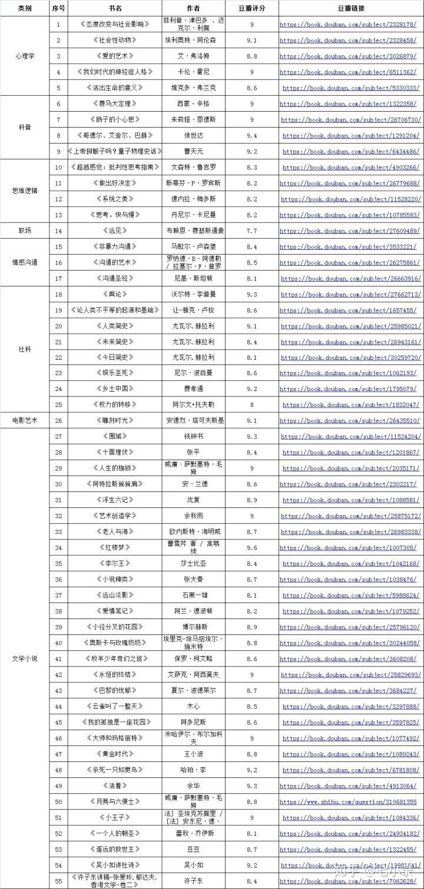

# 五笔

五笔编码查询

https://www.52wubi.com/wbbmcx/	

# 如何阅读一本书

http://www.sssch.net/Admin/ckfinder/userfiles/files/shujixiazai/shujijijin/%E5%A6%82%E4%BD%95%E9%98%85%E8%AF%BB%E4%B8%80%E6%9C%AC%E4%B9%A6.pdf

# 穷查理宝典

# 电子书 下载网站

http://www.x5v.net/

# 语言学研究阅读参考书目

# 200本汉语语言学/语法相关的pdf电子书 

确引导机器在能正确理解汉语并获取知识──事关人工智能开发的一个重要前提。但这是一个大工程，任重道远，我搜罗了200本汉语语言学/语法相关的pdf电子书。

01、词汇语义学与词典编纂_张志毅、张庆云.pdf

02、词类问题考察续集_胡明扬.pdf

03、词义的分析和描写_符淮青.pdf

04、动词研究_胡裕树、范晓.pdf

05、功能主义与汉语语法_戴浩一、薛凤.pdf

06、多角度研究语言_王德春.pdf

07、汉语褒贬义词语用法词典_王国璋.pdf

08、汉语标点研究_钟伟芸.pdf

09、汉语常用词演变研究(第二版)_李宗江.pdf

10、汉语常用动词历时与共时研究_白云.pdf

11、汉语称谓词典_王火、王学元.pdf

12、汉语成语词典_何平.pdf

13、汉语词法句法论集_汤廷池.pdf

14、汉语词汇核心义研究_王云路.pdf

15、汉语词汇讲话_周祖谟.pdf

16、汉语词汇语法史论文集_蒋绍愚.pdf

17、汉语词类的认知研究和模煳划分_袁毓林.pdf

18、汉语词类划分手册_袁毓林.pdf

19、汉语的词库与词法_董秀芳.pdf

20、汉语的构词法_陆志韦.pdf

21、汉语的构词法研究_潘文国.pdf

22、汉语的时相时制时态_龚千炎.pdf

23、汉语的韵律词法与句法_冯胜利.pdf

24、汉语动补结构的产生与演变_梁银峰.pdf

25、汉语动词的配价研究_袁毓林.pdf

26、汉语动词用法词典_孟琮、孟庆海、邓德怀、蔡文兰.pdf

27、汉语儿童语言发展研究：国际儿童语料库研究_周兢.pdf

28、汉语方式状语_何洪峰.pdf

29、汉语方位类词相关问题研究_邱斌.pdf

30、汉语复句研究_邢福义.pdf

31、汉语格系统句法重建和汉语起源演化问题_朱琳.pdf

32、汉语功能语法研究_张伯江、方梅.pdf

33、汉语构词论_万献初.pdf

34、汉语和汉语研究十五讲_陆俭明、沈阳.pdf

35、汉语句法学_Audrey Li,Yafei Li.pdf

36、汉语句群_吴为章、田小琳.pdf

37、汉语口语语法_赵元任.pdf

38、汉语连词语义演变研究_徐朝红.pdf

39、汉语联合短语研究_储泽祥、谢晓明.pdf

40、汉语配价分析与实践：现代汉语三价动词探索_徐峰.pdf

41、汉语配价语法研究_袁毓林.pdf

42、汉语篇章语法_屈承熹.pdf

43、汉语平比句的语法化研究_李焱、孟繁杰.pdf

44、汉语人称代词考论_陈翠珠.pdf

45、汉语人名学论纲_纪秀生.pdf

46、汉语人体词语研究_[韩]李玄玉.pdf

47、汉语使役现象的类型学和历时认知研究_朱琳.pdf

48、汉语熟语论_王勤.pdf

49、汉语双音节的衍生和发展_董秀芳.pdf

50、汉语特殊句法中的语义研究_张旺熹.pdf

51、汉语外来词词典_刘正埮、高名凯、麦有乾、史有为.pdf

52、汉语委婉语研究_李军华.pdf

53、汉语象征功能概论_李柏令.pdf

54、汉语研究基本数理统计方法_张卫国.pdf

55、汉语义类词群的语义范畴及隐喻认知研究(一)_冯英.pdf

56、汉语义类词群的语义范畴及隐喻认知研究(二)_冯英.pdf

57、汉语义类词群的语义范畴及隐喻认知研究(三)_冯英.pdf

58、汉语语法分析问题_吕叔湘.pdf

59、汉语语法的立体研究_邵敬敏.pdf

60、汉语语法的意合网络_鲁川.pdf

61、汉语语法场导论_胡正微.pdf

62、汉语语法和语法化研究_王兴才.pdf

63、汉语语法化的历程_石毓智、李讷.pdf

64、汉语语法三百问_刑福义.pdf

65、汉语语法散论及其他_洪成玉.pdf

66、汉语语法学_邢福义.pdf

67、汉语语法学_张斌.pdf

68、汉语语法研究论：汉语语法研究之研究 _萧国政.pdf

69、汉语语法专题研究_邵敬敏、任芝、李家树.pdf

70、汉语语素论_杨锡彭.pdf

71、汉语语序的历史发展_张赪.pdf

72、汉语语学义理举实_李开.pdf

73、汉语作格动词的历史演变研究_宋亚云.pdf

74、汉字学概要_王宁.pdf

75、话题的结构与功能_刘丹青、徐烈炯.pdf

76、基于单字的现代汉语词法研究_王洪君.pdf

77、基于认知语言学的语篇翻译研究_王晓农、张福勇、刘世贵.pdf

78、介词与介引功能_陈昌来.pdf

79、句法理论概要_宋国明.pdf

80、句法理论基础_[美]R.P.斯托克威尔.pdf

81、句法学_楚军.pdf

82、理论语言学_李宝嘉.pdf

83、现代汉语比较范畴的语义认知基础_刘炎.pdf

84、美国结构语言学与现代汉语语法比较研究_马庆林.pdf

85、面临新世纪挑战的现代汉语语法研究_陆俭明.pdf

86、普遍语法原则与汉语语法现象_徐杰.pdf

87、认知能力与语言学理论_石毓智.pdf

88、实用汉语参考语法_李英哲.pdf

89、社会语言学概论_祝畹瑾.pdf

90、实用现代汉语教程_韩荔华.pdf

91、实用现代汉语语法_刘月华、潘文娱、故韡.pdf

92、数词·量词·代词_王希杰.pdf

93、面向信息处理的现代汉语“名+名”逻辑语义研究_宋春阳.pdf

94、现代汉语_叶宝奎、曾传兴.pdf

95、现代汉语(第一版)_北京大学现代汉语教研室.pdf

96、现代汉语_黄伯荣.pdf

97、现代汉语八百词(增订本)_吕叔湘.pdf

98、现代汉语把字句的多角度探究_刘培玉.pdf

99、现代汉语被字句研究_游舒.pdf

100、现代汉语词汇的形成：十九世纪汉语外来词研究_[意]马西尼.pdf

101、现代汉语词汇学(第三版)_葛本仪.pdf

102、现代汉语词汇研究_曹炜.pdf

103、现代汉语词类研究_郭锐.pdf

104、现代汉语词名探源词典_王艾录.pdf

105、现代汉语动词_李临定.pdf

106、现代汉语动词语义计算理论_靳光瑾.pdf

107、现代汉语多方位研究_周刚.pdf

108、现代汉语多义词词典(修订版)_袁晖.pdf

109、现代汉语复句句式研究_徐阳春.pdf

110、现代汉语复句新解_王维贤、张学成、卢曼云、程怀友.pdf

111、现代汉语复句研究_赵恩芳、唐雪凝.pdf

112、现代汉语副词分类实用词典_宋汇川、许皓光、刘延新、宋凤英.pdf

113、现代汉语副词探索_张谊生.pdf

114、现代汉语副词研究_张谊生.pdf

115、现代汉语格式初探___朱林清.pdf

116、现代汉语基本助动词语义研究_[日]鲁晓琨.pdf

117、现代汉语兼语式_邢欣.pdf

118、现代汉语介词研究_傅雨贤、周小兵、李炜.pdf

119、现代汉语句法分析_竞存、侯学超.pdf

120、现代汉语句法结构与分析_吴竞存、梁伯枢.pdf

121、现代汉语句法论_陆俭明.pdf

122、现代汉语句型_李临定.pdf

123、现代汉语句子_张斌.pdf

124、现代汉语空间问题研究_齐沪扬.pdf

125、现代汉语连动式的语法化视角_高增霞.pdf

126、现代汉语量词研究_何杰.pdf

127、现代汉语描写语法_张斌.pdf

128、现代汉语名词研究_王珏.pdf

129、现代汉语难词词典_吕才桢、白玉昆、白林.pdf

130、现代汉语配价语法研究(第一辑)_沈阳、郑定欧.pdf

131、现代汉语配价语法研究(第二辑)_袁毓林.pdf

132、现代汉语篇章回指研究_徐赳赳.pdf

133、现代汉语情态动词否定研究_宋永圭.pdf

134、现代汉语情态研究_彭利贞.pdf

135、现代汉语色彩词立体研究_加晓昕.pdf

136、现代汉语时体系统研究_戴耀晶.pdf

137、现代汉语实词搭配词典_张寿康、林可杏光.pdf

138、现代汉语特殊句式_宋玉柱.pdf

139、现代汉语通论_邵敬敏.pdf

140、现代汉语形容词功能与认知研究 _张国宪.pdf

141、现代汉语形容辞典_陶然、萧良、岳中、张志东.pdf

142、现代汉语虚词词典_王自强.pdf

143、现代汉语虚词讲义_李晓琪.pdf

144、现代汉语虚词例释_北京大学中文系.pdf

145、现代汉语虚词散论_陆俭明、马真.pdf

146、现代汉语虚词手册_李晓琪.pdf

147、现代汉语虚词研究综述_张斌 范开泰.pdf

148、现代汉语虚词用法小词典_王自强.pdf

149、现代汉语虚词造句_李凤仪.pdf

150、现代汉语虚义动词研究 _刁晏斌.pdf

151、现代汉语疑问句研究_邵敬敏.pdf

152、现代汉语语法的功能、语用、认知研究_沈家煊.pdf

153、现代汉语语法分析_范开泰、张亚军.pdf

154、现代汉语语法讲话_pdf_丁声树.pdf

155、现代汉语语法教程_朱成器.pdf

156、现代汉语语法系统的建立_石毓智.pdf

157、现代汉语语法研究_[苏联]A.A.龙果夫.pdf

158、现代汉语语法研究_朱德熙.pdf

159、现代汉语语法研究教程_陆俭明.pdf

160、现代汉语语汇学_卢英顺.pdf

161、现代汉语中的功能范畴_熊仲儒.pdf

162、现代汉语状位形容词的“系”研究_郑贵友.pdf

163、现代语言学_张喆、郑淑娟.pdf

164、现代语言学的历史与现状_林玉山.pdf

165、现代语言学方法论_方经民.pdf

166、新编现代汉语词典上卷_欧少亭.pdf

167、新编现代汉语词典下卷_欧少亭.pdf

168、形式汉语句法学_邓思颖.pdf

169、应用语言学_刘涌泉、乔毅.pdf

170、语法、语汇研究十大认识问题_卢英顺.pdf

171、语法的多视角研究_金立鑫.pdf

172、语法分析讲稿_朱德熙.pdf

173、语法的形式和理据_石毓智.pdf

174、语法概念的综合与分析的辩证逻辑_张文.pdf

175、语法研究和探索_吕叔湘、朱德熙.pdf

176、语法研究录_李宇明.pdf

177、语法研究入门_吕叔湘、马庆株.pdf

178、语法研究与语法应用_邵敬敏.pdf

179、语料库语言学_黄昌宁、李涓子.pdf

180、语言的神经机制与语言理论研究_杨亦鸣.pdf

181、语言经纬_华劭.pdf

182、语言理据研究_王艾录、司富珍.pdf

183、语言论_高名凯.pdf

184、语言论——语义型语言的结构原理和研究方法_徐通锵.pdf

185、语言问题探索_王宗炎.pdf

186、语言系统及其运作_陈雨民.pdf

187、语言学方法论_桂诗春、宁春岩.pdf

188、语言能力及其分化：第二轮语言哲学对话_于根元、夏中华、赵俐.pdf

189、语言学前沿与汉语研究_刘丹青.pdf

190、语言学新解_熊学亮.pdf

191、语言研究的深度思考_何干俊.pdf

192、语言哲学_陈嘉映.pdf

193、语言哲学研究 21世纪中国后语言哲学沉思录(上、下)_王寅.pdf

194、语义的变化转换研究_廖光蓉.pdf

195、现代汉语语义学_詹人凤.pdf

196、现代语言学流派(修订本)_冯志伟.pdf

197、中国语法思想史_林玉山.pdf

198、朱德熙选集_朱德熙.pdf

199、主题在汉语中的功能研究：迈向语段分析的第一步_曹逢甫.pdf

200、“这”“那”的指示功能研究_王道英.pdf

# 现代汉语&语言学研究参阅书目400本

https://zhuanlan.zhihu.com/p/341976948

现代汉语语言学和语法学对智能问答(聊天机器人)、句法分析、自然语言理解、信息抽取、知识库构建、主题词识别、自动摘要、语义理解、对话生成、话题推荐、语言模型、机器翻译、语义表示等方面在汉语中的快速发展和广泛使用，因此，我们必须很好的掌握现代汉语语言学和语法学知识。

01、“这”“那”的指示功能研究.pdf

02、不对称和标记论_沈家煊.pdf

03、词汇语义学与词典编纂.pdf

04、词类问题考察续集.pdf

05、词义的分析和描写.pdf

06、动词研究.pdf

07、多角度研究语言.pdf

08、方法：语言学的灵魂_朱晓农.pdf

09、复句与关系词语_邢福义.pdf

10、功能主义与汉语语法.pdf

11、国语变形语法研究（第一集 移位变形)_汤廷池.pdf

12、国语语法研究论集_汤廷池.pdf

13、汉语“其”之研究_马梅玉.pdf

14、汉语褒贬义词语用法词典.pdf

15、汉语标点研究.pdf

16、汉语常用词演变研究(第二版).pdf

17、汉语常用动词历时与共时研究.pdf

18、汉语称谓词典.pdf

19、汉语成语词典.pdf

20、汉语词法句法论集_汤廷池.pdf

21、汉语词汇核心义研究.pdf

22、汉语词汇讲话_周祖谟.pdf

23、汉语词汇结构论_周荐.pdf

24、汉语词汇语法史论文集.pdf

25、汉语词类的认知研究和模煳划分.pdf

26、汉语词类划分手册.pdf

27、汉语词义发展基本类型.pdf

28、汉语单音节词的多维研究.pdf

29、汉语的词库与词法_董秀芳.pdf

30、汉语的构词法.pdf

31、汉语的构词法研究.pdf

32、汉语的句子与子句结构_曹逢甫.pdf

33、汉语的时相时制时态.pdf

34、汉语的位序变换 “形容词+点儿”状补换位专题研究.pdf

35、汉语的韵律词法与句法.pdf

36、汉语动补结构的产生与演变.pdf

37、汉语动词的配价研究.pdf

38、汉语动词和动词性结构_马庆株.pdf

39、汉语动词用法词典.pdf

40、汉语儿童语言发展研究：国际儿童语料库研究_周兢.pdf

41、汉语法特点面面观_邢福义.pdf

42、汉语方式状语_何洪峰.pdf

43、汉语方位类词相关问题研究.pdf

44、汉语复句研究.pdf

45、汉语副词的主观性与主观化研究.pdf

46、汉语格系统句法重建和汉语起源演化问题.pdf

47、汉语功能语法研究.pdf

48、汉语构词法和造词法研究_李仕春.pdf

49、汉语构词论.pdf

50、汉语和汉语研究十五讲_陆俭明.pdf

51、汉语和汉语研究十五讲(第二版)_陆俭明.pdf

52、汉语结构助词“的”的历史演变研究.pdf

53、汉语介词词组词序的历史演变.pdf

54、汉语介词词组词序的历史演变_张帧.pdf

55、汉语介词和介词短语.pdf

56、汉语句法学_[美]黄正德、李艳慧、李亚非.pdf

57、汉语句群.pdf

58、汉语句子的多角度研究_范晓.pdf

59、汉语句子及其句式研究.pdf

60、汉语口语语法.pdf

61、汉语连词语义演变研究.pdf

62、汉语联合短语研究.pdf

63、汉语量词大词典.pdf

64、汉语量词研究_惠红军.pdf

65、汉语-逻辑相应相异研究.pdf

66、汉语配价分析与实践：现代汉语三价动词探索.pdf

67、汉语配价语法研究.pdf

68、汉语篇章语法_屈承熹.pdf

69、汉语平比句的语法化研究_李焱、孟繁杰.pdf

70、汉语人称代词考论.pdf

71、汉语人名学论纲.pdf

72、汉语人体词语研究.pdf

73、汉语三价动词的语法研究_杜克华.pdf

74、汉语生成语法——汉语中的逻辑关系及其语法理论_黄正德.pdf

75、汉语使役现象的类型学和历时认知研究.pdf

76、汉语熟语论.pdf

77、汉语双音节的衍生和发展.pdf

78、汉语水语关系词研究.pdf

79、汉语特殊句法中的语义研究_张旺熹.pdf

80、汉语外来词词典.pdf

81、汉语委婉语研究.pdf

82、汉语象征功能概论.pdf

83、汉语信息处理研究.pdf

84、汉语虚词词典_李科第.pdf

85、汉语研究基本数理统计方法.pdf

86、汉语研究新探.pdf

87、汉语义类词群的语义范畴及隐喻认知研究(二).pdf

88、汉语义类词群的语义范畴及隐喻认知研究(三).pdf

89、汉语义类词群的语义范畴及隐喻认知研究(一).pdf

90、汉语因果关系连词的主观性研究.pdf

91、汉语语法场导论_胡正微.pdf

92、汉语语法的立体研究.pdf

93、汉语语法的意合网络.pdf

94、汉语语法分析问题.pdf

95、汉语语法和语法化研究.pdf

96、汉语语法化的历程.pdf

97、汉语语法基础_吕冀平.pdf

98、汉语语法三百问.pdf

99、汉语语法散论及其他.pdf

100、汉语语法新通路(修订版)_周晓更.pdf

101、汉语语法学_刑福义.pdf

102、汉语语法学_张斌.pdf

103、汉语语法学研究.pdf

104、汉语语法研究论：汉语语法研究之研究

105、汉语语法专题研究_邵敬敏、任芝锳、李家树.pdf

106、汉语语素论.pdf

107、汉语语序的历史发展.pdf

108、汉语语学义理举实.pdf

109、汉语语言学及应用语言学研究.pdf

110、汉语语义语法范畴问题_马庆株.pdf

111、汉语造词研究_陈宝勤.pdf

112、汉语照应省略的类型逻辑研究.pdf

113、汉语中的日语借词研究.pdf

114、汉语字本位语法导论.pdf

115、汉语字基语法 语素层造句的理论和实践.pdf

116、汉语作格动词的历史演变研究.pdf

117、汉语作为第二语言的语用习得研究.pdf

118、话题的结构与功能.pdf

119、基于单字的现代汉语词法研究_王洪君.pdf

120、基于认知语言学的语篇翻译研究.pdf

121、介词与介引功能_陈昌来.pdf

122、肯定和否定的对称与不对称_石毓智.pdf

123、类型学视野下汉语趋向范畴的跨方言比较 基于“起”组趋向词的专题研究.pdf

124、连词与相关问题_周刚.pdf

125、美国结构语言学与现代汉语语法比较研究_马庆林.pdf

126、面临新世纪挑战的现代汉语语法研究.pdf

127、面向信息处理的现代汉语“名+名”逻辑语义研究.pdf

128、普遍语法原则与汉语语法现象.pdf

129、认知能力与语言学理论.pdf

130、认知语法基础 理论前提_[美]Langacker.pdf

131、认知语法基础 描写应用_[美]Langacker.pdf

132、认知语言学与汉语名词短语_张敏.pdf

133、认知语言学与汉语研究_吴为善.pdf

134、社会语言学概论.pdf

135、实用汉语参考语法_李英哲.pdf

136、实用现代汉语教程.pdf

137、实用现代汉语语法.pdf

138、数词·量词·代词.pdf

139、现代汉语_北京大学中国语言文学系现代汉语教研室.pdf

140、现代汉语_黄伯荣、廖序东(增订第六版).pdf

141、现代汉语_叶宝奎、曾传兴、张修仁 .pdf

142、现代汉语_周一民.pdf

143、现代汉语八百词(增订本).pdf

144、现代汉语把字句的多角度探究.pdf

145、现代汉语被字句研究.pdf

146、现代汉语本体与应用探索.pdf

147、现代汉语比较范畴的语义认知基础.pdf

148、现代汉语常用5500字.pdf

149、现代汉语常用词用法词典_顾士熙.pdf

150、现代汉语词汇的形成：十九世纪汉语外来词研究.pdf

151、现代汉语词汇学(第三版).pdf

152、现代汉语词汇研究.pdf

153、现代汉语词库.pdf

154、现代汉语词类研究.pdf

155、现代汉语词名探源词典.pdf

156、现代汉语词义学_曹炜.pdf

157、现代汉语单音节动词重叠研究_崔慜知.pdf

158、现代汉语递进范畴研究_周静.pdf

159、现代汉语动词.pdf

160、现代汉语动词的指称化研究.pdf

161、现代汉语动词语义计算理论.pdf

162、现代汉语动趋构式的句法语义研究 认知构式语法视野.pdf

163、现代汉语多方位研究_周刚.pdf

164、现代汉语多义词词典(修订版).pdf

165、现代汉语反义复合词式的语义和认知研究.pdf

166、现代汉语分类词典_徐为民.pdf

167、现代汉语附加问句研究.pdf

168、现代汉语复句句式研究.pdf

169、现代汉语复句新解

170、现代汉语复句研究.pdf

171、现代汉语副词分类实用词典_姜汇川、许皓光.pdf

172、现代汉语副词探索.pdf

173、现代汉语副词研究.pdf

174、现代汉语格式初探.pdf

175、现代汉语工具范畴的认知研究_徐默凡.pdf

176、现代汉语话语否定标记研究_李先银.pdf

177、现代汉语基本助动词语义研究.pdf

178、现代汉语兼语式_邢欣.pdf

179、现代汉语介词研究.pdf

180、现代汉语句法分析.pdf

181、现代汉语句法结构与分析.pdf

182、现代汉语句法论.pdf

183、现代汉语句式及相关问题研究_宗守云.pdf

184、现代汉语句型.pdf

185、现代汉语句子.pdf

186、现代汉语句子的时间语义范畴研究.pdf

187、现代汉语空间问题研究.pdf

188、现代汉语类固定短语研究_陈昌来、李传军.pdf

189、现代汉语连动式的语法化视角_高增霞.pdf

190、现代汉语量词研究_何杰.pdf

191、现代汉语量词研究(增编版)_何杰.pdf

192、现代汉语名词研究.pdf

193、现代汉语难词词典.pdf

194、现代汉语旁指代词的功能研究.pdf

195、现代汉语配价语法研究(第二辑)

196、现代汉语配价语法研究(第一辑)

197、现代汉语篇章回指研究.pdf

198、现代汉语篇章组块问题研究.pdf

199、现代汉语歧义识别与消解的认知研究_周明强.pdf

200、现代汉语情态动词否定研究.pdf

201、现代汉语情态研究_彭利贞.pdf

202、现代汉语趋向结构系统的功能研究 基于事件语义学的考察_郭晓麟.pdf

203、现代汉语色彩词立体研究.pdf

204、现代汉语生成语法_何元健.pdf

205、现代汉语时体系统研究.pdf

206、现代汉语实词搭配词典.pdf

207、现代汉语实词及相关问题研究.pdf

208、现代汉语受事宾语句研究.pdf

209、现代汉语属性名词语义特征研究_许艳平.pdf

210、现代汉语缩略词语研究.pdf

211、现代汉语特殊句式.pdf

212、现代汉语体貌系统的二元分析 动貌和视点体_李明晶.pdf

213、现代汉语通论.pdf

214、现代汉语形容词功能与认知研究 .pdf

215、现代汉语形容辞典.pdf

216、现代汉语虚词_张斌、张宜生.pdf

217、现代汉语虚词词典.pdf

218、现代汉语虚词讲义_李晓琪.pdf

219、现代汉语虚词例释.pdf

220、现代汉语虚词散论.pdf

221、现代汉语虚词手册

222、现代汉语虚词研究综述.pdf

223、现代汉语虚词用法小词典.pdf

224、现代汉语虚词造句.pdf

225、现代汉语虚义动词研究_刁晏斌.pdf

226、现代汉语疑问句研究_邵敬敏.pdf

227、现代汉语语法的功能、语用、认知研究.pdf

228、现代汉语语法分析_范开泰 张亚军.pdf

229、现代汉语语法讲话_pdf

230、现代汉语语法教程.pdf

231、现代汉语语法理论研究_王维贤.pdf

232、现代汉语语法系统的建立.pdf

233、现代汉语语法学方法_吕香云.pdf

234、现代汉语语法研究.pdf

235、现代汉语语法研究_龙果夫.pdf

236、现代汉语语法研究_朱德熙.pdf

237、现代汉语语法研究的现状和回顾.pdf

238、现代汉语语法研究教程(第三版)_陆俭明.pdf

239、现代汉语语境研究_王建华、周明强、盛爱萍.pdf

240、现代汉语语篇研究.pdf

241、现代汉语语义为“无”的单音节词研究 兼论语义符号.pdf

242、现代汉语语义学.pdf

243、现代汉语语义韵的理论探索与习得研究 语料库语言学视角.pdf

244、现代汉语致使句研究.pdf

245、现代汉语中的功能范畴.pdf

246、现代汉语中的致使句式_熊仲儒.pdf

247、现代汉语重动句研究.pdf

248、现代汉语转类词研究 语料库视角.pdf

249、现代汉语状位形容词的“系”研究.pdf

250、现代汉语作格交替现象研究.pdf

251、现代汉语作格现象研究_曾立英.pdf

252、现代句法学_梅德明.pdf

253、现代语言学.pdf

254、现代语言学的历史与现状.pdf

255、现代语言学方法论.pdf

256、现代语言学流派(修订本).pdf

257、新编现代汉语词典上卷.pdf

258、新编现代汉语词典下卷.pdf

259、形式汉语句法学_邓思颖.pdf

260、应用语言学.pdf

261、语法、语汇研究十大认识问题_卢英顺.pdf

262、语法·理论·话语 现代汉语的探索.pdf

263、语法的多视角研究.pdf

264、语法的认知语义基础_石毓智.pdf

265、语法的形式和理据_石毓智_2002.pdf

266、语法分析讲稿.pdf

267、语法概念的综合与分析的辩证逻辑.pdf

268、语法化与汉语实词虚化_李宗江.pdf

269、语法研究和探索.pdf

270、语法研究录.pdf

271、语法研究入门.pdf

272、语法研究与语法应用.pdf

273、语料库语言学.pdf

274、语气词与语气系统_齐沪扬.pdf

275、语气和口气研究_孙汝建.pdf

276、语体学视野下的汉语功能研究.pdf

277、语体学视野下的汉语应用研究.pdf

278、语序类型学与介词理论_刘丹青.pdf

279、语言的神经机制与语言理论研究_杨亦鸣.pdf

280、语言经纬.pdf

281、语言理据研究.pdf

282、语言论_高名凯.pdf

283、语言论——语义型语言的结构原理和研究方法_徐通锵.pdf

284、语言能力及其分化：第二轮语言哲学对话.pdf

285、语言问题探索.pdf

286、语言系统及其运作.pdf

287、语言学常识十五讲_沈阳.pdf

288、语言学方法论.pdf

289、语言学概论_王德春.pdf

290、语言学纲要_申小龙.pdf

291、语言学前沿与汉语研究.pdf

292、语言学新解.pdf

293、语言研究的深度思考.pdf

294、语言哲学.pdf

295、语言哲学研究 21世纪中国后语言哲学沉思录(上、下).pdf

296、语义的变化转换研究.pdf

297、中国语法思想史.pdf

298、朱德熙选集.pdf

299、主题在汉语中的功能研究：迈向语段分析的第一步.pdf

300、字本位与汉语研究_潘文国.pdf

301、语言学概论(第2版)_高名凯、石安石.pdf

302、现代语言学词典(第四版)_[英]戴维·克里斯特尔.pdf

303、第二语言习得导论　对外汉语教学视角_刘颂浩.pdf

304、汉语非线性音系学：汉语的音系格局与单字音_王洪君.pdf

305、词汇化汉语双音词的衍生和发展(修订本)_董秀芳.pdf

306、汉语语法的语义和形式_[日]木村英树.pdf

307、汉语的小句与句子＿陈振宇．pdf

308、汉语构式语法研究_朱军.pdf

309、汉语书面用语初编_冯胜利.pdf

310、汉语修辞学(第3版)_王希杰.pdf

311、基于中介语语料库的汉语词汇专题研究_张博.pdf

312、简明实用汉语语法教程(第二版)_马真.pdf

313、现代汉语状语及相关成分探索_李杰.pdf

314、语词的创造：霍布斯论语言、心智与政治_[爱尔兰]菲莉普·佩迪特.pdf

315、现代汉语常用量词词典_殷焕先、何平.pdf

316、现代汉语名词量词搭配词典_刘学敏、邓崇谟.pdf

317、现代汉语描写语法.pdf

318、现代汉语量词用法词典_郭先珍.pdf

319、汉语量词的认知研究_宗守云.pdf

320、现代汉语动量词与动词组合研究_周娟.pdf

321、汉语常用词演变研究(第二版)_李宗江.pdf

322、现代语言学导论_池昌海主编.pdf

323、现代汉语语法理论与方法(修订版)_周国光、张林林.pdf

324、汉语句子的焦点结构和语义解释_袁毓林.pdf

325、语言类型学教程_陆丙甫.pdf

326、词汇语义学(修订版)_张志毅.pdf

327、词汇语义学(第三版)_张志毅、张庆云.pdf

328、汉语动结式的句法语义研究_施春宏.pdf

329、汉语语义结构研究_李芳杰.pdf

330、现代汉语研究_蒋冀骋、储泽祥主编.pdf

331、语义的多维研究_马清华.pdf

332、现代汉语语法概说_赫琳.pdf

333、现代汉语语义平面问题研究_陈昌来

334、现代汉语重叠形容词用法例释_王国璋.pdf

335、现代汉语重动句研究_刘雪芹.pdf

336、信息社会汉语动词的语义分析与统计研究_郭曙纶.pdf

337、汉语词汇计量研究_苏新春.pdf

338、基于认知的汉语计算语言学研究_袁毓林.pdf

339、结构主义语言学思想发微_宋宣.pdf

340、类型学视野的汉语名量词演变史_张赪.pdf

341、认知语境语义阐释功能的实证研究_许葵花.pdf

342、系统功能语言学再思考_朱永生、严世清.pdf

343、现代汉语插入语研究_司红霞 .pdf

344、现代汉语动词分类词典_ 郭大方.pdf

345、现代汉语修辞学_张弓.pdf

346、现代汉语疑问词的语义解读及其应用_牛长伟.pdf

347、20世纪中国语言学方法论研究_陈保亚.pdf

348、汉语新虚词_李宗江、王慧兰.pdf

349、语义理解的津梁：汉语语法结构分析_寿永明.pdf

350、汉语照应省略的类型逻辑研究_满海霞_满海霞.pdf

351、关联词语_关联词语编写组.pdf

352、关联词语例释_孟田.pdf

353、现代汉语语气成分用法词典_齐沪扬.pdf

354、现代汉语语法论_邓英树.pdf

355、汉语与非汉语结合研究成果汇要_戴庆厦.pdf

356、常用词语漫话_史锡尧.pdf

357、汉语独特性研究与探索_周上之、张秋杭.pdf

358、汉语话题链构成句子的条件研究.pdf

359、焦点结构和意义的研究_徐烈炯、潘海华.pdf

360、论现代汉语中的单位和单位词_陈望道.pdf

361、篇章回指的功能语用探索：一项基于汉语民间故事和报刊语料的研究_许余龙.pdf

362、普通语言学研究导引_郭熙、盛林.pdf

363、生成语法理论：标准理论到最简方案_徐烈炯.pdf

364、生成语法理论_徐烈炯.pdf

365、生成语法理论与汉语语法研究_沈阳、何元建、顾阳.pdf

366、现代汉语句子成分的分析_赵遵礼.pdf

367、现代汉语语法探索_吴葆棠.pdf

368、现代汉语研究导引_杨锡彭.pdf

369、现代汉语研究_刘勋宁.pdf

370、现代汉语虚词研究方法论(修订本)_马真.pdf

371、现代汉语语法研究_刘小林.pdf

372、现代汉语篇章语言学_徐赳赳.pdf

373、语篇语法研究_史铁强.pdf

374、语篇语言学研究_姜望琪.pdf

375、作为第二语言的汉语本体研究_陆俭明.pdf

376、二十世纪现代汉语词汇论着指要_周荐.pdf

377、副词与限定描状功能_张亚军.pdf

378、认知语言学概论_程琪龙.pdf

379、乔姆斯基入门_[美]戴维·考格斯威尔文.pdf

380、词汇学理论与实践_李如龙.pdf

381、现代汉语外来词研究_李知沅.pdf

382、现代汉语外来词研究_高名凯.pdf

383、汉语外来词研究_杨锡彭.pdf

384、汉语外来词词典_刘正埮.pdf

385、语义派思想批判_[苏]特洛菲莫夫，П.С.pdf

386、汉语词汇学引论_许威汉.pdf

387、语义学和词汇学问题新探_刘叔新.pdf

388、汉语词汇的流变_张联荣.pdf

389、句法结构中的语义研究_邵敬敏.pdf

390、词汇语义和计算语言学_林杏光.pdf

391、现代汉语实用标词类词典_李临定.pdf

392、汉语词类问题_王冬梅.pdf

393、多义副词的语法化顺序和习得顺序研究_高顺全.pdf

394、语法化理论——基于汉语发展的历史_石毓智.pdf

395、汉语动词语法化的多视角研究_李永.pdf

396、汉语动词语法化_马贝加.pdf

397、汉语语序问题研究_汪国胜.pdf

398、汉语词汇化和语法化的多维探析_雷冬平、胡丽珍.pdf

399、汉语语体语法概论_冯胜利.pdf

400、认知语义学研究_张辉.pdf