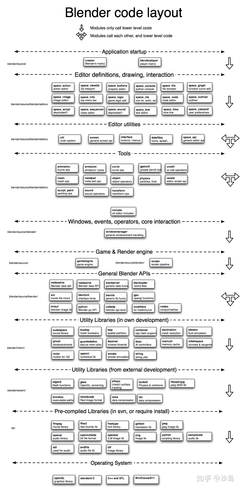

# blender 插件 编写

https://blog.l0v0.com/posts/e362cb4d.html

# blender splash

https://www.yuanmas.com/info/2gOweennab.html

# blender 源码架构

# vulkan 文档

https://www.khronos.org/registry/vulkan/specs/1.1-extensions/html/chap13.html#resources

# RTR4 书单

> 
>
> SIGGRAPH 2013 Course https://blog.selfshadow.com/publications/s2013-shading-course/
>
> 
>
> # 临时
>
> http://www.realtimerendering.com/books.html rtr4 book 
>
> 
>
> https://download.csdn.net/download/tangbongbong/8062435
>
> https://download.csdn.net/download/erosnick/10639057 ame Engine Gems Volume 1 ~ 3合集&代码Part1
>
> 
>
> # Game Physics Engine Development
>
> Game Physics Engine Development
> How to Build a Robust Commercial-Grade Physics Engine for your Game
>
> https://www.amazon.com/Game-Physics-Engine-Development-Commercial-Grade/dp/0123819768
>
> # Foundations *of* Game Engine Development
>
> 游戏引擎的开发基础
>
> 官网： http://foundationsofgameenginedev.com/
>
> 
>
> PDF
>
> 
>
> # GPU Pro
>
> # GPU Gen
>
> 
>
> # GPU Pro 360
>
> 
>
> # Introduction to Computer Graphics and the Vulkan API 
>
> 
>
> # graphicscodex
>
> http://graphicscodex.com/
>
> 
>
> # OpenGLInsights
>
> 
>
> 
>
> 
>
> # Robust and Error-Free Geometric Computing
>
> 
>
> 
>
> https://xeolabs.com/pdfs/OpenGLInsights.pdf
>
> # opengl 4 shading language cookbook
>
> 
>
> 
>
> # metal programming guide
>
> 
>
> 
>
> # Shadow Algorithms Data Miner 
>
> 
>
> 
>
> # Game Engine Architecture
>
> https://www.gameenginebook.com/ 官网
>
> 游戏引擎架构
>
> 第三版
>
> http://dl.booktolearn.com/ebooks2/computer/gamedevelopment/9781138035454_Game_Engine_Architecture_Third_Edition_6dfa.pdf
>
> https://www.latexstudio.net/wp-content/uploads/2014/12/Game_Engine_Architecture-en.pdf
>
> 
>
> http://read.pudn.com/downloads151/ebook/655333/3DGameEngineArchitecture.pdf
>
> 
>
> # Graphics Shaders: Theory and Practice
>
> Graphics Shaders: Theory and Practice, Second Edition
>
> 
>
> # Real-Time Collision Detection
>
> Real-Time Collision Detection (The Morgan Kaufmann Series in Interactive 3-D Technology)
>
> https://www.amazon.com/Real-Time-Collision-Detection-Interactive-Technology/dp/1558607323?tag=realtimerenderin&pldnSite=1
>
> 
>
> 
>
> 
>
> # graphics shaders theory and practice 
>
> 
>
> 
>
> pdf
>
> # Real-Time Shadows
>
> https://www.amazon.com/Real-Time-Shadows-Michael-Wimmer/dp/1568814380?tag=realtimerenderin&pldnSite=1
>
> 
>
> # Game Development Tools 
>
> 未找到
>
> 
>
> # 3D Graphics for Game Programming
>
> by JungHyun Han
>
> https://dw2bukz.cf/read.php?id=3ljRBQAAQBAJ
>
> # Game Physics Pearls
>
> pdf
>
> # Real-Time Cameras
>
> pdf
>
> 
>
> # Real-Time Volume Graphics
>
> pdf
>
> 
>
> # Shadow Algorithms Data Miner
>
> 
>
> PDF
>
> 
>
> # Game Engine Gems 
>
> 官网
>
> http://www.gameenginegems.net/
>
> 
>
> http://www.pbr-book.org/
>
> 
>
> 
>
> # Practical Algorithms for 3D Computer Graphics
>
> 
>
> 
>
> # Physically Based Rendering
>
> Physically Based Rendering, Third Edition: From Theory to Implementation
>
> http://www.pbr-book.org/
>
> 
>
> 为下载pdf 免费阅读
>
> 
>
> # Game Physics Cookbook
>
> 
>
> https://github.com/PacktPublishing/Game-Physics-Cookbook
>
> 
>
> # 光线追踪书籍
>
> http://www.realtimerendering.com/raytracing.html#books
>
> 
>
> 
>
> ## Ray Tracing Gems
>
> 光线追踪
>
> 官网
>
> http://www.realtimerendering.com/raytracinggems/
>
> ## Ray Tracing: The Rest of Your Life
>
> 光线追踪
>
> 博客 https://in1weekend.blogspot.com/2016/03/ray-tracing-rest-of-your-life.html
>
> 
>
> 
>
> 
>
> 
>
> 

# C++ 面试

https://blog.csdn.net/shanghairuoxiao/article/details/72876248

# C++ 面试

> ## C和C++语言基础
>
> 参考书籍：《C++ primer》，《effective C++》，《STL源码解析》，《深度搜索C++对象模型》
>
> - **[extern关键字作用](https://link.zhihu.com/?target=http%3A//www.cnblogs.com/yc_sunniwell/archive/2010/07/14/1777431.html)**
> - **[static关键字作用](https://link.zhihu.com/?target=http%3A//blog.csdn.net/shanghairuoxiao/article/details/72904292)**
> - **volatile是干啥的**
> - **说说const的作用，越多越好**
> - **[new与malloc区别](https://link.zhihu.com/?target=http%3A//blog.csdn.net/shanghairuoxiao/article/details/70337890)**
> - **[C++多态性与虚函数表](https://link.zhihu.com/?target=http%3A//blog.csdn.net/hackbuteer1/article/details/7475622)**
>
> 1. C++多态的实现？
> 2. 虚函数的作用？
> 3. 虚函数用于实现多态，这点大家都能答上来但是虚函数在设计上还具有封装和抽象的作用。比如抽象工厂模式。
> 4. 动态绑定是如何实现的？
> 5. [静态多态和动态多态](https://link.zhihu.com/?target=http%3A//blog.csdn.net/u013630349/article/details/48009815)。静态多态是指通过模板技术或者函数重载技术实现的多态，其在编译器确定行为。动态多态是指通过虚函数技术实现在运行期动态绑定的技术。
> 6. **[虚函数表](https://link.zhihu.com/?target=http%3A//blog.csdn.net/haoel/article/details/1948051/)**
> 7. 虚函数表是针对类的还是针对对象的？同一个类的两个对象的虚函数表是怎么维护的？
> 8. 编译器为每一个类维护一个虚函数表，每个对象的首地址保存着该虚函数表的指针，同一个类的不同对象实际上指向同一张虚函数表。
>
> - **纯虚函数如何定义，为什么对于存在虚函数的类中析构函数要定义成虚函数**
> - **析构函数能抛出异常吗**
> - **构造函数和析构函数中调用虚函数吗？**
> - **指针和引用的区别**
> - **指针与数组千丝万缕的联系**
> - **[智能指针是怎么实现的？什么时候改变引用计数？](https://link.zhihu.com/?target=http%3A//www.cnblogs.com/xiehongfeng100/p/4645555.html)**
>
> 1. 构造函数中计数初始化为1；
> 2. 拷贝构造函数中计数值加1；
> 3. 赋值运算符中，左边的对象引用计数减一，右边的对象引用计数加一；
> 4. 析构函数中引用计数减一；
> 5. 在赋值运算符和析构函数中，如果减一后为0，则调用delete释放对象。
> 6. share_prt与weak_ptr的区别？
>
> - **[C++四种类型转换](https://link.zhihu.com/?target=http%3A//www.jellythink.com/archives/205)**：**static_cast, dynamic_cast, const_cast, reinterpret_cast**
> - **内存对齐的原则**
> - **内联函数有什么优点？内联函数与宏定义的区别？**
> - **C++内存管理**
> - **STL里的内存池实现**
> - **STL里set和map是基于什么实现的。红黑树的特点？**
> - **STL里的其他数据结构和算法实现也要清楚**
>   这个问题，把STL源码剖析好好看看，不仅面试不慌，自己对STL的使用也会上升一个层次。
> - **必须在构造函数初始化式里进行初始化的数据成员有哪些**
> - **[模板特化](https://link.zhihu.com/?target=http%3A//blog.csdn.net/thefutureisour/article/details/7964682/)**
> - **[定位内存泄露](https://link.zhihu.com/?target=http%3A//www.cnblogs.com/skynet/archive/2011/02/20/1959162.html)**
>   (1)在windows平台下通过CRT中的库函数进行检测；
>   (2)在可能泄漏的调用前后生成块的快照，比较前后的状态，定位泄漏的位置
>   (3)Linux下通过工具valgrind检测
> - **手写strcpy，memcpy，strcat，strcmp等函数**

# https://github.com/isocpp/CppCoreGuidelines

# C++ 指南

https://github.com/isocpp/CppCoreGuidelines

# C++ 参考手册

https://www.bookstack.cn/read/cppreference-language/4e6d0572f46ff1bb.md