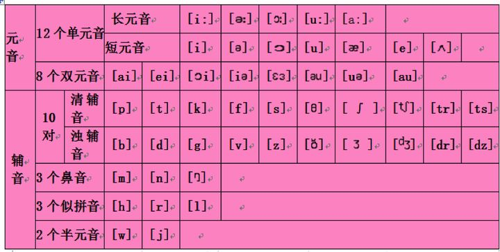
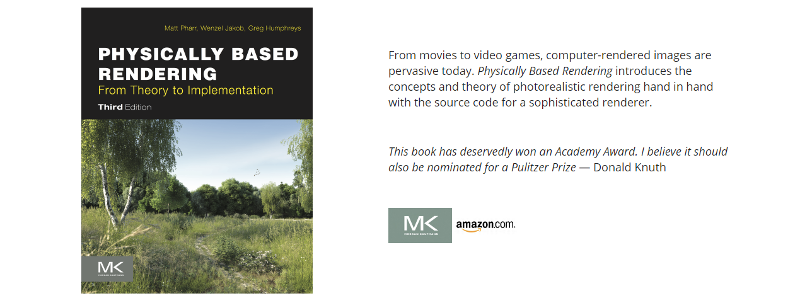
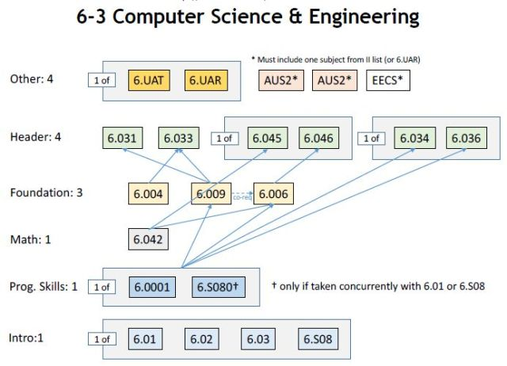
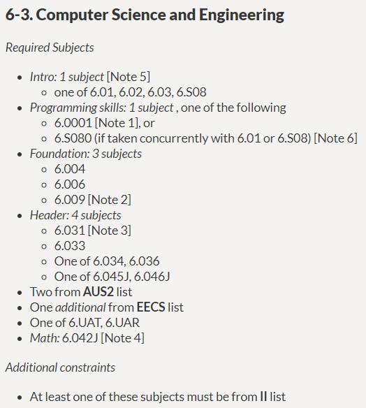

# FreeNOS


# 游戏开发

> # unity 开发
>
> 
>
> ## unity 斜投影
>
> 
>
> 
>
> 
>
> # 开源3d 软件
>
> 
>
> https://github.com/dariomanesku/cmftStudio
>
> 
>
> 参考bgfx 主页目录
>
> 
>
> 
>
> # 次世代3D建模软件
>
> [次世代3D建模软件有哪些？](https://zhuanlan.zhihu.com/p/83684847)
>
> 
>
> 
>
> 科普下建模用到的软件：
>
> 高模：Maya、3Dmax、Zbrush
>
> 中模：Maya、3Dmax
>
> 低模：Maya、3Dmax、Topogun
>
> 展UV：Maya、Zbrush、Unfold3D、Uvlayout
>
> 烘焙：Maya、Zbrush、3Dmax、Xnormal、3DO、GrazyBump
>
> 材质：Photoshop、Substance Painter、3DO
>
> 最终展示：Marmoset Toolbag
>
> # 开源3d建模软件
>
> **openscad**
>
> https://github.com/openscad/openscad
>
> freecad
>
> https://github.com/FreeCAD/FreeCAD
>
> 
>
> 文章
>
> [30款免费3D建模软件，总有一款适合你！](https://zhuanlan.zhihu.com/p/78252847)
>
> [12款开源或免费的3D建模软件](https://blog.csdn.net/hankern/article/details/83960472)
>
> [5款最好用的免费3D建模软件](https://zhuanlan.zhihu.com/p/40869476)
>
> 
>
> Dust3D: 开源3D快速建模软件
>
> http://docs.dust3d.org/en/latest/
>
> 
>
> 
>
> 　**Blender**
>
> 　　Blender是最受欢迎的免费开源[3D模型](https://www.3dzao.cn/)制作软件套装。
> 　　跨平台支持所有的主要操作系统。
> 　　功能非常强大，但是上手比较难；一旦学会了，用起来就会非常方便。
>
>  
>
> 　　**OpenSCAD**
>
> 　　OpenSCAD是一款基于命令行的3D建模软件，可以产生CSG文件，特长是制作实心3D 模型。支持跨平台操作系统， 包括Linux、Mac和Windows。
>
>  
>
> 　　**Art of Illusion**
>
> 　　免费，开源的3D模型和渲染软件。
> 　　亮点包括细分曲面模型工具，骨骼动画和图形语言。尽管缺点也很突出， Art of Illusion是在RepRap开源社区使用最广泛的[3D模型软件](https://www.3dzao.cn/)。
>
>  
>
> 　　**FreeCAD**
>
> 　　FreeCAD是来自法国Matra Datavision公司的一款开源[免费3D CAD软件](https://www.3dzao.cn/)， 基于CAD / CAM / CAE几何模型核心，是一个功能化、参数化的建模工具。FreeCAD的直接用户目标是机械工程、产品设计，当然也适合工程行业内的其他广大用户，比如建筑或者其他特殊工程行业。
>
>  
>
> 　　**Wings3D**
>
> 　　Wings 3D是一个开源免费的3D建模软件，适合创建细分曲面模型。
> 　　容易学习，功能强大。
> 　　Wings 3D的名字来源于它用于存储坐标系和临近数据所使用的翼边数据结构。
> 　　支持多种操作系统，包括Linux、Mac和Windows。
>
>  
>
> 　　**BRL-CAD**
>
> 　　BRL-CAD是一款强大的跨平台开源实体几何(CSG) 构造和实体模型计算机辅助设计(CAD) 系统。
> 　　BBRL-CAD包含有一个交互式的几何编辑器，光学跟踪支持图形着色和几何分析，计算机网络分布式帧缓存支持，图像处理和信号处理工具， 可以进行几何编辑、几何分析，支持分布式网络，可以进行图像处理和信号处理。
>
>
> 其他免费的3D模型设计软件有：
>
>  
>
> 　　**MeshMixer**
>
> 　　MeshMixer是一个3D模型工具，也是Autodesk公司的产品。
> 　　它能够通过混合现有的网格来创建3D模型，支持Windows和Mac OS X系统。
> 　　如果你想制作一些类似“牛头马面”的疯狂混合3D模型，这是个简单直接的办法。
>
>  
>
> 　　**MeshLab**
>
> 　　MeshLab是3D发展和数据处理领域非常著名的软件，一个网格处理系统。它可以帮助用户处理在3D扫描捕捉时产生的典型无特定结构的模型，还为用户提供了一系列工具编辑，清洗，筛选和渲染大型结构的三维三角网格（典型三维扫描网格）， 该系统依靠了网格处理任务GPL的心向量图库。
>
>  
>
> 　　**SketchUp**
>
> 　　SketchUp是谷歌Google的一个免费交互式的3D模型程序，不仅适合高级用户，也适合初学者。
> 　　上手非常容易，但是缺失一些高级功能。
>
>  
>
> 　　**Autodesk 123D**
>
> 　　Autodesk 123D是欧特克公司的产品，是一个免费3D模型软件，目前只支持Windows系统。 用户只需要简单拍摄几张物体照片，它就能自动生成3D模型，并能通过Autodesk将3D模型制作成实物。
>
>  
>
> 　　**Sculptris**
>
> 　　Sculptris是款免付的3D雕刻软件，小巧却强大。
> 　　用户可以像玩橡皮泥一样，拉，捏，推，扭等做一切可以对橡皮泥做的事。
>
>  
>
> 　　**K-3D**
>
> 　　K-3D是一个免费自由开放的三维建模、动画和渲染工具。
> 　　它可以创建和编辑3D几何图形(多个实时OpenGL实体，阴影，纹理映射视图)；无限制的撤销还原与重做；有很高的可扩展性，还能通过第三方的插件增强功能，这让K-3D成为非常全面强大的工具。
>
> # 开源项目GitHub
>
> https://github.com/lettier/3d-game-shaders-for-beginners
>
> 
>
> learnOpengl
>
> 
>
> 
>
> # 一些开源且免费的图形库和游戏引擎
>
> 
>
> **白鹭**
>
> https://github.com/egret-labs/egret3d
>
> https://github.com/egret-labs/egret-docs
>
> 
>
> **CRYENGINE** 
>
> https://github.com/CRYTEK/CRYENGINE
>
> 
>
> bgfx是一个跨平台的图形渲染引擎，号称“Bring Your Own Engine/Framework”
>
> 支持的以下图形Api
>
> - Direct3D 9
> - Direct3D 11
> - Direct3D 12
> - Metal
> - OpenGL 2.1
> - OpenGL 3.1+
> - OpenGL ES 2
> - OpenGL ES 3.1
> - WebGL 1.0
> - WebGL 2.0
>
> 
>
> Urho3D
>
> Urho3D是一个轻量级、跨平台的2D和3D渲染的c++实现开源游戏引擎,在MIT许可协议下发布。利用OpenGL渲染或是DX，是受到OGRE 和horde3d极大的鼓舞而延生。
>
> 
>
> Godot是一个横跨各种平台的游戏引擎，提供了大量常用工具，因此您可以专注于制作游戏而无需重新发明轮子。中文文档非常完善
>
> https://godotengine.org/
>
> https://github.com/godotengine/godot
>
> 
>
> https://github.com/bkaradzic/bgfx
>
> # 知乎专栏
>
> [图形编程技术学习](https://zhuanlan.zhihu.com/c_1142760701012692992)
>
> 
>
> # ogre 
>
> 源码历史版本
>
> https://sourceforge.net/projects/ogre/files/ogre/
>
> 
>
> 
>
> ogre源码分析文章
>
> 
>
> 
>
> https://www.cnblogs.com/skyofbitbit/p/4089002.html
>
> [OGRE源码分析：场景树模块](https://blog.csdn.net/qq_43069546/article/details/88557143)
>
> [Ogre的一帧之OctreeSceneManager](https://zhuanlan.zhihu.com/p/25540600)
>
> [Ogre引擎源码——资源之Material](https://www.xuebuyuan.com/1131413.html)
>
> [转:Ogre源码剖析1](https://www.cnblogs.com/skyofbitbit/p/4089002.html)
>
> # 开源游戏引擎
>
> **GitHub**
>
> https://github.com/Microsoft/DirectX-Graphics-Samples
>
> 
>
> **Doom 3** 
>
> https://github.com/id-Software/DOOM-3
>
> **SVEngine**
>
> https://github.com/SVEChina/SVEngine/tree/develop
>
> 
>
> **WildMagic**
>
> https://www.geometrictools.com/   https://github.com/bazhenovc/WildMagic
>
> 
>
> **OpenSceneGraph** 
>
> https://github.com/openscenegraph/OpenSceneGraph
>
> 
>
> **SFML**
>
> Simple and Fast Multimedia Library
>
> https://github.com/SFML/SFML
>
> 
>
> **Horde3D** 
>
> https://github.com/horde3d/Horde3D
>
> 
>
> **SkyGameEngine2d**
>
> [SkyGameEngine2d](https://gitee.com/xfcode/SkyGameEngine2d)
>
> 
>
> **OGRE**
>
> 
>
> **Irrlicht**
>
> https://github.com/zaki/irrlicht
>
> **Panda3D**
>
> https://www.panda3d.org/
>
> https://github.com/panda3d/panda3d
>
> 
>
> **klayge**
>
> https://github.com/gongminmin/KlayGE
>
> cocos2d
>
> https://github.com/cocos2d/cocos2d-x
>
> quick-cocos2d-x 
>
> https://github.com/chukong/quick-cocos2d-x
>
> **Crystal** **Space**
>
> 
>
> **JME**
>
> 
>
> **Blender**
>
> 
>
> **Reality Factory**
>
> 
>
> **The Nebula Device 2**
>
> 
>
> **RealmForge**
>
> 
>
> **OpenSceneGraph**
>
> 
>
> **LibGDX** 
>
> https://github.com/libgdx/libgdx   JAVA 开发
>
> ## 参考
>
> 在国内外，业界盛传有十大开源游戏引擎，分别是OGRE、Irrlicht、Panda3D、Crystal Space、jME、Blender Game Engine、Reality Factory、The Nebula Device 2、RealmForge、OpenScene- Graph。我们对这十款开源游戏引擎深入进行分析。
>
> ***\*(1) OGRE\****是面向对象图形渲染引擎(Object-Oriented Graphics Rendering Engine)的缩写，采用C++开发，以MIT许可证发布，可以在Windows、Linux、Mac上运行。OGRE自己也说明本身不是游戏引擎。
>
> 其主要特征如下：
>
> 面向对象，插件扩展架构，具有文档支持。
>
> 支持脚本。可以通过脚本管理材质资产并进行多路渲染。
>
> 支持物理碰撞检测。
>
> 支持顶点灯光、像素灯光、灯光映射。
>
> 支持阴影映射、三维阴影。
>
> 支持多纹理、凹凸贴图、多重材质贴图、立体投影。
>
> 支持顶点、像素、高级着色。
>
> 支持场景管理，具有多种数据结构。
>
> 支持逆向运动动画、骨架动画、变形动画、混合动画及姿态动画。
>
> 支持网格加载、皮肤、渐进网格。
>
> 支持环境映射、镜头眩光、公告牌、粒子、运动模糊、天空、水、雾、丝带轨迹、透明对象。
>
> 支持XML文件转换。
>
> 引擎特性全面( )，稳定性好( )，支持全面( )，不容易上手和使用( )。
>
> ***\*(2) Irrlicht\****采用C++开发，以zlib/libpng许可证发布，可以在Windows、Linux、Mac、Solaris、FreeBSD、Xbox上运行。Irrlicht自己也说明本身不是游戏引擎。
>
> 其主要特征如下：
>
> 面向对象，插件扩展架构，具有文档支持。
>
> 支持内建场景、灯光、GUI编辑器。
>
> 支持物理碰撞检测。
>
> 支持顶点灯光、像素灯光、灯光映射。
>
> 支持阴影映射、三维阴影、模板缓冲区阴影。
>
> 支持多纹理、凹凸贴图、多重材质贴图、立体投影。
>
> 支持顶点、像素、高级着色。
>
> 支持场景管理，具有多种数据结构，允许无缝集成室内及室外场景。
>
> 支持骨架动画、变形动画及混合动画。
>
> 支持网格加载。
>
> 支持环境映射、公告牌、粒子、天空、水、雾。
>
> 支持地形渲染。
>
> 引擎特性全面( )，稳定性好( )，支持全面( )，容易上手和使用( )。
>
> ***\*(3) Panda3D\****采用C++和Python开发，以BSD许可证发布，可以在Windows、Linux、Mac、SunOS上使用。Panda3D是一个完整的游戏引擎。
>
> 其主要特征如下：
>
> 面向对象，脚本扩展架构，具有文档支持。
>
> 支持内建场景、粒子、关卡编辑器。
>
> 支持物理碰撞检测，可以用于运动物体。
>
> 支持顶点灯光、像素灯光、灯光映射。
>
> 支持阴影映射、三维阴影、模板缓冲区阴影。
>
> 支持多纹理、凹凸贴图、多重材质贴图、立体投影。
>
> 支持顶点、像素、高级着色。
>
> 支持场景管理，具有多种数据结构。
>
> 支持骨架动画。
>
> 支持网格加载及皮肤。
>
> 支持环境映射、公告牌、粒子、雾、火。
>
> 支持地形渲染。
>
> 支持“客户端/服务器”网络模式。
>
> 支持2D、3D和流音效。
>
> 支持有限状态机、人工智能。
>
> 引擎特性全面( )，稳定性很好( )，支持很全面( )，很容易上手和使用( )。
>
> ***\*(4) Crystal Space\****采用C++开发，以LGPL许可证发布，可以在Windows、Linux、Mac上使用。Crystal Space是一个完整的游戏引擎。
>
> 其主要特征如下：
>
> 面向对象，组件扩展架构，具有文档支持。
>
> 支持内建场景、灯光、GUI编辑器。
>
> 支持物理碰撞检测，可以用于运动物体。
>
> 支持顶点灯光、灯光映射。
>
> 支持阴影映射、三维阴影。
>
> 支持多纹理、多重材质贴图。
>
> 支持顶点、像素着色。
>
> 支持场景管理，具有多种数据结构。
>
> 支持骨架动画、帧动画、变形动画。
>
> 支持网格加载、渐进网格。
>
> 支持环境映射、镜头眩光、公告牌、粒子、天空、镜像。
>
> 支持地形渲染。
>
> 支持2D、3D音效。
>
> 支持游戏世界管理。
>
> 通过有限状态机、行为树、神经网络、遗传算法支持人工智能。
>
> 引擎特性很全面( )，稳定性好( )，支持很全面( )，不容易上手和使用( )。
>
> ***\*(5) jME\****是jMonkey Engine的缩写，采用Java开发，以BSD许可证发布，可以在Windows、Linux、Mac上使用。JME的目标是提供一个Java语言3D游戏引擎，但业界目前也有人认为jME还不是一个游戏引擎。
>
> 其主要特征如下：
>
> 面向对象，插件扩展架构，具有文档支持。
>
> 支持内建游戏世界编辑器。
>
> 支持物理碰撞检测。
>
> 支持顶点灯光、灯光映射。
>
> 支持三维阴影。
>
> 支持多纹理、多重材质贴图。
>
> 支持顶点、像素、高级着色。
>
> 支持场景管理，具有多种数据结构。
>
> 支持骨架动画、帧动画。
>
> 支持网格加载及皮肤。
>
> 支持环境映射、镜头眩光、公告牌、粒子、天空、水、火、爆炸、雾。
>
> 支持地形渲染。
>
> 支持3D音效。
>
> 引擎特性全面( )，稳定性好( )，支持很全面( )，容易上手和使用( )。
>
> ***\*(6) Blender\****游戏引擎是采用C++和Python开发，以GPL许可证发布，可以在Windows、Linux、Mac、Solaris、FreeBSD、Irix上使用。Blender是一个完整的游戏引擎。
>
> 其主要特征如下：
>
> 面向对象，插件及脚本扩展架构，具有文档支持。
>
> 支持内建工作流、GUI、数据库、角色等编辑器。
>
> 支持物理碰撞检测，可以用于运动物体。
>
> 支持顶点灯光、像素灯光。
>
> 支持阴影映射。
>
> 支持多纹理、凹凸贴图。
>
> 支持顶点、像素着色。
>
> 支持场景管理，具有多种数据结构。
>
> 支持逆向运动动画、帧动画。
>
> 支持网格加载及皮肤。
>
> 支持环境映射、粒子、天空、水、雾。
>
> 支持地形渲染。
>
> 支持“客户端/服务器”网络模式。
>
> 支持2D及3D音效。
>
> 通过脚本方式支持人工智能。
>
> 引擎特性基本全面( )，稳定性基本不错( )，支持全面( )，不容易上手和使用( )。
>
> ***\*(7) Reality Factory\****是采用C++开发，以MIT许可证发布，可以在Windows上使用。Reality Factory自称游戏无需编程。
>
> 其主要特征如下：
>
> 面向对象，脚本扩展架构，具有文档支持。
>
> 支持内建几何形体编辑器。
>
> 支持物理碰撞检测。
>
> 支持顶点灯光、像素灯光、辐射灯光、三维灯光。
>
> 支持阴影映射。
>
> 支持多纹理、凹凸贴图、多重材质贴图、投影。
>
> 支持顶点、像素着色。
>
> 支持场景管理，具有多种数据结构。
>
> 支持骨架动画、帧动画及混合动画。
>
> 支持网格加载及皮肤。
>
> 支持环境映射、公告牌、粒子、天空、水、火、爆炸、雾、贴花、天气、镜像。
>
> 支持地形渲染。
>
> 支持“客户端/服务器”网络模式。
>
> 支持3D及流音效。
>
> 通过路径查找、决策及脚本方式支持人工智能。
>
> 引擎特性基本全面( )，稳定性基本不错( )，支持基本全面( )，容易上手和使用( )。
>
> ***\*(8) The Nebula Device 2\****是采用C++开发，以MIT许可证发布，可以在Windows、Linux上使用。Nebula Device是一个完整的游戏引擎。
>
> 其主要特征如下：
>
> 面向对象，插件及脚本扩展架构，具有文档支持。
>
> 支持内建几何形体编辑器。
>
> 支持物理碰撞检测。
>
> 支持顶点灯光、像素灯光、灯光映射、光泽映射。
>
> 支持阴影映射。
>
> 支持多纹理、凹凸贴图、多重材质贴图、投影。
>
> 支持顶点、像素、高级着色。
>
> 支持场景管理，具有多种数据结构。
>
> 支持骨架动画、帧动画、变形动画及混合动画。
>
> 支持网格加载及皮肤。
>
> 支持环境映射、镜头眩光、公告牌、粒子、天空。
>
> 支持地形渲染。
>
> 支持“客户端/服务器”、P2P网络模式。
>
> 支持2D、3D及流音效。
>
> 通过脚本方式支持人工智能。
>
> 引擎特性全面( )，稳定性好( )，支持基本全面( )，不容易上手和使用( )。
>
> ***\*(9) RealmForge\****是采用C#在OGRE上开发，以LGPL许可证发布，可以在Windows、Linux、Mac、Solaris、HP/UX、FreeBSD上使用。RealmForge是一个完整的游戏引擎，现在已经转入商业化运作。
>
> 其主要特征如下：
>
> 面向对象，插件及脚本扩展架构，具有文档支持。
>
> 支持内建游戏编辑器。
>
> 支持物理碰撞检测，可以用于运动物体。
>
> 支持顶点灯光、像素灯光、灯光映射。
>
> 支持阴影映射、投影面、立体投影。
>
> 支持多纹理、凹凸贴图、多重材质贴图、投影。
>
> 支持顶点、像素、高级着色。
>
> 支持场景管理，具有多种数据结构。
>
> 支持骨架动画、帧动画、面部动画及混合动画。
>
> 支持网格加载、皮肤及渐进网格。
>
> 支持环境映射、镜头眩光、公告牌、粒子、天空、水、火、爆炸、贴花、雾、天气、镜像。
>
> 支持地形渲染。
>
> 支持“客户端/服务器”、P2P网络、主控服务器模式。
>
> 支持3D及流音效。
>
> 通过路径查找、决策、优先状态机、脚本、神经网络等方式支持人工智能。
>
> 引擎特性全面( )，稳定性基本不错( )，支持基本全面( )，不容易上手和使用( )。
>
> ***\*(10) OpenSceneGraph\****是采用C++开发，以LGPL许可证发布，可以在Windows、Linux、Mac、Solaris、SunOS、FreeBSD、Irix、Playstation上使用。OpenSceneGraph是一个完整的游戏引擎。
>
> 其主要特征如下：
>
> 面向对象，插件及脚本扩展架构，具有文档支持。
>
> 支持内建场景编辑器。
>
> 支持物理碰撞检测。
>
> 支持顶点灯光、各向异性灯光。
>
> 支持投影面、立体投影。
>
> 支持多纹理、多重材质贴图、投影。
>
> 支持顶点、像素、高级着色。
>
> 支持场景管理，具有多种数据结构。
>
> 支持骨架动画、帧动画及混合动画。
>
> 支持网格加载及皮肤。
>
> 支持环境映射、公告牌、粒子、镜像。
>
> 支持地形渲染。
>
> 支持“客户端/服务器”、P2P网络、主控服务器模式。
>
> 支持2D、3D及流音效。
>
> 引擎特性全面( )，稳定性好( )，支持还可以( )，上手和使用比较难( )。
>
> 一般说来，选择开源游戏引擎一定需要获取[源码](http://www.2cto.com/ym)、好的文档及开放式支持。稳定性对于商业化运作是一个双刃剑，利于产品的开发运营，但需要有效引入新的游戏技术革新。引擎涵盖特性是一个积累过程，可以不断添加和改进。上手和使用性也反映了设计开发游戏引擎的团队的内在价值取向——以技术为主，还是以应用为主。
>
> 游戏开发商都希望研制、运营一个万众瞩目的游戏产品，但是，使用按照不同许可证发布的游戏引擎开发的游戏产品需要遵循相应的知识产权法规。因此，游戏引擎的软件许可证成为选择时的一个极其重要的考虑因素。


# 英语学习

> # 英语语法
>
> [学了六七年都学不明白的英语，一个小时弄得明明白白](https://zhuanlan.zhihu.com/p/98389104)
>
> [英语常用的62个万能句型](https://zhuanlan.zhihu.com/p/97688915)
>
> 
>
> 专栏
>
> [苹果叔叔职业英语教学，WE：pingguoshushuvip](https://www.zhihu.com/people/ping-guo-shu-shu-27/posts)
>
> 
>
> # 工具推荐
>
> [强烈推荐几个英语学习利器，单词，听力，口语，阅读，找外教APP，用过最好的英语类APP](https://zhuanlan.zhihu.com/p/33760671)
>
> 
>
> # 英语单词
>
> [人民日报整理：200个英语常用固定搭配+9大类实用词汇](https://zhuanlan.zhihu.com/p/102439178)
>
> 
>
> # 英语思维
>
> [英语思维是每个英语学习者必须扛过的一关](https://zhuanlan.zhihu.com/p/92631550)
>
> 
>
> 
>
> 软件
>
> 英语数字训练
>
> # 音标 发音 拼读规则
>
> [音标都不会怎么学习英语？](https://www.zhihu.com/question/321022816) 有很基础的小学课文
>
> 
>
> [学习音标B站上有什么推荐吗？](https://www.zhihu.com/question/355258443)
>
> [看着英语不知如何发音怎么办？英语拼读规则在这里](https://zhuanlan.zhihu.com/p/97376100)
>
> [非常全的英语音标发音、拼读规则，值得一练！](https://zhuanlan.zhihu.com/p/38602258)
>
> [科普丨你真的了解英语音标吗？](https://zhuanlan.zhihu.com/p/31484071)
>
> [字母及字母组合的发音规律](https://zhuanlan.zhihu.com/p/32910564)
>
> 
>
> ## b站英语音标推荐
>
> [小破站最好的版本！BBC经典发音教程！英语国际音标，英式发音课程！_哔哩哔哩 (゜-゜)つロ 干杯~-bilibilib23.tv](https://b23.tv/av54685652/p1)
> [当年，我就是跟这个大爷学会的 L 的发音！Paul大爷的美语发音教程！英语口语，美式发音视频课程！包含音标，单词和语音语调的学习！_哔哩哔哩 (゜-゜)つロ 干杯~-bilibilib23.tv](https://b23.tv/av55294521/p1)
> [小破站最好的版本！Lisa美语发音课程！50个你需要知道的美音发音规则！英语口语，音标，语音语调，综合英语发音教程！_哔哩哔哩 (゜-゜)つロ 干杯~-bilibilib23.tv](https://b23.tv/av55600045/p1)
> [【英语发音】如何自学音标发音（公众号：Jason杰森锅）_哔哩哔哩 (゜-゜)つロ 干杯~-bilibilib23.tv](https://b23.tv/av71069676)
>
> # 英语学习临时笔记
>
> 
>
> # Daily Easy English Expression 完整学习版
>
> 
>
> # Daily English Dictation 291-300 笔记
>
> 
>
> ## 方法
>
> ### 逆向学习法
>
> 
>
> ### 可理解性输入
>
> 
>
> 
>
> 
>
> 
>
> ## 网站
>
> 作为雅思考试的三大主办方之一，British Council 在全球100多个国家开展英语教育领域的工作，组织各类英语语言及职业资格考试。
>
> British Council 旗下有一个宝藏英语学习网站：
>
> http://learnenglish.britishcouncil.org/
>
> LearnEnglish 旨在为各个水平的英语学习者提供全方位的多媒体视听学习资源及教学训练，听力、阅读、写作、语法、词汇一站搞定。出品够官方，内容够丰富，来源够权威！
>
> 
>
> 
>
> ## 记录未整理
>
> 
>
> 单词分类
>
> //知乎 相关资料
>
> 
>
> 词根词缀
>
> 
>
> 
>
> 短语
>
> 
>
> ## 软件
>
> [知乎上热捧的几款学英语的APP](https://www.jianshu.com/p/2331365f343d)
>
> [知乎：好用的学习英语的app？](https://www.jianshu.com/p/2331365f343d)
>
> [知乎：好的英语学习网站有哪些推荐？](https://www.jianshu.com/p/2331365f343d)
>
> 
>
> 
>
> ## 优秀文章
>
> [知乎专栏：学英语那点事](https://zhuanlan.zhihu.com/c_170467719)
>
> ​	[推荐一个神仙级免费英语学习网站，自学英语从零基础到精通！](https://zhuanlan.zhihu.com/p/83615401)
>
> ​	[英语音标发音视频教程 | 三分钟教你48个音标的标准美式发音](https://zhuanlan.zhihu.com/p/68602714)
>
> 
>
> 
>
> 
>
> 
>
> 
>
> 
>
> # 英语语法
>
> 
>
> 
>
> 
>
> ## 书籍
>
> **旋元佑英文魔法师三部曲：**
>
> > **文法俱乐部（语法俱乐部）**：就是上文介绍的这一本。它侧重句子层面，讲解了简单句和复杂句的句法语法。在三部曲中属于初级篇。
> >
> > **读写快易通**：侧重段落与文章层面，从文章的组织结构入手，将英文写作与范文分析结合了起来，意在教会学习者分析段落，读懂文章。算是中级篇。且这本书中的语料全部来自时代周刊（旋元佑老师是 TIME 中文解读版总主笔），时政、经济、文化、人物传记等多种文体均有涉及。这种采用鲜活材料进行语言教学的书籍实属难得。适合希望加强英文阅读理解能力、提高写作能力的英语学习者。
> >
> > **修辞高峰会**：英语魔法师系列的高级篇，重新回到句子层面，但关注点不是句子的语法是否正确，而是句子是否写得简洁漂亮。 修辞高峰会重在 **修辞** 二字，这本书以著名的 **The Elements of Style** 一书以及 GMAT 考试中最具挑战的 Sentence Correction 部分为参考，力求帮助学习者写出清楚简洁的句子。读完此书，可以基本了解英文修辞的所有重点了。 
>
> **《经典英语语法》赖世雄**
>
> 
>
> **《朗文英语语法》**
>
> 
>
> **《英语语法新思维》 三部**
>
> 
>
> 
>
> **张道真《英语语法大全》上下册**
>
> 
>
> **章振邦《新版英语语法教程》**
>
> 
>
>  **薄冰《高级英语语法》** 
>
> 
>
>  **张道真《实用英语语法》**
>
> 
>
>  **张满胜《英语语法新思维》** 
>
> 
>
>  **赖世雄《经典英语语法》MP3+PDF版** 
>
> 
>
>  **郭凤高《英语语法实践指南》** 
>
> 
>
>  **谢孟媛《初级文法》《中级文法》全套视频** 
>
> 
>
> 
>
>  **《English grammar in use》** 	
>
> 
>
>  **剑桥出版的《英语在用》系列书籍**  
>
> 
>
>  **L.G.Alexander《朗文英语语法》** 
>
> 
>
>  **A.J.Thomson & A.V.Martinet《牛津适用英语语法》** 
>
> ## 相关
>
> **知乎**
>
> [知乎专栏 陈老师的英语语法驿站](https://zhuanlan.zhihu.com/cjy-grammar)
>
> [为什么有些英语老师说语法几个小时就可以讲明白？](https://zhuanlan.zhihu.com/cjy-grammar)
>
> [英语语法极差（没入门型的），怎样快速学习？](https://www.bilibili.com/video/av19733761?from=search&seid=14535061410718387252)
>
> 
>
> 
>
> 文章
>
> [400个英语语法公式（一）](https://zhuanlan.zhihu.com/p/54596821)
>
> **网站**
>
> 
>
> 
>
> **GitHub**
>
> //网页地址 和GitHub地址 
>
> [旋元佑进阶文法](http://grammar.codeyu.com/#README)
>
> [ 旋元佑进阶文法 ](https://github.com/codeyu/EnglishGrammarBook)
>
> 
>
> 资料获取文章地址
>
> [旋元佑英文魔法师系列资源整理 | 魔法师三部曲](https://book.douban.com/review/9900553/)
>
> 
>
> **百度文库**
>
> [经典英语语法讲解](https://wenku.baidu.com/view/bf1b0862a6c30c2259019e6f.html)
>
> 
>
> 
>
> 
>
> 
>
> 
>
> # 美音学习
>
> 
>
>  **《Pronunciation Pairs》**是由剑桥大学出版社出版的最为经典的英语语音教材之一，其作者 Ann Baker 是著名语音学家，语言教育家。 
>
> 还有软件
>
> 
>
> [《美音完全自学指南》（终极版）](https://zhuanlan.zhihu.com/p/96612341)
>
> 
>
> # 音标
>
> 
>
> 知乎
>
> [英语音标怎么练习？大家学习的经历是怎样的？](https://www.zhihu.com/question/19913374)
>
> [怎么学音标才能学懂？自学，或者是易懂的书啊 app 之类的？](https://www.zhihu.com/question/284586977)
>
> 
>
> 
>
> 
>
> 
>
> # 单词
>
> 
>
> 
>
> ## 书籍
>
> 英语词汇的奥秘
>
> 
>
> 
>
> 知乎
>
> [有什么相见恨晚的背单词方法？](https://www.zhihu.com/question/19913374)
>
> 
>
> 
>
> [ 注入爱的单词教室 ](https://pfplq.duanshu.com/13g064j7d3de8e6285/#/course/025282121b094976a0ca9b2d3662a2bd)
>
> 
>
> 
>
> # 短语
>
> 
>
> 知乎
>
> [有哪些查询英语短语或者俚语的词典？](https://www.zhihu.com/question/44573063)
>
> 
>
> [超重要的英语220个常用固定短语整理汇总！要背下来](https://zhuanlan.zhihu.com/p/65177507)
>
> # 听力
>
> 
>
> 
>
> 知乎
>
> [怎么提高英语听力，达到同声传译水平？](https://www.zhihu.com/question/19913374)
>
> 
>
> # 其他
>
> ## 书籍
>
> **DK图解词典**
>
> **Ultimate Visual Dictionary**
>
> **朗文日常情景单词书** 
>
> **Word by Word Picture Dictionary** 
>
> **汉英双语图解词典** 朗文
>
> **Chinese-English Bilingual Visual Dictionary**
>
> **朗文汉英中华文化图解词典：**
>
> **Longman Chinese-English Visual Dictionary of Chinese Culture**
>
> 
>
>  **Times 2000 Words TO START WITH** 
>
> 
>
>  《朗文幼儿英语图解词典》
>
>  **Longman Young Children's Picture Dictionary** 
>
> 
>
>  **牛津阅读树英文图解词典** 
>
>  **Oxford Reading Tree Dictionary** 
>
> 
>
> 牛津图解词典 OPD Oxford Picture Dictionary 完全版
>
> 
>
> DK - Ultimate Visual Dictionary
>
> 
>
> 4000 Essential English Words
>
> 
>
>  **《10天背完3000英语单词》** 
>
> 
>
> 
>
>  **《MacMillan First Dictionary》（麦克米伦儿童插图字典）** 
>
> 
>
>  **《4000 Essential English Words》（ 1-6册 ）** 
>
> 
>
>  **《洪恩儿童英语图解1000词》** 
>
> 
>
>  《牛津阅读树英文图解词典》 
>
>  《MacMillan First Dictionary》（《麦克米伦儿童插图字典》） 
>
>  《Times 4000 词绘本字典》 
>
> 
>
> 
>
>  DK Merriam-Webster Children's Dictionary，
> Scholastic Children's Dictionary，
> Oxford Children's Dictionary，
> Macmillan Dictionary for Children， 
>
> 
>
> app
>
>  《图解英语单词》 
>
> 
>
> 韦氏图解词典有一个超好用的 ipad app 软件版。
>
> 内含 8000 张高清图像和 25000 个词条，每个单词都标有对应的五种语言---英语、法语、西班牙语、德语、意大利语。且支持在软件内用五种语言进行搜索，其中英语法语还有详细的 definition 单词解释，词条都是可以发音的，除了下载和升级外可以完美地离线使用。
>
> 
>
> 
>
> 
>
> 买书
>
> 孔夫子旧书网
>
> 
>
> 词典其他
>
> [ **【新书速递】CPI:《最新英汉百科图解大词典》** ](https://www.pdawiki.com/forum/forum.php?mod=viewthread&tid=15119&highlight=%CD%BC%BD%E2)
>
> 
>
> 
>
> ## B站视频
>
> [2017四级必过冲刺考点串讲](https://www.bilibili.com/video/av10132041/)
>
> 
>
> [239集TED演讲高清合集 TED英文演讲 英语口语 英语听力好素材 英语学习视频 纯英文字幕](https://www.bilibili.com/video/av47260442/?p=168)
>
> 
>
> **英语听力**
>
> [Daily English Dictation 1-370（Coach Shane）(更新中)](https://www.bilibili.com/video/av24173069)
>
> [英语听力口语情景剧（English Speaking lessons）【纯英字幕】](https://www.bilibili.com/video/av13801166)
>
> [口语听力干货系列210集全 English Top Words](https://www.bilibili.com/video/av75459860/?p=2&t=265)
>
> 
>
> **词汇**
>
> 四级
>
> [四级词汇讲解](https://www.bilibili.com/video/av40025725)
>
> 六级
>
> [大学英语六级词汇讲解](https://www.bilibili.com/video/av14775648?from=search&seid=10932745806463469358)
>
> 
>
> 
>
> **音标**
>
> [bbc 英语 音标](https://www.bilibili.com/video/av3410427)
>
> 
>
> //老大爷
>
> [美式音标教学](https://www.bilibili.com/video/av55294521)
>
> 
>
> **语法**
>
> [ **SciShow语，零基础语法入门** ](https://www.bilibili.com/video/av2639206)
>
> 
>
> 
>
> **口语**
>
> 跟老友记学口语
>
> 
>
> 听力情景剧
>
> 
>
> 
>
> **有趣的英语频道**
>
> 
>
> 
>
> **其他**
>
> [英语单词词根词缀记忆法39集全](https://www.bilibili.com/video/av77872051)
>
> 
>
> ## 知乎
>
> [好的英语学习网站有哪些推荐？](http://www.cgdict.com/)
>
> [有谁知道有哪些比较好用的英语语法学习软件或者网站吗？](https://www.zhihu.com/question/268736576)
>
> 
>
> [如何系统性地学习英语？](https://www.zhihu.com/question/268736576)
>
> 
>
> //这个厉害了,,,
>
> [《美音完全自学指南》（终极版）](https://zhuanlan.zhihu.com/p/96612341)
>
> 
>
> //未查看
>
> [推荐一个神仙级免费英语学习网站，自学英语从零基础到精通！](https://zhuanlan.zhihu.com/p/83615401)
>
> [跟柯林斯学高频英语短语动词| 轻松搞定400个最常用短语](https://zhuanlan.zhihu.com/p/81671762)
>
> [牛津英语核心3000词、5000词+牛津常用英语短语表，英语学习必备资源推荐](https://zhuanlan.zhihu.com/p/79630251)
>
> ## 网站
>
> 
>
> wiki how
>
>  https://www.wikihow.com/Main-Page 
>
> [瑞秋的英语学习官网](https://rachelsenglish.com/)
>
> 
>
> [词根字典](http://www.cgdict.com/)
>
> 
>
> 查词
>
>  https://www.dictionary.com/ 
>
> 
>
> 
>
> //四六级真题
>
> [饼干题库](https://www.bgcet.com/book)
>
> ## 其他的文章
>
> [英语启蒙：英文图解词典权威推荐](https://zhuanlan.zhihu.com/p/30082305)
>
> [ 4000 essential English words 全套 教材PDF+音频+视频 ](http://www.lxwc.com.cn/post-80355-1-1.html)
>
> 
>
>  链接：https://pan.baidu.com/s/1hb440I73TMuMvsdVE8pGsQ 
> 提取码：ewh7 
>
> 
>
> //这个资源nb
>
>  https://pan.baidu.com/s/17PtqcTbhOIWlvEJQpic-yA 
>
> 
>
> //这个网站 有一些英语资源
>
>  http://www.lxwc.com.cn/topic-70-1.html 
>
> 
>
> //学英语那点事 有资源
>
> [图解万物！学英语，试试使用百科全书般的图解词典吧](https://mp.weixin.qq.com/s?__biz=MzU3NTIzOTA5OA==&mid=2247484424&idx=1&sn=af62ab3b8d48b1db9985ecf2936f5542&chksm=fd2762ddca50ebcbb0c845ee15d4f4e9a3c9695144c95c2bc9f3ccd7d7f674e03d2486655363&token=1171088369&lang=zh_CN&scene=21#wechat_redirect)
>
> 
>
> [**牛津图解词典 OPD Oxford Picture Dictionary 完全版** ](http://www.lxwc.com.cn/forum.php?mod=viewthread&tid=48024)
>
> 
>
> 英语音标
>
> [如何从音标开始学习英语？](https://zhuanlan.zhihu.com/p/32385787)
>
> 
>
> [英语连读规则（完整版）+常见的连读短语及句子](https://zhuanlan.zhihu.com/p/32385787)
>
> 
>
> 
>
> 
>
> ### 欧陆词典
>
> [欧路词典的使用方法及扩充词库安装全攻略 | 欧路词典扩充词库资源](https://zhuanlan.zhihu.com/p/36410902)
>
> 
>
> [年度最爱原版英语教材推荐|用这些书解锁你的英语用词技能，正确使用词汇](https://zhuanlan.zhihu.com/p/83988567)
>
> 
>
> 
>
> 
>
> # 笔记
>
> 
>
> 音标
>
> 《赖世雄美语音标》
>
> 《剑桥国际英语语音在用（初级）》
>
> 《英语发音词典》（朗文出版社）
>
> [KK美式英语音标（发音口型教学）](https://www.bilibili.com/video/av19733761?from=search&seid=14535061410718387252)
>
> 
>
>  《大学一年级英语语音练习手册》 
>
> 音标
>
>   
>
>   
>
> 
>
> 
>
> 短语及其种类
>
> 名词短语
>
> 动词短语
>
> 形容词短语
>
> 副词短语
>
> 介词短语
>
> 固定短语
>
> 
>
> 
>
> # 全球顶尖写作教材《Write Source》 
>
> 盘多多
>
> 
>
> 
>
> # 两小无猜网
>
> http://www.lxwc.com.cn/forum.php
>
> 
>
> # B站英语学习视频
>
> ## 单词
>
> 比较基础的英语单词 配图和例句 分类较全适合初级 主要是名词
>
> [油管最最最好用的背单词教程|英语|单词](https://www.bilibili.com/video/av86474697)
>
> 情景记忆 单词分类 配图 无例句
>
> [【油管搬运】202集全ESL英语学习教程 7ESL Learning English全集](https://www.bilibili.com/video/av84039210?p=8)
>
> 
>
> 词根词缀
>
> [有哪些值得推荐的关于英文词根的好书？](https://www.zhihu.com/question/27044578)
>
> 
>
> ### 中文老师讲解
>
> 讲解方法 字母解码 词根词缀
>
> [英语6500词速记 - 白杨6500词全脑速记](https://www.bilibili.com/video/av49709903)
>
> 词根词缀 考试知识
>
> [词根词缀 2017](https://www.bilibili.com/video/av21052075)
>
> 
>
> 看图场景学英语
>
> [英语思维（English Through Pictures) 建立语块与场景练习（看图片学英语）](https://www.bilibili.com/video/av71217373)
>
> pdf[ENGLISH THROUGH PICTURES（PDF）](https://www.bilibili.com/video/av71217373)
>
> 
>
> RAZ-Kids是由美国Learning A-Z公司开发的世界知名在线阅读产品，主打学生自主英语阅读学习。按照难度，Raz-Kids从aa到Z共分为29个层级，每个分级包含几十本书。在美国，Raz-Kids面向的是4-11岁的孩子，跨度从幼儿园到小学五年级。对中国孩子而言，根据自身的英语水平，可以适当延展到中学生。 2. 使用方法：反复跟读，建立绘本和实际场景联系。
>
> [读原版|第11阶J|适合所有人|学完达到英语母语水平，习得英语，形成英语思维](https://www.bilibili.com/video/av82276344)
>
> 
>
> 
>
> [【150集完】这可能是B站最卧槽的英语学习视频！！双语解说 英语口语 外教课 地道](https://www.bilibili.com/video/av71497388?p=5)
>
> 
>
> 单词分类
>
> [你在B站能够看到的最全最多的单词分类视频](https://www.bilibili.com/video/av84158145)
>
> [【YouTube最好的词汇课】英语词汇分类·万词班（高效背单词）](https://www.bilibili.com/video/av80947667/?spm_id_from=333.788.videocard.1)
>
> 
>
> 听力
>
> [【精听挑战】3个月内将听力提升n个level（合集）](https://www.bilibili.com/video/av79633193/?spm_id_from=333.788.videocard.4)
>
> [聼故事學英文287集 Learn English Through Story - English Stories 287 collection](https://www.bilibili.com/video/av84769517)
>
> [熟读88个故事说流利标准英语](https://www.bilibili.com/video/av70729354)
>
> 
>
> 语法
>
> [【英语语法自学】英语语法从入门到高级 要恶补英语语法的快来吧](https://www.bilibili.com/video/av66639463?p=4)
>
> 
>
> 发音
>
> [美式发音连读 · 弱读 · 重音 · 语调（公众号：Jason杰森锅）](https://www.bilibili.com/video/av24717422)
>
> [[全86集][美音音标][吞音][弱读][连读][纠音课程]](https://www.bilibili.com/video/av68534891)
>
> [【美国播音员瑞秋】经典美式·发音教程（35集全）](https://www.bilibili.com/video/av60514154?p=2)
>
> 
>
> [【英语发音】元音篇——纠正你的错误发音！你绝对不能错过的美音发音教程！](https://www.bilibili.com/video/av37564610)
>
> 其他
>
> [【抢救四级】1小时怒刷3000核心词汇！！（中英双语字幕）](https://www.bilibili.com/video/av78653488/)
>
> 词根词缀加一些扩展 比较基础 效果一般 但值得学习
>
> [[公开课] 英语词汇5000立体记忆 （清华和北大学生讲述）一分钟记忆一个词汇](https://www.bilibili.com/video/av63866248)
>
> 

# 人工智能学习

> 
>
> 
>
> 
>
> 机器学习深度学习强化学习 课程列表 GitHub
>
> [ Drench yourself in Deep Learning, Reinforcement Learning, Machine Learning, Computer Vision, and NLP by learning from these exciting lectures!! ](https://github.com/kmario23/deep-learning-drizzle)
>
> 
>
> [机器学习、深度学习、数据分析相关书籍分享](https://zhuanlan.zhihu.com/p/77964006)
>
> 
>
> ## 深度学习
>
> 
>
> 知乎
>
> [深度学习如何入门？](https://www.zhihu.com/question/26006703)
>
> 
>
> 
>
> GitHub
>
> 原书
>
> [Deep Learning](http://www.deeplearningbook.org/)
>
> [Deep Learning 中文翻译](https://github.com/exacity/deeplearningbook-chinese)
>
> [ MIT Deep Learning Book in PDF format (complete and parts) by Ian Goodfellow, Yoshua Bengio and Aaron Courville ](https://github.com/janishar/mit-deep-learning-book-pdf)
>
> 
>
> 
>
> 动手深度学习
>
> [《动手学深度学习》](http://zh.d2l.ai/)
>
> 
>
> [ 《动手学深度学习》：面向中文读者、能运行、可讨论。英文版即伯克利“深度学习导论”教材。 ](https://github.com/d2l-ai/d2l-zh)
>
> [ 本项目将《动手学深度学习》(Dive into Deep Learning)原书中的MXNet实现改为PyTorch实现。 ](https://github.com/ShusenTang/Dive-into-DL-PyTorch)
>
> 
>
> pytorch官网教程
>
> [Deep Learning with PyTorch](https://github.com/deep-learning-with-pytorch/dlwpt-code)
>
>  https://www.manning.com/books/deep-learning-with-pytorch#toc 
>
>  https://pytorch.org/deep-learning-with-pytorch-thank-you 
>
> 
>
> ### 知乎
>
> [深度学习如何入门？](https://zhuanlan.zhihu.com/p/77964006)
>
> 
>
> [学好深度学习，Python 得达到什么程度？](https://zhuanlan.zhihu.com/p/77964006)
>
> 
>
> [深度学习需要多强的数学基础？](https://zhuanlan.zhihu.com/p/51331280)
>
> [练手|常见26种深度学习模型的实现](https://zhuanlan.zhihu.com/p/51331280)
>
> 
>
> 
>
> [深度学习（机器学习）的下一步如何发展？](https://zhuanlan.zhihu.com/p/34972426)
>
> 资料
>
> [GitHub：深度学习最全资料集锦](https://zhuanlan.zhihu.com/p/64361703)
>
> [【286页干货】一天搞懂深度学习](https://zhuanlan.zhihu.com/p/34313995)
>
> [人人都可以做深度学习应用：入门篇](https://zhuanlan.zhihu.com/p/25482889)
>
> [2019 年 12 个深度学习最佳书籍清单！值得收藏](https://zhuanlan.zhihu.com/p/60574682)
>
> [深度学习入门推荐](https://zhuanlan.zhihu.com/p/34972426)
>
> [l深度学习入门书单](https://zhuanlan.zhihu.com/p/43537549)
>
> [2019 年 12 个深度学习最佳书籍清单！值得收藏](https://zhuanlan.zhihu.com/p/71977037)
>
> [Python深度学习完全路线指南](https://zhuanlan.zhihu.com/p/29309218)
>
> [机器学习/深度学习入门资料汇总](https://zhuanlan.zhihu.com/p/30980999)
>
> 别人的分享
>
> [深度学习的学习历程](https://zhuanlan.zhihu.com/p/34524772)
>
> 
>
> [深度学习资源汇总](https://zhuanlan.zhihu.com/p/27180274)
>
> [深度学习+数学+直觉（项目分布）](https://zhuanlan.zhihu.com/p/34978776)
>
> 
>
> ## 机器学习
>
> 
>
> 
>
> ### GitHub
>
> 
>
> 
>
> //比较全面的资源
>
> [ 从入门到进阶，所用到机器学习资料，包括书、视频、源码。 ](https://github.com/linxid/Machine_Learning_Study_Path)
>
> 
>
> [ 周志华《机器学习》手推笔记 ](https://github.com/Sophia-11/Machine-Learning-Notes)
>
> 
>
> 
>
> ### 知乎
>
> [机器学习该怎么入门？](https://www.zhihu.com/question/20691338)
>
> 
>
> [如何用3个月零基础入门「机器学习」？](https://zhuanlan.zhihu.com/p/29704017)
>
> [我的机器学习入门学习清单及路线](https://zhuanlan.zhihu.com/p/27018536)
>
> 
>
> [火爆 GitHub 的《机器学习 100 天》，有人把它翻译成了中文版！](https://zhuanlan.zhihu.com/p/54229077)
>
> 
>
> //回答里面有一些学习课程及资料
>
> [为何中国人迷恋吴恩达的机器学习课？](https://zhuanlan.zhihu.com/p/54229077)
>
> 
>
> 
>
> [YouTube上最受欢迎的十大机器学习视频（2017）](https://zhuanlan.zhihu.com/p/26712555)
>
> 
>
> //资料 学习 路径说的比较全面
>
> [本科生如何自学机器学习？](https://zhuanlan.zhihu.com/p/26712555)
>
> 
>
> 学习
>
> [Machine Learning: 十大机器学习算法](https://zhuanlan.zhihu.com/p/33794257)
>
> 
>
> [github标星11600+：最全的吴恩达机器学习课程资源（完整笔记、视频、python作业）](https://zhuanlan.zhihu.com/p/84214338)
>
> 
>
> 
>
> [如何从零到一地开始机器学习？](https://zhuanlan.zhihu.com/p/35794756)
>
> ## opencv
>
> 
>
> 
>
> GitHub
>
> //opencv 开源教程
>
> [ Mastering OpenCV 4, Third Edition, published by Packt publishing ](https://github.com/PacktPublishing/Mastering-OpenCV-4-Third-Edition)
>
> 
>
> ## tensorflow
>
> 
>
> 
>
> [TensorFlow 2.0深度学习中文书来啦(附下载链接)！](https://zhuanlan.zhihu.com/p/90852393)
>
> 
>
> 
>
> 
>
> ### GitHub
>
> [ 深度学习入门开源书，基于TensorFlow 2.0案例实战。Open source Deep Learning book, based on TensorFlow 2.0 framework. ](https://github.com/dragen1860/Deep-Learning-with-TensorFlow-book)
>
> > 配套资源
> >
> > 提交错误或者修改等反馈意见，请在 Github Issues 页面提交：
> >
> > https://github.com/dragen1860/Deep-Learning-with-TensorFlow-book/issues
> >
> > 本书主页，以及源代码，电子书下载， 正式版也会在此同步更新：
> >
> > https://github.com/dragen1860/Deep-Learning-with-TensorFlow-book
> >
> > TensorFlow 2.0 实战案例：
> >
> > https://github.com/dragen1860/TensorFlow-2.x-Tutorials
>
> 
>
> 
>
> ### 交互式线性代数
>
> 网址 :  http://textbooks.math.gatech.edu/ila/index.html 
>
>  GitHub地址:  https://github.com/QBobWatson/gt-linalg 
>
> 
>
> 统计学方法
>
> 
>
> [李航《统计学习方法》第 2 版发布完整课件！清华教授出品！附完整下载](https://redstonewill.com/2737/)
>
> 
>
> 
>
> 
>
> ## yolo 
>
> 
>
> 
>
> 
>
> [YOLOv3 的 TensorFlow 实现，GitHub 完整源码解析](https://redstonewill.com/1954/)
>
> 
>
> 
>
> ## 相关
>
> ### 网站
>
> 机械之心
>
>  https://www.jiqizhixin.com/ 
>
> 
>
> 
>
> ### 知乎专题
>
> [ 人工智能 ](https://www.zhihu.com/topic/19551275/top-answers)
>
> [深度学习（Deep Learning）
>
>
>  ](https://zhuanlan.zhihu.com/p/77964006)
>
> ### 一些博主
>
> 
>
> 中国
>
> 
>
> //有一些学习笔记和学习资源 资源比较多
>
> [红色石头](https://redstonewill.com/)
>
> [红色石头 知乎](https://github.com/kmario23/deep-learning-drizzle)
>
> //来自红色石头 
>
> [吴恩达《Machine Learning》Jupyter Notebook 版笔记发布！](https://redstonewill.com/2804/)
>
> [撒花！《交互式线性代数》完整版正式发布！支持在线全交互式体验（含源码，离线也能看）](https://redstonewill.com/2801/)
>
> [最新《精通 OpenCV 4》第三版开源！附电子版 pdf 和随书代码](https://redstonewill.com/2745/)
>
> [重磅 | 深度学习“四大名著”发布！爱可可推荐！](https://redstonewill.com/1834/)
>
> 
>
> ***
>
> 
>
> ### 微信公众号 
>
> AI有道
>
> 机器之心
>
> 
>
> //有一些深度学习的笔记
>
> [  这里是写博客的地方 —— Halfrost-Field 冰霜之地  ](https://github.com/halfrost/Halfrost-Field)
>
> 
>
> ### csdn 学习指南
>
> 
>
> [机器学习怎么入门——自学篇](https://blog.csdn.net/lsc989818/article/details/78817348)
>
> 
>
> # GitHub
>
> 
>
> 


# 论文相关

学术搜索

 https://scholar.chongbuluo.com/ 


[用它读文献，不出一年，科研水平一定大大提高！](https://zhuanlan.zhihu.com/p/75935521)


 https://sci-hub.org.cn/ 

文献管理


[写论文、搞科研、读大学必备的28款软件。](https://zhuanlan.zhihu.com/p/60951245)


论文网站

[论文文献搜索整理的技巧](https://zhuanlan.zhihu.com/p/24383676)


[有什么好的论文搜索引擎？](https://www.zhihu.com/question/20909115)


# 收集

> 
>
> 
>
> 
>
> 
>
> ## github资源
>
> ### 图形学
>
> [ 电子书 -《Real-Time Rendering 3rd》提炼总结 ](https://github.com/QianMo/Real-Time-Rendering-3rd-CN-Summary-Ebook)
>
> 
>
> 
>
> ### 学习笔记
>
> [ 学习C & C++ & python&汇编语言 数据结构 算法 操作系统 单片机 linux 面试 ](https://github.com/Ewenwan/ShiYanLou)
>
> 
>
> 
>
> 
>
>  https://github.com/qyuhen/book 
>
> 
>
> 
>
> ### 书籍
>
> [编程书籍的整理和收集](https://github.com/KeKe-Li/book)
>
> [ 免费的计算机编程类中文书籍 ](https://github.com/justjavac/free-programming-books-zh_CN)
>
> [ W3School 教程整理 ](https://github.com/it-ebooks/w3school)
>
> [ Awesome Books ](https://github.com/learn-anything/books)
>
> [ A collection of inspiring lists, manuals, cheatsheets, blogs, hacks, one-liners, cli/web tools and more. ](https://github.com/trimstray/the-book-of-secret-knowledge)
>
> [ books pdf ](https://github.com/huyubing/books-pdf)
>
> [ 技术书籍 ](https://github.com/double-qiu/books)
>
> 
>
> [ 无它术，唯勤读书而多为之，自工 ](https://github.com/Urinx/Books)
>
> [ 我读过的书。嘿嘿，分享给你。 ](https://github.com/qqqil/books)
>
> [ 技术资料分享 ](https://github.com/Thinkgamer/books)
>
> [ 常用书籍 ](https://github.com/mymmsc/books)
>
> [个人认为对技术提升很不错的书](https://github.com/songhuiqing/book)
>
> 
>
> [ 国内外互联网技术大牛们都写了哪些书籍：计算机基础、网络、前端、后端、数据库、架构、大数据、深度学习 ](https://github.com/doocs/technical-books)
>
> [ 开发者推荐阅读的书籍 ](https://github.com/guanpengchn/awesome-books)
>
> [book list ](https://github.com/concerttttt/books)
>
> [ Computer Science Books 计算机技术类书籍 PDF  ](https://github.com/huihut/CS-Books)
>
> 
>
> 
>
> [ book ](https://github.com/Jing--Li/book)
>
> [ Source code for 100+ books, kept here for quick reference ](https://github.com/burakbayramli/books/releases)
>
> [ 【编程随想】收藏的电子书清单（多个学科，含下载链接） ](https://github.com/programthink/books#102_)
>
> [经典编程书籍大全](https://github.com/jobbole/awesome-programming-books)
>
> [一些常见的书籍pdf或者视频 ](https://github.com/zxysilent/books)
>
> 
>
> [ 经典技术书籍 PDF 文件 ](https://github.com/phodal/github)
>
> [ 互联网上的免费书籍 ](https://github.com/ruanyf/free-books)
>
> [ GitHub 漫游指南- ](https://github.com/phodal/github)
>
> [ IT技术书籍文字版mobi epub格式 ](https://github.com/harvies/books)
>
> 
>
> [Premium eBook free for Geeks](https://github.com/pandey623/technology_books)
>
> 
>
> 
>
> ### 其他
>
> [ 【编程随想】收藏的开源项目清单 ](https://github.com/programthink/opensource)
>
> [Python 开源库及示例代码](https://github.com/programthink/opensource/blob/master/libs/python.wiki)
>
> [C/C++ 开源库及示例代码](https://github.com/programthink/opensource/blob/master/libs/cpp.wiki)

# 双系统安装

> # 安装
>
> 
>
> ## 制作系统盘
>
>  UltraISO软件 
>
>  Ultraiso, 也可以用Rufus 
>
> 
>
> 
>
> ## 分区
>
> 
>
> 
>
> 系统的操作
>
> 
>
> 关闭快速启动
>
> 
>
> 关闭bios安装
>
>  1.设置bios 关闭secure boot (fast boot 实际上不需要关，对双系统没有影响) 
>
> 
>
> 安装开始
>
> 
>
> 显卡问题
>
> 网络问题
>
> 
>
> 
>
> 
>
> 
>
> # 卸载
>
> 
>
> 
>
> 
>
> 
>
> 
>
> 
>
> # 安装步骤(参考)
>
> 
>
>  **UltraISO制作U盘安装** 
>
> 
>
>  **硬盘分区** 
>
> 
>
>  **secure boot设置** 
>
> 
>
> ***
>
> **1、下载Ubuntu16.04**
> 首先去Ubuntu的官网下载一个Ubuntu16.04的iso镜像文件。我下载的文件名：ubuntu-16.04.6-desktop-amd64.iso
>
> **2、UltraISO制作U盘安装**
> 写入方式：USB-HDD+ 其它默认
>
> **3、硬盘分区**
> 我装了一个480G的硬盘， 都留给了Ubuntu，如果不另装硬盘，通过Windows自带的管理->磁盘管理来为ubuntu分出空间，切记不要分配盘符，（感觉DiskGenius也挺好用的）
>
> **4、secure boot设置**
> 系统开机按F2 进入BIOS-> security 关闭secure boot 按F10保存设置，退出
>
> **5、优盘启动**
> 插入U盘，启动电脑，按住F12进入选择界面后选U盘启动，
>
> **6、安装Ubuntu**
> 跳出ubuntu安装界面，选“install Ubuntu”，进入安装过程，
> 启动后到分区那选others（其他），手动分区
>
> **7、分区**
>
> ```
> 1）EFi区：        主分区、  空间起始位置              4G  （实际使用很少，1G就够用）
> 2）swap（交换区）：逻辑分区、空间起始位置             16G 
> 3）"/"             逻辑分区、空间起始位置、Ext4   100G   
> 4）"/home"        逻辑分区、空间起始位置、Ext4   余下所有空间 （我这是320G左右）
> 
> *重点* **Device for boot loader installation**：选 “EFi”所在区，然后点“install”
> ```
>
> **8、安装完成**
> BIOS设置:secure boot不要改回来，EFI启动把ubuntu放到最上面就好，保存重启后进入ubuntu gurb界面，可选择Windows和ubuntu；
>
> 
>
> 
>
> ## 2
>
> ### 安装 Ubuntu
>
> 安装Ubuntu就相对比较麻烦，也最容易出各种问题
>
> 1.先在Windows界面下，右键我的电脑，管理，磁盘管理里右键压缩卷，将本来只有一个的C盘分出点空间用于安装Ubuntu(由于主要用于开发，我把512的SSD分出120G给我的Ubuntu)
>
> 2.用UltraISO将想要装的Ubuntu刻录到U盘里，当然，也要先把U盘格式化(可以借助老毛桃之类的初始化U盘按钮)
>
> 3.然后插上U盘，重启，以U盘启动，选择 安装Ubuntu
> 基本大多数选项默认就行，注意不要选择共存Windows，也别清磁盘，选最下面的其他
> 4.然后来到分区划分阶段，可以看到硬盘上已经存在一些分区，其中那个接近120G的没有使用的空间就是之前压缩出来的空间
> 再分区的时候，主要把空间给这四个，/，/tmp ，/boot， /home
> 通常按照内存大小来分配 /tmp，因为我的是8G,所以我给 /tmp 8G 空间， /boot 我给了1G，通常200M就足够了，主要是给内核及引导文件， /和 /home我各给了50多G
> 5.然后继续默认，接着就安装完了
>
> ### 解决笔记本的自带问题(网卡、显卡)
>
> #### 网卡
>
> 安装完Unbutu后，你会很神奇的发现无法启动网卡
> 先用 `sudo rfkill list all` 看一眼，就会发现居然存在两个网卡驱动，其中一个是联想自带的,和Ubuntu默认的驱动相冲突，把它卸载了就行
>
> ```
> sudo modprobe -r ideapad_laptop
> 1
> ```
>
> 可以用这个语句移除，不过由于每次开机都要重新输入一边，建议写到系统启动文件里去，当然，还存在第二个解决方案，就是更新刚装的Ubuntu,把所有能更新的都更新一边，这个问题也可以得到解决
>
> #### 显卡
>
> 关于显卡方面，由于Ubuntu自带驱动比较垃圾，会导致无法正常显示或是外接显示器没有反应或是外接显示器无法正常运作，所以重点是安装合适的显卡驱动
>
> 1.先卸载已经存在的驱动版本：
>
> ```
> sudo apt-get remove --purge nvidia*
> 1
> ```
>
> 2.禁用 nouveau
> 打开`/etc/modprobe.d/blacklist.conf`这个文件,用vi、nano、gedit或是别的都可以
>
> ```
> sudo gedit /etc/modprobe.d/blacklist.conf
> 1
> ```
>
> 在里面加上这两行：
>
> ```
> blacklist nouveau
> tions nouveau modeset=0
> 12
> ```
>
> 保存退出，并使之生效：
>
> ```
> sudo update-initramfs -u
> 1
> ```
>
> 3.重启
> 4.通过标准库或是PPA安装(如果确认自己需要的版本，可以直接`$ sudo apt install nvidia--driver-版本号`来安装)
> 因为我是GTX1050，所以我安装的是nvidia–driver-430
> 5.重启
> 6.在Ubuntu的显示里面设定好，点击应用，你会发现一切正常了
>
> 
>
> ## 3
>
> 关于在联想的游戏本上安装ubuntu确实是一个大坑，来来去去也装了好几次了，也参考了网上的一些贴子（尤其以CSDN为多），但由于质量参差不齐，白白浪费了很多时间，这里自己写一个贴子，自己真实走过的坑，方便帮助大家过坑。
>
> ### 1. 启动盘的制作，硬盘分区以及ubuntu的安装。
>
> 这里基本上没有什么问题，按照网上一般的教程走就行了。
>  至于我的过程，这里启动盘我是用的rufus制作的，感觉还挺好用；至于安装，先了解一下自己的电脑怎么进bios就行了，大不了几个键一起按。
>
> 2. 安装完之后一个大坑——显卡
>
> 不得不说英伟达显卡遇到ubuntu一开始是真的头疼，我是的1050ti,卡死在一片基佬紫                  的界面N久进不去。最后查了才知道是显卡的锅。
>  解决方法：
>
> 1. 在卡死界面强制关机。重启后，在引导界面（就是有ubuntu，windows manager的紫色界面）按e进入grub，找到一行"quiet splash"在后面加上"nomodeset"，按F10，这样就能进入界面了。
> 2. 上一步的方法只能在本次开机有用，重启直接GG。下面介绍我亲自测试有效的两种方法：
>    1)进入后在终端输入
>    $: sudo vi /etc /default/grub
>    ***这里有可能出问题的就是vi，我当时装的时候网上清一色的是vi，结果不行，白白浪费时间，这里其实换`nano` 就行了。\***
>    找到`GRUB_CMDLINE_LINUX_DEFAULT="quiet splash"`，像之前一样加上`nomdeset`
>    再更新一下GRUB
>    `sudo update-grub`
>    2)直接更新驱动（不一定有用）
>    先更新镜像源，建议清华源或者阿里源。更新之后看看能不能找到驱动，能找到直接装了即可（我开始是没找到，后来装莫名又有了）
>
> 
>
> 
>
> ## 4
>
> #### 一些概念
>
> - **Legacy Bios 和 UEFI ?**
>   具体细节不用考虑，只需要知道 Legacy Bios 是传统的 Bios，后来被 EFI 取代，再后来更名为 UEFI。近几年的电脑一般都支持 UEFI 引导。
> - **如何查看自己的电脑是否支持 UEFI？**
>   快捷键 Win + R，输入 msinfo32，右边可以看到 Bios 模式。
> - **MBR 和 GPT ?**
>   硬盘分区表，随着磁盘容量越来越大，传统的 MBR 已经不能满足大容量磁盘的需求了。GPT 意为 GUID
>   分区表，这是一个正逐渐取代 MBR 的新标准。GPT 必须使用 UEFI 的主板引导。
> - **如何查看自己的硬盘是否为 GPT？**
>   右键开始图标，进入磁盘管理，右键磁盘（SSD 和 HDD 都看一下），查看属性。
> - **如何将自己的 MBR 动态磁盘转换为 GPT 磁盘？**
>   刚才在磁盘管理里右键磁盘的时候有转换成 GPT 磁盘的选项；
>   重装系统时可以用 Shift + F10 调出 CMD 命令行，使用 [DiskPart](https://link.jianshu.com?t=https://technet.microsoft.com/zh-cn/library/cc766465(v=ws.10).aspx) 工具可以进行转换。
>   ***注意**：分区表转换有风险，为了确保安全建议用户将分区表和硬盘数据备份。*
>
> 总而言之，**UEFI + GPT 是最好的方案**，重装系统的时候最好将自己的主板和硬盘转换成 UEFI + GPT.
>
> 
>
> # 参考
>
> ubuntu系统软件源设置
>
> [Linux系统的软件源设置](https://www.jianshu.com/p/4d1a336902e3)
>
> 
>
> 
>
> ## ubuntu连接校园网
>
> 
>
> [Ubuntu如何拨号连接网络（连接深澜校园宽带）](https://www.jianshu.com/p/fe74bb81bff2)
>
> 
>
> [Ubuntu18.04 宽带拨号连接](https://blog.csdn.net/weixin_43473435/article/details/90082196)
>
> 
>
> [Ubuntu18.04 dsl宽带拨号连接必看！！](https://blog.csdn.net/qq_40883132/article/details/80538880)
>
> 
>
> [ubuntu18.04配置宽带上网](https://blog.csdn.net/ITlanyue/article/details/101102528)
>
> 
>
> //写的比较好
>
> [Ubuntu三种拨号方法](https://blog.csdn.net/AAA375/article/details/93184216)
>
> //可以参考
>
> [Ubuntu 18.04 LTS 如何使用DSL宽带拨号上网 百度经验](https://jingyan.baidu.com/article/59a015e37dbea2f79588655c.html)
>
> 
>
> [ubuntu下校园网的问题终于解决了!!](https://bbs.csdn.net/topics/390648026)
>
> [如何在ubuntu上使用校园网上网](https://blog.csdn.net/an_tang/article/details/68953748)
>
> 
>
> [Ubuntu 拨号上网及校园网开启IPV6](https://www.cnblogs.com/dereen/p/ubuntu_ipv6.html)
>
> 
>
> 
>
> ## 显卡问题
>
> //写的好
>
> [联想y7000安装ubuntu18.04显卡驱动解决方案](https://www.jianshu.com/p/6d767423267d)
>
> 
>
> [暗影精灵2代：ubuntu16.04 安装NVIDIA GTX1050TI显卡驱动](https://blog.csdn.net/luteresa/article/details/79555356)
>
> 
>
> [联想Y7000安装Ubuntu16.04/Win10双系统，wifi问题，显卡驱动和CUDA10安装](https://blog.csdn.net/la9881275/article/details/86720752)
>
> 
>
> [暗影精灵2代：ubuntu16.04 安装NVIDIA GTX1050TI显卡驱动](https://blog.csdn.net/luteresa/article/details/79555356)
>
> 
>
> [联想Y7000安装显卡驱动](https://www.cnblogs.com/kekeoutlook/p/10493339.html)
>
> 
>
> [联想拯救者y7000双系统(偏Ubuntu安装方面问题)](https://blog.csdn.net/qq_29015953/article/details/101310309)
>
> 
>
> [联想Y7000安装双系统(Windows10与Ubuntu16.04)](https://blog.csdn.net/tangyuesb/article/details/89428642)
>
> 
>
> [Ubuntu18.04 Nvidia显卡驱动安装](http://blog.zivers.com/post/2124.html)
>
> ## 安装参考(临时)
>
> [记一次艰难的 Ubuntu 双系统安装过程及问题的解决](https://blog.csdn.net/iSunwish/article/details/85019022)
>
> 
>
> //有关闭电源选项
>
> [Windows10+Ubuntu双系统安装](https://www.jianshu.com/p/d79821e9fdbe)
>
> 
>
> [双系统，安装Ubuntu检测不到windows10怎么办？](https://www.zhihu.com/question/334485461)
>
> 
>
> 
>
> [[ubuntu双系统启动时卡死解决办法](https://www.cnblogs.com/masbay/p/10718514.html)](https://www.cnblogs.com/masbay/p/10718514.html)
>
> 
>
> 
>
> [windows10安装ubuntu双系统教程（绝对史上最详细）](https://www.cnblogs.com/masbay/p/10745170.html)
>
> 
>
> [ubuntu windows双系统默认启动项轻松切换](https://jingyan.baidu.com/article/c1a3101e608595de656deb0e.html)\
>
> 
>
> [WIN10+Linux（ubuntu18.04）双系统安装尝试 知乎](https://zhuanlan.zhihu.com/p/86867395)
>
> 
>
> [[折腾日记]win10 ,ubuntu双系统安装避坑指南](https://zhuanlan.zhihu.com/p/35970220)
>
> 
>
> //暂时不太了解这种方法
>
> [UEFI/GPT 模式下使用 rEFInd 引导 Win10 & Linux 双系统的方案](https://www.jianshu.com/p/90dca469e8f8)
>
>  https://github.com/EvanPurkhiser/rEFInd-minimal 
>
> ## 卡死
>
> [ubuntu双系统启动时卡死解决办法](https://www.cnblogs.com/masbay/p/10718514.html)
>
> ## 时间错误
>
> [win/ubuntu 双系统 时间错误的解决方案](https://jingyan.baidu.com/article/7908e85cbb3e02af481ad21b.html)
>
> [解决Windows10与Ubuntu16.04双系统时间不一样问题！（亲测，真正的正确方案）](https://blog.csdn.net/zyqblog/article/details/79318955)
>
> 
>
> ## csdn
>
> 
>
> 
>
> [《Win10 下安装Ubuntu 16.04双系统详解》与《 U盘安装windows系统详解》](https://blog.csdn.net/cqfdcw/article/details/79522509)
>
> [win10+Ubuntu16.04双系统安装（针对联想y7000附Ubuntu WiFi问题解决）](https://zhuanlan.zhihu.com/p/56150978)
>
> 
>
> [安装Windows和Ubuntu双系统](https://blog.csdn.net/ByChen623/article/details/53543465)
>
> 
>
> [【双系统】win10 和 Ubuntu18.04 启动引导项管理 EasyUEFI](https://blog.csdn.net/qq_42815188/article/details/90316291)
>
> 
>
> [UEFI+GPT 双硬盘（固态+机械）装双系统（win10+ubuntu16.04）](https://blog.csdn.net/qq_39893994/article/details/79751175)
>
> 
>
> //联想y7000
>
> [联想Y7000 win10+ubuntu16 双系统碰到的一些问题](https://blog.csdn.net/sinat_34156619/article/details/82932892)
>
> 
>
> [彻底删除Ubuntu EFI分区及启动项](https://blog.csdn.net/mtllyb/article/details/78635757)
>
> [安装ubuntu失败，如何删除烦人的efi分区](https://blog.csdn.net/qq_28057541/article/details/51723914)
>
> 
>
> //这个写的比较全面,值得参考
>
> [联想Y7000安装双系统(Windows10与Ubuntu16.04)](https://blog.csdn.net/tangyuesb/article/details/89428642)
>
> 
>
> [联想Y7000安装Ubuntu16.04/Win10双系统，wifi问题，显卡驱动和CUDA10安装](https://blog.csdn.net/la9881275/article/details/86720752)
>
> 
>
> //这个写的对
>
> [联想y7000安装ubuntu18.04显卡驱动解决方案](https://www.jianshu.com/p/6d767423267d)
>
> 
>
> 
>
> ## 知乎
>
> 
>
> [win10+Ubuntu16.04双系统安装（针对联想y7000附Ubuntu WiFi问题解决）](https://zhuanlan.zhihu.com/p/56150978)
>
> 
>
> [UEFI+GPT单硬盘装win10和ubuntu16.04双系统(可远程切换系统)](https://zhuanlan.zhihu.com/p/35519767)
>
> 
>
> [Ubuntu 分区（目录）挂载/扩容](https://zhuanlan.zhihu.com/p/27642782)
>
> 
>
> [【手把手AI项目】一、安装win10+linux-Ubuntu16.04的双系统（超细致）](https://zhuanlan.zhihu.com/p/82351771)
>
> 
>
> [UEFI启动安装Win10和Ubuntu双系统](https://zhuanlan.zhihu.com/p/45555618)
>
> ## 百度经验
>
> [ubuntu windows双系统默认启动项轻松切换](https://jingyan.baidu.com/article/c1a3101e608595de656deb0e.html)
>
> 
>
> 
>
> [写入引导扇区时弹出“找到多于1个分区解决方法](https://jingyan.baidu.com/article/a3aad71a1310b1b1fb0096e6.html)
>
> 
>
> [win10 uefi 添加 双系统启动项怎么设置](https://zhidao.baidu.com/question/2014658695997513708.html)
>
> ## 简书
>
> 
>
> [关于在联想Y7000上安装ubuntu和win10双系统的卡死坑](https://www.jianshu.com/p/eb408bfdd873)
>
> [联想拯救者Y7000安装双系统：win10 + ubuntu16.04 （GTX1060显卡）](https://blog.51cto.com/6510827/2415912)
>
> 
>
> //这个写的不错 在ssd上装Ubuntu 并在hdd 的部分分区做挂载
>
> [Win10+Ubuntu16.04双系统(UEFI+GPT, SDD+HDD)解决方案](https://www.jianshu.com/p/036fa0ca31b1)
>
> 
>
> [uefi+gpt 安装win10+ubuntu18.04双系统](https://www.jianshu.com/p/a5bdbe738fdb)
>
> 
>
> 
>
> ## 备份win10
>
> [win10轻松自动“备份和恢复”只要5步](https://baijiahao.baidu.com/s?id=1615386088882872879&wfr=spider&for=pc)
>
> 
>
> ## 其他
>
> [关于Linux磁盘分区与双系统](https://www.cnblogs.com/SsoZhNO-1/p/9173721.html)
>
> 
>
> [记录一下L联想Y7000安装双系统(WIN10+UBUNTU16.04)](https://www.cnblogs.com/jiangyibo/p/11212195.html)
>
> 
>
> [关于在联想Y7000上安装ubuntu和win10双系统的卡死坑](https://www.jianshu.com/p/eb408bfdd873)
>
> 
>
> 
>
> [y7000安装ubuntu和一些小tips](https://blog.csdn.net/qq_31707275/article/details/82709133)
>
> [联想Y7000安装Ubuntu16.04/Win10双系统，wifi问题，显卡驱动和CUDA10安装](https://www.cnblogs.com/kekeoutlook/p/10533399.html)
>
> [联想拯救者y7000双系统(偏Ubuntu安装方面问题)](https://www.codeleading.com/article/42252221114/)
>
> 
>
> [BIOS设置图解教程(如何进入bios设置+bios设置u盘启动)](https://www.jb51.net/os/82023.html)
>
> 
>
> //简书的
>
> [配置深度学习主机与环境（TensorFlow+1080Ti）：（二）Win10&Ubuntu双系统与显卡驱动安装](https://www.jianshu.com/p/c0f3a503df69)
>
> 
>
> //写的比较全面
>
> [Win10 ubuntu UEFI 双系统安装及完美删除](https://www.cnblogs.com/fundou/p/8051521.html)
>
> **删除时**
>
> 当需要删除Ubutnu时，
>
> 删除分区：使用DiskGenius，删除Linux分区。
>
> 删除UEFI引导：使用DiskGenius，进入UEFI分区，删除Ubuntu文件夹。
>
> 删除UEFI启动项：使用EasyUEFI，删除Ubuntu启动项。或使用CMD命令 
>
> 
>
> ## 下载链接
>
> [微PE工具箱 - 下载](http://www.wepe.com.cn/download.html)
>
> [MSDN, 我告诉你](http://msdn.itellyou.cn/)
>
> [Tsinghua Open Source Mirror](https://mirrors.tuna.tsinghua.edu.cn/)
>
> [数据恢复软件,硬盘分区工具,系统备份软件 - DiskGenius官方网站](http://www.diskgenius.cn/)
>
> [Universal USB Installer - Easy as 1 2 3 | USB Pen Drive Linux](https://www.pendrivelinux.com/universal-usb-installer-easy-as-1-2-3/)
>
> 
>
> # Grbu引导
>
> 
>
> [Ubuntu 16.04 Grub Rescue](https://zhuanlan.zhihu.com/p/26877741)
>
> 
>
> grbu 修复
>
> [关于ubuntu安装之后系统grub被破坏了之后进行修复的总结](https://blog.csdn.net/liangxanhai/article/details/7654478)
>
> [双系统window更新后，开机引导错误，grub rescue修复](https://blog.csdn.net/qq_39397000/article/details/85063031)
>
> 
>
> # ubuntu windows双系统默认启动项轻松切换
>
> [ubuntu windows双系统默认启动项轻松切换](https://jingyan.baidu.com/article/c1a3101e608595de656deb0e.html)
>
> ## 分区相关
>
> [Ubuntu 分区（目录）挂载/扩容](https://zhuanlan.zhihu.com/p/27642782)
>
> 
>
> [如何查询Windows启动方式是UEFI还是BIOS](https://www.windows10.pro/windows-boot-environment-uefi-bios/)
>
> 
>
> [如何查看硬盘的磁盘分区形式是GPT还是MBR](https://www.windows10.pro/disk-partition-form-gpt-mbr/)
>
> [安装Ubuntu时的硬盘分区方案](https://www.jianshu.com/p/faade736f32f)
>
> 
>
> [[Linux交换空间（swap space）](https://segmentfault.com/a/1190000008125116)](https://segmentfault.com/a/1190000008125116)
>
> BIOS里设置启动项顺序
>
> 
>
> 
>
> BIOS切换启动顺序
>
> 
>
>  EFI 系统分区 
>
> [百度百科  EFI 系统分区 ](https://jingyan.baidu.com/article/f3ad7d0f732d9909c3345be5.html)
>
> 
>
> [EFI分区如何删除？](https://jingyan.baidu.com/article/f3ad7d0f732d9909c3345be5.html)
>
> 
>
>  傲梅分区助手 
>
> 
>
> [EFI、UEFI、MBR、GPT的区别](https://www.cnblogs.com/ricksteves/p/9800002.html)
>
> [EFI系统分区(精) 百度文库](https://wenku.baidu.com/view/96e13e72580102020740be1e650e52ea5518ce23.html)
>
> 
>
> easyuefi引导双系统
>
> 
>
> [【双系统】win10 和 Ubuntu18.04 启动引导项管理 EasyUEFI](https://blog.csdn.net/qq_42815188/article/details/90316291)
>
> 
>
> # win10 PE修复
>
> 

# 文献管理软件

> 
>
> [写论文、搞科研、读大学必备的28款软件](https://zhuanlan.zhihu.com/p/60951245)
>
> 
>
> [Zotero 开箱指南](https://zhuanlan.zhihu.com/p/31852030)
>
> 
>
> [Zotero 5.0使用教程/坚果云同步盘和Zotero的配置过程详解](https://zhuanlan.zhihu.com/p/28325366)
>
> 
>
> [科研工作者的神器--zotero论文管理工具](https://zhuanlan.zhihu.com/p/30899762)
>
> 
>
>  https://www.zotero.org/ 
>
> 
>
> [zotero配合百度云同步的方法](https://www.douban.com/group/topic/70762866/)
>
> [文献管理软件使用心得——Zotero](http://k.sina.com.cn/article_6382637909_17c6f5355001002wpd.html)
>
> 
>
>  **Zotero** 插件
>
> 
>
> 文献管理与信息分析
>
> 
>
> [自动插入参考文献，史上最简Endnote教程！！#论文写作 学者利器](https://zhuanlan.zhihu.com/p/36949602)
>
> ### 知乎
>
> [ 知乎专题 endnote ](https://www.zhihu.com/topic/19630773/hot)
>
> 
>
> [干货汇总丨还没学会EndNote？看这篇就够了（收藏起来）](https://zhuanlan.zhihu.com/p/96933081)
>
> 
>
> [Citavi 与 Endnote 在 Word 插入引用，哪个更适合你？](https://zhuanlan.zhihu.com/p/97574086)
>
> 
>
> [科研小白 Mendeley 和 EndNote 选择哪一个呢？](https://www.zhihu.com/question/314174244)
>
> [Endnote 使用简易教程（科研狗必备）](https://zhuanlan.zhihu.com/p/87749797)
>
> 
>
> [自动插入参考文献，史上最简Endnote教程！！#论文写作 学者利器](https://zhuanlan.zhihu.com/p/36949602)
>
> 
>
> [Endnote X9安装教程](https://zhuanlan.zhihu.com/p/64986784)
>
> 
>
> # zotero
>
> 这个人写了很多
>
>  https://www.yangzhiping.com/info/resources.html 
>
> 
>
> [Zotero（1）：文献管理软件Zotero基础及进阶示范](https://www.yangzhiping.com/tech/zotero1.html)
>
> 
>
> 
>
> 插件
>
>  http://zotfile.com/ 
>
> 
>
> 插件官网
>
>  https://www.zotero.org/support/plugins 
>
> 
>
> 插件
>
>  https://github.com/retorquere/zotero-better-bibtex 
>
> 
>
>  https://github.com/adam-p/markdown-here 
>
> 
>
> [Zotero使用总结: 数据迁移、同步、坚果云以及格式编辑](https://blog.csdn.net/qazwsxrx/article/details/86495162)
>
> 
>
> [[Zotero导入Markdown here插件](https://www.cnblogs.com/Jay-CFD/p/10968876.html)](https://www.cnblogs.com/Jay-CFD/p/10968876.html)
>
> ***
>
> 
>
> # Zotero（5）：电子文献管理攻略
>
> 之前写过四篇关于Zotero技巧的帖子。
>
> - [Zotero（1）：文献管理软件Zotero基础及进阶示范](http://www.yangzhiping.com/tech/zotero1.html)
> - [Zotero（2）：作为知识管理工具的Zotero](http://www.yangzhiping.com/tech/zotero2.html)
> - [Zotero（3）：平板与社交：再谈研究辅助工具Zotero兼配套APP](http://www.yangzhiping.com/tech/zotero3.html)
> - [Zotero（4）：Zotero之Zotfile插件的使用](http://www.yangzhiping.com/tech/zotero4.html)
>
> 在找这几篇旧文的朋友，可以去我的个人博客看看，存档在那里：http://t.cn/z8dHbTM 多数技巧还没过时。今天这篇帖子则侧重，如何打造一个半自动化的电子文献资料管理流程。这篇不讲基础安装、云同步等技巧，前面帖子已经讲得够多了。让我们开干吧，超详细，众多技巧汇合，请耐心看。
>
> 
>
> 
>
> 
>
> 
>
> 
>
> ### 入门教程
>
> [Zotero：文献管理工具教程与实用插件汇总](http://yinkit.blogspot.com/2017/03/zotero.html)
>
> 
>
> - zotero中文快速入门：http://www.zotero.org/support/zh/quick_start_guide
> - Zotero中文入门介绍：http://www.zotero.org/support/_media/zotero_miniguide.pdf
> - 台湾中央研究院计算中心关于Zotero的介绍：http://ascc.sinica.edu.tw/iascc/articals.php?_section=2.4&_op=?articalID:3934
> - MIT图书馆的教程：http://libguides.mit.edu/zotero
> - Washington University St. Louis: http://libguides.wustl.edu/zotero
> - Zotero入门介绍：http://www.slideshare.net/adam3smith/intro-zotero *[你为什么需要Zotero](http://www.slideshare.net/tjowens/zotero-workshop-slides)：其中关于六类人的漫画描述，极其生动。
> - [研究生2.0关于Zotero的介绍](http://pulipuli.blogspot.jp/search/label/Zotero)
> - [老杨与他本科同学写的Zotero介绍](http://blog.yesmryang.net/tags/Zotero/)
>
> ### 核心插件
>
> - [Zotero插件大全](http://www.zotero.org/support/plugins)
> - [zotero插件集合](https://addons.mozilla.org/en-US/firefox/collections/adverick/zotero/)
> - [Papermachine](http://web.library.emory.edu/blog/supercharge-your-zotero-library-using-paper-machines-part-i)
> - [Zotfile](http://www.columbia.edu/~jpl2136/zotfile.html)
> - [Multi-Lingual Zotero](http://www.citationstylist.org/)
> - [Qnotero](http://www.cogsci.nl/software/qnotero)
> - [Translator testing](http://zotero-translator-tests.s3-website-us-east-1.amazonaws.com/)
> - Zotero隐藏的偏好：http://www.zotero.org/support/preferences/hidden_preferences
> - [RTF Scan](http://www.zotero.org/support/rtf_scan)
>
> ### 版式风格在线可视编辑
>
> - [csl-editor](https://github.com/citation-style-editor/csl-editor)
>
> ### 整合工具
>
> - [Omeka](https://github.com/omeka/Omeka) : Zotero开发学校的另一个项目
> - [editorsnotes](https://github.com/editorsnotes/editorsnotes)
> - Zotero开发机构的其他项目：http://chnm.gmu.edu/research-and-tools/
>
> ### 移动支持
>
> - [ZotPad](https://github.com/mronkko/ZotPad)：iPad版的Zotero
> - [zandy](https://github.com/ajlyon/zandy)：安卓版的Zotero
> - [bibup](http://elearning.unifr.ch/bibup/tuto/index.php)：iphone版本的Zotero，更多参见：
>
> http://www.zotero.org/blog/zotero-apps-go-mobile/
>
> ## 小结
>
> 与其说[Zotero]是一个文献管理软件，不如说是一个知识管理平台。选择开源软件，就是选择一个生态链，这是与商业软件，如[Papers2]、[mendeley]或[Endnote]非常不一样的地方。


# 计算机图形学 学习

> # 计算机图形学 论文
>
> 
>
> 
>
> 
>
> 
>
> 
>
> # 计算机图形学 学习
>
> 
>
>  
>
> 
>
> ### 知乎
>
> 
>
> 问题
>
> [计算机图形学如何入门](http://staff.ustc.edu.cn/~lgliu/Resources/CG/What_is_CG.htm)
>
> 
>
> [如何学好计算机图形学](http://www.kevinbeason.com/smallpt/)
>
> 
>
> [求推荐一篇经典的计算机图形学论文？
>
>
>  ](http://www.kevinbeason.com/smallpt/)
>
> 资源分享
>
> 
>
> 
>
> ### 相关博主
>
> 
>
> [【浅墨的游戏编程Blog】毛星云（浅墨）的专栏](https://blog.csdn.net/poem_qianmo)
>
> 
>
> [浅墨的游戏编程 知乎](https://zhuanlan.zhihu.com/game-programming)
>
> 
>
> ### GitHub
>
> 
>
> [  CD Content ( Source Code ) Collection of Book <GPU Gems > 1~ 3 | 《GPU精粹》 1~ 3 随书CD（源代码）珍藏 ](https://github.com/QianMo/GPU-Gems-Book-Source-Code)
>
> 
>
> 
>
> ### 相关文章
>
> 
>
> [清华大学的计算机图形学课程](http://cg.cs.tsinghua.edu.cn/course/resource_main.htm)
>
> 
>
> //一些学习方法 和资料
>
> [如何学习计算机图形学](https://www.xuebuyuan.com/3241829.html)
>
> 
>
> 
>
> //写的好
>
> [ **[什么是计算机图形学?](http://staff.ustc.edu.cn/~lgliu/Resources/SummerSchool/USTC-summer-school.html)** ](http://staff.ustc.edu.cn/~lgliu/Resources/CG/What_is_CG.htm)
>
> 
>
> 书籍
>
>  https://www.pbrt.org/ 
>
> 
>
> 
>
> 
>
> 
>
> 国外的学习网站
>
> 
>
>  http://cs248.stanford.edu/winter19/ 
>
> 
>
>  http://15462.courses.cs.cmu.edu/fall2018/ 
>
> 
>
>  https://cs184.eecs.berkeley.edu/sp17/ 
>
> 
>
> 上三个都是计算机图形学的一个教程
>
> 
>
> ***
>
> 
>
> 在学习全局光照那一章节的时候，建议对着下面的教程，写一个基于Path Tracing的光线追踪渲染器，只有99行代码
>
> [](http://www.kevinbeason.com/smallpt/)
>
> 
>
> 软渲染
>
>  https://trenki2.github.io/blog/2017/06/06/developing-a-software-renderer-part1/ 
>
> 
>
>  https://simonschreibt.de/gat/renderhell/ 
>
> 
>
> ***
>
> 计算机
>
> 
>
> 
>
> 软渲染
>
> 
>
> 
>
> #### 好的文章
>
> [游戏引擎中的渲染管线](https://zhuanlan.zhihu.com/p/92165837)
>
> [真实感水体渲染技术总结](https://zhuanlan.zhihu.com/p/95917609)
>
> [基于OpenGL的GPU光线追踪](https://zhuanlan.zhihu.com/p/51387524)
>
> [【PathTracing】实时光线追踪和BSSRDF的那些事](https://zhuanlan.zhihu.com/p/33614512)
>
>  https://github.com/Ubpa/ToyRTX 
>
> 
>
> [隔壁老王的图形学 知乎](https://zhuanlan.zhihu.com/c_1085866767552675840)
>
> [李星星 网易工程师](https://zhuanlan.zhihu.com/c_1085866767552675840)
>
> 
>
> [CUDA编程入门极简教程](https://zhuanlan.zhihu.com/p/34587739)
>
> [基于CUDA的GPU光线追踪](https://zhuanlan.zhihu.com/p/55855479)
>
> 
>
> ### 收藏
>
> 知乎收藏夹
>
> [游戏编程](https://zhuanlan.zhihu.com/p/34587739)
>
> [三维渲染](https://zhuanlan.zhihu.com/p/34587739)
>
> [ gpu渲染 ](https://zhuanlan.zhihu.com/p/55855479)
>
> [渲染](https://zhuanlan.zhihu.com/p/55855479)
>
> [光照](https://zhuanlan.zhihu.com/p/55855479)
>
> [技术](https://zhuanlan.zhihu.com/p/55855479)
>
> 
>
> [CV](https://zhuanlan.zhihu.com/p/55855479)
>
> 
>
> [并行](https://zhuanlan.zhihu.com/p/55855479)
>
> 
>
> 这个搜索有点意思
>
>  [https://www.baidu.com/s?wd=(7680*1159,%20i7-8700k)%E3%80%82%E5%9D%90%E7%AD%89%E7%9A%84%E6%97%B6%E5%80%99%E6%88%91%E4%BE%BF%E5%86%B3%E5%AE%9A%EF%BC%8C%E6%88%91%E8%A6%81%E6%90%9EGPU%E6%B8%B2%E6%9F%93%E5%99%A8...%E4%B9%8B%E5%89%8D%E6%9C%89%E5%87%A0%E4%BD%8D%E5%A4%A7%E4%BD%AC%E4%BD%BF%E7%94%A8OpenGL%EF%BC%8CVulkan%EF%BC%8CUnity%E7%AD%89%E7%94%A8Shader%E7%9A%84%E6%96%B9%E5%BC%8F%E5%AE%9E%E7%8E%B0%E4%BA%86GPU%E5%85%89%E7%BA%BF%E8%BF%BD%E8%B8%AA:Ubp.a%EF%BC%9A%E5%9F%BA%E4%BA%8EOpenGL%E7%9A%84GPU%E5%85%89%E7%BA%BF%E8%BF%BD](https://www.baidu.com/s?wd=(7680*1159, i7-8700k)。坐等的时候我便决定，我要搞GPU渲染器...之前有几位大佬使用OpenGL，Vulkan，Unity等用Shader的方式实现了GPU光线追踪:Ubp.a：基于OpenGL的GPU光线追) 
>
> ### 网站
>
> 
>
> 英伟达
>
>  https://developer.nvidia.com/ 
>
> 
>
>  https://cudaeducation.com/raytracing/ 
>
> 
>
>  [http://www.realtimerendering.com/raytracing/Ray%20Tracing%20in%20a%20Weekend.pdf](http://www.realtimerendering.com/raytracing/Ray Tracing in a Weekend.pdf) 
>
> 
>
> ###### wild magic
>
> //对应游戏引擎那本书
>
>  https://www.geometrictools.com/ 
>
>  https://www.geometrictools.com/Downloads/Downloads.html 
>
>  https://github.com/bazhenovc/WildMagic 
>
> python 接口
>
>  http://vmlaker.github.io/pythonwildmagic/index.html 
>
>  https://github.com/vmlaker/pythonwildmagic 
>
> 
>
> 
>
> 
>
> ### 书籍
>
>  
>
> **腾讯游戏开发精粹** 
>
> 百度文库   简介目录 https://wenku.baidu.com/view/1e278cd3ba68a98271fe910ef12d2af90342a8e4.html 
>
> 京东  https://e.jd.com/30513143.html 
>
> **游戏编程精粹**1-7
>
> ​	脚本之家可下载
>
> ​	[如何看待腾讯游戏学院最近出版《腾讯游戏开发精粹》？](https://www.zhihu.com/question/344018794)
>
> 
>
> **GPU系列**
>
> #### 一些论文 未看 未整理
>
> 参考
>
> 1. [^](https://zhuanlan.zhihu.com/p/92165837#ref_1_0)HOW UNREAL RENDERS A FRAME https://interplayoflight.wordpress.com/2017/10/25/how-unreal-renders-a-frame/
> 2. [^](https://zhuanlan.zhihu.com/p/92165837#ref_2_0)Leveraging Ray Tracing Hardware Acceleration In Unity https://auzaiffe.files.wordpress.com/2019/05/digital-dragons-leveraging-ray-tracing-hardware-acceleration-in-unity.pdf
> 3. [^](https://zhuanlan.zhihu.com/p/92165837#ref_3_0)GTA V - Graphics Study http://www.adriancourreges.com/blog/2015/11/02/gta-v-graphics-study/
> 4. [^](https://zhuanlan.zhihu.com/p/92165837#ref_4_0)Reverse engineering the rendering of The Witcher 3 https://astralcode.blogspot.com/2018/11/reverse-engineering-rendering-of.html
> 5. [^](https://zhuanlan.zhihu.com/p/92165837#ref_5_0)Z-Prepass Considered Irrelevant http://casual-effects.blogspot.com/2013/08/z-prepass-considered-irrelevant.html
> 6. [^](https://zhuanlan.zhihu.com/p/92165837#ref_6_0)CryEngine3: Reaching the speed of light [http://advances.realtimerendering.com/s2010/Kaplanyan-CryEngine3%28SIGGRAPH%202010%20Advanced%20RealTime%20Rendering%20Course%29.pdf](http://advances.realtimerendering.com/s2010/Kaplanyan-CryEngine3(SIGGRAPH 2010 Advanced RealTime Rendering Course).pdf)
> 7. [^](https://zhuanlan.zhihu.com/p/92165837#ref_7_0)Compact Normal Storage for small G-Buffers https://aras-p.info/texts/CompactNormalStorage.html
> 8. [^](https://zhuanlan.zhihu.com/p/92165837#ref_8_0)Rendering Technologies from Crysis 3 https://www.slideshare.net/TiagoAlexSousa/rendering-technologies-from-crysis-3-gdc-2013
> 9. [^](https://zhuanlan.zhihu.com/p/92165837#ref_9_0)deferred lighting approaches http://www.realtimerendering.com/blog/deferred-lighting-approaches/
> 10. [^](https://zhuanlan.zhihu.com/p/92165837#ref_10_0)light-prepass https://www.slideshare.net/cagetu/light-prepass
> 11. [^](https://zhuanlan.zhihu.com/p/92165837#ref_11_0)The Visibility Buffer: A Cache-Friendly Approach to Deferred Shading http://jcgt.org/published/0002/02/04/paper.pdf
> 12. [^](https://zhuanlan.zhihu.com/p/92165837#ref_12_0)BINDLESS TEXTURING FOR DEFERRED RENDERING AND DECALS https://mynameismjp.wordpress.com/2016/03/25/bindless-texturing-for-deferred-rendering-and-decals/
> 13. ^[a](https://zhuanlan.zhihu.com/p/92165837#ref_13_0)[b](https://zhuanlan.zhihu.com/p/92165837#ref_13_1)the-rendering-technology-of-killzone-2 https://www.guerrilla-games.com/read/the-rendering-technology-of-killzone-2
> 14. [^](https://zhuanlan.zhihu.com/p/92165837#ref_14_0)Vulkan Multipass mobile deferred done right https://www.khronos.org/assets/uploads/developers/library/2017-khronos-uk-vulkanised/003-Vulkan-Multipass_May17.pdf
> 15. ^[a](https://zhuanlan.zhihu.com/p/92165837#ref_15_0)[b](https://zhuanlan.zhihu.com/p/92165837#ref_15_1)Optimizing-tile-based-light-culling https://wickedengine.net/2018/01/10/optimizing-tile-based-light-culling/
> 16. ^[a](https://zhuanlan.zhihu.com/p/92165837#ref_16_0)[b](https://zhuanlan.zhihu.com/p/92165837#ref_16_1)Advanced Visual Effects with DirectX 11: Tiled Rendering Showdown; Forward ++vs. Deferred Rendering https://www.gdcvault.com/play/1017627/Advanced-Visual-Effects-with-DirectX
> 17. [^](https://zhuanlan.zhihu.com/p/92165837#ref_17_0)Tiled shading: light culling – reaching the speed of light http://twvideo01.ubm-us.net/o1/vault/gdc2016/Presentations/Zhdan_Sjoholm_Light_culling_MGPU.pdf
> 18. [^](https://zhuanlan.zhihu.com/p/92165837#ref_18_0)Practical Clustered Shading https://newq.net/dl/pub/s2015_practical.pdf
> 19. [^](https://zhuanlan.zhihu.com/p/92165837#ref_19_0)Clustered Deferred and Forward Shading http://www.cse.chalmers.se/~uffe/clustered_shading_preprint.pdf
> 20. [^](https://zhuanlan.zhihu.com/p/92165837#ref_20_0)Rendering Structures https://community.arm.com/cfs-file/__key/communityserver-blogs-components-weblogfiles/00-00-00-20-66/5127.siggraph_2D00_2018_2D00_mmg_2D00_3_2D00_rendering_2D00_hanskristian.pdf
> 21. [^](https://zhuanlan.zhihu.com/p/92165837#ref_21_0)Improved Culling for Tiled and Clustered Rendering http://advances.realtimerendering.com/s2017/2017_Sig_Improved_Culling_final.pdf
>
> 
>
> 
>
> 
>
> ###### 软渲染GitHub
>
> https://github.com/search?l=C%2B%2B&p=2&q=softrender&type=Repositories | Search · softrender
> https://github.com/chaifix/softrenderer | chaifix/softrenderer: A 3D software renderer.
> https://github.com/Sombusta/SomEngine | Sombusta/SomEngine: SomFramework / SoftRender / DX11 / DX12 / OpenGL
> https://github.com/kunka/SoftRender | kunka/SoftRender: To learn OpenGL, Implement basic graphics by OpenGL and SoftRender at the same time.
> https://github.com/kunka/SoftRender | kunka/SoftRender: To learn OpenGL, Implement basic graphics by OpenGL and SoftRender at the same time.
> https://github.com/wjdminjoo/SoftRenderer | wjdminjoo/SoftRenderer
> https://github.com/Indp-Dustin/SoftRenderer | Indp-Dustin/SoftRenderer
> https://github.com/gameknife/SoftRenderer | gameknife/SoftRenderer: An SoftRenderer for experiment & learn.
> https://github.com/hangsz/softRender | hangsz/softRender: A simple soft-renderer.
> https://github.com/swordjoinmagic/SoftRenderWithCSharp | swordjoinmagic/SoftRenderWithCSharp: C#+Winform编写的光栅化软渲染器~
> https://github.com/huanzai/SoftRendering | huanzai/SoftRendering: Just for fun
>
> 
>
> 
>
> # 计算机图形学会议
>
> csdn
>
> [计算机图形学顶级杂志、会议、期刊](https://blog.csdn.net/u012234115/article/details/32730031)
>
> [计算机图形学期刊和会议](https://blog.csdn.net/yulijuanxmu/article/details/77921619)
>
> 
>
> 
>
> 会议
>
>  https://www.siggraph.org/ 
>
> 
>
> vulkan
>
> 
>
> 
>
> 
>
> # RTR4
>
> 官网
>
>  http://www.realtimerendering.com/ 
>
> 
>
> github
>
>  https://github.com/erich666/RealTimeRendering 
>
> 
>
> 
>
> 引用列表
>
>  http://www.realtimerendering.com/refs.html 
>
> 
>
> # vulkan
>
> https://www.baidu.com/s?wd=vulkan+cmake | vulkan cmake_百度搜索
> https://cmake.org/cmake/help/latest/module/FindVulkan.html | FindVulkan — CMake 3.16.2 Documentation
> https://www.bilibili.com/read/cv227000?from=category_17 | vulkan demos & 给c++新手的代码风格建议 - 哔哩哔哩
> http://www.geeks3d.com/forums/index.php?topic=4517.0 | Vulkan SDK 1.0.11.1 Released
> https://blog.csdn.net/chenhaifeng2016/article/details/55259670 | (4条消息)Vulkan入门_陈海峰的博客-CSDN博客
> https://cmake.org/cmake/help/v3.7/module/FindVulkan.html | FindVulkan — CMake 3.7.2 Documentation
>
> 
>
> https://www.vulkan.com/zh-cn/holding | VULKAN Group - Marine Propulsion, Industrial Applications Refrigeration and Air Condiitioning
> https://software.intel.com/zh-cn/articles/api-without-secrets-introduction-to-vulkan-part-3 | 没有任何秘密的 API： Vulkan* 简介第 3 部分： 第一个三角形 | 英特尔® 软件
> https://developer.nvidia.com/taxonomy/term/586 | Vulkan | NVIDIA Developer
> https://geek-docs.com/vulkan | Vulkan|极客教程
> https://geek-docs.com/vulkan/vulkan-tutorial/vulkan-and-opengl.html | Vulkan和OpenGL区别|极客教程
> https://geek-docs.com/vulkan/vulkan-tutorial/vulkan-tutorial-index.html | Vulkan 教程|极客教程
> https://geek-docs.com/vulkan/vulkan-tutorial/vulkan-visual-studio-environment-configuration.html | Vulkan Visual Studio环境配置|极客教程
> https://geek-docs.com/vulkan/vulkan-tutorial/vulkan-development-environment-built-on-windows.html | Vulkan 开发环境搭建之Windows|极客教程
> https://geek-docs.com/vulkan/vulkan-tutorial/vulkan-visual-studio-environment-configuration.html | Vulkan Visual Studio环境配置|极客教程
> https://www.khronos.org/vulkan/ | Vulkan Overview - The Khronos Group Inc
>
> 
>
> https://www.baidu.com/s?ie=utf-8&f=8&rsv_bp=1&ch=&tn=baidu&bar=&wd=windows+vulkan+%E7%8E%AF%E5%A2%83%E9%85%8D%E7%BD%AE&oq=windows%2520vulkan%2520%25E7%258E%25AF%25E5%25A2%2583%25E5%259F%25B9%25E8%25AE%25AD&rsv_pq=a54cb896000690a5&rsv_t=0a37ejeQOFNdsK8ovL5FdSbRcIU4TImERZsNI%2FGOLR8oygkPXhGdSH4sMh0&rqlang=cn&rsv_enter=1&rsv_dl=tb&inputT=5023 | windows vulkan 环境配置_百度搜索
> https://www.jianshu.com/p/1f71cf559d85 | 1.Vulkan 环境配置 - 简书
> https://www.cnblogs.com/bitzhuwei/archive/2019/08/30/11435316.html | Vulkan(0)搭建环境-清空窗口 - BIT祝威 - 博客园
> https://blog.csdn.net/jinzhuojun/article/details/51417319 | (4条消息)Vulkan开发环境搭建for Windows_世事难料，保持低调-CSDN博客
> https://www.cnblogs.com/heitao/p/6882815.html | Vulkan Tutorial 01 开发环境搭建之Windows - 黑桃花 - 博客园
> https://blog.csdn.net/allflowerup/article/details/89766179 | (4条消息)Vulkan环境搭建的详细方法(for Windows)_allflowerup的博客-CSDN博客
> https://vulkan-tutorial.com/Development_environment | Development environment - Vulkan Tutorial
> https://www.glfw.org/download.html | GLFW - Download
> https://vulkan.lunarg.com/sdk/home | LunarXchange
>
> 
>
> https://blog.csdn.net/seanyxie/article/details/88675353 | (4条消息)Vulkan入门流程_Seanyxie Blog -CSDN博客
> https://download.csdn.net/download/sl8023dxf/11050118 | (4条消息)vulkan中文教程-其它文档类资源-CSDN下载
> https://blog.csdn.net/u014535072/article/details/89678590 | (4条消息)Vulkan入门(一).md_SwallowJoe的博客-CSDN博客
> https://blog.csdn.net/hjzyzr/article/details/53889310 | (4条消息)Vulkan学习笔记（一）-开始_时间是最为奇妙的东西-CSDN博客
> https://blog.csdn.net/u014535072/article/details/90082080 | (4条消息)Vulkan入门(五).md_SwallowJoe的博客-CSDN博客
> https://blog.csdn.net/u014535072/article/details/90082080 | (4条消息)Vulkan入门(五).md_SwallowJoe的博客-CSDN博客
> https://download.csdn.net/download/c1sdn19/10257593 | (4条消息)VULKAN开发丰富示例官方推荐书籍-游戏开发文档类资源-CSDN下载
> https://download.csdn.net/download/hedilong0123/11165765 | (4条消息)VulkanSDK-1.1.92.1-Installer.exe（2-1）-深度学习工具类资源-CSDN下载
> https://blog.csdn.net/liqiang981/article/details/50679521 | (4条消息)多核CPU的春天：Vulkan实测 完爆OpenGL_liqiang981的博客-CSDN博客
> https://blog.csdn.net/tomicyo/article/details/70201046 | 30分钟入门Vulkan_vulkan,graphics,opengl_Vivid Frames-CSDN博客
> http://seanyxie.com/a/youxikaifa/tuxingxuanran/2019/0319/9.html | Vulkan入门流程_
>
> 
>
> ## opengl
>
> https://blog.csdn.net/wan_exe/article/details/70943020 | (4条消息)使用CMakeLists.txt创建一个简单的opengl程序_wangrl的博客-CSDN博客
> https://blog.csdn.net/uniqueyyc/article/details/80889577 | (4条消息)OpenGL CMakeLists_Usper-CSDN博客
> https://cmake.org/cmake/help/v3.10/module/FindOpenGL.html | FindOpenGL — CMake 3.10.3 Documentation
> https://www.baidu.com/s?wd=GLVND | GLVND_百度搜索
> https://www.baidu.com/s?wd=EGL | EGL_百度搜索
> https://www.baidu.com/s?wd=GLX | GLX_百度搜索
> https://cmake.org/cmake/help/v3.10/prop_tgt/IMPORTED.html#prop_tgt:IMPORTED | IMPORTED — CMake 3.10.3 Documentation
> https://cmake.org/cmake/help/v3.10/module/FindOpenGL.html# | FindOpenGL — CMake 3.10.3 Documentation
> https://cmake.org/cmake/help/v3.0/module/FindOpenGL.html | FindOpenGL — CMake 3.0.2 Documentation
> https://www.baidu.com/s?wd=%20GLU%20Library | GLU Library_百度搜索
> https://zhidao.baidu.com/question/2057863901491519867.html | opengl es 怎么实现跨平台的_百度知道
> http://blog.sina.com.cn/s/blog_67dd8cb10101aj73.html | OpenGL实现2D/3D的跨平台API_吉say_新浪博客
> https://blog.csdn.net/weixin_38401090/article/details/89085815 | (4条消息)如何使用OpenGL跨平台创建窗口_weixin_38401090的博客-CSDN博客
> https://www.zhihu.com/question/20892636 | openGL 的跨平台是用了什么思想和实现? - 知乎
>
> 
>
> 
>
> 
>
> 知乎专栏
>
> 
>
>  配合我的知乎专栏写的项目 https://zhuanlan.zhihu.com/c_119702958 
>
>  https://github.com/netwarm007/GameEngineFromScratch 
>
> 
>
> vuikan 教程
>
>  https://github.com/gchihiha/Dawn-Vk 
>
> 
>
> [Star游戏引擎开发记录](https://zhuanlan.zhihu.com/starengine)
>
>  https://github.com/star-e/StarEngine/blob/master/Star/SMathFwd.h 
>
> 
>
> 
>
> # Eigen
>
> 
>
> [【Eigen】从入门到放弃（一）：Eigen是个什么鬼？](https://zhuanlan.zhihu.com/p/36706885)
>
> 
>
> blender源码相关
>
>  https://blog.csdn.net/weixin_30764771/article/details/99190651 
>
> 
>
> 
>
> ## [ 中文游戏服务器资源大全 ](https://github.com/hstcscolor/awesome-gameserver-cn)
>
> 
>
> ## [  A list of popular/awesome videos games, add-ons, maps, etc. hosted on GitHub. Any genre. Any platform. Any engine. ](https://github.com/leereilly/games)
>
> 
>
> ### 游戏蛮牛网站
>
> 
>
> 
>
> # ogre
>
> The package eigen3:x86-windows provides CMake targets:
>
>     find_package(Eigen3 CONFIG REQUIRED)
>     target_link_libraries(main PRIVATE Eigen3::Eigen)


# 整理之前的记录点


> 
>
> 
>
> ### 编程 刷题
>
> 
>
> 知乎
>
> [国内有哪些好的刷题网站?](https://www.zhihu.com/question/25574458)
>
> 
>
> [干货：各大学习网站分享！](https://zhuanlan.zhihu.com/p/28575594)
>
> 
>
> 
>
> # MIT课程学习
>
> 
>
> 官网
>
>  https://ocw.mit.edu/index.htm 
>
> 
>
> 
>
>  https://ocw.mit.edu/courses/electrical-engineering-and-computer-science/6-006-introduction-to-algorithms-fall-2011/index.htm  https://ocw.mit.edu/courses/electrical-engineering-and-computer-science/6-006-introduction-to-algorithms-fall-2011/index.htm 
>
> 
>
> 路线图
>
>   
>
> 
>
> 
>
>   
>
> 知乎
>
> [卡耐基梅隆大学或者MIT计算机专业本科课程表？](https://zhuanlan.zhihu.com/p/28575594)
>
> 
>
> [MIT CS课程设置问题？](https://zhuanlan.zhihu.com/p/28575594)
>
> 
>
> [MIT 算法系列课程](https://zhuanlan.zhihu.com/p/23765504)
>
> 
>
> [MIT机器学习免费课程，13周从理论到实践，大牛教授Python授课](https://zhuanlan.zhihu.com/p/68815643)
>
> 
>
> [美国计算机名校例如MIT ，CMU ，有哪些公认的好课并且有课程讲义的，适合国内学生自学的？](https://zhuanlan.zhihu.com/p/55250446)
>
> [MIT课程全面解读2019深度学习最前沿 | 附视频+PPT](https://zhuanlan.zhihu.com/p/55250446)
>
> 
>
> [MIT6.828-神级OS课程-要是早遇到，我还会是这种 five 系列](https://zhuanlan.zhihu.com/p/74028717)
>
> 
>
> [如何看待MIT（麻省理工学院）人工智能独立设系，拆分为EE、CS、AI+Decision三部分？](https://www.zhihu.com/question/359916924)
>
> 
>
> 
>
> [美国计算机名校例如MIT ，CMU ，有哪些公认的好课并且有课程讲义的，适合国内学生自学的？](https://www.zhihu.com/question/57532048)
>
> 
>
> [MIT挑战（如何在12个月内自学完成MIT计算机科学的33门课程|内附MIT公开课程资源和学习顺序）](https://zhuanlan.zhihu.com/p/26050965)
>
> 
>
> [如何评价 Scott H.Young 一年内自学完 MIT 计算机专业的全部 33 门课程？](https://www.zhihu.com/question/20571226)
>
> [请问MIT计算机科学专业课程表是什么？如果按照这个课程表来安排学习会不会有效果？](https://www.zhihu.com/question/27380548)
>
> # CUM
>
> 
>
>  http://www.cs.cmu.edu/~213/ 
>
> 
>
> 
>
> 
>
> # ACM
>
> 
>
> 
>
> 
>
> 
>
> # 计算机网络
>
> 
>
> 
>
> 
>
> 
>
> # 编程相关
>
> 
>
> 
>
> 
>
> SGI下载地址
>
> [下载](http://labmaster.mi.infn.it/Laboratorio2/serale/www.sgi.com/tech/stl/download.html)
>
> 
>
> 
>
> 命名
>
>  https://www.oudahe.com/p/51908/ 
>
> 
>
> 
>
> # 知乎
>
> [一个程序员多年累计编写一百万行代码是什么体验？](https://www.zhihu.com/question/345756061)
>
> 
>
> [你的编程能力从什么时候开始突飞猛进？](https://www.zhihu.com/question/356351510)
>
> 
>
> 项目
>
> [GitHub 标星 1.6w+，前方宝藏项目出没！| 原力计划](https://zhuanlan.zhihu.com/p/98398802)
>
> 
>
> [计算机专业的书普遍都这么贵，你们都是怎么获取资源的？](https://www.zhihu.com/question/31728613)
>
> 
>
> 
>
> 
>
> ## 人工智能
>
> [机器学习、深度学习、强化学习课程超级大列表！](https://zhuanlan.zhihu.com/p/90405337)
>
> [github上有哪些适合入门的机器学习或者深度学习项目？](https://www.zhihu.com/question/350457961)
>
> [贝叶斯深度学习是什么，和传统神经网络有何不同？](https://www.zhihu.com/question/352295592)
>
> 
>
> [AI拿下高数一血，求解微分方程、不定积分只需1秒，成绩远超Matlab](https://zhuanlan.zhihu.com/p/98174049)
>
> [2020问答系统（QA）最新论文、书籍、数据集、竞赛、课程资源分析](https://zhuanlan.zhihu.com/p/98688910)
>
> 
>
> [学习机器学习应该看哪些书籍？](https://www.zhihu.com/question/22221180)
>
> [《迁移学习简明手册》发布啦！](https://zhuanlan.zhihu.com/p/35352154)
>
> 
>
> [IPEC2020会议开始征稿，该会议已进入IEEE官方会议列表](https://zhuanlan.zhihu.com/p/97932139)
>
> 
>
> [厉害了，我的GAN](https://zhuanlan.zhihu.com/p/27663139)
>
> [双十一 | 手还在的，来读读这43篇AI论文](https://zhuanlan.zhihu.com/p/49293833)
>
> [吴恩达老师的机器学习和深度学习课程笔记打印版-公布源文件](https://zhuanlan.zhihu.com/p/35940466)
>
> 
>
> [各位大佬，想请教一下SSD模型还有什么优化的策略或者方向吗？](https://www.zhihu.com/question/358875848)
>
> AI论文
>
> [VGG论文导读+Tensorflow实现+参数微调(fine-tuning)+AWS部署从头训练](https://zhuanlan.zhihu.com/p/26579743)
>
> [AI突破性论文及代码实现汇总](https://zhuanlan.zhihu.com/p/25191377)
>
> [【专知荟萃09】目标检测知识资料全集（入门/进阶/论文/综述/视频/代码等）](https://zhuanlan.zhihu.com/p/31029611)
>
> [【专知荟萃02】自然语言处理NLP知识资料大全集（入门/进阶/论文/Toolkit/数据/综述/专家等）（附pdf下载）](https://zhuanlan.zhihu.com/p/31017694)
>
> [一图了解人工智能知识体系大全-专知主题知识树人工智能可视化](https://zhuanlan.zhihu.com/p/30201261)
>
> [【学术盛宴 】多媒体顶级会议ACM Multimedia 2017 China Pre-conference论文宣讲研讨会](https://zhuanlan.zhihu.com/p/30152630)
>
> [【专知荟萃06】计算机视觉CV知识资料大全集（入门/进阶/论文/课程/会议/专家等）(附pdf下载)](https://zhuanlan.zhihu.com/p/31025768)
>
> 
>
> [NLP领域，你推荐哪些综述性的文章？](https://www.zhihu.com/question/355125622)
>
> 
>
> [【教程】专知-PyTorch手把手深度学习教程系列完整版](https://zhuanlan.zhihu.com/p/30123806)
>
> 
>
> [YOLACT++：更强的实时实例分割网络，可达33.5 FPS/34.1mAP！](https://zhuanlan.zhihu.com/p/97684893)
>
> [带你少走弯路：强烈推荐的TensorFlow快速入门资料和翻译（可下载）](https://zhuanlan.zhihu.com/p/86722158)
>
> 
>
> 
>
> 
>
> ## C++
>
> [STL学习（转载自http://net.pku.edu.cn/~yhf/UsingSTL.htm）](https://zhuanlan.zhihu.com/p/98519649)
>
> 
>
> [GitHub 上都有哪些值得关注学习的有趣的 C++ 开源项目？](https://www.zhihu.com/question/23615804)
>
> 
>
> ## 软件
>
> [Windows 系统下你离不开的软件有哪些？](https://www.zhihu.com/question/19669678)
>
> 
>
> ## 计算机视觉
>
> [【计算机视觉】世界三大顶级会议介绍](https://zhuanlan.zhihu.com/p/38595692)
>
> 
>
> [【专知荟萃06】计算机视觉CV知识资料大全集（入门/进阶/论文/课程/会议/专家等）(附pdf下载)](https://zhuanlan.zhihu.com/p/31025768)
>
> 
>
> [【每周CV论文推荐】 CV领域中数据增强相关的论文推荐](https://zhuanlan.zhihu.com/p/79291072)
>
> 
>
> [深度学习在CV领域已触及天花板？](https://zhuanlan.zhihu.com/p/73953768)
>
> [2019年，CV领域，你推荐哪些综述性的文章？](https://www.zhihu.com/question/355566860)
>
> 
>
> ## 计算机图形学
>
> [计算机图形学当前热点是什么？](https://www.zhihu.com/question/28939711)
>
> [学习计算机图形学，有哪些相关资料与书籍值得推荐？](https://www.zhihu.com/question/20435830)
>
> [计算机图形学应该从什么开始学习？](https://www.zhihu.com/question/349302834)
>
> [系统的学习计算机图形学，有哪些不同阶段的书籍的推荐？](https://www.zhihu.com/question/26720808)
>
> [太極：MIT华人学神开源的计算机图形库](https://zhuanlan.zhihu.com/p/66030605)
>
> [比较适合计算机图形学入门者研读实现的论文？](https://www.zhihu.com/question/57621958)
>
> [到哪里可以查看计算机图形学类的学术论文或是资料呢呢？](https://www.zhihu.com/question/330841027)
>
> [计算机图形学与机器学习（深度学习）怎么结合起来？](https://www.zhihu.com/question/42904254)
>
> [游戏开发的编程算不算是 IT 行业中难度最大的？](https://www.zhihu.com/question/32063728)
>
> [如何系统的学习计算机图形学，偏科研方向？](https://www.zhihu.com/question/52803903)
>
> [计算机图形学研究生有哪些发表论文的方向？](https://www.zhihu.com/question/271614919)
>
> [如何学习计算机图形学？](https://www.zhihu.com/question/56721591)
>
> [计算机图形学领域里除了SIGGRAPH以外，还有哪些知名会议？](https://www.zhihu.com/question/23848251)
>
> [计算机图形学方向和前景&&3D](https://zhuanlan.zhihu.com/p/64980672)
>
> 
>
> [为什么图形学的会议siggraph的论文代码很少会开源？好像视觉如CVPR、ICCV开源的更多一些。](https://www.zhihu.com/question/53962379)
>
> [Computer Graphics是不是已经不属于CS的前沿领域了？](https://www.zhihu.com/question/51600038)
>
> 
>
> [请问有哪些好的学习计算机图形学的论坛么，国内国外的都可以~?](https://www.zhihu.com/question/23300254)
>
> [【计算机图形学与多媒体】CCF国际学术会议和期刊推荐目录名单](https://zhuanlan.zhihu.com/p/38563986)
>
> 
>
> [零基础如何学习计算机图形学？](https://www.zhihu.com/question/41468803)
>
> 
>
> [计算机图形学属于什么专业？](https://www.zhihu.com/question/282139172)
>
> 
>
> [图形学的C++基础](https://zhuanlan.zhihu.com/p/63861030)
>
> [计算机图形学，从入门到放弃](https://zhuanlan.zhihu.com/p/63867081)
>
> [计算机图形学领域还有哪些没有啃到肉的问题？](https://www.zhihu.com/question/309551737)
>
> 
>
> [计算机图形学是不是计算机专业方向中对数学要求最高的？](https://www.zhihu.com/question/22448414)
>
> 
>
> [深度学习资源一网打尽！论文、数据集、框架、课程、书等应有尽有](https://zhuanlan.zhihu.com/p/55297576)
>
> [DirectX 12 Multi-Indirect Draw](https://zhuanlan.zhihu.com/p/97671775)
>
> 
>
> [腾讯光子工作室群技术美术组招聘(年后入职)](https://zhuanlan.zhihu.com/p/97633004)
>
> [想要自己做一款游戏，需要学习哪些知识？](https://www.zhihu.com/question/21031559)
>
> [秋招｜C++面经合集（腾讯、百度、滴滴、网易互娱、字节跳动、猿辅导等14家面经）](https://zhuanlan.zhihu.com/p/91838785)
>
> 
>
> ### 渲染编程
>
> [虚幻4渲染编程(材质编辑器篇)【第十七卷：基于蒙特卡洛方法的渐变效果】](https://zhuanlan.zhihu.com/p/98686310)
>
> [【UE4ToUnity】SSGI 效果展示](https://zhuanlan.zhihu.com/p/98673245)
>
> 
>
> [程序媛转TA之理论篇十三：蒙特卡洛方法](https://zhuanlan.zhihu.com/p/97695913)
>
> 
>
> [Vulkan推荐用法(三星设备)](https://zhuanlan.zhihu.com/p/97321638)
>
> [《图形编程技术学习》（一）计算机图形学的概念及主要研究内容](https://zhuanlan.zhihu.com/p/77183478)
>
> 
>
> [选修课让从外国期刊上找一篇关于计算机图形学的文章，还要中文翻译，从哪能找？](https://www.zhihu.com/question/20651815)
>
> ## 数学
>
> [一名数学专业本科生，想给自己构建一个较完善的数学知识体系，求推荐一些书?](https://www.zhihu.com/question/358680044)
>
> 
>
> [线性代数优秀教材/资源推荐](https://zhuanlan.zhihu.com/p/51305490)
>
> 
>
> [书单推荐(2)：线性代数/高等代数的入门&进阶教材与相关资源](https://zhuanlan.zhihu.com/p/91257512)
>
> 
>
> [偏微分方程笔记(12)——特征线法初探](https://zhuanlan.zhihu.com/p/92052454)
>
> 
>
> 
>
> ## 社会学
>
> [哪些社会学著作值得推荐？](https://www.zhihu.com/question/19561436)
>
> 
>
> 
>
> # 计算机书籍下载
>
> hellogirl
>
> https://www.jqhtml.com/down/
>
> 
>
> 脚本之家
>
> 

# 操作系统书籍

> ## 书籍
>
>  于渊的《自己动手写操作系统》 
>
> 
>
>  .网易云课堂李治军老师的操作系统课程，讲的通俗易懂，用的是linux0.11的源码 
>
> 
>
>  Linux内核完全剖析（linux0.12）,很全面。 
>
> 
>
>  **《现代操作系统》** 
>
> 
>
>  xv6+深入理解操作系统+unix环境高级编程+c程序设计语言 
>
> 
>
>  操作系统概念的英文原版，即《Operating System Concepts》,通俗易懂，讲得明明白白。现代操作系统我看过，确实晦涩难懂 
>
> 
>
>  书籍：赵迥的《linux内核完全剖析》 
>
> 
>
>  推荐北京大学操作系统原理公开课（2015年）（free，需注册账号） [Coursera - Free Online Courses From Top Universities](https://www.coursera.org/course/os) 
>
> 
>
> 南京大学操作系统(偏理论）清华大学操作系统(偏实战）中科大的Linux操作系统分享(Linux内核)南京大学操作系统课程地址：https://www.coursera.org/learn/jisuanji-caozuo-xitong
>
> 清华大学操作系统课程地址：http://www.xuetangx.com/courses/course-v1:TsinghuaX+30240243X+sp/aboutLinux
>
> 系统分析：http://www.xuetangx.com/courses/course-v1:ustcX+USTC001+2019_T1/about
>
> 
>
> 
>
> 如果你是真的刚学习OS，推荐你一本国内的好书《操作系统之哲学原理》，这本书褒贬不一，有人说太简单，也有人说写得像小说。个人认为对于一个刚刚入门的人来说是非常好的，它把操作系统中很多原理都用浅显易懂的语言讲出来，特别是线程同步和互斥那一章，把原理讲得非常好。
>
> 我当时上学校的OS课之前花了2~3周看完了，所以在学龙书之前对OS有了一个非常好的原理基础，龙书里的东西也变得容易理解了。
>
> 
>
>  《操作系统之哲学原理》第2版，作者：邹恒明。通俗易懂，适合入门 
>
> 
>
>  http://pages.cs.wisc.edu/~remzi/OSTEP/ 
>
> 
>
> 
>
>  1、鸟哥的[鸟哥的Linux私房菜 （基础学习篇 第三版）](http://item.jd.com/10064429.html)，你一定要看， 2、[Linux UNIX系统编程手册 套装上下册](http://item.jd.com/11383763.html) 只推荐这两本 
>
> 推荐两本适合入门和建立基本概念的书,都是以linux0.1x版本为范例来讲解的: <linux内核设计的艺术>,书中有非常多的图解,比起单纯的文字描述更容易接受和理解; <linux内核完全剖析>,还有赵炯的其它几本书;
>
> 上面两本看完了可以看下面这本:
>
> ## 深入理解计算机系统 CSAPP
>
> 
>
> 
>
> ## perating system three easy pieces 
>
> 网页
>
>  http://pages.cs.wisc.edu/~remzi/OSTEP/ 
>
> 
>
> 
>
> # Operating Systems
>
> 
>
> # Modern Operating System 4th 中译
>
>  https://legacy.gitbook.com/book/haoozi/modern-operating-system/details 
>
> 
>
> # [《Linux内核设计与实现》](https://book.douban.com/subject/6097773/)  
>
> 
>
> 
>
> # 编码
>
>  [《编码》](https://book.douban.com/subject/20260928/) 
>
> 
>
> # 于渊写的《自己动手编写操作系统》 
>
> 
>
> # 《Linux 内核完全剖析》 
>
> 
>
> ## 《30天自制操作系统》、《自己动手写操作系统》、《x86汇编语言》 
>
> - 《30天自制操作系统》川合秀实
> - 《ORANGE’S：一个操作系统的实现》


# python pip换源


 豆瓣：http://pypi.douban.com/simple/
 清华：https://pypi.tuna.tsinghua.edu.cn/simple 


pypi 镜像使用帮助
pypi 镜像每 5 分钟同步一次。

1. 临时使用
   pip install -i https://pypi.tuna.tsinghua.edu.cn/simple some-package
   1
   注意，simple不能少, 是https而不是http

2. 设为默认
   升级 pip 到最新的版本 (>=10.0.0) 后进行配置：

pip install pip -U
pip config set global.index-url https://pypi.tuna.tsinghua.edu.cn/simple


临时使用：

可以在使用pip的时候加参数-i https://pypi.tuna.tsinghua.edu.cn/simple

例如：pip install -i https://pypi.tuna.tsinghua.edu.cn/simple gevent，这样就会从清华这边的镜像去安装gevent库。

 

## 永久修改，一劳永逸：

linux下，修改 ~/.pip/pip.conf (没有就创建一个)， 修改 index-url至tuna，内容如下：

 [global]
 index-url = https://pypi.tuna.tsinghua.edu.cn/simple


windows下，直接在user目录中创建一个pip目录，如：C:\Users\xx\pip，新建文件pip.ini，内容如下

 

 [global]
 index-url = https://pypi.tuna.tsinghua.edu.cn/simple


将pip源更换到国内镜像
用pip管理工具安装库文件时，默认使用国外的源文件，因此在国内的下载速度会比较慢，可能只有50KB/s。幸好，国内的一些顶级科研机构已经给我们准备好了各种镜像，下载速度可达2MB/s。
其中，比较常用的国内镜像包括：

（1）阿里云 http://mirrors.aliyun.com/pypi/simple/
（2）豆瓣http://pypi.douban.com/simple/
（3）清华大学 https://pypi.tuna.tsinghua.edu.cn/simple/
（4）中国科学技术大学 http://pypi.mirrors.ustc.edu.cn/simple/
（5）华中科技大学http://pypi.hustunique.com/

注意：新版ubuntu要求使用https源。

设置方法：（以清华镜像为例，其它镜像同理）
（1）临时使用：
可以在使用pip的时候，加上参数-i和镜像地址(如
https://pypi.tuna.tsinghua.edu.cn/simple)，
例如：pip install -i https://pypi.tuna.tsinghua.edu.cn/simple pandas，这样就会从清华镜像安装pandas库。

（2）永久修改，一劳永逸：
（a）Linux下，修改 ~/.pip/pip.conf (没有就创建一个文件夹及文件。文件夹要加“.”，表示是隐藏文件夹)
内容如下：

[global]
index-url = https://pypi.tuna.tsinghua.edu.cn/simple
[install]
trusted-host = https://pypi.tuna.tsinghua.edu.cn

(b) windows下，直接在user目录中创建一个pip目录，如：C:\Users\xx\pip，然后新建文件pip.ini，即 %HOMEPATH%\pip\pip.ini，在pip.ini文件中输入以下内容（以豆瓣镜像为例）：

[global]
index-url = http://pypi.douban.com/simple
[install]
trusted-host = pypi.douban.com

创建pip.ini文件可以用文本编辑器，例如 sublime text3。


pip.ini文件中的内容如下：


最后在cmd尝试安装pandas，你会发现已经pip改用清华镜像了。


注：
[1] 教程1不仅详细列出了国内大部分高校的pip镜像，还囊括了如eclipse、sdk，操作系统centos、服务器MySQL等国内镜像，有需要的同学可以尽情玩耍。
[2] 教程2指出只输入【global】语句也是可以使用的，不需要添加信任语句。
[3]吐槽一下新版的csdn markdown界面，不支持Edge浏览器的复制粘贴功能，然后我只好改用360极速。希望尽快改过来。
[4] 补充一下[3]的debug路线：

word文档的格式（输入）—— 2. 内存占用（后台处理）—— 3. 浏览器兼容（格式化处理）—— 4. markdown编辑器显示（输出）。今天上午花了半个小时纠结1、2、和4的原因，重启电脑排除了可能性2，重新复制粘贴排除了可能性1和4。最开始也只想到了这三方面的原因，而一直忽视了显示不出来还有可能是3的问题。最后在csdn论坛看到相似的帖子，指出浏览器兼容性问题，才尝试着从3着手，结果成功了。看来以后debug需要先把路线图画出来。


[国内知名镜像地址，PIP下载安装更高效](https://www.jianshu.com/p/db33456d5d77)


# stl


下载地址

[下载](http://labmaster.mi.infn.it/Laboratorio2/serale/www.sgi.com/tech/stl/download.html)


# vcpkg


官网

 https://vcpkg.readthedocs.io/en/latest/ 


GitHub

 https://github.com/microsoft/vcpkg/blob/master/README_zh_CN.md 


 https://docs.microsoft.com/en-us/cpp/build/vcpkg?view=vs-2019 


文章

[win10 + vs2017 + vcpkg —— VC++ 打包工具](https://www.cnblogs.com/yaoyu126/p/6659712.html)


[如何看待 Windows 的 C++ 包管理器 vcpkg？](https://www.zhihu.com/question/263416411)

[Vcpkg——C++包管理工具](https://wkkkkk.github.io/2019/06/16/vcpkg/)


[Visual Studio开源库集成器Vcpkg全教程--利用Vcpkg轻松集成开源第三方库](https://blog.csdn.net/cjmqas/article/details/79282847#45-%E9%9B%86%E6%88%90%E5%88%B0cmake)


[Vcpkg新增库方法拾遗](https://www.jianshu.com/p/950e735937fb)


# clang llvm


[深入剖析 iOS 编译 Clang / LLVM](https://ming1016.github.io/2017/03/01/deeply-analyse-llvm/)


llvm博客

 https://blog.csdn.net/snsn1984 


知乎

[如何学习 clang和LLVM(有关于源代码阅读)，需要哪些知识？](https://www.zhihu.com/question/22160085)

[LLVM 介绍 - 1](https://zhuanlan.zhihu.com/p/75723370)


# C++ 游戏服务器开发

# 参考

一，整体技术

http://bbs.gameres.com/thread_481672_1_1.html

https://blog.csdn.net/fate_dream/article/details/53993710

https://www.cnblogs.com/wycBlog/p/8482277.html

https://www.oschina.net/question/1773606_226719

二，c++网络库

比较boost.asio,ace,libevent,libev的优缺点

https://www.zhihu.com/question/20278441

https://blog.csdn.net/varyall/article/details/49978157

https://bbs.csdn.net/topics/370184450

先学习asio和libev

三，boost.asio学习

asio跨平台

linux学习：https://blog.csdn.net/majianfei1023/article/details/46761029


# CMake


> Cmake学习
>
> 
>
>  https://cgold.readthedocs.io/en/latest/tutorials.html 
>
> 
>
>  https://github.com/Akagi201/learning-cmake 
>
>  https://github.com/onqtam/awesome-cmake 
>
> 
>
>  https://cmake.org/mailing-lists/ 
>
> 
>
>  https://cmake.org/cmake-tutorial/ 
>
> 
>
>  https://cliutils.gitlab.io/modern-cmake/ 
>
> 
>
> 
>
> [Cmake知乎专题](https://www.zhihu.com/topic/19834837/hot)
>
> 
>
> [CMake 入门实战](https://www.hahack.com/codes/cmake/)
>
> 
>
> [make makefile cmake qmake都是什么，有什么区别？](https://www.zhihu.com/question/27455963/answer/36722992)
>
> 
>
> 
>
> [CMake 的研究与学习笔记](https://zhuanlan.zhihu.com/p/85100123)
>
> 
>
> [干货：构建C/C++良好的工程结构](https://zhuanlan.zhihu.com/p/59450618)
>
> 
>
> [VS Code与CMake真乃天作之合](https://zhuanlan.zhihu.com/p/52874931)
>
> [VS Code + Cmake + CppUnit 搭建大型C++工程](https://zhuanlan.zhihu.com/p/45528705)
>
> 
>
> cmake 实践
>
>  [chrome-extension://gfbliohnnapiefjpjlpjnehglfpaknnc/pages/pdf_viewer.html?r=http://file.ncnynl.com/ros/CMake%20Practice.pdf](chrome-extension://gfbliohnnapiefjpjlpjnehglfpaknnc/pages/pdf_viewer.html?r=http://file.ncnynl.com/ros/CMake Practice.pdf) 
>
> 
>
> CMake入门实战 pdf
>
> 
>
> [CMake用法详解 中文PDF版](https://www.jb51.net/books/508591.html#downintro2)


